# Samhan Public — (주)삼한공조시스템 자체 통합 플랫폼

> 삼성 시스템에어컨 공식 파트너사 (주)삼한공조시스템의 자체 물류·회계·견적·주문 통합 플랫폼.
> 14 backend MSA + 5 client (web 2 / desktop 1 / mobile 2) + legacy 마이그레이션 (견적서 / 주문서 / 장기미수) 으로 구성된다.


---

## 프로젝트 개요

| 항목       | 내용                                                                               |
| ---------- | ---------------------------------------------------------------------------------- |
| 아키텍처   | MSA (service-per-DB), Spring Cloud Gateway + Eureka + Resilience4j 회로차단        |
| 인증       | JWT HS256 (auth-service) + gateway HeaderAuthenticationFilter + Internal-Token     |
| 배포 형태  | 내부: Electron (Windows .exe) / 외부: Web (estimate / order) + Mobile (Expo)       |
| 진척률     | Phase 0 ~ 8 완료 (PR #88 / #89 / #90), Phase 9 완료 + post-W5 cleanup (W1 #91 / W2 #92 / W3 #93 / W4 #94 / W5 #95 / post-W5 #96), Phase 10 완료 (W10-1 #97 / W10-3 #98 / W10-4 #99), **Phase 10.5 아로로지스 독립 분리 진행 중 — 본 PR (D-AX-01~10, monorepo 유지 + build/배포만 분리 + 자체 auth + 휴대번호 passwordless + arologis.samhan-air.com 도메인)** |
| 운영 단위 | **Samhan Public** (14 service, api.samhan-air.com) + **아로로지스** (독립 운영 단위, 같은 AWS 공유, api.arologis.samhan-air.com) — Phase 10.5 분리 후 |

---

### 최신 진행 메모 (2026-05-16)

- D-AX-15: `clients/arologis-mobile` driver dashboard GPS 이식 완료, PR #194 merge.
- D-AX-16: signature / sign-and-send-copy 를 today 정차 target 기반으로 이식 완료. `dispatchId` UUID 는 driver-facing 계약에서 제외.
- D-AX-17: DELIVERY / INSPECTION 배송·검수 사진 이식 완료, PR #197 merge. public token/batchToken 복제 대신 인증된 today stop target + slip attachment bridge 를 채택.
- D-AX-18: 전표 상세 bridge 완료, PR #198 merge. `dispatchType + vehicleSequence + stopSequence + parsedKakaoSeq` 로 서버가 내부 slip 을 해석하고, 앱에는 전표번호/거래처/주소/품목/합계만 노출.
- D-AX-19: `clients/mobile-staff` 기사 모드 은퇴 완료, PR #199 merge. 기사 기능은 `clients/arologis-mobile` 전담, mobile-staff 는 estimate WebView 단일 진입으로 축소.
- D-AX-20: Admin 사진 감사/재업로드 후보 화면 완료, PR #200 merge. `GET /api/v1/slips/admin/photo-audit` 로 전표 첨부 사진을 조회하고, 화면에는 `YYYY/MM/DD-{순번}` 전표번호만 표시하며 UUID/원본 URL/raw 업로더 UUID 는 숨긴다.
- D-AX-21: 전표/배차 표시번호 `YYYY/MM/DD-{순번}` 업무번호 범위형 표준화 완료, PR #201 merge. 판매전표/구매전표/배차번호 등 서로 다른 서비스·메뉴의 업무번호는 같은 날짜 같은 순번을 가질 수 있으며, 각 도메인은 업무 타입 + 표시번호를 기준으로 구분한다.
- D-AX-22: driver-facing GPS/서명/사본/전표상세 계약의 UUID 비노출 hardening 완료, PR #202 merge. 내부 PK/저장키/원본 URL 은 서버 내부 처리에만 쓰고 화면/API 응답에는 업무번호, target sequence, 표시명만 노출한다.
- SP-01: Samhan Public 거래처 관리 메뉴 gap 정합화 완료, PR #203 merge. `판매 > 거래처 관리`와 `/admin/partners`, `/admin/partners/new`를 `SALES / MANAGER / MASTER` 공용 권한으로 정렬했다.
- SP-02: Samhan Public 회계 마감 메뉴 gap 정합화 완료, PR #204 merge. `매출 마감`은 `/sales/closing`, `월말 마감`은 `/accounting/period-close`로 고정하고 MANAGER 조회 전용 백엔드 계약 및 accounting-service Docker 무스킵 테스트(204 tests / 0 skipped)를 맞췄다.
- SP-03: Samhan Public 구매관리 검수 CTA + 관리형 메뉴명/표시번호 정리 완료, PR #205 merge. `/purchases` 통합 화면에서 `WAREHOUSE / MANAGER / MASTER`가 `SAVED / CONFIRMED` 구매전표를 같은 행의 **[검수]** 버튼으로 `InboundInspectionDialog`에 연결하고, 판매/구매/재고이동/창고/견적서/주문서 메뉴는 `…관리` 명칭으로 정렬했다. 재고이동 이동번호도 `T-`/`TR-` 없이 `YYYY/MM/DD-{순번}`으로 통일했다.
- SP-04: Samhan Public 전메뉴/권한/legacy GAS·노션 이식 감사 완료, PR #206 merge. `/tools/legacy-gas` 27개 GAS 카테고리와 PR #115/#117/#118/#119/#120/#163을 대조하고, 단톡방/발송금지/배차지역/DC CSV row count와 종합견적서/주문서 Google Sheet 원본 tab 계약을 재검증했다.
- SP-05: Samhan Public 실사용 CRUD 표면 재점검 완료, PR #207 merge. 판매관리/구매관리 목록에서 명시 `상세` 버튼으로 `/sales/:id`, `/purchases/:id`에 진입하도록 보정하고, 거래처 기본 UI와 구매 검수 CTA 문서 상태를 최신화했다.
- SP-06: legacy GAS/Notion DB 이관 정합성 완료, PR #208 merge. 단톡방/발송금지/배차지역/DC 원본 CSV는 cutover 시 각 service DB로 이관하고, 이후 모든 조회·수정·삭제는 Samhan Public DB CRUD 화면/API만 사용하도록 gateway/스크립트/문서 계약을 고정했다.
- SP-07: Google Sheets 견적/주문 E2E 원본 계약 정렬 완료, PR #209 merge. GAS UI/기능은 그대로 유지하고 Notion 통신만 DB/API로 치환했다. `종합 견적서` live spreadsheet 27개 tab을 재검증하고, `*_단가인상` 기본 단가는 `ProductSheetSyncService`가 ProductMaster로, base `인상 전 단가`는 `PriceHistory`(effective `2000-01-01`)로 분리 보존한다. output/control form(`종합견적서`, `전표업로드목록`, credential-bearing `전표생성폼`)은 runtime `partner-order-service` bootstrap range-map에서 제외했고, vendor OCR 업로드 UI/API는 신규 `priceBasis` 옵션 없이 기존 계약을 유지한다. 자세한 변경 요약은 [CHANGELOG.md](CHANGELOG.md) 2026-05-16 SP-07 entry 참조.
- SP-08: legacy GAS DB/API parity 기반 잠금 진행 중. 나머지 GAS 코드는 UI/기능을 그대로 유지하고, Notion live target 문구와 runtime 통신만 Samhan DB/API로 치환한다. 이번 기반 작업은 견적 저장 문구를 Samhan DB로 정리하고, 거래처 주문서 저장내역의 `safeBizNo/sDate/eDate` legacy 시그니처를 유지하되 `safeBizNo`는 client-side 호환 인자로만 소비하며 `/partner-orders/drafts?from=&to=`로 날짜만 전달하고, admin CSV/import label을 `기존 운영 CSV`와 `DB 이관 시드`로 정렬한다. 후속은 DPS/배차/회계/vendor OCR/알리고 화면의 저장내역·인쇄 mock 제거·공통 history/state API parity 순서로 진행한다.
- SP-08-2: DPS legacy GAS DB/API parity 진행. `inventory-service`에 `dps_save_history` JSONB 저장내역 도메인과 `/warehouse/audit/dps-history` API를 추가하고, `/warehouse/dps-compare`, `/warehouse/dps-compare/by-product`에 실행/저장내역 2탭, latest 자동 복원, 명시 저장/복원 UX를 연결했다. AUTO_LATEST는 사용자+프로그램별 active 1건만 유지하고, 화면 `data-testid`는 `dps-history-row-{i}` 형식으로 UUID 비노출을 유지한다.
- 다음 후보: SP-08 후속 구현(DPS/배차/회계/vendor OCR), 품목 마스터 7탭 UI, Service Account runtime 검증.

## 시스템 구조 (Mermaid)

```mermaid
graph TB
  subgraph CLIENT["Layer 1 — 클라이언트"]
    D["clients/desktop<br/>Electron 33 + React 18<br/>50+ 라우트 / Windows .exe"]
    MS["clients/mobile-staff<br/>RN Expo SDK 53<br/>영업 견적 WebView"]
    OA["clients/web/order-app v4<br/>Vite + React + PWA<br/>거래처 주문 포털"]
    EA["clients/web/estimate-app v2<br/>Express + EJS<br/>견적 18,614 라인"]
    DS["clients/web/design-system<br/>Vite + Storybook<br/>21+ 컴포넌트 / Pretendard"]
  end

  subgraph GW["Layer 2 — API Gateway + Auth"]
    GWS["Spring Cloud Gateway :8080<br/>StripPrefix=2 + HeaderAuthFilter<br/>Resilience4j CB"]
    EUR["Eureka Server :8761<br/>서비스 디스커버리"]
    AUTH["auth-service :8081<br/>JWT HS256 + SMTP OTP"]
    PAUTH["partner-auth-service :8091<br/>거래처 자체 인증"]
  end

  subgraph SVC["Layer 3 — 14 Service-per-DB MSA"]
    SLP["slip-service :8086<br/>전표+견적+전자서명"]
    PTN["partner-service :8095<br/>거래처 마스터+4탭"]
    INV["inventory-service :8085<br/>재고+입고검수+FIFO"]
    ACC["accounting-service :8087<br/>회계 14보고서+세금계산서"]
    USR["user-service :8083<br/>직원+권한 관리"]
    PRD["product-service :8084<br/>제품+안전재고"]
    ARO["arologis-service :8097<br/>배차+GPS+카카오톡"]
    GRP["groupware-service :8092<br/>결재선+메신저+일정"]
    NTF["notification-service :8093<br/>SMTP+Aligo+FCM"]
    DSH["dashboard-service :8094<br/>KPI+실시간재고"]
    LOG["logging-service :8082<br/>감사 로그"]
    EAS["estimate-app-service<br/>레거시 견적 backend"]
    POS["partner-order-service :8088<br/>거래처 주문+outbox"]
    DAS["driver-app-service<br/>모바일 기사 앱 backend"]
  end

  subgraph INFRA["Layer 4 — 인프라 (Docker / AWS Seoul)"]
    PG["PostgreSQL 15<br/>service-per-DB × 14"]
    RD["Redis<br/>세션 + Caffeine 캐시"]
    RMQ["RabbitMQ<br/>이벤트 스트림"]
    ES["Elasticsearch<br/>감사 로그 인덱스"]
    MIO["MinIO<br/>S3 호환 / 사진+Excel"]
    MON["Prometheus + Grafana<br/>메트릭 + 시각화"]
  end

  D & MS & OA & EA --> GWS
  DS -.->|디자인 토큰| D
  GWS --> EUR
  GWS --> AUTH
  GWS --> PAUTH
  GWS --> SLP & PTN & INV & ACC & USR & PRD & ARO
  GWS --> GRP & NTF & DSH & LOG & EAS & POS & DAS
  SLP & PTN & INV & ACC & USR & PRD & ARO --> PG
  GRP & NTF & DSH & LOG & EAS & POS & DAS --> PG
  LOG --> RMQ --> ES
  NTF --> RD
  DSH --> RD
  SLP & PTN & INV --> MIO
  SVC --> MON
```



---

## 기술 스택

### Backend
- Java 17 (Eclipse Temurin) + Spring Boot 3 + Spring Cloud
- PostgreSQL 15 (service-per-DB) + Flyway 마이그레이션
- Redis (세션/캐시) + RabbitMQ (이벤트 스트림) + Elasticsearch (로그)
- Resilience4j circuit breaker + Solapi/알리고 SMS 게이트웨이

### Frontend / Client
- `clients/desktop` — Electron 33 + electron-vite + React 18 + zustand
- `clients/web/design-system` — Vite + TypeScript + Storybook (21 컴포넌트)
- `clients/web/order-app` v4 — Vite + React + legacy `partner-order/index.html` 9427 라인 임베드 + PWA
- `clients/web/estimate-app` v2 — Node.js + Express + EJS + legacy estimate 18614 라인 1:1 변환 (B2 옵션)
- `clients/mobile` v4 — Expo SDK 53 + react-native-webview (order-app v4 임베드)
- `clients/mobile-staff` — Expo SDK 53 + react-native-webview (estimate WebView 단일 진입, D-AX-19 이후 기사 기능은 `clients/arologis-mobile` 전담)

### DevOps / QA
- Docker / Docker Compose (인프라) + GitHub Actions (CI)
- Cloudflare Pages (order-app v4) / Render (estimate-app v2 + order-app mirror 정의) / 카페24 (테스트만, 배포 보류)
- Playwright (web + electron + mobile emul, 60+ cell)
- Detox (mobile / mobile-staff, iOS sim + Android emul)

---

## 디렉토리 구조

```
SamhanLogis/    # repository root (제품 표기 = Samhan Public)
├── README.md                  # 본 파일
├── ROADMAP.md                 # 단계별 로드맵 (Phase 0 ~ 10)
├── settings.gradle / build.gradle / gradlew
├── shared/
│   ├── common/                # BaseEntity, Role enum 8-role, JwtTokenProvider, ApiResponse, BusinessException
│   ├── discovery-abstraction/ # ServiceDiscoveryClient (Eureka default + AWS Cloud Map placeholder, Phase 8 2차)
│   └── user-client-abstraction/ # UserVerifier interface + DefaultUserVerifier (Caffeine TTL 60s, Phase 9 W4 신규)
├── services/                  # 14 backend MSA (Spring Boot 3 / Java 17)
│   ├── eureka-server/
│   ├── api-gateway/
│   ├── auth-service/
│   ├── user-service/
│   ├── product-service/
│   ├── inventory-service/
│   ├── slip-service/
│   ├── accounting-service/
│   ├── partner-auth-service/  # Phase 6 M2 (8091)
│   ├── dc-config-service/     # Phase 6 M3 (8089)
│   ├── partner-order-service/ # Phase 6 M4 (8088)
│   ├── partner-service/       # Phase 9 W1 (8095) — 거래처 마스터 + M5 lookup endpoint
│   ├── groupware-service/     # Phase 9 W2 (8092) — 결재선 + 메신저 + 일정 + UserClient
│   ├── notification-service/  # Phase 9 W3 (8093) — 2 entity + 3 channel adapter (FCM/SES/Aligo) + UserClient bulk verify
│   ├── dashboard-service/     # Phase 9 W4 (8094) — 3 entity + 2 materialized view + 4 client + KPI Caffeine cache
│   ├── arologis-service/      # Phase 10 W10-1 (8097) — 5 entity + DriverLocation GPS + KakaoDispatchParser + DriverMatcher 추상화 (Mock + Insung Quick) + 4 client + ShedLock 30일 cleanup
│   ├── logging-service/       # Phase 1 (8082)
│   └── ...                    # Phase 10 신규: migration (8096)
├── clients/
│   ├── desktop/               # Electron + electron-vite + React 18
│   ├── web/
│   │   ├── design-system/     # Storybook + 21 컴포넌트
│   │   ├── order-app/         # Vite + legacy partner-order 임베드 (v4)
│   │   └── estimate-app/      # Express + EJS + legacy estimate 임베드 (v2)
│   ├── mobile/                # Expo + RN WebView (order-app v4)
│   └── mobile-staff/          # Expo + RN WebView (estimate-app v2 단일 진입)
├── qa/
│   ├── playwright/            # web + electron + mobile emul e2e (60+ cell)
│   └── detox/                 # iOS/Android e2e (6 시나리오)
├── infrastructure/
│   ├── docker-compose.yml     # PostgreSQL + Redis + RabbitMQ + Elasticsearch + MinIO + Prometheus + Grafana
│   ├── postgres/init/         # 10 service DB 자동 생성 + extension
│   ├── prometheus/ + grafana/
│   ├── nginx/                 # 서브도메인 stub
│   ├── render/                # Render Blueprint (estimate-app + order-app mirror)
│   ├── cafe24/                # SSH 테스트 script (배포 X 보류)
│   ├── env-templates/
│   └── security/
├── migration/
│   └── decisions/DECISIONS.md # 누적 결정 기록
└── docs/                      # PM / backend / frontend / uiux / devops / qa / migration / dev-reports
```

---

## 빠른 시작

### 사전 요구사항

- JDK 17 (Eclipse Temurin) — `JAVA_HOME` 설정 필수
- Docker Desktop — 인프라 stack + Testcontainers IT
- Node.js 20+ (권장 22+) — client 빌드
- gh CLI 2.92+ — GitHub Issue/PR
- 영문 경로 권장 (`C:\dev\SamhanLogis`) — 한글 path 는 JDK 17 `@argfile` 인코딩 한계로 일부 Gradle 작업이 실패할 수 있음
- **Tesseract OCR 5.x** (선택 — `partner-order-service` 거래처 주문서 OCR 자동 입력 활성 시) — 설치 가이드 [`docs/dev-environment/tesseract-setup.md`](docs/dev-environment/tesseract-setup.md). 환경변수 `SAMHAN_OCR_ENABLED=true` 활성 시에만 진입; 미설치 환경에서는 OCR endpoint 가 503 응답 (graceful fallback), 그 외 기능은 정상 동작

### Service 인벤토리 + 포트 (Phase 8 기준 + Phase 9/10 예정 포함)

| Service                  | Port | DB                  | 도메인 / 비고                              | 상태             |
| ------------------------ | ---- | ------------------- | ------------------------------------------ | ---------------- |
| eureka-server            | 8761 | -                   | service discovery                          | Phase 1 (운영)   |
| api-gateway              | 8080 | -                   | reactive routing + HeaderAuthenticationFilter | Phase 1 (운영) |
| auth-service             | 8081 | auth_db             | JWT issuer + account                       | Phase 1 (운영)   |
| logging-service          | 8082 | logging_db          | RabbitMQ → Elasticsearch                   | Phase 1 (운영)   |
| user-service             | 8083 | user_db             | 16명 시드 + AuthClient saga                | Phase 2 (운영)   |
| product-service          | 8084 | product_db          | jsonb 태그 + GIN + Google Sheets cron + by-code | Phase 2 (운영) |
| inventory-service        | 8085 | inventory_db        | 4-tier 창고 + FIFO + 22 endpoint           | Phase 2 (운영)   |
| slip-service             | 8086 | slip_db             | 10단계 라이프사이클 + 전자서명 + M5 `/from-*` | Phase 3 (운영) |
| accounting-service       | 8087 | accounting_db       | 한국 일반기업회계기준 65 row 시드          | Phase 4 (운영)   |
| partner-order-service    | 8088 | partner_order_db    | confirm 흐름 + outbox + 16종 bootstrap     | Phase 6 (운영)   |
| dc-config-service        | 8089 | dc_config_db        | DC 5겹 가드 + Partner master owner         | Phase 6 (운영)   |
| partner-auth-service     | 8091 | partner_auth_db     | 거래처 자체 인증 7 endpoint                | Phase 6 (운영)   |
| **groupware-service**    | **8092** | **groupware_db** | **결재선 + 메신저 + 일정 + UserClient (user-service Internal API) — ServiceDiscoveryClient 두 번째 소비자** | **Phase 9 2차 신규** |
| **notification-service** | **8093** | **notification_db** | **푸시/이메일/SMS 통합 라우터 (FCM/SES/Aligo) — UserClient bulk verify (BE backlog #4) + Caffeine TTL 60s, ServiceDiscoveryClient 세 번째 소비자** | **Phase 9 3차 신규** |
| **dashboard-service**    | **8094** | **dashboard_db** | **KPI + 실시간 재고 + 매출 — 3 entity + 2 materialized view (CONCURRENTLY refresh) + 4 client (Inventory/Accounting/PartnerOrder/Partner) + Caffeine KPI cache, ServiceDiscoveryClient 네 번째 소비자** | **Phase 9 4차 신규** |
| **partner-service**      | **8095** | **partner_db**   | **거래처 마스터 + 신용한도 + 거래내역 + M5 partnerCode lookup endpoint** | **Phase 9 1차 신규** |
| **migration-service**    | **8096** | (별도 결정)       | **ECount 일괄 이관 + 장기미수**            | **Phase 11 예정 (renumber)**|
| **arologis-service**     | **8097** | **arologis_db**   | **배차 마이크로서비스 — Dispatch / Vehicle / Stop / Driver / Signature + GPS 추적 + KakaoDispatchParser + DriverMatcher 추상화 (Mock + Insung Quick) + 4 client (partner/user/slip/notification) + ShedLock daily 30일 cleanup** | **Phase 10 W10-1 신규** |

> Phase 9 신규 4 service 의 포트 / DB 확정은 `migration/decisions/DECISIONS.md` D-P9-01 참조.
> Phase 10 (renumber) = arologis-service (8097, D-P10-01 ~ D-P10-05).
> Phase 11 (renumber) = AWS migration cutover + migration-service (8096, partner-service 8095 / arologis-service 8097 충돌 회피).

### 인프라 + backend 빌드

```bash
# 1) 인프라 stack
docker compose -f infrastructure/docker-compose.yml up -d

# 2) 전체 모듈 컴파일 (테스트 제외)
./gradlew assemble

# 3) 단위 + IT (Docker 가용 환경)
./gradlew test

# 4) 개별 서비스 실행
./gradlew :services:eureka-server:bootRun           # http://localhost:8761
./gradlew :services:api-gateway:bootRun             # http://localhost:8080
./gradlew :services:auth-service:bootRun            # http://localhost:8081
./gradlew :services:user-service:bootRun            # http://localhost:8083
./gradlew :services:product-service:bootRun         # http://localhost:8084
./gradlew :services:inventory-service:bootRun       # http://localhost:8085
./gradlew :services:slip-service:bootRun            # http://localhost:8086
./gradlew :services:accounting-service:bootRun      # http://localhost:8087
./gradlew :services:partner-auth-service:bootRun    # http://localhost:8091
./gradlew :services:dc-config-service:bootRun       # http://localhost:8089
./gradlew :services:partner-service:bootRun         # http://localhost:8095
./gradlew :services:groupware-service:bootRun       # http://localhost:8092
./gradlew :services:notification-service:bootRun    # http://localhost:8093
./gradlew :services:arologis-service:bootRun        # http://localhost:8097 (Phase 10 W10-1 신규)
./gradlew :services:dashboard-service:bootRun       # http://localhost:8094
```

---

## 🛠 풀 수준 로컬 테스트 환경 구동

전 14 service + 인프라 + 시드 데이터를 한 번에 기동하여 마스터 로그인부터 KPI dashboard 까지 end-to-end 흐름을 검증할 수 있다.

### 빠른 시작 (한 줄)

```powershell
# Windows PowerShell — 인프라 + 14 service + 시드 + 검증 일괄 실행
.\infrastructure\scripts\start-local-full.ps1
```

종료:

```powershell
.\infrastructure\scripts\stop-local-full.ps1
# 인프라 + volume 까지 완전 초기화 (시드 + 사용자 데이터 일체 소실)
.\infrastructure\scripts\stop-local-full.ps1 -RemoveVolumes
```

### 단계별 (수동 — 디버깅 / 스크립트 분해)

1. **인프라 기동**

   ```powershell
   cd infrastructure
   docker compose up -d postgres redis rabbitmq elasticsearch minio
   ```

2. **시드 환경변수 일괄 로드**

   ```powershell
   Get-Content infrastructure/env-templates/.env.dev-seed | ForEach-Object {
       if ($_ -and -not $_.StartsWith('#')) {
           $name, $value = $_ -split '=', 2
           if ($name) { Set-Item "env:$name" $value }
       }
   }
   ```

3. **14 service 의존순 시작**

   | Tier | Service | Port | 비고 |
   | ---- | ------- | ---- | ---- |
   | 0 | eureka-server | 8761 | service discovery |
   | 1 | auth-service | 8081 | JWT issuer (16 user 시드 의존) |
   | 2 | user-service | 8083 | 16명 사원 시드 (`USER_SEED_ORG=true`) |
   | 2 | product-service | 8084 | 100건 제품 (`PRODUCT_SEED_TEST_DATA=true`) |
   | 2 | partner-service | 8095 | 50건 거래처 (`PARTNER_SEED_TEST_DATA=true`) |
   | 3 | inventory-service | 8085 | 200건 재고 (`INVENTORY_SEED_TEST_DATA=true`) |
   | 3 | accounting-service | 8087 | 한국 표준 65 row + 30 전표 |
   | 4 | slip-service | 8086 | 100건 전표 (11 status 균등) |
   | 4 | partner-order-service | 8088 | 30건 주문 (confirm 흐름) |
   | 4 | arologis-service | 8097 | 20건 배차 (Mock DriverMatcher) |
   | 5 | groupware-service | 8092 | 결재선 5 / 메신저 10 / 일정 20 |
   | 5 | notification-service | 8093 | 채널 매트릭스 시드 |
   | 6 | dashboard-service | 8094 | KPI + materialized view refresh |
   | 7 | api-gateway | 8080 | 모든 서비스 라우팅 |

4. **시드 데이터 검증**

   ```powershell
   # 사원 16명 (CEO 김미선 외)
   docker exec samhan-postgres psql -U samhan -d user_db -c "SELECT count(*) FROM employees;"
   # 거래처 50건
   docker exec samhan-postgres psql -U samhan -d partner_db -c "SELECT count(*) FROM partners;"
   # 제품 100건
   docker exec samhan-postgres psql -U samhan -d product_db -c "SELECT count(*) FROM products;"
   # 전표 100건
   docker exec samhan-postgres psql -U samhan -d slip_db -c "SELECT count(*) FROM slips;"
   ```

5. **마스터 로그인 검증** (CEO 김미선 — JWT 발급)

   ```powershell
   $body = '{"loginId":"kimmiseon","password":"samhan!2026"}'
   Invoke-RestMethod -Uri http://localhost:8080/api/auth/login -Method POST `
                     -ContentType 'application/json' -Body $body
   ```

### 시나리오 시드 데이터

| Service | 데이터 | 수량 | toggle env |
| ------- | ------ | ---- | ---------- |
| user-service | 사원 (CEO 김미선 등) | 16명 | `USER_SEED_ORG=true` |
| partner-service | 거래처 (한국 HVAC 협력사) | 50건 | `PARTNER_SEED_TEST_DATA=true` |
| product-service | 제품 (Samsung HVAC, 6 단가 tier) | 100건 | `PRODUCT_SEED_TEST_DATA=true` |
| inventory-service | 재고 잔액 (100 product × 2 warehouse) | 200건 | `INVENTORY_SEED_TEST_DATA=true` |
| slip-service | 전표 (11 status 균등 분포) | 100건 | `SLIP_SEED_TEST_DATA=true` |
| partner-order-service | 거래처 주문 (confirm 흐름 + outbox) | 30건 | `PARTNER_ORDER_SEED_TEST_DATA=true` |
| arologis-service | 배차 (Mock DriverMatcher) | 20건 | `AROLOGIS_SEED_TEST_DATA=true` |
| accounting-service | 한국 표준 + 회계 전표 | 65 + 30 | `ACCOUNTING_SEED_TEST_DATA=true` |
| groupware-service | 결재선 / 메신저 / 일정 | 5 / 10 / 20 | `GROUPWARE_SEED_TEST_DATA=true` |
| notification-service | 채널 매트릭스 (FCM/SES/Aligo) | 3 | `NOTIFICATION_SEED_TEST_DATA=true` |
| dashboard-service | KPI 캐시 + 2 materialized view | 1 | `DASHBOARD_SEED_TEST_DATA=true` |

### 모니터링 / 운영 화면

| 화면 | URL | 자격증명 |
| ---- | --- | -------- |
| Eureka Dashboard | http://localhost:8761 | - |
| API Gateway | http://localhost:8080 | JWT (마스터 로그인) |
| Prometheus | http://localhost:9090 | - |
| Grafana | http://localhost:3100 | admin / samhan_dev_pw |
| RabbitMQ Management | http://localhost:15672 | samhan / samhan_dev_pw |
| MinIO Console | http://localhost:9001 | samhan / samhan_dev_pw |

### 주의사항

- **production 침입 방지** — 모든 시드는 `@Profile("dev")` + `@ConditionalOnProperty` 이중 가드
- **Phase 11 AWS cutover 시점** 모든 `*_SEED_TEST_DATA` env 미설정 (default false) 필수 — `.env.prod` 에 본 변수 절대 포함 금지
- **idempotency** — seeder 재실행 시 row 중복 추가 안 됨 (`existsBy*` 검증)
- **DB 자동 생성** — `infrastructure/postgres/init/01-create-databases.sql` 가 16개 service DB 를 1회 생성. 변경 시 `docker compose down -v && docker compose up -d postgres` 으로 재초기화
- **PowerShell 인코딩** — `.env.dev-seed` 는 UTF-8 (BOM X) 필수. `Set-Content` 기본값 UTF-16 LE 사용 시 한글 주석 깨짐 (메모리 가드 `feedback_powershell_utf8_writes.md`)
- **service log** — `start-local-full.ps1` 가 띄운 background job 의 stdout 은 `.local-logs/<service-name>.log` 에 누적

### 트러블슈팅

#### `FATAL: sorry, too many clients already` (PostgreSQL)

증상 — 14 service 동시 startup 또는 IT/E2E 동시 실행 중 서비스 일부가 `org.postgresql.util.PSQLException: FATAL: sorry, too many clients already` 로 fail.

원인 — PostgreSQL `max_connections` 가 default 100. 14 service × HikariCP default `maximum-pool-size=10` = **140 connection 요구** → 한도 초과 (W10-6 회고).

해결 — `infrastructure/docker-compose.yml` 의 `postgres.command` 가 `max_connections=300` 으로 override 되어 있어야 함 (본 fix 후 default).

```yaml
postgres:
  image: postgres:16-alpine
  command:
    - "postgres"
    - "-c"
    - "max_connections=300"
    - "-c"
    - "shared_buffers=256MB"
```

이미 인프라가 떠 있는 상태에서 적용하려면:

```powershell
# volume 보존 — 시드 데이터 유지
docker compose -f infrastructure/docker-compose.yml up -d --force-recreate postgres

# 검증
docker exec samhan-postgres psql -U samhan -c "SHOW max_connections;"
# → 300
```

`start-local-full.ps1` 의 `[1a/6]` step 이 인프라 startup 직후 자동 검증 — 200 미만 시 경고.

### MinIO 버킷 — partner-attachments + slip-attachments

`infrastructure/scripts/setup-minio-buckets.ps1` 가 `samhan-minio` 컨테이너에 다음 2 버킷을 멱등 생성한다 (start-local-full.ps1 `[1/6]` step 이 자동 호출).

| 버킷 | 용도 | presigned TTL | 매뉴얼 출처 |
| ---- | ---- | ------------- | ----------- |
| `partner-attachments` | 거래처 첨부 (P0-3, PartnerAttachmentService) | 3600s (1시간) | `docs/manual/01-영업/02-거래처-조회.md` |
| `slip-attachments`    | 슬립 / 모바일 현장 사진 (P1-8) | 300s (5분) | `docs/manual/04-모바일/04-사진-첨부.md` §4 |

수동 재실행:

```powershell
.\infrastructure\scripts\setup-minio-buckets.ps1
```

각 버킷은 `private` 정책 (anonymous read 차단). 다운로드는 service 가 발급하는 presigned URL 만 가능. lifecycle (90일 후 STANDARD_IA tier 전환) 은 운영 시점에 별도 활성 — 본 스크립트 끝 가이드 참조.

### SMTP — 비밀번호 재설정 이메일 (P0-2 슬라이스 1)

`notification-service` 가 비밀번호 재설정 link 를 SMTP 로 발송한다 (매뉴얼 출처 `docs/manual/06-트러블슈팅/01-로그인-실패.md` §1-3).

local dev 안전 동작:

- `SMTP_USERNAME` 비어있으면 `SmtpEmailAdapter` 가 NoOp (수신자 / 본문 로그만 출력, 실 발송 X)
- 따라서 별도 secret 설정 없이 컴파일 + 단위 테스트 + IT 통과 가능

운영 등록 (DevOps 사전 작업 — 본 PR 이 secret 값을 hardcode 하지 않음):

| 환경 | 등록 위치 | secret name |
| ---- | --------- | ----------- |
| **local dev** | `infrastructure/.env.example` 복사 → `.env` (git ignore) | `SMTP_*` |
| **CI (GitHub Actions)** | repository → Settings → Secrets → Actions | `SMTP_HOST` / `SMTP_PORT` / `SMTP_USERNAME` / `SMTP_PASSWORD` / `SMTP_FROM` |
| **Phase 11 cutover (AWS)** | AWS Secrets Manager | `samhan/notification/smtp` (5 key json) |

권장 SMTP 공급자: cafe24 메일 호스팅 (`smtp.cafe24.com:587 STARTTLS`) 또는 AWS SES (Phase 11 cutover 시 `SesEmailAdapter` 로 전환). 개발 단계 secret 미보유 시 NoOp 동작이므로 추가 작업 불필요.

```yaml
# notification-service/application.yml — 본 PR 추가 분
samhan:
  notification:
    smtp:
      host: ${SMTP_HOST:smtp.cafe24.com}
      port: ${SMTP_PORT:587}
      username: ${SMTP_USERNAME:}        # 비어있으면 NoOp
      password: ${SMTP_PASSWORD:}
      from: ${SMTP_FROM:noreply@samhan-air.com}
      starttls: ${SMTP_STARTTLS:true}
```

GitGuardian 가드: `.gitguardian.yaml` 의 `services/*/src/main/resources/application*.yml` ignored-paths 가 chained-default fallback 의 dev placeholder 를 자동 false-positive 처리한다. SMTP 실 자격증명은 위 표의 secret store 외 어디에도 commit 금지 (memory `feedback_gitguardian_false_positive`).

### Client 빌드

```bash
# 디자인 시스템 + Storybook
cd clients/web/design-system && npm install && npm run storybook   # http://localhost:6006

# order-app v4 (Vite + 임베드)
cd clients/web/order-app && npm install && npm run dev             # http://localhost:5180

# estimate-app v2 (Express + EJS)
cd clients/web/estimate-app && npm install && npm run dev          # http://localhost:5183

# desktop (Electron)
cd clients/desktop && npm install && npm run dev

# mobile v4 (Expo, order-app 임베드)
cd clients/mobile && npm install --legacy-peer-deps && npm run start

# mobile-staff v3 (Expo, estimate-app 임베드)
cd clients/mobile-staff && npm install --legacy-peer-deps && npm run start
```

### QA 실행

```bash
# Playwright (web + electron + mobile emul)
cd qa/playwright && npm install && npx playwright install --with-deps && npm test

# Detox (iOS / Android)
cd qa/detox && npm install && npm run build:ios && npm run test:ios
```

---

## Phase 진행 상태

| Phase | 상태       | 머지 PR 범위           | 비고                                                                |
| ----- | ---------- | ---------------------- | ------------------------------------------------------------------- |
| 0     | 완료       | -                      | 가드 정립                                                           |
| 1     | 완료       | #2 / #3 / #5           | infrastructure + auth + eureka + logging + gateway                  |
| 2     | 완료       | #7 ~ #18 / #34 / #36   | user + product + inventory + Electron desktop 첫 슬라이스           |
| 3     | 완료       | #19 ~ #26              | slip-service 10단계 + 전자서명                                      |
| 4     | 완료       | #28                    | accounting-service (한국 일반기업회계기준 65 row 시드)              |
| 5     | 완료       | #30                    | SMS Aligo 마이그레이션                                              |
| 6     | 완료       | #38 ~ #80              | legacy 마이그레이션 (M1a / M2 / M3 / M4 / M5 + 5 client)            |
| 7     | 완료       | #81 ~ #87              | 호스팅 인프라 + e2e QA + 운영 가드 + UI 통합                        |
| 8     | **완료**   | **#88 / #89 / #90**    | AWS 호환성 가드 (12-factor + chained-default + ServiceDiscoveryClient + Secrets rotation spec + Phase 10 dry-run plan) |
| 9     | **완료** | **W1 partner-service (#91) / W2 groupware-service (#92) / W3 notification-service (#93) / W4 dashboard-service (#94) / W5 회고 + Phase 10 plan + 잔존 backlog 1건 흡수 (본 PR)** | 잔여 도메인 4 신규 service + 1 shared module 완료, 사용자 가드 정착 |
| 10    | **진행 중** | **W10-1 (#97) / W10-3 (#98) / W10-4 (본 PR #99)** | **arologis-service (8097) — 배차 마이크로서비스 (Phase 10/11 renumber, D-P10-05). 5 슬라이스 W10-1 (skeleton, #97) / W10-2 (인성데이타 vendor, 대기) / W10-3 (모바일 driver tab, #98) / W10-4 (slip-service 전자서명 통합 LINK+APP, 본 PR #99) / W10-5 (회고).** |
| 11    | 진입 대기 | -                      | AWS 마이그레이션 (renumber, 기존 Phase 10) — RDS + EC2/ECS + Secrets Manager + Migration Service (8096) + 운영 안정화 |

자세한 단계별 산출물 / 완료 조건 / PR 매트릭스는 `ROADMAP.md` 참조.

---

## Phase 6 ~ 8 머지된 주요 PR

### Phase 6 (legacy 마이그레이션 본격 구현)
- #38 M1a product-service 시드
- #50 / #53 web order-app v4 (Vite SPA + PWA)
- #51 / #54 desktop v4
- #52 mobile v4 (RN WebView)
- #58 estimate-app v2 (Express + EJS, B2 옵션)
- #67 / #70 legacy-v2 import + revert (별 프로젝트 분리)
- #68 / #75 product google sheets cron + 정정
- #69 RN client 통합 (Mobile + mobile-staff)
- #72 M2 partner-auth-service
- #73 estimate-app google sheets 직접 연동
- #76 Phase 6 backend 통합 (M2 + M3 + M4 + M5)
- #77 DEVOPS Cloudflare Pages workflow (order-app)
- #78 QA Playwright + Detox 셋업
- #79 client mock 일괄 제거
- #80 Phase 6 마무리 (회고 + DECISIONS + Phase 7 readiness)

### Phase 7 (완료)
- #81 Phase 7 1차 (카페24 SSH script + Render Blueprint + Playwright 60 cell)
- #82 Phase 7 2차 (CSP / Slack 비동기 / visual regression / Detox 6)
- #83 Phase 7 3차 (product by-code + QA tautology fix + render mirror + dark-mode)
- #84 Phase 7 4차 (DS 토큰 + body 바인딩 + toggleTheme + visual baseline)
- #85 Phase 7 5차 docs (README + ROADMAP + DECISIONS Phase 7)
- #86 Phase 7 4차 잔여 (통일 토큰 + Pretendard + RN graceful 폰트 hook)
- #87 Phase 7 5/6차 (self-host font + helmet+CSP + desktop CSP + 회고 + Phase 8 plan)

### Phase 8 (완료 — AWS 호환성 가드)
- #88 Phase 8 1차 (12-factor 12/12 + RDS 호환 22 file 검증 + 환경변수 표준 plan + AWS 서비스 매핑 17건)
- #89 Phase 8 2차 (`shared:discovery-abstraction` 신규 + chained-default 환경변수 + Secrets Manager rotation lambda spec)
- #90 Phase 8 3차 (AWS 마이그레이션 dry-run plan 14 section + Phase 8 회고 + Phase 9 진입 plan + 본 docs 누락 8 영역 보강)

### Phase 9 (완료 — 잔여 도메인)
- #91 Phase 9 W1 (partner-service skeleton port 8095 + M5 partnerCode lookup endpoint + ServiceDiscoveryClient 첫 소비자)
- #92 Phase 9 W2 (groupware-service skeleton port 8092 + 결재선/메신저/일정 + UserClient + ServiceDiscoveryClient 두 번째 소비자)
- #93 Phase 9 W3 (notification-service skeleton port 8093 + 3 channel adapter (FCM/SES/Aligo) + UserClient bulk verify + ServiceDiscoveryClient 세 번째 소비자)
- #94 Phase 9 W4 (dashboard-service skeleton port 8094 + 3 entity + 2 materialized view + 4 client + Caffeine KPI cache + ServiceDiscoveryClient 네 번째 소비자 + shared:user-client-abstraction 신규 + W3 backlog 5건 + 사용자 가드 후속 fix 11건 본 PR 채택 + slip-service 시간 의존 회귀 정공법 fix)
- #95 Phase 9 W5 (회고 보고서 + Phase 10 진입 plan + 잔존 backlog 1건 흡수 — partner-service findByCodes bulk endpoint + dashboard-service PartnerCodeResolver bulk 전환)
- 본 PR post-W5 backlog cleanup (Phase 10 위임 backlog 중 즉시 처리 가능 7건 채택 — notification retry max-attempts / JSONB payload @Size / UserClient fail-mode / NotificationGateway Micrometer counter / Employee DEFAULT_HIRE_DATE 의도 주석 / design-system slice accent 토큰 / PR template mobile responsive 보강)

---

## 운영 가드 / 컨벤션

다음 가드들은 메모리에 영구 저장되어 모든 슬라이스에 자동 적용된다.

- **BaseEntity 7 audit 컬럼** — created_at/by, modified_at/by, deleted_at/by, is_deleted
- **Soft-delete 전용** — `@SQLRestriction("is_deleted = false")`, hard delete 금지
- **권한 7단계 풀네임** — MASTER / MANAGER / DEVELOPER / SALES / ACCOUNTANT / WAREHOUSE / INVENTORY
- **DB 컬럼 타입 가드** — `VARCHAR(N)` 만 허용, `CHAR(N)` 금지 (PostgreSQL bpchar mismatch 회피)
- **Internal token 가드** — prod 프로파일에서 `dev-internal-token-change-me` 사용 시 부팅 거부
- **PowerShell 파일 쓰기 금지** — PR/Issue body 는 Write tool 또는 heredoc 사용 (UTF-16 BOM 한글 깨짐 회피)
- **PR 본문 commit-pinned 스크린샷** — `https://raw.githubusercontent.com/<owner>/<repo>/<sha>/<path>` 형식
- **gradlew 실행 권한** — Windows 커밋 시 `git update-index --chmod=+x gradlew` 필수
- **UUID 비공개** — 모든 클라이언트 화면에서 UUID 노출 금지, 비즈니스 식별자 (slipNo / 창고 코드 / modelCode / partnerName) 만 노출
- **한국어 commit / PR / Issue 의무** — prefix 와 trailer 만 영문 예외

---

## 참조 문서

| 분류                       | 위치                                                                |
| -------------------------- | ------------------------------------------------------------------- |
| 로드맵                     | `ROADMAP.md`                                                        |
| 누적 결정                  | `migration/decisions/DECISIONS.md`                                  |
| Phase 6 회고               | `docs/dev-reports/phase6-retrospective.md`                          |
| Phase 7 readiness          | `docs/migration/phase7/M-PHASE-7-readiness.md`                      |
| estimate-app 호스팅 결정    | `docs/migration/phase7/M-ESTIMATE-APP-hosting-decision.md`          |
| Phase 7 dev report         | `docs/dev-reports/phase7-step-{1,2,3}.md`                           |
| Phase 8 readiness / guards | `docs/migration/phase8/M-PHASE-8-readiness.md` + `M-AWS-COMPATIBILITY-guards.md` |
| Phase 8 환경변수 표준       | `docs/migration/phase8/M-ENV-STANDARDIZATION.md`                    |
| Phase 8 Secrets rotation 스펙 | `docs/migration/phase8/M-SECRETS-ROTATION-spec.md`               |
| Phase 8 회고               | `docs/dev-reports/phase8-retrospective.md`                          |
| Phase 9 readiness          | `docs/migration/phase9/M-PHASE-9-readiness.md`                      |
| Phase 9 회고               | `docs/dev-reports/phase9-retrospective.md`                          |
| Phase 10 readiness (arologis) | `docs/migration/phase10/M-PHASE-10-readiness.md` (renumber, arologis-service 5 슬라이스) |
| Phase 11 readiness (AWS cutover) | `docs/migration/phase11/M-PHASE-11-readiness.md` (renumber, 기존 phase10) |
| Phase 11 AWS dry-run plan  | `docs/migration/phase11/M-AWS-MIGRATION-DRY-RUN.md` (renumber, 기존 phase10) |
| Tesseract OCR 설치 가이드 (PR-F2) | `docs/dev-environment/tesseract-setup.md` (Windows / Linux / Docker / macOS + production secret) |
| dev-reports 누적           | `docs/dev-reports/`                                                 |

---

## 라이선스

Proprietary — (주)삼한공조시스템 내부 사용 전용.
