# Samhan Public — (주)삼한공조시스템 자체 통합 플랫폼

> 삼성 시스템에어컨 공식 파트너사 (주)삼한공조시스템의 자체 물류·회계·견적·주문 통합 플랫폼.
> 14 backend MSA + 8 사용자 대면 client (web 3 / desktop 2 / mobile 3) + 공통 디자인 시스템 + legacy 마이그레이션 (견적서 / 주문서 / 장기미수) 으로 구성된다.

## 🔗 비주얼 Overview (GitHub Pages 풀 디자인)

**▶ 시스템 전체 구조 시각화 (라이브 페이지)**: **<https://ewoo14.github.io/Samhan-Public/samhan-public-overview.html>**

브라우저로 본 페이지를 열면 Samhan Public 의 전체 도메인 / 운영 단위 / 14 service / 클라이언트 / 마이그레이션 / 데이터 흐름이 풀 디자인 (dark theme + CSS Grid + Noto Sans KR) 으로 한눈에 보입니다. 본 README 의 상세 텍스트 설명 이전에 본 페이지 먼저 권장.

> 본 HTML 원본 = [`docs/samhan-public-overview.html`](docs/samhan-public-overview.html) (main `/docs` GitHub Pages source).

## 2026-07-22 품목행 공급가액·부가세 정합성 (#824)

- 전표·견적·세금계산서의 공급가액 기준 부가세를 `shared:common`의
  `VatAmountCalculator`와 desktop `vatRounding.ts`로 수렴했다. 원 단위 미만은
  기존 세금계산서 화면 정책과 거래 단수조정 계약을 보존해 0 방향 절사한다.
- 주문 `PartnerOrderLine`의 `subtotal`은 기존부터 VAT 포함 합계(T)였음을 코드로 확인했다.
  신규 `supply_amount`/`vat_amount`는 partner-order-service V12에서 nullable로 추가해
  기존 주문을 backfill하지 않으며, 신규 행은 `S + V = subtotal(T)`를 검증한다.
- 주문도 `PRICE / SUPPLY / VAT / TOTAL` 권위 경로를 지원하고, DC는 VAT 포함 단가에 먼저
  적용한 뒤 PRICE 경로에서 공급가액·부가세를 계산한다. 근거와 검증은
  [`docs/dev-reports/2026-07-22-824-item-line-supply-vat.md`](docs/dev-reports/2026-07-22-824-item-line-supply-vat.md)에 기록한다.

## 2026-07-25 앱별 버전 정책 식별자 (#910)

- dashboard-service의 앱 릴리스 식별자를 8개 사용자 대면 앱으로 분리했다. 기존
  `DESKTOP`은 삼한 데스크톱 정본 값으로 보존하고, `SAMHAN_MOBILE`·
  `SAMHAN_MOBILE_STAFF`·`AROLOGIS_MOBILE` 등 신규 식별자를 V7에서 허용한다.
- 구버전 `WEB`·`MOBILE` 조회 요청은 BE가 계속 수용해 BE 선배포 시에도 버전 확인 실패가
  앱 차단으로 이어지지 않게 했다. 신규 모바일 3앱은 각자의 식별자를 보낸다.
- 데스크톱 버전 관리 화면과 mock은 앱 이름을 한국어로 선택·표시하며, 한 앱의 CRITICAL
  릴리스가 다른 앱 판정을 바꾸지 않는 회귀 테스트를 둔다. 이번 슬라이스에서는 웹/아로로지스
  데스크톱 버전 체크 신설과 OTA 활성화를 하지 않는다.
- RED/GREEN·V7 throwaway PostgreSQL probe 결과는
  [`docs/dev-reports/2026-07-25-910-app-client-identity.md`](docs/dev-reports/2026-07-25-910-app-client-identity.md)에 기록한다.

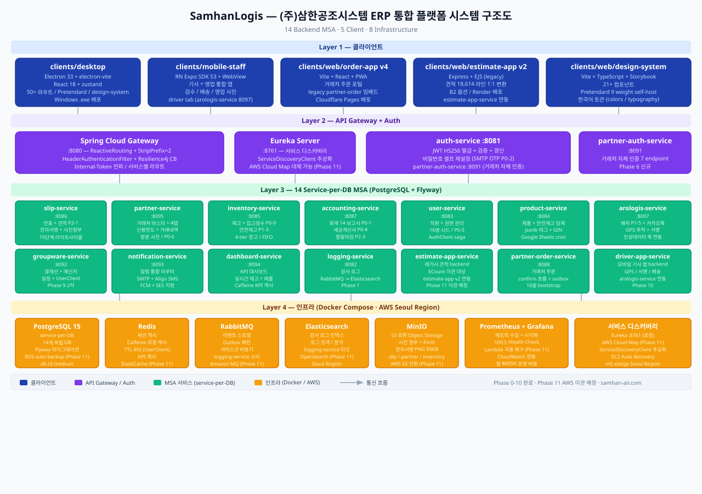

---

## 프로젝트 개요

| 항목       | 내용                                                                               |
| ---------- | ---------------------------------------------------------------------------------- |
| 아키텍처   | MSA (service-per-DB), Spring Cloud Gateway + Eureka + Resilience4j 회로차단        |
| 인증       | JWT HS256 (auth-service) + gateway HeaderAuthenticationFilter + Internal-Token     |
| 배포 형태  | 내부: Electron (Windows .exe) / 외부: Web (estimate / order) + Mobile (Expo)       |
| 진척률     | Phase 0 ~ 10.5 완료, **Phase 10.6 이카운트 마이그레이션 자율 연속 완료 — MIG-1~21 완료, 사용자 결정 대기** · **#845 DS-2 문서 레이아웃 영속/활성 렌더 완료** · **DS-3a 재인쇄 승인시점 레이아웃 pin 완료** · **DS-3b schema v2 3-pane 문서 양식 편집기 MVP 구현·검증 완료(CODEX LUNA)** · **DS-4 반복 품목행·로고·A4 인쇄 fidelity 완료** |
| 운영 단위 | **Samhan Public** (14 service, api.samhan-air.com) + **아로로지스** (독립 운영 단위, 같은 AWS 공유, api.arologis.samhan-air.com) — Phase 10.5 분리 후 |

---

### 최신 진행 메모 (2026-07-22)

- **#845 DS-3b 문서 양식 편집기 MVP**: desktop에 결재 문서 양식 목록과 3-pane 편집기(요소 팔레트·HEADER/BODY/FOOTER 캔버스·속성 패널)를 추가했다. schema v2의 `FIELD`/`TEXT` geometry/style/binding을 FE parser·BE typed JSONB record·실 PostgreSQL 왕복에 보존하고, v1 pin revision은 버전 dispatch와 메모리 upcast로 기존 renderer/golden 출력과 동일하게 유지한다. `ACTIVE` 직접 수정은 차단하고 비활성화 후 명시 저장만 허용하며, VIEW 전용·중복 key·실 `DocumentRenderer` 라이브 미리보기를 mock Playwright로 검증했다. Flyway 신규 변경은 없다. 상세 `docs/dev-reports/2026-07-22-845-ds3b-template-editor.md`.

### 최신 진행 메모 (2026-07-23)

- **#845 DS-4 문서 양식 고도화**: schema v2에 allowlist 기반 `DETAIL`·`IMAGE`를 additive 확장했다. `EstimateLineResponse`의 공급가액·부가세·부가세 포함 합계를 대조해 반복 품목행을 렌더하고, 로컬 로고/data URL 정책·7개 viewport 기하/hit-test·실제 2페이지 `page.pdf()` 헤더 반복을 검증했다. 신규 Flyway/API/design-system 컴포넌트는 없다. 상세 `docs/dev-reports/2026-07-23-869-ds4-document-template-advanced.md`.

### 최신 진행 메모 (2026-07-19)

## 🏗️ 프로젝트 구조

## #825 슬6 메신저 수신자 칩 복수선택 (Issue #866 / PR #892)

2026-07-22 기준 쪽지 발송 화면을 데스크톱 `/messenger`로 신설했다. `MultiSelectAutocomplete`로
재직자 수신자를 최대 50명까지 칩으로 복수선택하고, 수신함은 읽기 전용으로 제공한다. 그룹웨어는
`POST /admin/groupware/messages/bulk` 원자적 복수 발송과 `GET /admin/groupware/messages/recipient-search`
전용 검색을 제공하며, user-service의 `activeOnly=true` 검색은 퇴사자를 제외한다. 기존 단건
`POST /admin/groupware/messages` 계약은 유지하고 deprecated 표기만 추가했다. 신규 스키마 변경은
`V14__add_messages_batch_id.sql`의 nullable `messages.batch_id`와 partial index 한 건으로 제한했다.
상세 결정·RED→GREEN 근거·검증 결과는 [`docs/dev-reports/2026-07-22-825-s6-messenger-chip-bulk.md`](docs/dev-reports/2026-07-22-825-s6-messenger-chip-bulk.md)를 따른다.

## #825 슬5 null-semantics (PR #864 R2)

일마감·안전재고·CODEF 쓰기 범위는 `scopeMode=ALL|SELECTED`를 명시한다. CODEF의 저장된
`defaultImportType`은 재가져오기 실행 범위에도 그대로 적용되며, V64 `scope_mode`는 기존 행을
보수적으로 `SELECTED` backfill한다. V64 적용 후 구버전 앱을 롤백해도 신규 scope INSERT가
깨지지 않도록 DB 기본값 `SELECTED`를 유지한다. 저장된 `scopeMode=ALL` 실행에서는 BE가
저장 `defaultImportType`을 요청 `type`보다 우선하며, `SELECTED` 실행은 명시 ref 집합 계약을
유지한다. 상세 결정은 `migration/decisions/DECISIONS.md`와
`docs/dev-reports/825-s5-null-semantics-r4.md`의 HIGH-1 기록을 따른다.

### 백엔드 (17 = 15 도메인 서비스 + 게이트웨이 + 디스커버리, MSA service-per-DB)

| 서비스 | DB | 역할 |
|---|---|---|
| **api-gateway** | — | Spring Cloud Gateway — 라우팅·JWT 검증·HeaderAuthenticationFilter·Internal-Token 주입 |
| **eureka-server** | — | 서비스 디스커버리 |
| **auth-service** | auth_db | 인증(JWT HS256)·계정·권한그룹·page-code 권한·결재라인 config |
| **user-service** | user_db | 직원·부서·급여·전자서명·역할변경 |
| **product-service** | product_db | 품목·카테고리·세트(번들)·사양·DC·견적 lookup(자재/실외기/분기) |
| **inventory-service** | inventory_db | 창고·재고(잔고/Lot/시리얼)·이동·재고실사·입고검수·창고이동 |
| **slip-service** | slip_db | 입출고전표·견적·거래처+품목 최근단가 기억·배차·협업(collab/presence)·외부배송 |
| **accounting-service** | accounting_db | 분개·회계전표(판매/구매)·세금계산서·현금·은행·채권·CODEF |
| **partner-order-service** | partner_orders | 거래처 주문(주문서)·임시저장·편집요청 |
| **partner-service** | partners | 거래처 마스터·연락처·배송지·여신이력·첨부 |
| **partner-auth-service** | partner_auth | 거래처 로그인(사업자번호 passwordless)·세션 |
| **dc-config-service** | dc_config | 거래처 DC 설정·견적 가격 파라미터(estimate_configs) |
| **groupware-service** | groupware_db | 결재(approval)·쪽지·일정 |
| **notification-service** | notification_db | 알림(SMS/push)·알림센터·카톡방 매핑 |
| **dashboard-service** | dashboard_db | KPI·매출집계·실시간재고·앱 릴리스/공지 |
| **logging-service** | Elasticsearch | 감사로그(@Document, 월별 인덱스 롤링) |
| **arologis-service** | arologis_db | (독립 운영 단위) 배차·기사·차량·전자서명·간이회계·행정 |

### 클라이언트 (8)

| 클라이언트 | 스택 | 용도 |
|---|---|---|
| **desktop** | Electron + React | 내부 직원 백오피스 (Windows .exe) |
| **web/design-system** | React + Storybook | 공용 디자인 시스템(@samhan/design-system) |
| **web/estimate-app** | React (Vite) | 종합견적서 (레거시 GAS 1:1 이식) |
| **web/order-app** | React (Vite) | 거래처 주문서 |
| **mobile-public** | Expo RN | 거래처 모바일 |
| **mobile-staff** | Expo RN | 직원 모바일 |
| **arologis-desktop** | Electron + React | 아로로지스 행정 백오피스 |
| **arologis-mobile** | Expo RN | 아로로지스 기사 앱 |

### shared 모듈

| 모듈 | 역할 |
|---|---|
| **common** | `BaseEntity`(7 audit 필드 + soft-delete)·`ApiResponse`·예외·ErrorCode |
| **security** | JWT·`InternalTokenFilter`·`@RequirePermission`·`DynamicPermissionClient` |
| **discovery-abstraction** | Eureka 디스커버리 추상 |
| **realtime-abstraction** | SSE·`PresenceService`(협업 동시 접속자) |
| **collab-core** | 협업(수정완료 1-인 모델 / 코멘트 / diff / 알림) 공유 |
| **ecount-io** | 이카운트 마이그레이션 IO |

---

## 🗄️ DB ER 다이어그램 (service-per-DB)

> 각 서비스는 **독립 DB**를 가지며 서비스 간은 **물리 FK 없이 UUID 논리 참조**(점선)로 연결된다. 모든 엔티티는 `shared:common`의 **`BaseEntity`(id UUID PK + created/modified/deleted ×(at/by) + is_deleted soft-delete)** 를 상속한다(다이어그램에서는 생략). GitHub 가 아래 Mermaid 블록을 자동으로 **다이어그램 이미지**로 렌더한다.

### 신원·권한·카탈로그 — auth / user / product

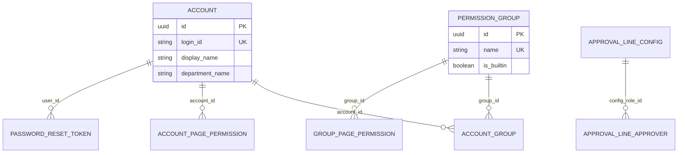

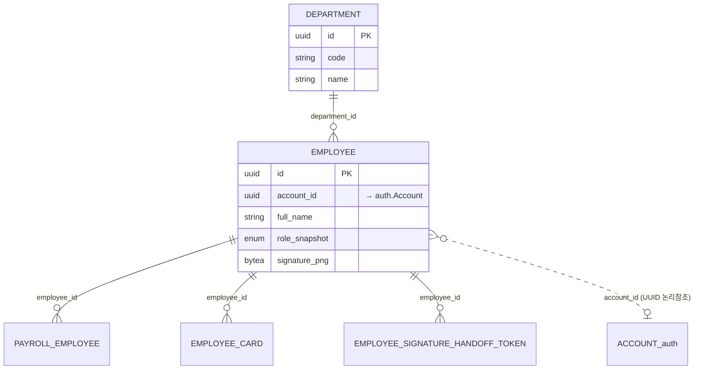

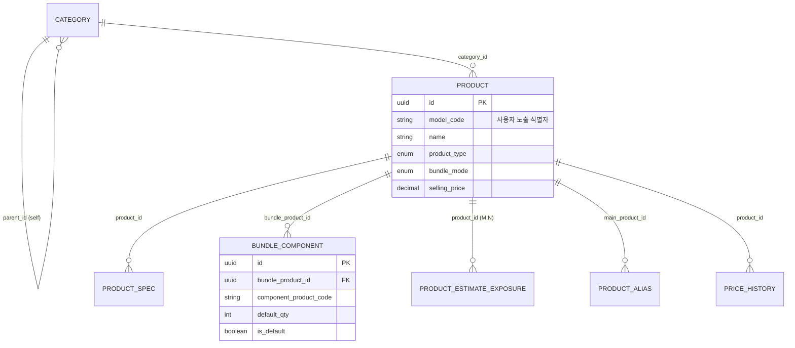

### 핵심 운영 — inventory / slip / accounting

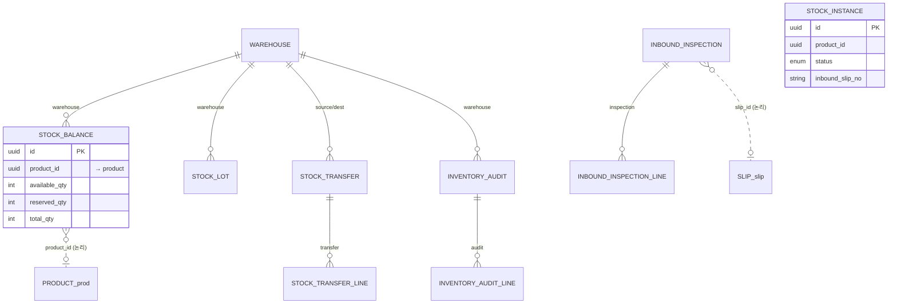

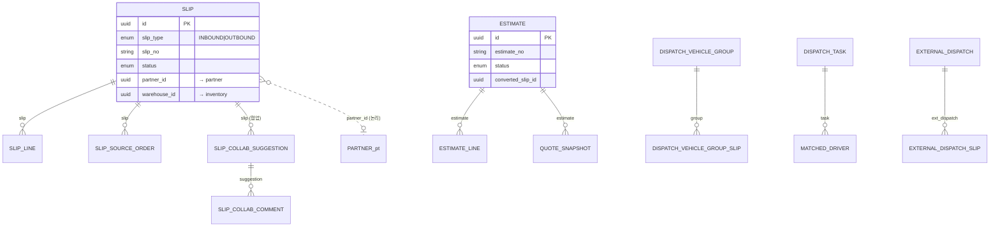

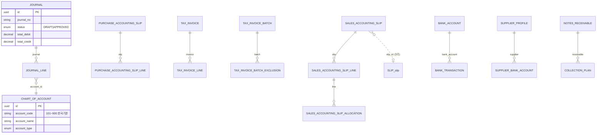

### 거래처·영업 — partner-order / partner / partner-auth / dc-config

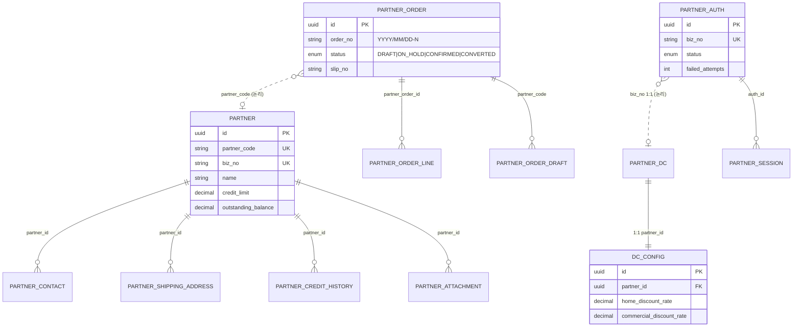

### 협업·알림·대시보드 — groupware / notification / dashboard / logging

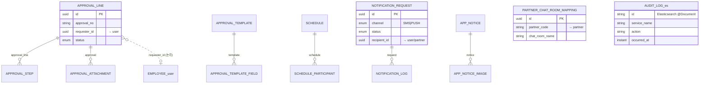

### 아로로지스 (독립 운영 단위) — arologis

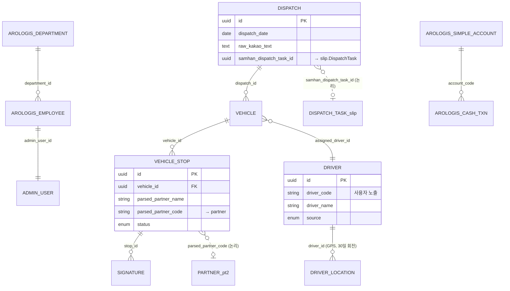

### 서비스 간 논리 참조 (UUID, 물리 FK 없음)

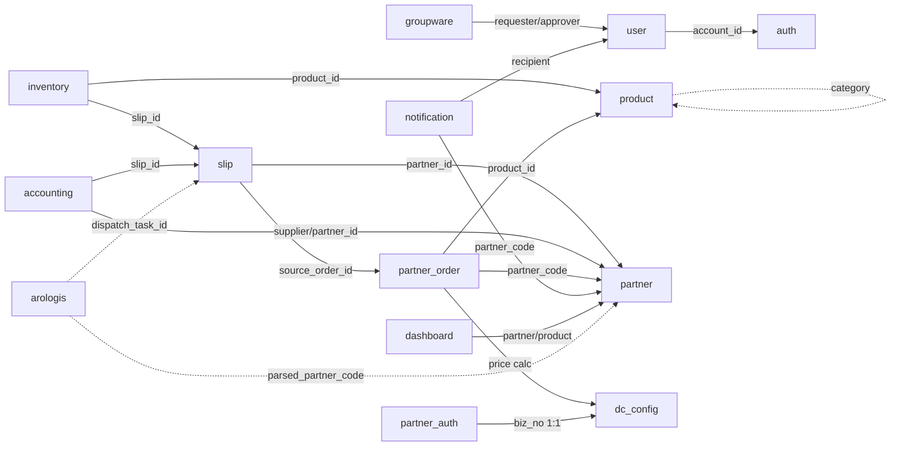

---

### 최신 진행 메모 (2026-07-19)

- **전표 거래처 필수화 — 생명주기 전이 가드** (PR #853): OUTBOUND/INBOUND 전표가 committed 단계(SENT 이후)로 전이할 때 거래처(`partner_id`) 필수 불변식을 강제해, 거래처 없는 committed 전표(#823 배분 원천 오귀속·세금계산서·분개 오귀속의 뿌리)를 원천 차단했다. `Slip.send()`(SAVED→SENT)·`restoreFromSnapshot()`(revision 복원·표준+협업 공통)·forward 전이(accept~confirm/reject 8종 `requirePartnerForCommitted()`) **3중 도메인 가드** + 주문→전표 발행 `SlipPublishService.resolveCommittedPartnerId` fail-closed(FOUND+partnerId 만 성공·NOT_FOUND/5xx/SKIPPED/FOUND-empty 전부 차단)를 두되, DRAFT/SAVED(편집 단계)는 거래처 null 허용해 컬럼 NOT NULL 은 비채택(불변식 = `status ∈ REQUIRED_PARTNER_STATUSES ⟹ partner_id != null`, 전 상태−{DRAFT,SAVED,CANCELED}). 기존 위반 전표는 동일 릴리스 cutover 보정(slip-service 내부 엔드포인트 `POST /internal/slips/backfill-committed-partners`·partner_code→partner_id 멱등 해소·dry-run·미해소 리포트·audit)으로 정정한다. 라이브QA로 음성(무거래처 전송 400 차단)·양성(거래처 지정 후 SENT)·보정(§8 위반 → 0)을 실증. 상세 `services/slip-service/README.md` · `docs/dev-reports/2026-07-19-slip-partner-required-transition-guard.md`.
- **documentType 컬럼 40→70 확장** (PR #852, #848): 그룹웨어 결재/문서 `document_type` 컬럼을 40→70 로 확장(groupware V11 + auth V89, `SET LOCAL lock_timeout` 선행·backfill). 엔티티 length 70 · DTO `@Size` 70 정합.

### 최신 진행 메모 (2026-06-30)

- **협업 코-에디팅 S2b — slip 문서전역 수정/버전 로그**: S2a 전체 폼 Yjs 바인딩 위에서 저장 PUT 흐름은 유지하고, `slip_revisions` 기존 스냅샷 이력에 헤더 필드/품목 셀 단위 변경 목록을 산출해 붙였다. 기록 단위는 `fieldPath`/라벨/이전값/새값/수정자 표시명/수정자 단일색상/시각이며, direct PUT 입고·출고 수정 경로가 실제 변경 시 EDIT revision 을 남긴다. desktop `SlipVersionHistoryPanel`은 버전별 필드 변경을 표시하고 UUID/connectedId 대신 displayName + `presenceColor` 계열 단일색상만 노출한다. 수정 카운트와 레드라인은 S2c/S2d 후속 범위로 유지한다.

### 최신 진행 메모 (2026-06-24)

- **출고전표 배송일정(M상N하) 자동 — 구조화 태그** (PR #595): 배송태그(지방/야적)별 **상차(M=출고일 잠금)/하차(N)** 일정을 규칙대로 자동 계산해 **구조화 필드 `unload_date`**(V52)로 보유, 특이사항 앞 파생 라벨 **`25상26하`/`당착`**(`deliveryScheduleLabel`, 메모 미저장). 규칙: N=M+1, **N이 일요일→월요일**(단 야적+M=토→일요일), 지방+N==M→`당착`. **N 편집·당착 옵션**·M 잠금. 컷오프 8지점과 동일 지점에 `applyDeliverySchedule` 배선(태그 신규/변경 OR override 시만 재계산 — 사용자 override 보존). desktop SlipForm 하차일/당착 + 조회/인쇄 라벨. 레거시 `applyDeliveryTagAutoMemo`(memo prepend) 폐기. 라이브 QA 9/9(주말규칙 실API 지방토→월·야적토→일).
- **출고전표 컷오프(마감) 시간 설정 — 인사 메뉴** (PR #594): 배송태그별 마감 시각을 인사 메뉴에서 동적 CRUD(`slip-service` `slip_outbound_cutoff` V51 — 지방 12:00·야적 14:00·경동택배/화물 15:00 시드, 태그당 활성 1행)하고, **출고전표에 배송태그가 확정되는 8지점(생성 6 + 태그확정 editHeader/v20 2)** 에서 당일·마감 초과 시 **409 차단**(`OutboundCutoffGuard`, KST `Clock`). 5/6 생성 경로는 DRAFT를 태그 null로 만들고 SlipForm에서 태그를 확정하므로 "배송태그가 붙는 순간" 마감이 적용된다. page-code `hr.slip-cutoff`(MASTER/MANAGER, auth V70 account-mode 4-table), gateway `/admin/slip-cutoffs`(no-strip). desktop 인사 메뉴 설정 페이지 + 출력문서(`DispatchDocument`)에 배송주소 앞 배송태그(`[지방]`) 표시. 라이브 QA에서 마감 전 201 / 후 409 / 내일 201 인과 실증.
- **검수완료 → 배차발송 에픽 완결**: 슬1에서 검수완료 출고전표를 배차 발송 대기 진입점으로 연결하고 아로로지스 기존 배차 경로를 보존했다. 슬2는 `slip-service`에 **외부기사/배송사 마스터(`external_carrier`)** 를 추가했고, 슬3는 **타배송사 SMS 발송(`external_dispatch`)** 을 구현했다. 슬4는 **타배송사 인쇄 배차의뢰서(PRINT/BOTH)** 를 완성했다. `POST /admin/external-dispatches` 는 `SMS`/`PRINT`/`BOTH` 채널을 지원하고, `GET /admin/external-dispatches/{id}/print-data` 로 A4 배차의뢰서 데이터를 제공한다. PRINT 는 SMS 호출 없이 즉시 SENT + `slip.dispatchStatus=DISPATCHED`, BOTH 는 SMS 결과에 따라 SENT/FAILED 를 기록한다. desktop 배차 보드 모달은 SMS/인쇄/SMS+인쇄 채널 선택과 `/dispatch/external-dispatch/{id}/print` 인쇄 진입을 제공한다. Flyway/권한 신규 시드 없이 `dispatch.board` 를 재사용하며, 화면 식별자는 배송사명/연락처/전표번호/배송지/수령자/품목요약만 사용한다.

### 최신 진행 메모 (2026-06-20)

- **§7 전역 협업 — presence(동시 접속자) 4문서 롤아웃** (PR #545): 슬립 presence MVP(PR #515) 후속으로 **회계전표·주문·견적·그룹웨어 결재 4문서**에 동시 접속자 presence 를 순수 additive 배선했다. 각 `{Doc}CollabController` 에 슬립 `SlipCollabController` 1:1 복제로 `POST /collab/presence/join`·`/leave`·`GET /collab/presence`(200) + presence DTO·helper·`@ExceptionHandler` 를 추가하고(`shared:realtime-abstraction` `PresenceService` 자동 빈 — 추가 설정 0), FE 4 패널에 문서별 `{Doc}PresenceClient` + `usePresence` + `<PresenceIndicator/>` 를 배선했다(client override 로 슬립 경로 교차오염 방지). **신규 권한 page-code·시드·Flyway = 0**(각 문서 기존 댓글 VIEW page-code 재사용). presence wire payload = `{sessionId, displayName, color}` 만(UUID 비공개, IT 박제). 라이브 Docker 실 QA 4/4(API + 2세션 UI `docs/qa/collab-presence-rollout/`, master + 문서별 2차 사용자 동시 진입 "현재 보는 중" 상호 표시) + 각 서비스 presence IT(실 Postgres). 배차(FE 패널 미존재, comment-only)는 **PR2 별도 슬라이스**. dev-report: `docs/dev-reports/2026-06-20-collab-presence-rollout.md`.

### 최신 진행 메모 (2026-06-13)

- **§7 전역 협업 에픽 — 입출고전표 "수정완료(1-인)" 레퍼런스** (PR #474, 슬라이스 0):
  - §7 = **전역 협업 플랫폼 에픽**(대부분 메뉴 화면 — 전표·견적·회계전표·주문·배차·미배차/가배차·그룹웨어 결재 등 — 에 협업: 수정완료 + 코멘트 + diff + 알림). 슬라이스 0 = **입출고전표를 레퍼런스로 확정** 후 문서별 슬라이스로 동일 워크플로우 롤아웃. `shared:collab-core` 재사용.
  - **본질 = 제안/수락(2-인) 아닌 전표 "수정(1-인)"**: 확정(CONFIRMED)/완료(COMPLETED) 전표를 **권한자 본인이 "수정"→편집→"수정완료" 1회 커밋**(별도 수락자 없음). Google Docs 참조 = "무엇이 어떻게 바뀌었는지 한눈에"(diff). 기존 "직접 수정 잠김→수정 요청"(edit-request) 흐름 **완전 대체**(삭제 요청만 보존).
  - **BE**: `SlipCollabEditService.commitEdit`(`POST /collab/edits`, 단일 트랜잭션: 권한 → enrich(before diff) → `applyOverlayPatchBatch`(물리종결 SHIPPING/DELIVERED/CANCELED/REJECTED만 409·다필드 1버전·audit델타·SSE) → ACCEPTED 이력 → 인-트랜잭션 동기 알림(best-effort)). 수정 이력 diff(`GET /collab/edits`). 코멘트(`SlipCollabComment`)·실시간 SSE. 권한 `slip.audit-overlay`/`slip.comments` 재사용.
  - **알림 일반화(슬라이스 0)**: 수정완료 시 **① 기여자(작성·수정 이력·코멘트 작성자) + ② 다음 결재자(출고인·검수인, 없으면 skip)** 에게 알림(현재 수정자 제외). `collab-core.resolveNotificationRecipients` 추상 + `UserIdResolver`(username/사번 → auth `by-login` → UUID).
  - **FE**: 전표 상세 "수정" 버튼(COMPLETED=완료 버튼 자리 대체)→편집모드(overlay 11필드)→"수정완료". 수정 이력 **diff 뷰**(이전값→새값·수정자·시각). UUID 비공개. design-system.
  - **검증**: slip+auth 전체 테스트 0실패(`SlipCollabIT` 실 Testcontainers Postgres, UserIdResolver/auth by-login). 실서버 Docker QA — dev_master 실로그인, 확정전표 수정완료 → memo 실변경 + diff 이력(UI 9컷). 다모델 리뷰 사이클 진행(각 라운드 실서버 스크린샷, 다음 리뷰어 0에러까지 → PM 머지).
- **§7 슬라이스 1 — 회계전표(`Journal`/분개) 협업** (PR #475): collab-core 패턴을 accounting-service 에 복제. 엔티티=`Journal`(DRAFT→POSTED→REVERSED), 확정/완료=POSTED. **수정완료 편집 = 적요(`description`)+라인메모(`JournalLine.memo`) 비-원장 필드만**(차대변 금액/계정 불변=역분개 경로, 원장키 changeSet 400 거부 — 회계 무결성). `COLLAB_LOCKED={REVERSED}`. **알림=기여자만**(결재자 없음 → "다음 결재자 없으면 예외"). page-code `accounting.journals` 재사용. `JournalCollabController`(`/accounting/journals/{id}/collab`) + V36 + FE `JournalDetailPage` 협업 패널. **collab-core 근본 fix**: `CollabCoreAutoConfiguration @AutoConfigureAfter(RealtimeAutoConfiguration)`(auto-config broker 의존 서비스 publisher 누락 방지, 에픽 전체 이득). 검증: `JournalCollabIT` 9건(실 Postgres)·실서버 Docker QA 9컷(수정완료·diff·코멘트).
- **§7 슬라이스 2 — 주문(`PartnerOrder`) 협업** (PR #476): collab-core 패턴을 partner-order-service 에 복제. CONFIRMED 주문 수정완료(편집=`memo`+`dueDate`+라인 `remark`만, 품목/수량/단가/금액 불변·핵심키 400). `COLLAB_LOCKED={CANCELED,CONVERTED,CONFIRMING}`. 알림=기여자만. page-code `sales.partner-order.*` 재사용(주문번호 이미 슬래시). 라인키=활성라인 1-based index(`@OrderBy` 결정성). **실서버 P1 적발·해소**: collab 컨트롤러 `@PathVariable UUID`→`String`+`PartnerOrderIdResolver`(FE 하이픈 path-id 400 — mock 미검출, 실서버/dual-model 적발 → 머지 전 차단). Round A(Opus)/B(Codex)/C(Opus) 0 차단. 검증: `PartnerOrderCollabIT`(실 Postgres)·full partner-order 테스트·desktop playwright 509/509·실서버 Docker QA 9컷.
- **§7 슬라이스 3 — 견적(Estimate) 협업** (PR #477) · **슬라이스 4 — 배차(Dispatch) 협업** (PR #478): collab-core 패턴 복제. 견적(memo/유효기간/라인 비고)·배차(비고/기사 메모) 수정완료 + diff + 코멘트. 라이브 QA 가 견적 force-increment·배차 afterCommit revert 운영파손 단독 적발(IT-가림). 상세 dev-report 참조.
- **§7 슬라이스 6 — 그룹웨어 결재(`ApprovalLine`) 협업 + 결재자 칩** (PR #480, 에픽 완결): collab-core 6번째 문서. 결재 FE 신규 구축(목록/상세) + 수정완료(제목/내용) + **결재유형 템플릿 빌더**(동적 필드) + **통합 문서 참조 첨부**(출고/입고전표·분개장·세금계산서·거래명세서·거래처원장) + **결재자 사원검색 칩 + 결재선 실명**(개발책임자 요청 — 다중 추가 입력은 캡슐(칩) 통일, 품목 표 제외). page-code `groupware.approvals`. 검증: user/groupware Testcontainers IT(bulk display-name·중복 결재자)·실서버 Docker QA(결재자 칩/실명/첨부 칩)·Opus 5-agent + Codex cross-check 리뷰 수렴(라이브 QA가 SAMHAN_USER_SERVICE_URL 운영파손 단독 적발).

### 최신 진행 메모 (2026-06-11)

- 좌측 메뉴 5대분류 재편 + 접기/펼치기 완료 (PR #462):
  - 좌측 메뉴를 **상단 고정 2(홈·알림 내역) + 7 그룹**(판매/구매/회계/그룹웨어/인사 + 배차·창고 운영)으로 재편하고 '홈'을 최상단 신규 항목으로 두었다(기존 '대시보드' 리라벨). 본 슬라이스는 **IA 재배치(컴포넌트 이동·그룹핑·라벨)만**이며 라우트·page-code·권한 로직은 무변경이다. 그룹 헤더 노출은 기성 `dynamicCanAccess`(SP-D1~D4 동적 RBAC) 단일 소스로 그룹 자식 권한이 1개라도 있으면 표시하고, 전무 시 그룹을 완전 미렌더한다(권한 필터 보존). 배차 그룹 라벨은 코드명 `arologis`→업무 라벨 '배차'로 정정했다.
  - 하위 메뉴 **접기/펼치기**를 도입했다. `SidebarCategory` 헤더를 토글 버튼으로 일반화하고 기본은 접힘(과도 메뉴 최소화), 활성 라우트가 속한 그룹만 자동 펼침, 사용자 토글 상태는 `localStorage['samhan.sidebar.group.<label>']`로 영속한다(`role=heading`/`aria-expanded`/`aria-controls`/`role=group` 접근성).
  - **단톡방 매핑을 그룹웨어 단일 노출로 통일**했다(인사 셸 AdminLayout 중복 제거, 라우트/권한 가드 유지).
  - **주문서 승인(`/sales/order-approvals`) 보안 게이트**를 추가했다. 가드 전에는 controller 에 `@RequirePermission`이 전무하여(fail-open) 권한 없는 인증 직원이 URL 직접 진입으로 거래처 승인변경·비밀번호 강제초기화가 가능했다. FE 라우트 PermissionGuard + **partner-auth-service `PartnerApprovalsController` @RequirePermission**(`sales.partner-order.list`, FE 사이드바 게이트와 동일 page-code)을 page-code 일원화로 추가하고, `:shared:security` 의존과 lockout 방지 bean(`DynamicPermissionClientConfig`), enforcement IT(grant→!403/deny→403+counter/MASTER bypass/PARTNER deny, 실 HTTP 회귀)를 신설했다.
  - 4-라운드 다모델 리뷰(Opus 5확정 + Codex 7확정 + Fable5 14확정 — Fable5 가 CI-RED 2·보안 1 적발) + Docker 실서버 QA 13컷(`docs/qa/menu-5category/`). desktop mock 468 pass / partner-auth IT 13/13.
  - dev-report: `docs/dev-reports/2026-06-11-desktop-menu-5category.md`. 결정: `migration/decisions/DECISIONS.md` D-M5C-01 ~ D-M5C-05.

- 품목관리 고도화 완료 (PR #461):
  - 구글 시트를 **최초 시드 전용**으로 격하했다. `ProductSheetSyncScheduler` 의 cron + 부팅 sync 를 `samhan.product.sheet-sync.cron-enabled`(기본 false) 게이트로 비활성하고(재시작·주기 sync 로 사용자 표시순서가 시트 기준 재적재되어 소실되는 것 방지), 시드 재적재는 비상 수단인 수동 trigger 만 유지한다. desktop 품목관리 화면의 출처 컬럼·뱃지는 제거했다.
  - **세트 가시화 + 구성품 편집기**를 추가했다. 카탈로그 목록에 `productType`/`componentCount`(BUNDLE 구성품 수, 벌크 count N+1 방지)를 노출하고, `GET·PUT /api/v1/products/{code}/components`(replace-all)로 세트 구성품을 직접 편집한다. 검증은 BUNDLE 아님 409 / 빈 배열·자기참조·미해소 코드·세트-안-세트·중복 코드 400이며, 해소 축은 전개(expander)와 동일한 `model_code`-only로 두어 전표 전개 단가 오류를 차단한다. V15 가 `bundle_component.display_order` 컬럼 + 부분 인덱스를 추가한다.
  - **표시 순서 직접 조정**(`@dnd-kit/sortable` 드래그 → `PUT /api/v1/products/display-orders` 일괄)을 추가했다. 견적/주문 노출 품목에만 표시·적용하고, 자동 재번호 범위는 `estimateCategory` 동일 군으로 한정한다(혼합 400).
  - **품목 설정 실시간 동기화**를 전표 SSE 패턴으로 재사용했다. `ProductCatalogChangePublisher` 가 usage PATCH/DELETE·components PUT·display-orders PUT publish 를 afterCommit 으로 통일하고, FE `ProductRealtimeClient` 가 `GET /api/v1/products/catalog-realtime`(목록 레벨 SSE)를 구독해 동시 시청자 화면을 실시간 갱신한다.
  - **세트 재고 표시 금지** 가드를 적용했다. SlipFormPage·주문 상세 재고조회 모달은 BUNDLE 라인을 제외하고(전부 세트면 "구성품 단위" 안내, 혼합이면 제외 캡션), SlipDetailPage 는 전개 저장으로 BUNDLE 부모 라인이 없어 가드 불요로 판정했다. partner-order 주문 상세는 `#23` productType enrich(modelCode 일괄조회 fail-soft)로 라인 BUNDLE 여부를 전사한다.
  - api-gateway 라우트 3종(`product-components-v1`/`product-display-orders-v1`/`product-catalog-realtime-v1`) 추가. 4-라운드 다모델 리뷰(사이클1 통합 + Opus 16 + Fable5 + Codex 8) + Docker 실서버 QA 12컷(`docs/qa/product-catalog-enhance/`).
  - dev-report: `docs/dev-reports/2026-06-11-product-catalog-enhance.md`. 결정: `migration/decisions/DECISIONS.md` D-PCE-01 ~ D-PCE-07.

### 최신 진행 메모 (2026-06-03)

- 시리얼 재고 동시성·보상 강화 완료:
  - inventory `reserveBatch`/`recallBatch` 후보 조회에 `PESSIMISTIC_WRITE` row lock 변형을 적용해 서로 다른 전표가 같은 시리얼 후보를 중복 선택하지 않도록 했다.
  - `StockInstance.unrecall()` + `POST /inventory/instances/unrecall-batch` + slip `InventoryClient.unrecallInstances` 를 추가했다.
  - `SlipService.completeRecallInbound` 는 serial recall 성공 후 batch inbound 실패 시 unrecall 보상을 역순 실행하고, 보상 실패는 원 예외에 suppressed 로 연결한다.
  - Testcontainers IT: inventory `StockInstanceOutboundIT` 12 tests / 0 skipped, slip `SlipInboundInstanceIT` 10 tests / 0 skipped.
  - dev-report: `docs/dev-reports/slice-serial-concurrency-compensation.md`.

### 최신 진행 메모 (2026-05-28)

- 권한 재편 Phase 1 (진행): role 기반 2-action(VIEW/EDIT) 동적 RBAC을 **계정 × page × 7-action**(VIEW/CREATE/UPDATE/DELETE/RESTORE/DOWNLOAD/PRINT)으로 전환했다.
  - `PermissionAspect`가 `X-User-Id`(계정 UUID) 기준으로 `account_page_permissions` 7-action을 확인한다. MASTER는 short-circuit bypass, PARTNER는 deny.
  - role은 enforcement에서 분리되어 비강제 템플릿(`role_page_permission_templates`)으로 잔존하고, MASTER 매트릭스 UI의 "템플릿 적용" 소스로만 쓴다.
  - Flyway V39가 기존 role grant를 계정별로 **행동보존 자동전개**(VIEW→VIEW, EDIT→CREATE+UPDATE+DELETE, RESTORE/DOWNLOAD/PRINT 보존 매핑)하여 회귀 0.
  - 14 service ~380 `@RequirePermission` 재주석화 + `EstimatePermissionGuard` account 전환 + dead guard 3개 삭제. desktop `PermissionMatrixPage`를 계정×page×7action 평탄 매트릭스로 재작성 + 다계정 일괄 wizard.
  - FE 자기-권한은 `GET /auth/admin/permissions/my`를 account 기반 7-action으로 전환(internal endpoint 403 회피). RESTORE 메커니즘과 DOWNLOAD 포맷 분기는 Phase 2 이월.
  - spec/plan/dev-report: `docs/superpowers/{specs,plans}/2026-05-28-permission-overhaul-phase-1-framework*`, `docs/dev-reports/phase-1-permission-overhaul-framework.md`.

- SP-D7 (완료): 잔여 `@PreAuthorize("isAuthenticated()")` 조회 endpoint 23건을 `@RequirePermission(..., VIEW)`로 전환했다.
  - auth-service V38 seed는 `PARTNER`를 제외한 내부 role에만 VIEW grant를 보강한다.
  - 기존 VIEW endpoint가 있던 page는 전용 `.view` page code(`sales.partner-order.history.view`, `products.list.view`, `partners.detail.view`, `inventory.stock-balance.view`)로 분리해 widening을 피한다.
  - `estimates.list` 조회 2건은 `EstimatePermissionGuard`가 이미 RBAC를 강제하므로 `isAuthenticated()`를 유지하고 V38 widening 대상에서 제외한다.
  - Employee 역할 변경/퇴사와 inventory Type B widening 위험 endpoint는 더 엄격한 `@PreAuthorize`를 유지한다.
  - 대상 서비스는 auth, notification, inventory, partner, product, slip, partner-order, user다.

### 최신 진행 메모 (2026-05-21)

- MIG-22 (완료): IDE workspace + PROBLEMS 정리를 완료했다.
  - Gradle Java leaf project에 Eclipse plugin을 적용해 `./gradlew eclipse` / `eclipseClasspath`가 `shared:ecount-io` 프로젝트 의존성을 생성하도록 했다.
  - VS Code/Eclipse workspace stale 상태는 `shared/ecount-io`를 Gradle project로 인식시킨 뒤 Java/Gradle workspace refresh로 복구한다.
  - desktop TypeScript `baseUrl` deprecation은 로컬 TypeScript 5.9 허용값인 `ignoreDeprecations: "5.0"`으로 고정했고, Java unused import 69건과 VehicleTonnage legacy enum 직접 사용을 정리했다.

- MIG-21 (완료): 마이그레이션 운영 대시보드를 추가했다.
  - accounting-service Micrometer 지표를 `/actuator/prometheus`로 노출하고 dashboard-service `/api/v1/dashboard/ecount-mig`가 운영 DTO로 요약한다.
  - desktop 회계 관리자 그룹에 `운영 대시보드` 6카드 화면을 추가하고 React Query 5분 polling을 적용했다.
  - Grafana 8패널 JSON과 observability import 가이드는 `docs/observability/`에 둔다.

- MIG-20 (완료): 이카운트 raw 자동 재import 스케줄 기반을 추가했다.
  - `POST /admin/ecount/reimport/{slice}` MASTER 전용 endpoint로 `mig-1`~`mig-11` raw 파일을 slice 단위로 재스캔한다.
  - `source_file_hash`와 `staging.ecount_reimport_file_runs` 기준 멱등 skip을 적용하고, 결과는 `EcountReimportResult`로 files/import/reject/error sample을 반환한다.
  - 운영 절차는 `docs/migration/ECOUNT-CUTOVER-GUIDE.md` §7에 Linux crontab, Windows Task Scheduler, curl, Slack alert 연동 예시로 문서화한다.

- MIG-19 (완료): 이카운트 cutover 운영 가이드를 docs-only로 정리했다.
  - `docs/migration/ECOUNT-CUTOVER-GUIDE.md`에 raw 11종 다운로드, DB 백업, `X-Internal-Token`, 권한 검증을 적는다.
  - MIG-1~11 순서별 endpoint, 응답 sample, 로그 위치, admin UI 확인 절차를 운영자용 한국어로 묶는다.
  - soft-delete 복구, `JD-`/`JR-` Journal 접두사 충돌 확인, staging `PENDING` 재실행, DailyClosing 대조 SQL을 포함한다.

- MIG-18 (완료): admin UI 2단계 보강을 완료했다.
  - Cash / Order / Ledger 목록에 filter chip과 전체 초기화를 적용했다. (당시 AgingSnapshot 목록도 포함됐으나 해당 화면은 슬1 PR #518에서 제거됨 — 네이티브 partner-aging 보고서로 대체.)
  - page size 50/100/200/500과 "회계 관리자" collapse/expand 메뉴 그룹을 연결했다.

- MIG-17 (완료): Designer tokens.md와 mock 라벨을 실제 화면 API enum 계약으로 동기화했다.
  - CashKind 라벨은 `EXPENSE_VOUCHER=지출결의서`, `MANUAL_DISBURSEMENT=수기 지출`로 고정한다.
  - CashReceiptKind 라벨은 `DEPOSIT_REPORT=입금보고서`, `MANUAL_RECEIPT=수기 입금`, `BANK_LINKED=통장연계`로 고정한다.
  - OrderProgressStatus 라벨은 `COMPLETED=완료`, `IN_PROGRESS=진행`, `CANCELED=취소`, `PENDING=대기`로 고정한다.
  - Ledger mock은 `transformStatus`(`PENDING` / `TRANSFORMED` / `REJECTED`) 기준 변환상태 chip으로 정리한다.

- MIG-16 (완료): MIG-14 사후 BE Minor 백로그를 정리했다.
  - partner-service에 `/internal/partners/lookup-by-ids` batch endpoint를 추가하고, accounting-service admin 조회의 partnerName N+1 호출을 batch 1회로 전환했다.
  - `/api/v1/accounting/aging-snapshot`은 `Pageable` 기반 page/size 응답으로 바꾸고 기본 100 / 최대 500으로 제한했다. ⚠️ 이 endpoint 와 desktop AgingSnapshot 화면은 **이카운트 네이티브 편입 슬1(PR #518)** 에서 제거됨 — 네이티브 `/accounting/reports/partner-aging` 보고서로 대체.
  - AppLayout 권한 캐시 로딩 중 보수적 deny를 적용했다.

- MIG-15 (완료): POI 의존성을 `shared/common`에서 `shared/ecount-io`로 분리했다.
  - `EcountXlsxSupport`와 POI 구현체 `ExcelExporter`를 새 module로 이동하고, `shared/common`에는 POI 비의존 DTO/exception만 남긴다.
  - `accounting-service`와 `partner-service`의 direct POI 선언을 제거하고 `shared:ecount-io` 의존으로 연결한다.
  - `arologis-service`, `slip-service`, `inventory-service`는 각각 `VendorExcelParser`, `SlipExcelExportIT`, `DpsExcelParser` 자체 사용 때문에 POI direct dependency를 유지한다.

- MIG-14 (완료): Order / Ledger admin UI 통합
  - `clients/desktop/src/renderer/routes/accounting/admin/` 아래 route로 조회 화면을 연결하고, `PermissionGuard` + MIG14 PageCode를 적용한다.
  - ⚠️ AgingSnapshot 화면(page-code `ecount.mig14.aging-snapshot`)은 **이카운트 네이티브 편입 슬1: 잔액 스냅샷 silo 폐기(PR #518)** 로 제거됨 — 거래처 미수/미지급은 네이티브 보고서 `/accounting/reports/partner-aging`로 대체.
  - ⚠️ Cash 화면(지출/입금, page-code `ecount.mig14.cash-list`)은 **이카운트 네이티브 편입 슬2: 현금 지출/입금 silo 폐기(PR #520)** 로 제거됨 — 현금 자료는 MIG-9 가 네이티브 journals 에 편입했으므로 분개장(`/accounting/journals`)·입금매칭·원장으로 대체. 슬1·슬2 누적으로 admin UI 는 4 화면 → **2 화면**(Order / Ledger)으로 축소.
  - 조회 DTO/화면은 UUID를 숨기고 `slipNo`, `journalNo`, `orderNo`, `partnerName`, `managerName` 등 업무 식별자만 표시한다.
  - MIG-12 백로그였던 30+ IT의 deprecated `DynamicPermissionClient @MockBean`은 shared/security 통합 인터페이스 mock으로 청소한다.
  - Playwright fixture는 placeholder만 사용하고, 자격 평문은 기존 `credential-plaintext-guard` + GitGuardian 기준으로 금지한다.

### 최신 진행 메모 (2026-05-20)

- MIG-3: 이카운트 회계 전표 4종(매입전표 I / 매출전표 I / 일반전표 / 회계전표분개) 마이그레이션 구현 진행. accounting-service V23 staging 4종, auth-service V16 MIG3 PageCode, 4 importer/controller, partner name lookup, account map 역방향 lookup, classpath fixture 4종을 추가했다.
- MIG-4 (PR #272): 이카운트 영업·세무 raw 4종 마이그레이션 — 세금계산서/판매전표/매출매입내역/주문서
  - TaxInvoice OUTBOUND + SalesAccountingSlipLine 보강 + staging only (summary/order)
  - V24 Flyway staging 4표 + TaxInvoiceStatus.MIGRATED + auth V17 PageCode 4종
- MIG-5 (PR #273): 이카운트 창고이동/지출결의서/입금보고서 raw 3종 마이그레이션
  - inventory V13 창고이동 staging + StockTransfer 도메인 변환
  - accounting V25 지출결의서/입금보고서 staging only + Partner aging cross-check
  - auth V18 PageCode 3종 + MIG5 ErrorCode 8종
- MIG-6 (PR #274): 이카운트 잔여 마스터 5종(통장계좌/사원/인사카드/급여관리사원/고정자산유형) 마이그레이션
  - accounting V26 통장계좌/고정자산유형 staging + domain
  - user V8 Employee `ecount_code` 보강 + EmployeeCard/PayrollEmployee 신규
  - 주민등록번호는 staging 적재 시점부터 `resident_number_masked`만 저장
- MIG-7 (PR #275): Cash 도메인 신규 + MIG-5 staging 변환
  - accounting V27 `cash_disbursements` / `cash_receipts` 도메인 + `slip_no`/`external_ref` UNIQUE
  - `staging.ecount_expense_voucher_raw` → CashDisbursement, `staging.ecount_deposit_report_raw` → CashReceipt
  - auth V20 PageCode 2종 + MIG7 ErrorCode 6종 + transform endpoint 2종
- MIG-8 (PR #276): Order 도메인 신규 + MIG-4 주문서 staging 변환
  - accounting V28 `orders` / `order_lines` 도메인 + `order_no`/`external_ref` UNIQUE
  - `staging.ecount_order_raw` → Order + OrderLine, 동일 `order_no` 다중 row grouping
  - 완료 주문은 `SalesAccountingSlip.slip_no` cross-link, miss는 warning sample 처리
  - auth V21 PageCode 1종 + MIG8 ErrorCode 7종 + transform endpoint 1종
- MIG-9 (본 PR): Cash → Journal 자동 생성 + Partner aging snapshot view
  - accounting V29 `journals(source_type, source_ref)` UNIQUE + `partner_aging_snapshot` MATERIALIZED VIEW
  - `cash_disbursements` / `cash_receipts` 의 `journal_id IS NULL` row를 POSTED Journal + JournalLine 2건으로 생성
  - ChartOfAccount 기본 lookup: 지급수수료 / 보통예금 / 외상매출금, missing은 `MIG9_DEFAULT_ACCOUNT_MISSING` reject
  - auth V22 PageCode 2종 + MIG9 ErrorCode 5종 + cash journal endpoint 2종 + aging snapshot refresh endpoint
  - ⚠️ aging snapshot refresh **endpoint**(`POST /admin/accounting/aging-snapshot/refresh`)는 슬1(PR #518)에서 제거됐으나, MV `partner_aging_snapshot` DDL 과 `Mig9AgingSnapshotRefreshService`(EcountReimportService 재import wiring)는 lineage 로 유지된다.
- MIG-10 (PR #278): Order Employee cross-link + Partner aging net view 보정
  - accounting V30 `orders.manager_employee_id` UUID + active index, `partner_aging_snapshot` DROP + RECREATE + `net_receivable`/`net_payable`/`net_cash`
  - `POST /admin/accounting/orders/backfill-employee-cross-link`로 `manager_name` → user-service Employee exact lookup backfill
  - lookup miss/ambiguous는 warning sample로 응답하고 `manager_employee_id` NULL 유지
  - auth V23 PageCode 1종 + MIG10 ErrorCode 5종 + service 8 cases + endpoint IT 5 cases
- MIG-11 (본 PR): 매출장/매입장 XLSX → staging + DailyClosing 대조
  - Apache POI `EcountXlsxSupport` 도입, 실제 raw row 0 meta / row 1 header 구조 반영
  - accounting V31 `staging.ecount_sales_ledger_raw` / `staging.ecount_purchase_ledger_raw`
  - `POST /admin/accounting/sales-ledger/imports/ecount`, `POST /admin/accounting/purchase-ledger/imports/ecount`
  - DailyClosing 불일치는 `MIG11_DAILY_CLOSING_MISMATCH` warning sample만 반환하고 reject하지 않음
- MIG-12 follow-up (진행 중): V32 partial UNIQUE + Lookup auth 격상
  - accounting V32 `tax_invoice_lines(tax_invoice_id,line_no)` UNIQUE를 `is_deleted = FALSE` partial UNIQUE로 교체
  - Product/Partner LookupClient token null/blank 및 401/403을 `MIG12_INTERNAL_AUTH_MISS(503)`로 fail-fast
  - 404/empty는 기존 lookup miss 동작 유지
- MIG-13 (완료): MIG-14 진입 전 minor cleanup. PartnerLookupClient 문서, MIG-9 dev-report prefix, footer 판별, dead branch, HikariCP pool 주석을 정리했다.

### 최신 진행 메모 (2026-05-16)

- D-AX-15: `clients/arologis-mobile` driver dashboard GPS 이식 완료, PR #194 merge.
- D-AX-16: signature / sign-and-send-copy 를 today 정차 target 기반으로 이식 완료. `dispatchId` UUID 는 driver-facing 계약에서 제외.
- D-AX-17: DELIVERY / INSPECTION 배송·검수 사진 이식 완료, PR #197 merge. public token/batchToken 복제 대신 인증된 today stop target + slip attachment bridge 를 채택.
- D-AX-18: 전표 상세 bridge 완료, PR #198 merge. `dispatchType + vehicleSequence + stopSequence + parsedKakaoSeq` 로 서버가 내부 slip 을 해석하고, 앱에는 전표번호/거래처/주소/품목/합계만 노출.
- D-AX-19: `clients/mobile-staff` 기사 모드 은퇴 완료, PR #199 merge. 기사 기능은 `clients/arologis-mobile` 전담, mobile-staff 는 estimate WebView 단일 진입으로 축소.
- D-AX-20: Admin 사진 감사/재업로드 후보 화면 완료, PR #200 merge. `GET /api/v1/slips/admin/photo-audit` 로 전표 첨부 사진을 조회하고, 화면에는 `YYYY/MM/DD-{순번}` 전표번호만 표시하며 UUID/원본 URL/raw 업로더 UUID 는 숨긴다.
- D-AX-21: 전표/배차 표시번호 `YYYY/MM/DD-{순번}` 업무번호 범위형 표준화 완료, PR #201 merge. 판매전표/구매전표/배차번호 등 서로 다른 서비스·메뉴의 업무번호는 같은 날짜 같은 순번을 가질 수 있으며, 각 도메인은 업무 타입 + 표시번호를 기준으로 구분한다.
- D-AX-22: driver-facing GPS/서명/사본/전표상세 계약의 UUID 비노출 hardening 완료, PR #202 merge. 내부 PK/저장키/원본 URL 은 서버 내부 처리에만 쓰고 화면/API 응답에는 업무번호, target sequence, 표시명만 노출한다.
- SP-01: Samhan Public 거래처 관리 메뉴 gap 정합화 완료, PR #203 merge. `판매 > 거래처 관리`와 `/admin/partners`, `/admin/partners/new`를 `SALES / MANAGER / MASTER` 공용 권한으로 정렬했다.
- SP-02: Samhan Public 회계 마감 메뉴 gap 정합화 완료, PR #204 merge. `매출 마감`은 `/sales/closing`, `월말 마감`은 `/accounting/period-close`로 고정하고 MANAGER 조회 전용 백엔드 계약 및 accounting-service Docker 무스킵 테스트(204 tests / 0 skipped)를 맞췄다.
- SP-03: Samhan Public 구매관리 검수 CTA + 관리형 메뉴명/표시번호 정리 완료, PR #205 merge. `/purchases` 통합 화면에서 `WAREHOUSE / MANAGER / MASTER`가 `SAVED / CONFIRMED` 구매전표를 같은 행의 **[검수]** 버튼으로 `InboundInspectionDialog`에 연결하고, 판매/구매/재고이동/창고/견적서/주문서 메뉴는 `…관리` 명칭으로 정렬했다. 재고이동 이동번호도 `T-`/`TR-` 없이 `YYYY/MM/DD-{순번}`으로 통일했다.
- SP-04: Samhan Public 전메뉴/권한/legacy GAS·노션 이식 감사 완료, PR #206 merge. `/tools/legacy-gas` 27개 GAS 카테고리와 PR #115/#117/#118/#119/#120/#163을 대조하고, 단톡방/발송금지/배차지역/DC CSV row count와 종합견적서/주문서 Google Sheet 원본 tab 계약을 재검증했다.
- SP-05: Samhan Public 실사용 CRUD 표면 재점검 완료, PR #207 merge. 판매관리/구매관리 목록에서 명시 `상세` 버튼으로 `/sales/:id`, `/purchases/:id`에 진입하도록 보정하고, 거래처 기본 UI와 구매 검수 CTA 문서 상태를 최신화했다.
- SP-06: legacy GAS/Notion DB 이관 정합성 완료, PR #208 merge. 단톡방/발송금지/배차지역/DC 원본 CSV는 cutover 시 각 service DB로 이관하고, 이후 모든 조회·수정·삭제는 Samhan Public DB CRUD 화면/API만 사용하도록 gateway/스크립트/문서 계약을 고정했다.
- SP-07: Google Sheets 견적/주문 E2E 원본 계약 정렬 완료, PR #209 merge. GAS UI/기능은 그대로 유지하고 Notion 통신만 DB/API로 치환했다. `종합 견적서` live spreadsheet 27개 tab을 재검증하고, `*_단가인상` 기본 단가는 `ProductSheetSyncService`가 ProductMaster로, base `인상 전 단가`는 `PriceHistory`(effective `2000-01-01`)로 분리 보존한다. output/control form(`종합견적서`, `전표업로드목록`, credential-bearing `전표생성폼`)은 runtime `partner-order-service` bootstrap range-map에서 제외했다. 자세한 변경 요약은 [CHANGELOG.md](CHANGELOG.md) 2026-05-16 SP-07 entry 참조.
- SP-08: legacy GAS DB/API parity 기반 잠금 진행 중. 나머지 GAS 코드는 UI/기능을 그대로 유지하고, Notion live target 문구와 runtime 통신만 Samhan DB/API로 치환한다. 이번 기반 작업은 견적 저장 문구를 Samhan DB로 정리하고, 거래처 주문서 저장내역의 `safeBizNo/sDate/eDate` legacy 시그니처를 유지하되 `safeBizNo`는 client-side 호환 인자로만 소비하며 `/partner-orders/drafts?from=&to=`로 날짜만 전달하고, admin CSV/import label을 `기존 운영 CSV`와 `DB 이관 시드`로 정렬한다. 후속은 DPS/배차/회계/알리고 화면의 저장내역·인쇄 mock 제거·공통 history/state API parity 순서로 진행한다.
- SP-08-2: DPS legacy GAS DB/API parity 완료, PR #211 merge. `inventory-service`에 `dps_save_history` JSONB 저장내역 도메인과 `/warehouse/audit/dps-history` API를 추가하고, `/warehouse/dps-compare`, `/warehouse/dps-compare/by-product`에 실행/저장내역 2탭, latest 자동 복원, 명시 저장/복원 UX를 연결했다.
- SP-08-3-1: 배차 legacy GAS DB/API parity 기반 잠금 진행. 가배차/지방가배차/미배차/운송사 비교(arologis), 전표정리(slip), 배차문자(notification)의 6 endpoint matrix와 도메인별 history 자리(`dispatch_save_history`, `slip_cleanup_save_history`, `dispatch_sms_save_history`)를 정적 계약/QA 캡처/문서로 고정한다.
- SP-08-3-2: 아로로지스 배차 4 화면 저장내역 구현 진행. `arologis-service`의 `dispatch_save_history` + `/admin/arologis/dispatches/history` API로 가배차/지방가배차/미배차/운송사 비교 결과를 JSONB 저장하고, `clients/arologis-desktop`에 실행/저장내역 2탭, latest 자동 복원, 명시 저장/복원 UX를 연결한다.
- SP-08-3-3: 전표정리 저장내역 구현 완료, PR #214 merge. `slip-service`의 `slip_cleanup_save_history` + `/slips/cleanup/history` API로 `/sales/slip-cleanup` 결과를 JSONB 저장하고, desktop 실행/저장내역 2탭, latest 자동 복원, 명시 저장/복원 UX를 연결했다.
- SP-08-3-4: 배차문자 미리보기/발송 감사 저장내역 구현 진행. `notification-service`의 `dispatch_sms_save_history` + `/admin/notifications/dispatch-sms/history` API로 미리보기 결과는 `AUTO_LATEST`/`MANUAL_NAMED`, 실발송 결과는 `SEND_AUDIT` append-only로 보존하고, desktop 배차문자 화면을 실행/저장내역 2탭으로 정렬한다.
- SP-08-4-2: 거래처 주문 direct PUT 수정 endpoint 진행. `partner-order-service`에 `PUT /api/v1/partner-orders/{id}`를 추가해 본사 `SALES / MANAGER / MASTER`가 낙관적 잠금(`updatedAt`)으로 주문 헤더/라인을 즉시 수정하고, 기존 `EditRequest` 거래처 승인 흐름과 공존하도록 정책을 분리한다.
- SP-08-4-3: 거래처 주문 soft delete + 견적 주문 변환 endpoint 진행. `DELETE /api/v1/partner-orders/{id}`는 `DRAFT / CONFIRMING` 주문만 헤더/라인 전체 soft-delete하고, `POST /api/v1/partner-orders/from-estimate/{estimateId}`는 `source_estimate_id` active unique로 중복 변환을 차단한다. desktop 상세에는 운영자 삭제 확인 Modal을 추가하고, 견적 변환 UI는 estimate-app 후속 슬라이스로 분리한다.
- SP-08-4 시리즈: 주문 CRUD parity 4개 PR 완료. 목록·상세(#216), direct PUT(#217), soft delete+견적 변환(#218), 인쇄 양식(#219)이 main `d5c3d573`까지 머지됐다.
- SP-08-5-1: 매입 목록·상세 endpoint 잠금 진행. 매입은 `slip-service` `Slip(type=INBOUND)`로 유지하고, `GET /api/v1/slips?type=INBOUND&from=&to=` alias와 `GET /api/v1/slips/{id}` 상세를 `WAREHOUSE / MANAGER / MASTER` 권한으로 잠근다. `INVENTORY`는 SP-03 검수 CTA 정책과 동일하게 제외한다.
- SP-08-5-2: 매입 수정 direct PUT 진행. `PUT /api/v1/slips/{id}`는 INBOUND 전표만 `WAREHOUSE / MANAGER / MASTER`가 `updatedAt` 낙관적 잠금으로 헤더/라인을 즉시 수정하며, 기존 `SlipEditRequestController` 요청·승인 흐름은 별도로 유지한다. `SLIP_EDIT` audit revision을 기록하고, 화면에는 구매번호/변경자명만 표시한다.
- 다음 후보: SP-08-5-3 매입 soft delete + 검수 연계, SP-08 회계/Aligo 후속 parity, 품목 마스터 7탭 UI.

## 시스템 구조 (Mermaid)

```mermaid
graph TB
  subgraph CLIENT["Layer 1 — 클라이언트"]
    D["clients/desktop<br/>Electron 33 + React 18<br/>50+ 라우트 / Windows .exe"]
    MS["clients/mobile-staff<br/>RN Expo SDK 53<br/>영업 견적 WebView"]
    OA["clients/web/order-app v4<br/>Vite + React + PWA<br/>거래처 주문 포털"]
    EA["clients/web/estimate-app v2<br/>Express + EJS<br/>견적 18,614 라인"]
    DS["clients/web/design-system<br/>Vite + Storybook<br/>21+ 컴포넌트 / Pretendard"]
  end

  subgraph GW["Layer 2 — API Gateway + Auth"]
    GWS["Spring Cloud Gateway :8080<br/>StripPrefix=2 + HeaderAuthFilter<br/>Resilience4j CB"]
    EUR["Eureka Server :8761<br/>서비스 디스커버리"]
    AUTH["auth-service :8081<br/>JWT HS256 + SMTP OTP"]
    PAUTH["partner-auth-service :8091<br/>거래처 자체 인증"]
  end

  subgraph SVC["Layer 3 — 14 Service-per-DB MSA"]
    SLP["slip-service :8086<br/>전표+견적+전자서명"]
    PTN["partner-service :8095<br/>거래처 마스터+4탭"]
    INV["inventory-service :8085<br/>재고+입고검수+FIFO"]
    ACC["accounting-service :8087<br/>회계 14보고서+세금계산서"]
    USR["user-service :8083<br/>직원+권한 관리"]
    PRD["product-service :8084<br/>제품+안전재고"]
    ARO["arologis-service :8097<br/>배차+GPS+카카오톡"]
    GRP["groupware-service :8092<br/>결재선+메신저+일정"]
    NTF["notification-service :8093<br/>SMTP+Aligo+FCM"]
    DSH["dashboard-service :8094<br/>KPI+실시간재고"]
    LOG["logging-service :8082<br/>감사 로그"]
    EAS["estimate-app-service<br/>레거시 견적 backend"]
    POS["partner-order-service :8088<br/>거래처 주문+outbox"]
    DAS["driver-app-service<br/>모바일 기사 앱 backend"]
  end

  subgraph INFRA["Layer 4 — 인프라 (Docker / AWS Seoul)"]
    PG["PostgreSQL 15<br/>service-per-DB × 14"]
    RD["Redis<br/>세션 + Caffeine 캐시"]
    RMQ["RabbitMQ<br/>이벤트 스트림"]
    ES["Elasticsearch<br/>감사 로그 인덱스"]
    MIO["MinIO<br/>S3 호환 / 사진+Excel"]
    MON["Prometheus + Grafana<br/>메트릭 + 시각화"]
  end

  D & MS & OA & EA --> GWS
  DS -.->|디자인 토큰| D
  GWS --> EUR
  GWS --> AUTH
  GWS --> PAUTH
  GWS --> SLP & PTN & INV & ACC & USR & PRD & ARO
  GWS --> GRP & NTF & DSH & LOG & EAS & POS & DAS
  SLP & PTN & INV & ACC & USR & PRD & ARO --> PG
  GRP & NTF & DSH & LOG & EAS & POS & DAS --> PG
  LOG --> RMQ --> ES
  NTF --> RD
  DSH --> RD
  SLP & PTN & INV --> MIO
  SVC --> MON
```

---

## 기술 스택

### Backend
- Java 17 (Eclipse Temurin) + Spring Boot 3 + Spring Cloud
- PostgreSQL 15 (service-per-DB) + Flyway 마이그레이션
- Redis (세션/캐시) + RabbitMQ (이벤트 스트림) + Elasticsearch (로그)
- Resilience4j circuit breaker + Solapi/알리고 SMS 게이트웨이

### Frontend / Client
- `clients/desktop` — Electron 33 + electron-vite + React 18 + zustand
- `clients/web/design-system` — Vite + TypeScript + Storybook (21 컴포넌트)

## IDE workspace 복구 (VS Code / Eclipse)

MIG-15 이후 POI/Excel IO 구현은 `shared:ecount-io` Gradle module에 있다. IDE가 stale workspace를 잡고 있으면
`Project '...service' is missing required Java project: 'ecount-io'`, `EcountXlsxSupport cannot be resolved`,
`ExcelExporter cannot be resolved`가 보일 수 있다.

1. repo root에서 `./gradlew eclipse --no-daemon --no-parallel`를 실행한다.
2. VS Code: `Java: Clean Java Language Server Workspace` 실행 후 창을 reload한다. 필요하면 Gradle view에서 `Refresh Gradle Project`를 실행한다.
3. Eclipse/STS: Gradle project refresh 또는 재import를 실행한다. `shared/ecount-io`가 `ecount-io` Java project로 보여야 한다.
4. `.project`, `.classpath`, `.settings/`는 로컬 IDE 산출물이라 commit하지 않는다.
- `clients/web/order-app` v4 — Vite + React + legacy `partner-order/index.html` 9427 라인 임베드 + PWA
- `clients/web/estimate-app` v2 — Node.js + Express + EJS + legacy estimate 18614 라인 1:1 변환 (B2 옵션)
- `clients/mobile` v4 — Expo SDK 53 + react-native-webview (order-app v4 임베드)
- `clients/mobile-staff` — Expo SDK 53 + react-native-webview (estimate WebView 단일 진입, D-AX-19 이후 기사 기능은 `clients/arologis-mobile` 전담)

### DevOps / QA
- Docker / Docker Compose (인프라) + GitHub Actions (CI)
- Cloudflare Pages (order-app v4) / Render (estimate-app v2 + order-app mirror 정의) / 카페24 (테스트만, 배포 보류)
- Playwright (web + electron + mobile emul, 60+ cell)
- Detox (mobile / mobile-staff, iOS sim + Android emul)

---

## 디렉토리 구조

```
SamhanLogis/    # repository root (제품 표기 = Samhan Public)
├── README.md                  # 본 파일
├── ROADMAP.md                 # 단계별 로드맵 (Phase 0 ~ 10)
├── settings.gradle / build.gradle / gradlew
├── shared/
│   ├── common/                # BaseEntity, Role enum 8-role, JwtTokenProvider, ApiResponse, BusinessException
│   ├── discovery-abstraction/ # ServiceDiscoveryClient (Eureka default + AWS Cloud Map placeholder, Phase 8 2차)
│   └── user-client-abstraction/ # UserVerifier interface + DefaultUserVerifier (Caffeine TTL 60s, Phase 9 W4 신규)
├── services/                  # 14 backend MSA (Spring Boot 3 / Java 17)
│   ├── eureka-server/
│   ├── api-gateway/
│   ├── auth-service/
│   ├── user-service/
│   ├── product-service/
│   ├── inventory-service/
│   ├── slip-service/
│   ├── accounting-service/
│   ├── partner-auth-service/  # Phase 6 M2 (8091)
│   ├── dc-config-service/     # Phase 6 M3 (8089)
│   ├── partner-order-service/ # Phase 6 M4 (8088)
│   ├── partner-service/       # Phase 9 W1 (8095) — 거래처 마스터 + M5 lookup endpoint
│   ├── groupware-service/     # Phase 9 W2 (8092) — 결재선 + 메신저 + 일정 + UserClient
│   ├── notification-service/  # Phase 9 W3 (8093) — 2 entity + 3 channel adapter (FCM/SES/Aligo) + UserClient bulk verify
│   ├── dashboard-service/     # Phase 9 W4 (8094) — 3 entity + 2 materialized view + 4 client + KPI Caffeine cache
│   ├── arologis-service/      # Phase 10 W10-1 (8097) — 5 entity + DriverLocation GPS + KakaoDispatchParser + DriverMatcher 추상화 (Mock + Insung Quick) + 4 client + ShedLock 30일 cleanup
│   ├── logging-service/       # Phase 1 (8082)
│   └── ...                    # Phase 10 신규: migration (8096)
├── clients/
│   ├── desktop/               # Electron + electron-vite + React 18
│   ├── web/
│   │   ├── design-system/     # Storybook + 21 컴포넌트
│   │   ├── order-app/         # Vite + legacy partner-order 임베드 (v4)
│   │   └── estimate-app/      # Express + EJS + legacy estimate 임베드 (v2)
│   ├── mobile/                # Expo + RN WebView (order-app v4)
│   └── mobile-staff/          # Expo + RN WebView (estimate-app v2 단일 진입)
├── qa/
│   ├── playwright/            # web + electron + mobile emul e2e (60+ cell)
│   └── detox/                 # iOS/Android e2e (6 시나리오)
├── infrastructure/
│   ├── docker-compose.yml     # PostgreSQL + Redis + RabbitMQ + Elasticsearch + MinIO + Prometheus + Grafana
│   ├── postgres/init/         # 10 service DB 자동 생성 + extension
│   ├── prometheus/ + grafana/
│   ├── nginx/                 # 서브도메인 stub
│   ├── render/                # Render Blueprint (estimate-app + order-app mirror)
│   ├── cafe24/                # SSH 테스트 script (배포 X 보류)
│   ├── env-templates/
│   └── security/
├── migration/
│   └── decisions/DECISIONS.md # 누적 결정 기록
└── docs/                      # PM / backend / frontend / uiux / devops / qa / migration / dev-reports
```

---

## 빠른 시작

### 사전 요구사항

- JDK 17 (Eclipse Temurin) — `JAVA_HOME` 설정 필수
- Docker Desktop — 인프라 stack + Testcontainers IT
- Node.js 20+ (권장 22+) — client 빌드
- gh CLI 2.92+ — GitHub Issue/PR
- 영문 경로 권장 (`C:\dev\SamhanLogis`) — 한글 path 는 JDK 17 `@argfile` 인코딩 한계로 일부 Gradle 작업이 실패할 수 있음


### Service 인벤토리 + 포트 (Phase 8 기준 + Phase 9/10 예정 포함)

| Service                  | Port | DB                  | 도메인 / 비고                              | 상태             |
| ------------------------ | ---- | ------------------- | ------------------------------------------ | ---------------- |
| eureka-server            | 8761 | -                   | service discovery                          | Phase 1 (운영)   |
| api-gateway              | 8080 | -                   | reactive routing + HeaderAuthenticationFilter | Phase 1 (운영) |
| auth-service             | 8081 | auth_db             | JWT issuer + account                       | Phase 1 (운영)   |
| logging-service          | 8082 | logging_db          | RabbitMQ → Elasticsearch                   | Phase 1 (운영)   |
| user-service             | 8083 | user_db             | 16명 시드 + AuthClient saga                | Phase 2 (운영)   |
| product-service          | 8084 | product_db          | jsonb 태그 + GIN + Google Sheets cron + by-code | Phase 2 (운영) |
| inventory-service        | 8085 | inventory_db        | 4-tier 창고 + FIFO + 22 endpoint           | Phase 2 (운영)   |
| slip-service             | 8086 | slip_db             | 10단계 라이프사이클 + 전자서명 + M5 `/from-*` | Phase 3 (운영) |
| accounting-service       | 8087 | accounting_db       | 한국 일반기업회계기준 65 row 시드          | Phase 4 (운영)   |
| partner-order-service    | 8088 | partner_order_db    | confirm 흐름 + outbox 상태 게이지 관측(#863) + 16종 bootstrap | Phase 6 (운영)   |
| dc-config-service        | 8089 | dc_config_db        | DC 5겹 가드 + Partner master owner         | Phase 6 (운영)   |
| partner-auth-service     | 8091 | partner_auth_db     | 거래처 자체 인증 7 endpoint                | Phase 6 (운영)   |
| **groupware-service**    | **8092** | **groupware_db** | **결재선 + 메신저 + 일정 + UserClient (user-service Internal API) — ServiceDiscoveryClient 두 번째 소비자** | **Phase 9 2차 신규** |
| **notification-service** | **8093** | **notification_db** | **푸시/이메일/SMS 통합 라우터 (FCM/SES/Aligo) — UserClient bulk verify (BE backlog #4) + Caffeine TTL 60s, ServiceDiscoveryClient 세 번째 소비자** | **Phase 9 3차 신규** |
| **dashboard-service**    | **8094** | **dashboard_db** | **KPI + 실시간 재고 + 매출 — 3 entity + 2 materialized view (CONCURRENTLY refresh) + 4 client (Inventory/Accounting/PartnerOrder/Partner) + Caffeine KPI cache, ServiceDiscoveryClient 네 번째 소비자** | **Phase 9 4차 신규** |
| **partner-service**      | **8095** | **partner_db**   | **거래처 마스터 + 신용한도 + 거래내역 + M5 partnerCode lookup endpoint** | **Phase 9 1차 신규** |
| **migration-service**    | **8096** | (별도 결정)       | **ECount 일괄 이관 + 장기미수**            | **Phase 11 예정 (renumber)**|
| **arologis-service**     | **8097** | **arologis_db**   | **배차 마이크로서비스 — Dispatch / Vehicle / Stop / Driver / Signature + GPS 추적 + KakaoDispatchParser + DriverMatcher 추상화 (Mock + Insung Quick) + 4 client (partner/user/slip/notification) + ShedLock daily 30일 cleanup** | **Phase 10 W10-1 신규** |

> Phase 9 신규 4 service 의 포트 / DB 확정은 `migration/decisions/DECISIONS.md` D-P9-01 참조.
> Phase 10 (renumber) = arologis-service (8097, D-P10-01 ~ D-P10-05).
> Phase 11 (renumber) = AWS migration cutover + migration-service (8096, partner-service 8095 / arologis-service 8097 충돌 회피).

### 인프라 + backend 빌드

```bash
# 1) 인프라 stack
docker compose -f infrastructure/docker-compose.yml up -d

# 2) 전체 모듈 컴파일 (테스트 제외)
./gradlew assemble

# 3) 단위 + IT (Docker 가용 환경)
./gradlew test

# 4) 개별 서비스 실행
./gradlew :services:eureka-server:bootRun           # http://localhost:8761
./gradlew :services:api-gateway:bootRun             # http://localhost:8080
./gradlew :services:auth-service:bootRun            # http://localhost:8081
./gradlew :services:user-service:bootRun            # http://localhost:8083
./gradlew :services:product-service:bootRun         # http://localhost:8084
./gradlew :services:inventory-service:bootRun       # http://localhost:8085
./gradlew :services:slip-service:bootRun            # http://localhost:8086
./gradlew :services:accounting-service:bootRun      # http://localhost:8087
./gradlew :services:partner-auth-service:bootRun    # http://localhost:8091
./gradlew :services:dc-config-service:bootRun       # http://localhost:8089
./gradlew :services:partner-service:bootRun         # http://localhost:8095
./gradlew :services:groupware-service:bootRun       # http://localhost:8092
./gradlew :services:notification-service:bootRun    # http://localhost:8093
./gradlew :services:arologis-service:bootRun        # http://localhost:8097 (Phase 10 W10-1 신규)
./gradlew :services:dashboard-service:bootRun       # http://localhost:8094
```

---

## 🛠 풀 수준 로컬 테스트 환경 구동

전 14 service + 인프라 + 시드 데이터를 한 번에 기동하여 마스터 로그인부터 KPI dashboard 까지 end-to-end 흐름을 검증할 수 있다.

### 빠른 시작 (한 줄)

```powershell
# Windows PowerShell — 인프라 + 14 service + 시드 + 검증 일괄 실행
.\infrastructure\scripts\start-local-full.ps1
```

종료:

```powershell
.\infrastructure\scripts\stop-local-full.ps1
# 인프라 + volume 까지 완전 초기화 (시드 + 사용자 데이터 일체 소실)
.\infrastructure\scripts\stop-local-full.ps1 -RemoveVolumes
```

### 단계별 (수동 — 디버깅 / 스크립트 분해)

1. **인프라 기동**

   ```powershell
   cd infrastructure
   docker compose up -d postgres redis rabbitmq elasticsearch minio
   ```

2. **시드 환경변수 일괄 로드**

   ```powershell
   Get-Content infrastructure/env-templates/.env.dev-seed | ForEach-Object {
       if ($_ -and -not $_.StartsWith('#')) {
           $name, $value = $_ -split '=', 2
           if ($name) { Set-Item "env:$name" $value }
       }
   }
   ```

3. **14 service 의존순 시작**

   | Tier | Service | Port | 비고 |
   | ---- | ------- | ---- | ---- |
   | 0 | eureka-server | 8761 | service discovery |
   | 1 | auth-service | 8081 | JWT issuer (16 user 시드 의존) |
   | 2 | user-service | 8083 | 16명 사원 시드 (`USER_SEED_ORG=true`) |
   | 2 | product-service | 8084 | 100건 제품 (`PRODUCT_SEED_TEST_DATA=true`) |
   | 2 | partner-service | 8095 | 50건 거래처 (`PARTNER_SEED_TEST_DATA=true`) |
   | 3 | inventory-service | 8085 | 200건 재고 (`INVENTORY_SEED_TEST_DATA=true`) |
   | 3 | accounting-service | 8087 | 한국 표준 65 row + 30 전표 |
   | 4 | slip-service | 8086 | 100건 전표 (11 status 균등) |
   | 4 | partner-order-service | 8088 | 30건 주문 (confirm 흐름) |
   | 4 | arologis-service | 8097 | 20건 배차 (Mock DriverMatcher) |
   | 5 | groupware-service | 8092 | 결재선 5 / 메신저 10 / 일정 20 |
   | 5 | notification-service | 8093 | 채널 매트릭스 시드 |
   | 6 | dashboard-service | 8094 | KPI + materialized view refresh |
   | 7 | api-gateway | 8080 | 모든 서비스 라우팅 |

4. **시드 데이터 검증**

   ```powershell
   # 사원 16명 (CEO 김미선 외)
   docker exec samhan-postgres psql -U samhan -d user_db -c "SELECT count(*) FROM employees;"
   # 거래처 50건
   docker exec samhan-postgres psql -U samhan -d partner_db -c "SELECT count(*) FROM partners;"
   # 제품 100건
   docker exec samhan-postgres psql -U samhan -d product_db -c "SELECT count(*) FROM products;"
   # 전표 100건
   docker exec samhan-postgres psql -U samhan -d slip_db -c "SELECT count(*) FROM slips;"
   ```

5. **마스터 로그인 검증** (CEO 김미선 — JWT 발급)

   ```powershell
   $body = '{"loginId":"kimmiseon","password":"samhan!2026"}'
   Invoke-RestMethod -Uri http://localhost:8080/api/auth/login -Method POST `
                     -ContentType 'application/json' -Body $body
   ```

### 시나리오 시드 데이터

| Service | 데이터 | 수량 | toggle env |
| ------- | ------ | ---- | ---------- |
| user-service | 사원 (CEO 김미선 등) | 16명 | `USER_SEED_ORG=true` |
| partner-service | 거래처 (한국 HVAC 협력사) | 50건 | `PARTNER_SEED_TEST_DATA=true` |
| product-service | 제품 (Samsung HVAC, 6 단가 tier) | 100건 | `PRODUCT_SEED_TEST_DATA=true` |
| inventory-service | 재고 잔액 (100 product × 2 warehouse) | 200건 | `INVENTORY_SEED_TEST_DATA=true` |
| slip-service | 전표 (11 status 균등 분포) | 100건 | `SLIP_SEED_TEST_DATA=true` |
| partner-order-service | 거래처 주문 (confirm 흐름 + outbox) | 30건 | `PARTNER_ORDER_SEED_TEST_DATA=true` |
| arologis-service | 배차 (Mock DriverMatcher) | 20건 | `AROLOGIS_SEED_TEST_DATA=true` |
| accounting-service | 한국 표준 + 회계 전표 | 65 + 30 | `ACCOUNTING_SEED_TEST_DATA=true` |
| groupware-service | 결재선 / 메신저 / 일정 | 5 / 10 / 20 | `GROUPWARE_SEED_TEST_DATA=true` |
| notification-service | 채널 매트릭스 (FCM/SES/Aligo) | 3 | `NOTIFICATION_SEED_TEST_DATA=true` |
| dashboard-service | KPI 캐시 + 2 materialized view | 1 | `DASHBOARD_SEED_TEST_DATA=true` |

### 모니터링 / 운영 화면

| 화면 | URL | 자격증명 |
| ---- | --- | -------- |
| Eureka Dashboard | http://localhost:8761 | - |
| API Gateway | http://localhost:8080 | JWT (마스터 로그인) |
| Prometheus | http://localhost:9090 | - |
| Grafana | http://localhost:3100 | admin / samhan_dev_pw |
| RabbitMQ Management | http://localhost:15672 | samhan / samhan_dev_pw |
| MinIO Console | http://localhost:9001 | samhan / samhan_dev_pw |

### 주의사항

- **production 침입 방지** — 모든 시드는 `@Profile("dev")` + `@ConditionalOnProperty` 이중 가드
- **Phase 11 AWS cutover 시점** 모든 `*_SEED_TEST_DATA` env 미설정 (default false) 필수 — `.env.prod` 에 본 변수 절대 포함 금지
- **idempotency** — seeder 재실행 시 row 중복 추가 안 됨 (`existsBy*` 검증)
- **DB 자동 생성** — `infrastructure/postgres/init/01-create-databases.sql` 가 16개 service DB 를 1회 생성. 변경 시 `docker compose down -v && docker compose up -d postgres` 으로 재초기화
- **PowerShell 인코딩** — `.env.dev-seed` 는 UTF-8 (BOM X) 필수. `Set-Content` 기본값 UTF-16 LE 사용 시 한글 주석 깨짐 (메모리 가드 `feedback_powershell_utf8_writes.md`)
- **service log** — `start-local-full.ps1` 가 띄운 background job 의 stdout 은 `.local-logs/<service-name>.log` 에 누적

### 트러블슈팅

#### `FATAL: sorry, too many clients already` (PostgreSQL)

증상 — 14 service 동시 startup 또는 IT/E2E 동시 실행 중 서비스 일부가 `org.postgresql.util.PSQLException: FATAL: sorry, too many clients already` 로 fail.

원인 — PostgreSQL `max_connections` 가 default 100. 14 service × HikariCP default `maximum-pool-size=10` = **140 connection 요구** → 한도 초과 (W10-6 회고).

해결 — `infrastructure/docker-compose.yml` 의 `postgres.command` 가 `max_connections=300` 으로 override 되어 있어야 함 (본 fix 후 default).

```yaml
postgres:
  image: postgres:16-alpine
  command:
    - "postgres"
    - "-c"
    - "max_connections=300"
    - "-c"
    - "shared_buffers=256MB"
```

이미 인프라가 떠 있는 상태에서 적용하려면:

```powershell
# volume 보존 — 시드 데이터 유지
docker compose -f infrastructure/docker-compose.yml up -d --force-recreate postgres

# 검증
docker exec samhan-postgres psql -U samhan -c "SHOW max_connections;"
# → 300
```

`start-local-full.ps1` 의 `[1a/6]` step 이 인프라 startup 직후 자동 검증 — 200 미만 시 경고.

### MinIO 버킷 — partner-attachments + slip-attachments

`infrastructure/scripts/setup-minio-buckets.ps1` 가 `samhan-minio` 컨테이너에 다음 2 버킷을 멱등 생성한다 (start-local-full.ps1 `[1/6]` step 이 자동 호출).

| 버킷 | 용도 | presigned TTL | 매뉴얼 출처 |
| ---- | ---- | ------------- | ----------- |
| `partner-attachments` | 거래처 첨부 (P0-3, PartnerAttachmentService) | 3600s (1시간) | `docs/manual/01-영업/02-거래처-조회.md` |
| `slip-attachments`    | 슬립 / 모바일 현장 사진 (P1-8) | 300s (5분) | `docs/manual/04-모바일/04-사진-첨부.md` §4 |

수동 재실행:

```powershell
.\infrastructure\scripts\setup-minio-buckets.ps1
```

각 버킷은 `private` 정책 (anonymous read 차단). 다운로드는 service 가 발급하는 presigned URL 만 가능. lifecycle (90일 후 STANDARD_IA tier 전환) 은 운영 시점에 별도 활성 — 본 스크립트 끝 가이드 참조.

### SMTP — 비밀번호 재설정 이메일 (P0-2 슬라이스 1)

`notification-service` 가 비밀번호 재설정 link 를 SMTP 로 발송한다 (매뉴얼 출처 `docs/manual/06-트러블슈팅/01-로그인-실패.md` §1-3).

local dev 안전 동작:

- `SMTP_USERNAME` 비어있으면 `SmtpEmailAdapter` 가 NoOp (수신자 / 본문 로그만 출력, 실 발송 X)
- 따라서 별도 secret 설정 없이 컴파일 + 단위 테스트 + IT 통과 가능

운영 등록 (DevOps 사전 작업 — 본 PR 이 secret 값을 hardcode 하지 않음):

| 환경 | 등록 위치 | secret name |
| ---- | --------- | ----------- |
| **local dev** | `infrastructure/.env.example` 복사 → `.env` (git ignore) | `SMTP_*` |
| **CI (GitHub Actions)** | repository → Settings → Secrets → Actions | `SMTP_HOST` / `SMTP_PORT` / `SMTP_USERNAME` / `SMTP_PASSWORD` / `SMTP_FROM` |
| **Phase 11 cutover (AWS)** | AWS Secrets Manager | `samhan/notification/smtp` (5 key json) |

권장 SMTP 공급자: cafe24 메일 호스팅 (`smtp.cafe24.com:587 STARTTLS`) 또는 AWS SES (Phase 11 cutover 시 `SesEmailAdapter` 로 전환). 개발 단계 secret 미보유 시 NoOp 동작이므로 추가 작업 불필요.

```yaml
# notification-service/application.yml — 본 PR 추가 분
samhan:
  notification:
    smtp:
      host: ${SMTP_HOST:smtp.cafe24.com}
      port: ${SMTP_PORT:587}
      username: ${SMTP_USERNAME:}        # 비어있으면 NoOp
      password: ${SMTP_PASSWORD:}
      from: ${SMTP_FROM:noreply@samhan-air.com}
      starttls: ${SMTP_STARTTLS:true}
```

GitGuardian 가드: `.gitguardian.yaml` 의 `services/*/src/main/resources/application*.yml` ignored-paths 가 chained-default fallback 의 dev placeholder 를 자동 false-positive 처리한다. SMTP 실 자격증명은 위 표의 secret store 외 어디에도 commit 금지 (memory `feedback_gitguardian_false_positive`).

### Client 빌드

```bash
# 디자인 시스템 + Storybook
cd clients/web/design-system && npm install && npm run storybook   # http://localhost:6006

# order-app v4 (Vite + 임베드)
cd clients/web/order-app && npm install && npm run dev             # http://localhost:5180

# estimate-app v2 (Express + EJS)
cd clients/web/estimate-app && npm install && npm run dev          # http://localhost:5183

# desktop (Electron)
cd clients/desktop && npm install && npm run dev

# mobile v4 (Expo, order-app 임베드)
cd clients/mobile && npm install --legacy-peer-deps && npm run start

# mobile-staff v3 (Expo, estimate-app 임베드)
cd clients/mobile-staff && npm install --legacy-peer-deps && npm run start
```

### QA 실행

```bash
# Playwright (web + electron + mobile emul)
cd qa/playwright && npm install && npx playwright install --with-deps && npm test

# Detox (iOS / Android)
cd qa/detox && npm install && npm run build:ios && npm run test:ios
```

---

## Phase 진행 상태

| Phase | 상태       | 머지 PR 범위           | 비고                                                                |
| ----- | ---------- | ---------------------- | ------------------------------------------------------------------- |
| 0     | 완료       | -                      | 가드 정립                                                           |
| 1     | 완료       | #2 / #3 / #5           | infrastructure + auth + eureka + logging + gateway                  |
| 2     | 완료       | #7 ~ #18 / #34 / #36   | user + product + inventory + Electron desktop 첫 슬라이스           |
| 3     | 완료       | #19 ~ #26              | slip-service 10단계 + 전자서명                                      |
| 4     | 완료       | #28                    | accounting-service (한국 일반기업회계기준 65 row 시드)              |
| 5     | 완료       | #30                    | SMS Aligo 마이그레이션                                              |
| 6     | 완료       | #38 ~ #80              | legacy 마이그레이션 (M1a / M2 / M3 / M4 / M5 + 5 client)            |
| 7     | 완료       | #81 ~ #87              | 호스팅 인프라 + e2e QA + 운영 가드 + UI 통합                        |
| 8     | **완료**   | **#88 / #89 / #90**    | AWS 호환성 가드 (12-factor + chained-default + ServiceDiscoveryClient + Secrets rotation spec + Phase 10 dry-run plan) |
| 9     | **완료** | **W1 partner-service (#91) / W2 groupware-service (#92) / W3 notification-service (#93) / W4 dashboard-service (#94) / W5 회고 + Phase 10 plan + 잔존 backlog 1건 흡수 (본 PR)** | 잔여 도메인 4 신규 service + 1 shared module 완료, 사용자 가드 정착 |
| 10    | **진행 중** | **W10-1 (#97) / W10-3 (#98) / W10-4 (본 PR #99)** | **arologis-service (8097) — 배차 마이크로서비스 (Phase 10/11 renumber, D-P10-05). 5 슬라이스 W10-1 (skeleton, #97) / W10-2 (인성데이타 vendor, 대기) / W10-3 (모바일 driver tab, #98) / W10-4 (slip-service 전자서명 통합 LINK+APP, 본 PR #99) / W10-5 (회고).** |
| 11    | 진입 대기 | -                      | AWS 마이그레이션 (renumber, 기존 Phase 10) — RDS + EC2/ECS + Secrets Manager + Migration Service (8096) + 운영 안정화 |

자세한 단계별 산출물 / 완료 조건 / PR 매트릭스는 `ROADMAP.md` 참조.

---

## Phase 6 ~ 8 머지된 주요 PR

### Phase 6 (legacy 마이그레이션 본격 구현)
- #38 M1a product-service 시드
- #50 / #53 web order-app v4 (Vite SPA + PWA)
- #51 / #54 desktop v4
- #52 mobile v4 (RN WebView)
- #58 estimate-app v2 (Express + EJS, B2 옵션)
- #67 / #70 legacy-v2 import + revert (별 프로젝트 분리)
- #68 / #75 product google sheets cron + 정정
- #69 RN client 통합 (Mobile + mobile-staff)
- #72 M2 partner-auth-service
- #73 estimate-app google sheets 직접 연동
- #76 Phase 6 backend 통합 (M2 + M3 + M4 + M5)
- #77 DEVOPS Cloudflare Pages workflow (order-app)
- #78 QA Playwright + Detox 셋업
- #79 client mock 일괄 제거
- #80 Phase 6 마무리 (회고 + DECISIONS + Phase 7 readiness)

### Phase 7 (완료)
- #81 Phase 7 1차 (카페24 SSH script + Render Blueprint + Playwright 60 cell)
- #82 Phase 7 2차 (CSP / Slack 비동기 / visual regression / Detox 6)
- #83 Phase 7 3차 (product by-code + QA tautology fix + render mirror + dark-mode)
- #84 Phase 7 4차 (DS 토큰 + body 바인딩 + toggleTheme + visual baseline)
- #85 Phase 7 5차 docs (README + ROADMAP + DECISIONS Phase 7)
- #86 Phase 7 4차 잔여 (통일 토큰 + Pretendard + RN graceful 폰트 hook)
- #87 Phase 7 5/6차 (self-host font + helmet+CSP + desktop CSP + 회고 + Phase 8 plan)

### Phase 8 (완료 — AWS 호환성 가드)
- #88 Phase 8 1차 (12-factor 12/12 + RDS 호환 22 file 검증 + 환경변수 표준 plan + AWS 서비스 매핑 17건)
- #89 Phase 8 2차 (`shared:discovery-abstraction` 신규 + chained-default 환경변수 + Secrets Manager rotation lambda spec)
- #90 Phase 8 3차 (AWS 마이그레이션 dry-run plan 14 section + Phase 8 회고 + Phase 9 진입 plan + 본 docs 누락 8 영역 보강)

### Phase 9 (완료 — 잔여 도메인)
- #91 Phase 9 W1 (partner-service skeleton port 8095 + M5 partnerCode lookup endpoint + ServiceDiscoveryClient 첫 소비자)
- #92 Phase 9 W2 (groupware-service skeleton port 8092 + 결재선/메신저/일정 + UserClient + ServiceDiscoveryClient 두 번째 소비자)
- #93 Phase 9 W3 (notification-service skeleton port 8093 + 3 channel adapter (FCM/SES/Aligo) + UserClient bulk verify + ServiceDiscoveryClient 세 번째 소비자)
- #94 Phase 9 W4 (dashboard-service skeleton port 8094 + 3 entity + 2 materialized view + 4 client + Caffeine KPI cache + ServiceDiscoveryClient 네 번째 소비자 + shared:user-client-abstraction 신규 + W3 backlog 5건 + 사용자 가드 후속 fix 11건 본 PR 채택 + slip-service 시간 의존 회귀 정공법 fix)
- #95 Phase 9 W5 (회고 보고서 + Phase 10 진입 plan + 잔존 backlog 1건 흡수 — partner-service findByCodes bulk endpoint + dashboard-service PartnerCodeResolver bulk 전환)
- 본 PR post-W5 backlog cleanup (Phase 10 위임 backlog 중 즉시 처리 가능 7건 채택 — notification retry max-attempts / JSONB payload @Size / UserClient fail-mode / NotificationGateway Micrometer counter / Employee DEFAULT_HIRE_DATE 의도 주석 / design-system slice accent 토큰 / PR template mobile responsive 보강)

---

## 운영 가드 / 컨벤션

다음 가드들은 메모리에 영구 저장되어 모든 슬라이스에 자동 적용된다.

- **BaseEntity 7 audit 컬럼** — created_at/by, modified_at/by, deleted_at/by, is_deleted
- **Soft-delete 전용** — `@SQLRestriction("is_deleted = false")`, hard delete 금지
- **권한 7단계 풀네임** — MASTER / MANAGER / DEVELOPER / SALES / ACCOUNTANT / WAREHOUSE / INVENTORY
- **DB 컬럼 타입 가드** — `VARCHAR(N)` 만 허용, `CHAR(N)` 금지 (PostgreSQL bpchar mismatch 회피)
- **Internal token 가드** — prod 프로파일에서 `dev-internal-token-change-me` 사용 시 부팅 거부
- **PowerShell 파일 쓰기 금지** — PR/Issue body 는 Write tool 또는 heredoc 사용 (UTF-16 BOM 한글 깨짐 회피)
- **PR 본문 commit-pinned 스크린샷** — `https://raw.githubusercontent.com/<owner>/<repo>/<sha>/<path>` 형식
- **gradlew 실행 권한** — Windows 커밋 시 `git update-index --chmod=+x gradlew` 필수
- **UUID 비공개** — 모든 클라이언트 화면에서 UUID 노출 금지, 비즈니스 식별자 (slipNo / 창고 코드 / modelCode / partnerName) 만 노출
- **한국어 commit / PR / Issue 의무** — prefix 와 trailer 만 영문 예외

---

## 참조 문서

| 분류                       | 위치                                                                |
| -------------------------- | ------------------------------------------------------------------- |
| 로드맵                     | `ROADMAP.md`                                                        |
| 누적 결정                  | `migration/decisions/DECISIONS.md`                                  |
| Phase 6 회고               | `docs/dev-reports/phase6-retrospective.md`                          |
| Phase 7 readiness          | `docs/migration/phase7/M-PHASE-7-readiness.md`                      |
| estimate-app 호스팅 결정    | `docs/migration/phase7/M-ESTIMATE-APP-hosting-decision.md`          |
| Phase 7 dev report         | `docs/dev-reports/phase7-step-{1,2,3}.md`                           |
| Phase 8 readiness / guards | `docs/migration/phase8/M-PHASE-8-readiness.md` + `M-AWS-COMPATIBILITY-guards.md` |
| Phase 8 환경변수 표준       | `docs/migration/phase8/M-ENV-STANDARDIZATION.md`                    |
| Phase 8 Secrets rotation 스펙 | `docs/migration/phase8/M-SECRETS-ROTATION-spec.md`               |
| Phase 8 회고               | `docs/dev-reports/phase8-retrospective.md`                          |
| Phase 9 readiness          | `docs/migration/phase9/M-PHASE-9-readiness.md`                      |
| Phase 9 회고               | `docs/dev-reports/phase9-retrospective.md`                          |
| MIG-14 admin UI 4 화면     | `docs/dev-reports/mig-14-admin-ui-4-screens.md`                     |
| MIG-17 Designer 동기화     | `docs/dev-reports/mig-17-designer-tokens-sync.md`                   |
| MIG-19 cutover 가이드      | `docs/migration/ECOUNT-CUTOVER-GUIDE.md` / `docs/dev-reports/mig-19-cutover-guide.md` |
| MIG-20 raw 자동 재import   | `docs/migration/ECOUNT-CUTOVER-GUIDE.md` §7 / `docs/dev-reports/mig-20-scheduled-reimport.md` |
| MIG-21 운영 대시보드       | `docs/observability/grafana-mig-ops-dashboard.json` / `docs/dev-reports/mig-21-migration-ops-dashboard.md` |
| Phase 10 readiness (arologis) | `docs/migration/phase10/M-PHASE-10-readiness.md` (renumber, arologis-service 5 슬라이스) |
| Phase 11 readiness (AWS cutover) | `docs/migration/phase11/M-PHASE-11-readiness.md` (renumber, 기존 phase10) |
| Phase 11 AWS dry-run plan  | `docs/migration/phase11/M-AWS-MIGRATION-DRY-RUN.md` (renumber, 기존 phase10) |
| dev-reports 누적           | `docs/dev-reports/`                                                 |

---

## 라이선스

Proprietary — (주)삼한공조시스템 내부 사용 전용.
