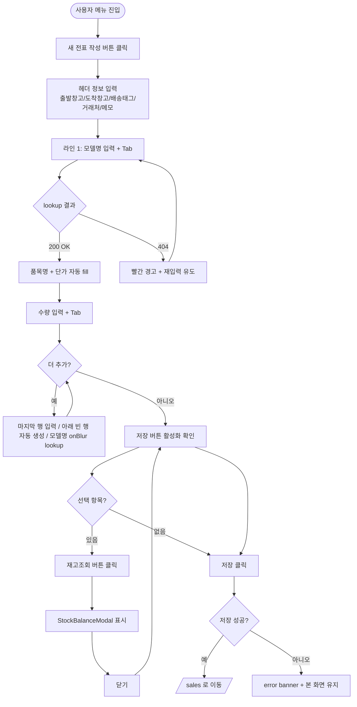
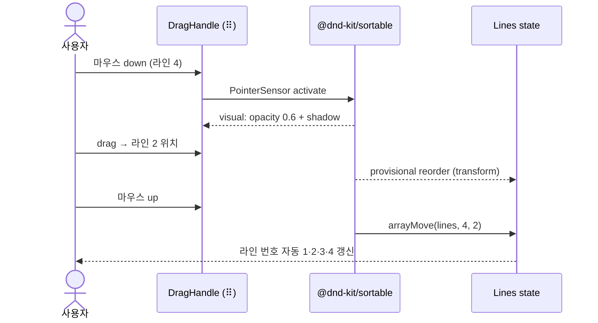
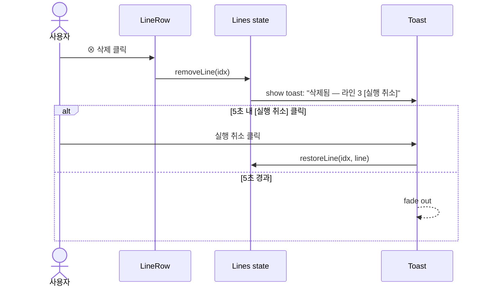
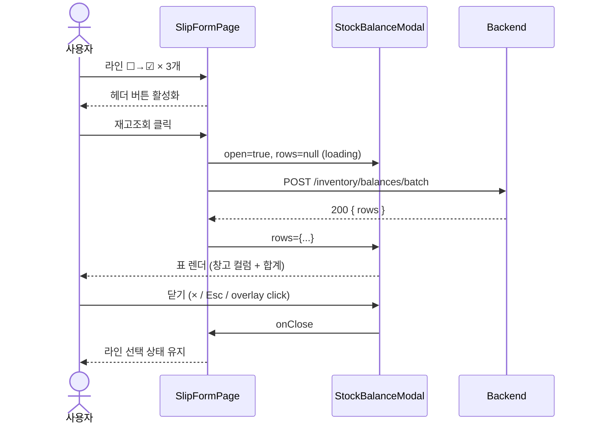

# UX Flow & Interaction — Sales Form Polish 슬라이스

본 문서는 사용자가 SlipFormPage / StockBalanceModal / DispatchView 와 상호작용하는 시나리오 + 키보드 단축키 + drag/drop / lookup / 재고조회 의 세부 동작을 정의합니다.

---

## 1. 전체 시나리오 — 새 출고전표 작성

### 1.1 happy path



### 1.2 행 순서 변경 (drag-and-drop)



drag 동안:
- **dragging row**: opacity 0.6 + box-shadow `--elev-popover`
- **other rows**: 부드러운 `transform: translateY(...)` (`--motion-drag`)
- **drop zone indicator**: 행 사이 1px 파란선 (선택 사항 — 본 슬라이스 미구현 OK)

### 1.3 행 삭제 + undo



---

## 2. 키보드 단축키

### 2.1 폼 전역

| 단축키       | 동작                                    |
| ------------ | --------------------------------------- |
| `Cmd+S` / `Ctrl+S` | 저장 (validation 통과 시)         |
| `Esc`        | 모달 닫기 / 취소 다이얼로그 (changes 시) |
| `Cmd+N` / `Ctrl+N` | 새 라인 추가                       |

### 2.2 라인 행 (focus 시)

| 단축키           | 동작                            |
| ---------------- | ------------------------------- |
| `Tab`            | 다음 셀                         |
| `Shift+Tab`      | 이전 셀                         |
| `Space`          | 체크박스 toggle (focus 시)      |
| `Enter` (모델명) | blur trigger (lookup 호출)      |
| `Cmd+↑/↓` / `Ctrl+↑/↓` | 행 순서 위/아래 (drag 키보드 대안) |
| `Cmd+Backspace` / `Ctrl+Backspace` | 행 삭제 (선택 시) |

### 2.3 모달

| 단축키 | 동작        |
| ------ | ----------- |
| `Esc`  | 모달 닫기   |
| `Tab`  | focus trap (모달 내 순환) |

---

## 3. 모델명 lookup interaction

### 3.1 트리거

- 모델명 input `onBlur` (focus 떠날 때)
- 또는 `Enter` 키 (focus 유지 + blur trigger)

### 3.2 시각 피드백

```
Idle (입력 중):
┌────────────────────────────┐
│ AJ040RXH4BC1              │  ← 일반 input
└────────────────────────────┘

Loading (lookup 중):
┌────────────────────────┬───┐
│ AJ040RXH4BC1          │ ◌ │  ← 우측에 12px spinner
└────────────────────────┴───┘

Success (lookup OK):
┌────────────────────────────┐
│ AJ040RXH4BC1              │  ← border 정상
└────────────────────────────┘
   품목명 셀 fade-in: "시스템에어컨 4Way 4HP"
   단가 셀 fade-in: "1,850,000"

Error (404):
┌────────────────────────────┐
│ XYZNONEXIST                │  ← border 빨강 (--state-danger)
└────────────────────────────┘
   ⓘ 해당 모델명을 찾을 수 없습니다       ← 행 아래 12px 빨간 메시지
```

### 3.3 retry

빨간 메시지 표시 후 사용자가 모델명 재입력 → onBlur 시 재시도. 별도 retry 버튼 없음.

---

## 4. 재고조회 interaction

### 4.1 버튼 활성화 조건

```mermaid
flowchart LR
    A[페이지 로드] --> B[버튼 disabled<br/>'재고조회']
    B --> C{체크박스 ☑ ?}
    C -->|0개| B
    C -->|1개| D[버튼 enabled<br/>'재고조회']
    C -->|N개| E[버튼 enabled<br/>'선택 항목 재고조회 (N건)']
```

### 4.2 조회 endpoint

```
POST /inventory/balances/batch
Body: { productIds: ["uuid1", "uuid2", "uuid3"] }

Response 200:
{
  "rows": [
    {
      "productId": "uuid1",
      "modelName": "AJ040RXH4BC1",
      "perWarehouse": {
        "HQ-001": 12,
        "TRK-001": 3,
        "WST-001": 0,
        "VRT-001": null
      },
      "total": 15
    },
    ...
  ]
}
```

> BE agent 가 본 endpoint 구현 (Q4=A 결정).

### 4.3 모달 흐름



### 4.4 에러 처리

- 네트워크 에러: 모달 내 빨간 banner "재고 조회에 실패했습니다. 다시 시도해 주세요."
- 빈 응답 (rows=[]): "재고 데이터가 없습니다" centered text-tertiary

---

## 5. 인쇄 (DispatchView)

### 5.1 진입

```
SlipDetailPage
  └─ [작업지시서 인쇄] 버튼 → /sales/:id/print/dispatch (DispatchView)
        ├─ 화면: 미리보기 + 상단 [상세로 돌아가기] [인쇄] 버튼
        └─ window.print() → OS 인쇄 다이얼로그
```

### 5.2 인쇄 다이얼로그

- 사용자가 OS 인쇄 다이얼로그에서 프린터 선택 → 인쇄
- `@page { size: A4 portrait; margin: 12mm; }` 자동 적용
- `@media print { .no-print { display: none } }` 로 toolbar 숨김
- 1장 1전표 — 라인이 많아도 페이지 분할 자동 (브라우저 처리)

### 5.3 PDF 저장

사용자가 OS 인쇄 다이얼로그에서 "PDF 로 저장" 선택 가능. 별도 코드 불필요.

---

## 6. 빈 / 에러 상태 디자인

### 6.1 라인 1개 (초기)

```
┌──┬───┬───┬─────────────┬─────────────────┬──────┬────────────┬──────┬─┐
│☐ │⠿1│ # │ [           ]│                  │   1  │         0  │     0│⊗│
└──┴───┴───┴─────────────┴─────────────────┴──────┴────────────┴──────┴─┘
              placeholder     placeholder
              "예: AJ040..."    "모델명 조회 후 자동입력"
```

- 모델명 placeholder: "예: AJ040RXH4BC1" (text-tertiary)
- 품목명 placeholder: "모델명 조회 후 자동입력" (text-tertiary)
- 수량 default 1, 단가 default 0
- 합계 셀 0 (read-only)

### 6.2 lookup loading 중 품목명

```
"조회중..." (text-tertiary, italic)
```

### 6.3 합계 영역 (라인 0건)

```
합계: 0건 | 공급가액 ₩0 | 부가세 ₩0 | 총 ₩0   (text-tertiary)
```

### 6.4 저장 실패

```
┌───────────────────────────────────────────────────────────┐
│ ⓘ 전표 생성에 실패했습니다.                              │  ← error banner
│   사유: 출발 창고 재고 부족                                │
└───────────────────────────────────────────────────────────┘
```

- background: `--state-danger-bg`
- border-left: 4px solid `--state-danger`
- icon: lucide `<AlertCircle />` 16px

---

## 7. 접근성 체크리스트

- [ ] 모든 input 에 `<label>` 또는 `aria-label`
- [ ] 체크박스 / drag handle / 삭제 버튼 키보드 접근 가능
- [ ] 모달 focus trap + ESC 닫기
- [ ] focus visible (outline 2px `--line-focus`, offset 2px)
- [ ] 색상 대비 WCAG AA (text-primary on white = 14.6:1 OK)
- [ ] error 메시지는 색상 외 icon + text 로도 표시
- [ ] drag-and-drop 키보드 대안 (`Cmd+↑/↓`)
- [ ] aria-live="polite" lookup 결과 안내 (스크린리더)

---

## 8. 성능 고려

### 8.1 라인 렌더 최적화

- 라인 N개 → `React.memo(LineRow)` + `useCallback` 핸들러
- drag 중 transform 은 dnd-kit 가 GPU 가속 처리

### 8.2 lookup debounce

본 슬라이스에서는 `onBlur` trigger 라 debounce 불필요. 만약 onChange 로 변경 시 300ms debounce 권장.

### 8.3 batch endpoint

선택 100건 기준 1회 batch 호출 (loop 100회 X). BE 도 단일 SQL 로 처리.

---

## 9. 미구현 / 후속 슬라이스

본 슬라이스에서 **하지 않음**:

- [ ] dark mode (별도 슬라이스)
- [ ] 다국어 (한국어만)
- [ ] 모바일 반응형 (데스크톱 ERP 우선)
- [ ] 라인 가상 스크롤 (100건 미만 가정)
- [ ] 셀 inline 편집의 모든 셀 (모델명/수량/단가만 편집)
- [ ] 전체 design-system 16 컴포넌트 마이그레이션 (점진)
