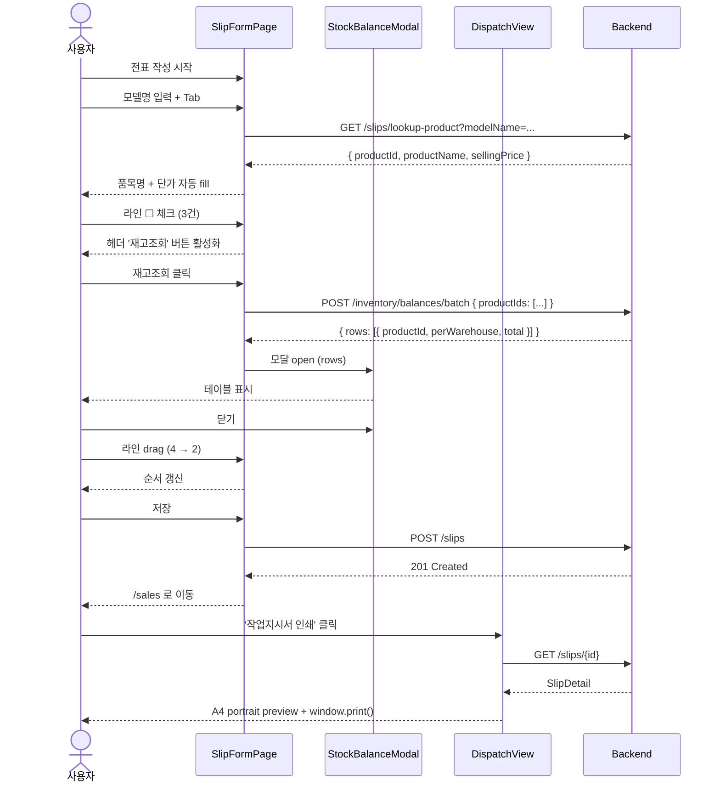

# Wireframes — Sales Form Polish 슬라이스

본 문서는 ASCII art 와 mermaid 로 SlipFormPage / StockBalanceModal / DispatchView 의 화면 layout 을 정의합니다. 픽셀 단위 정확도는 `components.md` + `tokens.md` 가 보충합니다.

---

## 1. SlipFormPage — 모던 미니멀 dense

### 1.1 전체 layout (1280px viewport)

```
┌────────────────────────────────────────────────────────────────────────────┐
│ ◀  새 출고전표                                              [목록으로][저장] │  ← page header (h-56px)
├────────────────────────────────────────────────────────────────────────────┤
│                                                                              │
│  ┌──────────────────────────────────────────────────────────────────────┐  │
│  │ 헤더 정보                                                              │  │
│  │                                                                        │  │
│  │  출발 창고 *           도착 창고             배송태그                   │  │
│  │  ┌─────────────────┐ ┌─────────────────┐ ┌─────────────┐             │  │
│  │  │HQ-001 본사창고▼ │ │선택 안 함     ▼ │ │당일       ▼ │             │  │
│  │  └─────────────────┘ └─────────────────┘ └─────────────┘             │  │
│  │                                                                        │  │
│  │  거래처명                                메모                            │  │
│  │  ┌────────────────────────────┐ ┌──────────────────────────────────┐ │  │
│  │  │(주)윌리-정현수              │ │9시까지 배송 요망                  │ │  │
│  │  └────────────────────────────┘ └──────────────────────────────────┘ │  │
│  └──────────────────────────────────────────────────────────────────────┘  │
│                                                                              │
│  ┌──────────────────────────────────────────────────────────────────────┐  │
│  │ 전표 라인                          [선택 항목 재고조회]              │  │
│  │                                                                        │  │
│  │ ┌──┬───┬─────────────┬─────────────────┬──────┬────────────┬──────┬─┐│  │
│  │ │☐ │ # │ 모델명       │ 품목명           │ 수량 │ 단가       │ 합계 │ ││  │ ← thead h-44px
│  │ ├──┼───┼─────────────┼─────────────────┼──────┼────────────┼──────┼─┤│  │
│  │ │☐ │⠿1│AJ040RXH4BC1 │시스템에어컨 4Way│   2  │ 1,850,000  │3,700K│⊗││  │ ← row h-40px
│  │ │☐ │⠿2│MWR-WE10N    │유선 리모컨       │   2  │    85,000  │  170K│⊗││  │
│  │ │☑ │⠿3│PC1NWSK3NW   │WIFI판넬          │   1  │   120,000  │  120K│⊗││  │ ← selected (☑)
│  │ │☐ │⠿4│             │                  │   1  │         0  │     0│⊗││  │ ← empty new line
│  │ └──┴───┴─────────────┴─────────────────┴──────┴────────────┴──────┴─┘│  │
│  │                                                                        │  │
│  │ 합계: 4건 | 공급가액 ₩3,990,000 | 부가세 ₩399,000 | 총 ₩4,389,000   │  │
│  └──────────────────────────────────────────────────────────────────────┘  │
│                                                                              │
│                                              [취소]   [저장] (primary blue)  │
└────────────────────────────────────────────────────────────────────────────┘
```

### 1.2 라인 행 (40px) 픽셀 spec

```
y: 0 ────────────────────────────────────────────────────────────────────── 40
   │ ☐ │ ⠿ │ # │ <input modelName>      │ <span productName>     │ <input qty> │ <input price> │ <span sum> │ ⊗
   │40 │24 │24 │ flex 2                 │ flex 2                 │ 80          │ 120           │ 100        │ 32
   │   │   │   │ 우측 padding 12        │ left padding 8         │ text-right  │ text-right    │ text-right │
```

- **체크박스 컬럼** width 40px, center align
- **drag handle 컬럼** width 24px, hover 시 cursor:grab
- **# 컬럼** width 24px, 12px tertiary text (자동 라인번호 1·2·3)
- **모델명** flex 2, focus 시 border 파란색 + 우측 spinner (lookup 중)
- **품목명** flex 2, read-only, lookup 후 자동 fill (회색 배경 X — text-secondary 만 다르게)
- **수량** width 80, text-right, tabular-nums
- **단가** width 120, text-right, tabular-nums + thousand separator
- **합계** width 100, text-right, computed read-only (subtle bg)
- **삭제** width 32, hover 시 빨간 X 아이콘

### 1.3 라인 행 상태 (mermaid)

```mermaid
stateDiagram-v2
    [*] --> Default
    Default --> Hover: mouseenter
    Hover --> Default: mouseleave
    Default --> Selected: click row / check ☐
    Selected --> Default: uncheck ☑
    Default --> Loading: onBlur lookup 시작
    Loading --> Default: 200 success
    Loading --> Error: 404 not found
    Error --> Loading: re-edit + onBlur
    Default --> Dragging: drag start
    Dragging --> Default: drag end
```

### 1.4 헤더 정보 grid

```
┌─────────────┬─────────────┬─────────────┐
│ 출발창고 *   │ 도착창고    │ 배송태그    │   row 1 (3 cols, gap-16)
├─────────────┴─────────────┴─────────────┤
│ 거래처명          │ 메모                │   row 2 (2 cols 1:2 ratio, gap-16)
└───────────────────┴─────────────────────┘
```

- 모든 필드 label 위 (12px secondary), input 아래 (40px height)
- card padding 24px (`--space-5` 보다 한 단계 더 — 헤더는 여유)

---

## 2. StockBalanceModal — 재고 조회

### 2.1 layout (max-w 720, max-h 80vh)

```
                            (overlay rgba(0,0,0,0.6))
        ┌───────────────────────────────────────────────────┐
        │ 재고 조회                                      [×] │  ← header h-56px
        ├───────────────────────────────────────────────────┤
        │                                                     │
        │  선택 품목 (3건)                                    │
        │   • AJ040RXH4BC1 — 시스템에어컨 4Way 4HP            │
        │   • MWR-WE10N   — 유선 리모컨                       │
        │   • PC1NWSK3NW  — WIFI판넬                          │
        │                                                     │
        │  ┌──────────────┬─────┬─────┬─────┬─────┬──────┐  │
        │  │ 모델명        │본사  │차량1│위탁  │가상  │ 합계 │  │ ← thead bold
        │  ├──────────────┼─────┼─────┼─────┼─────┼──────┤  │
        │  │ AJ040RXH4BC1 │  12 │   3 │   0 │   - │   15 │  │ row
        │  │ MWR-WE10N    │  45 │  10 │   2 │   - │   57 │  │
        │  │ PC1NWSK3NW   │   8 │   - │   - │   - │    8 │  │
        │  └──────────────┴─────┴─────┴─────┴─────┴──────┘  │
        │                                                     │
        │  • 가상창고는 재고 차감 대상 외 (회색 dash)         │
        │  • 0 인 항목도 표시 (사용자 요구사항)               │
        │                                                     │
        ├───────────────────────────────────────────────────┤
        │                                          [닫기]    │  ← footer h-56px
        └───────────────────────────────────────────────────┘
```

### 2.2 셀 렌더링 규칙

| 값         | 표시      | 색상                | 정렬   |
| ---------- | --------- | ------------------- | ------ |
| `> 0`      | 숫자       | text-primary        | right  |
| `= 0`      | `0`       | text-tertiary (dim) | right  |
| `null`/N/A | `-`       | text-tertiary (dim) | right  |
| 합계       | bold 숫자 | text-primary        | right  |

모든 숫자 셀 `font-variant-numeric: tabular-nums` + `font-family: var(--font-family-mono)` 옵션 (모노 폰트로 자릿수 정렬 — Notion 스타일).

### 2.3 트리거 조건

```mermaid
flowchart LR
    A[라인 행 체크 ☑] --> B{선택 라인 수}
    B -->|0| C[헤더 버튼 disabled]
    B -->|1| D[헤더 버튼 enabled<br/>'재고조회']
    B -->|2+| E[헤더 버튼 enabled<br/>'선택 항목 재고조회 (N건)']
    D --> F[모달 open + 단건 batch endpoint 호출]
    E --> F
    F --> G[테이블 렌더 + 닫기]
```

---

## 3. DispatchView — 작업지시서 세로 A4 (이미지 2 충실 반영)

### 3.1 A4 portrait (210mm × 297mm, 12mm 여백)

```
┌─────────────────────────────────────────────────┐  ← width 186mm (210 - 12*2)
│  [SAMSUNG]                                       │
│                          ┌───────────┬─────────┐│
│  주식회사 윌리-정현수      │담당부서   │담당자   ││
│                          │영업1팀     │오병승   ││
│  ┌───────────────┐       ├───────────┼─────────┤│
│  │ 2026/06/02    │       │출고인     │검수인   ││
│  │   - 4         │       │           │         ││
│  └───────────────┘       ├───────────┴─────────┤│
│                          │결재                  ││
│                          │     *                ││
│                          └─────────────────────┘│
│                                                  │
│  ┌─────────┐                                     │
│  │본사창고  │  (수령처: 초월 무갑)                │
│  └─────────┘                                     │
│                                                  │
│  ┌──┬──┬───────────────┬──────┬────┬─────┐     │
│  │월│일│ 모델명/품목명   │ 규격 │수량│        │     │  ← thead h-12pt
│  ├──┼──┼───────────────┼──────┼────┼─────┤     │
│  │05│04│AJ040RXH4BC1   │      │  1 │        │     │  ← line h-9pt
│  │  │  │시스템에어컨 4Way│      │    │        │     │  (2-line cell)
│  ├──┼──┼───────────────┼──────┼────┼─────┤     │
│  │05│04│AJ020BN1PBC1   │      │  2 │        │     │
│  │  │  │홈-WIFI 모델    │      │    │        │     │
│  ├──┼──┼───────────────┼──────┼────┼─────┤     │
│  │..│..│..             │      │    │        │     │
│  ├──┼──┼───────────────┼──────┼────┼─────┤     │
│  │  │  │ 총합계         │      │ 17 │        │     │  ← bold
│  └──┴──┴───────────────┴──────┴────┴─────┘     │
│                                                  │
│  ┌─ 배송지 ────────────────────────────────┐   │
│  │ 경기 김포시 김포한강2로 273번길 51        │   │
│  │ 청송마을 모아미래도엘가 504동 1803호     │   │
│  └──────────────────────────────────────────┘   │
│                                                  │
│  ┌─ 연락처 ────────────────────────────────┐   │
│  │ 이석중 팀장 010-6888-8925                │   │
│  └──────────────────────────────────────────┘   │
│                                                  │
│  ┌─ 특이사항 ──────────────────────────────┐   │
│  │ 9시까지 배송 요망                         │   │
│  └──────────────────────────────────────────┘   │
│                                                  │
│  기사님 출발 전에 수요처에 전화주세요             │
│  ~ 감사합니다 ^^                                  │
│                                                  │
│  ※ 제품 수량 및 이상 유무 확인 후 서명 必        │
│                                                  │
│  ┌─ 용달기사 서명 ──┐  ┌─ 인수자 서명 ────┐    │
│  │                   │  │                   │    │
│  │  (60mm × 40mm)    │  │  (60mm × 40mm)    │    │
│  │                   │  │                   │    │
│  └───────────────────┘  └───────────────────┘    │
└─────────────────────────────────────────────────┘
```

### 3.2 print 환경

```css
@page {
  size: A4 portrait;     /* 210mm × 297mm */
  margin: 12mm;
}

@media print {
  .no-print { display: none !important; }
  body { background: white; }
  .dispatch-page {
    width: 186mm;
    font-family: 'Pretendard', 'Noto Sans KR', sans-serif;
    font-size: 11pt;
    color: #000;
    -webkit-print-color-adjust: exact;
    print-color-adjust: exact;
  }
  .dispatch-page table { border-collapse: collapse; }
  .dispatch-page th, .dispatch-page td {
    border: 1px solid #000;
    padding: 4pt 6pt;
  }
  .dispatch-sign-area {
    width: 60mm; height: 40mm;
    border: 1px solid #000;
  }
}
```

---

## 4. mermaid: 전체 사용자 시나리오


