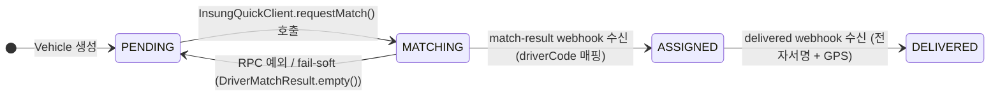

# SP-10-2 인성데이타 퀵프로그램 — 4단계 vendor 매칭 시각화 Wireframe

**슬라이스**: SP-10-2 인성데이타 퀵프로그램 vendor 통합  
**작성일**: 2026-05-19  
**Designer**: UI/UX Designer agent  
**인용 파일**: `clients/web/design-system/src/tokens/tokens.css`, `docs/planning/2026-05-19_sp-10-2-insung-quick-program.md` §3 FE-1  
**FE 인용 컴포넌트**: `clients/arologis-desktop/src/renderer/components/VehicleMatchStatusBadge.tsx` (FE-1 신규 산출)

---

## 1. 상태 전이 흐름 (mermaid stateDiagram)



상태 전이 노트:
- `PENDING → MATCHING`: `samhan.arologis.matcher.provider=insung-quick` 활성 시에만. `provider=mock` 이면 mock Driver 즉시 ASSIGNED.
- `MATCHING → PENDING` 역전이: `InsungQuickClient` RPC 예외 시 fail-soft. Vehicle.status 는 PENDING 유지. admin 수동 매칭 fallback 진입점.
- `ASSIGNED → DELIVERED`: `POST /internal/arologis/insung/delivered` webhook 수신 후 전이.

---

## 2. 4단계 상태별 Badge ASCII mock

### 2-1. PENDING (매칭 대기)

```
┌──────────────────────────────────────────────────────┐
│  [●]  대기 중                                         │
│       매칭이 시도되지 않았습니다                         │
│       bg: --color-neutral-100  border: --color-neutral-200  │
│       text: --color-neutral-600                       │
└──────────────────────────────────────────────────────┘
```

- 아이콘: `Clock` (Lucide) — 16px, `--color-neutral-400`
- 라벨 (한국어): **"대기 중"** — `--font-size-sm` (13px), `--font-weight-medium`
- 서브텍스트: "매칭이 시도되지 않았습니다" — `--font-size-xs` (12px), `--color-neutral-500`
- driverCode 표시 없음 (미매칭 상태)
- badge radius: `--radius-md` (4px)

---

### 2-2. MATCHING (매칭 진행 중)

```
┌──────────────────────────────────────────────────────┐
│  [◌]  매칭 중...          [INSUNG]                    │
│       인성 퀵프로그램 기사 배정 중                       │
│       spinner: --color-brand-500  (애니메이션)          │
│       bg: --color-brand-50  border: --color-brand-200 │
│       text: --color-brand-700                         │
└──────────────────────────────────────────────────────┘
```

- 아이콘: `Loader2` (Lucide) — 16px, `--color-brand-500`, CSS `animation: spin 1s linear infinite`
- 라벨 (한국어): **"매칭 중..."** — `--font-size-sm` (13px), `--font-weight-semibold`, `--color-brand-700`
- 서브텍스트: "인성 퀵프로그램 기사 배정 중" — `--font-size-xs` (12px), `--color-brand-500`
- `INSUNG` 뱃지: 우측 정렬, `--color-insung-50` bg / `--color-insung-text` text (토큰 spec §2 참조)
- driverCode 표시 없음 (매칭 진행 중)
- `aria-live="polite"` `aria-label="인성 기사 매칭 진행 중"` 접근성 적용

---

### 2-3. ASSIGNED (매칭 완료)

```
┌──────────────────────────────────────────────────────┐
│  [✓]  매칭 완료           [INSUNG]                    │
│       INSUNG-7291                                     │
│       bg: --color-success-50  border: --color-success-200  │
│       text: --color-success-700                       │
└──────────────────────────────────────────────────────┘

  driverCode 위치: badge 본문 두 번째 줄 (서브텍스트 영역)
  형식: "INSUNG-{vendorDriverId}" — UUID 비공개 원칙 준수 (feedback_uuid_no_user_visibility.md)
```

- 아이콘: `CheckCircle2` (Lucide) — 16px, `--color-success-500`
- 라벨 (한국어): **"매칭 완료"** — `--font-size-sm` (13px), `--font-weight-semibold`, `--color-success-700`
- driverCode: `INSUNG-{vendorDriverId}` 형식 — `--font-size-xs` (12px), `--color-success-600`, `font-family: var(--font-family-mono)`
- `INSUNG` 뱃지: `--color-insung-50` bg / `--color-insung-text` text (우측 정렬)
- `aria-label="인성 기사 매칭 완료, 기사 코드 INSUNG-7291"`

---

### 2-4. DELIVERED (배송 완료)

```
┌──────────────────────────────────────────────────────┐
│  [✓✓] 배송 완료                                       │
│       INSUNG-7291 · 전자서명 수신                       │
│       bg: --color-neutral-50  border: --color-neutral-200  │
│       text: --color-neutral-500                       │
└──────────────────────────────────────────────────────┘
```

- 아이콘: `CheckCheck` (Lucide) — 16px, `--color-success-500` (완료는 success green 유지, 전체 bg 만 neutral 로 전환)
- 라벨 (한국어): **"배송 완료"** — `--font-size-sm` (13px), `--font-weight-medium`, `--color-neutral-500`
- 서브텍스트: `{driverCode} · 전자서명 수신` — `--font-size-xs` (12px), `--color-neutral-400`
- driverCode: INSUNG- 형식 유지 (트레이서빌리티)
- `INSUNG` 뱃지: 표시하지 않음 (완료 상태이므로 vendor 강조 불필요)
- `aria-label="배송 완료, 전자서명 수신"`

---

## 3. 상태별 색상 + 아이콘 종합표

| 상태 | Lucide 아이콘 | 아이콘 색상 | bg 토큰 | border 토큰 | text 토큰 | driverCode 표시 | INSUNG 뱃지 |
|---|---|---|---|---|---|---|---|
| **PENDING** | `Clock` | `--color-neutral-400` | `--color-neutral-100` | `--color-neutral-200` | `--color-neutral-600` | X | X |
| **MATCHING** | `Loader2` (spin) | `--color-brand-500` | `--color-brand-50` | `--color-brand-200` | `--color-brand-700` | X | O (우측) |
| **ASSIGNED** | `CheckCircle2` | `--color-success-500` | `--color-success-50` | `--color-success-200` | `--color-success-700` | O (두 번째 줄) | O (우측) |
| **DELIVERED** | `CheckCheck` | `--color-success-500` | `--color-neutral-50` | `--color-neutral-200` | `--color-neutral-500` | O (서브텍스트) | X |

---

## 4. 배차 상세 페이지 vehicle row 내 배치

```
DispatchDetailPage — vehicle row 레이아웃 (FE-1 / FE-4 연계)
─────────────────────────────────────────────────────────────────────
[ 차량 1 ]   1.5t  서울 → 광주 (정차 3)     [VehicleMatchStatusBadge]
             ── 정차 1 ─ 거래처A / 서울 강남구 ...
             ── 정차 2 ─ 거래처B / 경기 성남시 ...
             ── 정차 3 ─ 거래처C / 광주 남구 ...

[ 차량 2 ]   1t    서울 → 부산 (정차 2)     [VehicleMatchStatusBadge]
             ── 정차 1 ─ ...
─────────────────────────────────────────────────────────────────────
```

- `VehicleMatchStatusBadge` 는 vehicle row 우측 상단 정렬 (flex row, `align-items: flex-start`)
- Badge 최소 너비: 140px (텍스트 잘림 방지)
- `vendorOrderId` hover tooltip (FE-4): Badge 에 `title` attribute — `"인성 주문 ID: {vendorOrderId}"` (admin 전용, UUID 아닌 vendor 주문 ID)

---

## 5. sandbox-mode 표시 (BE-4 `sandboxMode=true` 연동)

```
[ INSUNG SANDBOX ] ← 상단 고정 경고 배너
  배경: --color-warning-50  border-left: 4px solid --color-warning-500
  텍스트: "인성 퀵프로그램 sandbox 모드 — 실 기사 배정 없음"
  아이콘: AlertTriangle (Lucide), --color-warning-500
```

- `sandboxMode=true` 시 DispatchDetailPage 상단에 표시
- 배너 닫기 버튼 없음 (설정값이므로 개발자 조치 필요)
- `role="status"` `aria-live="polite"` (경고이지만 즉각 중단 불필요)

---

## 6. Designer ↔ QA Playwright case 1:1 매핑 가드

| Badge 상태 | QA Playwright case | 검증 요소 |
|---|---|---|
| PENDING | `QA-1` `insung-mock-match.spec.ts` | `data-testid="match-status-badge"` text "대기 중", bg `--color-neutral-100`, Clock 아이콘 |
| MATCHING → PENDING (fail-soft) | `QA-2` `insung-sandbox-fallback.spec.ts` | RPC 예외 후 PENDING 복귀, Loader2 spinner 제거, driverCode row 없음 |
| ASSIGNED + INSUNG 뱃지 | `QA-5` `insung-webhook-status-update.spec.ts` | match-result webhook 수신 → badge text "매칭 완료", driverCode "INSUNG-*" 표시 |
| DELIVERED + 체크 | `QA-5` `insung-webhook-status-update.spec.ts` | delivered webhook 수신 → badge text "배송 완료", CheckCheck 아이콘 |
| sandbox 배너 표시 | `QA-2` `insung-sandbox-fallback.spec.ts` | 배너 text "sandbox 모드", `role="status"` |
| 사이드바 메뉴 unchanged | `QA-6` `insung-sidebar-no-impact.spec.ts` | DispatchesLayout nav links 변동 없음 — 기존 4개 그대로 |

---

## 7. 접근성 요구사항

| 요소 | aria 속성 | 근거 |
|---|---|---|
| MATCHING spinner | `aria-live="polite"` `aria-label="인성 기사 매칭 진행 중"` | 진행 상태 — screen reader 자동 읽음 |
| 상태 전이 | `aria-live="polite"` container 로 감싸기 | ASSIGNED/DELIVERED 전이 시 자동 알림 |
| sandbox 배너 | `role="status"` `aria-live="polite"` | 경고이나 작업 즉각 중단 불필요 |
| INSUNG 뱃지 | `aria-label="인성데이타 퀵프로그램 vendor"` | 축약 텍스트 보완 |
| vendorOrderId tooltip | `title="{vendorOrderId}"` | admin hover — 접근성 보조 수단 |
