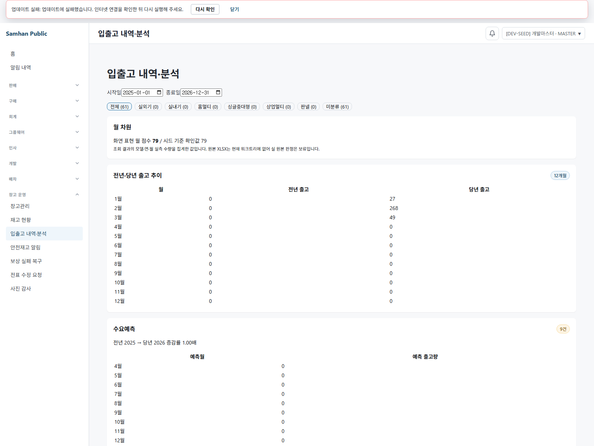
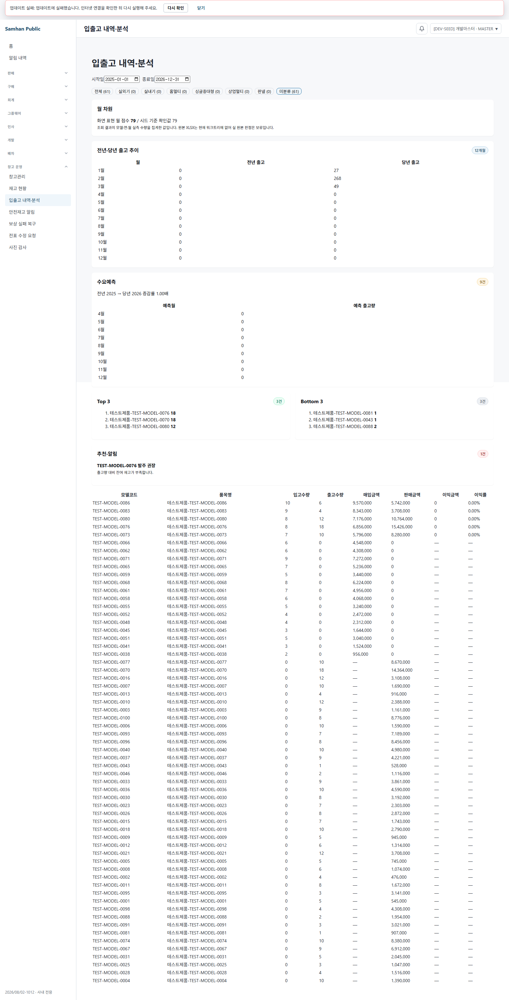
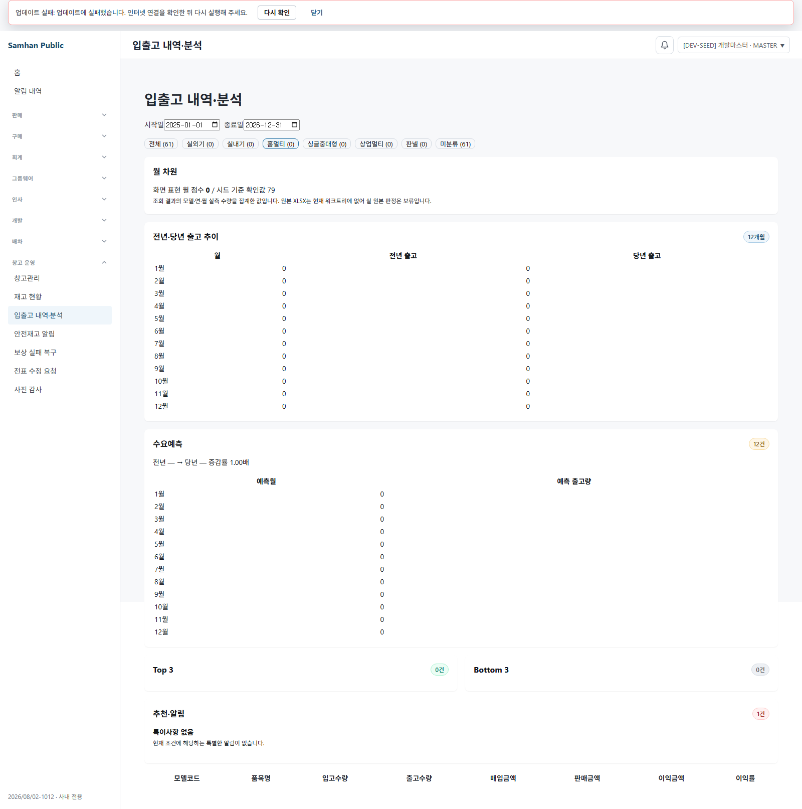

# PR #1047 · 이슈 #1012 실화면 QA

- 검증 시각: 2026-08-03 KST
- 대상: `feat/1012-inout-analysis` / `204a03902`
- 데이터 출처: 로컬 PostgreSQL 개발 시드(`[DEV-SEED]`)
- 주의: 아래의 79점·61행 등 모든 업무 수치는 `[DEV-SEED]` 기준이며, 운영 실데이터 수치는 검증하지 않았다.

## 1. 브라우저 확보 및 실행 방식

공유 `slip-service` 컨테이너의 생성 시각은 `2026-08-02T04:30:03.970155657Z`(KST 13:30:03)로, 검증 대상 HEAD보다 오래된 배포본이었다. 따라서 공유 이미지는 재빌드하지 않고 현재 소스를 별도 프로세스로 실행했다.

- `clients/desktop`에서 로컬 Playwright `1.59.1`을 사용했다.
- `npx playwright install chromium`으로 Chromium을 확보한 뒤 실제 launch 성공을 확인했다.
- 현재 소스의 `product-service`를 `18488`, `slip-service`를 `18487`에 standalone으로 실행했다. 두 서비스는 개발 시드 DB를 read-only 연결로 사용했고 Flyway와 Eureka는 비활성화했다.
- 렌더러는 `clients/desktop`을 cwd로 하여 로컬 `node_modules/.bin/vite.cmd`, `vite.renderer.dev.config.ts`, 포트 `5194`로 실행했다. `VITE_APP_VERSION=2026/08/02-1012`를 주입했고 HashRouter 경로 `#/inventory/inout-analysis`로 진입했다.
- 인증·권한은 기존 개발 게이트웨이를 사용하고, 입출고 분석 요청만 Playwright route가 현재 브랜치 standalone `slip-service`로 전달했다. 응답은 실제 서비스·DB 결과이며 합성 데이터나 고정 JSON을 사용하지 않았다.
- 캡처는 Playwright Chromium이 렌더링한 실제 앱 화면이다. API JSON이나 터미널 출력은 화면 증거로 사용하지 않았다.
- 로그와 PID는 저장소 밖 임시 디렉터리에 두었다.

공유 버전 조회 경로 `/app/version`이 404를 반환하여 화면 상단에 `업데이트 실패` 배너가 보인다. 이는 오래된 공유 보조 엔드포인트에서 생긴 비차단 환경 경고이며, 입출고 분석 화면과 standalone 분석 요청은 정상 동작했다.

## 2. 실화면 관찰

### 2.1 월 차원과 무필터 61행

캡처: `docs/qa/1012-inout-analysis-real-qa/01-monthly-79-unfiltered-61.png`

- 화면의 월별 입출고 추이에 `화면 표현 월 점수 79 / 시드 기준 확인값 79`가 표시됐다.
- 칩은 `전체 (61)`, `미분류 (61)`로 표시됐고 무필터 표의 실제 렌더링 행은 61행이었다.
- 따라서 `monthly[]` 79점은 API JSON에만 존재하는 것이 아니라 화면에 표현된다.

### 2.2 미분류 칩 61행

캡처: `docs/qa/1012-inout-analysis-real-qa/02-unclassified-chip-61-rows.png`

- `미분류 (61)` 칩을 선택한 상태가 화면에 표시됐다.
- 표에는 61행이 렌더링됐으며 월 점수 79도 유지됐다.
- 같은 화면에서 Top 3 `18·18·12`, Bottom 3 `1·1·2`, 추천 1건도 함께 보였다.

### 2.3 분류 칩의 현재 시드 상태

캡처: `docs/qa/1012-inout-analysis-real-qa/03-classified-chip-home-multi-zero-seed.png`

- `홈멀티 (0)` 분류 칩을 실제 선택했고 빈 표가 정상 렌더링됐다.
- 현재 `[DEV-SEED]`에서 화면의 대상 상태에 속하는 61행은 모두 미분류다. 분류가 있는 시드 상품 4건은 `SENT` 상태여서 이 화면의 대상 상태(`CONFIRMED`, `DELIVERED`, `COMPLETED`)에서 제외된다.
- 따라서 “분류 칩을 선택했을 때 분류된 행이 보이는가”라는 양성 경로는 현재 시드로 실측할 수 없었다. 공유 DB write와 합성 데이터가 금지되어 상태나 분류를 바꾸지 않았다.

## 3. 판정

**부분 PASS / 분류 칩 양성 경로 미판정**

| 항목 | 판정 | `[DEV-SEED]` 실화면 결과 |
|---|---|---|
| `monthly[]` 화면 표현 | PASS | 79점 표시 |
| 무필터 | PASS | 61행 |
| `미분류` 칩 | PASS | 61행 |
| 분류 칩 선택·빈 상태 | PASS | `홈멀티 (0)`, 0행 정상 표시 |
| 분류 칩의 분류 행 노출 | 미판정 | 대상 모집단에 분류 행이 0건이라 양성 경로 재현 불가 |

관찰 가능한 계약에서는 UI 회귀를 발견하지 않았다. 다만 분류 행이 실제로 존재할 때의 칩 필터는 이번 실화면 증거만으로 PASS라고 확대 판정하지 않는다.

## 4. 하지 못한 것

- 운영 실데이터 검증: 로컬 DB가 `[DEV-SEED]`이므로 수행하지 않았다.
- 분류 칩 양성 경로: 현재 시드의 화면 대상 모집단에 분류 행이 없어 수행하지 못했다.
- 공유 스택 배포본 검증: 대상 브랜치보다 오래되어 현재 HEAD의 증거로 사용하지 않았다.
- 공유 DB write, 합성 데이터 생성, Docker 이미지 재빌드: 제약에 따라 수행하지 않았다.

## 5. 이번 라운드의 새 파일

- `docs/dev-reports/2026-08-02-1012-live-qa.md`
- `docs/qa/1012-inout-analysis-real-qa/01-monthly-79-unfiltered-61.png`
- `docs/qa/1012-inout-analysis-real-qa/02-unclassified-chip-61-rows.png`
- `docs/qa/1012-inout-analysis-real-qa/03-classified-chip-home-multi-zero-seed.png`

