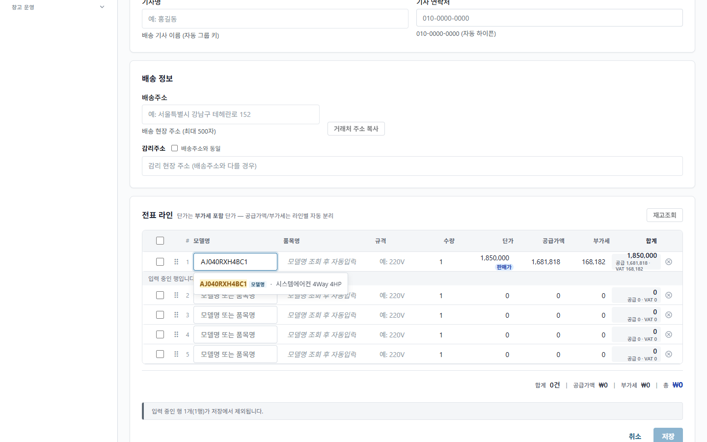
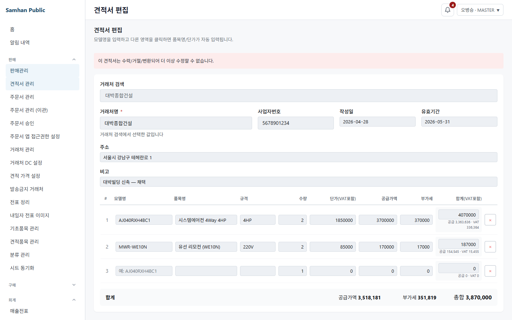

```text
git -C . rev-parse --show-toplevel     # D:/dev/Samhan-Public/.claude/worktrees/w1062-lineux
git -C . branch --show-current         # fix/1062-line-input-ux
git -C . rev-parse HEAD                # 7482ec398ba3bfaa1b643fb30e963944e92248c0 이어야 함
```

실측 출력:

```text
show_toplevel=D:/dev/Samhan-Public/.claude/worktrees/w1062-lineux
branch=fix/1062-line-input-ux
HEAD=7482ec398ba3bfaa1b643fb30e963944e92248c0
```

실행 환경 실측:

```text
container=/samhan-slip-service created=2026-08-05T02:50:44.702471161Z started=2026-08-05T02:51:02.147121178Z
container=/samhan-api-gateway created=2026-08-05T02:50:37.64267995Z started=2026-08-05T02:50:51.017973805Z
container=/samhan-product-service created=2026-08-03T08:31:27.357896901Z started=2026-08-04T23:34:13.092136224Z
```

# PR #1063 R28 SOL 재수렴 적대검증 보고서

## 최종 판정

**머지 비권고.** R26·R27이 바꾼 표면에서 사용자가 화면으로 도달할 수 있는 오동작 **4건**을 확인했다.

1. 확정값을 다시 클릭하면 입력이 이미 비어 보이므로, 사용자가 Backspace/Delete로 지워도 입력 이벤트가 발생하지 않아 blur 뒤 기존 선택이 복원된다.
2. 품목 검색 결과가 정확히 1건이어도 즉시 확정되지 않고 dropdown에 남는다.
3. 수정 불가 견적 편집 화면에 입력할 수 없는 trailing 빈행이 생긴다.
4. R26 이전의 marker 없는 선행 Y.Doc은 버전 복원 뒤에도 stale 행을 보존한 다음 새 서버 버전으로 표기될 수 있다.

R27의 포커스-only 회귀 자체는 최신 산출물에서 닫혔고, R26의 첫·중간·마지막 행 삭제 및 최소행 복원도 통과했다. 그러나 위 네 건 중 하나라도 남으면 양방향 불변식이 성립하지 않으므로 병합 가능한 상태가 아니다.

## 증거 무결성

- 최초 Vite GUI는 `@samhan/design-system/dist/index.js`의 R26 산출물을 읽었다. 당시 `dist/index.js` 수정 시각은 15:46:19, R27 소스 `AsyncAutocomplete.tsx`는 16:10:35였고, dist 안의 `lastTypedDraftRef`도 빈 문자열 sentinel이었다. 이 세션에서 보인 포커스-only 해제는 **R27 판정에서 제외**했다.
- `clients/web/design-system`의 추적되지 않는 dist를 `npm run build`로 갱신한 뒤, 데스크톱 렌더러만 `clients/desktop/vite.renderer.dev.config.ts`, `127.0.0.1:5193`, `--strictPort`, mock mode로 다시 시작했다. 이후 Chromium GUI 결과만 최종 판정에 사용했다.
- 실제 Chromium 실행 파일은 `C:/Users/ewoo2/AppData/Local/ms-playwright/chromium-1208/chrome-win64/chrome.exe`였다. 정적 mock PNG가 아니라 브라우저에서 실제 focus/input/keyboard/blur/click을 발생시켰다.
- `samhan-product-service`는 R23보다 오래된 배포본이다. R25에서 확인했듯 실행 JAR의 `ProductSummaryResponse`에는 `specification`이 없으므로, 이번 규격 열은 배포 후 화면 증거로 주장하지 않는다.
- 컨테이너 재배포, DB/API 쓰기, 저장·복원 mutation, git add/commit/push는 하지 않았다.
- `prebuild-r26-*` 스크린샷은 산출물 불일치 기록일 뿐 최종 판정 증거가 아니다. 최신 R27 산출물 증거는 `06-*` 이후 파일이다.

## 첫 번째 각도 — 다섯 자동완성 동선

### GUI 결과

| 동선 | `onInputCommitChange` 있음 | 없음 | 판정 |
|---|---|---|---|
| 1. 포커스만 하고 나감 | 전표 desktop/mobile·일마감·차단거래처 4/4에서 선택 유지 | 전표 거래처·안전재고 품목 표본에서 선택 유지 | **통과** — R27 회귀 닫힘 |
| 2. 확정값을 지우고 나감 | 4/4에서 `click → Backspace → blur` 뒤 이전 선택 복원 | 두 표본 모두 이전 선택 복원 | **실패 — 발견 1** |
| 3. 다른 검색어 입력 | 4/4에서 `AJ` 또는 `강남` 첫 글자 보존 | 두 표본도 첫 글자 보존 | **통과** |
| 4. 모달 취소 후 복원 | `AJ` 복수 후보 모달 취소 뒤 draft `AJ` 유지 | 안전재고 품목에서도 동일 | **통과** |
| 5. 후보 수 분기 | `AJ` 복수 후보는 모달 | 정확 검색 1건은 dropdown에 잔류 | **부분 실패 — 발견 2** |

발견 1의 핵심은 테스트 도구가 값을 강제로 바꾼 경우가 아니라 사용자가 실제로 밟는 동선이다. 확정값에 focus하는 순간 `AsyncAutocomplete.tsx:210-213`이 화면 draft를 먼저 비운다. 그 상태에서 Backspace/Delete를 누르면 브라우저가 값 변화 input 이벤트를 만들지 않는다. `AsyncAutocomplete.tsx:268-278`의 blur는 `lastTypedDraftRef.current === null`을 “편집 안 함”으로 판정하고 기존 controlled 선택을 되살린다. 반면 검색어를 한 번 입력했다가 지우면 해제되므로, 같은 화면에서 두 삭제 방식이 서로 다르게 동작한다.

범위 밖 두 소비자를 제외한 활성 소비자는 14개 파일, 19개 인스턴스다. `onInputCommitChange` 결선 4개는 `DailyClosingPage.tsx:885`, `BlockedPartnersPage.tsx:464`, `SlipFormPage.tsx:1644,1722`이며 실제 GUI에서 모두 같은 실패를 보였다. 나머지 15개는 callback이 없지만 동일 공용 blur 판정을 거친다. 활성 결선은 전수 확인했고, 서로 다른 wrapper의 실제 GUI 표본에서도 같은 실패를 재현했다.


발견 2는 `AsyncAutocomplete.tsx:345-359`에서 단일 후보 자동 확정을 `autoSelectSingleResult && resultSelectionMode === 'multiple'`에만 허용한 결과다. 일반 `ProductAutocomplete`는 `ProductAutocomplete.tsx:149-188`에서 기본 `resultSelectionMode='single'`만 전달한다. 최신 GUI에서 `AJ`는 2건 이상 모달로 갔지만, `AJ040RXH4BC1` 정확 검색은 후보가 1건인데도 미확정 dropdown으로 남고 합계 건수도 0이었다.



## 두 번째 각도 — trailing 빈행

### 삭제 위치·최소행 GUI 대조

| 화면 | 첫 행 삭제 | 중간 행 삭제 | 마지막 빈행 삭제 | 최소행 |
|---|---|---|---|---|
| 전표 | 후속 확정행 순서+빈행 유지 | 양옆 확정행+빈행 유지 | 빈행 즉시 재생성 | 1행 유지 |
| 견적 | 후속 확정행 순서+빈행 유지 | 양옆 확정행+빈행 유지 | lookup 완료 뒤와 lookup 응답 전 삭제 모두 재생성 | 1행 유지 |
| 분개 | 후속 행+빈행 유지 | 양옆 행+빈행 유지 | 빈행 재생성 | 2행 유지 |
| 재고이동 | 후속 확정행 순서+빈행 유지 | 양옆 확정행+빈행 유지 | 빈행 재생성 | 1행 유지 |

- `removeLinePreservingMinimum`의 제품 호출부는 정확히 4개였다: `SlipFormPage.tsx:710`, `EstimateFormPage.tsx:1241`, `JournalFormPage.tsx:396`, `TransferFormPage.tsx:104`. 네 호출 모두 실제 확인한 행의 `isConfirmed` 판정을 새 인자로 넘긴다. 누락 호출부는 없다.
- 빈행 저장 제외는 전표 `SlipFormPage.tsx:1107-1108`, 견적 `EstimateFormPage.tsx:1482-1484`, 분개 `JournalFormPage.tsx:426-463`, 이동 `TransferFormPage.tsx:90-95`에서 확인했다. DB 쓰기 금지에 따라 실제 저장은 누르지 않았다.
- 협업 편집 견적은 확정 2행+편집 가능한 빈행 1개였고 삭제 버튼은 모두 비활성이었다. 새 빈행이 협업 삭제 제약을 우회하지 않았다.

### 발견 3 — 읽기 전용 견적에도 빈행 생성

`/sales/estimates/est-003/edit?mockRole=MASTER`는 “더 이상 수정할 수 없습니다”를 표시하고 모든 입력을 readOnly로 만든다. 그런데 확정 2행 뒤에 세 번째 빈행이 표시된다. `EstimateFormPage.tsx:749-753`에서 `isReadOnly`를 계산하지만, detail hydrate는 `EstimateFormPage.tsx:798-804`에서 읽기 전용 여부와 무관하게 `ensureTrailingBlankRow`를 호출한다. R26 RED-A의 “읽기 전용 화면에 빈행이 생기지 않는다”가 실제 GUI에서 깨졌다.



## 세 번째 각도 — 견적 버전 복원과 미저장 입력

### 현재 marker가 있는 문서

`EstimateFormPage.tsx:884-897`은 provider의 `estimateServerVersion`이 현재 서버 version과 다르면 서버 견적을 다시 seed한다. 따라서 R26 코드로 한 번 정상 진입해 marker가 생긴 문서는 “큰 revision 복원 뒤 작은 revision 복원”에서도 stale 선행 행을 보존하지 않는다. 같은 version에서 provider가 서버보다 앞서는 경우는 seed하지 않으므로 R23의 참가자 진입 시 미저장 행 보존도 유지된다.

### 발견 4 — marker 없는 기존 Y.Doc에서는 두 방향이 동시에 성립하지 않음

R26 이전에 생성된 provider에는 marker가 없다. 그 provider가 더 큰 revision의 행을 가진 상태에서 사용자가 화면의 `이 시점으로 복원`을 먼저 실행하고 편집 화면에 처음 진입하면 다음 경로가 성립한다.

1. `EstimateVersionHistoryPanel.tsx:295-305,316-349`에서 편집 가능한 견적의 작은 revision을 복원한다.
2. 복원 mutation은 견적 query를 갱신하지만 기존 인메모리 Y.Doc은 바꾸지 않는다.
3. 첫 편집 진입에서 `providerServerVersion === ''`이므로 `EstimateFormPage.tsx:884-897`의 `serverVersionChanged`는 false다.
4. stale provider가 서버보다 앞서면 빈 문서·뒤처진 문서 조건에도 들지 않아 stale 행을 화면에 적용한다.
5. `EstimateFormPage.tsx:917-918`이 그 stale 문서에 현재 서버 version을 기록한다. 다음 진입부터는 stale 문서가 현재 세대처럼 보인다.

marker 없는 provider를 무조건 보존해야 같은 세대의 R23 미저장 입력을 살릴 수 있지만, 복원 뒤 marker 없는 stale provider도 같은 모양이다. 현재 판정 정보로는 두 상태를 구분하지 못하므로 “복원 결과 보존”과 “참가자 진입 시 미저장 행 보존”이 legacy 경계에서 동시에 성립하지 않는다. R25가 확인한 현재 복원 가능 견적과 서로 다른 2·3라인 revision 조합으로 화면 도달 가능하다. DB 쓰기 금지 때문에 이번 라운드에서도 실제 복원 버튼은 누르지 않았고, 화면 action·기존 데이터·결정적 분기 연결로 판정했다.

## R25 3건 + R27 회귀 전후 대조

| 대상 | 수정 전 | R26/R27 의도 | R28 최신 산출물 대조 |
|---|---|---|---|
| R25-1 trailing 빈행 삭제 | 삭제 뒤 다음 입력행 소실 | 최소행 보충 뒤 trailing 빈행 보장 | **원결함 닫힘.** 네 화면 첫·중간·마지막 및 최소행 통과. 단 읽기 전용 빈행이라는 반대급부 발견 3 |
| R25-2 자동완성 해제·첫 글자 | 비움은 선택 복원, callback 화면은 첫 글자 소실 | 실제 비움은 null, controlled null이 draft를 덮지 않음 | **부분 닫힘.** 교체·첫 글자 통과, 실제 화면의 바로 Backspace 삭제는 실패(발견 1), 단일 후보 즉시 확정도 실패(발견 2) |
| R25-3 복원 후 stale Y.Doc | 서버보다 앞선 stale 행이 복원 결과를 덮음 | 서버 version marker가 다르면 재시드, 같은 세대 선행 문서 보존 | **부분 닫힘.** marker가 있는 문서는 양방향 통과, marker 없는 기존 문서는 실패(발견 4) |
| R27 포커스-only 회귀 | R26에서 focus→blur만으로 선택 해제 | nullable sentinel로 입력 이벤트 유무 구분 | **닫힘.** 최신 dist의 callback 4개와 비callback 표본에서 선택 유지. 초기 stale R26 dist 결과는 판정 제외 |

## 실행·조사 요약

- 무결성 3개 git 명령: 모두 예상값 일치
- Docker inspect: 3개 컨테이너의 created/started 실측, 재배포 없음
- 디자인시스템: `npm run build` 성공 후 최신 R27 GUI 재검증
- Chromium GUI: 자동완성 다섯 동선, 네 화면 삭제 위치·최소행, 견적 협업·읽기 전용 확인
- 정적 전수: 19개 자동완성 인스턴스, callback 4개, `removeLinePreservingMinimum` 호출 4개, 저장 필터, Y.Doc version 분기
- 생성 소스 수정 없음, DB/API 쓰기 없음

## 이 라운드가 보지 않은 것

- 후속 이슈 #1071 범위 `/sales/:id/edit`, `SlipDetailPage`, `CollaborativeSlipInput`
- 다른 트랙 #1045·#1057·#1061의 파일과 동작
- 컨테이너 재배포 뒤 `ProductSummaryResponse.specification`이 실제 표시되는지
- DB/API 쓰기가 필요한 실제 견적 revision 복원·재저장, 신규 전표·견적·분개·재고이동 저장
- 두 브라우저를 동시에 붙인 실시간 협업 경쟁; 이번에는 기존 협업 화면 상태·삭제 제약과 결정적 Y.Doc 분기를 확인했다.
- callback 없는 15개 소비자의 각 주변 폼 제출·초기화 동작 전체. 15/15 결선은 전수 조사했고 공용 focus/input/blur는 서로 다른 Partner/Product GUI 표본으로 확인했다.
- 전체 Gradle·전체 Vitest·전체 Playwright 게이트와 이번 질문 밖의 검증 품질

## 신규 파일

- `docs/dev-reports/2026-08-05-1062-r28-sol-reconvergence.md`
- `docs/dev-reports/2026-08-05-1062-r28-fix-directive.md`
- `docs/qa/1062-line-input-r28/prebuild-r26-01-selected-before-delete.png`
- `docs/qa/1062-line-input-r28/prebuild-r26-02-backspace-clears-selection.png`
- `docs/qa/1062-line-input-r28/prebuild-r26-03-multi-candidate-modal.png`
- `docs/qa/1062-line-input-r28/prebuild-r26-04-modal-cancel-preserves-draft.png`
- `docs/qa/1062-line-input-r28/prebuild-r26-05-single-candidate-listbox.png`
- `docs/qa/1062-line-input-r28/06-postbuild-multi-candidate-modal.png`
- `docs/qa/1062-line-input-r28/07-postbuild-single-candidate-listbox.png`
- `docs/qa/1062-line-input-r28/08-no-callback-backspace-selection-retained.png`
- `docs/qa/1062-line-input-r28/09-estimate-last-blank-delete-after-lookup.png`
- `docs/qa/1062-line-input-r28/10-estimate-delete-before-lookup-response.png`
- `docs/qa/1062-line-input-r28/11-readonly-estimate-has-blank-row.png`
