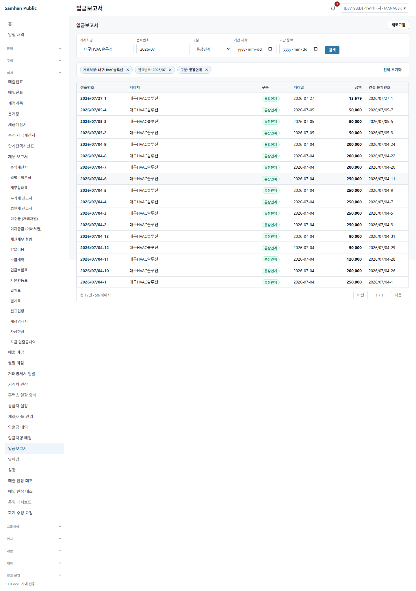
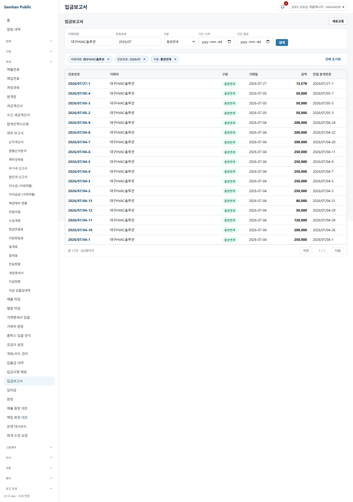
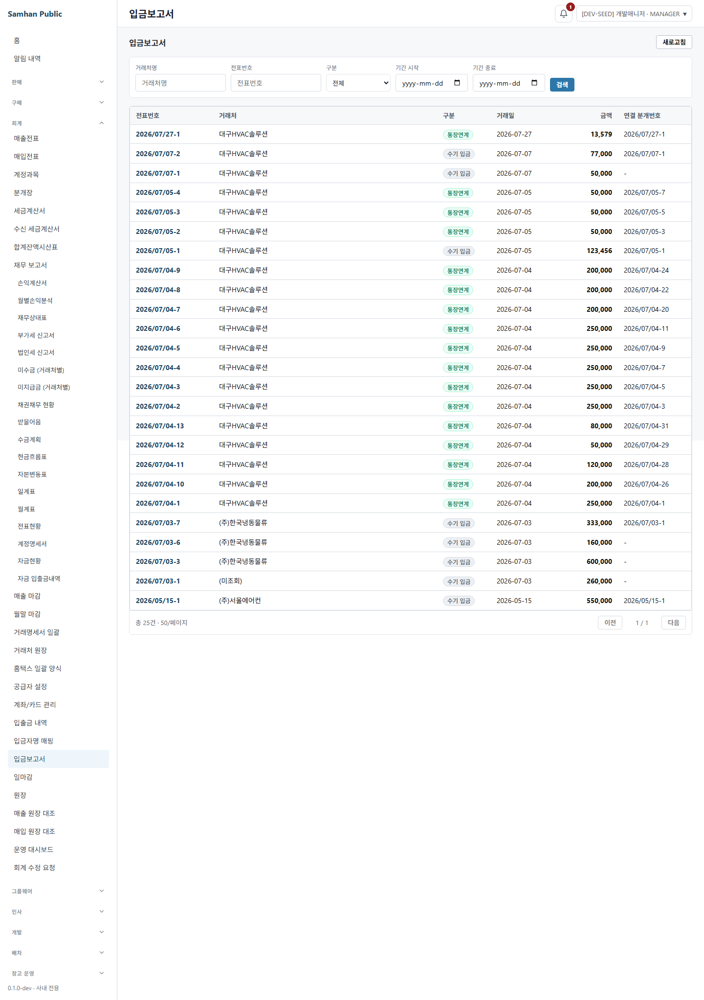
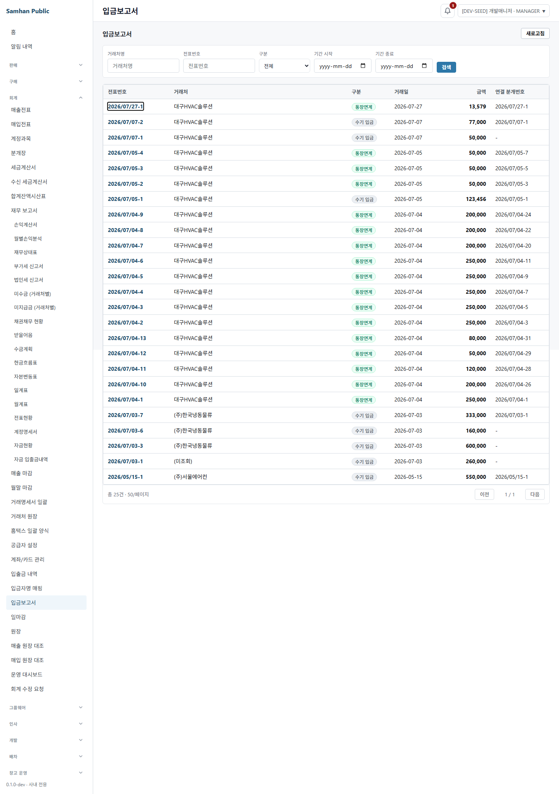
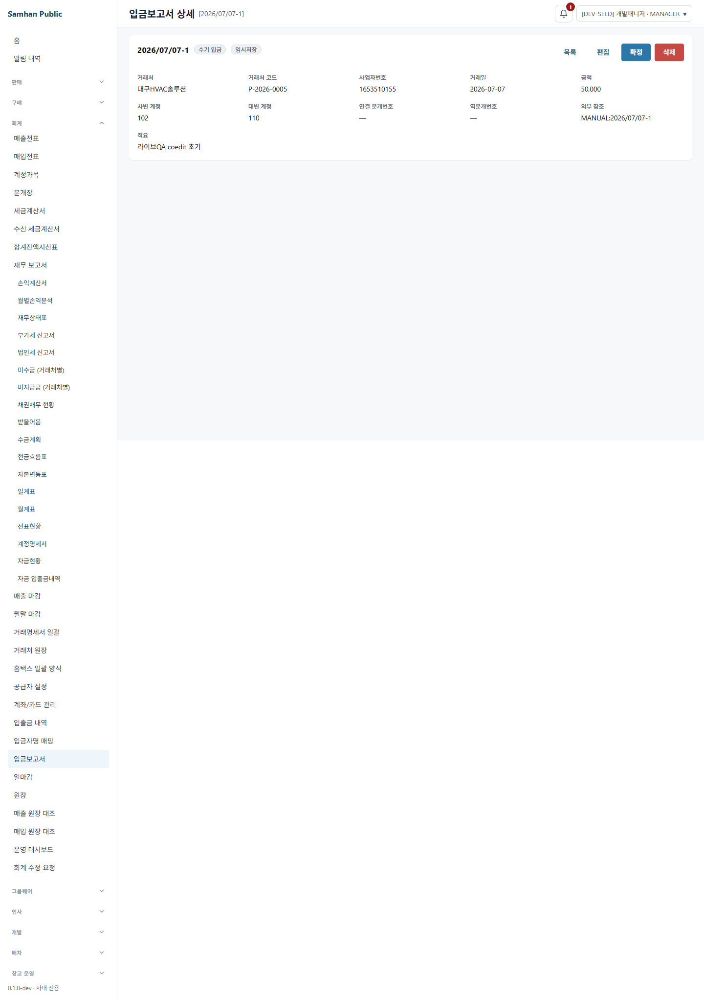

# 2026-08-07 #1094 S4 적대검증 + 라이브 QA

## 결론

PR #1105 / 이슈 #1094의 **슬라이스 1/4(S2 reference + S3 fix)** 만 검증했다.

- S4 신규 결함: **3건**
- S2 이후 누적: **4건** (`stale returnTo` 1 + 이번 3)
- 별도 판정 불가: **페이지 복귀 1항목** — 실 DB 25건, 화면 고정 크기 50건이라 1/1
- 필터 최신성, scroll 복귀, 새로고침/URL 공유, 직접 상세 canonical fallback, native link 접근성, 기존 액션 surface는 통과
- S3~S5의 미구현 화면에 링크가 없는 것은 결함으로 세지 않았다.

## 환경 확인

| 항목 | 실측 |
|---|---|
| cwd | `C:\dev\Samhan-Public\.claude\worktrees\t1094` |
| branch | `feat/1094-docno-hyperlink-and-back` |
| HEAD | `71ab1561a45183f7759d2686f2442aa730fa8ee5` |
| git 상태(시작) | clean |
| API gateway | `127.0.0.1:8080`, healthy |
| accounting-service | `127.0.0.1:8087`, healthy |
| 검증 renderer | 이 worktree Vite, `127.0.0.1:5194`, `VITE_MOCK_MODE=0` |
| 브라우저 | Playwright Chromium `headless: true`, viewport 1440×900 |
| CI 선행 근거 | 사용자 제공 exact SHA 42/42 green |

다른 worktree가 점유한 5173은 사용하거나 종료하지 않았다. 이 worktree만 5194에 hidden으로 띄웠다. 비밀번호·토큰·내부 UUID는 본 문서와 캡처에 기록하지 않았다.

## 발화 조건 카운트

실 API와 화면을 각각 대조했다.

| 조건 | 실측 |
|---|---|
| 전체 | **25건** |
| 종류 | `BANK_LINKED` 17, `MANUAL_RECEIPT` 8 |
| 상태 | `CANCELLED` 21, `CONFIRMED` 3, `DRAFT` 1 |
| 필터 실값 | 거래처명, 전표번호 prefix, 종류 모두 존재 |
| 화면 페이지 크기 | **50건/페이지** |
| 화면 pagination | `총 25건 · 50/페이지`, `1 / 1`, 다음 disabled |

따라서 0건 환경은 아니며 필터·스크롤·상태별 액션은 실 경로로 발화했다. 다만 페이지 이동에는 26건이 더 필요하다. 입금보고서 목록의 신규 작성 route는 목록으로 redirect되며, 이 라운드는 코드/DB 직접 변경을 금지하므로 데이터를 합성하지 않았다. **페이지 복귀는 결함 0이 아니라 판정 불가**다.

## 라이브 QA ①~⑥

### ① 필터 → 페이지 → 스크롤 → 번호 → 상세 → 복귀

- 거래처 `대구HVAC솔루션` → 전표번호 prefix `2026/07` → 종류 `BANK_LINKED` 순으로 세 번 변경한 뒤 번호를 눌렀다.
- 상세의 `목록`으로 복귀한 URL과 세 필터는 마지막 값과 정확히 일치했다.
- scroll은 `520 → 520px`로 복원됐다.
- S3의 `useMemo` stale capture와 같은 최신 상태 상실은 재현되지 않았다.
- 페이지는 위 발화 조건 부족으로 판정 불가다.



### ② 새로고침 · URL 공유

- 같은 목록 URL 새로고침: 세 필터가 모두 재현됐다. 같은 탭 session anchor가 있어 scroll도 520px로 복원됐다.
- 같은 브라우저 context의 새 탭에 URL 직접 입력: 세 필터가 모두 재현됐고 새 tab의 sessionStorage에는 anchor가 없어 scroll 0이었다.
- URL 입력창을 타이핑만 할 때 history 증가 0, `검색`으로 적용할 때 1 증가, 뒤로가기로 직전 목록 query에 복귀했다. 적용 단위 history는 동작하며 키 입력마다 오염되지는 않았다.



### ③ 새 탭 상세 직접 진입 · canonical fallback

- 목록 state 없이 상세 URL을 직접 열고 `목록`을 눌렀다.
- `/accounting/admin/cash-receipts` canonical 목록으로 정상 복귀했다.
- 조작 state의 absolute URL 및 `//` protocol-relative URL은 모두 fallback으로 거부되어 외부 이동이 없었다.
- backslash/percent-encoded backslash도 현재 HashRouter에서 동일 origin 밖으로 나가지 않았다.



### ④ 키보드 접근성

- 마우스 없이 Tab 68회째 첫 전표번호 link에 도달했다. 기존 전체 sidebar tab order가 길지만 신규 링크는 순서에서 누락되지 않았다.
- accessible name: `2026/07/27-1 상세 보기`
- focus ring 실측: `outline: auto 1px`, 화면에서도 테두리를 확인했다.
- Enter: 상세 활성화 성공.
- Space: 활성화하지 않고 현재 URL 유지. native `<a>`의 표준 키 동작이므로 결함으로 세지 않았다.



### ⑤ 기존 행 동작 회귀

실 DB의 상태별 행으로 다음 surface를 직접 확인했다.

| 상태 | 라이브 확인 |
|---|---|
| DRAFT | 목록, 편집 route 진입, 확정 dialog, 삭제 dialog |
| CONFIRMED | 목록, 편집 노출, 취소 dialog |
| CANCELLED | `편집 불가` disabled, `취소된 입금보고서는 수정할 수 없습니다.` 사유 |

main 대비 상세 diff에서도 기존 액션 분기/handler는 삭제되지 않았고 `목록` 목적지만 `returnTo`로 바뀌었다. 공유 DB의 유일한 DRAFT를 없애거나 상태를 비가역 변경하지 않도록 확정·취소·삭제 dialog는 dismiss했다. 최종 mutation 호출은 관련 단위 테스트의 기존 `확정/취소/삭제 mutation을 호출한다`를 포함한 16/16 green과 exact-SHA CI 42/42를 근거로 분리했다.

인쇄·검수·복원은 이 reference 화면의 main 기존 surface가 아니므로 이번 범위의 제거 회귀 대상이 아니다.



### ⑥ 뒤로가기 연타 · 다른 상세 · 앞으로가기

- browser native back으로 `목록 → 상세 → back → 목록`은 정상이다.
- 상세 A URL → 상세 B URL → browser back으로 상세 A 복귀도 정상이다.
- 그러나 상세의 `목록` CTA를 사용하면 별도 history entry를 push하여 아래 결함 D-2가 발생했다.


## 새 표면 결과

### sessionStorage anchor

실측 순서:

1. 같은 query URL에서 240px 저장/복귀 → 240px
2. 같은 URL에서 520px 저장/복귀 → key 수는 계속 1, 값은 520으로 overwrite
3. 다른 query URL에서 180px 저장 → key 수 2
4. 홈을 다녀와 첫 query URL을 새로 열기 → 과거 520px 재적용
5. 성공 복원과 다른 화면 이동 뒤에도 key 수 2, 삭제 없음

`returnContract.ts`는 history entry key를 읽거나 생성하지 않는다. 식별자는 오직 `pathname + search`다.

### returnTo 안전성

- `https://...`, `//...` 조작은 canonical fallback.
- 새 탭 직접 상세는 state가 없어도 정상.
- 외부 redirect 재현 없음.

### URL query와 history

- 입력 중 history 추가 0.
- 검색 적용 시 1회 추가.
- browser back으로 직전 query 복구.
- 다만 상세 `목록` CTA 자체의 push는 별도 결함 D-2다.

### jest-dom devDependency

- 설치 버전: `@testing-library/jest-dom@6.9.1`
- fresh local targeted run: 3 files, **16/16 passed**
- React Router v7 future-flag warning 외 실패/신규 runtime error 없음.
- `git diff --check`: exit 0.

## 결함 3건과 도달 경로

### D-1. scroll anchor가 history entry별이 아니어서 같은 URL entry끼리 충돌하고 낡은 위치를 재사용한다

심각도: **HIGH** — 공통 복귀 계약의 핵심인 정확한 scroll 복원을 직접 위반.

도달 경로 A:

```text
목록 query Q @ 240px → 상세 → 복귀
→ 다시 같은 Q @ 520px → 상세 → 복귀
→ sessionStorage key는 하나, 값은 520으로 overwrite
→ Q의 앞선 history entry도 520을 읽음
```

도달 경로 B:

```text
목록 query Q @ 520px → 상세 → 복귀
→ 홈/다른 화면 이동
→ 나중에 Q를 새로 진입
→ 현재 entry와 무관한 과거 520px을 자동 적용
```

원인: `scrollStorageKey()`가 `pathname + search`만 사용하며 router history key를 받지 않는다.

### D-2. 상세 `목록` CTA가 push navigation하여 browser history ping-pong을 만든다

심각도: **HIGH** — 사용자가 기대하는 뒤로가기/앞으로가기 흐름을 역전시킴.

도달 경로:

```text
목록 L → 번호 link → 상세 D → `목록` CTA → 목록 L'
→ browser back: D
→ browser back: L
→ forward: D
→ forward: L'
```

라이브에서 위 순서가 정확히 재현됐다. 원인: `navigate(returnTo)`가 replace 없이 새 목록 entry를 push한다.

### D-3. scroll anchor의 consume/TTL/상한 정리 경로가 없어 query 조합별로 누적된다

심각도: **MEDIUM** — 한 session에서 필터/페이지 조합 수만큼 key가 무제한 증가하고, quota 도달 시 저장 실패를 catch로 숨긴다.

도달 경로:

```text
query Q1에서 번호 클릭 → key 1
query Q2에서 번호 클릭 → key 2
복귀 성공/다른 화면 이동/새로고침 → key 2 그대로
Q3...Qn 반복 → key n
```

코드와 라이브 양쪽에서 remove/consume/TTL/상한이 없음을 확인했다.

## 통과와 판정 불가 요약

| 항목 | 판정 |
|---|---|
| 여러 번 변경 후 최신 필터 returnTo | PASS |
| scroll 즉시 복귀 | PASS |
| 페이지 복귀 | **판정 불가** (25건 < 50/page) |
| 새로고침 목록 query | PASS |
| 새 탭 URL 공유 | PASS |
| 직접 상세 canonical fallback | PASS |
| absolute/protocol-relative open redirect | PASS |
| Tab/Enter/focus/name | PASS |
| Space | native link 표준 동작, 비결함 |
| 기존 reference 액션 surface | PASS |
| 다른 상세 direct chain | PASS |
| native back/forward | CTA 사용 전 PASS, CTA 사용 후 D-2 |
| anchor entry 격리/낡은 anchor 방지 | FAIL (D-1) |
| anchor 정리 | FAIL (D-3) |

## 이번 범위와 안 본 범위

본 범위:

- `clients/desktop/src/renderer/utils/returnContract.ts`
- `CashReceiptListPage` reference
- `CashReceiptDetailPage` reference
- S3의 stale `returnTo` 교정
- `jest-dom` 추가 영향

안 본 범위:

- S3 canonical 별도 상세 route 10계열
- S4 운영 projection 화면
- S5 번호 없는 master-detail
- 그 화면들에 하이퍼링크가 아직 없는지 여부
- 175 route 전수 회귀
- 공유 DB를 비가역 변경하는 destructive mutation 완료

## 새 파일 목록

- `docs/dev-reports/2026-08-07-1094-s4-reconvergence-and-live-qa.md`
- `docs/qa-shots/1094-s4-live-qa/01-latest-filter-scroll-return.png`
- `docs/qa-shots/1094-s4-live-qa/02-shared-url-state.png`
- `docs/qa-shots/1094-s4-live-qa/03-direct-detail-canonical-fallback.png`
- `docs/qa-shots/1094-s4-live-qa/04-keyboard-focus-ring.png`
- `docs/qa-shots/1094-s4-live-qa/05-draft-existing-actions.png`
- `docs/qa-shots/1094-s4-live-qa/06-history-forward-back.png`

코드 파일, package 파일, lockfile은 수정하지 않았다.
