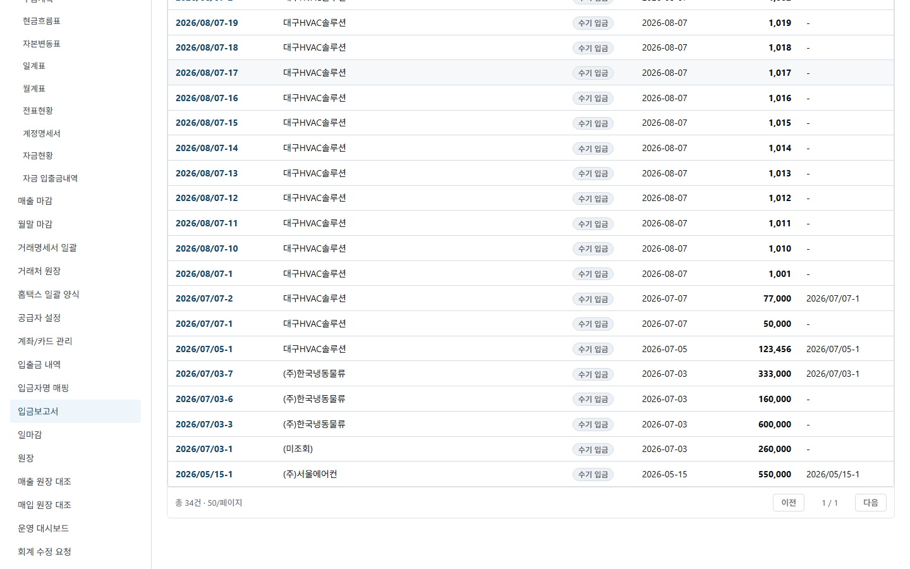
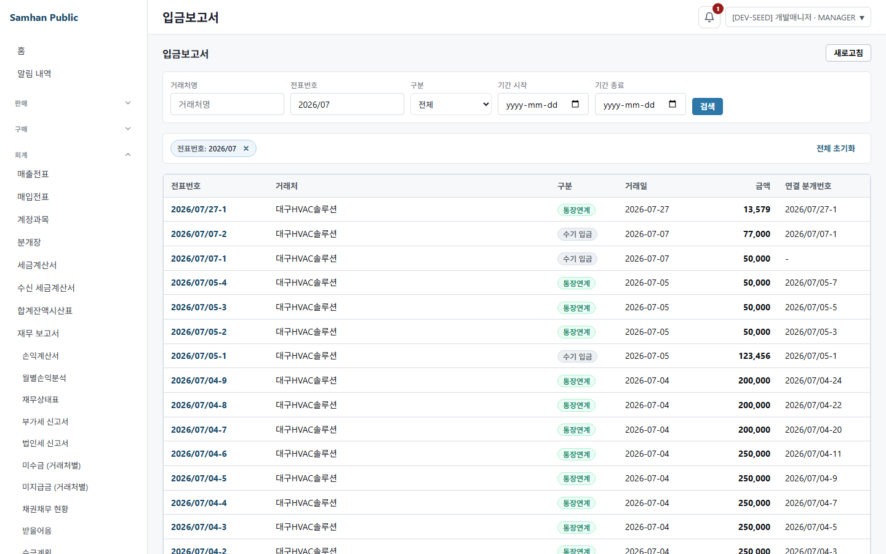
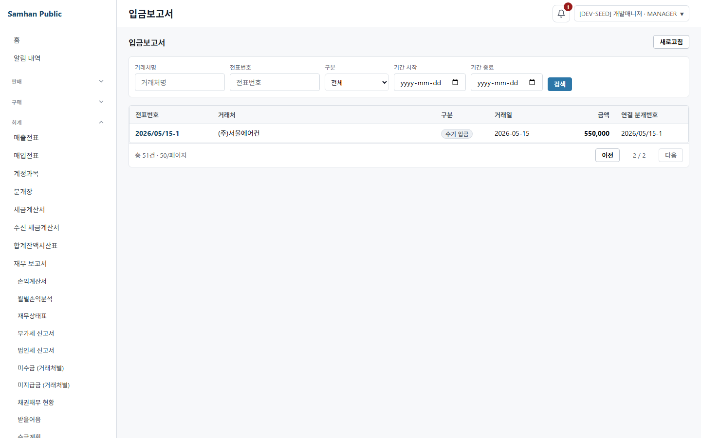
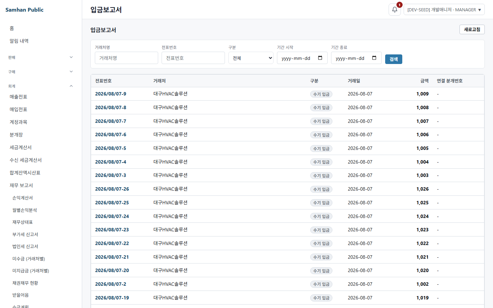
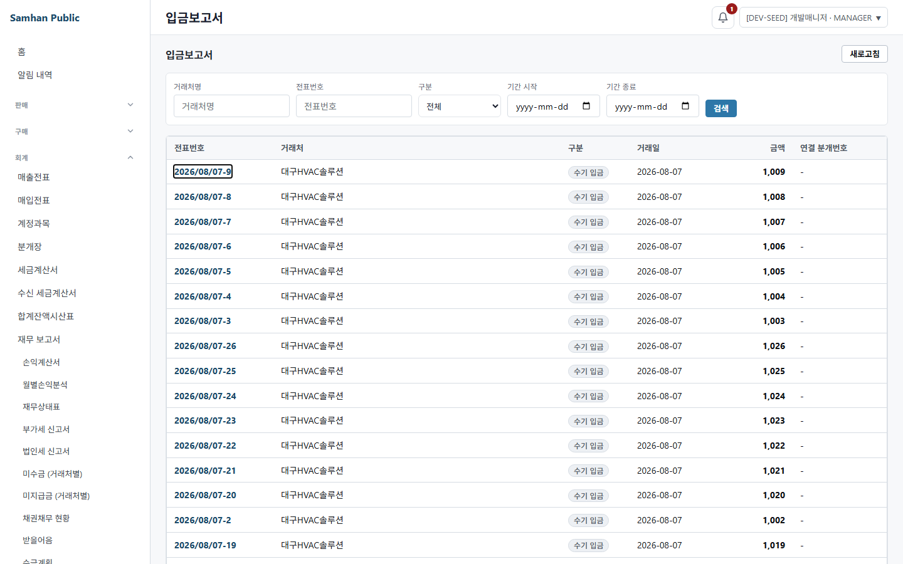

# 2026-08-07 #1094 S6 재수렴 + 직접 라이브 QA

## 결론

PR #1105 / 이슈 #1094의 S5 규칙을 **SOL이 실 renderer와 정상 API로 직접 재검증**했다.

- S4 결함 3건 중 D1·D2·D3: **모두 해소**
- S6 결함: **1건** (`S4 3 → S6 1`)
- 페이지 복귀: S5가 만든 전체 51건으로 `2 / 2 → 상세 → 목록 → 2 / 2` **PASS**
- 새 탭 canonical fallback, 외부 URL 차단, 키보드 접근성, 저장·삭제의 실제 mutation과 목록 갱신을 직접 밟았다.
- 새 결함은 사용자가 제시한 “navigate(-1)이 stale cache를 보인다”가 아니라 **편집/저장·삭제 경로가 복귀 계약 자체를 잃는다**는 셋째 가능성이다.

## 환경 확인

| 항목 | 실측 |
|---|---|
| cwd | `C:\dev\Samhan-Public\.claude\worktrees\t1094` |
| branch | `feat/1094-docno-hyperlink-and-back` |
| HEAD | `2b54d49fd284c3d7090e5ff298a422f959847c60` |
| git 상태(시작) | clean |
| 선행 CI | 사용자 제공 exact SHA **42/42 green** |
| gateway / accounting | `127.0.0.1:8080` / `127.0.0.1:8087`, live |
| renderer | 이 worktree Vite `127.0.0.1:5194`, `VITE_MOCK_MODE=0` |
| 브라우저 | Playwright Chromium `headless: true`, 1440×900 |
| 인증 | UI 로그인 후 `/auth/me` 200, `/auth/admin/permissions/my` 200 |

S5가 겪은 로그인/대시보드 redirect는 재현되지 않았다. 원인은 `.env.local` 자격으로 UI 로그인을 마친 **같은 browser context**에서 httpOnly session cookie를 유지하고, 권한 API 완료 뒤 대상 route를 연 데 있다. 부팅 전 `/auth/me` 401 두 건은 비로그인 초기 probe이며 로그인 뒤 200으로 전환됐다. 비대상 app-version/notice 서비스의 503은 있었지만 입금보고서 route와 API를 막지 않았다.

다른 worktree와 컨테이너는 건드리지 않았고 컨테이너 재빌드도 하지 않았다. renderer와 Chromium은 창 없이 실행했으며 종료 시 모두 회수했다. 비밀번호·토큰·내부 UUID는 문서와 캡처에 기록하지 않았다.

## 발화 조건 카운트

S5 생성분을 포함한 live API를 100건 크기로 조회해 다시 셌다.

| 조건 | 실측 |
|---|---|
| 전체 | **51건** |
| 페이지 | **2페이지** (`50/페이지`) |
| 상태 | `DRAFT` 27, `CANCELLED` 21, `CONFIRMED` 3 |
| 종류 | `MANUAL_RECEIPT` 34, `BANK_LINKED` 17 |
| S6 QA 데이터 | 정상 API로 1건 생성(`S6-1094-*`) → 저장 → UI 삭제 → 상세 GET 404 확인 |

S6 데이터는 라운드 종료 전에 삭제해 전체를 다시 51건으로 되돌렸다.

## 라이브 QA ①~⑦

### ① D1 — 같은 URL의 서로 다른 entry별 scroll 복원

동일한 `?kind=MANUAL_RECEIPT` URL을 홈 화면을 사이에 두고 두 번 방문했다. 두 방문은 서로 다른 React Router `location.key`를 가졌다.

```text
entry A key r7k6bl0z: 600 저장 → 목록 복귀 600
entry B key ffl7aa52: 900 저장 → 목록 복귀 900
상세 새로고침 뒤 목록: 900 복원
각 복귀 직후 해당 key: 소비되어 0건
```

첫 자동화에서는 첫 행 locator를 클릭하는 과정에서 Playwright가 링크를 화면에 넣으려고 먼저 0px로 스크롤해 `420→0`, `760→0`이 나왔다. 저장된 anchor도 실제로 `scrollY: 0`이어서 제품 결함이 아닌 측정 오염으로 판정했다. 현재 viewport 안의 행을 클릭하는 방식으로 재측정한 위 값이 최종 판정이다.



### ② D2 — 목록 CTA 뒤 back/forward

```text
홈 → 목록 → 상세 → `목록`
CTA 직후: 목록
browser back: 홈 (상세로 튕기지 않음)
browser forward: 목록
```

상세 새로고침 후에도 history state가 유지돼 `목록`은 원래 필터 목록으로 되감겼다. 뒤로가기 연타/앞으로가기에서 S4의 목록↔상세 ping-pong은 재현되지 않았다.


### ③ D3 — consume · TTL · 50개 상한

실 renderer sessionStorage에 production 형식으로 만료/미래/깨진 anchor 3개와 유효 anchor 55개를 준비한 뒤 실제 전표번호 link click으로 production `saveScrollAnchor` 정리 경로를 발화했다.

| 시점 | `samhan:return-scroll:*` 수 |
|---|---:|
| 정리 전 | 58 |
| 실제 상세 진입 직후 | **50** |
| 목록 복귀 소비 직후 | **49** |

- 25시간 지난 항목: 제거
- 미래 createdAt 항목: 제거
- JSON 파싱 불가 항목: 제거
- 가장 오래된 유효 항목: 상한 밖 제거
- 별도 필터 조합 5회 왕복: 매회 복귀 후 key 수 `0, 0, 0, 0, 0`



### ④ 페이지 복귀 — 51건 실제 2페이지

S5가 못 밟은 항목을 이번에 live DOM으로 밟았다.

```text
전체 목록 `1 / 2` → 다음 → URL `?page=1`, 화면 `2 / 2`
두 번째 페이지 전표 `2026/05/15-1` → 상세 → `목록`
복귀 URL `?page=1`, 화면 `2 / 2`
```

필터/페이지 정본이 URL에 유지되고 history unwind 뒤에도 동일했다.



### ⑤ 새 탭 canonical fallback · 외부 URL 차단

- state 없는 새 page에서 상세 직접 진입 → `목록` → canonical `/accounting/admin/cash-receipts`
- fallback이 `replace`여서 그 뒤 browser back은 상세가 아니라 `about:blank`
- history state의 `returnTo.pathname`을 absolute 외부 URL로 조작 → canonical 내부 목록으로 복귀
- 관측된 최종 origin은 계속 `http://127.0.0.1:5194`



### ⑥ 접근성

- 마우스 없이 Tab **68회**에 첫 전표번호 link 도달
- 실제 element: native `A`
- accessible name: `2026/08/07-9 상세 보기`
- focus ring: `outline-style: auto`, `outline-width: 1px`
- Enter: 상세 route 진입 성공



### ⑦ 기존 행 동작 — 삭제 · 인쇄 · 검수 · 복원

reference 화면의 기존 action surface를 main 대비 diff와 live DOM으로 대조했다.

| 동작 | 판정 |
|---|---|
| 편집/저장 | S6 DRAFT를 UI 편집해 적요 `S6-1094-liveqa-saved`가 상세에 반영됨 |
| 삭제 | 상세의 삭제 confirm을 실제 승인, 목록 이동 뒤 상세 GET **404** |
| 확정/취소 | DRAFT/CONFIRMED 상태별 버튼 surface 존속; 이번 라운드는 공유 기존 행을 비가역 변경하지 않음 |
| 인쇄/검수/복원 | CashReceipt reference의 main 기존 surface가 아님. diff에서 제거된 handler/button도 0건이므로 비결함·비적용 |

S6 QA 행은 삭제돼 목록이 원래 51건으로 갱신됐다.


## navigate(-1) 새 표면 결과

| 새 표면 | 결과 |
|---|---|
| history/state 없는 상세 직접 진입의 `목록` | PASS — canonical replace fallback |
| 상세 A에서 상세 B 직접 이동 후 `목록` | 현재 reference UI에는 상세→상세 link가 없음. 주소 직접 이동 시 state 없는 B이므로 canonical fallback PASS |
| 뒤로가기 연타 · 앞으로가기 | PASS — 상세 ping-pong 없음 |
| 상세 새로고침 뒤 `목록` | PASS — 원래 query와 900px 복원 |
| 상세 → 편집 → 저장 → 상세 → `목록` | **FAIL — 원래 query 소실** |
| 상세 → 삭제 성공 → 목록 | 데이터 갱신 PASS(404), **원래 query 소실** |

저장 데이터 자체는 stale하지 않았다. 저장 직후 상세에서 새 적요를 확인했고 삭제 후 GET 404까지 확인했다. 위험의 실제 형태는 “캐시로 낡은 목록”이 아니라 아래 복귀 계약 단절이다.

## S6 결함 1건 — 도달 경로

### S6-D1. 편집/저장·삭제 mutation 경로가 복귀 계약을 버려 원래 필터·페이지·scroll 목록으로 돌아가지 못한다

심각도: **HIGH** — S5가 정한 1:1 이동 계약이 상세의 기존 주요 action을 거치면 끊긴다.

도달 경로 A — 저장:

```text
필터 목록 L(?slipNo=2026/08/07-27)
→ 번호 link → 상세 D (returnTo + returnEntryKey 보유)
→ `편집` → edit route (state 전달 없음)
→ `저장` → 상세 D' replace (state 전달 없음)
→ `목록` → canonical 무필터 목록
관측: filterPreserved=false
```

도달 경로 B — 삭제:

```text
필터 목록 L(?slipNo=2026/08/07-27)
→ 번호 link → 상세 D
→ `삭제` 승인
→ delete 성공 handler가 canonical 목록으로 replace
관측: 삭제 데이터 GET 404, 그러나 원래 query 없음
```

둘은 같은 원인이라 2건으로 부풀리지 않고 **1건**으로 센다. `CashReceiptDetailPage`의 편집 navigation과 delete 성공 handler, `CashReceiptFormPage`의 저장 성공 navigation이 `returnTo/returnEntryKey`를 전달하거나 소비하지 않는다. 원래 목록 entry는 history 안에 남아 있지만 저장 뒤 상세는 state를 잃어 `navigate(-1)` 분기를 선택할 수 없다.

개발책임자가 제시한 두 갈래 밖의 셋째 가능성은 다음과 같다.

```text
가) navigate(-1)이 캐시를 타서 목록이 낡는다  → 아님 (저장/삭제 반영 확인)
나) mutation 뒤 목록 refetch가 안 된다        → 아님 (삭제 후 404, 목록 51건)
다) mutation 경로에서 복귀 이동의 identity를 잃는다 → 실제 관측
```

## 결함 수 — S4 대비

```text
S4: 3
S6: 1
변화: -2
```

| S4 결함 | S6 |
|---|---|
| D1 같은 URL anchor 충돌 | PASS — entry key 두 개, 600/900 독립 복원 |
| D2 목록 CTA history push | PASS — unwind, back=홈, forward=목록 |
| D3 무소비·무TTL·무상한 | PASS — consume, 24h TTL, 50 상한 실측 |
| S6 신규 | **1건** — mutation/edit flow의 return identity 소실 |

따라서 S5는 S4의 세 결함을 닫았고 총 결함 수도 감소했다. 다만 새 mutation 경로 결함이 있어 현 상태를 “결함 0”으로 판정하지 않는다.

## 본 범위와 안 본 범위

본 범위:

- `returnContract.ts`의 entry anchor/consume/TTL/상한
- CashReceipt reference 목록·상세·편집/저장·삭제
- 같은 URL 재방문, 페이지 2, 새 탭 direct entry, refresh, back/forward
- native link 접근성

안 본 범위:

- 슬라이스 2~4의 canonical 상세 route 10계열
- 운영 projection 화면
- 번호 없는 master-detail
- 위 미구현 화면들의 번호 link 유무
- 175 route 전수 회귀
- CashReceipt reference에 원래 존재하지 않는 인쇄/검수/복원 기능 구현 여부

## 새 파일 목록

- `docs/dev-reports/2026-08-07-1094-s6-reconvergence-and-live-qa.md`
- `docs/qa-shots/1094-s6-live-qa/01-d1-entry-scroll-restored.png`
- `docs/qa-shots/1094-s6-live-qa/02-d2-forward-returns-list.png`
- `docs/qa-shots/1094-s6-live-qa/03-d3-storage-consumed.png`
- `docs/qa-shots/1094-s6-live-qa/04-page-2-return.png`
- `docs/qa-shots/1094-s6-live-qa/05-canonical-external-block.png`
- `docs/qa-shots/1094-s6-live-qa/06-keyboard-focus.png`
- `docs/qa-shots/1094-s6-live-qa/07-save-delete-list-refreshed.png`

코드·package·lockfile은 수정하지 않았고 commit/push도 하지 않았다.
