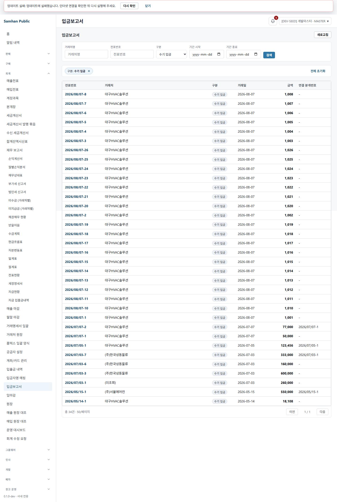
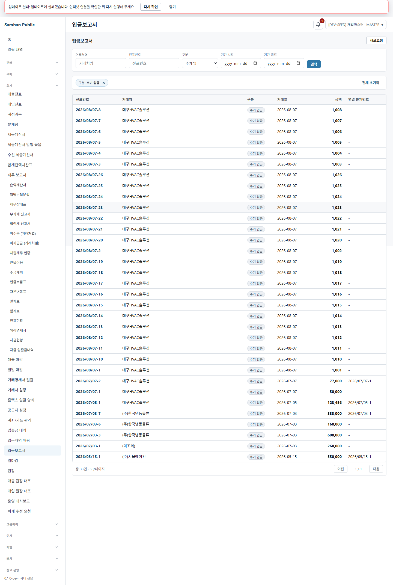
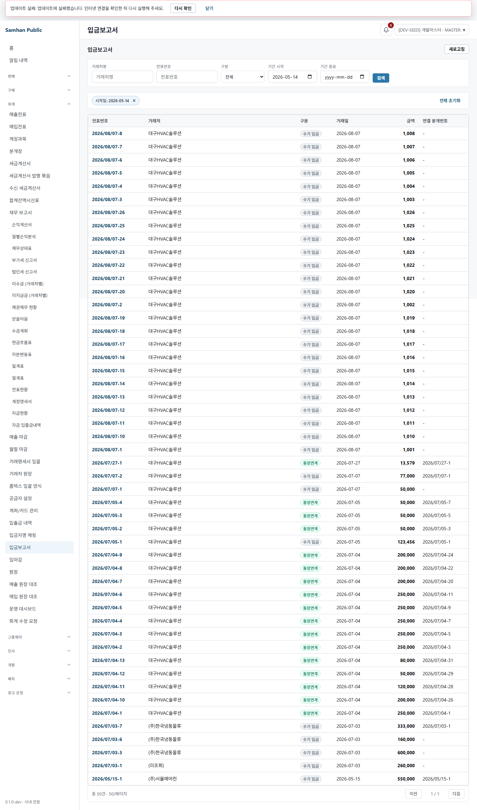
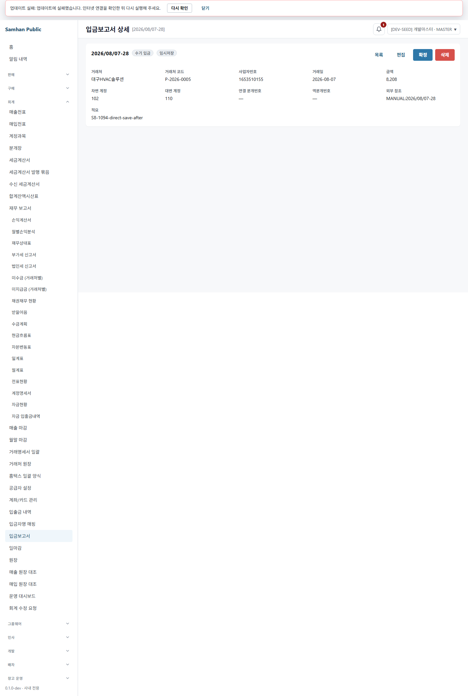
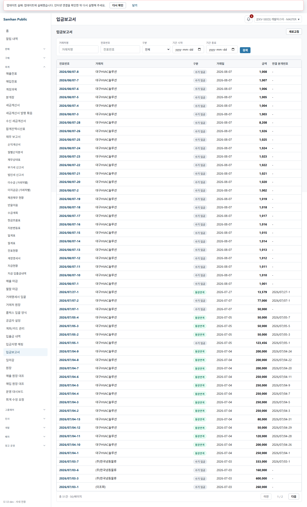
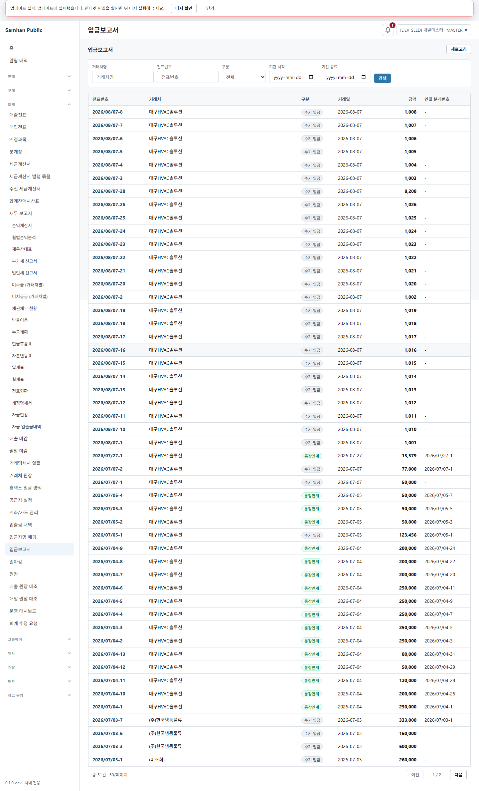
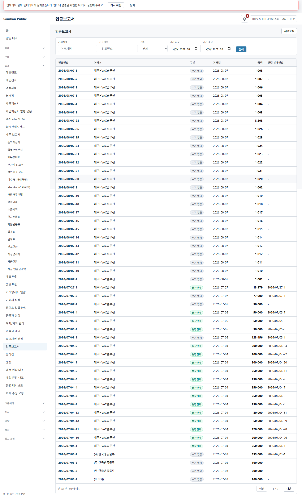
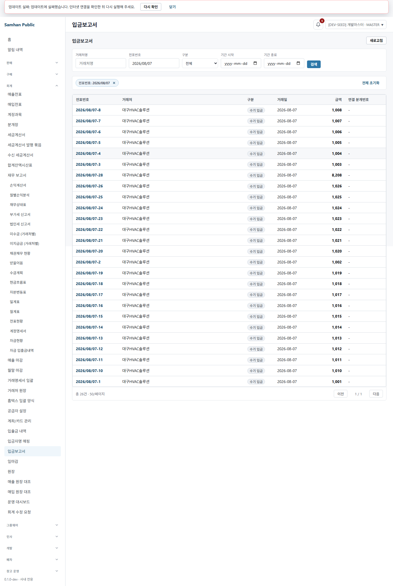
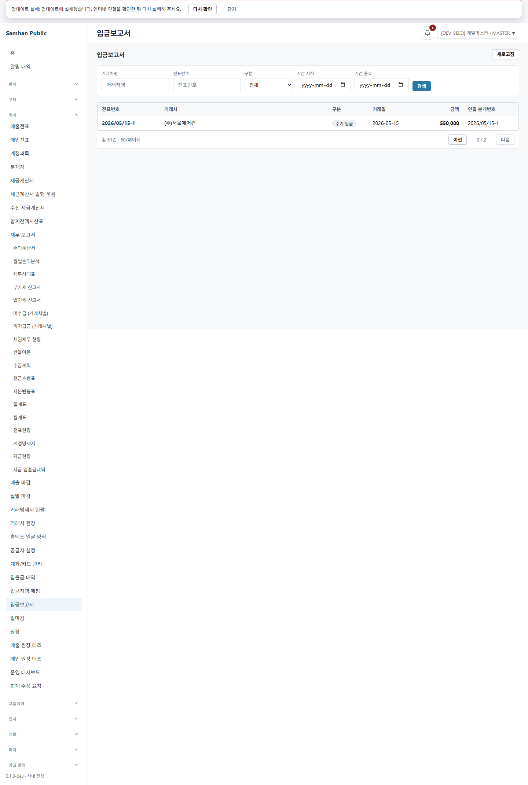
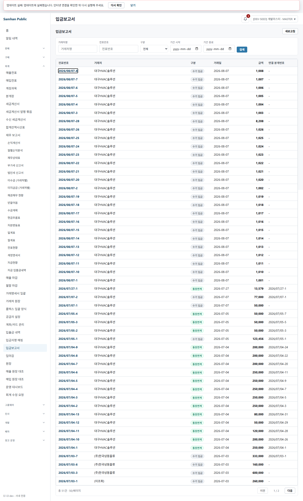

# 2026-08-07 #1094 S8 재수렴 + SOL 직접 라이브 QA

## 결론

PR #1105 / 이슈 #1094의 S7 mutation 복귀 규칙을 실제 renderer와 정상 API로 직접 검증했다.

- **S8 결함: 0건** (`S4 3 → S6 1 → S8 0`)
- 저장 성공은 `PATCH → inactive 목록 refetch → navigate(-2)` 순서로 발화했고, 원래 필터와 900px scroll로 복귀한 즉시 변경 금액 `18,108`이 보였다. 낡은 `8,108` 행은 보이지 않았다.
- 삭제 성공은 원래 필터와 scroll로 복귀했다.
- 51건의 마지막 페이지 마지막 1건을 삭제하자 실제로 빈 page가 생겼고, `from=2026-05-14` 필터는 유지한 채 `page=1`만 제거되어 마지막 유효 page `1 / 1`로 clamp됐다.
- 상세에는 직접 저장 버튼이 없다. `navigate(-2)`는 `목록 → 상세 → 편집 → 저장` 경로에만 사용된다.
- 새 탭 직접 상세 진입의 저장은 사용자가 제시한 두 갈래 밖의 **셋째 동작**이었다. canonical 목록이나 history `-2`가 아니라 **저장된 상세로 replace**했다. 새 탭 직접 삭제는 canonical 목록으로 replace했다.
- S5가 닫은 RED-B D1·D2·D3와 51건 페이지 복귀는 모두 PASS다.

따라서 이 라운드 실측으로 머지 게이트 ①·③은 충족한다. 게이트 ②는 개발책임자가 제시한 exact SHA CI 42/42 green을 기록 근거로 사용했다.

## 환경 확인

| 항목 | 실측 |
|---|---|
| cwd | `C:\dev\Samhan-Public\.claude\worktrees\t1094` |
| branch | `feat/1094-docno-hyperlink-and-back` |
| HEAD | `0f3fdd74723481cb9b4bb4b31ff27137f52b4d9e` |
| 시작 git 상태 | clean |
| CI | exact SHA 42/42 green — 개발책임자 제공값 |
| gateway / accounting | `127.0.0.1:8080` / `127.0.0.1:8087`, Docker healthy |
| renderer | 이 worktree Vite `127.0.0.1:5194`, `VITE_MOCK_MODE=0` |
| 브라우저 | Playwright Chromium `headless: true`, viewport 1440×900 |
| 인증 | 실 auth login 200, MASTER 권한 |
| 컨테이너 | 조회만 수행, rebuild/restart 없음 |
| 데이터 변경 | 정상 API로 S8 표본 생성, 화면에서 저장/삭제. DB 직접 변경 없음 |

인앱 Browser 연결은 가용 인스턴스가 0개여서 저장소의 공식 라이브QA 방식인 `clients/desktop` Playwright Chromium을 사용했다. 창은 띄우지 않았다.

상단의 기존 `업데이트 실패` notice는 app-version 서비스의 별도 surface이며 입금보고서 API/route를 막지 않았다. #1094의 신규 결함으로 세지 않았다.

## 발화 조건 카운트

시작 시 정상 API를 `size=100`으로 조회했다.

| 시점 | 전체 | 조건 |
|---|---:|---|
| 시작 | **51** | `50/페이지`, `2페이지` |
| 상태 |  | `DRAFT 27`, `CANCELLED 21`, `CONFIRMED 3` |
| 종류 |  | `MANUAL_RECEIPT 34`, `BANK_LINKED 17` |
| S5 QA DRAFT 1건 UI 삭제 후 | **50** | 일반 삭제 복귀 표본 |
| `S8-1094-save-before` 생성 후 | **51** | 거래일 `2026-05-14`, 마지막 page 마지막 1건 |
| 저장 후 | **51** | 금액 `8,108 → 18,108`, memo/행에도 S8 표식 |
| 빈 page clamp 삭제 후 | **50** | `page=1`이 비어 page 0으로 clamp |
| 새 탭 직접 저장/삭제 표본 2건 생성 후 | **52** | 모두 memo에 `S8-1094-*` |
| 직접 삭제 후 최종 | **51** | 직접 저장 표본 1건만 남음 |

최종 S8 잔존 데이터는 DRAFT `2026/08/07-28`, memo `S8-1094-direct-save-after` 1건이다. 삭제 표본 2건은 목록/GET 대상에서 사라졌고 최종 전체 건수는 시작과 같은 51건이다.

## S7 라이브QA ①~⑤

### ① 저장 후 복귀 — 필터·페이지·scroll·갱신 값

경로:

```text
목록 ?kind=MANUAL_RECEIPT @ 900px
→ S8 전표 상세
→ 편집
→ 금액 8,108 → 18,108 + 입금 행 합계 18,108
→ 저장
```

실측:

- `PATCH /accounting/cash-receipts/{id}` 200 계열 성공 응답
- 곧바로 inactive 목록 `GET ...?page=0&size=50&kind=MANUAL_RECEIPT` 발화
- 복귀 URL `?kind=MANUAL_RECEIPT`, page 0 유지
- scroll `900 → 900`
- 복귀한 같은 행의 금액 cell: 정확히 `18,108`
- 변경 전 `8,108` 행은 관측되지 않음

첫 저장 클릭 때는 총액만 바꿔 기존 폼 validation인 `행 합계가 입금 총액과 같아야 합니다.`가 표시됐고 PATCH는 0건이었다. 입금 행 합계를 함께 맞춘 뒤 위 저장 계약이 정상 발화했다. 이는 S7 결함이 아니라 기존 입력 계약의 정상 차단이다.



### ② 삭제 후 복귀 — 원래 필터·페이지

S5 QA DRAFT `2026/08/07-9`를 `?kind=MANUAL_RECEIPT` 목록 600px에서 상세로 열어 UI 삭제했다.

- 복귀 URL: `?kind=MANUAL_RECEIPT`
- filter: `MANUAL_RECEIPT` 유지
- page: 0 유지
- scroll: `600 → 600`
- 삭제 전표 링크: 0건



### ③ 삭제로 현재 page가 비는 경우 — 마지막 유효 page clamp

정확히 51건인 상태에서 `?from=2026-05-14&page=1`로 진입했다.

```text
삭제 전: 2 / 2, tbody 1행, 그 1행 = S8-1094-save-after
삭제 성공: page=1의 유일 행 제거
삭제 후: ?from=2026-05-14, 1 / 1
```

- 실제 필터 `from=2026-05-14` 유지
- 유효하지 않은 `page=1`만 제거
- 삭제 행 0건



### ④ `navigate(-2)` 적용 경계

실제 DRAFT 상세 action surface는 `목록 / 편집 / 확정 / 삭제`였고 **상세 직접 `저장` 버튼은 0개**였다.

- 목록 → 상세 → 편집 → 저장: `navigate(-2)`로 원래 목록 entry 복귀 — ①에서 PASS
- 목록 → 상세 → 저장(편집 화면 없음): **발화 가능한 UI 경로가 없음**
- 새 탭 상세 → 편집 → 저장: return entry가 없으므로 `-2`가 아니라 저장된 상세로 replace — ⑤에서 PASS

따라서 `-2`가 한 칸 더 가는 실사용 경로는 발견되지 않았다.

### ⑤ 새 탭 직접 상세 진입 — 저장/삭제 목적지

새 page의 history는 `about:blank → 직접 상세`로 `history.length=2`였다.

| 동작 | 실측 목적지 | 판정 |
|---|---|---|
| 직접 상세 → 편집 → 저장 | 같은 저장된 상세 URL로 `replace` | PASS — 셋째 가능성 |
| 직접 상세 → 삭제 | canonical `/accounting/admin/cash-receipts`로 `replace` | PASS |

저장 표본의 API 값도 `memo=S8-1094-direct-save-after`로 재조회됐다. 직접 삭제 표본은 최종 목록에서 0건이다.





## RED-B 회귀

### D1 — 같은 URL 두 방문의 entry별 scroll

같은 canonical 목록 URL을 `목록 → 상세 → 목록`, `홈`, 다시 `목록 → 상세 → 목록` 순서로 두 번 방문했다.

| 방문 | 저장 scroll | 복원 scroll |
|---|---:|---:|
| entry A | 600 | **600** |
| entry B | 900 | **900** |

두 번째 entry의 React Router key는 `noowmqhe`였고 첫 초기 entry와 달랐다. 두 복귀 뒤 anchor 잔존은 각각 소비되어 0건이었다.



### D2 — 목록 CTA 뒤 back/forward 비핑퐁

```text
목록 → 상세 → 목록 CTA
browser back    → 홈 (상세 아님)
browser forward → 목록 (상세 아님)
```

back/forward 어느 방향에서도 상세 ping-pong은 재현되지 않았다.



### D3 — consume·TTL 24h·상한 50·여러 필터 왕복

실 renderer sessionStorage에 production 형식으로 유효 anchor 55개, 25시간 만료 1개, 미래 1개, 깨진 JSON 1개를 준비했다.

| 시점 | `samhan:return-scroll:*` |
|---|---:|
| 발화 전 | 58 |
| 실제 번호 link click 직후 | **50** |
| 목록 복귀·1회 소비 후 | **49** |

- 만료/미래/깨진 항목 잔존: 0
- `partnerName`, `kind`, `from`, `to`, `slipNo` 다섯 필터 조합을 각각 상세 왕복한 뒤 key 수: `49, 49, 49, 49, 49`
- TTL·상한·1회 소비가 모두 실제 production save/get 경로에서 작동



### 51건 페이지 복귀

```text
전체 51건 → ?page=1 → 2 / 2, 1행
→ 상세 → 목록
→ ?page=1, 2 / 2
```



## 그 밖 회귀

### 기존 행 동작

| 동작 | 결과 |
|---|---|
| 삭제 | PASS — 일반 삭제·마지막 page 삭제·직접 진입 삭제를 각각 UI로 수행 |
| 인쇄 | reference 입금보고서 목록/상세의 기존 surface에 버튼 0개 — 비적용 |
| 검수 | reference 입금보고서 목록/상세의 기존 surface에 버튼 0개 — 비적용 |
| 복원 | reference 입금보고서 목록/상세의 기존 surface에 버튼 0개 — 비적용 |

인쇄·검수·복원이 있는 다른 도메인 화면을 #1094 reference의 기존 기능처럼 간주해 범위를 확장하지 않았다.

### 접근성

- 마우스 없이 Tab 14회째 첫 전표번호 링크 도달
- 실제 element: native `A`
- accessible name: `2026/08/07-8 상세 보기`
- focus ring: `outline-style: auto`, `outline-width: 1px`
- Enter: 해당 상세 route 진입 성공



### canonical fallback·외부 URL 차단

- 새 탭 state 없는 직접 상세 → 삭제: canonical 목록
- 조작 `returnTo.pathname=https://evil.example/steal`: canonical 목록, origin 유지
- 조작 `returnTo.pathname=//evil.example/steal`: canonical 목록, origin 유지
- 최종 origin: `http://127.0.0.1:5194`


## 결함 수 — S6 대비

```text
S4: 3
S6: 1
S8: 0
S6 대비: -1
```

| 과거 결함 | S8 |
|---|---|
| S4 D1 같은 URL anchor 충돌 | PASS — 600/900 entry별 복원 |
| S4 D2 history ping-pong | PASS — back=홈, forward=목록 |
| S4 D3 무소비·무TTL·무상한 | PASS — 58→50→49, 다섯 왕복 모두 49 |
| S6 mutation 복귀 identity 소실 | PASS — 저장/삭제 원래 entry, 직접 진입 fallback 분리 |
| S7 신규 surface 빈 page clamp | PASS — 필터 유지, page만 clamp |

## 본 범위와 안 본 범위

본 범위:

- `returnContract.ts`의 entry anchor·consume·TTL·상한
- 입금보고서 reference 목록·상세·편집/저장·삭제
- mutation 후 inactive 목록 refetch와 history unwind
- 삭제로 빈 page가 된 경우의 clamp
- 직접 상세 진입, back/forward, 51건 pagination
- native link 키보드 접근성과 외부 URL 차단

안 본 범위:

- 슬라이스 2~4: canonical 상세 route 10계열
- 운영 projection
- 번호 없는 master-detail
- reference 밖 화면의 인쇄·검수·복원 도메인 기능
- 175개 전체 route 전수
- 컨테이너 rebuild/restart 및 DB 직접 검증

## 프로세스 회수

- Playwright browser/context/page: `browser.close()` 완료
- S8 Vite PID `41528`: 실행파일·명령행을 대조한 뒤 종료
- S8 esbuild PID `85480`: 이 worktree 절대 경로 대조 후 종료
- 종료 확인: `ViteAlive=false`, `EsbuildAlive=false`, `5194 listener=false`
- Playwright Chromium profile 프로세스: 0건. 검색 시 1건으로 보인 것은 검색 문자열 자체를 가진 PowerShell 프로세스였고 실행파일/명령행 대조로 제외했다.
- Docker 컨테이너는 건드리지 않았고 모두 기존 상태로 남겼다.

## 새 파일 목록

- `docs/dev-reports/2026-08-07-1094-s8-reconvergence-and-live-qa.md`
- `docs/qa-shots/1094-s8-live-qa/01-save-return-refetched.png`
- `docs/qa-shots/1094-s8-live-qa/02-delete-filter-return.png`
- `docs/qa-shots/1094-s8-live-qa/03-delete-empty-page-clamped.png`
- `docs/qa-shots/1094-s8-live-qa/04-direct-entry-save-canonical.png`
- `docs/qa-shots/1094-s8-live-qa/05-direct-entry-delete-canonical.png`
- `docs/qa-shots/1094-s8-live-qa/06-redb-d1-distinct-scroll.png`
- `docs/qa-shots/1094-s8-live-qa/07-redb-d2-history-no-pingpong.png`
- `docs/qa-shots/1094-s8-live-qa/08-redb-d3-storage-bounded.png`
- `docs/qa-shots/1094-s8-live-qa/09-redb-51-page-return.png`
- `docs/qa-shots/1094-s8-live-qa/10-accessibility-focus-enter.png`
- `docs/qa-shots/1094-s8-live-qa/11-canonical-external-block.png`

코드·package·lockfile은 수정하지 않았고 commit/push도 수행하지 않았다.
