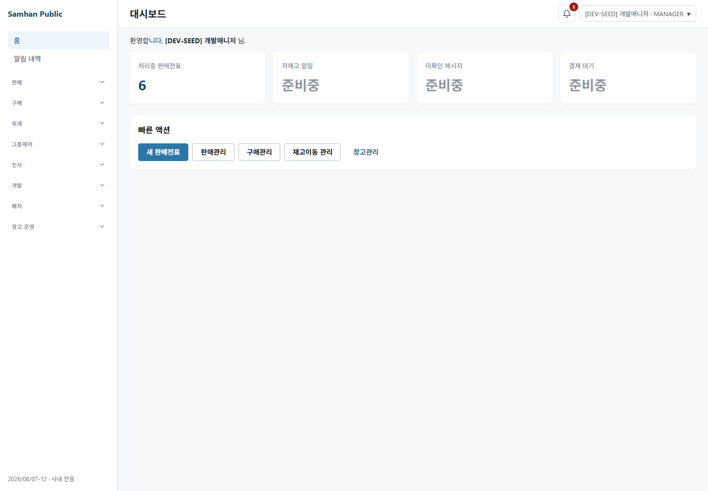

# PR #1107 / 이슈 #1101 — S12 최종 재수렴 및 라이브 QA

## 결론

S12 결함 수는 **1건(HIGH)** 이다. S9의 1건과 같아 감소하지 않았다.

지원 확장자 안에서는 S10 가드와 G8c가 새 루트를 내용 기반으로 발견한다. 그러나 그보다 한 층 위에서 `EXECUTABLE_EXTENSIONS`, `derivedEvidenceWriters()`의 언어 확장자, 환경변수 접근 문법과 대문자 키 정규식이 검사 모집단을 먼저 잘라 낸다. 같은 직접 읽기·증거 쓰기를 확장자나 키 대소문자만 바꾸면 green이므로, "검사 대상을 목록으로 정하는 곳"은 아직 남아 있다.

```text
S9:  1
S12: 1 (HIGH)
증감: 0
```

따라서 PR #1107은 CI 50/50은 exact SHA에서 green이지만, 머지 게이트 ①(도달 결함 0)을 충족하지 못한다.

## 환경 확인

| 항목 | 직접 실측 |
|---|---|
| 작업 경로 | `C:\dev\Samhan-Public\.claude\worktrees\t1101` |
| 브랜치 / HEAD | `chore/1101-credential-plaintext-cleanup` / `ef032a6687c33d5e1bc34b79d07934563072d32f` |
| 시작 상태 | tracked/untracked 변경 0건 |
| CI | 사용자 제공 exact SHA 기준 50/50 green; 원격 재실행·재조회는 하지 않음 |
| 자격 파일 | `infrastructure/.env.local` 존재, 값은 출력·복사하지 않음 |
| 서비스 | gateway `:8080` 포함 기존 컨테이너 healthy; 재빌드·재기동 없음 |
| renderer | QA 동안만 Vite `:5173`을 hidden Node로 기동, 종료 후 포트 listen 없음 |
| 브라우저 | `chromium.launch({ headless: true })`; 종료 후 Chrome/Edge 프로세스 0 |
| k6 | 기존 `grafana/k6` 이미지로 init-context 검사; 종료 후 k6 컨테이너 0 |
| 평문 S2 가드 | 최종 재실행은 240초 로컬 한도 내 완료되지 않아 판정하지 않음; 신규 보고서 대상 secret-like 정규식 sweep과 GitGuardian `match:` 5줄 보존은 별도 확인 |

## "목록이 남은 곳" 판정

### 1. S10 대상 선정 — 결함

`SCAN_ROOTS = ['.']`와 재귀 walk는 새 루트를 자동 발견한다. 실제로 `tools`, `perf`, `infrastructure`, `shared`, `services` 각각에 미등록 `.mjs` 직접 독자를 넣었을 때 모두 계약 테스트가 5 pass / 1 fail, exit 1로 red였다.

하지만 `walkExecutableFiles()`는 아래 8개 확장자만 모집단에 넣는다.

```text
.cjs .js .mjs .ts .tsx .ps1 .sh .py
```

이 목록 밖의 실행 형식은 내용을 읽지도 않는다. 저장소에는 이미 tracked `.bat` 2개, `.cts` 1개, 확장자 없는 파일 12개가 있으며, shebang 실행 파일도 존재한다. 따라서 확장자 목록은 단순 최적화가 아니라 검사 대상 목록이다.

`QA_CREDENTIAL_KEY`, `ENV_ACCESS`, `POWERSHELL_ENV_ACCESS`, `SHELL_ENV_ACCESS`도 모집단 선택기다. `MY_QA_SECRET_PASSWORD`는 현재 정규식이 잡았지만 `qa_password`는 같은 `process.env` 직접 읽기여도 잡지 못했다. 추가로 문법상 `%VAR%`, `$VAR`, `Get-Item Env:VAR`, `Deno.env.get`, `Bun.env`, 동적 bracket key 등은 현재 접근 정규식 밖이다. 이번 라운드는 실제 요청된 소문자 변형으로 green을 증명했고, 나머지는 정적 한계로만 기록한다.

### 2. G8c `GUARD_ROOTS` — 조건부로 타당하지만 상위 모집단에 구멍

`GUARD_ROOTS` 자체는 walker의 관할·언어를 배정하는 명세 목록이다. 대상 전수는 별도 `derivedEvidenceWriters()`가 레포 전체에서 내용으로 도출하고, 어떤 writer도 `GUARD_ROOTS` 밖이면 G8c가 red가 되므로 새 **지원 형식** 루트의 누락은 조용히 통과하지 않는다.

- `shared/s12-g8c-writer.mjs`: G8c 1 fail, 파일명을 uncovered로 출력, exit 1
- 같은 내용을 `shared/s12-g8c-writer.cts`로 변경: G8b/G8c 2 pass, exit 0

즉 `GUARD_ROOTS`의 새 루트 누락은 자기검증되지만, 그 자기검증의 모집단도 `.js/.cjs/.mjs/.ts/.tsx/.ps1/.sh/.py` 목록으로 정한다. `.cts` 같은 제3 형식은 writer로 도출되지 않아 관할 밖이어도 green이다.

### 3. 로더 `COMPATIBILITY_ALIASES` — 허용

`COMPATIBILITY_ALIASES`는 검사 대상을 정하는 목록이 아니라, 표준 키별로 허용할 과거 입력 이름을 정의하는 런타임 계약이다. 새 실행 파일의 검사 포함 여부나 repository scan 범위를 제한하지 않으므로 이번 기준에서 허용한다.

명시적 제외도 허용 기준에 부합한다. 다만 현재 실제 발견 수는 S11 문서의 231이 아니라 **229**다. 테스트 함수 안에 직접 계측한 값이며, Node loader와 그 테스트를 제외한 수치다. 그 229에는 PowerShell loader 자신 1개가 소비자로 포함되는 false-positive가 있지만, 함수 정의만으로 자격을 해석하지 않아 실행을 막지는 않는다. 이는 결함 수에 추가하지 않고 계측 차이로 기록한다.

## 가드 뮤테이션 결과

모든 뮤테이션은 한 변수씩 만들고 검사 직후 삭제했다.

| 각도 | 임시 내용 | 기대 / 실측 | 판정 |
|---|---|---|---|
| 새 루트 `tools` | `.mjs` + `process.env.DEV_PASSWORD` | red / exit 1 | PASS |
| 새 루트 `perf` | 동일 | red / exit 1 | PASS |
| 새 루트 `infrastructure` | 동일 | red / exit 1 | PASS |
| 새 루트 `shared` | 동일 | red / exit 1 | PASS |
| 새 루트 `services` | 동일 | red / exit 1 | PASS |
| `.bat` | `%DEV_PASSWORD%` | red / **6/6 green** | HOLE |
| `.cmd` | `%QA_DEV_DEFAULT_PASSWORD%` | red / **6/6 green** | HOLE |
| `.psm1` | `$env:DEV_PASSWORD` | red / **6/6 green** | HOLE |
| `.zsh` | `${DEV_PASSWORD}` | red / **6/6 green** | HOLE |
| `.cts` | `process.env.DEV_PASSWORD` | red / **6/6 green** | HOLE |
| 무확장 shebang | Node + `process.env.DEV_PASSWORD` | red / **6/6 green** | HOLE |
| 키 `MY_QA_SECRET_PASSWORD` | `.mjs` direct read | red / exit 1 | PASS |
| 키 `qa_password` | `.mjs` direct read | red / **6/6 green** | HOLE |
| G8c 새 루트 `.mjs` | `fs.writeFileSync('docs/qa/...')` | red / exit 1 | PASS |
| G8c 새 루트 `.cts` | 같은 writer | red / **G8b/G8c green** | HOLE |

뮤테이션 뒤 `node --test scripts/lib/qa-credentials.test.cjs` 기준선은 6/6 pass로 복귀했고, G8b/G8c 기준선도 2/2 pass로 복귀했다.

## 라이브 QA

### ① S7·S9의 400/401 경로

과거와 같은 endpoint·계정·표준 키로 gateway에 직접 재요청했다. 토큰과 자격 값은 출력하지 않았다.

| 경로 | endpoint | 결과 |
|---|---|---:|
| S7 dispatch-codex | `/api/v1/auth/login` | 200 |
| S7 dispatch-real | `/api/v1/auth/login` | 200 |
| S7 kst | `/api/v1/auth/login` | 200 |
| S7 manual cash-receipt | `/auth/login` | 200 |
| S9 `919-sol-round` | `/auth/login` | 200 |
| S9 coedit dispatch | `/auth/login` | 200 |
| S9 backend QA | `/api/v1/auth/login` | 200 |

**7/7 HTTP 200, envelope `success=true`**였다.

### ② GUI `:5173` 실제 로그인

Vite renderer를 hidden Node로만 띄우고 Chromium을 명시적으로 headless로 실행했다.

```text
HEADLESS=true
final URL=http://localhost:5173/#/
/auth/login=200
/auth/admin/permissions/my=200
DEV-SEED visible=true
MANAGER visible=true
```



첫 시도 두 번은 각각 잘못된 버전 문자열과 Vite root/config 인자로 창 없이 종료·진단했다. 유효한 `VITE_APP_VERSION=2026/08/07-12`와 `vite src/renderer --config vite.config.ts`로 재기동한 실행이 위 권위 결과다. 진단 캡처·로그는 삭제했다.

### ③ `.env.local` 부재

실 자격 파일을 이동하지 않고, 존재하지 않는 임시 경로와 빈 env를 loader option으로 주입했다.

```text
import only=ok
code=QA_CREDENTIAL_MISSING
mentions .env.local=true
mentions QA_DEV_DEFAULT_PASSWORD=true
absent path exists=false
```

조용한 빈 문자열을 반환하지 않고, 입력할 파일 경로와 누락 키를 포함한 한국어 안내로 fail-fast했다.

### ④ 자격 불필요 파일이 loader 요구로 막히는가

정확한 `infrastructure/.env.local`만 `existsSync=false`로 보이게 하고 관련 process env 10종을 비운 preload 환경에서 desktop 전체 Vitest를 직접 실행했다.

```text
Test Files 212 passed / 212
Tests 1,951 passed / 1,951
exit 0
```

Node loader import 자체도 자격 해석을 하지 않아 import-only가 통과한다. 발견 테스트의 자격 신호 없는 임시 실행 파일도 소비자에서 제외된다. `--password-b64`처럼 명시 인자가 있는 worker 경로는 아래 ⑤에서 loader fallback보다 먼저 평가되어 `.env.local` 없이도 통과했다. 자격 불필요 CI/명시 인자 경로가 229개 배선 때문에 막히는 회귀는 재현되지 않았다.

### ⑤ `ds4-real-qa-cleanup-worker`

실 worker child process를 fake local groupware server와 실제 임시 scope/stop 파일로 실행했다. 네트워크 삭제 대상은 fixture UUID였고 서버는 login 200/delete 404를 반환해 worker의 허용 계약을 밟았다.

```text
with --password-b64:    exit=0, signal=null, stdout/stderr empty, scope/stop removed
without --password-b64: exit=0, signal=null, stdout/stderr empty, scope/stop removed
fake server: login 2, delete 2
temp directory removed=true
```

유 경로는 비자격 fixture를 사용했고, 무 경로는 실제 표준 `.env.local` fallback을 사용했다.

### ⑥ `perf/k6` 예외

실 `grafana/k6` runtime의 init context에서 `perf/k6/mixed-load.js`를 평가했다.

```text
LOADTEST_PASSWORD 없음: exit 107
Error: k6 자격이 없습니다: LOADTEST_PASSWORD 환경변수를 설정하십시오.

k6 -e LOADTEST_PASSWORD=<non-secret fixture> inspect: exit 0
scenario mixed / constant-vus / vus=2 / duration=1m 확인
```

k6는 Node loader를 요구하지 않고 `__ENV` 예외 경로로 실제 로드됐으며, 값이 없으면 네트워크 실행 전에 fail-fast했다. `inspect`는 Docker system env를 기본 포함하지 않아 k6 자신의 `-e` 인자로 init 값을 주입한 결과를 권위로 삼았다. 종료 후 k6 컨테이너는 0개다.

## 결함 상세

### S12-1 HIGH — 발견 기반 가드의 모집단이 다시 목록 기반

하나의 root cause로 집계한다.

1. S10은 레포 루트부터 재귀하지만 확장자 8종만 읽는다.
2. 읽은 파일 안에서도 대문자 환경변수 접근 문법과 QA 계열 `*PASSWORD/*PW` 정규식만 소비자로 분류한다.
3. G8c도 같은 방식으로 지원 언어 확장자를 먼저 열거한다.
4. 따라서 새 루트의 `.mjs`는 red지만, 내용이 같은 `.cts`·`.psm1`·무확장 실행 파일이나 소문자 키는 green이다.
5. 새 루트가 아니라 확장자/문법만 바꿔 우회되므로 S7·S9의 "목록 밖 실행물"과 같은 구조다.

필요한 다음 fix의 방향은 새 확장자를 계속 배열에 추가하는 것이 아니다. tracked 파일 전수에서 binary/대용량/생성물을 제외 목록으로 빼고, 나머지 text를 내용·shebang·실행 mode로 판정하거나, 최소한 도출 모집단과 확장자 분류 사이에 "레포의 실행 가능 text가 전부 어느 parser/명시 제외에 속한다"는 상위 자기검증을 둬야 한다. 키도 이름 whitelist보다 자격이 login/password sink로 흐르는 접근을 넓게 판정해야 같은 재발을 막는다.

## 본 범위와 안 본 범위

본 범위:

- S10/S11 가드, G8c, Node/PowerShell loader와 alias 계약의 정적 역추적
- 새 루트 5종, 확장자 6종, 키 2종, G8c 형식 2종의 red/green 뮤테이션
- S7/S9 과거 인증 실패 경로 7개의 실제 gateway 로그인
- `:5173` 실제 renderer와 headless Chromium GUI 로그인·스크린샷
- `.env.local` 부재 fail-fast와 import-only lazy 동작
- `.env.local` 비가시 환경의 desktop 전체 Vitest 212 files / 1,951 tests
- cleanup worker 인자 유/무 child process와 k6 init-context 예외
- 임시 파일, Vite, Chromium, k6 프로세스/컨테이너 회수

안 본 범위:

- 이슈 #1113의 PowerShell smoke JWT role claim 계약
- SSE stream timeout
- dispatch/coedit/cash-receipt의 인증 이후 전체 업무 시나리오
- production secret, 다른 PC·다른 worktree, 원격 GitHub checks 재실행
- 컨테이너 이미지 재빌드, DB migration·공유 데이터 변경
- 정적 한계로 열거한 `%VAR%`/`Get-Item Env:`/동적 key 각각의 추가 실행 뮤테이션

## 회수 및 새 파일 목록

라운드 종료 시점 확인:

```text
:5173 listen=false
Chrome/Edge process=0
k6 container=0
S12 mutation/preload/temp scope=0
Vite temp log=0
```

새 파일:

- `docs/dev-reports/2026-08-07-1101-s12-final-reconvergence.md`
- `docs/qa-shots/1101-s12-live-qa/01-headless-gui-login.png`

코드 수정, commit, push, 컨테이너 rebuild는 하지 않았다.
