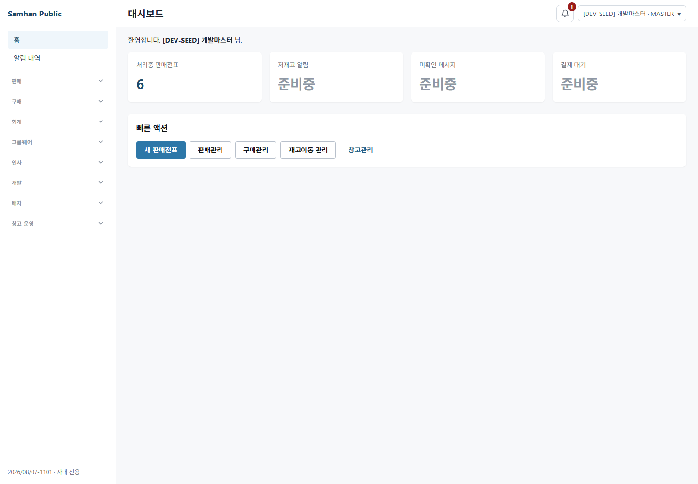
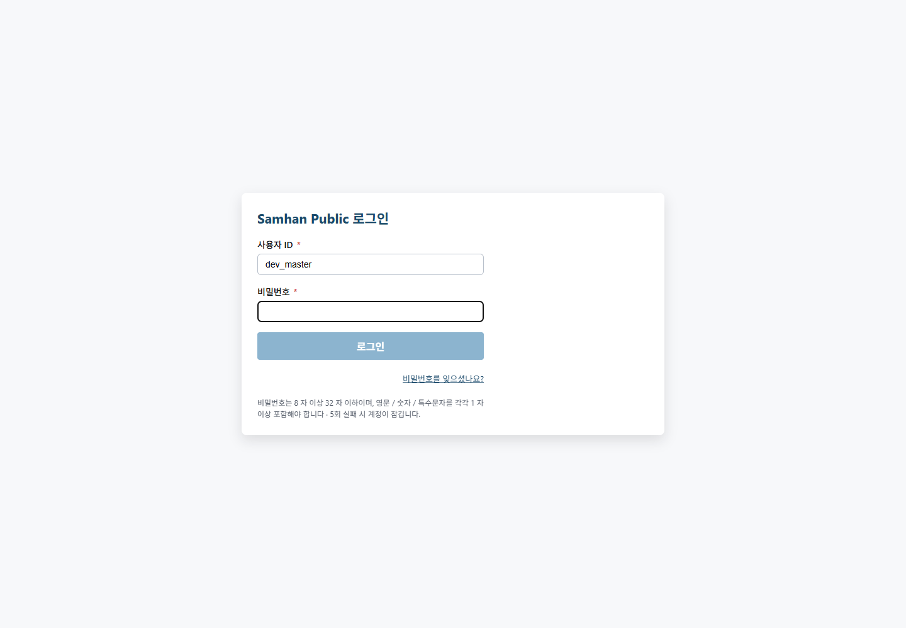

# #1101 S5 적대검증 및 라이브 QA

## 환경 확인

| 항목 | 확인값 |
|---|---|
| 작업 경로 | `C:\dev\Samhan-Public\.claude\worktrees\t1101` |
| 브랜치 | `chore/1101-credential-plaintext-cleanup` |
| HEAD | `9d2ac7dff70a20191c7b39c9453af917bf133498` |
| 비교 | `origin/main...9d2ac7dff` |
| 실제 diff | 311 files changed (요청서의 223+보다 현재 git 산출이 큼) |
| 게이트웨이 | `127.0.0.1:8080` LISTEN, root HTTP 404 |
| renderer | 검증 전 미기동. t1101 전용 `localhost:5221`, mock OFF, gateway `localhost:8080`으로 임시 기동 후 종료 |
| 브라우저 | Playwright `chromium.launch({ headless: true })`, 설치된 Edge Chromium executable 사용 |
| 금지 작업 | Docker·백엔드 서비스 재기동/재빌드·DB 직접 쓰기 모두 하지 않음 |
| 자격 취급 | `.env.local` 값과 응답 토큰 원문을 출력·보고·JSON 저장하지 않음 |

판정: **실 사용자/QA 경로로 재현 가능한 도달 결함 1건(HIGH)**. 따라서 결함 0으로 세지 않는다.

## ① 값이 필요한 자리가 비지 않았는가

### 시더·마이그레이션·설정·fixture 분류

- auth-service V5/V48/V49 migration은 실행 hash를 삭제하지 않고 주석만 표준 키 이름으로 바꿨다.
- arologis V9 migration도 BCrypt hash는 보존했다. 테스트는 평문 매칭 대신 migration 내 승인 hash 보존을 단언한다.
- AuthFlyway V48/V49 IT는 실제 seed hash 보존을 먼저 단언한 뒤 테스트 전용 password hash로 바꾸고 `@AfterEach`에서 원복한다. 실제 자격을 되살리지 않은 fixture 분리다.
- cleanup-worker 계약 테스트는 fake server용 non-secret sentinel을 사용해 필수 입력 guard와 owner lifecycle에 다시 도달한다.
- `OrgChartSeeder`는 `app.user.seed-org=true`일 때만 bean이 생성되고 `QA_MASTER_PASSWORD`를 fail-fast로 요구한다. 기본 설정은 seed false다.

### 발견한 셋째 갈래 — 저장 위치와 실행 프로세스 사이 어댑터 부재

`infrastructure/.env.local`의 표준 키는 `QA_DEV_DEFAULT_PASSWORD`이지만, 이번 diff에서 변경된 실행 파일 201개가 `process.env.DEV_PASSWORD`를 읽는다.

| 변경 실행 표면 | 파일 수 |
|---|---:|
| `clients/desktop/playwright/**` | 181 |
| 기타 desktop QA script | 18 |
| `scripts/**` 및 `perf/**` | 2 |

이 파일들은 `.env.local`을 로드하지 않으며 대다수가 누락 값을 빈 문자열로 바꾼다. `DEV_PASSWORD`를 설정하지 않고 대표 실행 파일 `clients/desktop/qa-formula-f1-categories.mjs`를 실행하자 실 게이트웨이 로그인에서 `Error: login failed`로 종료했다. 동일한 빈 password body를 실 로그인 endpoint에 보내면 HTTP 400이었다.

반면 S5 harness가 `.env.local`의 표준 키를 직접 읽어 같은 서버에 주입하면 API와 GUI 모두 성공했다. 따라서 root cause는 자격 값이나 서버가 아니라 **파일 → 프로세스 전달 계약 단절**이다. 수정 지시는 [2026-08-07-1101-s5-fix-directive.md](2026-08-07-1101-s5-fix-directive.md)에 기록했다.

추가로 `perf/k6/mixed-load.js`는 k6의 `__ENV` 대신 fallback에서 Node 전용 `process.env`를 참조한다. `LOADTEST_PASSWORD`가 없으면 k6 module 평가에서 실패하는 코드이나 현 PC에 k6가 없어 실제 실행은 **관측 불가**다. 이 항목을 결함 0 근거로 세지 않았고 수정 지시서에 별도 회귀 위험으로 포함했다.

## ② 자격 경로가 실제로 동작하는가

| 검증 | 결과 | 근거 |
|---|---|---|
| `.env.local` 직접 읽기 | PASS | 표준 키 10개 존재 확인, 값 미출력 |
| API 로그인 | PASS | `POST http://127.0.0.1:8080/api/v1/auth/login` → 200, token=`<redacted>` |
| GUI 로그인 | PASS | `POST /auth/login` 200, `/auth/admin/permissions/my` 200, `#/` 대시보드 진입 |
| 새 PC 문서 | PARTIAL | template 복사·값 입력 절차는 실행 가능하나, 프로세스로 export하거나 공용 loader를 쓰는 절차가 없다 |
| 기존 QA 실행 파일 | FAIL | `.env.local` 미로딩 + 키 불일치로 대표 script 로그인 실패/빈 password API 400 |
| 파일 부재 안내 | FAIL | 로그인 화면과 일반 비밀번호 규칙만 보이며 `.env.local` 경로·누락 키 안내 없음 |

즉, **자격 파일을 S5처럼 직접 파싱하면 동작하지만 PR이 바꾼 QA 실행 경로는 그 파일에 연결되지 않았다.** “QA 에이전트가 앞으로 이 경로로 자격을 얻는다”는 목적은 부분 달성에 그친다.

## ③ 가드가 과잉 차단하지 않는가

Windows에서는 Git Bash login shell을 사용해 좁은 범위를 실행했다.

```text
CREDENTIAL_GUARD_SCOPE=s1 bash scripts/check-credential-plaintext.sh
[PASS] S1 docs/memory 개발 QA 평문 없음

CREDENTIAL_GUARD_SCOPE=s2 bash scripts/check-credential-plaintext.sh
[PASS] S2 저장소 전체 개발 QA 평문 없음 (allowlist 정의 제외)
```

빈 값만 가진 정상 template과 새 S5 보고/스크린샷이 S1/S2에서 오탐되지 않았다. 전체 legacy 패턴의 recursive scan은 Windows 장시간 이력과 이번 지시의 범위 축소 허용에 따라 실행하지 않았다. 따라서 **개발 QA 자격 3종 가드의 과잉 차단은 관측되지 않았으나 전체 vendor/전화번호/사업자번호 패턴의 과잉 차단은 조사하지 않았다.**

## ④ 증거 무결성

| 주장 | S5 재현 |
|---|---|
| 로그인 200 | API `/api/v1/auth/login` 200 및 GUI `/auth/login` 200 재현 |
| 토큰 비공개 | 결과에는 `<redacted>`와 token 존재 여부만 기록 |
| 개발 QA 평문 0건 | S1/S2 guard PASS 재현 |
| 가드 PASS | S1·S2 각각 exit 0 |
| diff 무결성 | `git diff --check` exit 0 |
| `.env.local` 원복 | 파일 존재 확인, `.env.local.s5-temporary` 없음 |

보고서의 “평문 0건”은 가드가 정의한 개발 QA 자격 3종과 추적 파일 범위에 대한 주장이다. 저장소에 존재 가능한 모든 비밀 유형을 의미하도록 과장하지 않는다.

## 라이브 QA 직접 실행

### ① `.env.local` → API 로그인

- `.env.local`을 직접 파싱했으며 비밀번호를 console·파일에 출력하지 않았다.
- `POST http://127.0.0.1:8080/api/v1/auth/login` → HTTP 200.
- 응답 token은 `<redacted>`로만 취급했고 존재 여부만 확인했다.

### ② 같은 자격 → 실 GUI 로그인

- renderer: `http://localhost:5221`, `VITE_MOCK_MODE=0`, `VITE_API_BASE_URL=http://localhost:8080`.
- Chromium headless에서 로그인 form을 직접 채우고 버튼을 클릭했다.
- `/auth/login` 200, 권한 조회 200 이후 `http://localhost:5221/#/` 대시보드에 진입했다.



### ③ `.env.local` 임시 이동 → 재시도 → 원복

- 한 browser 호출의 `try/finally` 안에서만 `.env.local`을 `.env.local.s5-temporary`로 이동했다.
- 새 browser context에서 ID를 입력하고 password를 빈 상태로 두자 로그인 버튼이 disabled였다. 네트워크 로그인 요청은 발생하지 않았다.
- 화면에는 일반 비밀번호 형식과 잠금 안내만 있고 `.env.local` 또는 `QA_DEV_DEFAULT_PASSWORD` 안내는 없었다.
- 첫 자동 click은 disabled 버튼 대기로 timeout됐지만 `finally` 원복이 실행됐다. 즉시 파일 존재와 임시 파일 부재를 확인한 뒤, 같은 조건을 짧게 재현해 화면을 캡처하고 다시 원복했다.



## 본 범위와 안 본 범위

본 범위는 PR diff의 자격 평문 치환, 시더·migration·설정·script·test fixture, 새 `.env.local` 계약, 실 gateway 인증, desktop GUI 로그인, 파일 부재 UX, S1/S2 guard, 증거의 비밀 비노출이다.

다음은 조사하지 않았다.

- 범위 외 다른 worktree와 병렬 트랙은 조사하지 않았다.
- Docker/container 상태, 서비스 재기동·재빌드, DB 직접 쓰기는 조사·실행하지 않았다.
- CI 50/50과 BE 12/12는 개발책임자 제공 좌표를 전제로 했으며 GitHub에서 재조회하지 않았다.
- 전체 legacy credential guard의 vendor/API/전화번호/사업자번호 패턴은 조사하지 않았다.
- k6가 설치되지 않아 `perf/k6/mixed-load.js`의 실제 k6 실행은 조사하지 못했고 관측 불가로 남겼다.
- 201개 변경 실행 파일 각각의 전체 업무 시나리오는 실행하지 않았다. 공통 자격 입력 표현을 전수 정적 분류하고 대표 실 script/API/GUI로 root cause를 재현했다.
- 아로로지스 관리자 GUI, 모바일 앱, 회사 PC 물리 장비는 조사하지 않았다.

## 결함 수와 최종 판정

- 실 사용자/QA 도달 결함: **1건(HIGH)** — `.env.local`과 변경 QA 실행 파일의 loader/key 계약 단절.
- 관측 불가 회귀 위험: **1건** — k6 fallback의 `process.env` 참조.
- 결함 0 판정: **불가**.

질문의 답은 **“있다”** 이다. 실 제품 로그인은 성공하지만, 이 PR의 존재 이유인 재사용 가능한 QA 자격 경로는 파일 생성 이후 실행 프로세스로 이어지지 않는다.

## 새 파일 목록

- `docs/dev-reports/2026-08-07-1101-s5-reconvergence-and-live-qa.md`
- `docs/dev-reports/2026-08-07-1101-s5-fix-directive.md`
- `docs/qa-shots/1101-s5-live-qa/01-env-local-gui-login.png`
- `docs/qa-shots/1101-s5-live-qa/02-env-local-missing-login.png`
