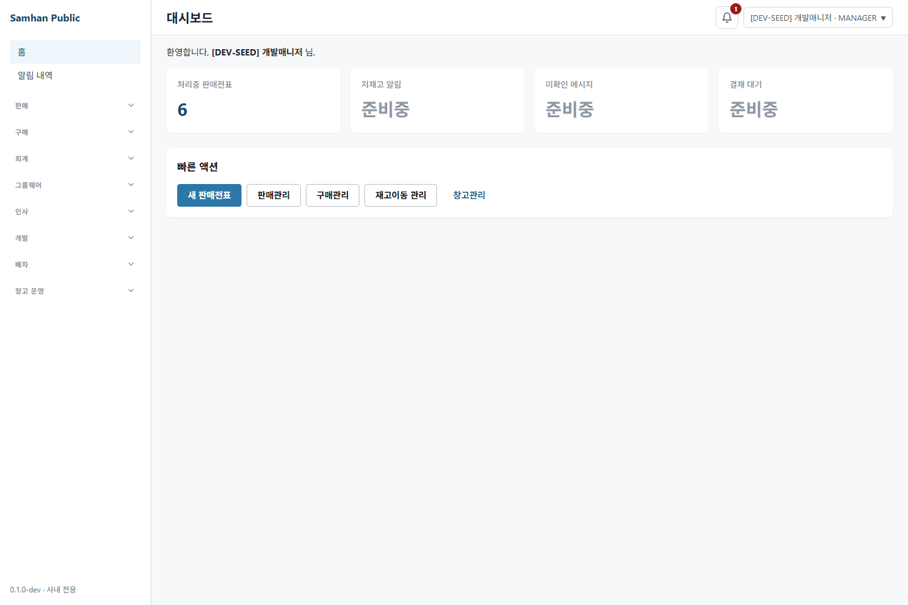

# #1101 S7 재수렴 및 라이브 QA

## 환경 확인

| 항목 | 실측값 |
|---|---|
| 작업 경로 | `C:\dev\Samhan-Public\.claude\worktrees\t1101` |
| 브랜치 / HEAD | `chore/1101-credential-plaintext-cleanup` / `d54da54df` |
| 시작 상태 | tracked/untracked 변경 0건 |
| 자격 파일 | `infrastructure/.env.local` 존재, 키 10개. `QA_DEV_DEFAULT_PASSWORD`, `QA_MASTER_PASSWORD`, `QA_AROLOGIS_ADMIN_PASSWORD` 존재. 값은 출력하지 않음 |
| 서비스 | 시작 시 13/15 기동. 기존 stopped 컨테이너 `groupware-service`, `dashboard-service`를 rebuild 없이 `docker start`하여 15/15 healthy 확인 |
| renderer | `http://localhost:5173`, mock OFF, gateway `http://localhost:8080`, Playwright Edge Chromium `headless: true` |
| 금지 작업 | 코드 수정·commit·push·product-service rebuild 없음. product-service는 시작 전부터 healthy였고 조작하지 않음 |
| 회수 | `:5173`의 t1101 소유 Node PID를 확인 후 종료. 이번 라운드에서 시작한 두 컨테이너를 다시 stopped 상태로 복구. k6 잔류 컨테이너 0 |

판정은 **S7 도달 결함 1건**이다. S5의 1건과 같으므로 감소하지 않았다. 원인은 S6 소비처 sweep 누락이며, 아래 4개 실행 파일이 현재도 옛 키를 직접 읽는다.

## 라이브 QA ① — GUI `:5173` 실제 로그인

`.env.local`의 `QA_DEV_DEFAULT_PASSWORD`를 공용 Node 로더로 읽어 실제 로그인 폼의 ID·비밀번호 input을 채우고 submit 버튼을 눌렀다.

```text
DOM inputs=2 submit=1
/auth/login=200
/auth/admin/permissions/my=200
final URL=http://localhost:5173/
```

대시보드에서 `[DEV-SEED] 개발매니저 · MANAGER`를 확인했다. 비밀번호와 토큰은 로그·스크린샷·보고서에 남기지 않았다.



추가 관측으로 `127.0.0.1:5173`을 사용하면 로그인 200 뒤 권한 조회가 401이었고 로그인 화면으로 돌아갔다. `localhost:5173`에서는 200/200이었다. 이는 host-only 인증 경계이며, 지정 정상 경로인 `localhost` 성공과 분리해 결함 수에 포함하지 않았다.

## 라이브 QA ② — PowerShell smoke 실제 실행

`tools/operational-validation/run-smoke-tests.ps1`을 실제 실행했다.

첫 실행은 이 PC의 slip/partner-order 실제 포트가 `18086/18088`인데 스크립트가 `8186/8088`까지만 자동 탐지하여 2개를 DOWN으로 오판했다. `SAMHAN_SLIP_PORT=18086`, `SAMHAN_PARTNER_ORDER_PORT=18088`을 명시해 같은 스크립트를 다시 실행하자 다음처럼 확인됐다.

```text
service health: 15/15 UP
로그인 응답 success=true
response data keys: displayName,groups,partnerCode,role,token,userId
JWT claim keys: exp,groups,iat,isSystemMaster,name,sub
최종 exit: 1
```

자격은 `.env.local`에서 정상 유입되어 로그인에 성공했다. 다만 smoke 스크립트는 JWT 안의 `sub`와 `role`을 둘 다 요구하고, 현재 token에는 `role` claim이 없다. role은 응답 envelope의 `data.role`에 있으므로 스크립트가 `JWT claims 부재 (sub / role)`로 중단하고 endpoint 8개 단계는 실행하지 않았다.

- 올리지 못한 서비스: **없음**. 두 stopped 컨테이너도 rebuild 없이 정상 기동했다.
- smoke 전체 PASS: **아님**. 15/15 health 뒤 stale JWT role 계약 때문에 endpoint 단계가 생략됐다.
- 이 blocker는 S6 보고서에도 이미 `JWT claims 부재`로 기록된 기존 smoke 결함이며, 이번 자격 배선이 만든 회귀는 아니다. S7 결함 수에는 넣지 않았다.

## 라이브 QA ③ — k6 실제 실행

로컬 `k6` CLI는 없지만 `grafana/k6:latest` Docker 이미지와 `samhan-net`이 있어 실제 k6 runtime을 사용했다.

### 누락 fail-fast

`LOADTEST_PASSWORD` 없이 `perf/k6/mixed-load.js`를 직접 실행했다.

```text
exit=107
Error: k6 자격이 없습니다: LOADTEST_PASSWORD 환경변수를 설정하십시오.
```

네트워크 부하 단계 전에 명시적으로 중단했다.

### 정상 smoke

`scripts/run-load-test.ps1 -Profile smoke`를 실행했다. PowerShell 로더가 `.env.local`의 표준 개발 자격을 읽고 `LOADTEST_PASSWORD`로 전달했다.

```text
exit=0
39 complete / 0 interrupted iterations
263 HTTP requests
http_req_failed=0.00760456
http_req_duration p(95)=22.828 ms
checks=522 pass / 2 fail
```

실제 k6는 1분간 완료됐고 설정 threshold 기준으로 exit 0이었다. 한 건의 4xx와 두 건의 check fail은 raw metric에 남았으나 자격 누락·로그인 fail-fast가 아니며, 이 PR의 자격 경로 결함으로 세지 않았다.

## RED-B — 정상·부재·무자격·CI 경로

| 축 | 실행 | 결과 |
|---|---|---|
| Node 정상 | `node clients/desktop/qa-formula-f1-categories.mjs` | 로그인 HTTP 200. 이후 업무 화면의 `estimate-items-table` selector timeout으로 종료했으나 자격 경로는 통과 |
| PowerShell 정상 | 실제 `run-smoke-tests.ps1` | `.env.local` fallback 로그인 success=true. 이후 기존 JWT role 계약에서 차단 |
| k6 정상 | `scripts/run-load-test.ps1 -Profile smoke` | 실제 Docker k6 exit 0 |
| Playwright 정상 | `:5173` 실제 UI 로그인 | 로그인 200, 권한 200, 대시보드 진입 및 캡처 |
| Node 파일 부재 | `node --test scripts/lib/qa-credentials.test.cjs` | 4/4 PASS. 누락 시 경로와 키를 포함한 fail-fast |
| PowerShell 파일 부재 | 임시 격리 경로에 로더만 복제하고 `.env.local` 없이 실행 | 경로와 `QA_MASTER_PASSWORD` 키를 포함한 fail-fast PASS |
| 자격 불필요 CI | 모든 Node 자식에서 정확한 `.env.local` 경로만 `existsSync=false`로 보이게 한 뒤 desktop CI 등가 실행 | Vitest 212 files / 1,951 tests PASS, web tsc exit 0 |
| 평문 가드 | `CREDENTIAL_GUARD_SCOPE=s2` | PASS |

공용 로더는 import 자체로 fail하지 않고 `resolveQaCredential()`을 실제 호출할 때만 자격을 요구한다. `.env.local` 부재를 강제한 unit/typecheck 경로가 통과했으므로 자격이 불필요한 CI 실행이 일괄 배선 때문에 막히는 회귀는 재현되지 않았다.

## 계열 sweep — 자격을 읽는 방법

### 실측 기준과 카운트

S6 commit 범위(`9d2ac7dff..d54da54df`)를 제가 다시 셌다.

| 기준 | 실측 |
|---|---:|
| S6 변경 파일 전체 | 230 |
| 현재 표준 로더 또는 k6 `__ENV.LOADTEST_PASSWORD`를 쓰는 변경 실행 후보 | **220** |
| 위 220개 분류 | Playwright 192 / desktop QA·진단 21 / `scripts` 2 / `tools` 4 / k6 1 |
| S6 직전 전체 `DEV_PASSWORD` 직접 소비 실행 파일 | **209** |
| 그중 S6가 변경한 파일 | **205** |
| 현재 남은 직접 소비 실행 파일 | **4** |

따라서 S6 문서의 `201개 = Playwright 181 + desktop 18 + scripts/k6 2`는 제 실측과 맞지 않는다. 범위를 S6의 실제 변경 파일로 잡으면 표준 배선 실행 후보는 220개이고, 직전 `DEV_PASSWORD` 직접 소비 파일만 잡아도 209개다.

### 잔존 옛 경로

현재 `DEV_PASSWORD` 문자열은 **30건/13파일**이다. PM의 25건/9파일보다 정확히 5건/4파일 많고, 그 차이가 아래 실행 파일이다.

| 파일 | 현재 동작 | PR diff |
|---|---|---|
| `clients/desktop/playwright/dispatch-collab-real-qa/dispatch-collab-codex-round.spec.ts` | `DEV_PASSWORD` 없으면 빈 비밀번호 로그인 | 포함 |
| `clients/desktop/playwright/dispatch-collab-real-qa/dispatch-collab-real-qa.spec.ts` | 동일 | 포함 |
| `clients/desktop/playwright/dispatch-collab-real-qa/kst-verification.spec.ts` | 동일 | 포함 |
| `clients/desktop/playwright/manual/e3-s1-cash-receipt-permission-qa.spec.ts` | `.env.local`을 읽지 않고 `DEV_PASSWORD`만 요구해 사전 중단 | 미포함(기존 파일) |

나머지 25건/9파일은 PM 분류대로 문서 이력, 공용 로더 alias, 그 테스트다. 표준 로더로 배선된 220개 안에서는 옛 `process.env` 직접 읽기 0건이었다. 문제는 sweep에서 빠진 위 4개다.

평문 리터럴은 S2 guard가 0건으로 판정했다. `.gitguardian.yaml`의 `match:` 5줄은 유지됐고 PR diff에서 삭제되지 않았다. k6는 `process.env` 잔존 없이 `__ENV.LOADTEST_PASSWORD`만 쓴다.

## 결함 수 — S5 대비

```text
S5 결함 수: 1
S7 결함 수: 1 (HIGH)
증감: 0
```

### S7-1 HIGH — 소비처 sweep 불완전

하나의 root cause로 센다: S6의 선택 집합이 실제 직접 소비처 전체를 포함하지 않았다.

도달 경로 A — PR 내부 Playwright 3개:

1. `.env.local`은 존재하고 `DEV_PASSWORD` process env는 없는 정상 새-PC 조건이다.
2. 각 spec의 `beforeAll`이 `fetchRealToken()`을 호출한다.
3. 공용 로더 대신 `process.env.DEV_PASSWORD ?? ''`를 사용한다.
4. 빈 password가 실제 `/api/v1/auth/login`으로 전달된다.
5. 같은 body를 실제 gateway에 보내 HTTP 400을 재현했다.

도달 경로 B — repository sweep의 기존 manual 1개:

1. `.env.local`은 존재하고 `DEV_PASSWORD` process env는 없다.
2. spec의 `beforeAll`이 `fetchRealToken()`을 호출한다.
3. `.env.local`/표준 키를 읽지 않고 `DEV_PASSWORD 환경변수 필수`로 네트워크 전에 중단한다.

엄격한 PR 회귀 범위만 보면 A의 3개가 blocking이고 B는 기존 범위 밖이다. 그러나 요청한 repository-wide 자격 읽기 축에서는 네 파일 모두 옛 경로 잔존이다. 결함 수는 파일별 4건으로 부풀리지 않고 동일 root cause 1건으로 집계했다.

**결론: S7 결함 수는 S5와 같은 1건이다. S6가 S5 결함을 완전히 해소했다는 판정은 불가하다.**

## 본 범위와 안 본 범위

본 범위:

- `.env.local` 표준 키 존재 여부와 Node/PowerShell 로더 계약
- 실제 gateway 인증, 실제 `:5173` UI 로그인, headless 캡처
- 15개 서비스 health와 PowerShell smoke 실제 실행
- 실제 Docker k6 정상/누락 실행
- S6 변경 파일과 repository 잔존 `DEV_PASSWORD` 전수 정적 sweep
- `.env.local` 부재를 강제한 desktop unit/typecheck CI 등가 실행
- S2 평문 가드와 `.gitguardian.yaml` allowlist 보존

안 본 범위:

- 220개 배선 파일 각각의 전체 업무 시나리오는 실행하지 않았다. 읽기 방식은 전수 분류하고 Node·PowerShell·k6·Playwright 대표를 실제 실행했다.
- GitHub Actions 원격 job 상태와 PR #1107 checks는 재조회하지 않았다.
- PowerShell smoke의 JWT role 계약과 포트 자동 탐지 코드는 수정하지 않았다.
- k6의 한 건 4xx가 어느 endpoint인지 별도 기능 디버깅하지 않았다.
- 아로로지스 관리자 GUI, 모바일 앱, 다른 PC/다른 worktree는 조사하지 않았다.
- product-service를 포함한 백엔드 이미지는 rebuild하지 않았다.

## 새 파일 목록

- `docs/dev-reports/2026-08-07-1101-s7-reconvergence-and-live-qa.md`
- `docs/qa-shots/1101-s7-live-qa/01-env-local-gui-login.png`
- `docs/qa/local-load-soak-test/raw/k6-image-20260807-183340.log`
- `docs/qa/local-load-soak-test/raw/k6-smoke-20260807-183340.log`
- `perf/k6/out/summary-smoke-20260807-183340.json` (기존 `.gitignore`의 `out/` 규칙으로 ignored)
