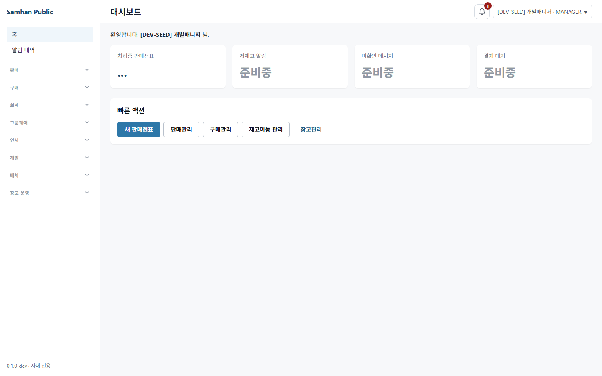
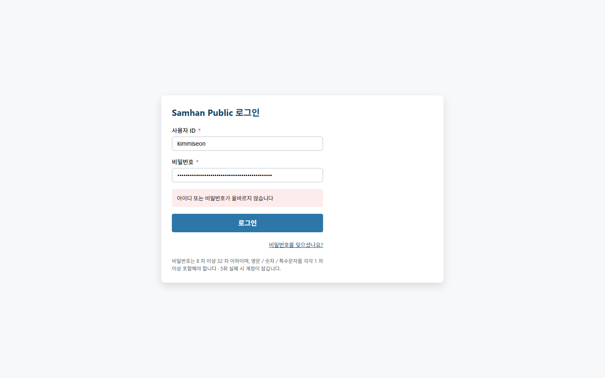

# #1101 S9 — S8 재수렴 및 라이브 QA

## 환경 확인

| 항목 | 실측값 |
|---|---|
| 작업 경로 | `C:\dev\Samhan-Public\.claude\worktrees\t1101` |
| 브랜치 / HEAD | `chore/1101-credential-plaintext-cleanup` / `3a2a41d6cf7d4cb2d3f142b0b2a38bee6ee27b63` |
| 시작 상태 | tracked/untracked 변경 0건 |
| 자격 파일 | `infrastructure/.env.local` 존재, 키 10개. 필수 표준 키 3개 존재. 값은 읽거나 출력하지 않음 |
| 기존 스택 | 시작 시 gateway/auth/user/slip 등 관련 컨테이너 healthy. 컨테이너 build/restart/start/stop 모두 하지 않음 |
| renderer | 이 워크트리의 Vite만 `http://localhost:5173`에 숨김 기동. Chromium은 `headless: true` |
| 금지 작업 | 다른 worktree, 제품 코드 수정, commit/push, 컨테이너 재빌드·재기동 없음 |

**판정: S9 도달 결함 1건(HIGH). S7의 1건과 같아 감소하지 않았다.** S8이 고친 8개 소비자는 통과했지만, 신설 계약 테스트가 다시 8개 고정 목록을 축으로 삼아 목록 밖 tracked QA 실행물을 잡지 못한다.

## 라이브 QA ① — S7 HTTP 400 경로 재실행

S7 보고서에서 빈 비밀번호를 실제 gateway에 보내 HTTP 400을 냈던 세 spec의 `fetchRealToken()`과 같은 endpoint/body 구성을 다시 실행했다. `DEV_PASSWORD`, `DEV_SEED_PASSWORD`, `SAMHAN_DS4_QA_PASSWORD`는 unset하고 `.env.local`의 표준 키만 로더로 읽었다.

```text
dispatch-collab-codex-round.spec.ts status=200 success=true
dispatch-collab-real-qa.spec.ts       status=200 success=true
kst-verification.spec.ts              status=200 success=true
```

S7의 manual CashReceipt 경로(`/auth/login`)도 같은 조건에서 `status=200 success=true`였다. 즉 S7이 지목한 네 경로 자체의 인증 배선은 해소됐다.

## 라이브 QA ② — `:5173` 실제 GUI 로그인

Chromium을 명시적으로 `headless: true`로 시작해 실제 로그인 폼에 `dev_manager`와 표준 로더가 반환한 값을 입력하고 submit했다.

```text
final URL=http://localhost:5173/#/
/auth/login=200
/auth/admin/permissions/my=200
DEV-SEED identity visible=true
MANAGER role visible=true
```



## 라이브 QA ③ — `.env.local` 부재 fail-fast

실제 비밀 파일을 이동·개명하지 않고, 존재하지 않는 임시 `.env.local` 경로와 빈 env 객체를 로더에 주입했다.

```text
code=QA_CREDENTIAL_MISSING
mentionsEnvLocal=true
mentionsKey=true
message=QA 자격이 없습니다: ...\.env.local에 QA_DEV_DEFAULT_PASSWORD를 입력하거나 표준 환경변수를 설정하십시오.
```

빈 문자열로 로그인 요청을 계속하지 않고 경로와 누락 키를 포함해 명시적으로 중단한다.

## 라이브 QA ④ — 자격 불필요 경로가 로더로 막히는지

S8의 8개 목록은 실제 테스트 실행·cleanup 실행 시 모두 자격을 소비한다. 다만 수집/import와 명시 인자 우선 경로는 자격 파일이 없어도 막히면 안 된다.

| 경로 | 직접 실행 결과 |
|---|---|
| dispatch 3 spec `--list` | 3 tests / 3 files 수집, exit 0 |
| cash-receipt coedit `--list` | 1 test / 1 file 수집, exit 0 |
| loader import/계약 | 호출할 때만 fail-fast; 계약 테스트 5/5 PASS |
| worker 명시 `--password-b64` | 아래 ⑤에서 exit 0 |
| worker loader fallback | 아래 ⑤에서 exit 0 |
| worker lifecycle 계약 | Vitest 2/2 PASS; child 잔류 없음 |

8개 중 자격과 무관한 제품/CI 스크립트를 잘못 배선한 사례는 재현되지 않았다. `ds4-real-qa-reap.cjs`의 `--password`와 worker의 `--password-b64`는 `??`/조건식의 우변 지연 평가로 loader보다 우선한다.

## 라이브 QA ⑤ — `ds4-real-qa-cleanup-worker`

실 worker 프로세스에 유효한 임시 scope(`templateId=null`)와 stop marker를 주어 네트워크 삭제 없이 종료 계약을 밟았다. 비밀값은 출력하지 않았고 `--password-b64` 경로에는 비자격 test fixture를 사용했다.

```text
with-password-b64    exit=0 signal=none stderrEmpty=true
without-password-b64 exit=0 signal=none stderrEmpty=true
```

두 번째 경로는 옛 `SAMHAN_DS4_QA_PASSWORD`가 아니라 `.env.local` 표준 로더 fallback으로 통과했다. 과거의 빈 자격 `exit 2`는 재현되지 않았다. 임시 scope/stop 파일은 실행 직후 삭제했다.

## 계약 테스트 — baseline, 뮤테이션, 원복

### baseline

`node --test scripts/lib/qa-credentials.test.cjs`는 5/5 PASS였다.

### 목록 안 소비자 뮤테이션

`dispatch-collab-codex-round.spec.ts`에 `process.env.DEV_PASSWORD` 직접 참조를 한 줄 넣었다.

```text
tests 5 / pass 4 / fail 1 / exit 1
실패 test: 실행 자격 소비자는 표준 로더를 경유하고 옛 키를 직접 읽지 않는다
실패 파일: dispatch-collab-codex-round.spec.ts
```

즉 8개 목록 안에서는 실제 red guard다. 해당 한 줄을 즉시 제거한 뒤 같은 명령은 다시 5/5 PASS였고 대상 파일 `git diff`는 0이었다.

### 고정 목록 밖 구멍

이 구멍은 이론상이 아니라 현재 저장소에 이미 존재한다. 아래 세 tracked QA 실행물은 `CREDENTIAL_CONSUMER_FILES`에 없는데 baseline 5/5는 green이다.

| 파일 | 직접 읽기 / 기본값 | 도달성 |
|---|---|---|
| `docs/qa/919-sol-round/live-ui-qa.mjs` | 옛 키 `QA_DEV_MASTER_PASSWORD` 직접 읽기 | 현재 PC에서는 그 줄보다 먼저 다른 worktree의 `D:` 절대 import가 `ERR_MODULE_NOT_FOUND`; 정적 소비자 누락이지만 이번 환경의 인증 도달 결함으로 별도 가산하지 않음 |
| `docs/qa/coedit-s3-5-dispatch/capture-dispatch-coedit.spec.ts` | `process.env.QA_MASTER_PASSWORD` 직접 읽기 + 문자열 placeholder fallback | 동일 fallback을 실제 GUI 로그인에 넣어 gateway 401, 로그인 화면 잔류를 직접 확인 |
| `docs/qa/dev-menu-dev2/backend-qa.sh` | `${QA_DEV_DEFAULT_PASSWORD}` 직접 읽기 | `set -u`이므로 `.env.local`만 있고 env export가 없으면 로그인 curl 전에 unbound variable로 중단 |



따라서 새 파일이 목록에 추가되지 않으면 못 잡는 문제는 **실질적 구멍**이다. 목록이 아니라 tracked 실행 파일 전체에서 자격 read 문법과 login payload를 탐지해야 한다.

### `LEGACY_KEY` join 판정

- `DEV_PASSWORD`만 `['DEV', 'PASSWORD'].join('_')`로 구성한다.
- `DEV_SEED_PASSWORD`, `SAMHAN_DS4_QA_PASSWORD`, `QA_DEV_DEFAULT_PASSWORD`는 정규식에 리터럴로 직접 들어 있다. 즉 다른 키에는 join 트릭이 적용되지 않았다.
- 현재 테스트는 자기 파일이 아니라 8개 소비자만 읽으므로 이 리터럴들이 지금 자기 자신을 red로 만들지는 않는다. 그러나 향후 repository-wide scan으로 넓히면 가드 소스 자체 제외 또는 모든 탐지 키의 안전한 구성이 필요하다.

## 축 sweep 재실측

모든 수치는 현재 HEAD의 `git ls-files -z` 16,443개를 NUL-safe로 읽고, binary를 제외한 text 9,771개에서 직접 센 값이다. PM 수치를 복사하지 않았다.

| 축 | S9 실측 | 판정 |
|---|---:|---|
| `DEV_PASSWORD` raw substring | **46 occurrence / 45 matching lines / 12 files** | 9 docs + 3 loader/test/load-test. 실행 파일 직접 reader는 0 |
| `DEV_SEED_PASSWORD` | 6 occurrence / 5 lines / 4 files | 실행 reader 0; spec 주석·보고서·계약 regex |
| `SAMHAN_DS4_QA_PASSWORD` | 5 occurrence / 4 lines / 4 files | 직접 reader 0; `verify-ds4`의 child env write 1은 현재 worker가 읽지 않는 dead legacy 전달 |
| `QA_PASSWORD` | 14 occurrence / 12 lines / 9 files | loader/PowerShell 호환 alias와 문서·가드 |
| `QA_MASTER_PW` | 4 occurrence / 4 lines / 4 files | loader/PowerShell 호환 alias와 문서 |
| `QA_DEV_MASTER_PASSWORD` | **2 occurrence / 2 lines / 1 file** | 목록 밖 실행 파일의 옛 키 직접 reader 1 |
| Node `resolveQaCredential` 참조 | **224 files** | S8 보고서의 223보다 1 많음 |
| PowerShell `Resolve-QaCredential` 참조 | **4 files** | 표준 PowerShell loader 경유 |
| 두 loader 참조 union | **228 files** | 중복 제거 |
| `process.env`/`$env:`의 `DEV_PASSWORD` 직접 reader | **0 files** | PM의 핵심 0은 재확인 |
| 목록 밖 QA 자격 직접 소비 실행물 | **3 files** | 위 표의 919/coedit/backend-qa |
| QA login용 하드코딩 fallback | **1 file** | coedit placeholder가 실제 login 401 도달 |
| 개발 QA 평문 리터럴 | **0** | `CREDENTIAL_GUARD_SCOPE=s2` PASS |
| `.gitguardian.yaml` `match:` | **5 lines** | 삭제·변경 없음 |

PM의 `DEV_PASSWORD` 25건/9파일과 다른 이유는 현재 HEAD에 S7 보고서, S8 보고서, S8 plan 등 이 키를 이력으로 기록한 문서가 포함됐기 때문이다. raw 문자열 수와 직접 실행 reader 수를 분리하면 raw는 46/12지만 직접 reader는 0이다.

### 평문·기본값 추가 분류

- 이 이슈가 제거 대상으로 삼은 개발 QA 평문 3종은 S2 guard 기준 0이다.
- DB/local fixture의 의도된 dev 기본값과 테스트 전용 fixture는 이슈 기획의 명시적 범위 밖이다. `.gitguardian.yaml`의 5개 allowlist는 보존했다.
- 자격처럼 보이는 모든 문자열을 무차별 집계하면 test fixture·UI label까지 섞이므로, 도달 결함 수는 실제 QA login 자격 소비와 loader 우회 여부로 판정했다.

## 결함 수 — S7 대비

```text
S5: 1
S7: 1
S9: 1 (HIGH)
증감: S7 대비 0
```

### S9-1 HIGH — sweep과 계약 가드가 여전히 고정 목록

S8은 8개 알려진 소비자를 올바르게 고쳤지만, 재발 방지 계약의 축은 `자격을 읽는다`가 아니라 `CREDENTIAL_CONSUMER_FILES` 8개다.

도달 경로 A — 목록 밖 Playwright spec:

1. 새 PC 정상 조건처럼 `.env.local`은 존재하지만 `QA_MASTER_PASSWORD` process env는 export하지 않는다.
2. `docs/qa/coedit-s3-5-dispatch/capture-dispatch-coedit.spec.ts`는 공용 loader를 쓰지 않는다.
3. 문자열 placeholder를 password input에 채운다.
4. 동일 값을 headless 실제 GUI로 제출하자 gateway가 HTTP 401을 반환하고 로그인 화면에 남았다.
5. 계약 테스트는 이 파일을 읽지 않아 5/5 green이다.

도달 경로 B — 목록 밖 Bash QA:

1. `.env.local`만 있고 `QA_DEV_DEFAULT_PASSWORD` shell env는 없다.
2. `docs/qa/dev-menu-dev2/backend-qa.sh`는 `.env.local` loader를 쓰지 않고 변수를 직접 확장한다.
3. `set -u` 때문에 실제 login curl 전에 중단한다.
4. 계약 테스트 목록 밖이므로 red가 되지 않는다.

잠재 경로 C — 별도 옛 키:

1. `docs/qa/919-sol-round/live-ui-qa.mjs`는 `QA_DEV_MASTER_PASSWORD`를 직접 읽는다.
2. 계약 regex와 8개 목록 어느 쪽도 이 파일/키를 다루지 않는다.
3. 현재 PC에서는 앞선 hardcoded `D:` import가 먼저 실패하므로 이번 라운드의 별도 도달 결함으로 더하지 않았다.

파일별 세 건으로 부풀리지 않고 **하나의 root cause(고정 목록 sweep/guard)**로 집계한다. 결함 수가 S7보다 줄지 않았으므로 S9 기준 머지 권고는 불가하다.

## 본 범위와 안 본 범위

본 범위:

- S7 HTTP 400 세 spec과 manual 경로의 실제 gateway 재로그인
- `:5173` 실제 GUI 로그인·권한 조회·대시보드 headless 캡처
- `.env.local` 부재 fail-fast
- S8 8개 소비자의 collection/lazy-load 및 worker 두 인자 경로
- 계약 테스트 red/green 뮤테이션과 즉시 원복
- tracked 16,443개 전체의 옛 키, 직접 env read, loader 참조, QA 하드코딩 기본값 sweep
- 개발 QA 평문 S2 guard와 GitGuardian allowlist 보존

안 본 범위:

- dispatch 세 spec의 SSE 이후 전체 업무 수정 시나리오는 실행하지 않았다. 요청 범위의 과거 HTTP 400 인증 경로를 같은 요청으로 재실행했다.
- PowerShell smoke의 JWT role claim과 SSE timeout은 요청대로 조사·결함 집계에서 제외했다.
- 컨테이너 이미지, DB migration, 다른 worktree, 원격 GitHub checks는 건드리거나 재검증하지 않았다.
- DB/local fixture dev 기본값과 운영 secret은 #1101 기획의 명시 범위 밖이라 변경·결함 집계하지 않았다.
- `docs/qa/919-sol-round/live-ui-qa.mjs`의 hardcoded 다른-worktree import는 별도 기존 결함이며 수정하지 않았다.

## 새 파일 목록

- `docs/dev-reports/2026-08-07-1101-s9-reconvergence-and-live-qa.md`
- `docs/qa-shots/1101-s9-live-qa/01-env-local-gui-login.png`
- `docs/qa-shots/1101-s9-live-qa/02-unlisted-direct-reader-default-fails.png`

