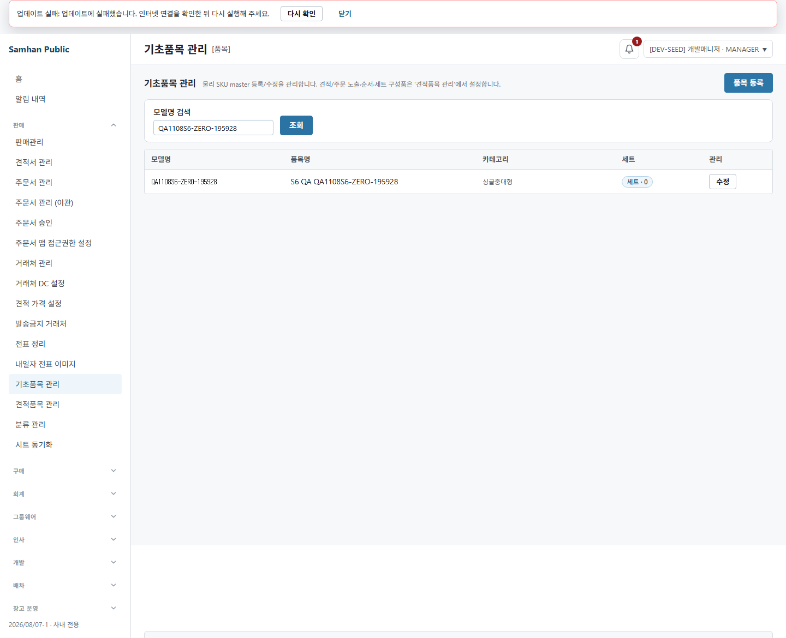
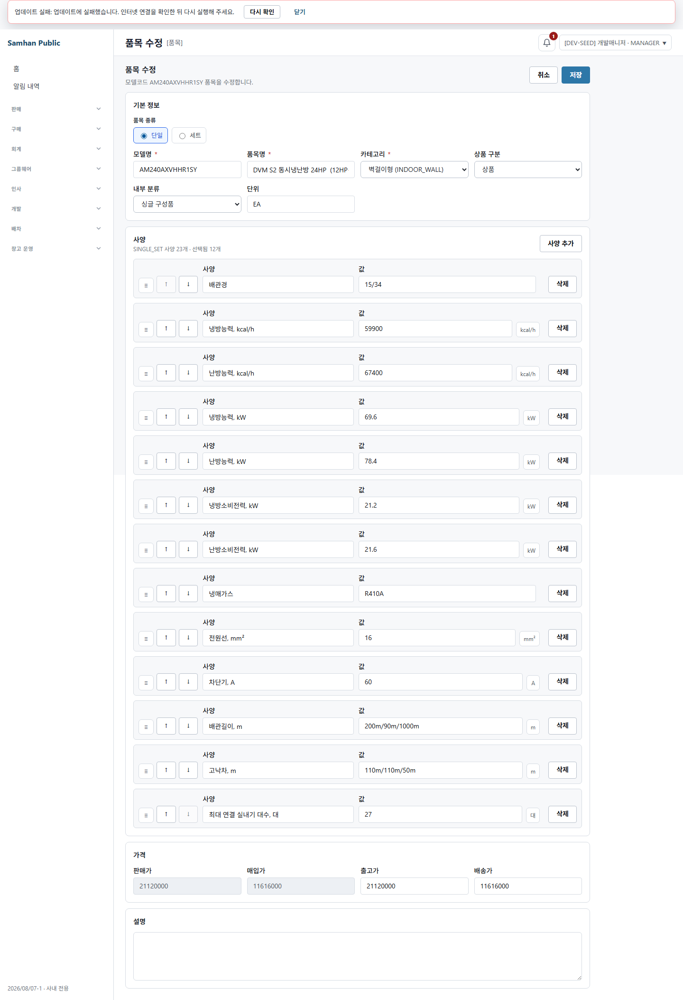
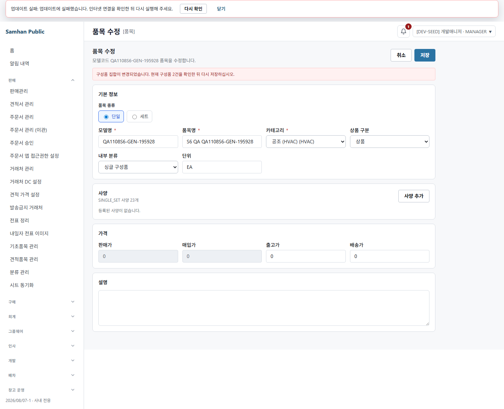
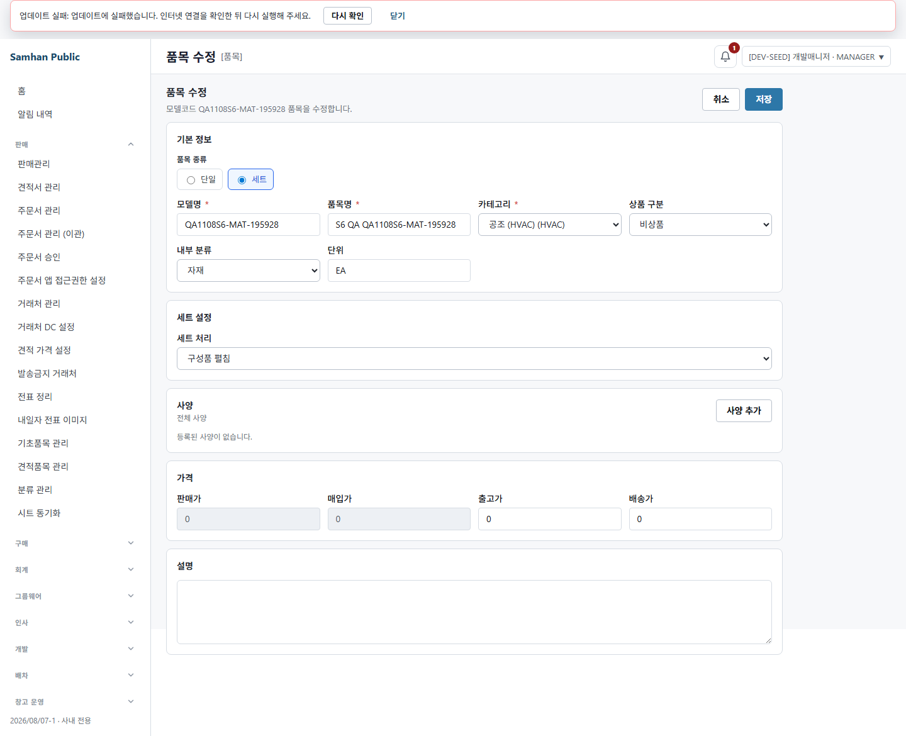
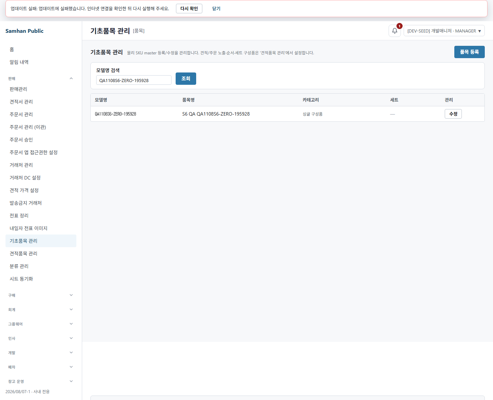
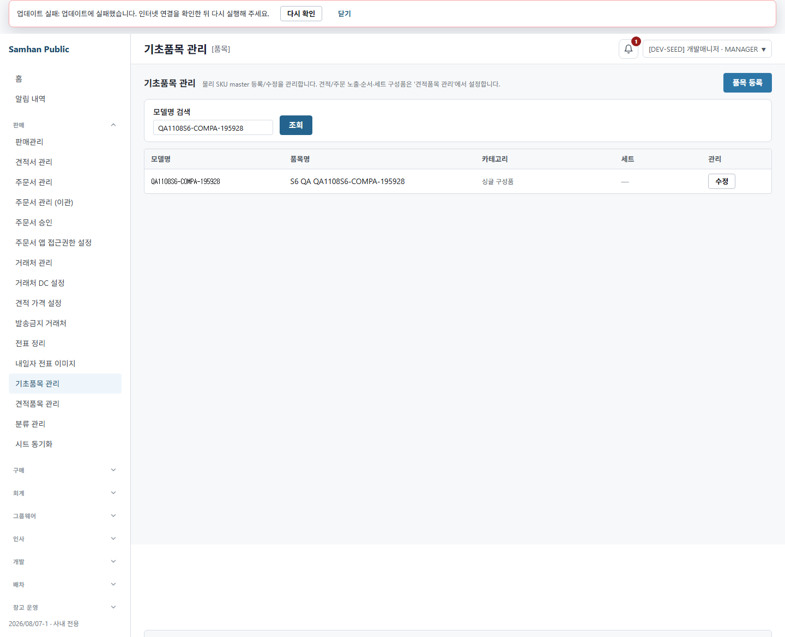

# #1108 S6 재수렴 검증 및 라이브QA

> **2026-08-07 19:43 배포본 교체 후 재발주 결과가 아래에 추가되었다.** 이 블록이 뒤의
> `1차 중단 기록`보다 우선한다. 1차 중단 기록은 당시 중단 판단의 근거 보존을 위해 삭제하지 않았다.

## 재발주 결론

**PASS — S6 도달 결함 0건.** S4의 유일 결함이었던 `componentCount`/토큰 분리 조회 창은
실행 JAR과 현재 소스 모두에서 단일 `findActiveByBundleProductIdIn(...)` 관측으로 닫혔다.
실 UI에서는 표시 1건 뒤 실제 집합을 2건으로 바꾸고 오래된 토큰을 제출했을 때 HTTP 400과
`현재 구성품 2건` 재확인 오류가 났으며, 활성 2건은 삭제되지 않았다. 최신 토큰으로 다시 확인한
GENERAL 전환은 2→0, MATERIAL 전환은 1→0으로 정상 처리됐다.

```text
S4: 1  →  S6: 0
```

## 0. 환경 확인 — 교체 배포본 직접 확인

| 항목 | 직접 확인값 |
|---|---|
| cwd | `C:\dev\Samhan-Public\.claude\worktrees\t1108` |
| 실제 브랜치 | `fix/1108-bundle-component-destroy-guard` — 브리핑의 `feat/1108-bundle-destroy-guard`와 명칭은 다름 |
| HEAD | `d77dc11cc215053f354847a564563ce5d17a51d3` — 제시 SHA와 일치 |
| product-service 이미지 | `sha256:639299ae80eed3c6030fb4ab7c281271bc1b650e8fa724854b50c51b86a3b320` |
| 이미지 생성 | **2026-08-07 19:43:08 KST** |
| 컨테이너 생성/상태 | **19:43:11 KST**, `healthy` |
| Compose provenance | 프로젝트 `infrastructure`, working dir `...\t1096\infrastructure` |
| 실행 JAR | `/app/app.jar`, `BundleComponentConsentToken.class`와 `ProductService.class` 존재 |
| 실행 바이트코드 | `ProductCatalogController`가 `findActiveByBundleProductIdIn`과 `withComponentCount(int,String)` 호출. `countMapByBundleProductIds` 호출 없음 |
| 라이브 UI | 이 워크트리의 renderer를 `VITE_API_BASE_URL=http://127.0.0.1:8080`, mock OFF로 기동 |
| 브라우저 | Playwright `chromium.launch({ headless: true })` |

다른 서비스가 t1096 기준인 혼합 스택인 사실은 기록한다. 이번 판정 경계는 t1108 renderer → gateway/auth →
교체된 t1108 product-service → `product_db`이고, 다른 도메인 서비스의 값을 소비하지 않는다. product-service
실행 클래스와 S5 발급 메서드 바이트코드까지 확인했으므로 이 혼합은 본 판정을 막지 않는다.

## 1. 발화 조건 카운트

QA 쓰기 전 SELECT 실측이다.

| 조건 | 카운트 |
|---|---:|
| 활성 BUNDLE 중 구성품 1건 이상 | **343** |
| 활성 BUNDLE 중 구성품 0건 | **0** |
| 활성 BUNDLE 전체 | **343** |
| 활성 `bundle_component` 행 | **1,584** |
| 활성 일반(SINGLE, 비-MATERIAL) 품목 | **2,739** |

구성품 0건 SET은 0건이므로 그대로는 ④ 판정이 불가능했다. 관리자 `품목 등록` 화면으로
`QA1108S6-ZERO-195928` SET을 실제 생성해 `세트 · 0`을 확인한 뒤 전환했다. DB 직접 INSERT/UPDATE/DELETE는
사용하지 않았다.



## 2. 라이브QA ①~⑤

### ① 구성품 있는 SET — 관문, 건수, 취소

- 기존 활성 SET `AM240AXVHHR1SY`의 활성 구성품 SELECT는 1건이었다.
- UI에서 SET→GENERAL을 선택해 저장하자 Playwright dialog event가
  `이 세트의 구성품 1건이 삭제됩니다...`를 수신했다.
- `dismiss()` 후 PATCH 요청은 **0건**, 활성 구성품은 **1→1**이었다.
- QA SET의 1건 화면을 열어 둔 동안 다른 관리자 페이지에서 2건으로 바꾼 뒤 확인하면 서버가
  HTTP 400으로 거부했다. 화면 오류도 `현재 구성품 2건`으로 실 DB와 일치했고 활성 행은 2→2였다.




### ② 확인 후 구성품 정리

- 같은 GENERAL 전환을 최신 2건 토큰으로 다시 확인: PATCH 200.
- 요청 body에 `confirmBundleChildrenDeletion=true`와 불투명 집합 토큰이 함께 있었다.
- 활성 구성품 **2→0**, 품목은 `BUNDLE→SINGLE`, 응답/화면 복귀 정상.
- replace-all 이력 때문에 물리 row는 3개였으나 세 행 모두 soft-delete되어 활성 0건이다.


### ③ SET→GENERAL / SET→MATERIAL 전수

| 경로 | 취소/거부 | 확인 | DB 활성 구성품 | 최종 상태 |
|---|---|---|---:|---|
| SET→GENERAL | dialog 1건, 취소 시 PATCH 0건·1→1. stale 1건 토큰은 실제 2건에서 400·2→2 | 최신 dialog 2건, PATCH 200 | 2→0 | `SINGLE / SINGLE_PART` |
| SET→MATERIAL | dialog 1건, 취소 시 PATCH 0건·1→1 | dialog 1건, PATCH 200 | 1→0 | `SINGLE / MATERIAL` |

두 경로 모두 같은 FE 확인 함수와 같은 BE `assertBundleChildrenDeletionConfirmed`를 통과한 뒤 각자의
`removeBundleChildren` 호출부에 도달한다. 한 경로만 옛 Boolean 방식인 곳은 없었다.




### ④ 구성품 0건 SET — RED-B

- 관리자 UI로 만든 0건 SET을 GENERAL로 전환했다.
- dialog event **0회**, PATCH 200.
- 요청에 Boolean/집합 토큰 필드가 모두 없었고 활성 구성품 0→0, `BUNDLE→SINGLE`이었다.
- 즉, 정상 경로 오차단은 **0건**이다.



### ⑤ GENERAL 회귀

- QA GENERAL 품목의 설명 수정·저장은 dialog 0회, PATCH 200이었다.
- literal 품목 삭제는 현재 `ProductCatalogPage`에 삭제 CTA가 없어 화면 클릭으로는 도달할 수 없다.
  동일 로그인 세션의 인증된 브라우저 request로 `DELETE /api/products/{id}`를 호출해 204와 활성 품목
  1→0을 확인했다. MANAGER 세션에서 바로 204였으며 토큰 관문 영향은 없었다.



## 3. S4 동시성 창과 토큰 오용

| 공격/경계 | 결과 | 판정 |
|---|---|---|
| 발급 시 count/token 분리 | 실행 바이트코드에서 구성품 목록 조회 1회, 같은 list에서 `size()`와 SHA-256 파생 | **S4 D1 닫힘 — 코드/JAR 근거** |
| 발급 후 1→2 변경 | 오래된 1건 토큰 PATCH 400, 오류의 현재 건수 2, DB 2→2 | **동적 PASS** |
| 다른 품목 토큰 | PATCH 400, 대상 활성 구성품 1→1 | **동적 PASS** |
| Boolean만 전송 | PATCH 400 | fail-closed |
| 토큰 만료 | 시간 TTL 없음. 구성품 집합 변경 즉시 stale로 거부됨 | 설계와 동적 결과 일치 |
| 같은 SET에 같은 토큰 동시 PATCH 2건 | `[200, 200]`, 33 ms. 활성 구성품 1→0, 물리 대상 row 1개만 soft-delete | 두 번째는 이미 SINGLE인 동일 결과 갱신. 중복 파기 없음 |
| 토큰 재사용 | 위 동시요청의 같은 토큰 재제출은 추가 파기 없음. 집합 변경 뒤 재사용은 400 | 무상태·멱등 결과 |

실 PostgreSQL 두 요청을 동시에 보낸 부분은 동적 근거다. 반면 S4의 정확한 “한 HTTP 응답 내부 두 SELECT 사이
커밋”은 S5 실행 코드에 두 번째 SELECT가 없어 타이밍 재현 대상 자체가 사라졌으므로 코드/JAR 근거로 판정했다.

## 4. S5 새 표면

- **토큰 누적:** 토큰은 Entity/Repository/캐시/테이블에 저장되지 않는 SHA-256 값 객체다. S5 diff에
  migration이 없고 SQL/YAML/properties에도 consent token 저장 표면이 없다. 정리 없이 쌓일 곳이 없다.
- **기존 API 계약:** 파괴 전환에서 `confirmBundleChildrenDeletion=true`만 보내는 호출은 이제 400이다.
  이는 집합을 결박하기 위한 의도적 fail-closed 계약 강화다. 저장소 운영 FE 소비자는
  `ProductFormPage` 한 곳이며 Boolean과 token을 함께 보낸다. 비파괴 수정과 0건 전환은 기존대로 통과한다.
- **세 경로 일관성:** GENERAL/MATERIAL 모두 공통 assert 이후에만 두 `removeBundleChildren` 호출부로 간다.
  actual 품목 DELETE는 이 PR의 구성품 파기 경로가 아니며 GENERAL 회귀 204를 확인했다.
- **마이그레이션:** 없음. 기존 행 backfill/NULL 위험도 없다.
- **화면 캡처의 상단 업데이트 실패 배너:** Vite 개발 renderer에서 PWA 업데이트 확인이 실패한 환경 배너다.
  product API mutation 응답(200/400/204)과 별개이며 #1108 결함 수에 넣지 않았다.

## 5. 결함 수 — S4 대비

```text
S4 결함 수: 1
S6 결함 수: 0
감소: 1
```

S4 보고서와 이번 정정 브리핑의 비교 기준은 모두 1이다. D2는 존재하지 않는다. 이번 S6에서 새로 번호를
부여할 도달 결함은 없다.

## 6. 본 범위와 안 본 범위

### 본 범위

- 교체 이미지/컨테이너 시각, health, Compose label, JAR 핵심 클래스와 발급 바이트코드
- DB 발화 조건 카운트와 관리자 UI 표본 생성
- GENERAL/MATERIAL 각각 취소·stale·확인, 0건 SET, GENERAL 정상 수정/삭제
- dialog 문구 건수, PATCH/DELETE status와 request field, 전후 활성/전체 구성품 SELECT
- 타 품목 토큰, Boolean-only, 집합 변경 만료, 동일 SET 동시 요청
- 토큰 저장/마이그레이션/호출자/두 remove 경로 정적 전수
- QA 표본 앱 경로 cleanup과 프로세스 회수

### 안 본 범위

- 다른 서비스의 t1096 코드 자체(이번 product 경계에서 소비하지 않음)
- 시간 기반 TTL(설계상 존재하지 않음)
- native `window.confirm` 자체의 픽셀 캡처(Playwright dialog message/count/accept/dismiss event로 증거화)
- GENERAL literal 삭제의 화면 CTA(현재 화면에 없음; 인증 API로 회귀 확인)
- CI 42/42 재실행(제시된 exact SHA 결과만 수신)

## 7. QA 데이터·프로세스 회수

- UI에서 만든 QA 품목 6건은 검증 뒤 제품 API로 soft-delete했다.
- QA 품목 활성 행 **0**, QA 부모의 활성 구성품 **0**.
- 전체 활성 BUNDLE/구성품은 cleanup 뒤 다시 **343 / 1,584**로 시작값과 일치했다.
- Vite `:5199` listener 종료, 최근 Playwright Chromium 잔류 **0**.
- Docker 이미지/컨테이너는 재빌드·재기동하지 않았다.

## 8. 새 파일 목록

- `docs/dev-reports/2026-08-07-1108-s6-reconvergence-and-live-qa.md` (본 재발주 결과 추가)
- `docs/qa-shots/1108-s6-live-qa/01-zero-set-created-with-0-components.png`
- `docs/qa-shots/1108-s6-live-qa/02-gen-stale-view-before-confirm.png`
- `docs/qa-shots/1108-s6-live-qa/03-stale-token-rejected-current-2.png`
- `docs/qa-shots/1108-s6-live-qa/04-gen-transition-confirmed.png`
- `docs/qa-shots/1108-s6-live-qa/05-material-before-confirm-cancel.png`
- `docs/qa-shots/1108-s6-live-qa/06-material-transition-confirmed.png`
- `docs/qa-shots/1108-s6-live-qa/07-zero-set-transition-no-dialog.png`
- `docs/qa-shots/1108-s6-live-qa/08-general-product-edit-unaffected.png`
- `docs/qa-shots/1108-s6-live-qa/09-general-transition-cancel.png`

---

## 1차 중단 기록 — 교체 전 16:54 배포본

## 결론

**판정 불가 — 라이브QA 중단.** 실행 중인 `product-service`가 지정 HEAD
`d77dc11cc215053f354847a564563ce5d17a51d3`의 배포본이 아니다. 개발책임자가 명시한 중단 조건
(`배포본이 이 코드가 아님`)에 해당하므로, 구 배포본을 #1108로 오판하지 않기 위해 화면 조작·데이터 생성·삭제·전환을
실행하지 않았다.

따라서 S6 결함 수는 `0`이 아니라 **미판정**이다. S4 대비 증감 역시 계산할 수 없다.

## 0. 환경 확인 — 배포본 동일성

| 항목 | 실측 |
|---|---|
| 작업 디렉터리 | `C:\dev\Samhan-Public\.claude\worktrees\t1108` |
| 실제 브랜치 | `fix/1108-bundle-component-destroy-guard` |
| 제시된 브랜치 | `feat/1108-bundle-destroy-guard` — 실제 브랜치명과 다름 |
| HEAD | `d77dc11cc215053f354847a564563ce5d17a51d3` — 제시 SHA와 일치 |
| HEAD 커밋 시각 | 2026-08-07 17:59:21 KST |
| Git 상태 | 검증 시작 시 clean |
| gateway | `http://localhost:8080/actuator/health` HTTP 200, `UP` |
| 실행 product-service | `samhan-product-service`, healthy |
| 실행 이미지 | `sha256:670e6d92fb1c1bf002ca4dccbe20e1a844c9ed4f446f51aa2276f5f4e4c6301e` |
| 이미지 생성 시각 | 2026-08-07 16:54:24 KST |
| 컨테이너 시작 시각 | 2026-08-07 16:54:33 KST |
| Compose 빌드 위치 | `C:\dev\Samhan-Public\.claude\worktrees\t1096\infrastructure` |
| 실행 JAR 검사 | `/app/app.jar`에 `ProductCatalogController.class`는 있으나 `BundleComponentConsentToken.class`는 없음 |
| 배포 동일성 판정 | **불일치**. 이미지가 HEAD보다 1시간 4분 이상 먼저 생성됐고 S3/S5 신설 클래스도 없음 |

다른 워크트리에는 접근하지 않았다. 위 빌드 위치는 실행 컨테이너의 Docker Compose label을 읽어 확인한 값이다.
이미지 재빌드·컨테이너 재기동도 하지 않았다.

## 1. 발화 조건 카운트

**미실측.** 실행 배포본이 #1108 코드가 아니므로 이 DB의 구성품 있는 SET 품목 수를 세더라도 S6 관문의
발화 가능 표본 수가 되지 않는다. 관리자 화면을 통한 표본 생성도 같은 이유로 실행하지 않았다.

| 조건 | 카운트 |
|---|---:|
| 구성품 있는 SET | 미판정 |
| 구성품 0건 SET | 미판정 |
| GENERAL | 미판정 |

## 2. 라이브QA ①~⑤

| 경로 | 결과 | 이유 |
|---|---|---|
| ① 구성품 있는 SET 삭제·취소 | 미실행 | 구 배포본 오판 방지 |
| ② 확인 후 삭제·구성품 정리 | 미실행 | 구 배포본 오판 방지 |
| ③ SET → GENERAL | 미실행 | 구 배포본 오판 방지 |
| ③ SET → MATERIAL | 미실행 | 구 배포본 오판 방지 |
| ④ 구성품 0건 SET 삭제(RED-B) | 미실행 | 구 배포본 오판 방지 |
| ⑤ GENERAL 삭제 회귀 | 미실행 | 구 배포본 오판 방지 |

Playwright/headless Chromium은 배포 동일성 게이트를 통과하지 못해 시작하지 않았다. 따라서 새 Chromium 프로세스와
잔류 프로세스는 없다. 화면을 실행하지 않았으므로 `docs/qa-shots/1108-s6-live-qa/`도 만들지 않았고,
대체·mock 스크린샷을 증거로 만들지 않았다.

## 3. D1 동시성 판정

**미판정.** 토큰 발급 시점/소비 시점 불일치, 재사용, 만료, 타 품목 토큰, 동시 삭제 요청을 실제 S5 배포본에
보낼 수 없었다. 구 배포본 JAR에는 토큰 도메인 클래스가 없어 코드 근거와 실행 근거를 결합한 판정도 성립하지 않는다.

현재 HEAD의 정적 코드만 보면 S5가 `findActiveByBundleProductIdIn(ids)` 결과 하나에서 `components.size()`와
`BundleComponentConsentToken.from(components)`를 함께 파생하도록 바꾼 것은 확인했다. 그러나 이는 라이브QA나
실제 PostgreSQL 동시성 검증을 대체하지 않으므로 D1을 닫았다고 판정하지 않는다.

## 4. S5 새 표면

다음 항목은 모두 **미판정**이다.

- 토큰 잔류·정리 경로: 실행 배포본에 토큰 도메인이 없음.
- 기존 `confirmBundleChildrenDeletion` 단독 API 계약: 실제 S5 서버에 요청하지 못함.
- 삭제·GENERAL·MATERIAL 세 경로의 토큰 일관성: 실제 S5 서버에서 미실행.
- 토큰 재사용·만료·타 품목 오용: 실제 S5 서버에서 미실행.
- 마이그레이션 안전성: S5 토큰은 현재 소스상 값 객체이나, 배포 불일치로 전체 새 표면 검증을 중단함.

## 5. 결함 수 — S4 대비

```text
저장소 S4 보고서 결함 수: 1
브리핑에 제시된 S4 결함 수: 2
S6 결함 수: 미판정
```

저장소의 `docs/dev-reports/2026-08-07-1108-s4-reconvergence-and-live-qa.md`는 명시적으로
`S4 결함 수: 1`이라고 기록하고, D1 한 건만 번호를 붙인다. 브리핑의 `S4 결함 수: 2` 및 `D2` 전제와 일치하지 않는다.
이는 수치 차이로 기록하되, 이번 중단의 직접 원인은 수치가 아니라 **배포본 불일치**다.

결함이 없다는 뜻이 아니므로 S4 대비 감소·동일·증가 어느 갈래에도 넣지 않았다. 제시된 두 갈래 밖의 셋째 결과는
**검증 대상 배포본 부재로 증감 산정 불가**다.

## 6. 본 범위와 안 본 범위

### 본 범위

- 지정 워크트리·브랜치·HEAD·clean 상태
- gateway 및 product-service health
- 실행 컨테이너 이미지 생성/기동 시각과 Compose provenance label
- 실행 JAR의 S5 핵심 클래스 존재 여부
- 현재 HEAD의 S5 발급 경계 정적 확인
- 저장소 S4 보고서의 결함 수와 D1/D2 표기

### 안 본 범위

- 관리자 화면의 실제 SET/GENERAL 표본 수
- 라이브QA ①~⑤ 전부
- 삭제 전후 DB 행 수 및 soft delete 상태
- 실제 PostgreSQL 동시 요청, lock wait/deadlock
- 토큰 재사용·만료·타 품목 오용
- 프런트 기존 계약 호환성
- S5 전체 자동 테스트와 CI 재실행(CI 42/42는 제시값으로만 수신)

## 7. 새 파일 목록

- `docs/dev-reports/2026-08-07-1108-s6-reconvergence-and-live-qa.md`

스크린샷 파일은 생성하지 않았다.
