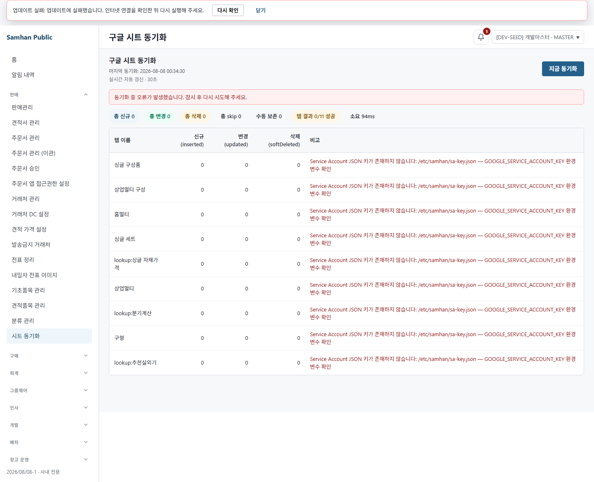

# #1111 S9 — sync 상태코드 재배포본 라이브 실측

## 1. 범위와 기준

- 대상: PR #1117 / 이슈 #1111, 브랜치 `feat/1111-bundle-components-to-base-product`
- HEAD: `11cc223a8`
- 라운드 식별자: `S9-1111`
- 제한 준수: 코드·DB·설정·SA key·컨테이너를 변경하지 않았고, 재빌드·재기동·commit·push를 하지 않았다.
- S8에서 통과한 UI 전 항목, S7 spec/controller test, CI 49/49, 고아 검사는 재실행하지 않았다.

## 2. 환경 확인

`docker inspect samhan-product-service`와 image inspect를 직접 실행했다.

```text
container created  2026-08-08 00:12:02.291 KST
container started  2026-08-08 00:12:07.568 KST
image created      2026-08-08 00:11:59.065 KST
container state    running / healthy
published port     127.0.0.1:8084 -> 8084
gateway            127.0.0.1:8080 / healthy
```

PM이 알려준 재배포 시각과 일치한다. 이 컨테이너를 재빌드하거나 재기동하지 않고 gateway `:8080`을 통해 직접 호출했다.

## 3. ① 전체 실패 — 실측 PASS

`dev_master`로 실제 로그인한 뒤 `POST /api/v1/products/admin/sync`를 호출했다. SA key 부재 때문에 11/11 탭이 실패했다.

```text
HTTP                    502
success                 false
code                    SYNC_FAILED
message                 시트 sync 전체 실패
totalTabs               11
successfulTabs          0
failedTabs              11
totalPreservedManual    0
totalInserted           0
totalUpdated            0
totalSoftDeleted        0
totalSkipped            0
durationMs              94
```

요구한 `failedTabs`와 `totalPreservedManual`은 실패 envelope의 `data`에 보존됐다. `GET /api/v1/products/admin/sync/last`도 HTTP 200의 기존 조회 envelope 안에 같은 `failedTabs=11`, `totalTabs=11`, `totalPreservedManual=0` summary를 반환했다.

실패 상세는 제품·lookup 9개가 `byTab`, 구성품 2개가 `byComponentTab`에 들어 있었다. 공통 오류는 다음과 같다.

```text
Service Account JSON 키가 존재하지 않습니다: /etc/samhan/sa-key.json
— GOOGLE_SERVICE_ACCOUNT_KEY 환경변수 확인
```

판정: 재배포본의 전체 실패 `502 / success=false / 상세 data 유지` 계약은 PASS다. S8의 stale artifact BLOCKING은 해소됐다.

## 4. ② 부분 실패 — 발화 조건 부재로 판정 불가

현재 컨테이너는 11개 탭 모두 하나의 `GoogleSheetsClient`와 동일한 SA key 경로를 사용한다. admin trigger는 호출 시작 시 cache를 invalidate하므로, key가 없는 현재 환경에서는 모든 첫 read가 동일하게 실패한다.

탭 하나만 실패시키려면 실제 시트의 특정 탭/범위, service 설정 또는 실행 artifact를 바꿔야 한다. 이번 라운드의 코드·설정·SA key·재빌드·재기동 금지 범위 안에는 부분 실패를 만드는 독립적인 런타임 스위치가 없다.

따라서 실제 `207 / success=false / code=SYNC_PARTIAL_FAILURE`는 **발화 조건 부재로 판정 불가**다. 이는 결함 판정이 아니다.

## 5. ③ 성공 — 발화 조건 부재로 판정 불가

성공하려면 Google Sheets read가 최소 한 번 성공해야 한다. 현재는 SA key가 없고 trigger가 cache를 먼저 비우므로, 기존 cache를 이용한 성공도 만들 수 없다. SA key 설정은 명시적으로 범위 밖이다.

따라서 실제 `200 / success=true`는 **발화 조건 부재로 판정 불가**다. 이는 결함 판정이 아니다.

## 6. ④ SheetSyncPage 실화면

워크트리의 실제 renderer를 mock 없이 gateway `:8080`에 연결하고 Chromium `headless: true`로 캡처했다. 화면에서 발생한 network는 다음과 같다.

```text
GET  /api/v1/products/admin/sync/last  -> 200
POST /api/v1/products/admin/sync       -> 502
```

### 6.1 manual skip과 실패 구분

화면은 다음을 동시에 별도 표시한다.

- `수동 보존 0`: manual 보존 집계
- `탭 결과 0/11 성공`: 성공/실패 탭 집계
- 탭별 적색 오류: 예외 실패 상세

따라서 둘 다 DB가 바뀌지 않더라도 manual 보존과 실패의 의미는 구분된다. manual 보존은 실패 수에 섞이지 않는다.

### 6.2 502 때 사용자가 보는 조치

- 상단 오류 banner: `동기화 중 오류가 발생했습니다. 잠시 후 다시 시도해 주세요.`
- 각 실패 행: `GOOGLE_SERVICE_ACCOUNT_KEY 환경 변수 확인`

원인과 운영 조치는 행 상세에서 알 수 있다. 다만 일반 사용자가 직접 환경 변수를 바꿀 수는 없고, 상단 banner는 재시도만 안내한다.

### 6.3 실캡처



200·207은 실환경 발화 조건이 없어 이번 디렉터리에 합성 screenshot을 만들지 않았다. 두 경우의 소비처 격리 화면은 S8에서 이미 확인됐으며 이번 라운드에서는 재검증하지 않았다.

## 7. 결함

### F1 — 실패 11개 중 구성품 탭 실패 2개가 SheetSyncPage 표에서 누락

실응답의 실패 상세 구조:

```text
totalTabs / failedTabs  11 / 11
byTab                   9개
byComponentTab          2개
```

SheetSyncPage의 row source는 `summary.byTab`만 순회한다. 따라서 `byComponentTab`의 다음 구성품 탭 실패 2개는 화면 표에 나오지 않는다.

- `싱글 구성품_단가인상`
- `상업멀티 구성_단가인상`

화면 합계는 `0/11 성공`인데 사용자가 확인할 수 있는 적색 실패 행은 9개다. status/envelope 계약 자체는 맞지만 실패 상세 표시가 불완전하다.

**S9 결함 수: 1건.** 코드 수정 금지 범위에 따라 수정하지 않았다.

## 8. 반대급부

### 8.1 기존 성공 소비처

- 성공 분기는 계속 `HttpStatus.OK` + `ApiResponse.ok(summary)`를 사용한다.
- 기존 envelope의 `success=true`, `code=OK`, `message`, `data`, `timestamp` 구조를 바꾸지 않았다.
- `SyncSummary`의 상태 집계 필드는 추가 전용이다. 기존 합계와 `byTab` 구조는 유지된다.
- 성공 실측은 SA key 부재로 이번 라운드에서 만들 수 없어 판정 불가이며, 소스 계약 재확인만 수행했다.

### 8.2 shared `ApiResponse` 오버로드

- 변경은 `fail(String code, String message, T data)` 추가 1건이다.
- 기존 `ok(T)`, `ok(T,String)`, `fail(ErrorCode,String)` 시그니처·동작은 그대로다.
- 저장소 전체 호출을 재검색한 결과 신규 3-argument 오버로드 소비처는 `ProductAdminController` 한 곳뿐이다.
- 삭제·대체가 없는 source-compatible 추가이므로 다른 서비스 파급은 0으로 재확인했다.

### 8.3 삭제 관문·manual flag·견적품목 구성 편집 제거

S6·S8 PASS 범위를 재실행하지 않았다. 현재 HEAD diff와 source에서 다음이 그대로 존재함을 확인했다.

- `bundle_components_manual` migration과 manual flag 경계
- manual 구성 보존 집계 `totalPreservedManual`
- BundleComponent soft-delete 경로와 삭제 관문
- 견적품목 화면의 구성 편집 진입 제거 및 product 화면 편집 경계

이번 sync 호출은 11/11 read 단계에서 실패해 inserted/updated/softDeleted가 모두 0이므로 이 관문들에 데이터를 쓰지 않았다.

## 9. 본 범위와 안 본 범위

본 범위:

- 지정 워크트리·브랜치·HEAD 확인
- 재배포 product-service의 container/image 생성 시각과 healthy 상태 직접 확인
- 실제 인증 + gateway 경유 전체 실패 POST와 last GET
- HTTP status, envelope, 실패 상세, manual 보존 합계 실측
- mock 없는 SheetSyncPage의 실제 502 소비와 headless screenshot
- 성공 소비처/source 호환, shared 오버로드 소비처, S6·S8 반대급부 source 재확인

안 본 범위:

- SA key 설정 또는 실제 Google Sheets read 성공
- 실환경 200 성공과 207 부분 실패
- 실제 시트 탭/범위 변경을 통한 부분 실패 조성
- 코드·DB·설정 변경, 컨테이너 재빌드·재기동
- S8 통과 UI 전 항목, S7 test, CI 49/49, 고아 집계 재실행
- PR #1117 밖 기능

## 10. 새 파일 목록

- `docs/dev-reports/2026-08-07-1111-s9-sync-status-live.md`
- `docs/qa-shots/1111-s9-live-qa/01-live-502-total-failure.png`
