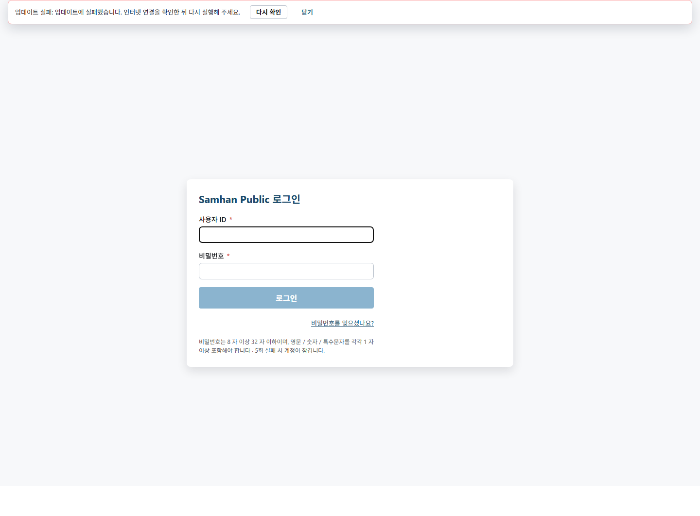
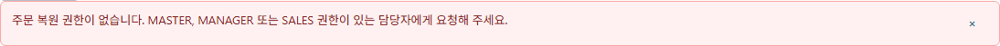
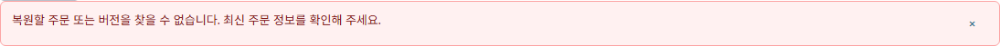
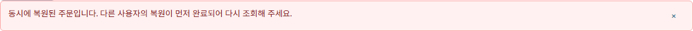
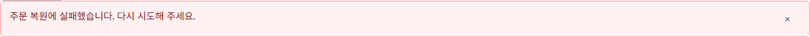

# PR #1115 — S15 머지 전 라이브QA

## 0. 환경 확인

- 검증 HEAD: `0a80591aec729f1a9c70c84466d79fe725787128`
- 최종 검증 시 worktree HEAD: `db8843f1d42b835f7dc32f33b478d599e4b57b8b`
- 프런트 소스·기동 worktree: `C:/dev/Samhan-Public/.claude/worktrees/t1110`
- 프런트: `http://127.0.0.1:5176` (`VITE_MOCK_MODE=0`, API base `http://127.0.0.1:8080`)
- API gateway: `http://127.0.0.1:8080`
- partner-order 직접 포트: `http://127.0.0.1:18088` (`18088 -> 8088`, healthy)
- partner-order 이미지: `sha256:16d363039f79f2a2987c61c4dd1add259338b672e92deef493633ca0418f5238`
- 브라우저: Playwright Chromium `147.0.7727.15`, headless
- 실행 cwd: `C:/dev/Samhan-Public/.claude/worktrees/t1110/clients/desktop`
- 브라우저 사전 확인: `LAUNCH_OK version=147.0.7727.15`

S15 실행 중 외부 세션이 `db8843f1d`(`docs(qa): #1110 S14 ...`)를 커밋해 HEAD가 이동했다. `0a80591ae..db8843f1d` 변경 파일은 `docs/dev-reports/2026-08-08-1110-s14-premerge-reconvergence.md` 1개뿐이며, `clients/`, `services/`, `shared/`, `infrastructure/` diff는 0이다. 따라서 실제 QA 대상 제품 코드는 시작 HEAD `0a80591ae`와 최종 HEAD `db8843f1d`에서 동일하다. S15는 이 커밋을 만들거나 push하지 않았다.

요청에는 Docker 스택이 `t1096`에서 실행 중이라고 적혀 있었으나, S15 실행 시점의 `docker compose ls`와 컨테이너 Compose 라벨은 실제 working directory를 `C:/dev/Samhan-Public/.claude/worktrees/t1113/infrastructure`로 표시했다. 기존 컨테이너를 중지·재시작·교체하지 않고, 당시 healthy 상태인 gateway와 partner-order를 그대로 사용했다.

화면이 실제 호출한 네트워크는 다음과 같다. 모든 복원 요청은 `5176`의 실제 렌더러에서 `8080` gateway로 전송됐고, 가짜 응답이나 `route.fulfill`은 사용하지 않았다.

- `GET /api/v1/partner-orders/2026-06-08-1980` -> `200`
- `GET /api/v1/partner-orders/2026-06-08-1980/revisions` -> `200`
- `POST .../revisions/32/restore` -> `401`, `403`, `409`
- `POST .../revisions/999999/restore` -> `404`
- `POST .../revisions/not-a-number/restore` -> `400`

상세 네트워크 증거는 [`evidence.json`](../qa-shots/1110-s15-live-qa/evidence.json)에 저장했다. 경로에는 화면용 주문번호만 있으며 UUID는 없다.

## 1. 결론

**도달 결함 1건. 머지 게이트 ③은 충족되지 않았다.**

- `403`, `404`, `409`, `400`: 발화 성공 및 화면 문구 PASS
- `401`: 발화 성공, 기대 문구 미표시로 FAIL
- `5xx`: 기존 스택 중지·의존성 훼손·가짜 응답 없이 안전하게 만들 수 있는 발화 조건이 없어 판정 불가

403의 S13 수정은 실제 화면에 반영됐다. 다만 401에서는 공통 API 인터셉터가 복원 컴포넌트의 오류 토스트를 사용자가 보기 전에 세션을 비우고 `#/login`으로 이동했다. 로그인 화면에도 만료·재로그인 안내가 없어 기대 계약을 충족하지 못한다.

## 2. 상태별 발화와 판정

| 상태 | 발화 조건 생성 | 실제 HTTP | 화면 문구 | 판정 |
|---|---|---:|---|---|
| 401 | 버전 이력을 연 뒤 복원 요청 토큰을 만료·무효 토큰으로 전환 | 401 | 기대 토스트 없음, 즉시 `#/login` 이동 | **FAIL** |
| 403 | MASTER 화면 캐시 유지 중 실제 요청 토큰을 유효한 DISPATCH 토큰으로 전환 | 403 | `주문 복원 권한이 없습니다. MASTER, MANAGER 또는 SALES 권한이 있는 담당자에게 요청해 주세요.` | PASS |
| 404 | GUI 복원 요청의 revision 경로만 비존재 `999999`로 바꾸고 실제 gateway 호출 (`continue`, 응답 합성 없음) | 404 | `복원할 주문 또는 버전을 찾을 수 없습니다. 최신 주문 정보를 확인해 주세요.` | PASS |
| 409 | 동일 주문 row를 `SELECT FOR UPDATE`로 잠근 동안 GUI 복원, 이후 `ROLLBACK` | 409 | 서버 업무 메시지 `동시에 복원된 주문입니다. 다른 사용자의 복원이 먼저 완료되어 다시 조회해 주세요.` 그대로 | PASS |
| 400 | GUI 복원 요청의 revision 경로만 숫자 변환 불가 값으로 바꾸고 실제 gateway 호출 (`continue`, 응답 합성 없음) | 400 | `주문 복원에 실패했습니다. 다시 시도해 주세요.` | PASS |
| 5xx | 안전한 실제 발화 조건 없음 | 미발화 | 캡처 없음 | **판정 불가** |

400·404 fault injection은 요청 URL만 변경해 실제 gateway와 실제 partner-order가 상태 코드를 생성하게 했다. 서버 응답을 Playwright에서 만들거나 바꾸지 않았다.

## 3. 결함

### D1 — 401 안내가 공통 리다이렉트에 의해 화면에서 유실됨

- 발화 횟수: 4회 재실행 중 4회
- 실제 복원 API: `POST .../revisions/32/restore -> 401`
- 실제 화면: `#/login`으로 이동, `partner-order-version-history-toast` 미표시
- 기대 화면: `로그인이 만료되었거나 유효하지 않습니다. 다시 로그인해 주세요.`
- 관찰 원인: 공통 axios 401 인터셉터가 `clearAuthState()` 후 로그인 경로로 이동해, 복원 mutation의 상태 코드별 토스트가 렌더링·유지될 화면이 사라진다.

401 캡처 상단의 `업데이트 실패` 배너는 앱 업데이트 확인에서 나온 별도 문구이며, 로그인 만료 또는 재로그인 안내가 아니다.

## 4. PASS 캡처

### 403 — 권한과 요청 대상 표시

### 404 — 복원 대상 없음과 최신 정보 확인 안내

### 409 — 서버 업무 메시지 보존

화면 문구와 서버 envelope의 `message`를 공백 정규화 없이 직접 비교해 동일함을 확인했다.

### 400 — 내부 사정 없는 일반 문구

400 응답에는 서버 message가 있었으나 화면은 이를 노출하지 않고 일반 문구만 표시했다.

## 5. 민감정보·데이터 안전 확인

- 모든 표시 문구와 캡처에서 UUID, 내부 식별자, 스택 문자열 노출 없음
- 평문 비밀번호를 보고서·증거 파일에 기록하지 않음
- DB 직접 `INSERT`/`UPDATE`/`DELETE` 없음
- 409 발화용 DB 명령은 `BEGIN; SELECT ... FOR UPDATE; SELECT pg_sleep(...); ROLLBACK;`뿐이며 정상 종료 확인
- 실패 상태만 실행해 주문 복원 성공 또는 주문 데이터 변경 없음
- mock/fixture 응답, 합성 이미지 사용 없음

## 6. 프로세스 회수

- S15가 기동한 Vite PID `58524` 종료, `5176` LISTEN 해제 확인
- Playwright browser/context 전부 `close()` 완료
- S15 종료 시 `t1110/clients/desktop`을 명령행에 포함하는 `node`, `chrome`, `headless-shell` 프로세스 0개 확인
- 기존 Docker 스택과 컨테이너는 중지하지 않음

## 7. 신규 파일

- 본 보고서: `docs/dev-reports/2026-08-08-1110-s15-premerge-live-qa.md`
- `docs/qa-shots/1110-s15-live-qa/01-401-login-expired.png`
- `docs/qa-shots/1110-s15-live-qa/02-403-forbidden-roles.png`
- `docs/qa-shots/1110-s15-live-qa/02-403-forbidden-roles-context.png`
- `docs/qa-shots/1110-s15-live-qa/03-404-not-found.png`
- `docs/qa-shots/1110-s15-live-qa/03-404-not-found-context.png`
- `docs/qa-shots/1110-s15-live-qa/04-409-server-business-message.png`
- `docs/qa-shots/1110-s15-live-qa/04-409-server-business-message-context.png`
- `docs/qa-shots/1110-s15-live-qa/05-400-generic-message.png`
- `docs/qa-shots/1110-s15-live-qa/05-400-generic-message-context.png`
- `docs/qa-shots/1110-s15-live-qa/evidence.json`

제품 코드 수정, commit, push는 하지 않았다. 실행용 임시 harness는 회수해 작업 트리에 남기지 않았다.
