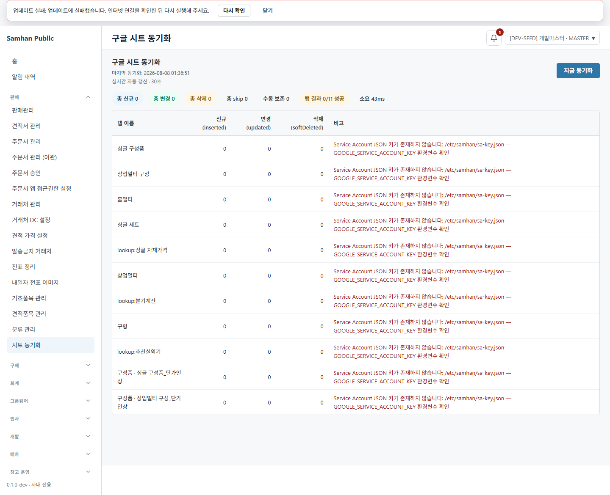

# PR #1117 / 이슈 #1111 S11 최종 재수렴

> 실행일: 2026-08-08 KST  
> 브랜치/HEAD: `feat/1111-bundle-components-to-base-product` / `1657fdef82baf1b385c45e75e1b6aa5e7f990ddd`  
> 라운드 식별자: `S11-1111`  
> 결론: **S9 결함 1건은 S10에서 해소됐다. S11 도달 결함은 0건이다.**

## 1. 환경 확인

| 항목 | 직접 확인한 값 |
|---|---|
| 워크트리 | `C:\dev\Samhan-Public\.claude\worktrees\t1111` |
| 브랜치/HEAD | `feat/1111-bundle-components-to-base-product` / `1657fdef8` |
| product-service | `samhan-product-service`, `127.0.0.1:8084`, running / healthy |
| gateway | `samhan-api-gateway`, `127.0.0.1:8080`, running / healthy |
| renderer | 현재 워크트리 `vite.web.config.ts`, `127.0.0.1:5218`, mock off |
| 브라우저 | Playwright Chromium, `headless: true`, 1440px viewport |
| 인증 | 실 `dev_master` / `dev_warehouse`; 비밀번호·JWT 미기록 |
| 제한 준수 | 코드·설정·SA key·DB 직접 변경·컨테이너 재빌드/재기동·commit/push 없음 |

전용 Browser 런타임은 가용 브라우저 0개였다. 저장소에 설치된 Playwright를 단발성 표준입력 스크립트로 실행했고, 사용자 창을 띄우지 않았다. QA 종료 뒤 Chromium과 5218 Vite를 종료했으며 5218 listener 0을 확인했다.

## 2. 발화 조건 카운트

종료 SELECT 값은 S6/S8 기준과 같다.

| 조건 | S11 종료 실측 |
|---|---:|
| 활성 세트 | **344** |
| raw 활성 구성품 | **1,598** |
| 활성 부모 아래 활성 구성품 | **1,585** |
| 활성 구성품 0건 세트 | **0** |
| 활성 `bundle_components_manual=true` | **1** |
| 삭제 부모 아래 활성 고아 | **13** |
| 활성 `S11-1111-*` 품목 | **0** |
| 활성 `S11-1111-*` 구성품 관계 | **0** |
| 활성 `S11-1111-*` 견적 노출 | **0** |
| soft-delete된 `S11-1111-*` 품목 | **10** |

기존 고아 13행은 조회만 했고 변경하지 않았다. S11 표본으로 생긴 신규 활성 고아는 0건이다.

## 3. ① S10 표시 재확인

### 3.1 실환경 502

실 `dev_master` 인증으로 `POST /api/v1/products/admin/sync`를 호출하고, 같은 인증 context에서 `/admin/sheet-sync`가 `sync/last`를 소비하도록 했다.

```text
HTTP                 502
totalTabs            11
successfulTabs       0
failedTabs           11
totalPreservedManual 0
byTab                9개
byComponentTab       2개
화면 전체 행          11개
화면 오류 행          11개
구성품 접두 행          2개
```

판정:

- 배지의 `failedTabs=11`과 화면 오류 행 11개가 일치한다: **PASS**.
- 두 구성품 행은 `구성품 · 싱글 구성품_단가인상`, `구성품 · 상업멀티 구성_단가인상`으로 구분된다: **PASS**.
- 화면의 별도 구성품 절은 없고 하나의 표로 합쳐진다. `byComponentTab`이 빈 객체/부재이면 `Object.entries(summary.byComponentTab ?? {})`가 행을 추가하지 않으므로 빈 절이 남지 않는다: **PASS(코드 + fresh test)**.
- 실 502에서 manual 보존은 0이고 실패 11행은 모두 `error` 보유 탭이다. manual 보존은 `totalPreservedManual` chip으로만 표시되고 오류 행 생성 조건에 들어가지 않는다: **PASS(실 502 + 코드 근거)**.



### 3.2 200·207

현재 배포는 SA key가 없고 11개 탭이 같은 `GoogleSheetsClient`/키 경로를 쓴다. 설정·SA key·시트·artifact 변경 없이 200 또는 207을 만드는 독립 런타임 스위치가 없다.

따라서 두 상태는 **발화 조건 부재**다. 결함 0이나 라이브 PASS로 세지 않았다.

코드 계약은 다음으로 확인했다.

- 200: `failedTabs == 0`이면 `HttpStatus.OK` + 기존 `ApiResponse.ok(summary)`를 그대로 사용한다.
- 207: 성공 탭과 실패 탭이 섞이면 `HttpStatus.MULTI_STATUS` + 실패 envelope의 `data=summary`를 사용한다. 207은 2xx라 Axios 성공 분기로 들어가고 같은 `buildSheetSyncRows`를 사용한다.
- 502: 성공 탭 0이면 `BAD_GATEWAY`; 실응답과 화면 11행으로 확인했다.
- 행 변환은 HTTP status를 분기하지 않고 `summary`의 `byTab`/`byComponentTab`만 정규화한다. 성공 응답의 기존 `byTab` 필드와 카운터 구조는 삭제·개명되지 않았다.
- `sheetSyncRows.test.ts` fresh 실행: **2/2 PASS**. 전체 실패 11행, 성공/skip/실패 혼합, 구성품 성공/실패, 빈 구성품 객체를 함께 고정한다.

manual 계약은 백엔드에서도 분리돼 있다. `bundleComponentsManual=true` 부모는 `preservedManual++` 후 `continue`하며, 해당 탭은 예외가 없으므로 `successfulTabs++`에 포함된다. `failedTabs`는 catch에서만 증가한다. `totalPreservedManual`은 `totalSkipped`와 별도 필드다.

## 4. ② S5 삭제 관문 재확인

### 4.1 구성품 보유 세트

공개 API로 `S11-1111-20260807163838-*` 일반 품목 2개와 세트 1개를 만들고 구성품 관계를 저장했다.

| 경로 | 실측 | 판정 |
|---|---|---|
| 구성품 1건 세트 무확인 직접 DELETE | HTTP **400** `INVALID_INPUT`; 부모 유지 | **PASS** |
| SET→GENERAL 무확인 | HTTP **400**; 구성품 유지 | **PASS** |
| SET→MATERIAL 무확인 | HTTP **400**; 구성품 유지 | **PASS** |
| 구성품 1→2건 변경 | PUT **200**, token 변경, token 길이 64 | **PASS** |
| 옛 token 확인 DELETE | HTTP **400**, 현재 구성품 2건 재확인 요구, 부모 유지 | **PASS** |
| 최신 token 확인 DELETE | HTTP **204** | **PASS** |
| 삭제 후 부모 카탈로그 | 0행 | **PASS** |
| 삭제 후 구성품 endpoint | HTTP **404** | **PASS** |
| 종료 DB 활성 S11 구성품/노출 | 0 / 0 | **PASS** |

실 관리자 화면에서도 별도 `S11-1111-UI-GATE-*` 세트를 열었다. 구성품 행 1개를 확인한 뒤 삭제 버튼을 눌렀고 dialog event 문구는 다음과 같았다.

```text
이 품목을 삭제하면 구성품 1건도 함께 삭제됩니다. 계속하시겠습니까?
```

dialog를 accept한 뒤 DELETE 204, 카탈로그 미노출, 구성품 endpoint 404를 확인했다.

- [구성품 보유 세트 삭제 전](../qa-shots/1111-s11-live-qa/04-componentful-before-confirm-delete.png)
- [확인 삭제 후 미노출](../qa-shots/1111-s11-live-qa/05-componentful-confirmed-deleted.png)

### 4.2 구성품 0건 세트 RED-B

`S11-1111-ZERO-20260807163920`을 **실 기초품목 등록 화면**에서 세트로 생성했다.

| 항목 | 실측 |
|---|---:|
| 화면 create | POST **201** |
| 상세 구성품 행 | **0** |
| 삭제 클릭 dialog event | **0회** |
| DELETE | **204** |
| 삭제 후 edit 행 | **0** |

확인창 오차단 없이 실제 UI 경로에서 삭제됐다: **PASS**.

- [0건 세트 삭제 전](../qa-shots/1111-s11-live-qa/02-zero-component-before-delete.png)
- [무확인 삭제 후 미노출](../qa-shots/1111-s11-live-qa/03-zero-component-deleted-no-confirm.png)

### 4.3 일반·자재·권한

| 경로 | 실측 | 판정 |
|---|---|---|
| GENERAL 무확인 삭제 | HTTP **204**, 이후 목록 0 | **PASS** |
| MATERIAL 무확인 삭제 | HTTP **204**, 이후 목록 0 | **PASS** |
| `dev_warehouse` DELETE | HTTP **403**, 부모 활성 유지 | **PASS** |
| 같은 표본 MASTER 정리 | HTTP **204**, 이후 목록 0 | **PASS** |

403 본문의 동적 권한 deny는 유지됐다. 본문 진단 문자열의 role은 `UNKNOWN`이었지만 실제 deny/부모 보존/MASTER 허용 계약에는 영향이 없으며 #1111 범위의 결함으로 세지 않았다.

첫 관문 표본은 기존 품목코드를 구성품으로 연결하려다 PUT 400이 나와 0건 세트 정상 삭제만 수행됐다. 제품 판정에는 사용하지 않았고 즉시 정리했다. 두 번째 표본은 S11 라운드 일반 품목을 먼저 생성해 외부 데이터 의존 없이 관문 전 경로를 밟았다.

## 5. ③ S10 새 표면과 파급

### `sheetSyncRows.ts`

- 일반 탭은 기존 카운터를 0 기본값으로 정규화한다.
- 구성품 탭은 `linked→inserted`, `bundlesMarked→updated`, `softDeleted`, `skipped`, `error`로 표에 맞춰 정규화한다.
- 200/207/502 모두 동일한 `summary` 행 변환 경로를 쓴다.
- `byComponentTab`이 없거나 비면 일반 행만 반환한다.
- manual 보존은 오류로 합성하지 않고 전체 `수동 보존` chip에서만 표시한다.

fresh Vitest 2/2 PASS와 실 502 11행으로 확인했다.

### 기존 소비처

- 성공 분기는 계속 `ApiResponse.ok(summary)`여서 `success=true`, `code=OK`, 기존 `data` 구조가 유지된다.
- `SyncSummary`에는 필드가 추가됐고 기존 필드 삭제·개명은 없다.
- `SheetSyncPage`의 기존 합계 chip, 일반 탭 처리 건수, last snapshot 소비 경로는 유지된다.

### shared `ApiResponse`

- 변경은 `fail(String code, String message, T data)` 오버로드 추가뿐이다.
- 기존 `ok(T)`, `ok(T,String)`, `fail(ErrorCode,String)`은 변경되지 않았다.
- 신규 오버로드의 실제 소비처는 `ProductAdminController`의 sync 실패 envelope 한 곳이다.
- `ProductAdminControllerTest` **4/4 PASS**, `:shared:common:test` PASS를 `--rerun-tasks --no-daemon`으로 새로 실행했다.

다른 서비스의 기존 호출은 시그니처 삭제·대체가 없는 source-compatible 추가의 영향을 받지 않는다.

## 6. 결함 수

```text
S9   1
S11  0
```

**S11 결함 수: 0건.** 머지 게이트 ①·③은 충족됐고, ②는 기존 CI 49/49 green과 이번 라이브 재확인으로 유지됐다.

200·207은 **발화 조건 부재**이며 결함 0 또는 라이브 PASS에 포함하지 않았다.

## 7. 본 범위와 안 본 범위

본 범위:

- 지정 워크트리·브랜치·HEAD, product-service/gateway healthy 확인.
- 실 SA key 부재 환경의 sync 502와 `sync/last` 화면 소비.
- 11 실패 배지/화면 행 일치, 구성품 접두어, manual/error 분리, 빈 구성품 입력 계약.
- 200/207/502 controller·row-builder 코드 경로와 fresh unit test.
- 실 화면의 구성품 보유 세트 확인 삭제와 0건 세트 무확인 삭제.
- 직접 API의 무확인/stale/latest token, GENERAL/MATERIAL, 전환 가드, 권한.
- 종료 DB SELECT로 활성 고아·S11 표본·구성품·노출 확인.
- shared `ApiResponse` 변경과 소비처 파급.

안 본 범위:

- SA key 설정, 실제 Google Sheets read 성공, 실제 시트/범위 변경.
- 라이브 200 성공과 라이브 207 부분 실패: 발화 조건 부재.
- 기존 고아 13행의 수정·정리.
- PR #1117 밖 가격·PWA 업데이트 banner·타 서비스 기능.
- 컨테이너 재빌드/재기동, DB 직접 변경, 코드 수정, commit/push.

## 8. 새 파일 목록

- `docs/dev-reports/2026-08-08-1111-s11-final-reconvergence.md`
- `docs/qa-shots/1111-s11-live-qa/01-live-502-all-11-visible.png`
- `docs/qa-shots/1111-s11-live-qa/02-zero-component-before-delete.png`
- `docs/qa-shots/1111-s11-live-qa/03-zero-component-deleted-no-confirm.png`
- `docs/qa-shots/1111-s11-live-qa/04-componentful-before-confirm-delete.png`
- `docs/qa-shots/1111-s11-live-qa/05-componentful-confirmed-deleted.png`

코드 파일 수정, commit/push, 컨테이너 재빌드는 하지 않았다.
