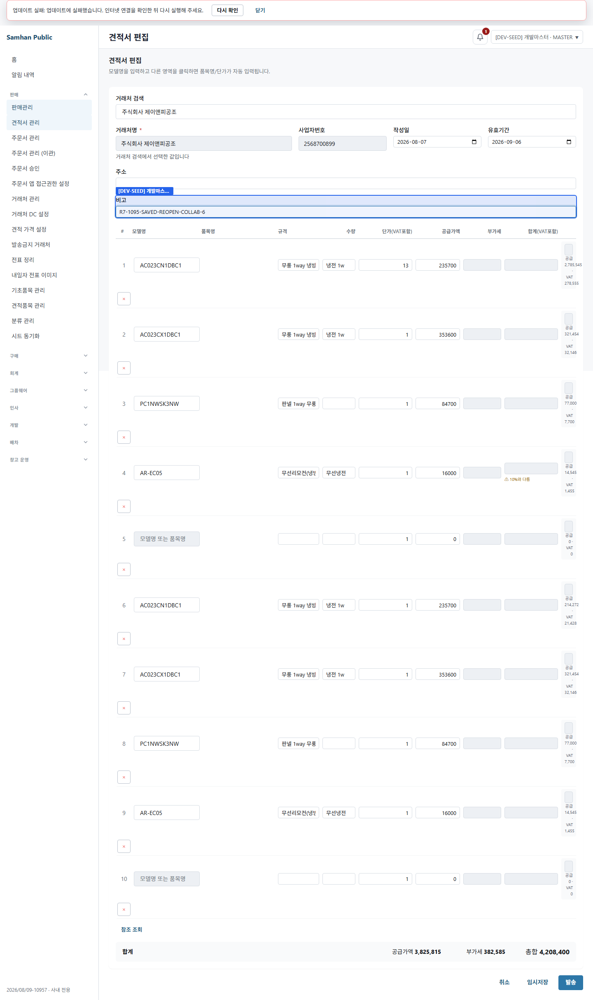

# PR #1133 R7 SOL 적대검증 재수렴

> 판정일: 2026-08-09 (KST)  
> 라운드 식별자: `R7-1095-SAVED-REOPEN`  
> 유일한 질문: 실 사용자 경로로 재현 가능한 결함이 있는가

## 환경 확인

- 워크트리: `C:\dev\Samhan-Public\.claude\worktrees\t1095`
- 브랜치: `feat/1095-sheet-product-status`
- 검증 HEAD: `f5b169f8b1fc796bbb3c1f17f1530c80ef7be65c`
- 데스크톱 Vite: `127.0.0.1:5295`
- 실 API 프록시: `127.0.0.1:5296`
  - `/api/products/**` → 실제 HEAD product-service `127.0.0.1:28084`
  - 나머지 `/api/**` → 실제 gateway `127.0.0.1:8080`
  - 라우팅 근거: `clients/desktop/playwright/1095-r5-real-qa/product-service-proxy.cjs:22-24,41-43`
- HEAD product-service: 이미지 `t1095-product-r7:f5b169f8b`, 포트 `28084`, 이미지 label `samhan.qa.source-sha=f5b169f8b1fc796bbb3c1f17f1530c80ef7be65c`
- HEAD inventory-service: 이미지 `t1095-inventory-r7:f5b169f8b`, 포트 `28085`, 이미지 label `samhan.qa.source-sha=f5b169f8b1fc796bbb3c1f17f1530c80ef7be65c`
- 빌드 산출물 SHA-256:
  - product-service JAR: `c68fd8f4f223b4b61f2d90e2cb3586e78ba5ed761243853422248572cbdcdacd`
  - inventory-service JAR: `4305bd58922bce60e21064a977ecdf91847c51e4378fd106842eb11065789cb9`
- mock 여부: Playwright가 포착한 호출은 `POST http://127.0.0.1:5296/api/products/lookup` HTTP 200이며, 위 프록시가 실제 `28084`로 전달했다. 안전재고는 `GET http://127.0.0.1:28085/inventory/alerts/safety-stock`를 직접 호출했다. 응답을 대체하는 mock/route fulfillment는 사용하지 않았다.
- 로그인 자격과 UUID는 산출물에서 각각 `<redacted>`, `<redacted-id>`로 치환했다.

상태별 건수 SELECT 원문:

```sql
SELECT status, COUNT(*)
FROM products
WHERE is_deleted=false
GROUP BY status
ORDER BY status;
```

실행 원문(실험 전과 복구 후 동일):

```text
    status    | count
--------------+-------
 ACTIVE       |  2984
 DISCONTINUED |    83
 NOT_FOR_SALE |    14
 OUT_OF_STOCK |     3
(4 rows)
```

## 최종 판정

**실 사용자 경로로 재현 가능한 결함이 2건 있다.** 첫째는 R5의 “저장된 품절 견적 재열기 잠금” 결함을 다시 관측한 것이 아니다. 셋째 가능성, 즉 **실 관리자 API가 현재 `OUT_OF_STOCK` 표본 3건 모두를 `ACTIVE`로 되돌리지 못해 요구된 저장 표본 생성을 차단하는 별도 도달성 결함**이다. 둘째는 같은 두 사용자 협업 절차 3회 중 1회 발생한 **B→A 비고 동기화 20초 초과**다.

- 관리자 상태 전환 결함: **재현** — 영향 `OUT_OF_STOCK` 3/3건
- R5 저장본 재열기 잠금: **관측 불가** — 저장된 품절 견적 라인 0건이며, 위 결함 때문에 허용된 실 경로로 표본을 만들 수 없었다. 이는 결함 0 판정이 아니다.
- 협업 동기화: **간헐 결함 재현** — 동일 경로 3회 중 1회, A→B 수량 전달 직후 B→A 비고 전달이 20초 안에 이뤄지지 않음
- 안전재고 stale 혼합: 실측 경로에서 정상 행 소실 또는 stale 행 무음 소실 재현 안 됨

## 1. 첫 과제 — 저장본 재열기

### 결과: 관측 불가(결함 0 아님)

요구 순서의 1단계, 즉 `OUT_OF_STOCK` 후보를 실 관리자 API로 `ACTIVE`화하는 지점에서 차단됐다. DB 직접 write는 하지 않았다.

재현 절차:

1. 실 관리자 인증으로 `GET /api/products/by-model/AR60F09C13WS` — HTTP 200, 현재 상태 `OUT_OF_STOCK` 확인.
2. 실 관리자 `PUT /api/products/{id}`로 tags에 `qaRound=R7-1095-SAVED-REOPEN` 기록 — HTTP 200.
3. 실 관리자 `POST /api/products/{id}/reactivate` 호출.
4. HTTP 409로 실패하여, 데스크톱 견적에 ACTIVE 품목을 넣어 저장하는 후속 단계가 불가능했다.
5. 실 관리자 API로 원래 tags `{}`를 복구했고, 시트 동기화 실 경로로 상태를 `OUT_OF_STOCK`에 재수렴시켰다.

실패 응답 원문:

```json
{"success":false,"code":"CONFLICT","message":"이미 사용 중인 품목명입니다: 냉난방 무풍 벽걸이 (충돌 품목 모델코드: AR60F07C12WS)","data":null,"timestamp":"2026-08-09T14:21:41.016757213Z"}
```

코드 도달점:

- 관리자 endpoint: `services/product-service/src/main/java/com/samhanair/logis/product/web/ProductController.java:170-172`
- 재활성화 직전 이름 중복 검사: `services/product-service/src/main/java/com/samhanair/logis/product/service/ProductService.java:685-688`
- 이름 중복 판정: `services/product-service/src/main/java/com/samhanair/logis/product/service/ProductService.java:639`

실 데이터 영향 건수 SELECT와 원문:

```sql
SELECT p.model_code,p.name,p.status,
 (SELECT COUNT(*) FROM products x
  WHERE x.is_deleted=false AND x.status='ACTIVE' AND x.name=p.name) AS active_name_conflicts
FROM products p
WHERE p.is_deleted=false AND p.status='OUT_OF_STOCK'
ORDER BY p.model_code;
```

```text
  model_code  |        name         |    status    | active_name_conflicts
--------------+---------------------+--------------+-----------------------
 AR60F07D11WS | 냉전 무풍 벽걸이   | OUT_OF_STOCK |                     5
 AR60F09C13WS | 냉난방 무풍 벽걸이 | OUT_OF_STOCK |                     5
 AR60F16C14WS | 냉난방 무풍 벽걸이 | OUT_OF_STOCK |                     5
(3 rows)
```

따라서 현재 후보 3/3 모두 같은 409 조건에 걸린다. 저장된 품절 견적 라인 수를 별도 SELECT한 결과는 다음과 같다.

```text
 stored_out_of_stock_estimate_lines
------------------------------------
                                  0
(1 row)
```

**첫 과제 캡처:** 생성하지 못했다. ACTIVE 전환 이전의 409로 견적 저장·품절 전환·재열기 화면까지 도달하지 못했으므로, 화면 캡처를 만들면 실 사용자 경로의 증거가 아니게 된다. 실패 전체 원문은 `docs/qa/2026-08-09-1095-r7/r7-status-reopen-observations.json`에 보존했다. 위 사유로 잠금/해제와 `SlipFormPage` 저장본은 모두 **관측 불가**다.

## 2. 협업 동기화의 품목 조회 및 입력 보존

실 사용자 두 세션 A/B가 기존 견적 `2026/08/07-12`를 동시에 열고, 같은 라인의 수량을 `13`으로 둔 채 메모를 번갈아 6회 수정해 실제 협업 동기화를 발생시켰다.

네트워크 실측:

| 구간 | `POST /api/products/lookup` 누적 호출 | 증가량 |
|---|---:|---:|
| A/B 최초 진입 완료 | 2회(A 1, B 1) | 2 |
| 교대 동기화 6회 후 | 2회 | 0 |

- 각 호출 HTTP 200.
- 즉 **동기화마다 lookup이 호출되지 않았다**. 현재 관측 경로에서는 페이지 최초 hydrate 때 사용자당 1회였다.
- 6회 동기화 각각 `413, 402, 390, 394, 391, 398ms`, 최댓값 `413ms`.
- 성공 실행에서는 6회 뒤 A/B 수량이 모두 `13`으로 유지됐다. hydrate가 수량을 덮어쓰는 현상은 재현되지 않았다.
- 종료 시 실제 저장본 원래 수량 `1`, 빈 메모로 복구했고 A/B 모두 `1`을 다시 관측했다.



원문: `docs/qa/2026-08-09-1095-r7/r7-collab-observations.json`  
hydrate 도달점: `clients/desktop/src/renderer/routes/EstimateFormPage.tsx:905-910`

### 결함 2 — 협업 동기화가 한 방향으로 20초 이상 끊김

완료 전 같은 명령을 재실행했을 때 A→B 수량 `13`은 전달됐지만, 곧이어 B가 입력한 첫 비고가 A에 전달되지 않았다. 독립 재실행은 다시 통과했다. 따라서 동일 실 경로 3회 중 성공 2회, 실패 1회인 간헐 도달 결함으로 판정한다.

재현 절차:

1. 동일 인증으로 견적 `2026/08/07-12` 편집 화면을 브라우저 컨텍스트 A/B에서 동시에 연다.
2. 두 화면의 초기 hydrate lookup을 확인한다.
3. A의 1번 라인 수량을 `13`으로 입력하고 B에 전달됨을 확인한다.
4. B의 비고를 `R7-1095-SAVED-REOPEN-COLLAB-1`로 입력한다.
5. A의 비고를 최대 20초 관찰한다.

실패 원문:

```text
Error: expect(locator).toHaveValue(expected) failed
Locator:  getByLabel('비고')
Expected: "R7-1095-SAVED-REOPEN-COLLAB-1"
Received: ""
Timeout:  20000ms
```

- 코드 수신 경로: `clients/desktop/src/renderer/routes/EstimateFormPage.tsx:939-1049` (`applyProviderState`, `subscribeDoc`)
- 실 재현 절차/단정: `clients/desktop/playwright/1095-r7-real-qa/1095-r7-status-reopen-real-qa.spec.ts:312-363`
- 실 데이터 영향: 기존 4라인 견적 1건, 동시 사용자 2명, 동일 실행 3회 중 1회. DB 저장 전 협업 draft 비고가 상대 화면에 도달하지 않았다.
- 실패 실행도 `finally`에서 빈 비고와 양쪽 수량 `1` 복구를 수행했고, 최종 DB SELECT에서도 4개 라인 수량 `1`, memo 공란을 확인했다.
- 실패 실행은 첫 비고에서 중단됐으므로 그 실행의 “6회 동기화 후 lookup 증가량”은 성립하지 않는다. 완료된 성공 실행의 실측값은 위 표처럼 `+0`이다.

## 3. 안전재고 fail-soft와 `lookup()` 사용처

실 HEAD inventory-service에 stale 품목이 정상 품목과 섞인 상태로 안전재고 목록을 요청했다.

응답 관측:

- HTTP 200, 총 7행 반환.
- 정상 품목 `ACL-KORGHP07` 1행은 코드·이름 모두 유지됐다.
- stale 6행도 응답에서 사라지지 않았다. 5행은 기존 `[DEV-SEED] ...` note로 식별 가능하고, 나머지 1행은 사용자가 제외하라고 한 `R5-1095-RESIDUE-THRESHOLD-0` 잔재다.
- threshold-0 두 행은 결함/복구 대상 집계에서 제외했다.

서비스 경고 원문(UUID만 비공개 원칙에 따라 치환):

```text
findAlerts: product-service가 batch 일부만 반환했습니다 — 식별자 없는 품목만 fallback 처리합니다. 요청=5, 응답=1, missingProductIds=[<redacted-id>, <redacted-id>, <redacted-id>, <redacted-id>]
```

코드 도달점: `services/inventory-service/src/main/java/com/samhanair/logis/inventory/service/SafetyStockService.java:180,185`  
응답 원문: `docs/qa/2026-08-09-1095-r7/r7-safety-stale-observations.json`

main 코드 grep 결과:

| 호출부 | 줄 | 메서드 | 영향 판정 |
|---|---:|---|---|
| `StockTransferService.java` | 65 | `lookup()` | 기존 strict 호출 유지 |
| `StockService.java` | 121 | `lookup()` | 기존 strict 호출 유지 |
| `StockExcelExportService.java` | 130 | `lookup()` | 기존 strict 호출 유지 |
| `InventoryAuditService.java` | 124 | `lookup()` | 기존 strict 호출 유지 |
| `SafetyStockService.java` (`findAlerts`) | 180 | `lookupAllowMissing()` | 이번 fail-soft 적용 지점 |
| `SafetyStockService.java` (`fireAlert`) | 321 | `lookup()` | 기존 strict 호출 유지 |
| `ProductClient.java` | 68 / 82 | strict / allow-missing 구현 | 별도 메서드로 공존 |

`lookupAllowMissing()` 신규 도입이 다른 main 호출부의 `lookup()`을 바꾸거나 우회시킨 흔적은 없었다.

## 4. 상태 hydrate의 나머지 표면

- 조회 실패 시 구현은 catch에서 기존 라인을 반환한다: `clients/desktop/src/renderer/utils/estimateLineStatus.ts:12-26`. 다만 이 R7에서 네트워크 실패를 인위적으로 만들지 않았으므로 실 화면 결과는 관측하지 않았다.
- 현재 실제 견적 데이터의 최대 라인 수는 4행이었다. 최대치 SELECT 원문:

```text
  estimate_no  | line_count
---------------+------------
 2026/08/07-12 |          4
 2026/08/07-4  |          4
 2026/08/07-5  |          4
```

따라서 “수십 라인 견적”의 느린/실패 hydrate는 **현재 실 데이터로 관측 불가**다. 4행 견적의 최초 hydrate는 사용자당 lookup 1회였고, 화면 라인은 표시됐다. 저장된 품절 라인 표본이 0건이라 비ACTIVE 잠금이 ACTIVE 라인으로 번지는지와 전표 저장본 경로도 관측 불가다.

## 5. R5 회귀 항목

이번 R7에서 새로 실측한 범위는 위 1~4절이다. 아래 R5 수치는 이번 라운드에 재측정하지 않았으며 R5 원문을 새 측정처럼 재보고하지 않는다.

- 견적 노출 ACTIVE 751건 중 누락 0건
- OUT_OF_STOCK 후보 누락 0건
- 시트 공란 상태 보존
- 비상품 34건 수량 자동 1, BUNDLE 8행 전개

## 증거 무결성 및 원상복구

1. 첫 시트 동기화 시 HEAD product 컨테이너에 읽기 전용 Google SA key mount가 빠져 11개 탭 모두 HTTP 502가 났다.

   ```text
   Service Account JSON 키가 존재하지 않습니다: /etc/samhan/sa-key.json — GOOGLE_SERVICE_ACCOUNT_KEY 환경변수 확인
   ```

   R5 컨테이너와 동일한 읽기 전용 mount를 적용해 HEAD 이미지를 재기동한 뒤, 실 관리자 API 동기화가 HTTP 200, 11/11 탭 성공, `totalUpdatedRows=121`, `durationMs=97900`으로 완료됐다. 이 최초 실패는 제품 결함으로 집계하지 않고 실행 환경 증거 보정으로만 기록한다.

2. 안전재고 direct API 최초 호출은 사용자 메타데이터 헤더가 없어 HTTP 403(빈 body)이었다. 실제 gateway가 부여하는 관리자 헤더를 함께 보낸 재호출에서 HTTP 200을 얻었다. 이 403도 제품 결함으로 집계하지 않는다.

3. 최종 SELECT를 재확인할 때 DB role을 `postgres`로 잘못 가정해 다음 read-only 실패가 한 번 있었다. 실제 컨테이너 설정 `POSTGRES_USER=samhan`을 읽고 동일 SELECT를 재실행했다.

   ```text
   psql: error: connection to server on socket "/var/run/postgresql/.s.PGSQL.5432" failed: FATAL: role "postgres" does not exist
   ```

4. DB INSERT/UPDATE는 한 번도 실행하지 않았다. 상태/tags 변경은 실 관리자 API만 사용했다.

최종 복구 원문:

```text
    status    | count
--------------+-------
 ACTIVE       |  2984
 DISCONTINUED |    83
 NOT_FOR_SALE |    14
 OUT_OF_STOCK |     3
(4 rows)

  model_code  |    status    | tags
--------------+--------------+------
 AR60F09C13WS | OUT_OF_STOCK | {}
(1 row)
```

R5 잔재인 threshold-0 안전재고 2건, soft-delete 표본 1건, `R5-TEMP-RESTORE-AC060CS6PBH1SY`는 결함이나 복구 대상으로 세지 않았고 변경하지 않았다.

## 신규 생성 파일

Git 비추적 산출물:

- `clients/desktop/playwright/1095-r7-real-qa/1095-r7-status-reopen-real-qa.spec.ts`
- `docs/dev-reports/2026-08-09-1095-r7-sol-reconvergence.md`
- `docs/qa/2026-08-09-1095-r7/07-collab-two-users-preserved.png`
- `docs/qa/2026-08-09-1095-r7/r7-collab-observations.json`
- `docs/qa/2026-08-09-1095-r7/r7-safety-stale-observations.json`
- `docs/qa/2026-08-09-1095-r7/r7-status-reopen-observations.json`

Git ignored 로컬 실행 로그:

- `clients/desktop/playwright/1095-r5-real-qa/_local/r7-product-build.log`, `r7-product-build.err.log`
- `clients/desktop/playwright/1095-r5-real-qa/_local/r7-product-docker-build.log`, `r7-product-docker-build.err.log`
- `clients/desktop/playwright/1095-r5-real-qa/_local/r7-inventory-build.log`, `r7-inventory-build.err.log`
- `clients/desktop/playwright/1095-r5-real-qa/_local/r7-inventory-docker-build.log`, `r7-inventory-docker-build.err.log`
- `clients/desktop/playwright/1095-r5-real-qa/_local/r7-vite.log`, `r7-vite.err.log`
- `clients/desktop/playwright/1095-r5-real-qa/_local/r7-proxy.log`, `r7-proxy.err.log`
- `clients/desktop/playwright/1095-r5-real-qa/_local/r7-playwright.log`, `r7-playwright.err.log`
- `clients/desktop/playwright/1095-r5-real-qa/_local/r7-collab-playwright.log`, `r7-collab-playwright.err.log`
- `clients/desktop/playwright/1095-r5-real-qa/_local/r7-cleanup-playwright.log`, `r7-cleanup-playwright.err.log`
- `clients/desktop/playwright/1095-r5-real-qa/_local/r7-safety-playwright.log`, `r7-safety-playwright.err.log`

## 못 한 것

- 관리자 재활성화 409 때문에 저장된 품절 견적의 재열기 잠금/ACTIVE 복귀 잠금 해제 캡처
- 같은 이유로 `SlipFormPage`의 저장된 품절 라인 확인
- 현재 실 견적 최대 4행이므로 수십 라인 hydrate의 실패/지연 관측
- R5의 751건/품절 후보/공란/비상품/BUNDLE 전체 묶음 재실측

git commit/push 및 main 병합은 하지 않았고, `tools/legacy-gas/**`는 변경하지 않았다.
