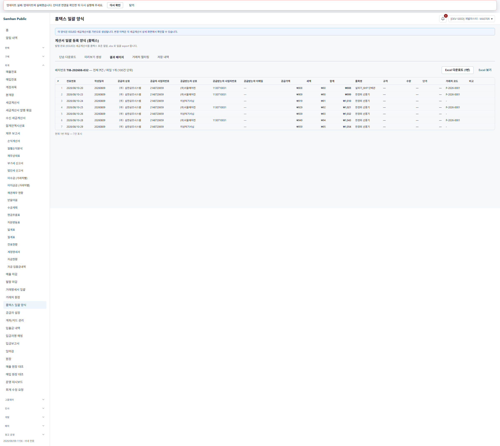

# PR #1156 R11 — SOL 5.6 적대검증 재수렴

## 환경 확인

- 워크트리: `C:\dev\Samhan-Public\.claude\worktrees\t1155`
- 브랜치: `fix/1155-inbound-partner-code`
- 검증 HEAD/배포 소스: `2fad617cd00a455cb0e043cb9cccce1f0d194e0f`
- renderer: `127.0.0.1:5330`. 실행 명령은 이 워크트리의 `vite.renderer.dev.config.ts --port 5330 --strictPort`였다.
- gateway/auth: `127.0.0.1:8080`, `127.0.0.1:8081`
- HEAD slip-service: `127.0.0.1:28206`, health `UP`
- HEAD accounting-service: `127.0.0.1:28208`, health `UP`
- Gradle 입력 대조: `:services:accounting-service:bootJar`, `:services:slip-service:bootJar` 모두 `UP-TO-DATE`; build 전체 `BUILD SUCCESSFUL`.
- accounting JAR SHA-256: host와 container `/app/app.jar` 모두 `844c1b229c978a7ed957164d7922391f97fe044e5b6d4dc323e199a44df2b336`.
- slip JAR SHA-256: host와 container `/app/app.jar` 모두 `6a73a4d5b194b611bbf5972871aee3e1c845374ac347c4e3a55cdb88c821f429`.

실제 호출 API는 다음과 같다.

```text
POST 8081/auth/login
GET  8080/admin/partners/search?q=&size=10000
GET  28206/slips?slipType=OUTBOUND&page=0&size=200
POST 28206/slips
GET  28206/slips/<redacted-uuid>
POST 28206/slips/<redacted-uuid>/{save|send|accept|process|complete|inspect|ship|deliver|confirm}
GET  28206/internal/slips/sales-query?from=2026-08-10&to=2026-08-10...
POST 28208/accounting/hometax-export/preview
GET  28208/accounting/hometax-export/<redacted-uuid>/split?fileIndex=0
```

## 판정

**실 사용자 경로로 재현 가능한 결함이 1개 있다.**

R10의 필드명 통일은 실제 DTO와 일치한다. 그러나 R10이 “17열 전수”라고 한 결과표에서 사업자번호가 정상인 R11 표본도 **공급받는자 이메일·규격·수량·단가·비고 5열에 실제 값이 없다.** 특히 사용자가 생성 시 입력한 `modelName=0000098`, `quantity=1`, `unitPrice=949` 중 규격·수량·단가가 sales-query→`HomtaxRow` 경계에서 소실돼 화면에 `—`로 보인다.

사업자번호 없는 거래처의 `buyerRegNo=''`는 RED-B① 정상 예외로 결함 수에서 제외했다.

## ① `HomtaxRow` 소비자 전수

### production 직접 참조

`services/**`, `clients/**`에서 build/node_modules를 제외하고 `HomtaxRow` 및 프런트 wire 타입을 전수 검색했다. Java production 직접 참조는 DTO 포함 4파일이다.

| 소비자 | 입력에서 기대하는 필드명 | 출력/하류에서 기대하는 필드명 | 판정 |
|---|---|---|---|
| `HomtaxRow.java:11-94` | record 생성자 61요소: 홈택스 59열 `invoiceType`~`receiptType` + 내부 `slipNo`, `partnerCode` | Jackson wire key도 같은 record component 이름 | R10 추가 필드가 record 끝에 있고 이름 계약은 일치 |
| `TaxInvoiceBatchPreviewResponse.java:12-43` | `List<HomtaxRow> rows` | 이름 변경 없이 `rows`로 직렬화 | 일치 |
| `HometaxExportService.java:535-579` | raw: `businessNumber`, `partnerName`, `representativeName`, `address`, `bizType`, `bizItem`, `email`, `supplyAmount`, `vatAmount`, `deliveryAddress`, `itemName`, `slipNo`, `partnerCode` | snapshot은 record key 전부, XLSX는 `invoiceType`~`receiptType` 59개 accessor만 사용(`:745-763`) | `partnerCode`는 preview에 남고 XLSX에는 미포함. 다만 5개 표시 열 값은 아래 결함 재현 |
| `TaxInvoiceBatchService.java:350-422` | 위와 같은 raw key | snapshot은 record key 전부, XLSX는 `invoiceType`~`receiptType` 59개 accessor만 사용(`:594-612`) | R10 추가 후에도 배치 59열 순서는 불변. 다만 같은 5개 값 공백 계약을 공유 |

### 프런트 타입 소비자

| 소비자 | 기대 필드명 | 판정 |
|---|---|---|
| `hometaxExportApi.ts:36-98` `HometaxPreviewRow` | 백엔드 61개 wire key와 동일 | 일치 |
| `hometaxExportApi.ts:102-108` `HometaxResultRow` | DTO 전체 + 파생 `rowNo`, `totalAmount` | 두 파생값만 추가 |
| `HometaxExportPage.tsx:38-54,484-505,524` | 표 15개 DTO key + `rowNo`, `totalAmount` | production importer는 이 화면 단 1곳. 다른 화면 import 0곳 |
| `hometaxExportApi.test.ts` | `HometaxPreviewRow`, `toHometaxResultRow` | 작업 시작 전부터 존재한 사용자 소유 미추적 파일; 수정하지 않음 |

Java test 참조도 빠짐없이 확인했다.

| test 소비자 묶음 | 기대 필드 |
|---|---|
| `HometaxExportServiceTest` | `partnerCode`, `buyerRegNo`, supplier accessors 및 legacy XLSX |
| `TaxInvoiceBatchServiceTest` | supplier accessors, `buyerRegNo` |
| `TaxInvoiceBatchIT`, `HometaxExportPreviewIT` | 61요소 record 생성자와 preview `rows` |
| `SupplierProfileFEMatchIT` | `HomtaxRow` 문자열 주석만 일치하며 typed consumer는 아님 |

### 배치 출력

- `HometaxExportService.toValueArray()`와 `TaxInvoiceBatchService.toValueArray()`는 모두 정확히 59개 accessor를 같은 순서로 쓴다. `slipNo`, 신규 `partnerCode`는 양쪽 XLSX 배열에서 제외된다.
- 대상 fresh 실행: `HometaxExportServiceTest` 7, `TaxInvoiceBatchServiceTest` 5, `TaxInvoiceBatchIT` 10 = **22 tests / failure 0 / error 0 / skipped 0**, `BUILD SUCCESSFUL`.
- 실제 R11 다운로드도 59열이며 아래 RED-C 값이 유지됐다.

## ② 결과표 17열 실측

실 renderer에서 센 헤더는 정확히 17개다.

```text
# | 전표번호 | 작성일자 | 공급자 상호 | 공급자 사업자번호 |
공급받는자 상호 | 공급받는자 사업자번호 | 공급받는자 이메일 |
공급가액 | 세액 | 합계 | 품목명 | 규격 | 수량 | 단가 | 거래처 코드 | 비고
```

R11 정상 표본의 실제 17셀 원문:

```text
6 | 2026/08/10-28 | 20260809 | （주）삼한공조시스템 | 2148720659 |
(주)서울에어컨 | 1130710031 | — | ₩949 | ₩94 | ₩1,043 |
한경희 선풍기 | — | — | — | P-2026-0001 | <빈 값>
```

R11 사업자번호 없음 표본의 실제 17셀 원문:

```text
7 | 2026/08/10-29 | 20260809 | （주）삼한공조시스템 | 2148720659 |
이상덕기사님 | <빈 값: RED-B① 정상> | — | ₩959 | ₩95 | ₩1,054 |
한경희 선풍기 | — | — | — | - | <빈 값>
```



### 재현 결함 — 5개 열에 실제 값이 없다

재현 절차:

1. `2026/08/10-28` OUTBOUND를 거래처 `(주)서울에어컨`, 품목 `한경희 선풍기`, 모델 `0000098`, 수량 `1`, 단가 `949`로 정상 생성한다.
2. 정상 상태 전이 API로 `CONFIRMED`까지 보낸다.
3. 5330 `/#/accounting/hometax-export`에서 2026-08-10 preview를 실행한다.
4. 결과표의 이메일·규격·수량·단가·비고를 읽는다.

원문:

```text
DTO  buyerEmail1="", itemSpec1="", itemQty1=null, itemPrice1=null, remark=""
UI   공급받는자 이메일="—", 규격="—", 수량="—", 단가="—", 비고=""
```

원인 좌표:

- `SlipSalesQueryResponse.java:33-66` — sales-query 계약에 대표 품목명만 있고 규격·수량·단가 필드가 없다.
- `SlipSalesQueryResponse.java:89-101,115-130` — 라인에서 첫 품목명만 취하고 email은 빈 문자열로 고정한다.
- `HometaxExportService.java:559-575` — email/배송주소/품목명만 읽고 `itemSpec1=""`, `itemQty1=null`, `itemPrice1=null`로 만든다.
- `TaxInvoiceBatchService.java:374-421` — 배치 매퍼도 같은 값을 사용한다.
- `HometaxExportPage.tsx:729,741-750` — 해당 DTO 공백/null을 `—` 또는 빈 칸으로 표시한다.

실 데이터 영향:

- 2026-08-10 현재 preview 행 **7/7행**에서 위 5필드가 모두 비었다 = **35셀**.
- R11 자기 표본은 **2/2행** 영향.
- `buyerRegNo` 없는 3행은 별도 정상 예외이며 위 35셀 집계에 포함하지 않았다.

## ③ RED-C — 실제 XLSX 원문

실 UI의 `Excel 다운로드 (1번)` 버튼으로 받은 파일: [`r11-hometax.xlsx`](../qa/2026-08-10-1156-r11/r11-hometax.xlsx)

- workbook: 1번 시트, 59열, 데이터 7행.
- R11 정상 표본(화면 rowNo 6 → workbook 12행): 공급받는자 등록번호 `1130710031`.
- R11 누락 표본(화면 rowNo 7 → workbook 13행): 공급받는자 등록번호 빈 셀.

read-only 파싱 원문:

```text
ROW=12 buyerRegNo='1130710031' buyerName='(주)서울에어컨' supply=949 vat=94 itemName1='한경희 선풍기'
ROW=13 buyerRegNo=''            buyerName='이상덕기사님' supply=959 vat=95 itemName1='한경희 선풍기'
```

따라서 R10 화면 필드명 변경과 `partnerCode` 추가가 RED-C의 두 등록번호 결과를 바꾸지 않았다.

## ④ 공식 real-QA 수치와 CI

### 공식 추적 PR scope 재계수

R10/요청의 `44/44`는 현재 공유 `playwright.real-qa.config.ts`와 `origin/main...HEAD` 추적 파일에서 재구성되지 않았다. `--list` 실측 정본은 **10 files / 19 tests**다. 추적된 이 19건을 그대로 실행한 결과:

```text
expected=11 unexpected=8 skipped=0 flaky=0
```

8 unexpected는 R1~R6 과거 스펙이 현재 없는 고정 런타임 `18106`, `28186`, `5316`을 호출한 결과다. 사용자 도달 결함 수에는 포함하지 않았다.

현재 HEAD 런타임을 쓰는 R7+R9+R10 도달 회귀 5파일 11건은 다시 묶어 실행했다.

```text
expected=11 unexpected=0 skipped=0 flaky=0
duration=47.307s
```

R11 신규 스펙은 결함을 정확히 재현해 `expected=0 unexpected=1`이다. 공식 수치에는 섞지 않았다.

### GitHub CI — HEAD `2fad617cd`

```text
43 checks SUCCESS
1 check FAILURE — Desktop Playwright (mock 회귀 hard gate)
  expected=666 unexpected=2 skipped=0 flaky=0
```

나머지 frontend, accounting/slip/backend, Playwright web/electron/mobile, docs/harness/credential guard는 통과했다. CI는 green이 아니다.

## ⑤ R2~R9 도달 회귀

현재-runtime 11/11 실행에서 다음 실사용 경로가 통과했다.

- 전이 fail-open, 같은 partnerId 재전송 code 보존, A→B 헤더 변경.
- DRAFT→SENT 보강.
- GUI 생성/변경 시 `partnerCode`/`businessNumber` 분리 저장.
- 상세, 매입 인쇄, 견적 변환 사업자번호.
- 입출금, 현금영수증 fallback 제거 후 화면/실 API 값.
- R8 branded 타입 경계의 런타임 값 불변.
- 홈택스 사업자번호 있음/없음과 R10 결과표 필드명.

`PartnerAuthService.java:144,326`은 관측만 했고 결함 수에 포함하지 않았다.

## 증거 무결성

- R11 산출물은 모두 `docs/qa/2026-08-10-1156-r11/` 바로 아래에 있다. `_local`은 0개다.
- `docs/qa` 상수는 `resolveQaShotsDir`을 경유한다. R11 스펙은 `writeFileSync`를 사용하지 않는다.
- 스펙 디렉터리는 `1156-r11-sol-reconvergence-real-qa`로 끝난다.
- `resolveQaCredential`은 test 본문 try/catch 안에서만 호출한다.
- 캡처/보고서 자격 표기는 `<redacted>`, UUID는 `<redacted-uuid>`다.
- R10 committed evidence와 스펙은 `sourceHead: c701051a2`를 하드코딩한다(`r10-after-fix-evidence.json:7`, R10 spec `:181`). HEAD `2fad617cd` 재실행에도 그 값을 쓴다. 따라서 R10 JSON의 `sourceHead`는 HEAD 증거로 사용할 수 없고, R11에서 bootJar `UP-TO-DATE` + bind-mounted host/container JAR hash로 독립 대조했다.

## 신규 파일 목록

- `clients/desktop/playwright/1156-r11-sol-reconvergence-real-qa/playwright.config.ts`
- `clients/desktop/playwright/1156-r11-sol-reconvergence-real-qa/1156-r11-sol-reconvergence-real-qa.spec.ts`
- `docs/qa/2026-08-10-1156-r11/01-hometax-17-columns.png`
- `docs/qa/2026-08-10-1156-r11/r11-hometax.xlsx`
- `docs/dev-reports/2026-08-10-1156-r11-sol-reconvergence.md`

작업 시작 전부터 있던 사용자 소유 미추적 파일 `clients/desktop/src/renderer/api/hometaxExportApi.test.ts`는 수정하지 않았다.

## 만든 R11 표본

| 전표 | 상태 | 거래처 | 사업자번호 | 용도 |
|---|---|---|---|---|
| `2026/08/10-28` OUTBOUND | CONFIRMED | `(주)서울에어컨`, `P-2026-0001` | `113-07-10031` | 17열 실제 값·XLSX 정상 등록번호 |
| `2026/08/10-29` OUTBOUND | CONFIRMED | `이상덕기사님(경기퀵)`, `-` | 없음 | RED-B① 빈 등록번호·XLSX 빈 셀 |

## 못 한 것

- 검증 요청이므로 재현 결함은 수정하지 않았다.
- git commit/push/PR 조작을 하지 않았다.
- 보정 endpoint, 기존 발행 전표 소급 처리, 거래처 `1068689215` 조작, DB 직접 INSERT/UPDATE를 하지 않았다.
- 공유 실 DB write는 R11 표본 2건의 정상 API 생성·전이에만 사용했다.
- CI가 red이므로 merge 가능 판정은 하지 않았다.
