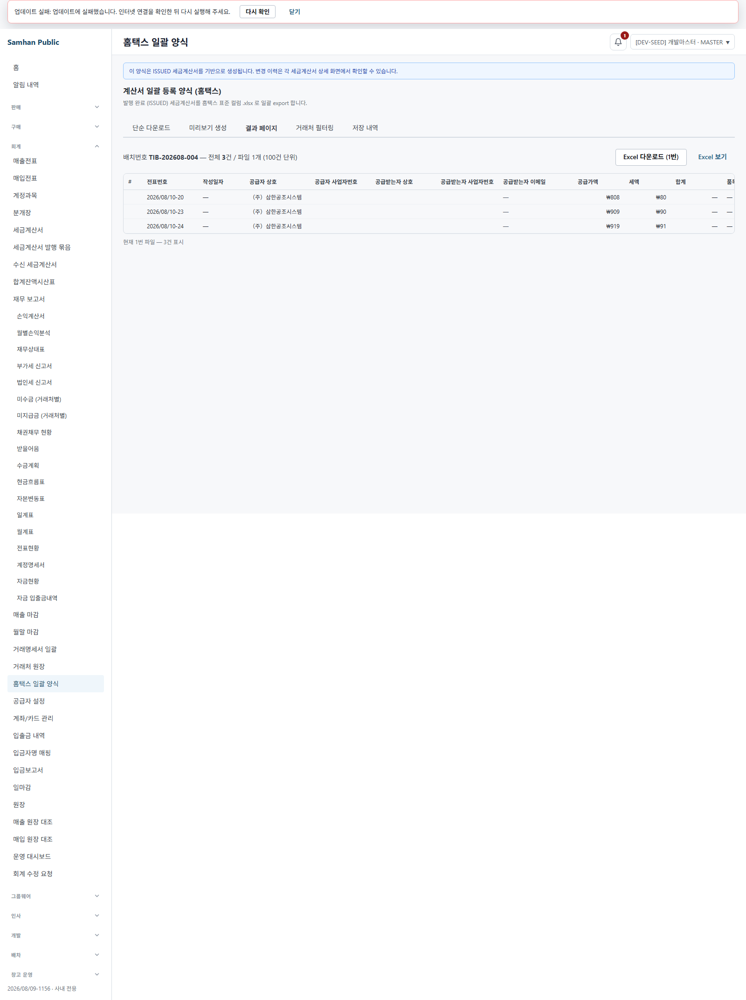
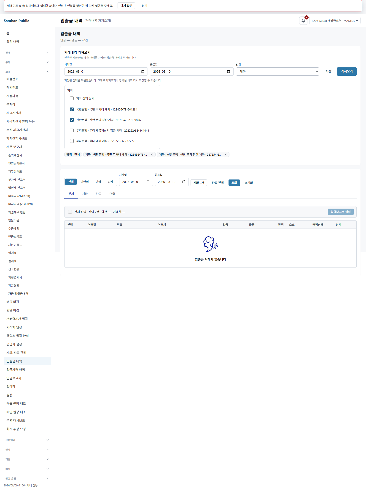
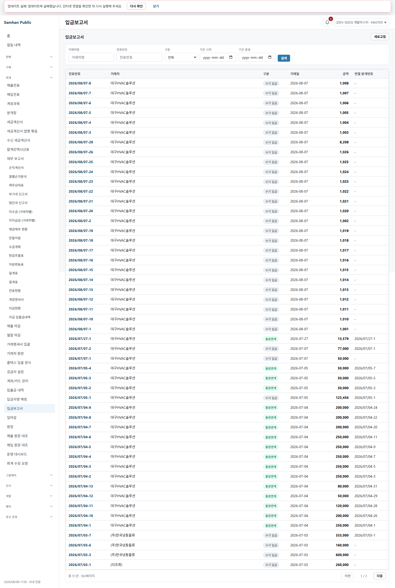
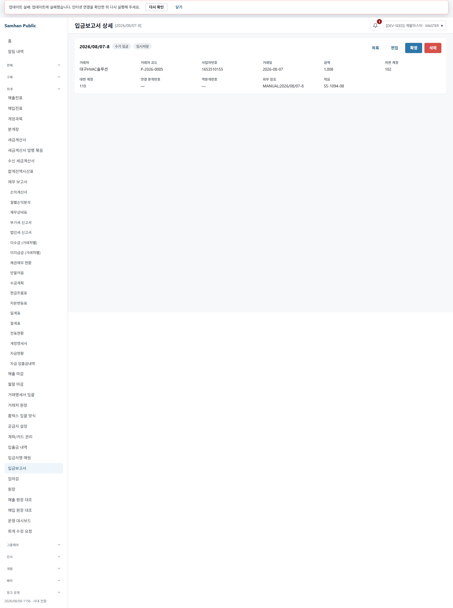
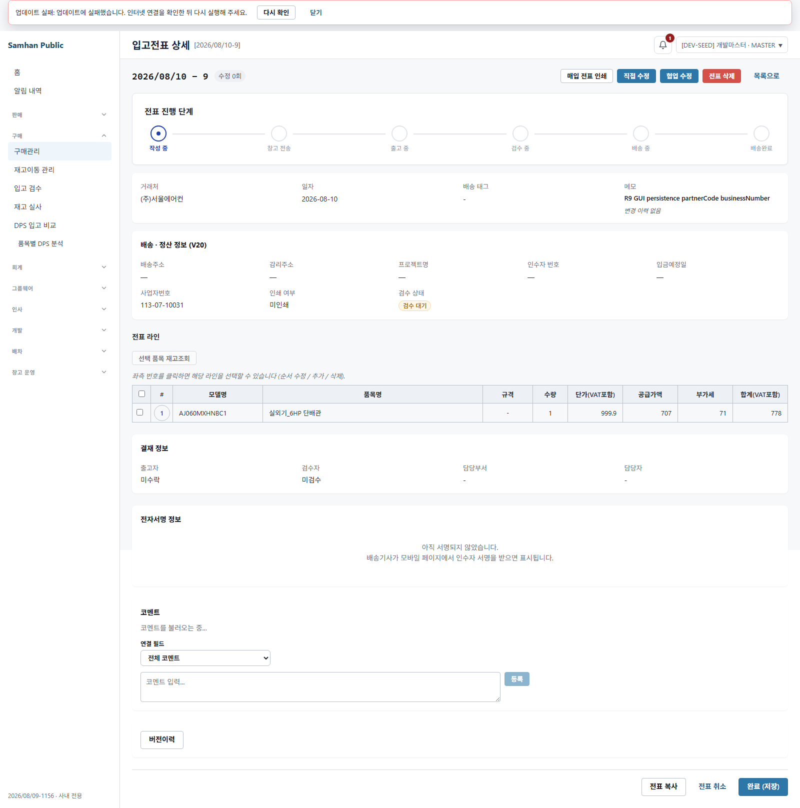
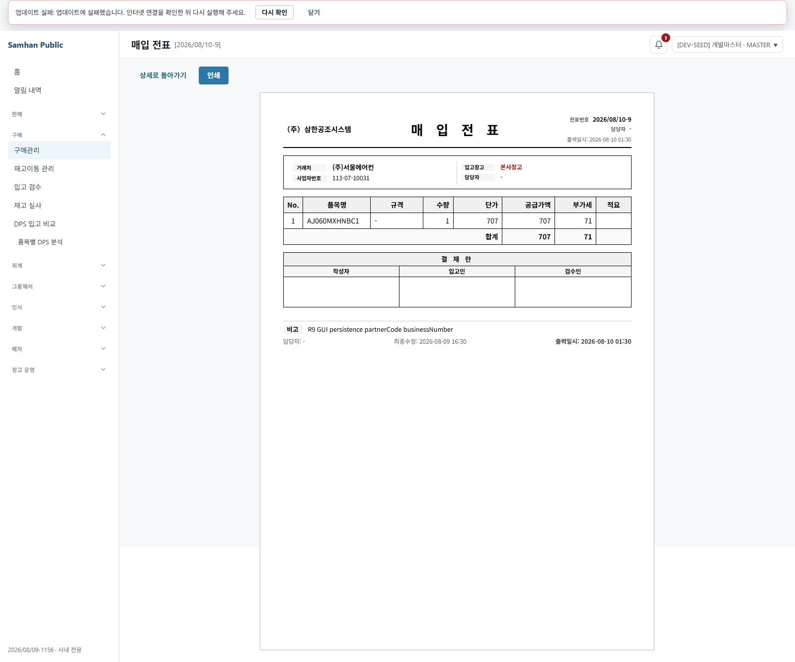
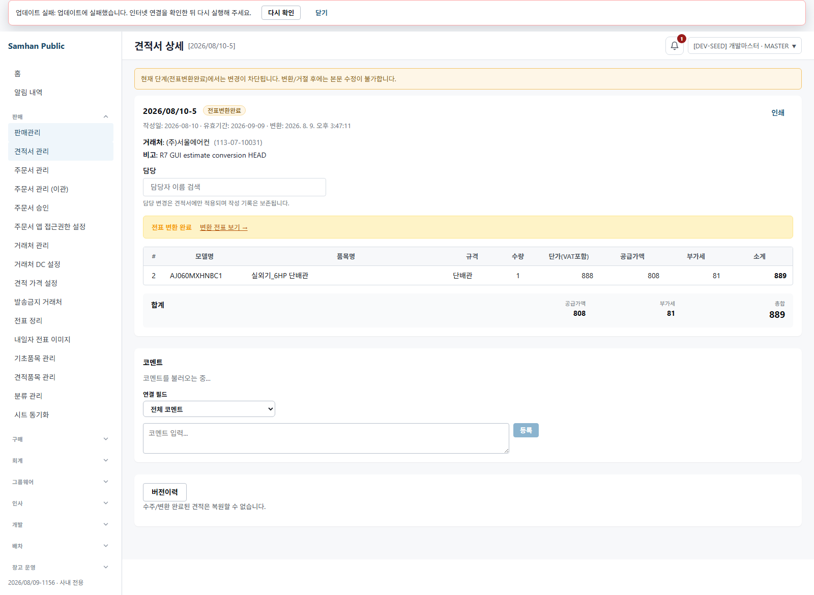

# PR #1156 R9 — SOL 5.6 적대검증 재수렴

## 환경 확인

- 워크트리: `C:\dev\Samhan-Public\.claude\worktrees\t1155`
- 브랜치: `fix/1155-inbound-partner-code`
- 검증 HEAD: `19d7fe34b518925436e81c5986a3821d10008ac2`
- 정상 renderer: `127.0.0.1:5330` (`vite.renderer.dev.config.ts`)
- gateway: `127.0.0.1:8080`
- HEAD slip-service: `127.0.0.1:28206`
- partner lookup timeout slip-service: `127.0.0.1:28207`
- R9 accounting-service: `127.0.0.1:28208`, health `{"status":"UP"}`
- accounting 배포본: 컨테이너 label `org.opencontainers.image.revision=19d7fe34b518925436e81c5986a3821d10008ac2`. 호스트와 컨테이너 `/app/app.jar` SHA-256가 모두 `4e24f04d8c43171cc015d500f328fc34debff3f1d6567f2e7383e0ec07ff7784`였다.
- 제외한 stale/타 작업 런타임: `28186`과 accounting `28087`. R9 판정에는 사용하지 않았다.

실제 호출 API는 다음과 같다.

```text
GET  28206/internal/slips/sales-query?from=2026-08-10&to=2026-08-10...
POST 28208/accounting/hometax-export/preview
GET  28208/accounting/hometax-export/<redacted-uuid>/split
GET/POST/PUT 28206/slips/**
GET  8080/admin/partners/search
GET  8080/accounting/bank-transactions/**
GET  8080/accounting/cash-receipts/**
```

모든 기록된 응답은 `mock=false` 또는 실제 목적지 포트로 확인했다.

## 판정

**실 사용자 경로로 재현 가능한 결함이 1개 있다.**

R8의 핵심 수정인 홈택스 공급받는자 등록번호 생성은 라이브 백엔드와 실제 XLSX에서 정상이다. 그러나 같은 실사용 흐름의 **5330 홈택스 결과표가 백엔드 응답 DTO와 다른 필드명을 읽어 공급받는자 상호·등록번호·거래처코드·작성일 등을 빈 칸/대시로 표시한다.** 따라서 전체 도달성 판정은 RED다.

## 첫 과제 — 홈택스 라이브

자기 R9 OUTBOUND 표본을 UI/API 정상 경로로 생성하고 `CONFIRMED`까지 전이한 뒤, HEAD accounting JAR로 미리보기와 다운로드를 실행했다.

| 전표 | 상태 | 거래처코드 | 저장된 사업자번호 | preview `buyerRegNo` | XLSX 공급받는자 등록번호 |
|---|---|---|---|---|---|
| `2026/08/10-23` | CONFIRMED | `P-2026-0001` | `113-07-10031` | `1130710031` | `1130710031` |
| `2026/08/10-24` | CONFIRMED | `-` | `-` | 빈 문자열 | 빈 셀 |

두 번째 표본은 현재 실제 거래처 모집단에서 사업자번호 숫자가 없는 `이상덕기사님(경기퀵)`을 선택했다. 거래처 자체는 수정하지 않았다. `partnerCode=-`에서 숫자를 만들어 내지 않았으므로 RED-B①의 임의 등록번호 생성은 재현되지 않았다.

실제 다운로드 파일은 `r9-hometax-live.xlsx`이며 read-only로 파싱했다. R9 두 행은 각각 `1130710031`, 빈 셀이었다.



### 재현된 결함 — 결과표 응답 계약 불일치

백엔드 `TaxInvoiceBatchPreviewResponse.rows`는 `HomtaxRow`를 그대로 반환하며 필드가 `writeDate`, `supplierRegNo`, `buyerName`, `buyerRegNo`, `itemName1` 등이다. 반면 desktop `hometaxExportApi.ts`는 응답 변환 없이 `issueDate`, `supplierBusinessNo`, `recipientName`, `recipientBusinessNo`, `itemName`, `partnerCode`라고 선언하고, `HometaxExportPage.tsx`가 그 이름을 그대로 읽는다.

라이브 화면에서는 전표번호와 금액은 표시됐지만 다음 값은 비었다.

```text
2026/08/10-23: 공급받는자 상호="", 사업자번호="", 거래처코드="", 작성일자="—"
2026/08/10-24: 공급받는자 상호="", 사업자번호="", 거래처코드="", 작성일자="—"
```

즉 파일 생성 결함은 고쳐졌지만, 사용자가 결과 화면에서 등록번호를 확인하는 read 경로는 깨져 있다. 실제 renderer의 POST preview 200 및 GET split 200 뒤 같은 화면에서 재현했다.

원문: `docs/qa/2026-08-10-1156-r9/r9-hometax-live-evidence.json`, `r9-hometax-live.xlsx`.

## ② 타입 경계

`asPartnerCode`와 `asBusinessNumber`는 소스와 런타임 모두 입력 문자열을 그대로 반환하는 cast였다.

```text
asPartnerCode("P-2026-0001")       -> "P-2026-0001"
asBusinessNumber("113-07-10031") -> "113-07-10031"
validation=false
```

실 경계로 들어온 값도 확인했다.

- 현금영수증 51건의 거래처 선택 데이터에서 첫 표시 표본 `2026/08/07-8`은 거래처코드 `P-2026-0005`, 사업자번호 `1653510155`로 분리됐다.
- 입출금 316건과 현금영수증 51건 전체 응답에서 `code`가 비고 `bizNo` 또는 이름만 있어 과거 fallback에 의존하는 행은 각각 0건이었다.
- 따라서 nominal 타입은 임의의 잘못된 문자열을 런타임에서 막지 않지만, 이번 실 데이터 경계에서는 두 값이 섞여 들어오지 않았다.
- 5330 입출금 화면과 현금영수증 목록·상세를 모두 열었다. 화면 진입 파손은 재현되지 않았다.







원문: `docs/qa/2026-08-10-1156-r9/r9-type-boundary-evidence.json`.

## ③ write 3곳 fallback 제거의 반대급부

현재 공유 실 응답 모집단에서는 fallback 제거 때문에 표시값이 비는 도달 가능한 행을 찾지 못했다.

| 화면/응답 | 조사 행 수 | `code` 없음 + 과거 fallback 값 존재 |
|---|---:|---:|
| 입출금 | 316 | 0 |
| 현금영수증 | 51 | 0 |

현금영수증 상세에서 거래처코드와 사업자번호가 각각 표시됐고, 입출금·현금영수증 양쪽 모두 정상 route가 렌더링됐다. 따라서 이 반대급부 결함은 현재 실 사용자 데이터에서 재현되지 않았다.

## ④ R2·R3·R6·R7 회귀

### 상태 전이와 partnerCode

R9 자기 표본을 실 HTTP로 재검증했다.

- 같은 partnerId 재전송: `2026/08/10-6`, create `00` → 같은 partnerId `00` → partnerId 생략 `00` 보존.
- A→B 헤더 변경: 같은 표본이 `(주)서울에어컨`으로 바뀌며 `P-2026-0001`.
- lookup timeout fail-open: `2026/08/10-7`, send 약 2.051초와 confirm 약 2.064초 모두 HTTP 200, 최종 CONFIRMED. partnerCode는 임의 생성 없이 빈 값 유지.
- DRAFT→SENT 보강: `2026/08/10-8`, timeout 런타임에서 빈 code로 만든 뒤 HEAD에서 send하자 `partnerCode=00`.

원문: `docs/qa/2026-08-10-1156-r9/r9-backend-regression-evidence.json`.

### GUI 저장·상세·인쇄·견적 변환

- GUI 생성 및 거래처 변경 표본 `2026/08/10-9`: 실제 PUT request와 response 모두 `partnerCode=P-2026-0001`, `businessNumber=113-07-10031`.
- 상세와 매입 인쇄 route에서 사업자번호 `113-07-10031` 표시.
- R7의 변환 완료 견적 `2026/08/10-5`를 read-only로 다시 열고, 변환 전표 `2026/08/10-21`을 HEAD API에서 읽었다. `partnerCode=P-2026-0001`, `businessNumber=113-07-10031`가 분리 승계돼 있었다.







원문: `r9-gui-persistence-evidence.json`, `r9-estimate-conversion-readonly-evidence.json`.

## ⑤ read 축 독립 전수

`services/**`, `clients/**`, `scripts/**`, `infrastructure/**`, gateway 관련 production 소스를 독립 검색했다. test/mock/build/docs와 금지된 `tools/legacy-gas/**`는 판정 모집단에서 제외했다.

- Java에서 홈택스 등록번호를 생성하는 production 지점은 `HometaxExportService.java:553`, `TaxInvoiceBatchService.java:368` 두 곳이며 둘 다 `businessNumber`를 읽는다.
- 두 Java 매퍼 외에 동일한 역방향 대입은 찾지 못했다.
- 그러나 그 응답의 desktop 소비자인 `hometaxExportApi.ts`/`HometaxExportPage.tsx`의 필드 계약 불일치를 새로 찾았고, 이것이 위 실사용 결함으로 연결됐다. R8의 “Java 매퍼 2곳” 집계와 별개로 read 축의 사용자 표면은 전수가 아니었다.
- mobile-staff와 arologis는 해당 흐름에서 거래처코드/이름만 소비하며 홈택스 등록번호 소비는 없었다.
- batch의 두 번째 홈택스 매퍼도 R8 수정값을 사용한다. scripts와 gateway/infrastructure에서 같은 홈택스 소비·혼합 대입은 찾지 못했다.
- `PartnerAuthService.java:144,326`의 자가등록 인증 계약은 요청대로 관측만 했고 결함 수에 포함하지 않았다.

## 만든 R9 표본

| 표본 | 최종 상태 | 용도 |
|---|---|---|
| `2026/08/10-22` OUTBOUND | SENT | 첫 홈택스 표본. 선택 품목의 재고 소진으로 CONFIRMED 이전 중단; 판정 제외 |
| `2026/08/10-23` OUTBOUND | CONFIRMED | 사업자번호 있는 홈택스 라이브 |
| `2026/08/10-24` OUTBOUND | CONFIRMED | 사업자번호 없는 RED-B① 라이브 |
| `2026/08/10-6` INBOUND | DRAFT | 같은 partnerId·생략·A→B 회귀 |
| `2026/08/10-7` INBOUND | CONFIRMED | lookup timeout fail-open |
| `2026/08/10-8` INBOUND | SENT | DRAFT→SENT code 보강 |
| `2026/08/10-9` INBOUND | DRAFT | GUI 저장·거래처 변경·상세·매입 인쇄 |

DB 접근은 표본 확인과 상품/재고 교집합 확인을 위한 SELECT만 사용했다. 직접 INSERT/UPDATE, 보정 endpoint, 기존 발행 전표 소급 처리, 거래처 `1068689215` 조작은 하지 않았다.

## 증거 무결성

- 캡처와 JSON/XLSX는 모두 `docs/qa/2026-08-10-1156-r9/` 바로 아래에 있다. 최종 `Test-Path docs/qa/2026-08-10-1156-r9/_local`은 `False`다.
- 첫 실행에서 helper 기본값으로 잠깐 생성된 빈 `_local` 디렉터리는 정확한 경로를 확인한 뒤 삭제했고, 이후 모든 실행에 명시적 `QA_SHOTS_DIR`을 사용했다.
- 스펙의 모든 `docs/qa` 경로는 `resolveQaShotsDir`로 만든 `SHOTS`를 경유한다. 모든 `writeFileSync`와 screenshot도 `path.join(SHOTS, ...)`만 사용한다.
- 스펙 디렉터리는 `-real-qa`로 끝나며 `resolveQaCredential` 호출은 각 test 본문의 try/catch 안에만 있다.
- 저장 산출물의 bearer token 검색 결과는 0건이고 자격 표기는 `<redacted>`다. UUID도 `<redacted-uuid>`로 가렸다.

## 신규 파일 목록

- `clients/desktop/playwright/1156-r9-sol-reconvergence-real-qa/playwright.config.ts`
- `clients/desktop/playwright/1156-r9-sol-reconvergence-real-qa/1156-r9-sol-reconvergence-real-qa.spec.ts`
- `docs/qa/2026-08-10-1156-r9/01-hometax-live-result.png`
- `docs/qa/2026-08-10-1156-r9/02-bank-transactions-live.png`
- `docs/qa/2026-08-10-1156-r9/03-cash-receipts-live.png`
- `docs/qa/2026-08-10-1156-r9/04-cash-receipt-detail-values.png`
- `docs/qa/2026-08-10-1156-r9/05-gui-detail-identities.png`
- `docs/qa/2026-08-10-1156-r9/06-purchase-print-business-number.png`
- `docs/qa/2026-08-10-1156-r9/07-estimate-conversion-readonly.png`
- `docs/qa/2026-08-10-1156-r9/r9-hometax-live-evidence.json`
- `docs/qa/2026-08-10-1156-r9/r9-hometax-live.xlsx`
- `docs/qa/2026-08-10-1156-r9/r9-type-boundary-evidence.json`
- `docs/qa/2026-08-10-1156-r9/r9-backend-regression-evidence.json`
- `docs/qa/2026-08-10-1156-r9/r9-gui-persistence-evidence.json`
- `docs/qa/2026-08-10-1156-r9/r9-estimate-conversion-readonly-evidence.json`
- `docs/dev-reports/2026-08-10-1156-r9-sol-reconvergence.md`

commit/push는 하지 않았다.

## 못 한 것

- 재현된 홈택스 결과표 DTO 계약 결함의 수정은 이번 요청이 적대검증·판정 범위이므로 수행하지 않았다.
- `PartnerAuthService.java:144,326` 계약 변경은 개발책임자 판단 대기 항목이라 수행하지 않았다.

