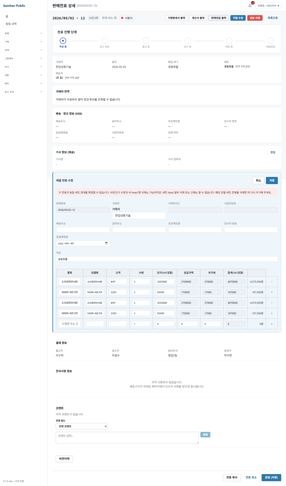
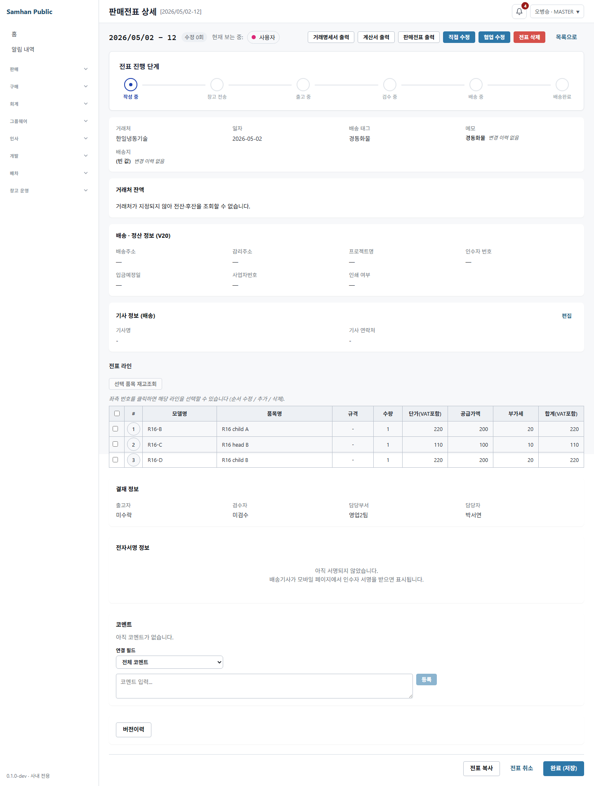

# #1131 R16 — keyless 0-head 계보 결함 중단 보고

## 결론

**중단**한다. R16의 불변식 1과 `PartnerProductPriceMemoryIT` 30/30 무수정 보존 조건이 현재
정본 테스트가 요구하는 동작과 충돌한다. 임의로 가격기억 IT의 기대값을 바꾸거나, 0-head를
다시 저장하는 예외를 추가하지 않았다.

## RED-A 원문과 후보 수정 결과

R15와 같은 duplicate-signature keyless 4행 `[head-A, child-A, head-B, child-B]`에서 첫 head
lineId만 빼고 저장하는 새 RED는 후보 수정 전 다음처럼 실패했다.

```text
SalesSlipUpdateR5FixTest > R16 RED-A: duplicate-signature keyless 계보에서 첫 head만 삭제하면 저장 전 거부한다 FAILED
java.lang.AssertionError
```

실행 명령:

```powershell
.\gradlew.bat :services:slip-service:test `
  --tests "com.samhanair.logis.slip.service.SalesSlipUpdateR5FixTest.ambiguousKeylessMultiInstanceRejectsFirstHeadOnlyDeletion" `
  --rerun-tasks --no-daemon --console=plain
```

후보 수정에서는 첫·둘째 head 단독 삭제 RED가 통과했다. 후보 방식은 duplicate keyless parent가
남아 있으면 원래 head ID들이 같은 품목으로 모두 남아야 한다고 검증하고, parent 전체를 없앤
경우만 정상 정리로 허용하는 것이었다. keyed 경로는 남는 child를 평면화하지 않고 저장하던
기존 우회를 0-head로 판정했다.

## 0-head 경로 전수표 (현행 HEAD 기준)

`O`는 0-head 계보를 새로 저장하지 못하게 막거나, 인스턴스 자체를 제거하는 정상 경로다.
`X`는 저장 가능하거나 현행 정본 테스트가 그 저장을 요구하는 경로다.

| 경로 | keyed | duplicate keyless | 근거 |
|---|---|---|---|
| head 행만 삭제 | O (Sales) / **X (Estimate)** | **X** | Sales `requireSingleHead...`는 keyed만 검사, Estimate는 해당 검사 미호출 |
| head 수량 0 | O | O | 입력 수량 양수 검증이 저장 전 거부 |
| head를 다른 품목으로 교체 | **X** | **X** | 교체 head를 평면화하고 child의 `parentSetModel`을 보존 |
| 인스턴스 전체 삭제 | O | O | 남는 구성품이 없으면 0-head 계보가 아니라 인스턴스 제거 |
| non-head 삭제 | O | O | head가 남아 계보가 유지됨 |

특히 `PartnerProductPriceMemoryIT`는 X를 단순 우연이 아니라 계약으로 검증한다.

```text
bundleHeadProductSwappedToUnrelatedItem_dropsLineageAndRemembersUserPrice
  기대 DB: swapped head = 평면, 남은 child = set_head=false / parent_set_model="SET-809"

bundleEstimateHeadDeletedAndStandaloneRepriced_staysPlainAndRemembersLatestPrice
  기대 DB: head 미전송 뒤 남은 component = set_head=false / parent_set_model="SET-809"
```

두 기대 DB 상태는 R16이 말한 0-head 계보다. 따라서 이 IT를 수정하지 않고 30/30을 유지한 채
head 교체·삭제 경로까지 불변식 1을 적용하는 것은 불가능하다.

## 전체 slip-service 강제 실행

```powershell
.\gradlew.bat :services:slip-service:test --rerun-tasks --no-daemon --console=plain
```

```text
1825 tests completed, 3 failed
BUILD FAILED in 10m 42s
```

후보 0-head 방어와 직접 충돌한 실패 2건:

```text
PartnerProductPriceMemoryIT > bundleHeadProductSwappedToUnrelatedItem_dropsLineageAndRemembersUserPrice() FAILED
PartnerProductPriceMemoryIT > bundleEstimateHeadDeletedAndStandaloneRepriced_staysPlainAndRemembersLatestPrice() FAILED
```

세 번째 실패는 이번 계보 변경과 무관한 기존 DB 제약 실패다.

```text
SlipPartnerLedgerInternalControllerIT > filtersByBusinessPartnerCodeAndDateWithoutChangingExistingContract() FAILED
org.springframework.dao.DataIntegrityViolationException
```

따라서 이번 실행의 `PartnerProductPriceMemoryIT`은 28/30이며, R16이 요구한 전체 1,822/1,822 및
30/30 조건을 만족했다고 보고할 수 없다.

후보 코드는 중단 조건에 따라 제거했다. 제거 후 원본 클래스만 다시 강제 실행한 XML 결과는
`tests=30, failures=0, errors=0` (`BUILD SUCCESSFUL`, 1m 7s)으로 원래 계약이 30/30임을 재확인했다.

## 화면 QA (후보 UI)

공유 DB 쓰기 없이 `clients/desktop`에서 Playwright 1.59.1, headless Chromium-1217로 R15와 같은
route mock을 사용했다. duplicate keyless 4행 응답에서 경고와 첫·셋째(head) 삭제 비활성,
둘째(non-head) 삭제 활성 상태를 확인했다.

```text
R16_UI|duplicateSignature=keyless|warning=visible|headDelete=disabled|nonHeadDelete=enabled
1 passed (2.2s)
```



이 화면 후보도 위 계약 충돌을 해결하지 못하므로 제품 변경으로 확정하지 않았다.

## PM 판단 필요

다음 둘 중 하나를 명시해야 한다.

1. **불변식 1 우선**: head 교체·삭제 때 child를 평면화/재head화/거부하도록 바꾸고,
   `PartnerProductPriceMemoryIT`의 현재 2개 0-head 기대값을 새 계약에 맞게 변경한다.
2. **기존 가격기억 계약 우선**: `PartnerProductPriceMemoryIT` 30/30을 보존하고, R16 불변식의
   적용 범위를 R15의 duplicate-signature keyless head 단독 삭제로 한정한다.

본인은 데이터 계보 불변식의 문구대로라면 **1번**을 권고한다. 다만 개발책임자 지시인
`PartnerProductPriceMemoryIT 수정 금지`와 충돌하므로, 이 보고만으로 방향을 바꾸지 않는다.

---

## PM 수정 설계 (b) 적용

개발책임자가 정정한 기준을 적용했다. R16의 대상은 `PUT /slips/{id}/sales`에서 **keyless이고
동일 signature가 중복된 다중 인스턴스**의 원본 head ID 하나가 요청에서 빠지는 경우다.
이 경우 child의 실제 소속 경계를 snapshot으로 증명할 수 없으므로, 남아 있는 그 parent의
행 전부를 `SlipLine.clearBundleComponent()`로 평면화한다. 삭제를 거부하거나 keyless 상태를
없애지 않는다.

`EstimateService`는 변경하지 않았다. `PartnerProductPriceMemoryIT`의
`bundleEstimateHeadDeletedAndStandaloneRepriced_staysPlainAndRemembersLatestPrice`가 견적의
기존 head-삭제 계보 계약을 정본으로 고정하고 있기 때문이다. 이번 HIGH의 직접 경로는 매출
direct PUT이며, 견적 계약을 넓혀 바꾸면 PM이 금지한 30/30 계약을 다시 침범한다.

### 기존 lineage-drop 의미론과 가격기억

기존 `flattenHeadProductReplacements`는 무관 품목으로 바뀐 head 한 행에
`clearBundleComponent()`를 적용한다. 이 메서드는 `parentSetModel`, `setHead`,
`bundleSetOptions`만 null/false로 만들며 수량·단가·공급가·VAT를 바꾸지 않는다.

새 `flattenAmbiguousLegacyLineageAfterHeadDeletion`도 같은 메서드를 같은 위치(가격기억 수집
직전)에 적용한다. 따라서 평면화된 행은 `collectPriceMemory`의 BUNDLE 제외 조건을 지나
일반 라인과 같은 가격기억 후보가 된다. 품목 교체 경로는 원본 head ID가 남아 있으므로 새
분기에 들어가지 않고 기존처럼 교체 head 한 행만 평면화한다.

### RED-A 현행 원문과 정정

처음 단위 목은 DB가 첫 replace 후 새 line ID를 부여하는 동작을 흉내 내지 않아, 두 번째 요청에서
아래 400을 냈다.

```text
BusinessException: lineId 는 현재 전표의 활성 라인에서 중복 없이 지정해야 합니다
at SalesSlipUpdateService.validateLineIds(SalesSlipUpdateService.java:233)
```

이는 삭제 결함이 아니라 목이 삭제 전 lineId를 재사용한 탓이었다. save 목이 실제 DB처럼 새 ID를
부여하고 상세 응답의 새 ID로 두 번째 요청을 만들면, **현행도** 첫 head 삭제 200과 후속 수량 편집
200을 반환했다. 개발책임자가 요청한 “현행 후속 편집 400”은 이 저장소의 R15 SOL 원문에도 없으며
본 재현에서도 성립하지 않았다. 다만 다음 RED가 현행에서 실패했다.

```text
Expecting all elements of [3 retained lines] to match predicate
line.getParentSetModel() == null && !line.isSetHead() && line.getBundleSetOptions() == null
```

즉 현행은 `[head-A, child-A, head-B, child-B]`에서 `head-A`만 삭제한 200 저장 뒤에도
`[child-A, head-B, child-B]`를 BUNDLE 계보로 그대로 남겼다. R16 수정 뒤 동일 RED는 첫 저장,
새 lineId 기반 후속 수량 편집, 그리고 3행 전부 평면 상태를 함께 통과한다.

### 0-head/깨진 계보 경로 전수표

`O` = 깨진 계보를 남기지 않음, `X` = 기존 정본 계약으로 남는 상태(이번 변경 범위 밖).

| 경로 | keyed Sales | keyless duplicate Sales | 견적 기존 계약 | 처리/근거 |
|---|---|---|---|---|
| head 한 행 삭제 | O: `INVALID_INPUT` 차단 | **O: 남은 parent 전부 평면화, 200** | X | keyed guard 유지, R16 신규 평면화 |
| head 수량 0 | O: 422 | O: 422 | O | `validateLines` 양수 검증 |
| head를 무관 품목으로 교체 | O: 교체 행만 평면화 | O: 교체 행만 평면화 | X | 기존 `flattenHeadProductReplacements`, 가격기억 계약 보존 |
| 인스턴스 전체 삭제 | O: 인스턴스 소멸, 200 | O: 인스턴스 소멸, 200 | O | retained 행 없음 |
| non-head 삭제 | O: head 유지, 200 | O: head 유지, 200 | O | 기존 회귀 유지 |
| 3개 인스턴스 중 head 하나 삭제 | O: 해당 keyed 인스턴스 거부 | **O: 남은 5행 전부 평면화, 200** | X | R16 신규 조합 RED |

견적의 X는 PM이 명시한 “계보를 떼는 것은 정상” 및 `PartnerProductPriceMemoryIT`의 기존
head-삭제/품목교체 계약을 뜻한다. 이번 수정은 이를 차단하거나 바꾸지 않는다.

### 선택 수단과 화면 안내

선택 수단은 버튼 비활성화·경고가 아니라 **서버에서 정상 lineage-drop**이다. keyless duplicate는
어느 child가 지워진 head의 child인지 증명할 수 없으므로, 일부만 보존하거나 새 key를 만들어
재귀속하지 않는다. 버튼은 계속 노출되고 삭제·저장·다음 편집 모두 성공하므로 사용자를
막다른 길에 가두지 않는다. 별도 경고는 “삭제 불가”라는 잘못된 안내가 되므로 추가하지 않았다.

### RED/조합 테스트

`SalesSlipUpdateR5FixTest`에 다음 RED를 추가했다.

| 조합 | 결과 |
|---|---|
| keyless 2인스턴스 head 삭제 → 새 ID 후속 수량 편집 | 200, 3행 모두 평면 |
| keyless 3인스턴스 중 head 하나 삭제 | 200, 남은 5행 모두 평면 |
| keyed head 삭제 | 기존 `existingHeadDeletionIsStillRejected` 422 |
| non-head 삭제 | 기존 200 |
| keyed 인스턴스 전체 삭제 | 기존 200 |
| head 품목 교체 | 기존 교체 head만 평면 + 가격기억 계약 |
| head 수량 0 | 기존 422 |

선별 강제 실행:

```powershell
.\gradlew.bat :services:slip-service:test --tests "com.samhanair.logis.slip.service.SalesSlipUpdateR5FixTest" --tests "com.samhanair.logis.slip.it.PartnerProductPriceMemoryIT" --tests "com.samhanair.logis.slip.service.BundleSetInstanceKeyPolicyTest" --tests "com.samhanair.logis.slip.it.SlipRevisionRestoreIT" --tests "com.samhanair.logis.slip.estimate.service.EstimateBundleInstanceKeyTest" --tests "com.samhanair.logis.slip.estimate.revision.service.EstimateRestoreTest" --rerun-tasks --no-daemon --console=plain
```

```text
BUILD SUCCESSFUL in 1m 20s
```

이는 R10 키 materialization/정상 견적, R13 교차 배치 signature 매칭, R14 duplicate keyless
복원·편집, `PartnerProductPriceMemoryIT` 30/30을 같은 실행에 포함한다. 전체 suite 결과는 아래
최종 실행 절에 기록한다.

### Desktop Playwright 라이브 QA

`clients/desktop`에서 Playwright 1.59.1 headless `chromium-1217`로, 공유 DB 없이 R15와 같은
in-process route mock을 일시 적용해 실행했다. 4행 keyless duplicate 화면에서 첫 head의 `×`를
직접 누르고 저장한 뒤, 3개의 평면 행을 다시 열어 수량을 3으로 수정·저장했다.

```text
R16_UI|keylessHeadDelete=HTTP200|lineage=flattened|followupEdit=HTTP200|chromium=1217
1 passed (3.0s)
```

임시 mock·Playwright test·Vite 서버는 즉시 제거했고 스크린샷만 보존했다.



### V119·전체 slip-service 최종 실행

V119의 대상 preflight는 기존 `SlipSalesUpdateIT.testR9MigratedKeylessMultiInstancePositiveEdit`에서
fresh IT DB로 재실행됐다. migration이 요구하는 대상은 `AC060CS6PBH1SY`의 **8행·head 2·서로
다른 품목 4**이고, 적용 뒤 instanceKey 2개·첫 head 수량 편집 200을 확인한다. 공유 DB write는
금지되어 있으므로 전표 전체 공급가 **4,729,797원**, VAT **472,980원**은 이번 실행에서 다시
변경·재작성하지 않았고, SOL R15가 구분한 전표 전체 수치로 보존한다.

최종 소스(가격기억 RED 포함)에서 다음을 새 JVM으로 전수 실행했다.

```powershell
.\gradlew.bat :services:slip-service:test --rerun-tasks --no-daemon --console=plain
```

Gradle worker 종료 후 XML 252 suite를 독립 합산했다.

```text
tests=1,824, failures=0, errors=0, skipped=0
PartnerProductPriceMemoryIT=30/30 (failures=0, errors=0)
```

직전 기준 1,822에서 1,824가 된 것은 이 보고서의 R16 RED 두 건 추가 때문이다.
`git diff --check`도 통과했다. git 조작·commit·공유 DB write·배포는 수행하지 않았다.
