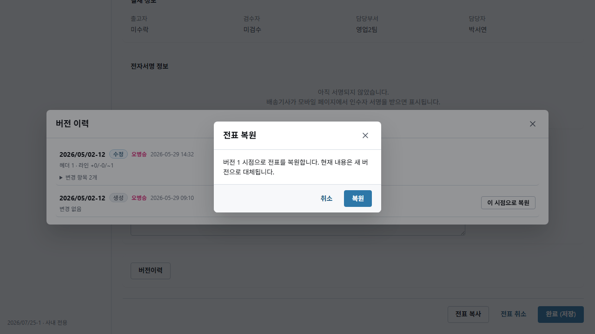
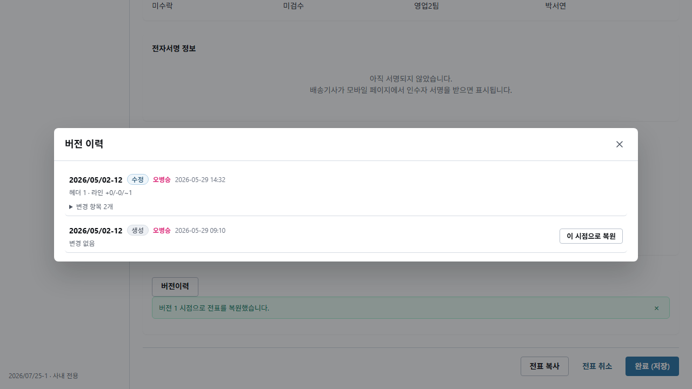
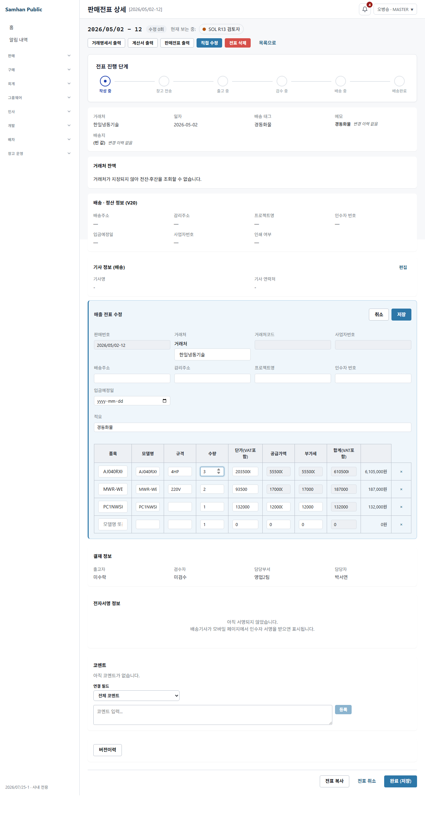
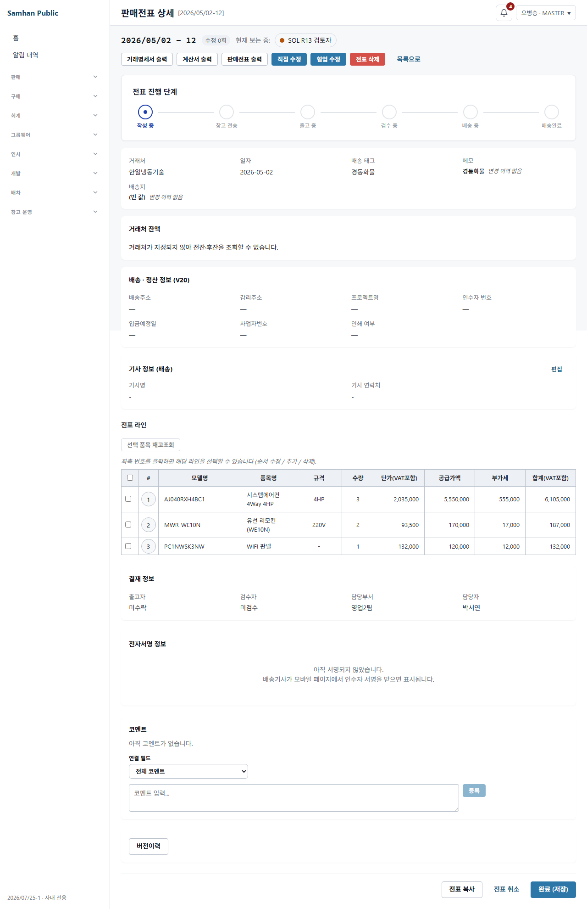

# PR #1131 · SOL 5.6 R13 재검토 — revision 복원 키 승격

## 판정

**머지 차단 제품 결함 1건(HIGH).**

TERRA의 R12 수정은 R11에서 확인한 일반적인 legacy 다중 인스턴스 복원 실패를 닫았다.
정상적인 연속 행 revision은 실제 화면의 `복원` 버튼으로 복원되고, 같은 전표를 이어서
직접 수정해 HTTP 200으로 저장됐다. 복원 기능 자체를 금지하는 식으로 해결하지 않았다.

그러나 새 공통 정책은 같은 `parentSetModel`의 keyless head가 둘 이상이면
**현재 snapshot 행 순서에서 head부터 다음 같은 parent의 head 직전까지**를 한 인스턴스로
추정한다. Desktop의 정상 라인 드래그는 개별 행을 자유롭게 `arrayMove`하며, Slip은
영속 컬렉션 순서를 고정하는 `@OrderBy`도 없다. 따라서 유효한 과거 revision이
`head-A, head-B, child-A, child-B` 순서이면 복원은 성공하지만 `child-A`를 B의 새 키로
묶는다. 사용자가 요청한 “그때 그 전표”와 다른 계보가 현재 전표에 저장된다.

이 결함은 기존 R12 green 조합이 다룬 `head-A, child-A, ..., head-B, child-B, ...` 연속
배열에는 나타나지 않는다. 보정 probe에서 실제 결과와 기대 결과는 다음과 같았다.

```text
actual   = [[head-A], [head-B, child-A, child-B]]
expected = [[head-A, child-A], [head-B, child-B]]
```

따라서 PM 머지 판단은 **보류**가 맞다.

## 1. 재검토 기준

- 워크트리: `C:\dev\Samhan-Public\.claude\worktrees\w1131`
- 검토 HEAD: `485b49d0597f7ed311b53e8d95045029a8747122`
- R11 기준 parent: `8dc1e1ce`
- 2026-08-11 재조회 원격 main: `0ced104f2f5f8dfa9ac7e6136e3098f7e5da0f1a`
- 공유 DB: 접근·쓰기하지 않음
- git 조작: commit, checkout, reset, merge, push 등 수행하지 않음
- 임시 JUnit/Playwright probe 소스는 실행 뒤 삭제했으며, 최종 산출물은 본 보고서와
  `docs/qa/2026-08-11-1131-r13/`의 PNG 4개뿐이다.

## 2. 결함 — 행 순서 추정이 legacy 인스턴스 계보를 바꾼다

### 2.1 깨지는 불변식

```text
revision 복원이 HTTP 200을 반환하면:
1. 과거 snapshot의 모든 업무 값과 계보가 그대로 복원돼야 한다.
2. 허용되는 정규화는 기존 instanceKey 보존 또는, 경계가 증명된 keyless 인스턴스에
   안정 키를 추가하는 것뿐이다.
3. 새 키 추가가 어떤 child가 어느 head에 속하는지를 바꾸면 안 된다.
4. 경계를 증명할 수 없으면 현재 문서를 일부 변경한 뒤 추정해 저장하지 말고,
   mutation 전에 원자적으로 거부해야 한다.
```

### 2.2 결함 좌표 전수

1. `services/slip-service/src/main/java/com/samhanair/logis/slip/service/BundleSetInstanceKeyPolicy.java:53-87`
   - `keylessHeadCounts`는 parent별 head 수만 센다.
   - 두 번째 루프는 같은 parent의 head를 만날 때마다 `activeKeys[parent]`를 교체한다.
   - 이후 child의 원래 옵션/구성 관계를 보지 않고 현재 active key를 부여한다.
2. `services/slip-service/src/main/java/com/samhanair/logis/slip/domain/Slip.java:2270-2313`
   - `restoreFromSnapshot`이 위 반환 배열을 그대로 현재 `SlipLine` 계보로 저장한다.
3. `services/slip-service/src/main/java/com/samhanair/logis/slip/estimate/domain/Estimate.java:541-590`
   - Estimate 복원도 같은 정책의 반환 배열을 그대로 사용한다.
4. `clients/desktop/src/renderer/routes/SlipFormPage.tsx:1705-1714`
   - drag end가 한 행 단위 `arrayMove(ls, oldIdx, newIdx)`다.
5. `clients/desktop/src/renderer/routes/SlipFormPage.tsx:2521-2594`
   - 모든 라인이 하나의 `SortableContext`에 들어가며 BUNDLE 인스턴스 단위 이동 가드가 없다.
6. `services/slip-service/src/main/java/com/samhanair/logis/slip/domain/Slip.java:652-654`
   - Slip의 `List<SlipLine>`에 `@OrderBy`가 없다.
7. `services/slip-service/src/main/java/com/samhanair/logis/slip/estimate/domain/Estimate.java:157-160`
   - Estimate는 `@OrderBy("lineNo ASC, id ASC")`라서 사용자가 저장한 교차 순서가
     revision 입력으로 안정적으로 재현될 수 있다.

### 2.3 최소 재현 데이터

같은 `parentSetModel=SET-SAME`을 가진 두 legacy 인스턴스를 사용했다.

| 행 | head | 기존 비-key 옵션 | 원래 인스턴스 |
|---|---:|---|---|
| `head-A` | true | `remoteOption=REMOTE-A` | A |
| `head-B` | true | `remoteOption=REMOTE-B` | B |
| `child-A` | false | `remoteOption=REMOTE-A` | A |
| `child-B` | false | `remoteOption=REMOTE-B` | B |

snapshot 순서는 `head-A → head-B → child-A → child-B`다. 이 순서는 Desktop에서
`child-A` 행을 `head-B` 뒤로 드래그하면 정상 경로로 만들 수 있다.

임시 JUnit 보정 probe가 `materializeLegacyMultiInstanceKeys`를 직접 호출해 인스턴스별
모델 목록을 단언했다. 원문:

```text
BundleSetInstanceKeyPolicyR13ProbeTest
expected: [["head-A", "child-A"], ["head-B", "child-B"]]
 but was: [["head-A"], ["head-B", "child-A", "child-B"]]
1 test completed, 1 failed
Execution failed for task ':services:slip-service:test'.
```

probe는 정책 자체에서 RED가 났다. 이 정책은 Slip과 Estimate 복원에서 추가 판단 없이
호출되므로 두 도메인 모두 같은 오배정에 도달한다.

### 2.4 실제 데이터가 무엇이 달라지는가

`withInstanceKey`는 기존 다섯 옵션
`remoteOption/remoteExcluded/panelOption/panelShape360/materialIncluded`를 복사하고
`instanceKey`만 추가한다. 따라서 표면적인 옵션 문자열·금액·수량은 즉시 바뀌지 않는다.

하지만 `instanceKey`가 이후 편집·삭제에서 인스턴스 경계를 정의한다. 위 재현에서
`child-A`의 옵션 값은 A인 채 **B head의 key**를 받는다. 그 결과 다음 편집에서:

- A head는 구성품이 없는 인스턴스로 해석될 수 있다.
- B head 삭제/전체삭제가 A child까지 함께 겨냥할 수 있다.
- 수량·구성품 완전성 검증과 계보 기반 가격기억이 원래 revision과 다른 인스턴스를 본다.

즉 “다섯 옵션을 보존했으니 데이터 보존”이 아니다. 새 키가 잘못되면 사용자가
“복원했는데 그때 그 전표가 아니다”를 겪는다.

### 2.5 사용자 도달 경로

1. 동일 BUNDLE을 두 번 담은 keyless 구 견적/전표를 연다.
2. 개별 행 drag-and-drop으로 두 인스턴스 행을 교차 배치하고 revision을 남긴다.
3. 판매전표 상세의 `버전이력 → 이 시점으로 복원 → 복원`을 누른다.
4. 서버는 200을 반환하지만 교차 child에 잘못된 새 `instanceKey`를 저장한다.
5. 후속 직접 수정/삭제가 원래와 다른 묶음을 대상으로 동작하거나 검증에 걸린다.

## 3. “두 곳에 복붙하지 않았다” 확인

이 보고는 사실이다.

- 공통 정의는 `BundleSetInstanceKeyPolicy` 한 곳이다.
- 신규 생성:
  - `SlipService.java:214`
  - `EstimateService.java:141`
  - `MobileQuotationService.java:162`
  - 모두 `BundleSetInstanceKeyPolicy.ensure` 호출
- legacy 복원:
  - `Slip.java:2280-2283`
  - `Estimate.java:545-548`
  - 모두 `materializeLegacyMultiInstanceKeys` 호출
- 기존 lineage 승격:
  - `BundleLineageResolver.java:261`
  - 공통 `withInstanceKey` 호출

따라서 Slip/Estimate에 정책을 복붙한 결함은 없다. 생성과 복원은 같은 클래스 및
`withInstanceKey`의 “다섯 옵션 보존 + 키만 추가”를 공유한다.

다만 생성의 `ensure`는 새 BUNDLE 전개 경계를 이미 알고 있는 반면, 복원의
`materializeLegacyMultiInstanceKeys`는 경계를 행 순서로 **추정**한다. 이 추가 규칙이
생성 경로에는 없으며, 바로 이번 HIGH 결함의 원인이다. “공통 클래스”라는 구조적 통합이
“같은 안전성”을 자동 보장하지 않는다.

## 4. R11 C — 기존 가격기억 계보 계약 확인

### 4.1 기존 IT를 green에 맞춰 바꾸지 않았다

`services/slip-service/src/test/java/com/samhanair/logis/slip/it/PartnerProductPriceMemoryIT.java`는
`8dc1e1ce..485b49d05` diff에 없다.

기존 `bundleHeadProductSwappedToUnrelatedItem_dropsLineageAndRemembersUserPrice`
(`:1397-1451`)가 원래 지키던 것은 다음 두 가지이며 현재도 그대로다.

1. 바꾼 head 한 행만 `parentSetModel=null`인 평면 단품이 되고, 사용자 단가
   150,000원의 VAT 포함 최근가격 165,000원이 기억된다.
2. 건드리지 않은 진짜 구성품은 `parentSetModel=SET-809`를 유지하고, 그 배분 단가는
   개별 품목 최근가격으로 기억되지 않는다.

새 제품 코드는 `BundleLineageResolver.flattenHeadProductReplacements`
(`:212-240`)에서 “바뀐 head가 속한 인스턴스 전체”가 아니라 실제 바뀐 head line id만
`clearBundleComponent` 한다.

### 4.2 변경된 테스트 흔적

관련 단위 테스트 `SalesSlipUpdateR5FixTest.java`의 기대는 변경됐다. 기존 신규 단위 테스트가
인스턴스 전체 평면화라는 잘못된 R10 동작을 고정하고 있었기 때문이다. TERRA는 이를
“교체 행만 평면화, 잔존 child 계보 보존”으로 바꿨다.

즉 **테스트 변경 흔적은 있으나**, 빨개진 기존 PostgreSQL
`PartnerProductPriceMemoryIT`를 완화한 것은 아니다. 오히려 제품 코드와 좁은 단위 테스트를
변경하지 않은 기존 IT 계약에 다시 맞췄다. 새 실행에서도 해당 IT 30/30이 통과했다.

## 5. 나머지 R11 수정 확인

### 5.1 SlipSalesUpdateIT SQL

`COUNT(*) AS heads`를
`COUNT(*) FILTER (WHERE COALESCE(l.set_head, false)) AS heads`로 바꿨다.
기대값 `isZero()`는 유지됐다. V119 preflight와 같은 head 관측이며 테스트 SQL 오류만
고친 것이 맞다.

### 5.2 Desktop 타입·mock gate

- 공유 design-system `BundleSetOptions`에 optional `instanceKey`가 추가됐다.
- live credential/API probe만 mock gate에서 제외됐다.
- R2/R3 mock 기본 포트는 공용 Vite `5173`으로 맞춰졌다.
- collab 테스트는 보이는 autocomplete와 숨은 CRDT binding의 실제 계약을 분리해 검사한다.

새 `npm run typecheck`와 real-QA scope 테스트가 모두 통과했다.

### 5.3 QA 증거 보존

- TERRA 커밋 `8dc1e1ce..485b49d05`의 `docs/qa` diff: **0건**
- PR 전체 `origin/main...HEAD`의 `docs/qa` diff: 추가(`A`)만 존재
- 삭제(`D`), 이름변경(`R`), 이동: **0건**
- 6개 writer는 기존 확정 경로 문자열을 유지하고 `resolveQaShotsDir`로 감쌌다.
- 하네스 가드 fresh 실행: **62 passed / 0 failed**

기존 R1~R10 QA 증거가 옮겨지거나 지워진 흔적은 없다.

## 6. Flyway와 RED-B 보존

2026-08-11 재조회 시 main은 검토 시작 뒤에도 `0ced104f2...`까지 이동했지만:

```text
remote main slip-service migrations = 79
remote main numeric max            = V118
PR branch numeric max              = V119
PR branch V119 files               = 1
```

따라서 현재도 V119는 main 최대값+1이고 번호 충돌은 없다.

R10의 이관 대상과 금액 불변은 TERRA 커밋에서 migration 및 기존 QA 증거를 건드리지 않아
유지된다.

- V119 대상: 8행, head 2, 제품 4종
- 전표 전체: 공급가 4,729,797원, VAT 472,980원
- 수량 0: HTTP 422
- 비-head 삭제: HTTP 200
- 인스턴스 전체삭제: HTTP 200

fresh `SlipSalesUpdateIT` 14/14가 V119 적용 후 head 집계와 후속 편집 계약을 통과했다.
다만 배포 backend에는 아직 V119가 없고 공유 DB write가 금지돼 있으므로, 위 수치의
배포 환경 재확인은 **배포 후 확인** 축으로 남긴다. 이를 결함 0 근거로 사용하지 않았다.

## 7. 직접 Playwright 라이브 QA

### 7.1 실행 경계

- 위치: `clients/desktop`
- Playwright: 1.59.1
- 브라우저: headless Chromium, 설치 revision `chromium-1217`
- 최종 명령:

```powershell
$env:QA_SHOTS_DIR='C:\dev\Samhan-Public\.claude\worktrees\w1131\docs\qa\2026-08-11-1131-r13'
$env:QA_ALLOW_OVERWRITE='1'
npx playwright test playwright/1131-r13-sol-review/1131-r13-ui.spec.ts --project=chromium --reporter=line
```

최종 원문:

```text
Running 1 test using 1 worker
[chromium] 실제 복원 버튼을 눌러 복원한 뒤 직접 수정 수량 저장까지 도달한다
1 passed (5.4s)
```

HEAD Desktop 화면의 실제 DOM control을 눌렀다.

```text
버전이력 열기
→ revision 1 “이 시점으로 복원”
→ “전표 복원” 확인창의 “복원”
→ “버전 1 시점으로 전표를 복원했습니다” toast
→ 버전 이력 닫기
→ “직접 수정”
→ 첫 수량 2 → 3
→ 저장 PUT HTTP 200
→ 편집 modal 종료 및 상세 수량 3
```

### 7.2 중요한 한계

배포 backend에는 V119와 본 branch restore 정책이 없으므로 backend restore/save 응답은
mock API 경계로 격리했다. 따라서 이 실행은 **실제 HEAD 화면 버튼/상태 전이/UI 후속 편집
도달성**의 증거이지, 배포 backend가 수정됐다는 증거가 아니다.

backend 제품 코드는 별도로 Testcontainers PostgreSQL을 사용하는 4개 테스트 클래스
70/70으로 확인했다. 공유 DB에는 쓰지 않았다.

### 7.3 probe 작성 중 실패 원문과 판정

최종 통과 전에 하네스 자체의 누락을 세 번 바로잡았다. 제품 실패로 숨기지 않기 위해
원문을 남긴다.

1. PUT stub을 처음 넣기 전:

```text
unmocked PUT /slips/slip-005/sales → gateway 401
화면이 login으로 이동, 후속 edit-button visible 단언 실패
```

2. full-page 캡처가 확인 버튼 클릭 시간을 소진:

```text
Test timeout of 60000ms exceeded.
locator.click waiting for getByTestId('slip-version-history-restore-confirm')
```

3. 복원 성공 후 버전 이력 모달을 닫지 않고 배경 edit를 누른 probe:

```text
Test timeout of 120000ms exceeded.
<div data-testid="ds-modal-backdrop"> intercepts pointer events
waiting for getByTestId('sales-slip-edit-button')
```

세 번째 캡처에는 성공 toast와 열린 버전 이력 모달이 함께 보였다. 실제 사용자 순서대로
`닫기`를 추가한 최종 실행은 5.4초에 통과했다. 세 실패 모두 제품 복원 400/편집 400이
아니라 probe의 API 경계·캡처·모달 조작 누락이었다.

### 7.4 증거









## 8. fresh 검증 결과

| 검증 | 결과 |
|---|---|
| 보정 정책 probe — 교차 배열 | **1 failed**, actual `[[A-head], [B-head,A-child,B-child]]` |
| `SlipRevisionRestoreIT` | 18/18 |
| `EstimateRestoreTest` | 8/8 |
| `SlipSalesUpdateIT` | 14/14 |
| `PartnerProductPriceMemoryIT` | 30/30 |
| 위 4개 Gradle 합계 | **70/70, BUILD SUCCESSFUL, 1m 2s** |
| Desktop `npm run typecheck` | exit 0 |
| Desktop real-QA scope | 50/50 |
| 하네스 거짓 green 가드 | **62/62** |
| R13 실제 UI Playwright | **1/1, Chromium 1217, 5.4s** |
| PR checks | **51 SUCCESS, 1 GitGuardian NEUTRAL, 실패 0** |

기존 테스트 green은 연속 행 fixture의 정상 복원과 R11 수정들을 증명한다. 교차 배열
보정 probe RED를 반증하지 않는다.

## 9. 구현자 지시서

이번 라운드에서 구현하지 않는다. 다음 구현자는 아래 계약을 먼저 테스트로 고정해야 한다.

### 9.1 수정 불변식

1. 복원은 revision의 header, line 순서, 수량, 금액, 비-key 옵션, 계보를 보존한다.
2. 이미 있는 `instanceKey`는 byte-for-byte 보존한다.
3. keyless 다중 인스턴스는 **원래 경계를 증명할 수 있을 때만** 인스턴스별 새 키를 부여한다.
4. 행 순서만으로 child 소속을 추정하지 않는다.
5. 증명할 수 없는 조합은 mutation 전 원자적으로 거부하고 현재 header/line/revision 수를
   모두 보존한다. 모든 legacy 복원을 일괄 금지해서는 안 된다.
6. Slip, Estimate, 시스템/협업 restore entrypoint가 같은 판정을 사용한다.
7. 생성 `ensure`, 기존 lineage 승격, restore materialization은 다섯 비-key 옵션 보존과
   key 보존/생성 규칙을 계속 한 공통 정책에서 사용한다.

서로 다른 비-key 옵션 signature가 원래 소속을 증명한다면 그 signature로 A/B를 정확히
묶을 수 있다. 그러나 동일 parent·동일 옵션·동일 제품 조합이 교차된 경우에는 snapshot만으로
원래 경계를 증명하지 못할 수 있다. 그 조합을 순서로 추정하지 말고, 신뢰 가능한 별도
증거가 없다면 그 revision만 명시적으로 거부해야 한다.

### 9.2 RED-A — 반드시 새로 고정할 표적

1. Slip: `head-A, head-B, child-A, child-B`, 동일 parent·서로 다른 옵션
   - 복원 200
   - A key는 head-A/child-A에만, B key는 head-B/child-B에만 존재
   - 다섯 옵션·금액·수량·행 순서 보존
   - 복원 뒤 수량 편집 HTTP 200
2. Estimate 대칭 조합
   - 복원 뒤 편집 200
   - 전표 전환 200
   - 변환 전표에서도 두 key와 소속 보존
3. 이미 keyed revision
   - 모든 기존 key 정확히 보존
4. 단일 keyless 정상 revision
   - 이전과 같은 복원 성공/내용 보존
5. 연속 배열의 동일 parent 다중 keyless 정상 revision
   - 정상 복원과 후속 편집 200 유지

### 9.3 RED-B — 잃으면 안 되는 구체적 표적

1. R10 생성: 정상 견적 화면이 동일 BUNDLE 두 인스턴스를 keyless로 재생성하지 않는다.
2. V119: 8행, head 2, 제품 4종, 공급가 4,729,797원, VAT 472,980원 유지.
3. 판매전표: 수량 0은 422, 비-head 삭제는 200, 인스턴스 전체삭제는 200.
4. 가격기억: 바꾼 head만 평면화, 건드리지 않은 child는 `SET-809` 계보 유지,
   교체 단품 가격만 기억.
5. QA: 기존 `docs/qa` 확정 PNG 삭제/이동/덮어쓰기 0.
6. Flyway: merge 직전 main max를 다시 세어 V119=max+1.
7. 모호한 동일 parent·동일 옵션 교차 배열:
   - 복원 명시 실패
   - 현재 header/lines/modifiedAt/revision count 모두 불변
   - 다음 정상 편집은 계속 가능

### 9.4 새 조합 전수

- 같은 parent, 다른 옵션: `head-A, head-B, child-A, child-B`
- 같은 parent, 같은 옵션: 동일 교차 배열
- keyed + keyless 혼합
- 서로 다른 parent가 중간에 끼는 배열
- child가 첫 head보다 앞선 배열
- head가 없는 legacy child만의 배열
- 세 head 이상 및 각 인스턴스 구성품 수가 다른 배열
- Slip 로딩 시 DB 반환 순서가 달라진 배열
- Estimate `lineNo` drag reorder 배열
- 복원 직후 수량 변경, 비-head 삭제, 전체 인스턴스 삭제
- 시스템/협업 restore 후 direct edit

### 9.5 중단 조건

**제 전제가 틀렸다면 고치지 말고 중단·보고하십시오.**

구체적으로 다음 중 하나를 코드·DB 제약·제품 결정문으로 증명할 수 있다면 임의 구현하지
말고 PM에게 근거를 제출해야 한다.

- BUNDLE 인스턴스 행은 UI/API/영속층에서 항상 연속이라는 강제 불변식이 이미 있다.
- revision snapshot에 행 순서 외의 신뢰 가능한 원래 인스턴스 경계 정보가 있다.
- 잘못 부여된 key가 후속 편집·삭제·가격기억에서 계보로 사용되지 않는다.

현재 확인한 `arrayMove`, 전체 `SortableContext`, Slip의 `@OrderBy` 부재,
`instanceKey` 기반 resolver는 위 세 전제를 지지하지 않는다.

## 10. 이 라운드가 보지 않은 표면

- V119가 실제 배포된 backend와 공유 DB를 잇는 종단 간 복원/편집
- 공유 DB의 실제 historical revision 분포와 교차 배열 존재 건수
- 동일 옵션의 모호한 교차 revision에 대해 회사가 채택할 제품 정책
- 모바일 화면의 revision 복원 UI
- 실제 다중 사용자 realtime/협업 중 복원과 곧바로 이어지는 동시 편집
- Desktop 전체 666개 Playwright의 로컬 재실행

배포 backend 축은 명시적으로 **배포 후 확인**이다. 이번 결함 판정은 공유 DB 쓰기나
배포 backend를 결함 0 근거로 사용하지 않고, 공통 정책의 결정적 보정 probe와 사용자
도달 가능한 행 재정렬 코드에 근거한다.
