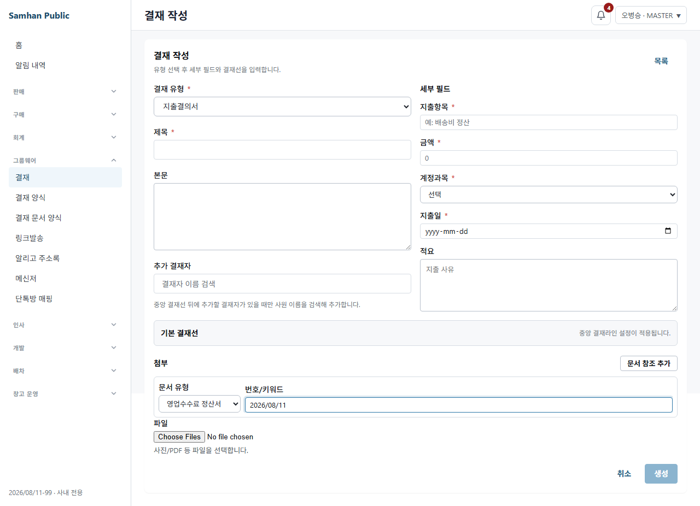

# D-G1 S3 SOL 5.6 코드 검토 — 그룹웨어 지출결의서 참조 첨부 + 역방향 조회

> 대상: PR #1168, HEAD `2642db54bd65cd28ce0a4d76615ccaeec807e47a`  
> 검토일: 2026-08-11  
> 판정: **차단 — 결함 2건**  
> 공유 DB: 조회 전용 transaction만 사용, write 0건  
> git 조작: 없음

## 1. 판정 요약

V19 CHECK 확장, 기존 데이터 포함 migration, 기존 6종 저장, `ref_doc_no` 저장→역조회 왕복,
DRAFT 무번호 차단, 결재 상태 비역전파, 전체 accounting/groupware 테스트 수치는 검증을 통과했다.

그러나 다음 두 결함 때문에 이 라운드는 승인하지 않는다.

1. **[RED-A / 차단] desktop mock 검색 배선이 Axios `config.params`를 잃어 필수 Playwright 흐름이 실패한다.**
   지출결의서 작성 화면에서 정산서 유형까지 선택되지만 `2026/08/11` 검색 결과가 0건으로 남는다.
2. **[RED-B / 사용자 표면] `SLIP_REF`를 직접 해석하는 인쇄·상세 소비자가 신규 정산서 의미를 보존하지 않는다.**
   인쇄는 정산서를 `전표 참조`로 표시하고, 상세의 정산서 번호는 `href="#"`인 죽은 링크가 된다.

## 2. Findings

### F-1 — desktop mock은 `config.params`를 URL에 합치지 않아 정산서 검색 결과를 항상 비운다

심각도: **차단**. 배포 groupware-service에 V19가 없는 현재 검증 조건에서 요구된 desktop
Playwright mock 축 자체가 실패한다.

#### 데이터 흐름과 전수 좌표

- `clients/desktop/src/renderer/api/documentReferenceSearch.ts:84-89`
  - `apiClient.get(path, { params: { q, limit } })`로 검색어를 Axios `config.params`에 둔다.
- `clients/desktop/src/renderer/api/documentReferenceSearch.ts:113-116`
  - 정산서 검색이 `/admin/accounting/sales-commission-settlements/search`를 위 공통 함수로 호출한다.
- `clients/desktop/src/renderer/api/mock.ts:2270-2273`
  - `getMockResponse()`는 `config.url`과 body만 읽고 `config.params`를 URL에 합치지 않는다.
- `clients/desktop/src/renderer/api/mock.ts:4514-4520`
  - accounting 검색 mock은 `new URLSearchParams(url.split('?')[1])`만 읽는다.
  - 따라서 `q === ''`가 되어 4520행에서 `envelope([])`를 즉시 반환한다.
- `clients/desktop/src/renderer/api/mock.ts:4567-4579`
  - 정산서 fixture `2026/08/11-1`은 존재하지만 위 조기 반환 때문에 도달하지 못한다.
- `clients/desktop/src/renderer/components/groupware/DocumentReferencePicker.test.tsx:7-14`
  - 12개 picker 테스트는 `searchByType` 전체를 mock한다. transport/mock adapter 배선을 검증하지 않는다.
- `clients/desktop/src/renderer/components/groupware/DocumentReferencePicker.test.tsx:55-67`
  - 신규 테스트는 select option과 `onChange(refDocType)`만 확인하고 검색 결과를 확인하지 않는다.

#### 재현 데이터와 원문

```text
화면       #/groupware/approvals/new?mockRole=MASTER
결재 유형  지출결의서
문서 유형  SALES_COMMISSION_SETTLEMENT
검색어     2026/08/11
fixture    settlementNo=2026/08/11-1, payoutAmount=1,320,000

Expected   doc-ref-search-option 1건, 2026/08/11-1
Actual     option 0건
Exit       LIVE_QA_EXIT=1
```

```text
Locator: getByTestId('doc-ref-search-option').first()
Expected substring: "2026/08/11-1"
Timeout: 5000ms
Error: element(s) not found
```

실패 캡처:



- 크기: 1280×926, 75,925 bytes
- SHA-256: `662268FB93805B0AB046CE7AA833927C66749F9408BDB88EB9EE7DA70008D8AD`

### F-2 — `SLIP_REF` 직접 소비 표면이 신규 `refDocType`을 해석하지 않는다

심각도: **RED-B 사용자 렌더링 결함**.

저장 모델이 호환성을 위해 `SLIP_REF`를 재사용하는 것 자체는 기존 통합 참조 설계와 일치한다.
문제는 `attachment_type`이 coarse transport type이고 실제 업무 문서 종류는 `refDocType`이라는 계약을
일부 소비자가 따르지 않는다는 점이다.

#### 전수 좌표

- `clients/desktop/src/renderer/api/groupwareApprovalAttachment.ts:11-14`
  - `SLIP_REF` 고정 라벨은 `전표 참조`다.
- `clients/desktop/src/renderer/print/approvalRenderModel.ts:130-134`
  - 신규 인쇄 모델이 `APPROVAL_ATTACHMENT_TYPE_LABEL[attachment.attachmentType]`를 그대로 사용한다.
  - 정산서도 `SLIP_REF`이므로 인쇄 `typeLabel`이 `전표 참조`가 된다.
- `clients/desktop/src/renderer/print/__frozen__/FrozenApprovalDocLegacy.tsx:116-128`
  - frozen fallback도 같은 고정 라벨을 직접 렌더한다.
- `clients/desktop/src/renderer/routes/GroupwareApprovalDetailPage.tsx:139-166`
  - badge는 `refDocType`을 우선해 정산서 라벨을 올바르게 표시한다.
  - 반면 `attachmentHref()`에는 `SALES_COMMISSION_SETTLEMENT` 분기가 없어 `#`로 끝난다.
- `clients/desktop/src/renderer/routes/GroupwareApprovalDetailPage.tsx:604-626`
  - 모든 non-FILE 첨부를 `<a href={attachmentHref(...)}`로 렌더하므로 정산서 번호가 죽은 링크가 된다.

S4 정산서 화면/연결 버튼을 이번 fix에서 새로 만들라는 뜻이 아니다. S4가 아직 없으면 정산서 번호를
링크가 아닌 텍스트로 렌더해야 하며, `href="#"`를 정상 링크처럼 노출해서는 안 된다.

## 3. V19 CHECK — 확장 전후 대조

### V6 원문

```text
OUTBOUND_SLIP
INBOUND_SLIP
JOURNAL
TAX_INVOICE
STATEMENT
PARTNER_LEDGER
```

### V19 원문

```text
OUTBOUND_SLIP
INBOUND_SLIP
JOURNAL
TAX_INVOICE
STATEMENT
PARTNER_LEDGER
SALES_COMMISSION_SETTLEMENT
```

문자열 대조 결과 기존 6종 누락은 0건이다.

`approval_attachments_attachment_type_check`는 V19에서 drop/add/update하지 않았다. 격리 DB의 실제
`pg_get_constraintdef`도 적용 전후 모두 다음 3값이었다.

```text
SLIP_REF · PARTNER_LEDGER_REF · FILE
```

## 4. 기존 6종 실제 저장·조회 원문

PostgreSQL 16 격리 컨테이너에서 groupware V1~V18을 번호순으로 적용한 뒤 기존 행을 먼저 저장했다.

```text
OUTBOUND_SLIP  | SLIP_REF           | OLD-OUTBOUND_SLIP
INBOUND_SLIP   | SLIP_REF           | OLD-INBOUND_SLIP
JOURNAL        | SLIP_REF           | OLD-JOURNAL
TAX_INVOICE    | SLIP_REF           | OLD-TAX_INVOICE
STATEMENT      | SLIP_REF           | OLD-STATEMENT
PARTNER_LEDGER | PARTNER_LEDGER_REF | null
INSERT 0 6
```

그 상태에서 V19을 적용한 뒤 기존 행 생존과 신규 6종 재저장을 확인했다.

```text
ALTER TABLE
ALTER TABLE
CREATE INDEX
INSERT 0 7

pre-V19 OUTBOUND_SLIP  | SLIP_REF           | OLD-OUTBOUND_SLIP
pre-V19 INBOUND_SLIP   | SLIP_REF           | OLD-INBOUND_SLIP
pre-V19 JOURNAL        | SLIP_REF           | OLD-JOURNAL
pre-V19 TAX_INVOICE    | SLIP_REF           | OLD-TAX_INVOICE
pre-V19 STATEMENT      | SLIP_REF           | OLD-STATEMENT
pre-V19 PARTNER_LEDGER | PARTNER_LEDGER_REF | null

post-V19 OUTBOUND_SLIP               | SLIP_REF           | NEW-OUTBOUND_SLIP
post-V19 INBOUND_SLIP                | SLIP_REF           | NEW-INBOUND_SLIP
post-V19 JOURNAL                     | SLIP_REF           | NEW-JOURNAL
post-V19 TAX_INVOICE                 | SLIP_REF           | NEW-TAX_INVOICE
post-V19 STATEMENT                   | SLIP_REF           | NEW-STATEMENT
post-V19 PARTNER_LEDGER              | PARTNER_LEDGER_REF | null
post-V19 SALES_COMMISSION_SETTLEMENT | SLIP_REF           | 2026/08/11-9001
```

격리 컨테이너 `codex-sol-s3-v19`과 합성 데이터는 검증 후 삭제했다. 공유 DB 데이터는 변경하지 않았다.

## 5. attachment type 매핑표와 소비자 결론

| 참조 문서 유형 | 저장 `attachment_type` | 번호 컬럼 | 소비자 판정 |
|---|---|---|---|
| `OUTBOUND_SLIP` | `SLIP_REF` | `ref_doc_no` + legacy slip | 기존 계약 유지 |
| `INBOUND_SLIP` | `SLIP_REF` | `ref_doc_no` + legacy slip | 기존 계약 유지 |
| `JOURNAL` | `SLIP_REF` | `ref_doc_no` | 기존 계약 유지 |
| `TAX_INVOICE` | `SLIP_REF` | `ref_doc_no` | 기존 계약 유지 |
| `STATEMENT` | `SLIP_REF` | `ref_doc_no` | 기존 계약 유지 |
| `PARTNER_LEDGER` | `PARTNER_LEDGER_REF` | `ref_doc_no=null`, 거래처/기간 | 기존 계약 유지 |
| `SALES_COMMISSION_SETTLEMENT` | `SLIP_REF` | `ref_doc_no` | 저장은 타당, 인쇄·상세 소비자 보완 필요 |

backend에는 `attachment_type=SLIP_REF`로 필터·집계하는 신규/기존 repository 소비자가 없었다.
desktop에서는 상세 badge가 `refDocType` 우선이라 안전했지만, 인쇄 2경로와 상세 링크가 안전하지 않았다.

## 6. 역방향 왕복·DRAFT·뮤테이션

### 실제 경로

`ApprovalTemplateAttachmentIT.salesCommissionSettlementReference_roundTripsFromAttachmentToApprovals`는
fixture로 DB `ref_doc_no`를 직접 심지 않는다.

1. 실제 `POST /admin/groupware/approvals/{approvalId}/attachments`
2. POST 응답에서 `attachmentType/refDocType/refDocNo` 확인
3. 실제 `GET /admin/groupware/approval-references`
4. 결재번호·제목·상태 `PENDING` 확인

### 뮤테이션 감도

`ApprovalAttachment.documentRef()`의 다음 대입만 일시 제거했다.

```java
attachment.refDocNo = refDocNo.trim();
```

결과:

```text
1 test completed, 1 failed
ApprovalTemplateAttachmentIT.java:323
MUTATION_EXIT=1
```

원복 후 같은 단일 IT는 `BUILD SUCCESSFUL`, exit 0이었다. 임시 mutation은 작업트리에 남지 않았다.

### DRAFT와 존재하지 않는 번호

- 검색 endpoint: `status=CONFIRMED AND documentNo IS NOT NULL`만 후보로 반환한다.
- 무번호 POST: 400 — 참조할 키가 없으므로 DRAFT를 첨부할 수 없다.
- 40자 초과: 400.
- 임의의 존재하지 않는 번호: 201. groupware가 accounting 존재 검증 책임을 갖지 않는 기존 6종 계약을 유지한다.

## 7. Flyway 번호와 공유 DB read-only 확인

- 로컬 `main`: groupware 최대 V18.
- 현재 캐시된 `origin/main`: groupware 최대 V18.
- 공유 `groupware_db`: `BEGIN TRANSACTION READ ONLY`에서 `flyway_schema_history` 최대 V18 확인.
- 공유 `approval_attachments`: 7행, 참조 7행. 유형 집계는 `OUTBOUND_SLIP/SLIP_REF=5`,
  `JOURNAL/SLIP_REF=2`. write 0건, `ROLLBACK`.
- PR groupware 신규 migration: V19 = V18 + 1.
- accounting 최대 migration: V98. 이 PR의 accounting 신규 migration은 0개.

## 8. 강제 재실행 결과

### 제품 테스트

| 명령/범위 | 결과 |
|---|---|
| accounting 전체 `--rerun-tasks --no-build-cache` | **1,867**, failures 0, errors 0, skipped 10, exit 0 |
| groupware 전체 `--rerun-tasks --no-build-cache` | **254**, failures 0, errors 0, skipped 0, exit 0 |
| S1·S2·S3 `--tests '*SalesCommission*'` | 11 suites, **45 tests**, failures/errors/skipped 0 |
| picker vitest | **12/12**, exit 0 |
| desktop typecheck | exit 0 |

첫 시도에는 accounting/groupware를 같은 워크트리에서 병렬 `--rerun-tasks`로 실행해 공용
`shared/*/build/classes`가 서로 삭제되는 환경 경합이 발생했다.

```text
bad class file ... BaseEntity.class
NoSuchFileException ... shared/common/build/classes/...
groupware compileJava FAILED, 100 errors
```

제품 결함과 분리하기 위해 순차 강제 재실행했고 위 표의 최종 수치를 얻었다.

### RED-B 보존 확인

- 기존 그룹웨어 메뉴 직접 생성 경로 `#/groupware/approvals/new`는 diff에서 제거/우회되지 않았다.
- Playwright에서 지출결의서 양식과 기존 필드가 실제 렌더됐다.
- S1 채번, S2 versioned 계약, CONFIRMED snapshot IT는 위 45건에 포함돼 통과했다.
- groupware 변경 코드에서 accounting 상태 변경 client/event 호출은 0건이다. 결재 상태 역전파는 추가되지 않았다.

## 9. 라이브 QA

### 실행 표면

- `clients/desktop` 내부에서 Playwright 직접 실행.
- headless Chromium executable:
  `C:\Users\user\AppData\Local\ms-playwright\chromium-1217\chrome-win64\chrome.exe`
- 다른 worktree의 5173 dev server 재사용을 배제하기 위해 이 worktree 전용 5193 Vite mock server로 재현.

### 결과

**FAIL** — F-1과 동일. 정산서 유형은 보이지만 검색 결과가 생성되지 않아 선택·최종 캡처까지 갈 수 없다.

배포 `groupware-service`에는 V19가 없으므로 backend 축은 **V19 배포 후 확인**으로 남긴다.
공유 DB write 금지 때문에 배포 서비스에 결재/첨부 POST를 시도하지 않았다.

## 10. 구현자 지시서

### 불변식

1. V19의 기존 6종 CHECK 문자열과 `attachment_type` 3값을 바꾸지 않는다.
2. 신규 attachment type을 만들지 않는다. 저장은 `SLIP_REF + refDocType=SALES_COMMISSION_SETTLEMENT`를 유지한다.
3. 실제 업무 라벨·navigation은 `refDocType`을 우선하고, legacy `refDocType=null`일 때만 기존 fallback을 쓴다.
4. POST가 채운 `ref_doc_no`로 역조회해야 한다. fixture 직접 주입으로 대체하지 않는다.
5. DRAFT 무번호 첨부 금지, 기존 6종 저장/조회/렌더링, 직접 지출결의서 생성 경로를 보존한다.
6. 결재 상태를 accounting 정산서로 역전파하지 않는다.
7. S4 정산서 화면/연결 버튼/기준일 잠금/확정 취소를 이번 fix에 추가하지 않는다.

### RED-A 표적

1. `mock.test.ts`에 다음 실제 Axios 형태를 추가한다.

```ts
getMockResponse({
  method: 'GET',
  url: '/admin/accounting/sales-commission-settlements/search',
  params: { q: '2026/08/11', limit: 10 },
})
// data[0].settlementNo === '2026/08/11-1'
```

2. S3 endpoint만 query string으로 특례 호출하지 말고, mock 공통 transport에서 `config.params`를
   안전하게 읽거나 URL에 합쳐 accounting 기존 검색 5종 모두 같은 계약을 쓰게 한다.
3. `documentReferenceSearch` 실제 함수를 mock하지 않는 integration test를 추가한다.
4. Playwright로 지출결의서 → 정산서 유형 → `2026/08/11` → 후보 1건 → 선택 →
   `refDocNo=2026/08/11-1`까지 검증하고 검색/선택 캡처 2장을 남긴다.

### RED-B 표적

1. 정산서 attachment fixture를 `approvalRenderModel`과 frozen fallback에 넣고 type이
   `영업수수료 정산서`로 렌더되는 실패 테스트를 먼저 만든다.
2. 상세에서 S4 route가 없으면 정산서 번호가 `<a href="#">`가 아닌 텍스트인지 검증한다.
3. 기존 6종의 상세 badge, 링크, 인쇄 type label을 표 기반 parameterized test로 고정한다.
4. FILE과 legacy `refDocType=null` fallback을 별도 조합으로 유지한다.

### 새 조합 전수

- transport: `config.params` / URL 내 query string.
- 검색 유형: journal / tax invoice / statement / partner ledger / sales commission settlement.
- query: blank / 일반 한글 / `2026/08/11`처럼 slash 포함 / `%`, `_`, `\` 포함.
- limit: 0 이하 / 1 / 10 / 20 / 21 이상.
- 렌더: 7개 `refDocType` × create chip / detail badge / detail navigation / current print / frozen print.
- compatibility: `refDocType` 있음 / legacy null, `refDocNo` 있음 / partner ledger null, FILE.

**제 전제가 틀렸다면 고치지 말고 중단하고, 반례 원문·코드 좌표·실행 결과를 PM에 보고하십시오.**

## 11. 재검토 게이트

구현자는 다음을 모두 제출해야 한다.

1. F-1 RED→GREEN 원문과 chromium-1217 검색/선택 캡처 2장.
2. F-2의 정산서 인쇄 라벨·상세 non-dead-link RED→GREEN.
3. 기존 6종 UI/인쇄 parameterized 회귀.
4. accounting 1,867 이상, groupware 254 이상, picker 12 이상, typecheck 재실행.
5. 격리 PostgreSQL 기존 데이터 상태 V19 재적용.
6. V19 배포 후 backend read 축 확인. 공유 DB write는 계속 금지한다.

