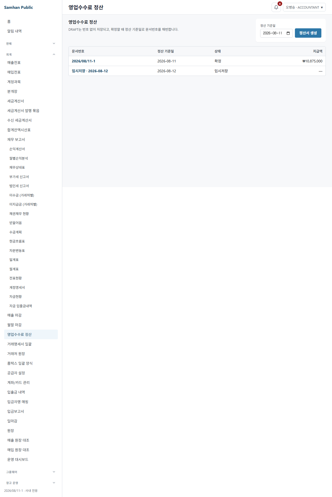
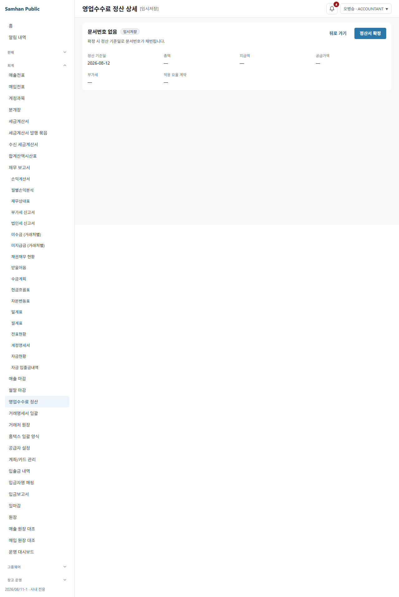
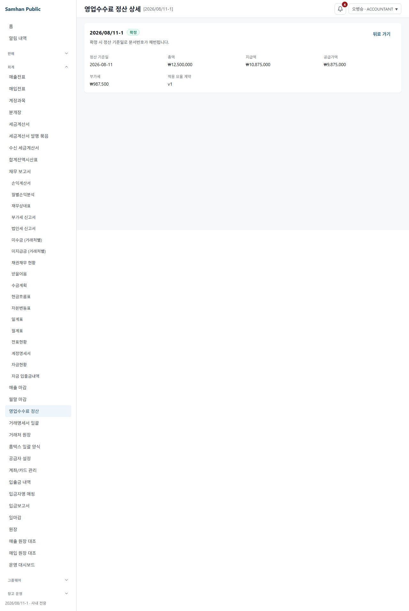
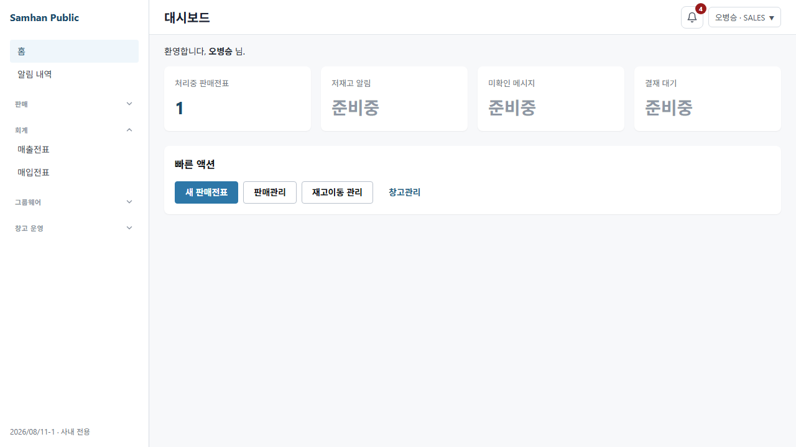

# DG1 S4a SOL 재검토5 — PR #1170 머지 판단

- 검토일: 2026-08-11 (Asia/Seoul)
- 대상 HEAD: `967b9ab86b33993cb613ce2d9b31cff3b5eb8f39`
- 역할: CODEX SOL 5.6 코드 검토
- 판정: **MERGE BLOCKED — 결함 1건**
- git write 조작: 0건. `status`/`diff`/`show` 등 읽기 전용 확인만 사용했다.
- 공유 DB write: 0건. generator는 매 실행 격리 Docker PostgreSQL만 사용했다.

## 1. 머지 차단 결함

### SOL-S4A-R5-01 / MINOR, zero-defect gate BLOCKING — 정상 생성 snapshot 주석이 mojibake를 보존한다

PowerShell 5.1 generator의 권한 데이터와 byte-idempotence는 정상이다. 그러나 정상 입력으로 새로 생성한 UTF-8 snapshot의 주석이 올바른 곱셈 기호 `×`가 아니라 깨진 문자열 `횞`를 기록한다.

실제 원문:

```text
scripts/refresh-accounting-permission-db-snapshot.ps1:91
$lines.Add('// Scope: PERMISSION_ROLES 횞 PERMISSION_PAGE_CODES. Missing DB rows are 0000000.')

clients/desktop/src/renderer/test-utils/accounting-slip-permission-db-snapshot.ts:4
// Scope: PERMISSION_ROLES 횞 PERMISSION_PAGE_CODES. Missing DB rows are 0000000.
```

독립 검사:

```text
SNAP_HAS_TIMES=False SNAP_HAS_MOJIBAKE=True
SCRIPT_HAS_TIMES=False SCRIPT_HAS_MOJIBAKE=True
```

`docs/dev-reports/2026-08-11-dg1-s4a-fix4.md`는 기존 SHA-256을 보존하려고 generator literal을 기존 artifact의 `횞`와 맞췄다고 기록한다. 이는 멱등성 자체는 얻지만, 잘못된 바이트를 정본으로 고정한 것이다. 권한 비트·역할·page-code에는 영향이 없으나, 이번 라운드의 “정상 입력에서 스냅샷이 제대로 생성되는지”와 저장소의 UTF-8 한글/문자 무결성 조건상 결함 0으로 판정할 수 없다.

수정 지시:

1. generator `:91`의 `횞`를 `×`로 교정한다.
2. generator로 DB snapshot을 재생성해 snapshot `:4`도 `×`로 바꾼다. 기존 잘못된 SHA-256을 보존 대상으로 삼지 않는다.
3. 계약 테스트에 generator/snapshot이 `횞`를 포함하지 않고 `PERMISSION_ROLES × PERMISSION_PAGE_CODES`를 포함한다는 단정을 추가한다.
4. PowerShell 5.1에서 두 번 재생성해 새 기준 SHA-256이 실행 전/1회/2회 모두 같은지, LF 413줄·UTF-8 no BOM인지 다시 확인한다.
5. 아래 9종 mutation과 정상 전체 회귀를 다시 실행한다.

## 2. generator 직접 2회 실행

Windows PowerShell 버전:

```text
5.1.26100.8972
```

격리 PostgreSQL에 매 실행 전체 100 migration을 적용해 V101까지 도달했고, 실제 output 파일을 기록했다.

```text
HASH_BEFORE=2AA426DCBFB6860B452A1913CB97A227E394BF5F3D0292D8CE40F82ABC98169C
RUN1_EXIT=0
HASH_RUN1=2AA426DCBFB6860B452A1913CB97A227E394BF5F3D0292D8CE40F82ABC98169C
RUN1_WROTE=True RUN1_MIGRATED_V101=True
RUN2_EXIT=0
HASH_RUN2=2AA426DCBFB6860B452A1913CB97A227E394BF5F3D0292D8CE40F82ABC98169C
RUN2_WROTE=True RUN2_MIGRATED_V101=True
ALL_EQUAL=True
CRLF=0 LF_ONLY=413 UTF8_BOM=False BYTES=15819
```

정상 생성 내용도 별도로 확인했다.

- 역할 블록 11개: MASTER/MANAGER/SALES/ACCOUNTANT/WAREHOUSE/INVENTORY/DISPATCH/DRIVER/STAFF/DEVELOPER/PARTNER
- 신규 `accounting.sales-commission-settlement` DB row 3개: MASTER/MANAGER/ACCOUNTANT, 각 `1110000`
- MASTER runtime 합성 `1111111` 계약 존재
- fresh desktop exact contract 14/14 GREEN
- fresh auth DB projection 2/2 GREEN

즉 snapshot 데이터 생성은 정상이고, 결함은 `횞` 주석 한 좌표다.

## 3. PowerShell 5.1 실제 실패 원문

정상 DB SELECT 결과의 첫 row를 한 번 더 넣고 Windows PowerShell 5.1을 직접 실행했다. stderr를 raw bytes로 저장한 뒤 UTF-8로 직접 디코딩했다.

```text
FAILURE_EXIT=1
SNAPSHOT_BEFORE=2AA426DCBFB6860B452A1913CB97A227E394BF5F3D0292D8CE40F82ABC98169C
SNAPSHOT_AFTER=2AA426DCBFB6860B452A1913CB97A227E394BF5F3D0292D8CE40F82ABC98169C
STDERR_BYTES=133
UTF8_REPLACEMENT=False
LINE_COUNT=1
HAS_KOREAN=True
HAS_STACK=False
```

실제 stderr 원문:

```text
DB 파생 스냅샷 갱신 중단: duplicate projection cell ACCOUNTANT|accounting.accounts first/second bits cannot be represented
```

한글은 깨지지 않았고, `At ...`, `CategoryInfo`, `FullyQualifiedErrorId` 스택은 없었다. 실패 전후 snapshot hash도 불변이다.

## 4. 인용 전수 재감사

### 4.1 unique 제약과 entity 연결

| 데이터 원천 | 실제 제약 | entity active filter | 판정 |
|---|---|---|---:|
| `role_page_permissions` | V7 `:34-36` `uq_role_page_permissions_active(role_code,page_code) WHERE is_deleted=FALSE` | `RolePagePermission.java:34,36` | 일치 |
| `role_page_permission_templates` | V39 `:53-55` `uq_rppt_active(role_code,page_code) WHERE is_deleted=FALSE` | `RolePagePermissionTemplate.java:24,26` | 일치 |
| `account_page_permissions` | V39 `:84-86` `uq_app_active(account_id,page_code) WHERE is_deleted=FALSE` | `AccountPagePermission.java:25,27` | 일치 |
| `group_page_permissions` | V42 `:58-60` `uq_group_page_permissions_active(group_id,page_code) WHERE is_deleted=FALSE` | `GroupPagePermission.java:24,26` | 일치 |

### 4.2 DynamicPermissionService의 V7 데이터 흐름

실제 흐름은 다음과 같다.

```text
DynamicPermissionService.java:47 RolePagePermissionRepository
  → :123 findAllOrderByRoleCodeAndPageCode()
  → RolePagePermissionRepository.java:47-48 JPQL RolePagePermission 조회
  → RolePagePermission.java:34 role_page_permissions
  → RolePagePermission.java:36 @SQLRestriction("is_deleted = false")
  → V7__add_role_page_permissions.sql:34-36 active (role_code,page_code) unique
  → DynamicPermissionService.java:127-129 dbIndex.put(pageCode,row)
```

따라서 fix4의 V7 교정은 정확하다. V39 `uq_rppt_active`는 이 흐름을 덮지 않으며 `AccountPermissionService.getTemplates()`의 template 흐름에만 적용된다.

### 4.3 권한 흐름 20좌표 재확인

| # | 좌표 | 직접 재감사 결과 |
|---:|---|---|
| 1 | checker bucket catalog `:42-54` | raw role/page 중복을 Set 합치기 전에 실패 |
| 2 | checker raw TS source `:63-85,133` | role block/cell 중복을 import 결과 사용 전에 실패 |
| 3 | freshness `parseProjection():164-182` | role/cell을 `put` 전에 실패 |
| 4 | freshness DB row `:89-99` | DB cell을 `put` 전에 실패 |
| 5 | PS generator `:73-85` | HashSet 검증 후에만 hashtable 대입 |
| 6 | mock edit source + contract `:287-301` | role별 raw page 중복을 membership 전에 실패 |
| 7 | seed `bitsMap():142-154` | role 중복을 `put` 전에 실패 |
| 8 | catalog parity `:84-94` | Set cardinality와 원 배열 길이 exact 비교 |
| 9 | inbound action Set `:37-38,71-73` | 단일 cell 7-action exact 계약, role/page projection merge 아님 |
| 10 | `permissionsApi.ts:485-496` | 같은 cell의 action 입력을 의도적으로 DTO merge |
| 11 | `AccountPermissionService:158-164` | V39 account active unique가 source를 보호 |
| 12 | `GroupPermissionService:38-44` | V42 group active unique가 source를 보호 |
| 13 | `GroupPermissionService:124-131` | 같은 group repository/source의 관리 page view |
| 14 | `DynamicPermissionService:47,123-129` | V7 legacy role active unique가 source를 보호 |
| 15 | `EffectivePermissionMaterializer:103-114` | 여러 그룹 권한의 명시적 OR 도메인 union |
| 16 | `EffectivePermissionMaterializer:117-120` | account override가 group OR보다 우선하는 명시적 precedence |
| 17 | `PermissionInternalController:128-137` | RolePagePermission/V7 active unique DTO 흐름 |
| 18 | `AccountPermissionService:93-104` | AccountPagePermission/V39 active unique bulk load |
| 19 | `AccountPermissionService:303-307` | RolePagePermissionTemplate/V39 active unique template map |
| 20 | `GroupPermissionService:96-102` | 동일 page request의 명시적 last-write-wins 정규화 |

### 4.4 표 밖 회계 후보 4좌표

| # | 좌표 | backing 근거 | 판정 |
|---:|---|---|---|
| 21 | `CashFlowStatementService:323-326` | `JournalLineRepository:431 GROUP BY accountCode` | 집계 key와 일치 |
| 22 | `AccountStatementService:176-181` | repository `:321 GROUP BY partnerId,accountCode` | 복합 key와 일치 |
| 23 | `TrialBalanceSummaryService:149-154` | repository `:37,:174 GROUP BY accountCode` | 집계 key와 일치 |
| 24 | `EquityChangesService:78-79` | merge function 없는 `Collectors.toMap` | 중복 시 예외, silent overwrite 아님 |

V7 포함 위 24좌표에서 추가 오인용은 발견하지 못했다.

## 5. mutation 회귀 9종

모든 변이는 실제 제품/검사 원천에 한 종류씩 넣고 실행했으며, 매 실행 뒤 원복했다. 최종 6개 원천 파일 SHA-256이 시작값과 모두 일치했다.

| 계열 | 실제 변이 | 결과 원문/좌표 |
|---|---|---|
| 중복 1 | ACCOUNTANT target을 `1000000`과 `1110000` bucket에 중복 | RED: `duplicate snapshot cell ACCOUNTANT|... firstBits=1000000 secondBits=1110000` |
| 중복 2 | TS DB snapshot MASTER key를 `0000000` 뒤 `1110000`으로 중복 | RED: `duplicate projection cell MASTER|...` + Vite duplicate key warning |
| 중복 3 | 같은 TS source를 Java parser가 읽음 | RED: freshness line 181, first `0000000`/second `1110000` |
| 중복 4 | freshness DB query에 ACCOUNTANT/accounts row `UNION ALL` | RED: `duplicate auth_db cell ACCOUNTANT|accounting.accounts bits=1111000` |
| 중복 5 | mock ACCOUNTANT edit source에 target 두 번 | RED: `ACCOUNTANT|accounting.sales-commission-settlement` |
| fix2 1 | template grant에 DRIVER `111` 초과 | RED: exact matrix line 80 |
| fix2 2 | ACCOUNTANT grant 누락 | RED: exact matrix line 80 |
| fix2 3 | MASTER `000` 뒤 `111` 중복 | RED: `duplicate grant row for MASTER`, line 153 |
| fix2 4 | MASTER 중복 + DRIVER 초과 | RED: duplicate guard line 153 |

원복 후 정상:

```text
desktop exact permission contract: 14 passed / 0 failed
SalesCommissionSettlementPermissionSeedTest: 5 / 0 / 0 / 0
AccountingPermissionProjectionFreshnessIT: 2 / 0 / 0 / 0
```

## 6. RED-B 보존

| 표면 | 직접 재검증 결과 |
|---|---|
| V101 정상 | SeedTest 5/5 GREEN; 11역할 exact 7-bit/2-bit 계약 |
| SALES runtime deny | 직접 Playwright에서 route가 dashboard로 복귀, 메뉴 0개 |
| accounting HTTP 403 | `SalesCommissionSettlementHttpGuardIT` 1/1: 실제 HTTP 403 + FORBIDDEN envelope |
| activeTargets | 33 entries / 33 unique / target 1 |
| 회계 렌더 anchor | 직접 DOM 44 exact |
| 권한 matrix 회계 pageCode | 62 entries / 62 unique / target 1 |
| 기존 route | 기존 43개를 MASTER로 하나씩 열어 43/43 hash 유지, NotFound/login 0 |
| native Link | 목록 두 행 모두 실제 DOM tagName `A`; source도 React Router `Link` import/element 사용 |
| scroll | 직접 `720 → detail → back → 720` |
| UUID | ACCOUNTANT 목록 visible body에서 UUID 정규식 0건; 내부 route key만 사용 |
| S1 채번 | NumberSequenceIT 9/9, 동시 채번·date reset·documentNo round trip 포함 |
| S2 versioned | RateVersionIT 2/2, 저장된 version별 snapshot 불변 |
| CONFIRMED snapshot | CalculationSnapshotTest 2/2, 새 rate version 후 기존 snapshot 불변 |
| desktop 전체 | 248 files, 2,167 total = **2,166 passed + 1 skipped**, failed 0, success true |
| accounting 전체 | 225 XML, **1,871 tests / 0 failures / 0 errors / 10 skipped**; Gradle `BUILD SUCCESSFUL in 8m 28s` |
| typecheck | exit 0; tsc node/web + real-QA cleanup 2/2 + scope 51/51 |

## 7. 직접 Playwright 라이브 QA

- 실행 위치: `clients/desktop`
- 런타임: `@playwright/test` 1.59.1, headless Chromium 프로젝트(설치 `chromium-1217` 계열)
- Vite: `127.0.0.1:5187`, `VITE_MOCK_MODE=1`
- live spec 경로: `playwright/dg1-s4a-sol5-real-qa/dg1-s4a-sol5-real-qa.spec.ts`
- 결과: **3 passed (8.1s)**
- Codex 내장 브라우저: 사용하지 않음
- 임시 spec/config: 실행 후 제거
- Vite PID `105116`과 해당 자식만 종료; 5187 listener 0
- 5175 프로세스에 어떤 조작도 하지 않음

스크린샷:

1. 
2. 
3. 
4. 
5. 

## 8. 정리 상태

- 이번 generator 실행의 임시 컨테이너·network는 각 실행에서 제거됐다.
- `accounting-permission-refresh-77c5a160cfc8` network 1개는 생성 시각 `2026-08-09T00:26:07Z`, 연결 컨테이너 0인 선행 잔류물로 확인되어 이번 작업 소유가 아니므로 건드리지 않았다.
- mutation 파일 6개와 generator source는 시작 SHA-256으로 복원됐다.
- 임시 Vitest JSON, live spec/config, Vite listener는 남지 않았다.
- 최종 의도 산출물은 본 보고서와 `docs/qa/2026-08-11-dg1-s4a-sol5/` 5장뿐이다.

## 9. 이 라운드가 보지 않은 표면

- 공유/운영 DB에 V101을 실제 적용하거나 운영 데이터를 write하지 않았다.
- 운영 gateway/JWT/SSO를 동시에 통과하는 배포형 end-to-end HTTP는 보지 않았다. accounting 403은 embedded 실제 TCP IT로 검증했다.
- packaged Electron, Windows installer, 모바일 클라이언트는 보지 않았다.
- 다중 계정이 동시에 권한을 변경할 때 materializer의 경쟁 조건은 보지 않았다.
- 실제 외부 그룹웨어 문서 API/SSO 연동은 S4a 화면 범위 밖이라 보지 않았다.

## 10. PM 보고

기능·권한·회귀·라이브 QA에는 추가 결함이 없다. 그러나 generator가 정상 생성물에 mojibake `횞`를 재생성하는 결함 1건 때문에 zero-defect merge 조건은 충족하지 못했다. 위 R5-01 교정 후 generator 2회와 전체 회귀를 다시 통과시켜야 머지 가능하다.
