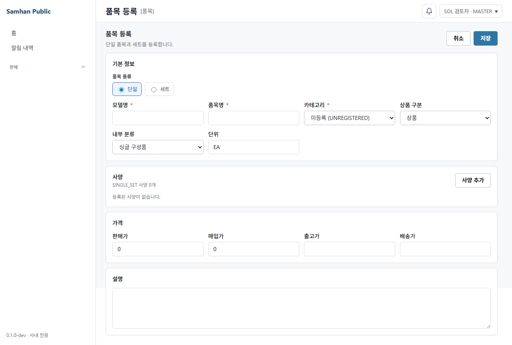
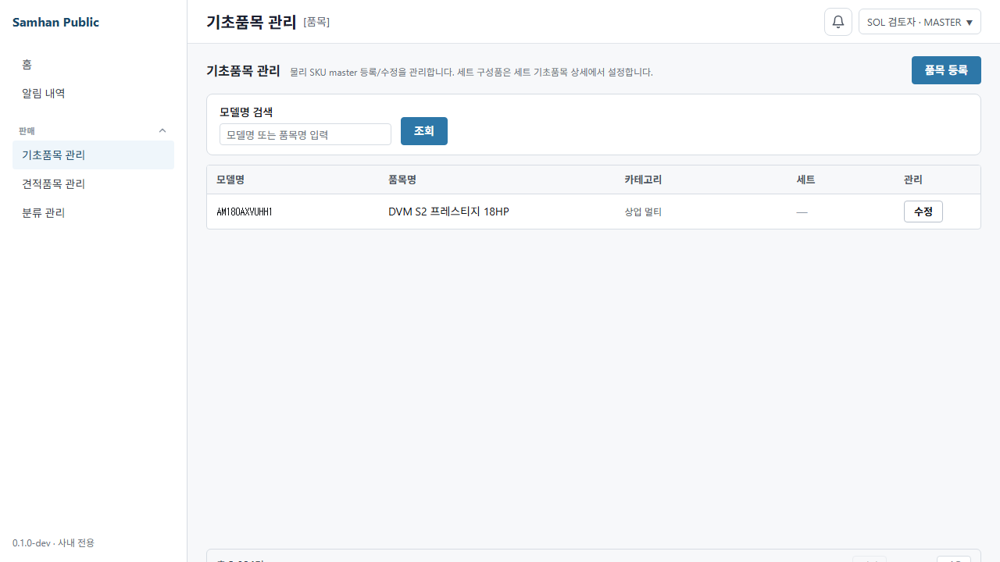
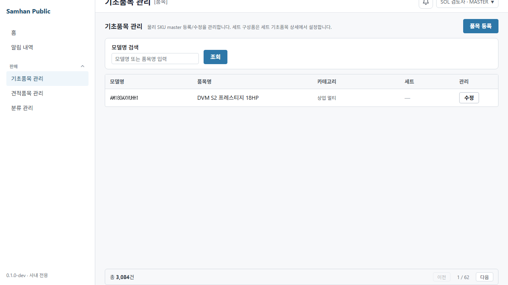

# PR #1166 제품구분 백필 SOL 5.6 검토

- 검토일: 2026-08-11 (KST)
- 검토 HEAD: `b5e34da0c`
- 대상: 제품구분 백필 선행 슬라이스(V38, 단일 분류기, 시트 신규 분류, 재등장 보존)
- 공유 DB: 모든 조회를 read-only transaction으로 수행했다. V38과 rollback 재현은 공유 DB dump를 복원한 격리 PostgreSQL 컨테이너에서만 수행했다.
- 판정: **결함 3건, 머지 보류**

## 1. 결론

분류 결과 자체는 개발책임자 결정과 일치한다. 받침대 선행 예외 11건은 모두 `PIPING`, 정상 실외기·실내기 본체의 받침대 과잉 매칭은 0건, 구성품 역산 순증은 41건, 11개 다중 역할 충돌은 모두 품목명 우선으로 해소됐다. 모델코드 접두 분류도 없다. 격리 V38 적용 후 합계는 3,084건이며 `UNREGISTERED`는 2,126건이다.

그러나 다음 3건 때문에 이 상태로 머지할 수 없다.

| ID | 심각도 | 결함 |
|---|---|---|
| SOL-1 | P1 | 기초품목 목록이 물리 제품구분을 응답·표시·필터·카운트하지 않는다. `미등록`을 점진적으로 채울 업무 경로가 없다. |
| SOL-2 | P1 | 보고서 rollback SQL이 V38 이후 사람이 수정한 카테고리를 무조건 이전값으로 덮어쓰고, 실제 복원되지 않은 행도 rollback 완료로 표시할 수 있다. |
| SOL-3 | P1 | 현재 HEAD에는 main에서 이미 적용된 V36·V37 파일이 없다. main V37 복제 DB에 HEAD jar를 그대로 부팅하면 Flyway validation이 중단된다. |

보고서의 `기존 categoryId 필터·카운트 계약도 그대로 적용된다`는 문장은 SOL-1과 정면으로 어긋난다. rollback 안전성도 즉시 적용→즉시 rollback 한 단일 happy path만 테스트해 SOL-2를 놓쳤다.

## 2. 2,127 → 2,126 한 건의 정체

### 결론

**개명 커밋이 분류를 바꾼 것은 아니다.** 개명 전 커밋 `8221eee0b`와 개명 후 `b5e34da0c` 모두 최종 미분류/미등록 수를 2,126으로 기록하며, 두 커밋의 classifier diff는 상수명·코드값·표시명 변경뿐이다.

개발책임자가 지적한 `2,127 = 2,168 - 41` 계산에서 빠진 한 건은 다음 행이다.

| modelCode | 품목명 | 정찰본 규칙 | 구현 규칙 | 이동 이유 |
|---|---|---|---|---|
| `SZO-00015` | `WMN4070SJ-TV브라켓` | 미등록 | `PIPING` | 새 선행 예외에 `브라켓`이 포함됨 |

따라서 수식은 `정찰 미등록 2,168 - 브라켓 1 - 구성품 역산 41 = 최종 미등록 2,126`이다. 이 한 건은 실제 브라켓 부자재이므로 분류 결함은 아니다. 다만 보고서가 “개명 전후 동일”만 적고 정찰본에서 구현본으로 움직인 이 한 건을 설명하지 않은 것은 증거 서술 누락이다.

## 3. `UNCLASSIFIED` 저장소 전체 재검색

실행 명령은 build/dist/node_modules와 대용량 QA 캡처만 제외하고 저장소 전체를 대상으로 했다.

```powershell
rg -n "UNCLASSIFIED" --hidden -g '!.git/**' -g '!**/node_modules/**' `
  -g '!**/build/**' -g '!**/dist/**' -g '!docs/qa/**' .
```

**저장소 전체 0건 보고는 사실이 아니다. 본 검토 보고서를 생성하기 전 기준으로 대문자 문자열은 16좌표 남아 있다.** 다만 제품구분 실행 자산의 잔존은 0건이며, 남은 문자열은 서로 다른 도메인의 유효 값 또는 역사 기록이다. 이 검토 보고서 자체의 인용·설명은 16좌표에 포함하지 않았다.

| 영역 | 좌표 수 | 판정 |
|---|---:|---|
| `services/product-service/**` | 0 | 제품구분 개명 완료 |
| `clients/**`, `scripts/**`의 제품구분 실행 자산 | 0 | 제품구분 잔존 없음 |
| `services/dc-config-service/**` | 8 | 거래처그룹 enum `UNCLASSIFIED`; 다른 도메인이므로 보존 |
| `services/slip-service/**` | 2 | 익일전표 지역그룹 상수명; 다른 도메인이므로 보존 |
| `docs/dev-reports/2026-08-03-1015-r20-reconvergence.md` | 2 | 과거 전표 분석 marker/결과 |
| 구현 보고서 | 2 | 개명 전후 대조와 검색 설명 |
| `docs/dev-reports/migration-be-m3-dc-config-service.md` | 2 | 거래처그룹 역사 문서 |

제품구분과 무관한 16좌표를 일괄 개명하면 오히려 다른 계약을 깨뜨린다. 구현 보고서의 표현은 “저장소 전체 0”이 아니라 “제품구분 실행 자산 0, 저장소 전체 별도 의미 16”으로 고쳐야 한다.

## 4. 분류기 전수 검증

### 4.1 격리 V38 최종 분포

| 제품구분 | 건수 |
|---|---:|
| CONTROL | 29 |
| HVAC | 11 |
| INDOOR | 415 |
| INDOOR_CEILING | 61 |
| INDOOR_WALL | 40 |
| OUTDOOR | 201 |
| PIPING | 167 |
| SERVICE | 34 |
| UNREGISTERED | 2,126 |
| **합계** | **3,084** |

실제 변경 감사행은 3,046건이다. 기존 `INDOOR_WALL`과 적용 결과가 같은 38건은 no-op이라 감사 대상에서 제외됐다. 제품 3,084건 전체를 바꾼 것이 아니다.

### 4.2 PM 받침대 목록 11건

다음 11좌표가 모두 선행 예외에 매칭돼 `PIPING`이 됐다.

| modelCode | 품목명 |
|---|---|
| `SI-AL600A` | 실외기 일자발 |
| `SI-AL600a` | 실외기 일자발 (전면 4~6HP) |
| `SI-AL700a` | 실외기 일자발 (전면 8~12HP) |
| `AAAA-00012` | 실외기거치대 |
| `ZENG-00006` | 실외기거치대(벽걸이) |
| `ZENG-00007` | 실외기거치대(스텐드) |
| `AAAA-00034` | 실외기받침대 |
| `ZENG-00017` | 실외기받침대 |
| `AAAA-00035` | 실외기실내받침대 |
| `AAAA-00031` | 실외기 거치대 (소) |
| `00016` | 원터치형 베란다 실외기 받침대 |

### 4.3 과잉 매칭

선행 패턴 `일자발|받침|거치|브라켓|앵글`이 활성 품목명 전체에서 잡은 것은 18건이다. 위 11건 외 7건은 다음과 같다.

| modelCode | 품목명 | 육안 판정 |
|---|---|---|
| `AAAA-00036` | 2단 받침대 | 부자재 |
| `SZO-00015` | WMN4070SJ-TV브라켓 | 브라켓 부자재 |
| `AAAA-00013` | 받침대 | 부자재 |
| `01007` | 벽걸이 브라켓 | 브라켓 부자재 |
| `00019` | 설치대 2단 발코니 받침대 | 부자재 |
| `ZENG-00021` | 실내기 받침대 | 부자재 |
| `ZENG-00023` | 중대형 실내기받침대 | 부자재 |

18건을 전부 눈으로 확인했다. 정상 실외기/실내기 본체가 받침대로 잡힌 사례는 0건이다.

### 4.4 구성품 역산과 충돌

품목명 규칙만으로 미등록인 행에 동일 classifier의 구성품 역할을 적용해 **41건이 모두 `OUTDOOR`로 순증**했다. 모델은 다음과 같다.

`AM080AXVSHH1`, `AM100AXVHHH1`, `AM100AXVHHR1`, `AM100AXVSHH1`, `AM100AXVUHH1`, `AM120AXVGHC1`, `AM120AXVGHH1`, `AM120AXVHHH1`, `AM120AXVHHR1`, `AM120AXVSHH1`, `AM120AXVUHH1`, `AM140AXVGHC1`, `AM140AXVGHH1`, `AM140AXVHHH1`, `AM140AXVHHR1`, `AM140AXVSHH1`, `AM140AXVUHH1`, `AM160AXVHHH1`, `AM160AXVHHR1`, `AM160AXVSHH1`, `AM160AXVUHH1`, `AM160NXGGBH1`, `AM180AXVHHH1`, `AM180AXVHHR1`, `AM180AXVSHH1`, `AM180AXVUHH1`, `AM200AXVGHH1`, `AM200AXVHHH1`, `AM200AXVHHR1`, `AM200AXVSHH1`, `AM200AXVUHH1`, `AM200NXGGBH1`, `AM220AXVGHC1`, `AM220AXVGHH1`, `AM220AXVSHH1`, `AM240AXVGHC1`, `AM240AXVGHH1`, `AM240AXVSHH1`, `AM250NXGGBH1`, `AM280AXVGHC1`, `AM300AXVGHC1`.

다중 역할 11건도 재현됐다.

- `ACCESSORY+INDOOR`, 품목명 우선 `INDOOR`: `AC023CN1DBC1`, `AC023CN1PBH1`, `AC032CN1DBC1`, `AC032CN1PBH1`, `AC040CN1DBC1`, `AC040CN1PBH1`
- `ACCESSORY+OUTDOOR`, 품목명 우선 `OUTDOOR`: `AC023CX1DBC1`, `AC023CX1PBH1`, `AC032CX1DBC1`, `AC032CX1PBH1`, `AC040CX1DBC1`

classifier API는 `productName`과 `componentKinds`만 받는다. V38은 DB에서 `model_code`를 조회하지만 classifier에 전달하지 않고, 시트 신규 경로도 `classify(name)`만 호출한다. 모델코드 prefix/substring 분류는 없다.

## 5. 정상 경로 회귀

### 5.1 수동 불가침

- 공유 DB 활성행의 `classification_manual=true`: **0건**. 따라서 운영 표본은 존재하지 않는다.
- 격리 Testcontainers 표본 `BACKFILL-MANUAL`: 이름은 `실외기`, 기존 제품구분은 `INDOOR_WALL`, `classification_manual=true`. V38 후에도 `INDOOR_WALL`, 감사행 0건으로 유지됐다.
- 주의: 이 플래그는 원래 L/M/S 수동 분류 플래그이고 별도의 `category_manual` 열은 없다. 이번 요구의 명시 불변식은 만족하지만, 장기적으로 두 축을 같은 수동 플래그로 간주할지 별도 결정이 필요하다.

### 5.2 필수 category와 재등장

- V38은 활성 root `UNREGISTERED / 미등록`을 1개 생성하며 `products.category_id NOT NULL` 계약을 지킨다.
- 등록 폼은 카테고리를 필수로 받고 실제 tree API 응답을 option으로 사용한다. Playwright에서 `미등록 (UNREGISTERED)` 선택 성공을 확인했다.
- 시트 신규 행은 단일 classifier 결과의 유효 category entity로 생성된다.
- soft-delete 재등장 경로는 삭제행을 `findLatestDeletedByModelCode`로 찾고 `markRestored()`한 뒤 기존 category를 변경하지 않는다. 실제 PostgreSQL IT에서 같은 UUID와 수동 `OUTDOOR` 보존을 확인했다.

### 5.3 견적·전표·세트·정액DC 축

격리 복제본에서 V38 전후 hash를 비교했다.

| 표면 | 전/후 결과 |
|---|---|
| products의 category/audit 외 모든 business field | `c405602cbd38ed3b8c39b58f71c75814` 동일 |
| `bundle_component` 전체 | `7f5401be8300a6d671845df9d7dd5c77` 동일 |
| `product_estimate_exposure` 전체 | `621d1672b898e154af2e97e3d83ff0c0` 동일 |
| `product_category`, `estimate_category`, 고정/변동DC 필드 | `9ca7ad56385e7b67ef9dde74748ee16c` 동일 |

V38은 product DB의 `categories`, `product_category_backfill_audit`, `products.category_id/modified_*`만 건드린다. 전표 DB나 견적·가격·세트 구성 필드는 변경하지 않는다. 전체 product-service 테스트도 실제 재실행해 통과했다. 이 결과는 제품구분 축과 정액DC S/M/L 축이 분리돼 있음을 확인한 것이며, 범위 밖인 40% 규칙이나 견적 계산 자체를 재검증한 것은 아니다.

### 5.4 V38 번호와 현재 HEAD 정합성

- `origin/main` product-service migration 최대: **V37**
- 신규 migration: **V38**, 번호는 정확히 +1
- 그러나 현재 branch는 main보다 11커밋 뒤이고 HEAD 파일 트리에는 V36·V37이 없다.
- main V37 공유 DB 복제본에 HEAD jar를 그대로 실행한 원문:

```text
Validate failed: Migrations have failed validation
Detected applied migration not resolved locally: 36.
Detected applied migration not resolved locally: 37.
```

검증용으로만 `*:missing`을 허용하면 V38 1건이 정상 적용돼 schema v38, 위 3,084건 분포가 됐다. 운영에서는 이 우회를 사용하면 안 된다.

## 6. 직접 Playwright 라이브 QA

- 실행 위치: `clients/desktop`
- Playwright: 1.59.1
- 브라우저: 설치된 `chromium-1217` headless
- 실제 desktop renderer를 Vite로 띄우고 인증/API만 결정적 fixture로 격리했다.
- 명령:

```powershell
.\node_modules\.bin\playwright.cmd test `
  --config=playwright/1166-product-category-sol-review/playwright.config.ts
```

결과: **1 passed, 1 failed (12.5s)**.



등록 폼에서는 `미등록 (UNREGISTERED)`이 보이고 선택된다.



기초품목 목록은 모델명 검색과 전체 3,084건만 보인다. `카테고리` 열의 `상업 멀티`는 물리 제품구분이 아니라 별도 `ProductCategory` 견적 축이다.



하단에는 전체 `총 3,084건`만 있고 선택 가능한 `미등록 2,126건` 카운트는 없다.

실패 원문은 [playwright-output.txt](../qa/2026-08-11-category/playwright-output.txt)에 보존했다.

```text
Error: 기초품목 화면에 제품구분 필터가 없습니다.
Locator: getByRole('combobox', { name: /카테고리|제품구분/ })
Error: element(s) not found

Error: 기초품목 화면에 미등록 카운트가 없습니다.
Locator: getByText(/미등록\s*2,126건/)
Error: element(s) not found
```

초기 harness의 ESM 경로 오류 원문은 `playwright-harness-failure.txt`, design-system 미빌드로 Vite가 실패한 원문은 `vite-stderr.log`에 별도로 남겼다. 환경을 정상화한 뒤 위 최종 실행 결과를 판정 근거로 사용했다.

## 7. 결함 지시서

### SOL-1 — 물리 제품구분 필터·카운트·표시 누락

#### 불변식

1. 기초품목 목록에서 물리 `products.category_id`의 이름/코드를 보여야 한다.
2. root `UNREGISTERED`를 선택하면 서버가 해당 category의 전체 건수 **2,126**을 반환하고 화면이 그 값을 표시해야 한다.
3. 이 축은 현 `ProductCategory`/`EstimateCategory` 및 정액DC 분류축과 혼합하면 안 된다.
4. 검색어와 물리 category 필터는 AND 결합되고 필터 변경 시 page=0으로 돌아가야 한다.

#### 좌표 전수

- `clients/desktop/src/renderer/routes/ProductCatalogPage.tsx:98-147` — 상태/query key/request에 물리 category가 없음
- 같은 파일 `:153-181` — `카테고리` 열이 `row.productCategory`를 표시해 다른 축을 물리 category처럼 보이게 함
- 같은 파일 `:245-277` — toolbar에 물리 category selector가 없음
- 같은 파일 `:296-302` — 전체/검색 total만 있고 선택 category의 count 표시는 없음
- `clients/desktop/src/renderer/api/productCatalogApi.ts:78-121` — `ProductCatalogRow`에 physical category id/code/name 없음
- 같은 파일 `:382-416` — `ListProductsParams.category`는 `EstimateCategory`; `categoryId` 없음
- `services/product-service/src/main/java/com/samhanair/logis/product/web/ProductCatalogController.java:154-174` — `/api/v1/products`가 estimate category만 받음
- `services/product-service/src/main/java/com/samhanair/logis/product/web/dto/ProductCatalogResponse.java:44-68` — physical category 응답 필드 없음
- `services/product-service/src/main/java/com/samhanair/logis/product/repository/ProductRepository.java:240-267` — catalog query/count query에 `p.category_id` 조건 없음
- 재현 화면: `/products/catalog`

#### 재현 데이터

- 전체 3,084, `UNREGISTERED` 2,126
- tree node: code=`UNREGISTERED`, name=`미등록`
- 현재 한 catalog row의 `productCategory=COMMERCIAL_MULTI`는 물리 제품구분과 다른 축임

#### RED-A — 서버 계약 표적

`GET /api/v1/products?categoryId=<UNREGISTERED_UUID>&page=0&size=50`이 2,126건을 반환하고 각 row에 physical category의 `code/name`을 포함하도록 controller IT를 먼저 실패시킨다. q와 categoryId를 함께 보냈을 때 count/data query가 동일 조건을 쓰는지도 RED로 고정한다.

#### RED-B — 데스크톱 표적

현재 실패한 Playwright를 그대로 RED로 삼는다. `미등록` 선택→`총 2,126건`→table physical category `미등록`, 필터 해제→`총 3,084건`을 검증한다. 기존 `상업 멀티` 열을 유지해야 한다면 열 이름을 견적/상품 축으로 명확히 바꾸고 물리 `제품구분` 열을 별도로 추가한다.

#### 새 조합

- category only / q only / category+q / 둘 다 해제
- `UNREGISTERED` root / 기존 root / child category / 결과 0건
- 필터를 page 2에서 바꿀 때 page 0 reset
- 미등록 행 수정 후 목록 복귀 시 count 2,126→2,125 및 새 category count +1
- 목록 SSE invalidate 후 선택 필터 유지

### SOL-2 — rollback이 사후 수동수정을 파괴

#### 불변식

1. rollback은 현재 category가 여전히 `audit.applied_category_id`인 행만 이전값으로 복원해야 한다.
2. V38 이후 사람이 category를 고친 행, soft-delete된 행, 이미 rollback된 행은 건드리거나 rollback 완료로 표시하면 안 된다.
3. audit의 `rolled_back_at/by`는 실제로 복원된 행에만 기록돼야 한다.
4. 적용·skip·충돌 건수를 운영자가 확인할 수 있어야 한다.

#### 좌표 전수

- `docs/dev-reports/2026-08-11-product-category-backfill.md:97-107` — 현재 category 일치 조건 없이 모든 활성 감사행 복원
- 같은 파일 `:109-115` — 실제 복원 여부와 무관하게 모든 미처리 감사행을 완료 표시
- `services/product-service/src/test/java/db/migration/V38__ProductCategoryBackfillTest.java:77-98` — 적용 직후 단일 행 happy rollback만 검증

#### 격리 재현 데이터

```text
before_manual_edit      | SZO-00015 | PIPING      | previous=ECOUNT_MIG2 | applied=PIPING
after_manual_edit       | SZO-00015 | OUTDOOR
report rollback UPDATE  | 3046 rows
after_report_rollback   | SZO-00015 | ECOUNT_MIG2 | modified_by=V38-rollback
```

#### RED-A — 사후수정 보존 표적

V38 적용 후 감사행 하나를 제3 category로 수동 변경하고 rollback을 실행한다. 그 행은 제3 category를 유지하고 `rolled_back_at`이 null이어야 한다. 현재 SQL은 RED에서 이전 category로 덮어쓴다.

#### RED-B — 혼합 batch 표적

한 transaction에 다음을 섞는다: (a) applied 상태 그대로, (b) 사후수정, (c) soft-delete, (d) 이미 rolled back, (e) audit soft-delete. (a)만 복원·완료되고 나머지는 skip/충돌 수로 보고돼야 한다. `UPDATE ... RETURNING product_id` 결과를 이용해 audit 완료 대상을 정확히 제한한다.

#### 새 조합

- 3,046건 전체 정상 rollback / 일부 사후수정 / 전부 사후수정
- 제품 soft-delete 후 rollback / 복구 후 rollback
- rollback 2회 멱등 실행
- 운영자 식별자 null/blank 거부
- rollback 도중 한 행 실패 시 transaction 전체 원자성

### SOL-3 — HEAD에 main V36·V37 누락

#### 불변식

1. PR 검증 산출물은 main V37 DB에서 아무 ignore/repair 없이 V38로 올라가야 한다.
2. `origin/main`의 migration 이력 파일을 누락·재작성·checksum 변경하면 안 된다.
3. PR merge 결과의 product-service migration 번호는 1..38 연속이어야 한다.

#### 좌표와 재현

- `origin/main`: `V36__add_classification_fixed_discount_rate.sql`, `V37__mark_active_bundle_components_default.sql`
- 현재 HEAD: 위 두 파일 없음, `V38__ProductCategoryBackfill.java`만 있음
- branch divergence: main보다 11커밋 뒤, 4커밋 앞
- main V37 복제 DB + 현재 HEAD jar: `Detected applied migration not resolved locally: 36, 37`

#### RED-A — migration 집합 표적

main 최신을 동기화한 실제 PR merge 산출물 jar를 main V37 dump에 부팅한다. `Successfully validated 38 migrations`와 `Successfully applied 1 migration ... v38`을 ignore pattern 없이 요구한다.

#### RED-B — CI 표적

CI가 `origin/main` 적용 migration 최대값과 PR 신규 migration을 비교하고, merge-ref jar로 V37→V38 격리 migration smoke test를 실행하게 한다. branch HEAD와 merge-ref 양쪽에서 파일 누락/중복 번호/checksum drift를 구분해 실패시킨다.

#### 새 조합

- 빈 DB 1→38 / main V35→38 / main V37→38
- V36·V37 적용 DB + merge-ref jar
- V38 재부팅 no-op
- 잘못된 V36/V37 checksum 및 missing file은 명시 실패

## 8. 구현자 인계 조건

1. SOL-1~3의 RED를 먼저 제시하고 GREEN까지 고친다.
2. 보고서의 2,127→2,126 한 건과 저장소 전체 `UNCLASSIFIED` 16좌표 설명을 반영한다. 다른 도메인의 유효 `UNCLASSIFIED`는 개명하지 않는다.
3. rollback은 조건부·원자적 SQL과 혼합 batch 테스트를 함께 낸다.
4. 기존 41건 구성품 역산, 11건 품목명 우선 충돌, 받침대 18건 전수 목록이 한 건도 달라지지 않음을 다시 산출한다.
5. **제 전제가 틀렸다면 고치지 말고 중단·보고**한다. 특히 물리 category를 기존 `ProductCategory`/`EstimateCategory`에 합치거나, rollback에서 사후수정도 되돌려야 한다는 별도 운영 결정이 있다면 임의 구현하지 않는다.
6. 40% 규칙, 견적 계산 경로, 정액DC 축은 이번 보완 범위 밖이다.

## 9. 검증 명령과 결과

| 검증 | 결과 |
|---|---|
| `:services:product-service:test --no-daemon --rerun-tasks` | **BUILD SUCCESSFUL**, 3분 1초, 15 tasks executed |
| main V37 dump + HEAD jar | **FAIL**, missing V36/V37 원문 확보 |
| main V37 dump + 검토용 missing ignore + V38 | **PASS**, schema v38, 3,084건 |
| 격리 전후 business/set/exposure/DC hash | **모두 동일** |
| 직접 Playwright headless chromium-1217 | **1 pass / 1 fail**, SOL-1 재현 |

## 10. 이 라운드가 보지 않은 표면

- 40% 규칙의 계산·견적 경로 자체
- 정액DC S/M/L 판정 로직 자체
- 실제 운영 DB에 V38 적용 또는 rollback 실행
- 실제 사용자 계정으로 운영 API write
- 모바일·arologis-desktop 별도 화면

공유 DB에는 write하지 않았고, 검토자가 제품 코드를 수정하지도 않았다. 본 문서·QA 산출물과 검토용 Playwright spec만 PM commit 대상으로 남겼다.
