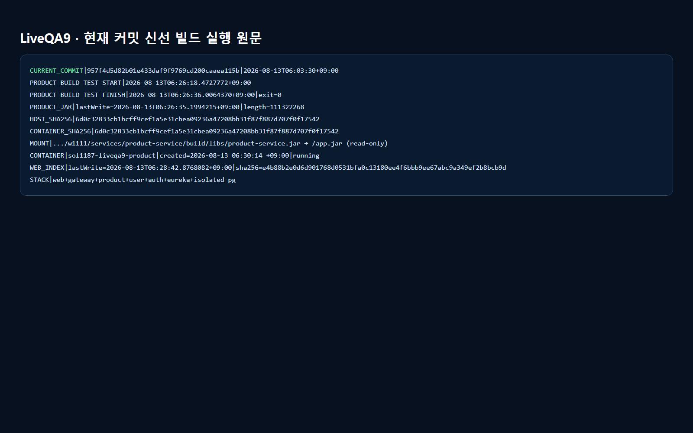
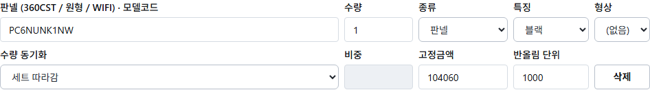
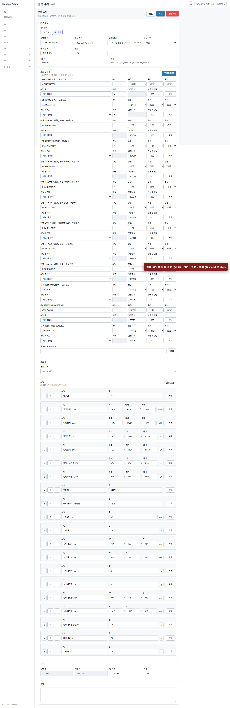
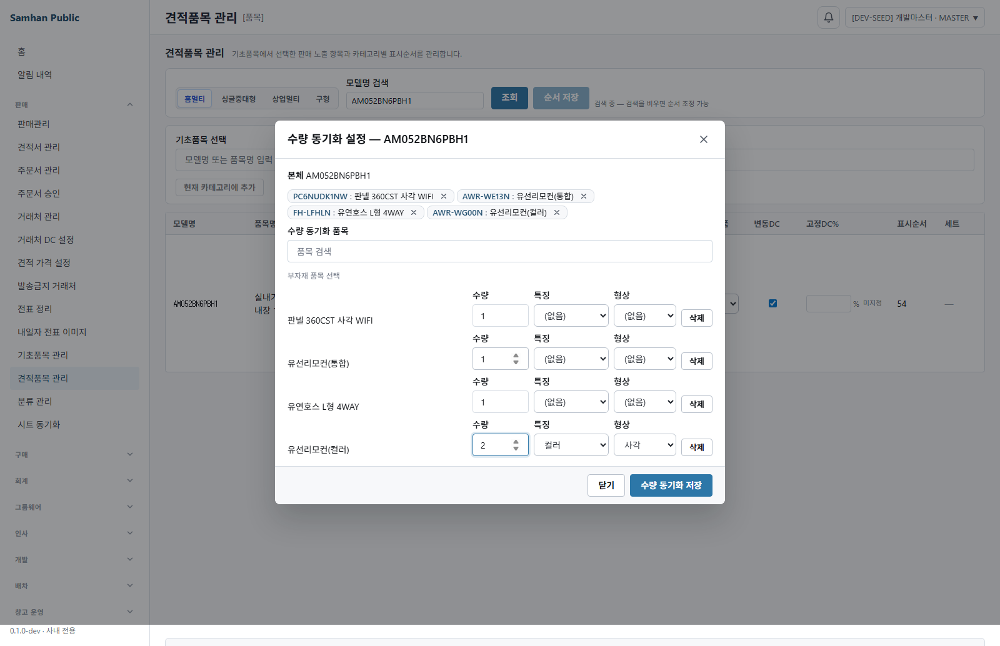
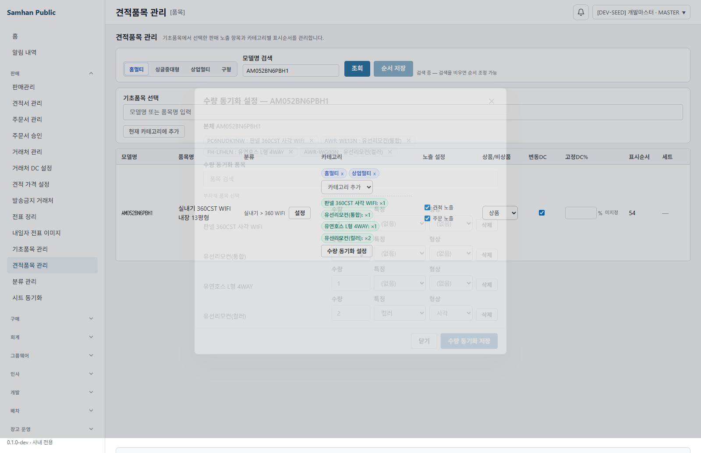
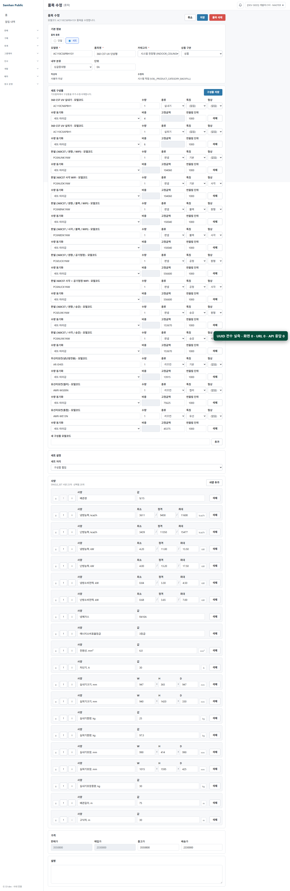

# 2026-08-13 PR #1187 Live QA 9 — CODEX SOL

## 환경 확인 — 현재 커밋 신선 빌드와 실행 원문

- 브랜치/HEAD: `feat/1111-1143-bundle-component` / `957f4d5d82b01e433daf9f9769cd200caaea115b`
- 커밋 원문: `2026-08-13T06:03:30+09:00 | [MERGE] #1143 origin/main 머지 — 충돌 1파일 해소 (양쪽 계약 보존)`
- 격리 포트: web `46875`, gateway `46880`, product `46884`, user `46883`, auth `46881`, Eureka `46876`, PostgreSQL `46832`
- 격리 DB: 공유 `samhan-postgres`에서 `pg_dump` 읽기만 수행해 `product_db`, `user_db`, `auth_db`를 `sol1187-liveqa9-pg`에 복원했다. 저장·원복은 이 복제본에서만 수행했다.
- 공유 Docker 스택을 중지하거나 재시작하지 않았다.
- in-app Browser 목록은 실제로 `[]`였지만 이를 실행 불가 근거로 삼지 않고, 저장소 설치 Playwright Chromium으로 실서버 화면을 실행했다. 드라이버는 `.codex-tmp` 스크래치에서만 사용했고 이 QA 폴더에는 PNG만 남겼다.

```text
CURRENT_COMMIT|957f4d5d82b01e433daf9f9769cd200caaea115b|2026-08-13T06:03:30+09:00|[MERGE] #1143 origin/main 머지 — 충돌 1파일 해소 (양쪽 계약 보존)
PRODUCT_BUILD_TEST_START|2026-08-13T06:26:18.4727772+09:00
PRODUCT_BUILD_TEST_FINISH|2026-08-13T06:26:36.0064370+09:00|exit=0
PRODUCT_JAR|lastWrite=2026-08-13T06:26:35.1994215+09:00|length=111322268|sha256=6d0c32833cb1bcff9cef1a5e31cbea09236a47208bb31f87f887d707f0f17542
RUNNING_PRODUCT_SHA256|6d0c32833cb1bcff9cef1a5e31cbea09236a47208bb31f87f887d707f0f17542|/app.jar
RUNNING_PRODUCT_MOUNT|.../w1111/services/product-service/build/libs/product-service.jar|/app.jar|read-only
RUNNING_PRODUCT_CONTAINER|sol1187-liveqa9-product|created=2026-08-13 06:30:14 +09:00|running
WEB_INDEX|lastWrite=2026-08-13T06:28:42.8768082+09:00|length=1377|sha256=e4b88b2e0d6d901768d0531bfa0c13180ee4f6bbb9ee67abc9a349ef2b8bcb9d
PERSIST_CLONE|PASS|product_db|publicTables=22
PERSIST_CLONE|PASS|user_db|publicTables=11
PERSIST_CLONE|PASS|auth_db|publicTables=12
```



## 결론

**실 사용자가 화면에서 밟는 경로로 재현 가능한 결함은 1건이다.**

- 품목 수정 화면과 수량 동기화 모달의 리모컨 「특징」 드롭박스가 `기본·유선·컬러`로 보인다. 요구값은 `기본·유선리모컨·컬러유선리모컨`이다.
- 실제 `AWR-WE13N` 행과 `AWR-WG00N` 모달 칩에서 재현했다. 저장 후 재진입해도 `컬러`로 보였다.

나머지 요구사항은 통과했다. `서브`와 `MWR-`는 보이지 않았고, 형상 기본값은 빈 값이며, 사용자가 판넬 특징을 직접 변경할 수 있고, 모달 저장 결과는 칩으로 유지됐다. 화면·URL·관찰한 JSON 응답의 UUID는 모두 0건이었다.

## 요구사항별 화면 판정

### 1. 특징 + 형상 드롭박스 — **결함 1건**

- 판넬 특징: `(없음)·기본·블랙·승강·공청` — 통과
- 리모컨 특징: `(없음)·기본·유선·컬러` — **실패**. 요구된 `유선리모컨·컬러유선리모컨` 전체 명칭이 아니다.
- 실제 유선/컬러 리모컨 모델은 `AWR-WE13N`, `AWR-WG00N`으로 `AWR-` 시작 — 통과
- 화면·옵션·관찰 API에서 `서브`, `MWR-` — 0건





### 2. 형상 기본값 빈 값 — **통과**

`PC6NUNK1NW` 판넬 행의 형상 값은 `''`였고 화면에는 `(없음)`으로 보였다. 원형/사각을 고른 기존 행만 해당 값이 표시됐다.


### 3. 판넬 특징은 사용자 직접 선택 — **통과**

실제 판넬 행에서 특징을 `기본 → 블랙`으로 직접 변경했다. 모델코드 `PC6NUNK1NW`와 빈 형상은 변하지 않았다. 저장하지 않고 다시 `기본`으로 되돌렸으며 정규식 자동판정 개입은 화면 경로에서 관찰되지 않았다.

```text
PANEL_DIRECT|before=기본|after=블랙|shape=''|modelInvariant=true
```


### 4. 수량동기화 모달 + 칩 — **기능 통과, 명칭 결함은 요구사항 1에 합산**

기존 품목 `AM052BN6PBH1`의 수량 동기화 모달을 열어 `AWR-WG00N`을 추가하고 수량 `2`, 특징 `컬러`, 형상 `사각`을 설정했다. PUT `200` 후 모달을 다시 열었을 때 같은 칩과 값이 유지됐다. 이후 격리 DB의 기존 3개 타깃으로 원복했다.

```text
BASELINE_TARGETS|PC6NUDK1NW,AWR-WE13N,FH-LFHLN
MODAL_CHIP|AWR-WG00N|qty=2|feature=컬러|shape=사각|PUT=200
REOPEN|qty=2|feature=컬러|shape=사각
RESTORE|HTTP=200|targets=PC6NUDK1NW,AWR-WE13N,FH-LFHLN
```





### 5. 화면·URL·API 응답 UUID 0 — **통과**

- 구형 품목 `AP110RNPPHH1`: 화면 0, URL 0, JSON 응답 전수 0
- 구성품 품목 `AC110CS6PBH1SY`: 화면 0, URL 0, JSON 응답 전수 0
- 견적품목/수량동기화 경로: 화면 0, URL 0, JSON 응답 전수 0
- `discountOption`: 검색 응답에서 실제 노출 확인
- `classificationAssigned`: 관찰 JSON 응답에서 0회
- 화면의 한글 깨짐 `?`: 세 경로 모두 0회



## 품목 상세 네트워크 요청 전수 표

`WEB=http://127.0.0.1:46875`, `GW=http://127.0.0.1:46880`. 구형 품목과 구성품 품목을 새 document navigation으로 각각 열어 response 이벤트를 전수 수집했다.

| # | 경로 | Method | HTTP | 유형 | URL | 응답 UUID |
|---:|---|---|---:|---|---|---:|
| 1 | legacy | GET | 200 | document | `WEB/products/AP110RNPPHH1/edit` | 0 |
| 2 | legacy | GET | 200 | stylesheet | `WEB/assets/index-CdntTRBN.css` | 0 |
| 3 | legacy | GET | 200 | script | `WEB/assets/index-BXIW0B9z.js` | 0 |
| 4 | legacy | GET | 200 | font | `WEB/fonts/PretendardVariable.woff2` | 0 |
| 5 | legacy | GET | 200 | script | `WEB/assets/workbox-window.prod.es5-BqEJf4Xk.js` | 0 |
| 6 | legacy | GET | 200 | font | `WEB/fonts/Pretendard-Regular.woff2` | 0 |
| 7 | legacy | GET | 200 | xhr | `GW/auth/me` | 0 |
| 8 | legacy | GET | 200 | font | `WEB/fonts/Pretendard-Bold.woff2` | 0 |
| 9 | legacy | GET | 503 | xhr | `GW/api/notifications/my` | 0 |
| 10 | legacy | GET | 503 | xhr | `GW/app/version?clientType=DESKTOP&currentVersion=0.1.0-dev` | 0 |
| 11 | legacy | GET | 503 | xhr | `GW/app/notices/active` | 0 |
| 12 | legacy | GET | 200 | xhr | `GW/auth/admin/permissions/my` | 0 |
| 13 | legacy | GET | 200 | xhr | `GW/api/v1/spec-key-templates?category=SINGLE_SET` | 0 |
| 14 | legacy | GET | 200 | xhr | `GW/api/products?q=AP110RNPPHH1&size=20` | 0 |
| 15 | legacy | GET | 200 | xhr | `GW/api/products/categories` | 0 |
| 16 | legacy | GET | 200 | xhr | `GW/api/v1/products?q=AP110RNPPHH1&page=0&size=20` | 0 |
| 17 | legacy | GET | 200 | xhr | `GW/api/products/by-model/AP110RNPPHH1` | 0 |
| 18 | legacy | GET | 503 | xhr | `GW/api/notifications/my` | 0 |
| 19 | bundle | GET | 200 | document | `WEB/products/AC110CS6PBH1SY/edit` | 0 |
| 20 | bundle | GET | 200 | script | `WEB/assets/index-BXIW0B9z.js` | 0 |
| 21 | bundle | GET | 200 | stylesheet | `WEB/assets/index-CdntTRBN.css` | 0 |
| 22 | bundle | GET | 200 | script | `WEB/assets/workbox-window.prod.es5-BqEJf4Xk.js` | 0 |
| 23 | bundle | GET | 200 | xhr | `GW/auth/me` | 0 |
| 24 | bundle | GET | 503 | xhr | `GW/api/notifications/my` | 0 |
| 25 | bundle | GET | 503 | xhr | `GW/app/version?clientType=DESKTOP&currentVersion=0.1.0-dev` | 0 |
| 26 | bundle | GET | 503 | xhr | `GW/app/notices/active` | 0 |
| 27 | bundle | GET | 200 | xhr | `GW/auth/admin/permissions/my` | 0 |
| 28 | bundle | GET | 200 | xhr | `GW/api/v1/spec-key-templates?category=SINGLE_SET` | 0 |
| 29 | bundle | GET | 200 | xhr | `GW/api/products?q=AC110CS6PBH1SY&size=20` | 0 |
| 30 | bundle | GET | 200 | xhr | `GW/api/products/categories` | 0 |
| 31 | bundle | GET | 200 | xhr | `GW/api/v1/products?q=AC110CS6PBH1SY&page=0&size=20` | 0 |
| 32 | bundle | GET | 200 | xhr | `GW/api/products/by-model/AC110CS6PBH1SY` | 0 |
| 33 | bundle | GET | 200 | xhr | `GW/api/v1/products/AC110CS6PBH1SY/components` | 0 |
| 34 | bundle | GET | 503 | xhr | `GW/api/notifications/my` | 0 |

- 요청 실패 이벤트: 0건
- 제품 상세에서 `collab/comments`, `presence`, `edits`, `stream`, `revision` 계열 요청: 발생 0건
- 제품·구성품 핵심 요청의 `400·403·404·500`: 0건
- 견적품목 화면의 `GET /api/v1/products/catalog-realtime` SSE: HTTP 200

표의 `503`은 최소 격리 구성에서 의도적으로 띄우지 않은 notification/app-version/app-notice 서비스의 전역 셸 요청이다. 제품 상세·구성품 기능 요청과 무관하고, 이번 머지의 사용자 결함으로 세지 않았다. 아래 범위 밖 항목으로 별도 유지한다.

## 구현자 실측 수치 재현

```text
PRODUCT_SERVICE|--rerun-tasks|BUILD SUCCESSFUL in 3m 26s|tests=796|failures=0|errors=0|skipped=0
DESKTOP_TYPECHECK|PASS|real-QA scope 51 pass, 0 fail
UUID_CONTRACT|tests=3|failures=0|errors=0|skipped=0|BUILD SUCCESSFUL in 15s
MERGE_CONFLICT_FILE_MARKERS|0
```

전량 실행은 최초 캐시 적중 결과를 버리고 `:services:product-service:test --rerun-tasks`로 다시 수행했다. Gradle XML 77개를 UTF-8로 읽어 `<testsuite tests="…">` 메타데이터를 합산한 값이 796이다. UUID 계약은 `--tests '*ProductAndClassificationUuidFreeContractTest' --no-build-cache`로 별도 실행했으며 test task가 실제 `executed` 상태였다.

충돌 파일 `ProductSummaryResponse.java`에서 `discountOption`, `@JsonIgnore classificationAssigned`, `OpaqueUuidSerializer` 두 필드를 동시에 확인했다. `<<<<<<<`, `=======`, `>>>>>>>`는 이 충돌 파일에 0건이다.

## 도달 가능한 결함

### 결함 1 — 리모컨 특징 드롭박스가 요구 명칭을 축약 표시

- 재현 경로 A: 로그인 → 품목 `AC110CS6PBH1SY` 수정 → 구성품 `AWR-WE13N` → 특징 드롭박스
- 재현 경로 B: 견적품목 관리 → `AM052BN6PBH1` 검색 → 수량 동기화 → `AWR-WG00N` 추가 → 특징 드롭박스 → 저장 → 재진입
- 실제: `(없음)·기본·유선·컬러`
- 기대: `기본·유선리모컨·컬러유선리모컨` (`(없음)` 제공 여부는 결함 판정에서 제외)
- 영향: 사용자가 요구된 전체 특징 명칭 대신 축약값을 보고 선택한다.

## 범위 밖으로 남긴 것

- 최소 격리 구성에서 제외한 notification/app-version/app-notice 서비스의 전역 셸 요청은 `503`이다. 제품 상세 핵심 기능과 무관하며 결함 수에 포함하지 않았다. **이 항목을 결함 0 근거로 사용하지 않았다.**
- 제품 상세 진입 시 collab/comments·presence·edits·stream·revision 요청 자체가 발생하지 않았다. 발생하지 않은 계열의 백엔드 상태는 확인 범위 밖이며 결함 0으로 세지 않았다.
- 라이브QA9는 요청된 품목 구성품/수량동기화 화면 경로에 한정했다. 다른 문서 상세의 협업 API는 확인하지 않았다.

## 라운드 종료 점검

격리 컨테이너·네트워크, Playwright 브라우저, 스크래치 listener/브리지 파일을 모두 제거했다. 지정 QA 폴더에는 PNG 7개만 있고 드라이버 파일은 없다.

```text
PLAYWRIGHT_BROWSER|closed
CLEANUP_RESOLVED|7|sol1187-liveqa9-web,sol1187-liveqa9-gateway,sol1187-liveqa9-product,sol1187-liveqa9-user,sol1187-liveqa9-auth,sol1187-liveqa9-eureka,sol1187-liveqa9-pg
OWN_CONTAINERS_REMAINING|0
OWN_NETWORK_REMAINING|0
OWN_LISTENERS_REMAINING|0
SHARED_STACK_RUNNING|24
DELETED_TRACKED_WORKTREE|0
DELETED_TRACKED_BRANCH_DIFF|0
TRACKED_WRITER|tracked=true|exists=true
QA_FILES|count=7|nonPng=0
```

특히 `tools/.s24-build-only/build/deep/tracked-writer.mjs`는 Git 추적 상태이며 실제 파일도 존재한다. 공유 스택 24개는 종료 후에도 실행 중이다.
