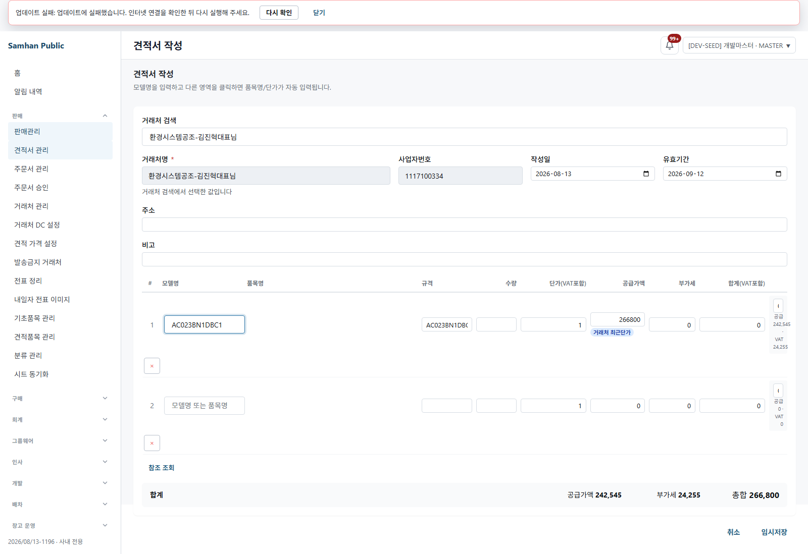
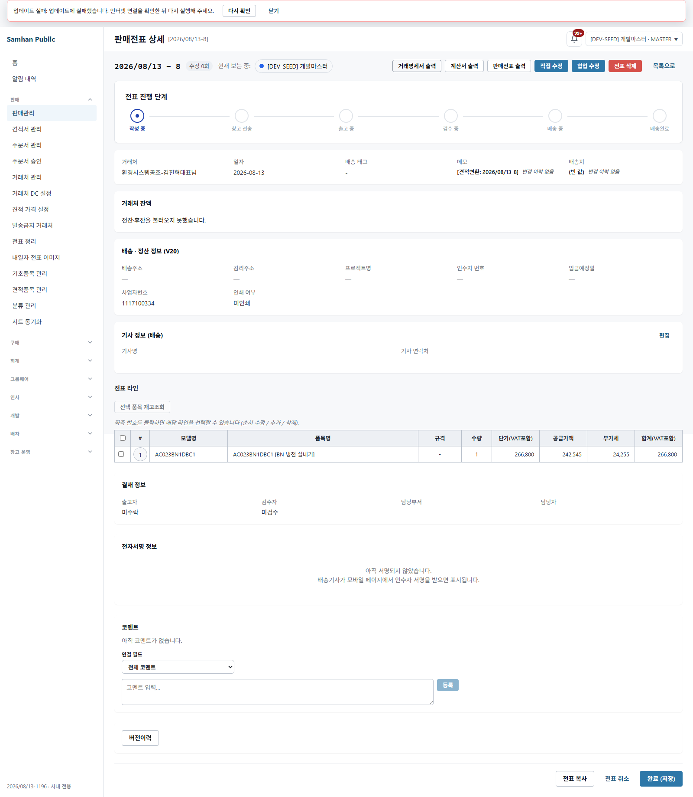
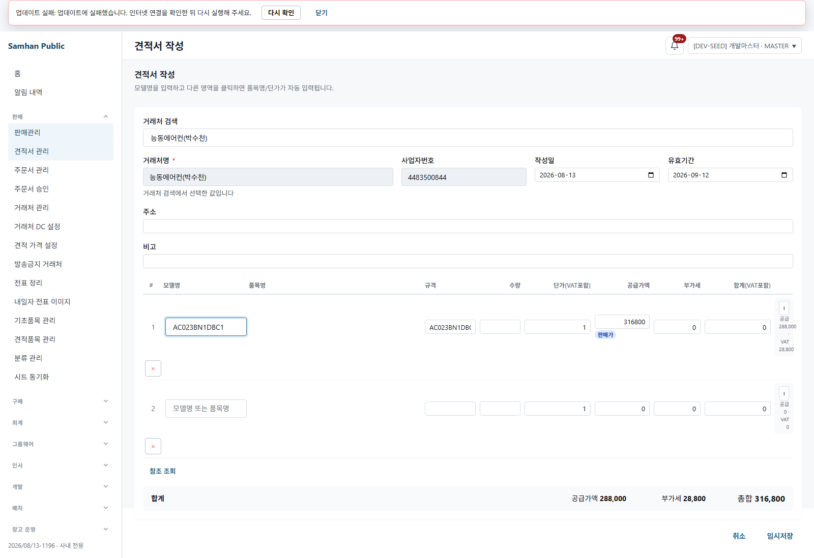

# PR #1196 적대검증 Live QA — CODEX SOL

## 1. 환경 확인

검증 시각: 2026-08-13 06:23~07:06 KST. 공유 `samhan-postgres`에는 쓰지 않았고, 필요한 DB를 `sol1196-pg`로 읽기 복제한 뒤 공유 네트워크에서 분리했다.

현재 소스 원문:

```text
HEAD
81e61678efabddd55ae0434eed9fcff9435f9b0e
fix/estimate-screen-partner-dc
2026-08-13T06:16:00+09:00 [FIX] 견적 화면에 거래처 DC 가 안 실린다 — 신규 견적만 적용 (소급 없음)

HEAD 변경 파일
clients/desktop/src/renderer/routes/EstimateFormPage.coedit.test.tsx
clients/desktop/src/renderer/routes/EstimateFormPage.tsx
clients/desktop/src/renderer/utils/estimatePrice.test.ts
clients/desktop/src/renderer/utils/estimatePrice.ts
docs/dev-reports/2026-08-13-estimate-dc-fix-luna.md
```

현재 HEAD renderer 프로덕션 빌드 원문:

```text
vite v5.4.21 building for production...
✓ 746 modules transformed.
✓ built in 6.92s
BUILD_STARTED=2026-08-13T06:25:16.654+09:00
BUILD_FINISHED=2026-08-13T06:25:36.334+09:00
BUILD_HEAD=81e61678efabddd55ae0434eed9fcff9435f9b0e
dist/web/index.html SHA256=1FE84DCE3502328B715CAC597D0FA5417509F95BA790B250DF6F8BD9406454EF
assets/index-DAfqG-V8.js SHA256=28C2457AE93913BE20A6E1A1BFBC2778F7A4F6C40C38D380C88522787A2FB07C
```

Live QA renderer는 같은 HEAD 소스를 Vite 실서버(`127.0.0.1:5296`, 시작 06:34:12 KST)로 실행했다. Playwright Chromium은 `147.0.7727.15`였다. 전표와 DC 서비스는 판정 직전 현재 HEAD에서 `bootJar`와 컨테이너 이미지를 다시 만들었다.

컨테이너 상태 원문(최종 라운드 직전):

```text
sol1196-dc|Up (healthy)|sol1196-head-dc:81e61678
sol1196-slip|Up (healthy)|sol1196-head-slip:81e61678
sol1196-product|Up (healthy)|sol1163-fix3-product-service:latest
sol1196-partner|Up (healthy)|sol1163-fix3-partner-service:latest
sol1196-dashboard|Up (healthy)|infrastructure-dashboard-service
sol1196-notification|Up (healthy)|infrastructure-notification-service
sol1196-eureka|Up (healthy)|sol1163-fix3-eureka-server:latest
sol1196-web|Up|nginx:1.27-alpine
sol1196-auth|Up (healthy)|sol1163-fix3-auth-service:latest
sol1196-rabbit|Up|rabbitmq:3-alpine
sol1196-redis|Up|redis:7-alpine
sol1196-pg|Up|postgres:16-alpine
```

PR 변경 대상 renderer와 판정에 직접 관여하는 slip/DC만 현재 HEAD로 재빌드했다. 나머지는 이 커밋에서 변경되지 않은 지원 서비스 이미지다.

## 2. 결론

**실 사용자가 화면에서 밟는 경로로 재현 가능한 결함은 2건이다.**

1. 견적 → 전표 변환은 200으로 성공하지만 변환된 견적 상세에 전표 이동 링크가 생기지 않는다. 사용자는 `판매관리`로 돌아가 새 전표를 선택한 뒤 `수정`을 눌러야 상세에 들어갈 수 있다.
2. UUID 비공개 계약을 위반한다. 화면 본문 텍스트에는 UUID가 없었지만, 판매관리에서 생성 전표를 선택해 수정하면 브라우저 URL이 raw UUID가 되고 전표 상세/협업 요청 URL 및 여러 API 응답에도 raw UUID가 포함된다.

DC 금액 자체, 기존 견적 소급 방지, 전표 변환 금액 및 이중 할인은 모두 재현에 성공했다.

## 3. 화면 실측과 값 획득 경로

계산 함수를 직접 호출하지 않았다. 화면의 거래처 자동완성 → 품목 입력 → 화면 단가/합계 → 임시저장 → 견적 상세 → 전표 변환을 사용했다.

| 항목 | 화면 실측 | 값을 얻은 네트워크 경로 | 결과 |
|---|---:|---|---|
| DC 거래처 신규 견적 | 316,800원 기준 품목이 **266,800원** | 거래처 검색 200 → `GET /api/v1/partner-dc-configs/1117100334` 200 → 상품 검색/lookup 200 → 화면 단가·합계 → `POST /slips/estimates` 201 | 재현 |
| DC 없는 거래처 | **316,800원** | 거래처 검색 200 → DC config 404(설정 없음 계약) → 상품 검색/lookup 200 → 화면 단가·합계 | 재현 |
| 저장된 신규 견적 | **266,800원** | 저장 201 → 공개 ID 기반 견적 상세 GET 200 | 재현 |
| 견적 → 전표 | 변환 POST 200, 전표 상세 **266,800원** | 변환 POST 200 → 견적 상세 재조회 200 → 링크 부재 → 판매관리 목록 GET 200 → 행 선택/수정 → 전표 상세 GET 200 | 금액 재현, 링크 결함 |
| 이중 DC | 전표 단가/총합 **266,800원**, 화면에 316,800원 없음 | 전표 상세 화면과 격리 DB 전표 라인 대조 | 재현 없음(정상) |

격리 DB 원문:

```text
existing_headers|5|7215000|2026-08-07 19:24:17.902025
existing_lines|16
2026/08/13-8|266800|QUOTE_CONVERTED|2026/08/13-8|DRAFT|266800|242545|24255|266800
```

마지막 행은 `견적번호|견적합계|견적상태|전표번호|전표상태|전표라인합계|공급가액|VAT|단가`다. 저장 견적 266,800원이 전표 라인 266,800원으로 1:1 복사됐다.

## 4. 기존 견적 5건

각 견적 상세를 화면으로 직접 열었다.

| 견적번호 | 화면 총합 | DB modified_at |
|---|---:|---|
| 2026/08/07-1 | 3,233,000원 | 2026-08-07 12:16:13.466186 |
| 2026/08/07-2 | 1,912,000원 | 2026-08-07 13:07:44.849890 |
| 2026/08/07-4 | 690,000원 | 2026-08-07 17:17:52.311580 |
| 2026/08/07-5 | 690,000원 | 2026-08-07 18:16:18.740321 |
| 2026/08/07-12 | 690,000원 | 2026-08-07 19:24:17.902025 |

헤더 5건 합계 7,215,000원, 라인 16건이며 QA 중 기존 견적의 modified_at 변경이 없었다. 소급 계산·기존 견적 DB 쓰기는 관찰되지 않았다.

## 5. 협업 요청 확인

현재 HEAD 전표 서비스로 재검증한 최종 라운드에서 `comments`, `presence`, `presence/join`, `presence/leave`, `stream`은 신규 견적과 기존 5건 모두 HTTP 200이었다. 전표 상세의 `comments`, `presence`, `stream`, `realtime`, `redline`도 200이었다. **400·403·404·500은 0건**이다.

SSE `stream`/`realtime`은 먼저 200 handshake가 관찰됐고 다음 화면으로 이동할 때 열린 연결이 `FAILED(net::ERR_FAILED)`로 닫혔다. 이는 HTTP 오류 응답으로 세지 않았다. `edits`와 견적 `revision` 요청은 이 화면 세션에서 발생하지 않았다.

## 6. 관찰 네트워크 전수 표

최종 Playwright 라운드의 API-origin 응답/실패 이벤트 102건을 method + 정규화 경로 + status로 묶었다. 횟수 합계는 102다. 실제 UUID 값은 문서에 재노출하지 않고 `{UUID}`로 치환했다.

| 횟수 | Method | 경로 | Status |
|---:|---|---|---:|
| 1 | GET | `/accounting/journals/sales-slip-ledger?partnerCode=1117100334&from=2026-08-13&to=2026-08-13&slipNo=2026%2F08%2F13-8` | 200 |
| 1 | GET | `/admin/partners/search?q=능동에어컨&page=0&size=8` | 200 |
| 1 | GET | `/admin/partners/search?q=환경시스템공조&page=0&size=8` | 200 |
| 1 | GET | `/api/notifications/my` | 200 |
| 1 | POST | `/api/products/lookup` | 200 |
| 2 | GET | `/api/products?q=AC023BN1DBC1&size=50&usageScope=ESTIMATE` | 200 |
| 1 | GET | `/api/v1/partner-dc-configs/1117100334` | 200 |
| 1 | GET | `/api/v1/partner-dc-configs/4483500844` | 404 |
| 1 | GET | `/api/v1/slips/{UUID}/audit-logs` | 200 |
| 1 | GET | `/api/v1/slips/{UUID}/collab/comments?limit=20` | 200 |
| 2 | GET | `/api/v1/slips/{UUID}/collab/presence` | 200 |
| 1 | POST | `/api/v1/slips/{UUID}/collab/presence/join` | 200 |
| 1 | POST | `/api/v1/slips/{UUID}/collab/presence/leave` | 200 |
| 2 | GET | `/api/v1/slips/{UUID}/collab/stream` | 200 |
| 2 | GET | `/api/v1/slips/{UUID}/collab/stream` | FAILED |
| 1 | GET | `/api/v1/slips/{UUID}/realtime` | 200 |
| 1 | GET | `/api/v1/slips/{UUID}/realtime` | FAILED |
| 1 | GET | `/api/v1/slips/{UUID}/redline` | 200 |
| 1 | GET | `/api/v1/slips/estimates/{공개ID}/collab/comments?limit=20` | 200 |
| 2 | GET | `/api/v1/slips/estimates/{공개ID}/collab/presence` | 200 |
| 1 | POST | `/api/v1/slips/estimates/{공개ID}/collab/presence/join` | 200 |
| 2 | POST | `/api/v1/slips/estimates/{공개ID}/collab/presence/leave` | 200 |
| 2 | GET | `/api/v1/slips/estimates/{공개ID}/collab/stream` | 200 |
| 2 | GET | `/api/v1/slips/estimates/{공개ID}/collab/stream` | FAILED |
| 5 | GET | `/api/v1/slips/estimates/{기존견적번호}/collab/comments?limit=20` | 200 |
| 10 | GET | `/api/v1/slips/estimates/{기존견적번호}/collab/presence` | 200 |
| 5 | POST | `/api/v1/slips/estimates/{기존견적번호}/collab/presence/join` | 200 |
| 9 | POST | `/api/v1/slips/estimates/{기존견적번호}/collab/presence/leave` | 200 |
| 10 | GET | `/api/v1/slips/estimates/{기존견적번호}/collab/stream` | 200 |
| 8 | GET | `/api/v1/slips/estimates/{기존견적번호}/collab/stream` | FAILED |
| 1 | GET | `/app/notices/active` | 200 |
| 1 | GET | `/app/version?clientType=DESKTOP&currentVersion=2026%2F08%2F13-1196` | 404 |
| 1 | GET | `/auth/admin/permissions/my` | 200 |
| 1 | GET | `/inventory/warehouses` | 200 |
| 1 | POST | `/logs/front` | 405 |
| 2 | GET | `/slips/{UUID}` | 200 |
| 1 | POST | `/slips/estimates` | 201 |
| 2 | GET | `/slips/estimates/{공개ID}` | 200 |
| 1 | POST | `/slips/estimates/{공개ID}/convert` | 200 |
| 5 | GET | `/slips/estimates/{기존견적번호}` | 200 |
| 3 | GET | `/slips/lookup-product?modelName=AC023BN1DBC1` | 200 |
| 2 | GET | `/slips/price-memory?partnerId={UUID}&productId={UUID}` | 200 |
| 1 | GET | `/slips/price-memory?partnerId={UUID}&productId={UUID}` | 204 |
| 1 | GET | `/slips/query?slipType=OUTBOUND&dateFrom=2026-07-29&dateTo=2026-08-28&page=0&size=50` | 200 |

DC 없는 거래처의 config 404는 “설정 없음”을 뜻하는 정상 fallback이다. `/app/version` 404와 `/logs/front` 405는 아래 범위 밖에 적은 최소 격리 프록시의 지원 서비스 한계다.

## 7. UUID 검사

| 표면 | 결과 |
|---|---|
| 화면 본문 텍스트 | UUID 0 |
| 브라우저/요청 URL | UUID 노출: 판매관리 선택 전표 상세 route, 전표 상세/협업 API, price-memory query |
| JSON API 응답 | UUID 노출: 거래처/품목/가격기억/판매전표 목록·상세 등 |

특히 변환 링크가 없어 판매관리 목록에서 생성 전표를 선택하고 수정하는 실제 우회 경로가 `#/sales/{raw UUID}`로 이동했다. 따라서 요구된 “화면·URL·API 응답 UUID 0”은 재현되지 않았다.

## 8. 테스트 수치와 증거 무결성

```text
✓ EstimateFormPage.coedit.test.tsx (57 tests)
✓ estimatePrice.test.ts (5 tests)
✓ usePartnerPriceRefresh.test.ts (10 tests)
✓ SlipFormPage.test.tsx (103 tests)
Test Files 4 passed (4)
Tests 175 passed (175)
```

- 주문 화면 103/103: 재현.
- 요청문에 적힌 관련 테스트 165/165: **재현되지 않음**. 실제는 175/175다.
- 대상 보고서 본문 자체는 175/175라고 적혀 있어 그 본문 수치는 재현된다. 즉 165는 요청문/다른 요약의 수치 불일치다.

## 9. 스크린샷

1. `01-current-head-new-estimate.png` — 현재 HEAD 신규 견적 진입
2. `02-dc-new-266800.png` — DC 거래처 신규 견적 266,800원
3. `03-dc-saved-266800.png` — 저장된 견적 266,800원
4. `04-converted-slip-266800-no-double.png` — 판매관리 우회 후 전표 상세 266,800원
5. `05-no-dc-316800.png` — DC 없는 거래처 316,800원
6. `06-existing-2026-08-07-1.png` — 기존 견적 3,233,000원
7. `07-existing-2026-08-07-2.png` — 기존 견적 1,912,000원
8. `08-existing-2026-08-07-4.png` — 기존 견적 690,000원
9. `09-existing-2026-08-07-5.png` — 기존 견적 690,000원
10. `10-existing-2026-08-07-12.png` — 기존 견적 690,000원

핵심 캡처:







## 10. 도달 가능한 결함과 범위 밖

도달 가능한 결함:

1. 변환 성공 후 견적 상세에 변환 전표 링크가 없다. 변환 직후 상세 GET 응답에도 `convertedSlipId`/`convertedSlipNo`가 없었다.
2. 판매관리 우회 경로와 API 계약에서 UUID가 노출된다.

범위 밖으로 남긴 것:

- 최소 격리 스택의 구형 dashboard 지원 이미지가 `/app/version`을 제공하지 않아 화면 상단 업데이트 실패 배너가 보였다. PR #1196 결함으로 세지 않았다.
- 격리 프록시에 audit-log 서비스를 붙이지 않아 `/logs/front`가 405였다. 사용자 요청의 견적/DC/변환 판정과 분리해 결함으로 세지 않았다.
- SSE가 화면 이동 시 닫히며 남긴 `FAILED` 이벤트는 200 handshake 뒤의 브라우저 취소다.
- 모바일/다른 브라우저, 인쇄, 공유 운영 DB는 보지 않았다.

