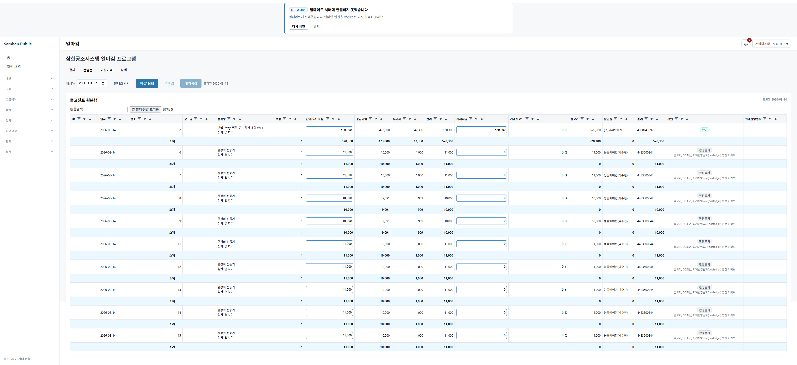
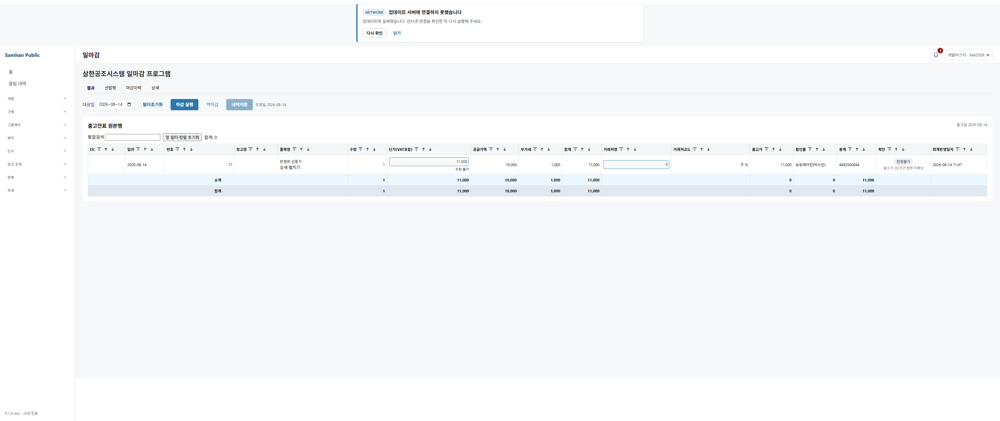
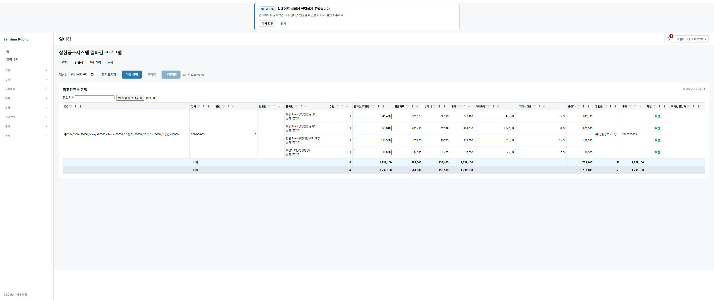
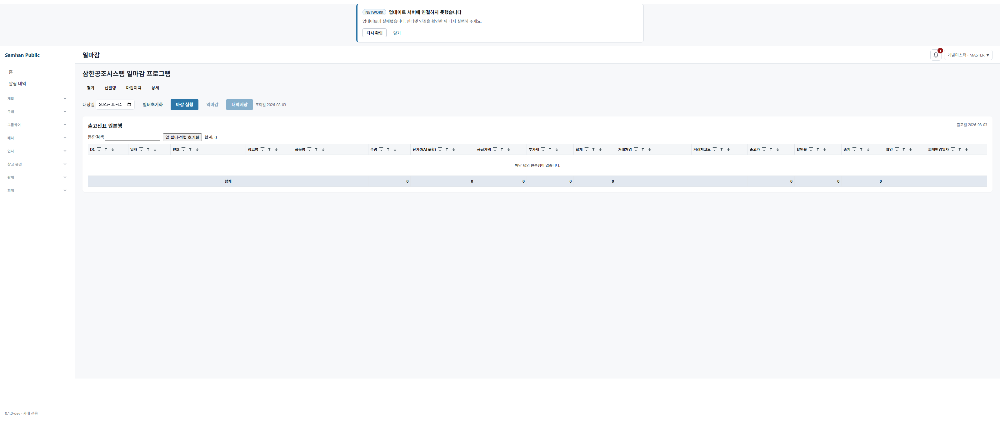

# 일마감 레거시 동등성 전수 정찰

- 정찰일: 2026-08-17 KST
- 대상: 현행 `/#/accounting/daily-closings`, `tools/legacy-gas/일마감 프로그램`
- 조건: 제품 코드·공유 DB·공유 컨테이너 변경 없음. API/DB 조회는 읽기 전용.

## ① 한 장 요약

### 숫자로 먼저 답

| 항목 | 실측 결과 |
|---|---:|
| 현행 주표 헤더 | 17열 |
| 헤더와 실제 값이 일치하는 열 | **12열** |
| 헤더와 실제 값이 어긋난 열 | **5열** |
| 2026-08-14 13행에서 전건 공란인 원천 열 | **2열** (`DC`, `창고명`) |
| 2026-08-14 화면/API 행 | **13행** (`결과` 1 + `선발행` 12) |
| 2026-08-03 화면/API 행 | **4행** (`결과` 0 + `선발행` 4) |
| GAS 행동 22개 중 현행에 없는 것 | **12개** |
| GAS 행동과 일부만 같거나 의미가 다른 것 | **2개** |
| 2026-08-15 확정 추가 행동까지 포함한 현행 부재 | **14개** (위 12개 + 매출전표 생성 + 매입전표 생성) |

어긋난 다섯 열은 연속된 11~15번 열이다.

| 화면 헤더 | 그 아래 실제로 놓인 값 |
|---|---|
| 거래처명 | 출고가 |
| 거래처코드 | 할인율 |
| 출고가 | 총계 |
| 할인율 | 거래처명 |
| 총계 | 거래처코드 |

원인은 헤더 배열이 아니라 `<td>` 생성 순서다. 헤더는 레거시와 같은 17개 순서로 선언돼 있지만(`DailyClosingPage.tsx:348`), 행은 6~9번 금액 뒤에 12~14번 금액을 먼저 렌더하고(`:612-627`), 그 다음 거래처명·거래처코드를 붙인다(`:1086-1088`). 라이브 DOM의 x좌표와 각 셀 `data-testid`를 함께 대조해 같은 결과를 확인했다.

금액 예시는 2026-08-03 번호 6 첫 행이다. 실제 출고가 `475,200`은 화면의 `거래처명` 아래에 있고, 화면의 `출고가` 아래에는 총계 `641,480`이 있다. 두 값의 차이는 `166,280`이다. 같은 전표 둘째 행은 실제 출고가 `1,023,000` 대 화면 `출고가` `963,040`, 셋째 행은 `215,600` 대 `118,580`이다.

## ② 열별 정합표

값 예시는 2026-08-14 `선발행`의 첫 3행(번호 2·6·7)을 화면의 실제 x축 열 기준으로 읽었다. `∅`는 화면 공란이다. “출처”는 **현재 그 시각적 열 아래 놓인 값의 출처**다.

| 번호 | 헤더 | 실제 값 예시 3개 | 정합 | 현재 시각 열의 값 출처 |
|---:|---|---|---|---|
| 1 | DC | `∅` / `∅` / `∅` | 정합, 원천 부재 | `dc_config_db.partners.partner_code → dc_configs.*`를 문자열로 조합 |
| 2 | 일자 | `2026-08-14` / `2026-08-14` / `2026-08-14` | 정합 | `slip_db.slips.slip_date` |
| 3 | 번호 | `2` / `6` / `7` | 정합 | `slip_db.slips.seq_no` |
| 4 | 창고명 | `∅` / `∅` / `∅` | 정합, 응답 고정 공란 | DTO가 `null`을 넣음. 후보는 `slips.destination_warehouse_name` 또는 `source_warehouse_code` |
| 5 | 품목명 | `판넬 1way 무풍+공기청정 대형 WIFI` / `한경희 선풍기` / `한경희 선풍기` | 정합 | `slip_db.slip_lines.product_name` |
| 6 | 수량 | `1` / `1` / `1` | 정합 | `slip_db.slip_lines.quantity` |
| 7 | 단가(VAT포함) | `520,300` / `11,000` / `11,000` | 정합 | `slip_db.slip_lines.unit_price_with_vat` |
| 8 | 공급가액 | `473,000` / `10,000` / `10,000` | 정합 | `slip_db.slip_lines.supply_amount` |
| 9 | 부가세 | `47,300` / `1,000` / `1,000` | 정합 | `slip_db.slip_lines.vat_amount` |
| 10 | 합계 | `520,300` / `11,000` / `11,000` | 정합 | 응답에서 `supply_amount + vat_amount` |
| 11 | 거래처명 | `520,300` / `0` / `0` | **불일치** | 실제로는 출고가: `slip_lines.daily_closing_release_price`, 없으면 `product_db.price_history.release_price`; NULL은 화면에서 `0` |
| 12 | 거래처코드 | `0` / `0` / `0` | **불일치** | 실제로는 할인율: `slip_lines.daily_closing_discount_rate`, 없으면 단가/출고가 파생; NULL은 화면에서 `0` |
| 13 | 출고가 | `520,300` / `11,000` / `11,000` | **불일치** | 실제로는 총계: `unit_price_with_vat × quantity` |
| 14 | 할인율 | `(주)이레솔루션` / `능동에어컨(박수천)` / `능동에어컨(박수천)` | **불일치** | 실제로는 `slip_db.slips.partner_name` |
| 15 | 총계 | `4038141892` / `4483500844` / `4483500844` | **불일치** | 실제로는 `slip_db.slips.partner_code` |
| 16 | 확인 | `확인` / `판정불가(원천 미확보)` / `판정불가(원천 미확보)` | 정합(현행 판정 의미) | 조회 시 파생. 출고가가 양수면 `CONFIRMED`, 아니면 `UNDETERMINED` (`DailyClosingRowResponse.java:80-91`) |
| 17 | 회계반영일자 | `∅` / `∅` / `∅` | 정합, 원천 부재 | `accounting_db.sales_accounting_slip_allocations.source_slip_no → sales_accounting_slip_lines → sales_accounting_slips.posted_at` |

### 열 어긋남이 금액에 미치는 실제 예

| 날짜·번호·행 | 실제 출고가(현재 `거래처명` 아래) | 화면 `출고가` 아래 값(실제 총계) | 차이 |
|---|---:|---:|---:|
| 2026-08-03 · 6 · 실내기 | 475,200 | 641,480 | +166,280 |
| 2026-08-03 · 6 · 실외기 | 1,023,000 | 963,040 | -59,960 |
| 2026-08-03 · 6 · 판넬 | 215,600 | 118,580 | -97,020 |

2026-08-14 번호 2는 출고가와 총계가 우연히 모두 `520,300`이어서 헤더 오류가 숫자만 보면 드러나지 않는다. 같은 행에서 `할인율` 아래 거래처명, `총계` 아래 거래처코드가 보이므로 배치 오류는 그대로 존재한다.

## ③ 레거시 ↔ 현행 열 대조표

레거시 서버 최종 열은 `Code.js:11-14`, 브라우저 열은 `Index.html:207-208`에 같은 순서로 선언돼 있다. 현행 헤더도 `DailyClosingPage.tsx:348-350`에서 동일하다. 따라서 **헤더 문구만 놓고 보면 레거시 전용 열 0, 현행 전용 주표 열 0, 순서 차이 0**이다. 차이는 현행 행 데이터의 렌더 순서다.

| 순번 | 레거시 열 | 현행 헤더 | 현행 시각 내용 | 대조 |
|---:|---|---|---|---|
| 1 | DC | DC | DC | 같음 |
| 2 | 일자 | 일자 | 일자 | 같음 |
| 3 | 번호 | 번호 | 번호 | 같음 |
| 4 | 창고명 | 창고명 | 창고명(공란) | 이름 같음, 현행 값 없음 |
| 5 | 품목명 | 품목명 | 품목명 | 같음 |
| 6 | 수량 | 수량 | 수량 | 같음 |
| 7 | 단가(VAT포함) | 단가(VAT포함) | 단가(VAT포함) | 같음 |
| 8 | 공급가액 | 공급가액 | 공급가액 | 같음 |
| 9 | 부가세 | 부가세 | 부가세 | 같음 |
| 10 | 합계 | 합계 | 합계 | 같음 |
| 11 | 거래처명 | 거래처명 | **출고가** | 이름 같고 내용 다름 |
| 12 | 거래처코드 | 거래처코드 | **할인율** | 이름 같고 내용 다름 |
| 13 | 출고가 | 출고가 | **총계** | 이름 같고 내용 다름 |
| 14 | 할인율 | 할인율 | **거래처명** | 이름 같고 내용 다름 |
| 15 | 총계 | 총계 | **거래처코드** | 이름 같고 내용 다름 |
| 16 | 확인(Boolean) | 확인 | 현행 enum 배지와 사유 | 위치는 같고 의미·편집 방식 다름 |
| 17 | 회계반영일자 | 회계반영일자 | 회계반영일자 | 위치 같음, 현행 읽기 전용 |

현행에만 주표 밖 “상세 펼치기” 6칸(`모델·카테고리·기준 납품가·기대율·DC액·확인 사유`)이 있다(`DailyClosingPage.tsx:1098-1106`). 레거시는 이 여섯 칸을 표시 열로 두지 않고 모델·구분·납품가·고정DC를 계산 입력으로만 사용해 최종 `확인` Boolean을 만들었다(`Code.js:668-735`).

레거시 입력 원천은 구형/홈멀티/상업멀티/상업멀티 구성/싱글 세트/싱글 구성품 판매 시트다. 가격 맵은 모델명·품명·출고가·납품가·고정DC를 읽고(`Code.js:270-347`), 싱글 구성은 모델명·세트·구분·납품가를 읽는다(`Code.js:215-266`). 물리 SKU 기초품목 원장을 직접 읽는 경로는 없다.

## ④ 스키마 매핑과 채움률

### ④-1. 화면이 실제로 읽는 경로

1. `DailyClosingQueryService`는 대상일의 `OUTBOUND` 전표 중 `CONFIRMED·DELIVERED·COMPLETED`만 조회한다(`DailyClosingQueryService.java:21-43`).
2. 기본 행은 `slip_db.slips`와 `slip_db.slip_lines`에서 조립한다.
3. 출고가는 `slip_lines.product_id` UUID와 전표일로 product-service의 적용 가격 이력을 조회한다(`DailyClosingSourceResolver.java:22-25`, `ProductPriceHistoryClient.java:23-37`). product-service는 활성 `products.id` 확인 후 `price_history`를 찾는다.
4. DC는 거래처코드로 `dc_config_db.partners → dc_configs`를 조회해 설명 문자열로 만든다(`DcConfigReadClient.java:23-65`).
5. 회계반영일자는 전표번호로 `sales_accounting_slip_allocations → sales_accounting_slip_lines → sales_accounting_slips.posted_at`을 읽는다(`AccountingPostedAtClient.java:23-34`, `SalesAccountingSlipAllocationRepository.java:29-41`).
6. `accounting_db.daily_closings`는 마감이력/잠금 목록용이며 17열 원본행의 직접 원천은 아니다.

### ④-2. 2026-08-14 대상 13행 채움률

모든 DB 쿼리는 `BEGIN READ ONLY ... ROLLBACK`으로 실행했다.

| 화면/확장 필드 | API 채움 | DB 원천 채움 | 근거와 관측 |
|---|---:|---:|---|
| 일자 | 13/13 | 13/13 | `slips.slip_date` |
| 번호 | 13/13 | 13/13 | `slips.seq_no` |
| 창고명 | 0/13 | 이름 0/13, 코드 13/13 | `destination_warehouse_name` 0/13, `source_warehouse_code` 13/13이나 DTO는 `null` 고정(`DailyClosingRowResponse.java:93-100`) |
| 품목명 | 13/13 | 13/13 | `slip_lines.product_name` |
| 모델 | 13/13 | 13/13 | `slip_lines.model_name`; 현재 API에는 포함됨 |
| 수량 | 13/13 | 13/13 | `slip_lines.quantity` |
| VAT포함 단가 | 13/13 | 13/13 | `slip_lines.unit_price_with_vat` |
| 공급가액 | 13/13 | 13/13 | `slip_lines.supply_amount` |
| 부가세 | 13/13 | 13/13 | `slip_lines.vat_amount` |
| 합계 | 13/13 | 13/13 | 공급가액+부가세 파생 |
| 거래처명 | 13/13 | 13/13 | `slips.partner_name`; 화면에서는 14번 열로 밀림 |
| 거래처코드 | 13/13 | 13/13 | `slips.partner_code`; 화면에서는 15번 열로 밀림 |
| 출고가 | 1/13 | 저장 스냅샷 0/13, 적용 가격이력 1/13 | `slip_lines.daily_closing_release_price` 또는 `price_history.release_price`; 화면에서는 11번 열로 밀림 |
| 할인율 | 1/13 | 저장 스냅샷 0/13 | 출고가가 있는 1행만 파생; 화면에서는 12번 열로 밀림 |
| 총계 | 13/13 | 13/13 파생 가능 | `unit_price_with_vat × quantity`; 화면에서는 13번 열 |
| DC | 0/13 | dc-config 거래처/설정 0/13 | 대상 거래처코드가 `dc_config_db.partners`에도 0/13 |
| 회계반영일자 | 1/13 | allocation 1/13, posted 1/13 | 결과 1행만 값 존재 |
| 카테고리(확장) | 0/13 | 전표 스냅샷 0/13, 유효 견적노출 1/13 | `slip_lines.category_key` 0/13; `product_estimate_exposure`는 행 가중 1/13이나 현행 조회가 읽지 않음 |
| 기준 납품가(확장) | 0/13 | 적용 가격이력 1/13 | `price_history.delivery_price` 1/13이나 현재 client는 응답의 `release`만 취함 |
| 기대율(확장) | 0/13 | 정확한 값 0/13 | 대상 제품 고정DC 0/13, dc-config 0/13 |
| DC액(확장) | 1/13 | 1/13 파생 가능 | 출고가−VAT포함 단가 |
| 확인 사유(확장) | 12/13 | 저장 컬럼 없음 | 조회 시 생성. 출고가가 있는 1행은 DC/회계 원천 누락이 있어도 사유가 지워짐 |

### ④-3. 관련 테이블·컬럼 전수 목록

| DB | 테이블 | 이 화면이 읽는/관련 있는 컬럼 |
|---|---|---|
| `slip_db` | `slips` | `id`, `slip_type`, `slip_no`, `slip_date`, `seq_no`, `status`, `partner_name`, `partner_code`, `destination_warehouse_name`, `source_warehouse_code`, `is_deleted`, 감사/수정 시각 |
| `slip_db` | `slip_lines` | `slip_id`, `product_id`, `product_name`, `model_name`, `quantity`, `unit_price_with_vat`, `supply_amount`, `vat_amount`, `line_total`, `category_key`, `daily_closing_release_price`, `daily_closing_discount_rate`, `is_deleted` |
| `accounting_db` | `daily_closings` | `closing_date`, `partner_id`, `total_supply`, `total_vat`, `total_amount`, `slip_count`, `is_locked`, `locked_at`, `closing_kind`, `source_kind`, `is_deleted` |
| `accounting_db` | `sales_accounting_slip_allocations` | `source_slip_no`, `sales_slip_line_id`, `is_deleted` |
| `accounting_db` | `sales_accounting_slip_lines` | `id`, `slip_id`, `is_deleted` |
| `accounting_db` | `sales_accounting_slips` | `id`, `posted_at`, `is_deleted` |
| `product_db` | `products` | `id`, `model_name`, `product_code`, `category_id`, `release_price`, `delivery_price`, `fixed_discount_rate`, `has_variable_discount`, `product_category`, `cat_l_id`, `cat_m_id`, `cat_s_id`, `is_deleted` |
| `product_db` | `price_history` | `product_id`, `effective_date`, `release_price`, `delivery_price`, `is_deleted` |
| `product_db` | `product_estimate_exposure` | `product_id`, `estimate_category`, `is_deleted` — **현행 일마감 원본 조회는 미사용** |
| `product_db` | `classification` | `estimate_category`, `cat_level`, `fixed_discount_rate`, `is_deleted` — **현행 일마감 원본 조회는 미사용** |
| `product_db` | `categories` | `id`, `code`, `name`, `is_deleted` — **현행 일마감 원본 조회는 미사용** |
| `product_db` | `bundle_component` | `bundle_product_id`, `component_product_code`, `context_release_price`, `context_delivery_price`, `is_deleted` — **현행 일마감 원본 조회는 미사용** |
| `dc_config_db` | `partners` | `id`, `partner_code`, `is_deleted` |
| `dc_config_db` | `dc_configs` | `partner_id`, 홈/상업 할인율, 여섯 고정 차감액, 유연호스/단위처리, 메모, `is_deleted` |

대상 13행의 `slip_lines.product_id → product_db.products.id` 활성 조인은 13/13이다. 다만 이는 기초품목 UUID 조인이다. 견적 노출 `product_estimate_exposure`가 있는 행은 1/13뿐이고, 현행 일마감은 그 테이블이나 견적 `/products·/components` API를 호출하지 않는다. 레거시가 판매/견적 시트에서 숨은 계산 입력을 읽은 경로와 현재 조회 경로가 다르다.

`accounting_db.daily_closings`에는 2026-08-14 행이 1건 있으나 `slip_count=0`, 공급가·부가세·합계가 모두 0이고 `SALES/TAX_INVOICE` 범위다. 17열 원본행 13건을 저장한 테이블이 아니다.

## ⑤ 레거시 기능 유무표

아래 22개는 GAS 소스의 행동 단위다. 집계는 **같음 8, 일부/의미 다름 2, 없음 12**다.

| 번호 | 레거시 행동 | 현행 | 동작 비교·근거 |
|---:|---|---|---|
| 1 | 엑셀 업로드 후 처리 실행 | 없음 | 현행은 DB 전표를 날짜로 직접 조회. 입력·재처리 흐름이 다름 (`Index.html:126-144,852-949`) |
| 2 | 결과·선발행·합산 3탭 | 일부 | 결과·선발행은 있음. 라이브 탭은 `결과·선발행·마감이력·상세`; `합산` 없음 (`Index.html:210-213`, 현행 `DailyClosingPage.tsx:1583-1588`) |
| 3 | 구형/싱글/멀티 규칙으로 최종 확인 Boolean 계산 | 없음 | 현행 원본행은 출고가 존재 여부만으로 확인을 확정 (`Code.js:668-735`, 현행 DTO `:80-91`) |
| 4 | 모델·구분·납품가·고정DC 숨은 입력 | 없음 | 현행은 기초품목 UUID 가격이력만 읽고 견적노출/구성 API를 읽지 않음 |
| 5 | 멀티 할인율 적용/미적용 토글 | 없음 | 레거시 `Index.html:138-139`; 현행 대응 조작 없음 |
| 6 | 인상 전 가격 적용 토글 | 없음 | 레거시 `Index.html:820`; 현행 대응 조작 없음 |
| 7 | 전표 단위 rowspan 병합 | 있음 | 현행 `LEGACY_MERGE_COLS`와 병합 셀 사용 (`DailyClosingPage.tsx:349,907-919`) |
| 8 | 전표마다 소계행 | 있음 | 현행 각 그룹 끝 `소계` (`:1111-1117`) |
| 9 | 탭 전체 합계행 | 있음 | 현행 `tfoot` 합계 (`:1124`) |
| 10 | 셀 일반/Shift/Ctrl·Cmd/드래그 다중선택과 선택합계 | 있음 | 현행 선택 범위·합계 (`:805-856`) |
| 11 | 선택 셀 TSV 복사 | 있음 | 현행 `handleTableCopy` (`:857-869`) |
| 12 | 선택 셀 단일값/직사각형 붙여넣기 | 없음 | 레거시 `Index.html:482-634`; 현행 `onPaste` 경로 없음 |
| 13 | 17열 헤더 오름/내림 정렬 | 있음 | 현행 모든 헤더에 정렬 버튼 (`:1026-1027`) |
| 14 | 열별 필터·통합검색·초기화 | 있음 | 현행 exact/empty/not-empty/include/exclude와 통합검색 (`:779-790,989-1034`) |
| 15 | 단가·출고가·할인율 직접 편집 | 일부 | 세 입력은 있으나 11~15열 배치가 어긋나고, 레거시는 브라우저 스냅샷을 저장하지만 현행은 전표 단가를 변경 |
| 16 | 단가↔할인율↔출고가 양방향 계산 | 있음 | 현행 `onChange` 계산과 3개 입력 (`:429-490,591-627`) |
| 17 | 확인 Boolean 직접 TRUE/FALSE 편집 | 없음 | 레거시는 select (`Index.html:1128-1132`), 현행은 파생 배지 |
| 18 | 회계반영일자 더블클릭 편집 | 없음 | 레거시 `Index.html:636-765,1117-1123`; 현행 읽기 전용 |
| 19 | 표 이미지 복사 | 없음 | 레거시 `Index.html:822,1532-1537`; 현행 대응 버튼 없음 |
| 20 | 엑셀 저장 | 없음 | 레거시 `Index.html:823,1716-1929`; 현행 대응 버튼 없음 |
| 21 | 특이사항 행 추가·삭제·저장 | 없음 | 레거시 `Index.html:130,153-163,1666-1709`; 현행 대응 탭 없음 |
| 22 | 저장내역 조회·복원·자동복원 | 없음 | 레거시 `Index.html:131,169-171,1539-1638`; 현행 마감이력은 회계 마감 엔터티이며 표 스냅샷 복원 기능이 아님 |

2026-08-15 개발책임자 확정 행동을 별도로 대조하면 다음 두 개도 현행에 없다.

| 확정 행동 | 현행 |
|---|---|
| 출고전표마다 이 화면에서 매출전표 생성 | 없음. 일마감 화면에서 매출전표 생성 API/버튼 호출 0건 |
| 입고전표도 이 화면에서 매입전표 생성 | 없음. 현재 17열 원본 조회 자체가 `OUTBOUND`만 포함하고 입고 원본표·매입전표 생성 버튼 0건 |

## ⑥ 우선순위 분류

이 절은 해결안을 고르지 않고 관측된 차이를 요청된 네 종류로만 분류한다.

### 금액이 틀리게 나오는 것

1. `출고가` 헤더 아래 실제 총계가 표시된다. 2026-08-03에서 3행 모두 실제 출고가와 다르며 차이는 `+166,280`, `-59,960`, `-97,020`이다.
2. `총계` 헤더 아래 거래처코드가 표시되어 금액 열 역할을 하지 않는다.
3. 2026-08-14의 출고가 원천은 1/13만 존재한다. 나머지 12행 NULL이 `formatLegacyNumber` 때문에 `0`으로 평탄화되며, 그 0조차 `거래처명` 헤더 아래 보인다.
4. 현행 화면 편집식은 공급가/부가세를 VAT포함 단가 1개 기준으로 분리하지만 저장 도메인은 `단가×수량` 라인 합계 기준으로 분리한다. 이번 두 실측일은 수량이 모두 1이라 라이브 숫자 차이는 발생하지 않았고, 수량 2 이상에서는 코드식이 달라진다(`2026-08-16-daily-closing-legacy-feature-recon.md`, M-1).

### 데이터가 엉뚱한 열에 있는 것

연속 5열: `거래처명←출고가`, `거래처코드←할인율`, `출고가←총계`, `할인율←거래처명`, `총계←거래처코드`.

### 기능이 없는 것

GAS 행동 12개가 현행에 없고, 2026-08-15 확정 전표생성 2개까지 포함하면 14개다. 상세 목록은 ⑤ 표의 “없음” 행과 확정 행동 표에 있다.

### 표시만 다른 것

- 레거시 `확인`은 TRUE/FALSE select 하나이고, 현행은 `확인/불일치/판정불가` 배지와 사유다.
- 현행은 레거시에 표시하지 않던 확장 6칸을 상세 펼침으로 노출한다.
- 레거시 탭은 업로드·결과·선발행·합산·특이사항·저장내역이고, 현행 탭은 결과·선발행·마감이력·상세다.

## ⑦ 화면 캡처와 행 수

Playwright는 3200×1200 viewport로 실행해 17개 헤더가 한 장에 모두 보이게 캡처했다. 스펙은 `clients/desktop/playwright/2026-08-17-daily-closing-parity-recon-real-qa/`에 있고, 출력은 `resolveQaShotsDir()`를 거쳐 이 보고서의 `screenshots/`로 저장했다. 저장·편집·마감·역마감 요청은 보내지 않았다.

| 날짜 | API 행 | 결과 탭 | 선발행 탭 | 합계 |
|---|---:|---:|---:|---:|
| 2026-08-03 | 4 | 0 | 4 | 4 |
| 2026-08-14 | 13 | 1 | 12 | 13 |

기계 관측 원문은 `screenshots/live-observation.json`이다. 헤더 좌표, 셀 좌표, 셀의 원래 `data-testid`, 화면 텍스트, 탭별 행 수를 저장했으며 자격값·내부 UUID는 포함하지 않았다. 최종 재검증 Playwright 결과는 `1 passed (7.0s)`다.

## ⑧ 판단이 필요한 지점

아래는 선택하지 않고 충돌 지점만 남긴다.

1. 일마감의 견적품목 기준을 `product_estimate_exposure.estimate_category`, 상세 `classification`, 견적 구성 `/components` 중 어느 축으로 표현할지.
2. 13행 중 견적 노출이 없는 12행을 일마감 대상에서 어떻게 취급할지.
3. 한 제품이 두 견적 카테고리에 동시에 노출될 때 단일 카테고리 값을 어떻게 표현할지.
4. 기준 납품가로 현재 기초품목/가격이력의 `286,165` 계열과 레거시 판매 시트의 `388,000` 계열 중 어느 시점·원천을 사용할지.
5. `창고명`에 현재 13/13 있는 `source_warehouse_code`, 0/13인 `destination_warehouse_name`, 다른 창고명 조회 중 무엇을 대응시킬지.
6. 레거시 확인 Boolean 직접 편집과 현행 자동 enum/사유 중 어떤 업무 의미를 유지할지.
7. 레거시의 브라우저 스냅샷 저장·복원과 현행의 출고전표 원본 단가 변경이 같은 “내역저장”인지 별개 업무인지.
8. 출고가 변경 시 단가 유지(GAS·현행 화면 코드)와 단가 재계산(기존 결정문 문구) 중 어떤 계산 의미인지.
9. 수량 2 이상에서 공급가·부가세를 단가 1개 기준으로 나눌지, 라인 합계 기준으로 나눌지.
10. 합산 탭, 다중 붙여넣기, 확인/회계일 편집, 특이사항, 저장복원을 현행 일마감 범위에 각각 포함하는지.

## ⑨ 프로세스 회수

| 항목 | 결과 |
|---|---:|
| 조사 중 새로 기동한 컨테이너 | 0 |
| 조사 중 중지·재시작한 공유 컨테이너 | 0 |
| 최종 공유 컨테이너 | 24, 그대로 실행 중 |
| 조사 전용 Vite 잔여 프로세스 | 0 |
| 조사 전용 Playwright/Chromium 잔여 프로세스 | 0 |
| 조사 포트 5963 LISTENING | 0 |
| 임시 Playwright 결과·Vite 로그 잔여 | 0 |
| repo에 남긴 JAR·빌드 바이너리 | 0 |

회수한 조사 전용 Vite 프로세스 트리는 `cmd.exe` 2개와 `node.exe` 2개였다. Playwright worker와 Chromium은 테스트 종료 시 자체 종료됐고, 명령행·포트 기준 잔여를 다시 확인했다. 공유 스택에는 stop/restart 명령을 실행하지 않았다.
