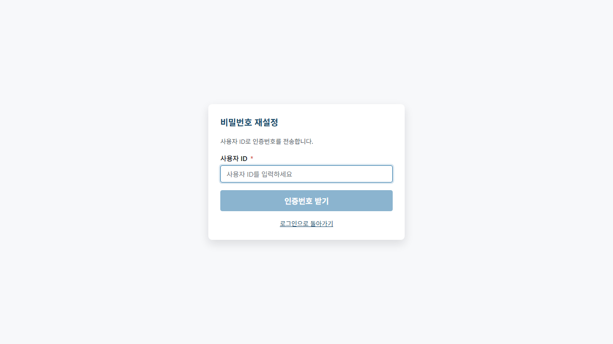
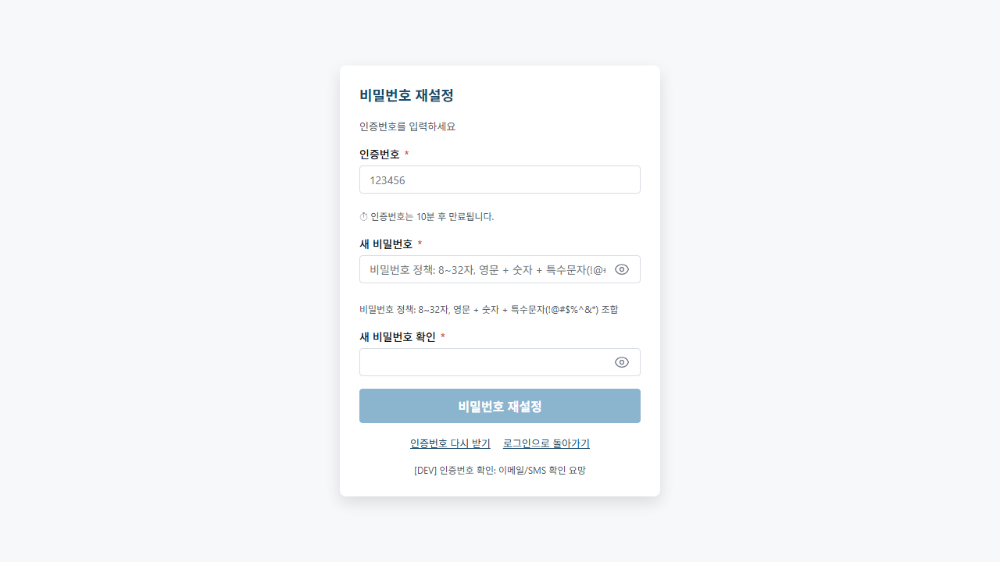

# 01. 로그인하기

> **Stage 안내**: Stage 1 ✅ (정식 본문) — Phase 12 step-6 본 PR 에서 7-section 패턴으로 재작성 + 신규 PNG inline.

---

## 1. 구현 상태

| 항목 | 상태 | 비고 |
| --- | --- | --- |
| 로그인 화면 | ✅ 운영 | desktop electron-vite + 모바일 공용 |
| ID/비밀번호 인증 | ✅ 운영 | `gateway` `/auth/login` |
| 비밀번호 재설정 (셀프) | ✅ 운영 | 로그인 화면 "비밀번호를 잊으셨나요?" 링크 |
| 5회 실패 잠금 | ✅ 운영 | 계정 잠금 정책 적용 |
| 자동 로그아웃 (30분) | ✅ 운영 | 보안 세션 정책 |
| 사용자 / 권한 관리 UI | ✅ 운영 | 관리자 메뉴 → 사용자 관리 (MASTER 전용) |

본 매뉴얼은 (주)삼한공조시스템 Samhan Public 시스템에 처음 접속하는 직원이 단계별로 따라할 수 있도록 안내합니다.

---

## 2. 대상 독자

- 처음 Samhan Public 시스템을 사용하는 모든 직원
- 영업(SALES) / 창고(WAREHOUSE) / 회계(ACCOUNTANT) / 배차(DISPATCH) / 기사(DRIVER) / 관리자(MASTER, MANAGER)
- 신입 입사자 / 외주 회계 담당 / 신규 IT 관리자 인수인계

---

## 3. 학습 내용

- Samhan Public 시스템 접속 방법 (사내 / 외부)
- 로그인 ID 와 비밀번호 입력 절차
- 첫 로그인 시 비밀번호 변경 흐름
- 비밀번호를 잊었을 때 셀프 재설정 절차 (이메일 인증번호)
- 로그인 실패 시 대처 방법 (잠금 / 초기화)
- 로그아웃 + 자동 세션 만료

---

## 4. 본문

### 4-1. 로그인 화면 접속

회사 PC 의 웹 브라우저(Edge / Chrome 권장)를 열고 아래 주소를 주소창에 입력합니다.

| 환경 | 주소 |
| --- | --- |
| 사내(개발) | `http://localhost:8080` |
| 사내(운영) | `http://[회사 내부 IP]:8080` 또는 `https://app.samhan-air.com` |
| 외부(원격) | IT 관리자에게 별도 안내 |

> 정확한 주소는 IT 관리자가 안내합니다. 한 번 접속한 뒤 브라우저 즐겨찾기에 등록해 두세요.

### 4-2. 로그인 ID 입력

화면 가운데 **"아이디"** 입력 박스를 클릭한 뒤, 본인의 로그인 ID 를 입력합니다.

- ID 예시: `kimmiseon` (이름 영문 표기, 모두 소문자)
- ID 는 인사 담당자가 발급합니다.

**주의 사항**

- ID 는 **대소문자를 구분합니다**. `KimMiSeon` 과 `kimmiseon` 은 다른 계정입니다.
- 앞뒤 공백이 들어가지 않도록 주의하세요.

### 4-3. 비밀번호 입력

ID 아래 **"비밀번호"** 입력 박스를 클릭하고 비밀번호를 입력합니다.

- 처음 사용하는 경우 초기 비밀번호: `${QA_MASTER_PASSWORD}`
- 보안을 위해 첫 로그인 시 본인이 정한 비밀번호로 **즉시 변경**해야 합니다.
- 비밀번호 입력 시 화면에는 점(●)으로 표시됩니다.

### 4-4. 로그인 버튼 클릭

ID 와 비밀번호를 모두 입력했으면 **[로그인]** 버튼을 클릭합니다. 키보드의 **Enter** 키를 눌러도 동일하게 로그인됩니다.

#### 4-4-1. 로그인 성공 시

로그인이 성공하면 자동으로 메인 화면으로 이동합니다. 메인 화면 사용법은 [02. 메인 화면 살펴보기](02-메인-화면.md) 를 참조하세요.

#### 4-4-2. 첫 로그인 — 비밀번호 변경

초기 비밀번호(`${QA_MASTER_PASSWORD}`)로 처음 로그인한 경우, 자동으로 **비밀번호 변경 화면**이 표시됩니다.

1. **현재 비밀번호**: `${QA_MASTER_PASSWORD}` 입력
2. **새 비밀번호**: 본인이 정한 비밀번호 입력 (영문+숫자+특수문자 조합 8자 이상 권장)
3. **새 비밀번호 확인**: 동일하게 한 번 더 입력
4. **[변경]** 버튼 클릭

> **중요**: 변경한 비밀번호는 본인만 알 수 있도록 안전하게 보관하세요. 메모지에 적어 모니터에 붙여두는 행위는 절대 금지입니다.

#### 4-4-3. 로그인 실패 시

ID 또는 비밀번호가 틀린 경우 빨간색 에러 메시지가 화면에 표시됩니다.

> "아이디 또는 비밀번호가 일치하지 않습니다."

- ID 의 대소문자가 정확한지
- 비밀번호 입력 시 한/영 키가 한국어로 잘못 설정되어 있지 않은지
- Caps Lock 이 켜져 있지 않은지
- 5회 연속 실패 시 계정이 일시 잠길 수 있으므로, 3회 이상 실패하면 [4-X. 비밀번호 재설정] 을 이용하거나 IT 관리자에게 문의

### 4-X. 비밀번호 재설정 (셀프)

비밀번호를 잊어버린 경우, IT 관리자 없이 스스로 재설정할 수 있습니다.

#### 4-X-1. 재설정 요청

1. 로그인 화면에서 **[비밀번호를 잊으셨나요?]** 링크를 클릭합니다.
2. **로그인 ID** 와 **가입 시 등록한 이메일** 을 입력합니다.
3. **[인증번호 받기]** 버튼을 클릭합니다.
4. 등록된 계정인 경우 이메일로 6자리 인증번호가 발송됩니다.

> 보안 정책상 ID/이메일이 등록되어 있는지 여부는 확인해 드리지 않습니다. 등록된 계정인 경우에만 이메일이 발송됩니다.

#### 4-X-2. 인증번호 입력 및 새 비밀번호 설정

1. 이메일로 받은 **6자리 인증번호** 를 입력합니다.
   - 인증번호는 **10분** 이내에 입력해야 합니다.
2. **새 비밀번호** 를 입력합니다.
   - 조건: **8~32자, 영문+숫자+특수문자** 조합 필수
   - 화면에 비밀번호 강도(약함/보통/강함)가 표시됩니다.
3. **새 비밀번호 확인** 란에 동일하게 입력합니다.
4. **[비밀번호 재설정]** 버튼을 클릭합니다.
5. 성공 시 로그인 화면으로 자동 이동합니다.

> 인증번호가 만료된 경우 [인증번호 다시 받기] 링크를 클릭해 처음부터 다시 시도하세요.

### 4-5. 로그아웃

업무를 마쳤으면 반드시 로그아웃 후 자리를 비우세요.

1. 화면 **우측 상단**의 본인 이름을 클릭
2. 드롭다운 메뉴에서 **[로그아웃]** 클릭
3. 로그인 화면으로 자동 이동

> 30분 이상 사용하지 않으면 보안상 자동으로 로그아웃됩니다.

---

## 5. 화면 미리보기

### 5-1. 로그인 화면 (빈 상태)

### 5-2. 아이디 입력

### 5-3. 비밀번호 입력

### 5-4. 로그인 제출

### 5-5. 비밀번호 재설정 — 요청 화면

### 5-6. 비밀번호 재설정 — 인증번호 + 새 비밀번호 입력 화면

---

## 6. FAQ

**Q1. ID 와 비밀번호를 모릅니다.**
A. 인사 담당자 또는 IT 관리자에게 문의하세요. 본인 확인 후 ID 와 초기 비밀번호를 발급받을 수 있습니다.

**Q2. 비밀번호를 잊어버렸습니다.**
A. 로그인 화면 하단 **[비밀번호를 잊으셨나요?]** 링크를 클릭하여 셀프 재설정이 가능합니다. 로그인 ID 와 가입 시 등록한 이메일을 입력하면 6자리 인증번호를 받을 수 있습니다. 자세한 절차는 [4-X. 비밀번호 재설정] 을 참조하세요.

**Q3. 첫 로그인 시 꼭 비밀번호를 변경해야 하나요?**
A. 네. 회사 보안 정책상 초기 비밀번호(`${QA_MASTER_PASSWORD}`)로는 시스템을 사용할 수 없습니다. 변경하지 않으면 다른 화면으로 이동되지 않습니다.

**Q4. 비밀번호 조건이 있나요?**
A. 권장 사항은 영문 대/소문자 + 숫자 + 특수문자 조합 8자 이상입니다. 너무 단순한 비밀번호(`12345678`, `password` 등)는 거부될 수 있습니다.

**Q5. 모바일에서도 같은 ID/비밀번호로 로그인되나요?**
A. 네. 영업 직원 native 앱, 기사용 mobile-staff 앱 모두 동일한 ID/비밀번호를 사용합니다.

**Q6. 화면이 한글이 깨져서 표시됩니다.**
A. 브라우저의 글꼴 설정을 확인하거나, Edge / Chrome 최신 버전으로 업데이트하세요. 그래도 깨지면 IT 관리자에게 문의하세요.

**Q7. 5회 실패해 잠겼습니다.**
A. 계정 잠금 정책이 작동한 상태입니다. MASTER 권한의 IT 관리자가 "사용자 관리" 화면에서 [잠금 해제] 버튼으로 직접 해제할 수 있습니다.

**Q8. MASTER 는 어떤 사용자 관리를 할 수 있나요?**
A. 관리자 메뉴 → 사용자 관리에서 신규 사용자 등록, 정보 수정, 권한 변경, 잠금 해제, 탈퇴 처리를 모두 수행할 수 있습니다.

---

## 7. 관련 매뉴얼

- [02. 메인 화면 살펴보기](02-메인-화면.md)
- [03. 역할별 화면 차이](03-역할별-권한.md)
- [06-트러블슈팅 / 01. 로그인 실패](../06-트러블슈팅/01-로그인-실패.md)
- [07-부록 / 01. FAQ](../07-부록/01-FAQ.md)
- [08-실시간-협업 / 00. 개요](../08-실시간-협업/00-실시간-협업-개요.md) (Stage 4 — 모든 화면 공통 패턴 1회 통독 권장)
