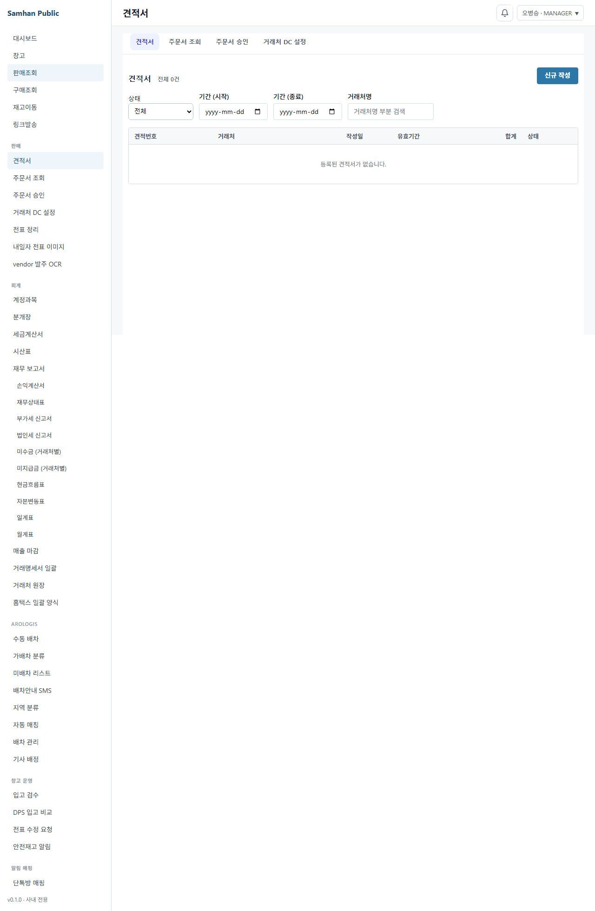
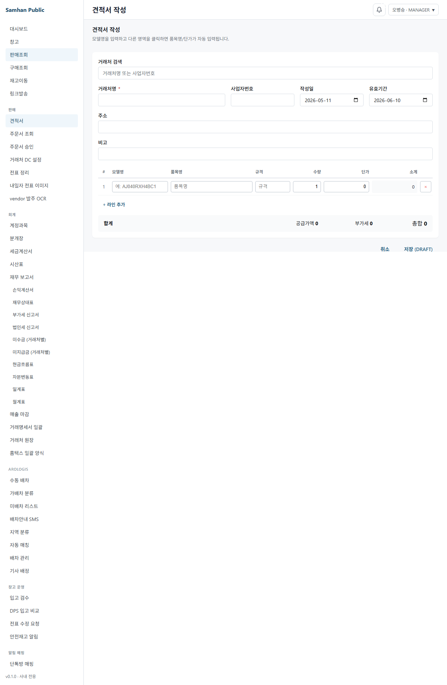
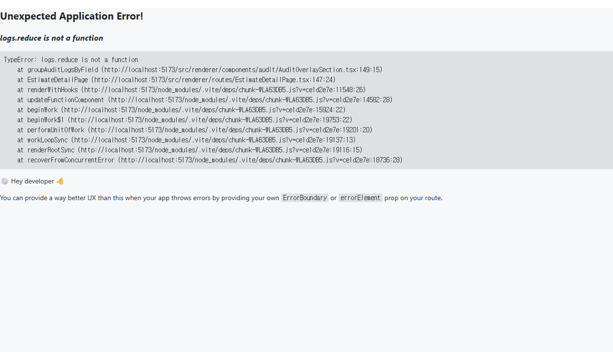
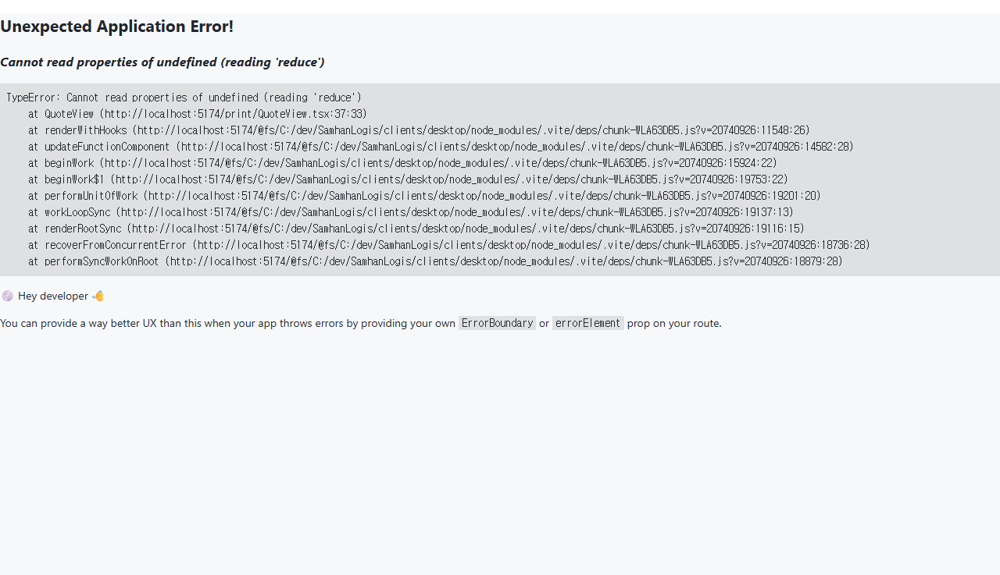

# 06. 견적서 작성 및 발송

> **Stage**: Stage 1 ✅ — P2-1 구현 완료. 정식 견적 화면 `/sales/estimates` (목록/작성/상세/전표변환) 운영 중.
>
> ⚠️ **단, 견적서 인쇄(`/sales/estimates/:estimateNumber/print`)는 진입 버그(슬래시 견적번호 → 게이트웨이 `%2F` 차단 → 400)가 잔존하여 미정상화 상태입니다. 종합견적서 에픽으로 이관되어 그곳에서 해결합니다 (§4-5 참조).**

---

## 1. 구현 상태

| 항목 | 상태 | 비고 |
| --- | --- | --- |
| 견적서 목록 (`/sales/estimates`) | ✅ 운영 | EstimateListPage |
| 견적서 작성 (`/sales/estimates/new`) | ✅ 운영 | EstimateFormPage |
| 견적서 상세/편집 (`/sales/estimates/:id`) | ✅ 운영 | EstimateDetailPage |
| 전표 변환 버튼 (QUOTE_ACCEPTED → OUTBOUND DRAFT) | ✅ 운영 | convertEstimate API |
| 견적서 인쇄 (`/sales/estimates/:estimateNumber/print`) | ⚠️ 진입 버그 잔존 (종합견적서 에픽 이관) | QuoteView 양식 mock 은 존재하나, `handlePrint` 이 슬래시 견적번호를 path 로 전달 → 게이트웨이 `%2F` 차단 → 400. 미리보기 표준화 슬라이스1 범위 외, 종합견적서 에픽에서 해결 |
| audit overlay + SSE 실시간 동기화 | ✅ 운영 | PR-H4c |

---

## 2. 대상 독자

- 거래처에 견적을 발송하는 영업 직원 (SALES)
- 견적 단가를 검토하는 영업 부장 (MANAGER)
- 견적 수락/거절 후 전표 발행하는 창고/영업 담당자

---

## 3. 학습 내용

- 견적서 목록 조회 및 상태 필터
- 신규 견적서 작성 (거래처 자동완성 + 모델명 lookup + 라인 입력)
- 견적서 발송 → 수락 → 전표 변환 워크플로우
- 견적서 인쇄 (새 창 PDF) — ⚠️ 현재 진입 버그 잔존, 종합견적서 에픽 이관 (§4-5)
- 변경 이력 조회 및 이전 버전 복원

---

## 4. 본문

### 4-1. 견적서 목록

좌측 사이드바 **[영업]** > **[견적서 관리]** 진입 (`/sales/estimates`).

- 상태 필터: 초안 / 발송됨 / 수락됨 / 거절됨 / 변환됨
- 견적번호 검색 (estimateNo — `ESTI-YYYY-NNNN` 형식)
- 거래처명 검색
- 신규 견적 작성: 우상단 **[+ 신규 견적]** 버튼 → `/sales/estimates/new`

### 4-2. 견적서 작성

`/sales/estimates/new` 진입.

#### 거래처 선택

1. **거래처 검색** 입력란에 거래처명 또는 사업자번호 입력 (1자 이상)
2. 자동완성 드롭다운에서 선택 → 거래처명 / 사업자번호 / 주소 자동 입력
3. 직접 수정 가능 (snapshot 저장)

#### 기본 정보

| 항목 | 설명 |
| --- | --- |
| 작성일 | 기본값: 오늘 날짜. 수정 가능 |
| 유효기간 | 기본값: 작성일 +30일. 수정 가능 |
| 비고 | 선택 항목. 변경 이력 추적 대상 |

#### 라인 입력

1. **모델명** 입력 후 다른 영역 클릭 (onBlur) → 품목명 / 단가 자동 입력 (product-service lookup)
2. 수량 입력 → 소계 자동 계산 (공급가액 + 부가세 10%)
3. 마지막 라인에 값을 입력하면 아래에 빈 라인이 자동으로 생성됩니다(수동 행 추가 버튼 없음).
4. 각 행 오른쪽 **×** 버튼으로 라인 삭제

#### 저장 및 발송

- **[저장 (DRAFT)]**: 초안으로 저장 → 상세 화면 이동
- **[발송 (SENT)]**: 편집 모드에서만 활성. 저장 후 즉시 발송 상태로 전환

### 4-3. 견적서 상태 워크플로우

```
초안(DRAFT) → [발송] → 발송됨(SENT) → [수락] → 수락됨(ACCEPTED) → [전표 변환] → 변환됨(CONVERTED)
                                      → [거절] → 거절됨(REJECTED)
```

| 상태 | 가능한 액션 | 설명 |
| --- | --- | --- |
| DRAFT | 편집, 발송, 인쇄 | 내부 초안 |
| SENT | 편집, 수락, 거절, 인쇄 | 거래처 검토 중 |
| ACCEPTED | 전표 변환, 인쇄 | 거래처 수락 완료 |
| REJECTED | 인쇄 | 거래처 거절 (잠금) |
| CONVERTED | 인쇄, 변환 전표 보기 | 출고전표 자동 생성됨 |

### 4-4. 전표 변환

견적이 **ACCEPTED** 상태일 때 **[전표 변환]** 버튼 클릭.

- 출고전표 (OUTBOUND DRAFT) 자동 생성
- 변환 후 확인 팝업 → **[예]** 클릭 시 전표 상세로 이동
- 변환된 전표 번호는 견적서 상세에서 **[변환 전표 보기]** 링크로 재접근 가능

### 4-5. 견적서 인쇄

> ⚠️ **현재 진입 버그 잔존 — 종합견적서 에픽에서 해결 예정.**
>
> 모든 상태에서 **[인쇄]** 버튼을 클릭하면 새 창 (`/sales/estimates/:estimateNumber/print`, QuoteView) 을 여는 동작이 mock 으로 구현되어 있으나, **현재 정상 동작하지 않습니다.**
>
> - 원인: `EstimateDetailPage.handlePrint` 이 슬래시 표준 견적번호(`estimateNo`, 예: `2026/06/08-2`) 를 `encodeURIComponent` 로 인코딩해 path 세그먼트로 전달합니다 (`.../estimates/2026%2F06%2F08-2/print`). 게이트웨이/Spring `StrictHttpFirewall` 이 인코딩된 슬래시(`%2F`) 를 차단하여 조회 단계에서 400 이 발생합니다. (전표/주문번호 슬래시 표준 + 게이트웨이 `%2F` 차단 정책 참조 — URL 경로 세그먼트는 `toOrderPathId` 로 하이픈 치환해야 합니다.)
> - 이 버그는 미리보기 표준화 에픽 이전부터 존재한 **origin 선재 상태**이며, 미리보기 표준화 **슬라이스1 범위 외**입니다.
> - 견적 인쇄 전반(진입 경로 정정 + 양식)은 **종합견적서 에픽** 으로 이관되어 그곳에서 해결합니다.
>
> 정상화 이후: Edge 또는 Chrome 에서 Ctrl+P 또는 화면 우클릭 → 인쇄, A4 portrait 권장.

### 4-6. 변경 이력 (audit overlay)

견적서 상세/편집 화면 우상단 **수정 N회** 배지 클릭.

- 필드별 변경 전/후 값 + 변경자 + 시각 표시
- DRAFT / SENT 상태에서는 이전 버전으로 복원 가능
- CONVERTED / REJECTED 상태는 잠금 (복원 불가)

---

## 5. 화면 미리보기

### 5-1. 견적서 목록



### 5-2. 견적서 작성



### 5-3. 견적서 상세



### 5-4. 견적서 인쇄

> ⚠️ 아래 양식은 QuoteView mock 캡처입니다. 현재 진입 버그(§4-5)로 실 데이터 인쇄는 미정상화 상태이며, 종합견적서 에픽에서 해결합니다.



---

## 6. FAQ

**Q1. 모델명을 입력했는데 품목명이 자동 입력되지 않습니다.**
A. 모델명을 입력 후 다른 입력 칸을 클릭(onBlur)해야 조회됩니다. 모델명이 정확하지 않으면 오류 메시지가 표시됩니다. 제품 마스터에 등록된 모델명을 사용하세요.

**Q2. 견적서 양식이 회사마다 다른데 커스터마이징 가능한가요?**
A. 인쇄 양식은 QuoteView 고정 양식입니다. 커스터마이징이 필요하면 개발팀에 문의하세요.

**Q3. 수락 후 견적 금액을 변경하고 싶습니다.**
A. 거절 처리 후 신규 견적서를 작성해야 합니다. ACCEPTED 상태에서는 전표 변환만 가능합니다.

**Q4. 견적 history 조회는 어떻게 하나요?**
A. 견적서 목록 (`/sales/estimates`) 에서 상태 필터와 기간 필터로 조회합니다.

**Q5. 전표 변환 후 출고전표를 수정하고 싶습니다.**
A. 변환된 전표은 OUTBOUND DRAFT 상태로 생성됩니다. 전표 상세에서 편집 후 결재 라인을 진행하세요.

---

## 7. 데스크탑 ↔ 웹 분리 (3a)

본 화면(`/sales/estimates`)은 **내부 영업·관리자용** UI 입니다. 거래처가 직접 작성하는 종합견적서는 별도 외부 웹앱으로 분리되어 있으며, 데스크탑 영업 sub-nav 우측의 **"웹 종합견적서 ↗"** 버튼으로 진입합니다.

| 항목 | 데스크탑 내장 `/sales/estimates` | 외부 웹앱 (`clients/web/estimate-app`, dev `:5183`) |
|---|---|---|
| 대상 사용자 | 사내 영업 / 관리자 (SALES / MANAGER / MASTER) | 거래처 담당자 (사업자번호 로그인) |
| 진입 경로 | 사이드바 [영업] → [견적서] | sub-nav 우측 「웹 종합견적서 ↗」 |
| 작성 책임 | 거래처에 발송할 견적 직접 작성·관리 | 거래처가 자체적으로 견적 요청·열람 |
| 워크플로우 | DRAFT → SENT → ACCEPTED → CONVERTED (전표 변환) | 거래처 자체 등록 / 인쇄 |
| 인쇄 양식 | QuoteView 고정 | 거래처 측 별도 양식 |

진입 시 화면 상단에 **"내부 영업·관리자용 화면입니다"** 안내 배너가 표시됩니다 (`data-testid=estimate-audience-banner`).

> Phase 11 cutover 이후에는 외부 웹앱의 URL 이 환경변수 또는 main 프로세스 config 로 운영 도메인으로 전환됩니다 (현재 dev `localhost:5183`).

---

## 8. 관련 매뉴얼

- [01. 거래처 등록](01-거래처-등록.md)
- [03. 전표 발행](03-전표-발행.md)
- [04. 전표 결재 라인](04-전표-결재-라인.md)
- [05. 거래처 주문](05-거래처-주문.md)
