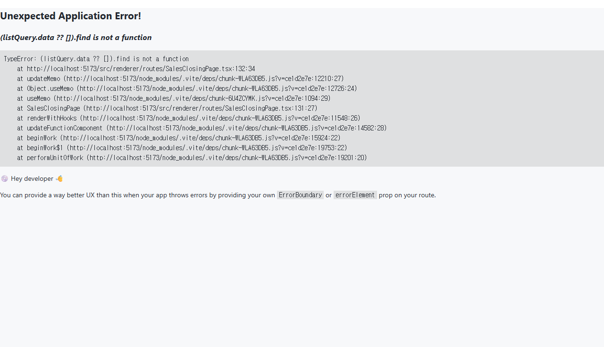

# 04. 매출 마감

> **Stage**: Stage 1 ✅ — P2-4 구현 완료. 정식 매출 마감 화면 `/sales/closing` 운영 중.

---

## 1. 구현 상태

| 항목 | 상태 | 비고 |
| --- | --- | --- |
| 매출 마감 화면 (`/sales/closing`) | ✅ 운영 | SalesClosingPage (P2-4) |
| 일별 마감 실행 | ✅ 운영 | periodType=DAILY |
| 월별 마감 실행 | ✅ 운영 | periodType=MONTHLY |
| 역마감 | ✅ 운영 | MASTER 권한 전용 |
| 일별 세금계산서 detail + CSV | ✅ 운영 | UTF-8 BOM Excel 호환 |
| audit overlay + 감사 이력 패널 | ✅ 운영 | PR-H4c |

---

## 2. 대상 독자

- 일별/월별 매출을 마감하는 회계 직원 (ACCOUNTANT)
- 역마감 권한을 보유한 시스템 관리자 (MASTER)
- 마감 이력을 조회하는 영업 부장 (MANAGER, 조회 전용)

---

## 3. 학습 내용

- 매출 마감 실행 절차 (일별 / 월별)
- 마감 후 슬립/분개 변경 차단 정책
- 역마감 요청 및 처리
- 일별 세금계산서 detail CSV 다운로드
- 감사 이력 패널 확인

---

## 4. 본문

### 4-1. 매출 마감 화면 진입

좌측 사이드바 **[영업]** > **[매출 마감]** 또는 **[회계]** > **[매출 마감]** 진입 (`/sales/closing`).

- 진입 권한: **ACCOUNTANT** / **MASTER**
- MANAGER 는 조회 전용 (마감 실행 버튼 비활성)

### 4-2. 마감 실행

#### 단계 1 — 마감 유형 선택

상단 toggle 버튼으로 **일별** 또는 **월별** 선택.

| 유형 | 설명 |
| --- | --- |
| 일별 (DAILY) | 특정 날짜 내 CONFIRMED 슬립을 LOCKED 처리 |
| 월별 (MONTHLY) | 해당 월 전체 CONFIRMED 슬립을 LOCKED 처리 |

#### 단계 2 — 기간 선택

- 일별: 날짜 picker (YYYY-MM-DD)
- 월별: 월 picker (YYYY-MM)

#### 단계 3 — 메모 입력 (선택)

마감 사유, 특이사항 등을 500자 이내로 입력.

#### 단계 4 — 마감 실행

**[마감 실행]** 버튼 클릭.

BE 동작:
1. slip-service 를 통해 해당 기간 CONFIRMED 슬립 일괄 LOCKED 처리
2. accounting-service 에 매출/매입/판관비 합계 stamp + status=CLOSED 기록
3. 이후 해당 기간 분개/슬립 변경은 자동 차단

### 4-3. 일별 세금계산서 detail

**일별** 탭 선택 + 날짜 선택 시 하단에 해당 일자 발행된 세금계산서 detail 카드가 표시됩니다.

| 컬럼 | 설명 |
| --- | --- |
| 순번 | 조회 순서 (1부터) |
| 세금계산서번호 | ISSUED 상태 세금계산서 발행번호 |
| 거래처명 | 매출 거래처 |
| 공급가액 | 공급가액 합계 |
| 세액 | 부가세 10% |
| 합계 | 공급가액 + 세액 |

**[CSV 다운로드]** 버튼으로 UTF-8 BOM 형식 CSV 다운로드 (Excel 한글 호환).

### 4-4. 마감 이력 조회

하단 마감 이력 표에서 과거 마감 내역을 확인합니다.

| 컬럼 | 설명 |
| --- | --- |
| 구분 | 일별/월별 |
| 기간 일자 | 마감 대상 날짜 또는 월 |
| 상태 | 열림(OPEN) / 마감(CLOSED) |
| 매출 합계 | 마감 당시 매출 집계 |
| 잠금 슬립 | LOCKED 처리된 슬립 건수 |
| 마감 시각 | 마감 실행 시각 |
| 실행자 | 마감을 실행한 사용자 |

각 행 우측 **[이력 보기]** 버튼 → 감사 이력 패널 표시.

### 4-5. 역마감 (MASTER 전용)

마감 이력 행의 **[역마감]** 버튼은 **MASTER** 권한자에게만 표시됩니다.

1. **[역마감]** 버튼 클릭 → 확인 팝업
2. 확인 시 해당 기간 마감 해제 (CLOSED → OPEN)
3. 슬립/분개 변경이 다시 허용됨
4. 수정 완료 후 재마감 필요

> 역마감은 감사/수정 목적으로만 사용하고, 완료 즉시 재마감하십시오.

### 4-6. 감사 이력 패널

마감 이력 표의 **[이력 보기]** 버튼 클릭 시 하단에 패널이 표시됩니다.

- 수정 횟수 badge (수정 N회)
- 메모 필드의 변경 이력 (변경 전/후, 변경자, 변경 시각)
- CLOSED 상태에서는 잠금 banner 표시

---

## 5. 화면 미리보기

### 5-1. 매출 마감 (월별)

### 5-2. 일별 세금계산서 detail

---

## 6. FAQ

**Q1. 마감 실행 후 슬립을 수정해야 하면 어떻게 하나요?**
A. MASTER 권한자에게 역마감을 요청하세요. 역마감 후 수정 → 재마감 순으로 처리합니다. 역마감은 감사 이력에 자동 기록됩니다.

**Q2. ACCOUNTANT 인데 역마감 버튼이 보이지 않습니다.**
A. 역마감은 MASTER 권한 전용입니다. 시스템 관리자(MASTER)에게 요청하세요.

**Q3. 월별 마감 시 어떤 슬립이 잠기나요?**
A. 해당 월 CONFIRMED 상태의 출고/입고 전표가 모두 LOCKED 처리됩니다. DRAFT 상태는 포함되지 않습니다.

**Q4. 일별 detail CSV 에 세금계산서가 나오지 않습니다.**
A. 해당 일자에 ISSUED 상태의 세금계산서가 없는 경우입니다. 세금계산서 발행 완료 후 다시 조회하세요.

**Q5. 마감 실행 권한은 누구에게 있나요?**
A. ACCOUNTANT 와 MASTER 권한자만 마감을 실행할 수 있습니다. MANAGER 는 조회만 가능합니다.

---

## 7. 관련 매뉴얼

- [02. 출고 처리](02-출고-처리.md)
- [03. 재고 조회](03-재고-조회.md)
- [05. 재고 실사](05-재고-실사.md)
- [03-회계 / 02. 보고서](../03-회계/02-보고서.md)
- [03-회계 / 03. 세금계산서](../03-회계/03-세금계산서.md)
- [03-회계 / 04. 월말 마감](../03-회계/04-월말-마감.md)
- [01-영업 / 03. 슬립 발행](../01-영업/03-슬립-발행.md)
