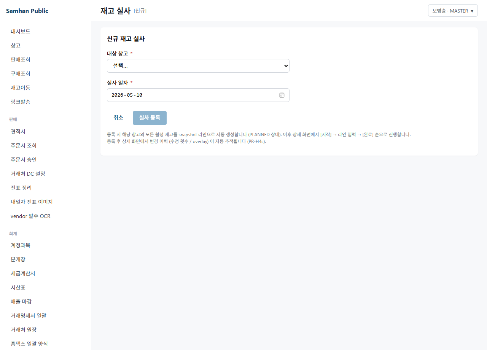
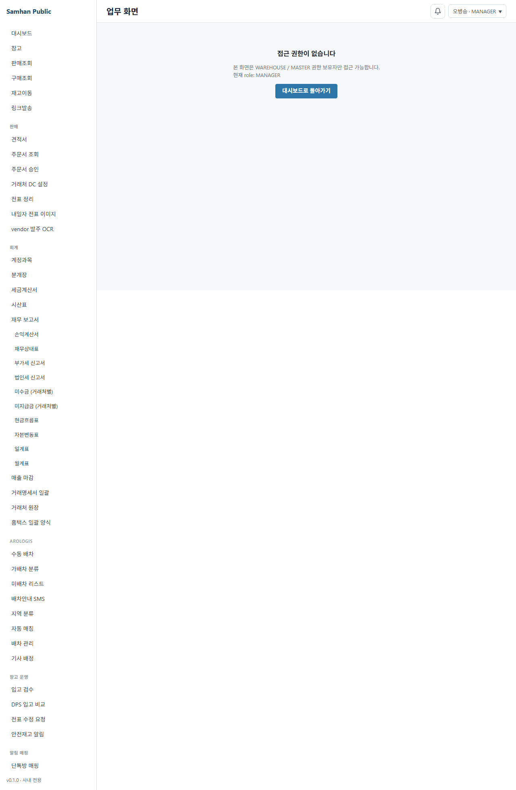

# 05. 재고 실사

> **Stage**: Stage 1 ✅ — P2-6 구현 완료. 정식 재고 실사 화면 `/warehouse/audit` 운영 중.

---

## 1. 구현 상태

| 항목 | 상태 | 비고 |
| --- | --- | --- |
| 실사 목록 (`/warehouse/audit`) | ✅ 운영 | InventoryAuditListPage (P2-6) |
| 실사 등록 (`/warehouse/audit/new`) | ✅ 운영 | InventoryAuditFormPage |
| 실사 상세 (`/warehouse/audit/:id`) | ✅ 운영 | InventoryAuditDetailPage |
| 바코드/수동 수량 입력 | ✅ 운영 | IN_PROGRESS 단계만 |
| 차이 자동 분개 발행 | ✅ 운영 | COMPLETED 시 inventory-service 자동 생성 |
| 30초 polling 실시간 동기화 | ✅ 운영 | 목록 페이지 |
| SSE + audit overlay | ✅ 운영 | 상세 페이지 (PR-H4c) |

---

## 2. 대상 독자

- 연말/분기 실사를 진행하는 재고 관리자 (WAREHOUSE)
- 실사 결과를 승인하는 시스템 관리자 (MASTER)
- 실사 결과를 회계에 반영하는 회계 직원 (ACCOUNTANT — 분개 조회)
- 외부 감사 (VIEWER — 조회 전용)

---

## 3. 학습 내용

- 한국 일반기업회계기준 재고 실사 의무 인지
- 신규 실사 등록 및 창고 선택
- 실사 진행 상태 관리 (PLANNED → IN_PROGRESS → COMPLETED)
- 바코드 스캔 또는 수동 수량 입력
- 차이 자동 분개 확인

---

## 4. 본문

### 4-1. 한국 일반기업회계기준 의무

(주)삼한공조시스템은 한국 일반기업회계기준에 따라 연 1회 이상 재고 실사를 의무 시행해야 합니다.

- 실사 시점: 결산일 (12/31) 또는 분기말
- 실사 방법: 전수 조사 또는 표본 조사
- 차이 회계 처리: 재고자산평가손익 분개 자동 발행 (COMPLETED 시)

### 4-2. 실사 목록 조회

좌측 사이드바 **[창고]** > **[재고 실사]** 진입 (`/warehouse/audit`).

- 창고 필터: 전체 또는 특정 창고 선택
- 연도 필터: 최근 5년 선택 가능
- 상태 필터: 계획됨 / 진행 중 / 완료됨 / 취소됨
- 30초 자동 갱신 (멀티 워크스테이션 동기화)
- 행 클릭 → 상세 화면 이동

### 4-3. 신규 실사 등록

**[신규 실사]** 버튼 클릭 → `/warehouse/audit/new`.

| 항목 | 설명 |
| --- | --- |
| 대상 창고 | 실사할 창고 선택 (VIRTUAL 창고 제외) |
| 실사 일자 | 기본값: 오늘. 수정 가능 |

**[실사 등록]** 버튼 클릭 → 해당 창고의 모든 활성 재고를 snapshot 라인으로 자동 생성 (PLANNED 상태).

### 4-4. 실사 상태 워크플로우

```
계획됨(PLANNED) → [시작] → 진행 중(IN_PROGRESS) → [완료] → 완료됨(COMPLETED)
                 → [취소] → 취소됨(CANCELLED)       → [취소] → 취소됨(CANCELLED)
```

| 상태 | 설명 | 가능한 액션 |
| --- | --- | --- |
| PLANNED | 등록 직후 초기 상태 | 시작, 취소 |
| IN_PROGRESS | 실사 진행 중 | 수량 입력, 완료, 취소 |
| COMPLETED | 실사 완료 + 차이 분개 발행됨 | 차이 분개 보기 |
| CANCELLED | 취소됨 | 없음 |

### 4-5. 수량 입력 (IN_PROGRESS 단계)

실사 상세 화면 (`/warehouse/audit/:id`) 에서 **[시작]** 클릭 후 수량 입력 카드가 표시됩니다.

#### 바코드 스캔 입력

1. **제품 ID** 입력란에 바코드 스캐너를 연결하면 스캔 즉시 자동 입력
2. **실물 수량** 입력
3. **스캔** 체크박스 활성 (자동 표시 권장)
4. **[입력]** 클릭 → 해당 라인 실물수량 업데이트

#### 수동 입력

1. 제품 ID (UUID 또는 제품코드) 직접 입력
2. 실물 수량 입력
3. 스캔 체크박스 미선택 (수동 입력으로 기록)
4. **[입력]** 클릭

#### 라인 테이블

| 컬럼 | 설명 |
| --- | --- |
| 제품 | 제품명 (UUID 화면 미노출) |
| 장부수량 | 시스템 재고 (snapshot 기준) |
| 실물수량 | 입력된 실제 수량 (미입력 시 "—") |
| 차이수량 | 실물 - 장부 (음수 = 부족) |
| 단가 | 원가 단가 |
| 차이금액 | 차이수량 × 단가 |
| 입력 방식 | 스캔 / 수동 / 대기 |

### 4-6. 실사 완료 및 차이 분개

**[완료]** 버튼 클릭 → 확인 팝업.

BE 동작:
1. 라인별 차이 자동 계산
2. 차이 분개 자동 발행 (inventory-service → accounting-service)

   | 차이 유형 | 분개 |
   | --- | --- |
   | 시스템 > 실 재고 | (차) 재고자산평가손 / (대) 재고자산 |
   | 시스템 < 실 재고 | (차) 재고자산 / (대) 재고자산평가이익 |

3. 실사 상태 → COMPLETED (잠금)

COMPLETED 후 화면에서 **[차이 자동 분개 보기]** 링크 → 분개장 (`/accounting/journals`) 이동.

### 4-7. 감사 이력 (audit overlay)

실사 상세 화면 우상단 **수정 N회** 배지 → 변경 이력 확인.

- 차이금액(totalDiffAmount) 필드 overlay 표시
- COMPLETED / CANCELLED 상태는 잠금 (수정 불가)

---

## 5. 화면 미리보기

### 5-1. 재고 실사 목록


### 5-2. 재고 실사 등록



### 5-3. 재고 실사 상세 + 수량 입력



---

## 6. FAQ

**Q1. 실사를 안 하면 어떻게 되나요?**
A. 외부 감사 시 한국 일반기업회계기준 위반으로 지적될 수 있습니다. 연 1회 이상 의무입니다.

**Q2. 바코드 스캐너 없이 수동 입력만 가능한가요?**
A. 가능합니다. 제품 ID를 직접 입력하고 스캔 체크박스를 해제하면 수동 입력으로 기록됩니다.

**Q3. 라인을 잘못 입력했습니다. 수정 가능한가요?**
A. 같은 제품을 다시 입력하면 최신 입력값으로 덮어씁니다. COMPLETED 후에는 수정 불가합니다.

**Q4. 차이 분개가 잘못된 것 같습니다.**
A. 분개 상세를 확인하세요 (`/accounting/journals`). 오류가 확인되면 MASTER 에게 역분개 요청 후 재실사를 진행하세요.

**Q5. 표본 조사로 충분한가요?**
A. 회사 규모에 따라 다릅니다. 외주 회계 / 외부 감사와 협의 권장합니다.

**Q6. COMPLETED 후 분개를 수정하려면?**
A. MASTER 권한자가 분개를 역분개 처리한 후 재실사를 등록해야 합니다. 재고 관리자 + 회계 직원 협의 필요.

---

## 7. 관련 매뉴얼

- [01. 입고 처리](01-입고-처리.md)
- [03. 재고 조회](03-재고-조회.md)
- [04. 매출 마감](04-매출-마감.md)
- [03-회계 / 01. 분개 입력](../03-회계/01-분개-입력.md)
- [03-회계 / 04. 월말 마감](../03-회계/04-월말-마감.md)
- [07-부록 / 02. 용어집](../07-부록/02-용어집.md)
