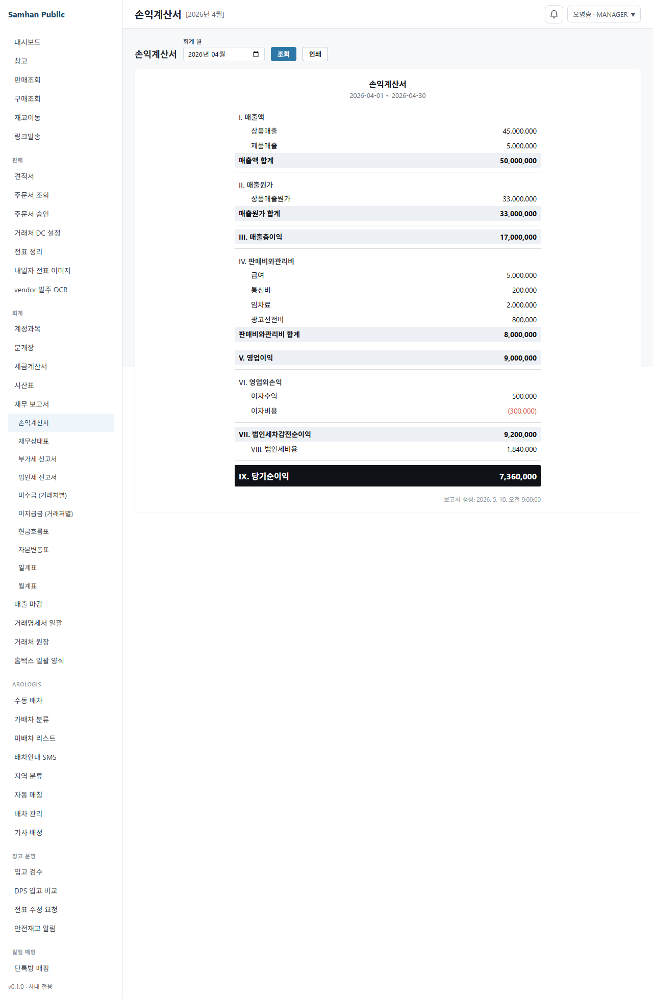
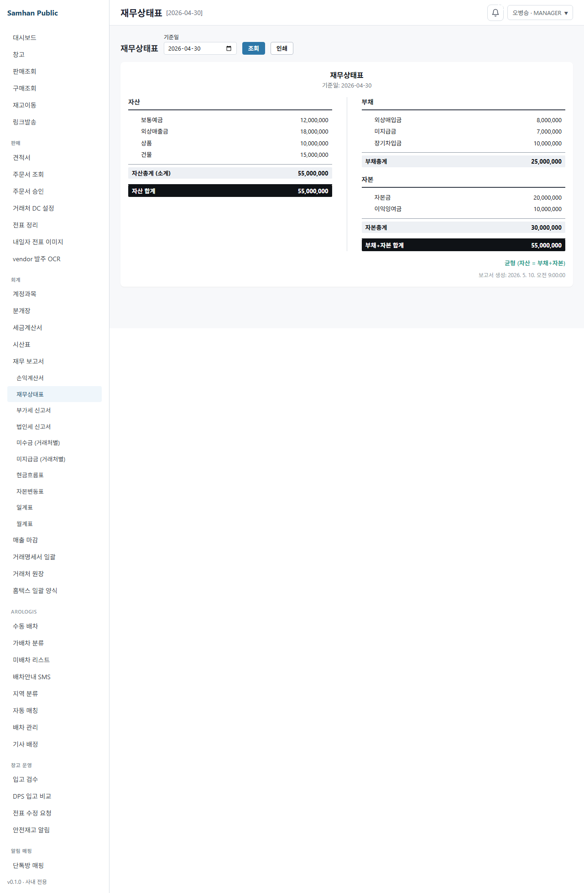

# 02. 재무 보고서

> **Stage 안내**: Stage 4 ✅ — P0-1 Slice B (부가세 / 법인세 / 거래처별 미수미지급 FE) 완료. Slice A 포함 총 7개 보고서 운영 중.

---

## 1. 구현 상태

| 항목 | 상태 | 비고 |
| --- | --- | --- |
| Backend 시산표 (TrialBalance) | ✅ 운영 | `TrialBalanceController.byPeriod(yyyyMM)` |
| Backend 거래처원장 | ✅ 운영 | partner ledger |
| Backend 손익계산서 | ⚠️ mock 우선 | `GET /accounting/reports/income-statement` (P0-1 BE 병렬) |
| Backend 재무상태표 | ⚠️ mock 우선 | `GET /accounting/reports/balance-sheet` (P0-1 BE 병렬) |
| Backend 부가세 신고서 | ⚠️ mock 우선 | `GET /accounting/reports/vat` (P0-1 Slice B BE 병렬) |
| Backend 법인세 신고서 | ⚠️ mock 우선 | `GET /accounting/reports/corporate-tax` (P0-1 Slice B BE 병렬) |
| Backend 거래처별 미수/미지급 | ⚠️ mock 우선 | `GET /accounting/reports/partner-aging` (P0-1 Slice B BE 병렬) |
| Backend 나머지 9건 보고서 | ⛔ 미구현 | Phase 11+ 예정 |
| Frontend 시산표 화면 | ✅ 운영 | `/accounting/balances` + summary 영역 추가 (P0-1) |
| Frontend 거래처원장 화면 | ✅ 운영 | desktop |
| Frontend 손익계산서 화면 | ✅ 운영 (mock) | `/accounting/reports/income-statement` (P0-1 Slice A) |
| Frontend 재무상태표 화면 | ✅ 운영 (mock) | `/accounting/reports/balance-sheet` (P0-1 Slice A) |
| Frontend 재무 보고서 목록 | ✅ 운영 | `/accounting/reports` 7개 카드 (Slice A 3 + B 4) |
| Frontend 부가세 신고서 화면 | ✅ 운영 (mock) | `/accounting/reports/vat` (P0-1 Slice B) |
| Frontend 법인세 신고서 화면 | ✅ 운영 (mock) | `/accounting/reports/corporate-tax` (P0-1 Slice B) |
| Frontend 미수금 화면 | ✅ 운영 (mock) | `/accounting/reports/partner-aging?type=RECEIVABLE` (P0-1 Slice B) |
| Frontend 미지급금 화면 | ✅ 운영 (mock) | `/accounting/reports/partner-aging?type=PAYABLE` (P0-1 Slice B) |

(주)삼한공조시스템 회계 보고서는 한국 일반기업회계기준 표준 보고서 + 거래처별 / 계정별 분석 보고서를 제공합니다.

---

## 2. 대상 독자

- 시산표 / 손익계산서 / 재무상태표를 검토하는 회계 직원 (ACCOUNTANT)
- 외부 감사 / 외주 회계 (VIEWER)
- 거래처별 매출 / 매입 잔액을 확인하는 영업 부장 (MANAGER)

---

## 3. 학습 내용

- 시산표 (Trial Balance) 조회 + 균형 summary
- 손익계산서 (Income Statement) 조회 + 인쇄
- 재무상태표 (Balance Sheet) 조회 + 불균형 경고
- 거래처원장 (Partner Ledger) 조회
- 부가세 신고서 (VAT Report) 조회 + 인쇄 — P0-1 Slice B
- 법인세 신고서 (Corporate Tax Report) 조회 + 인쇄 — P0-1 Slice B
- 거래처별 미수/미지급 잔액 (Partner Aging) 조회 + 인쇄 + CSV — P0-1 Slice B
- 보고서 일괄 발행 (statement-batch)
- 나머지 9건 미구현 보고서 안내 + Phase 11 일정

---

## 4. 본문

### 4-1. 보고서 메뉴 진입

좌측 사이드바 **[회계]** > **[재무 보고서]** 클릭 → 7개 카드 (Slice A 3개: 손익계산서 / 재무상태표 / 시산표 + Slice B 4개: 부가세 / 법인세 / 미수금 / 미지급금) 표시.
각 카드 **[조회]** 버튼 또는 사이드바 서브메뉴로 직접 진입 가능.

### 4-2. 손익계산서 (Income Statement) — P0-1 신규

한국 일반기업회계기준 형식 — 매출 → 매출원가 → 매출총이익 → 판관비 → 영업이익 → 영업외 → 당기순이익.

1. 좌측 사이드바 **[회계]** > **[손익계산서]** 진입
2. 상단 **[회계 월]** (YYYY-MM) 선택 (기본값: 전월)
3. **[조회]** 클릭
4. 한국 회계 표준 양식 표시 — 합계 행 굵게, 음수 금액 빨강
5. **[인쇄]** 버튼 클릭 → 브라우저 인쇄 다이얼로그 (회사 헤더 + 기간 포함)

> **주의**: BE endpoint 미완성 시 mock fixture 로 동작. 운영 전환 시 `VITE_MOCK_MODE` 해제.

### 4-3. 재무상태표 (Balance Sheet) — P0-1 신규

기준일 기준 자산 / 부채 / 자본 잔액을 좌우 두 열로 표시.

1. 좌측 사이드바 **[회계]** > **[재무상태표]** 진입
2. 상단 **[기준일]** (YYYY-MM-DD) 선택 (기본값: 전월말)
3. **[조회]** 클릭
4. 좌측(자산) / 우측(부채+자본) 두 열 표시
5. 자산 ≠ 부채+자본 시 상단에 빨강 경고 배너 표시
6. **[인쇄]** 버튼 클릭 → 인쇄 (회사 헤더 + 기준일 포함)

### 4-4. 시산표 (Trial Balance)

대표 보고서. 월말 잔액 검증용. P0-1 에서 summary 영역 추가.

1. **[시산표]** 메뉴 진입
2. 기간 (YYYY-MM) 선택
3. **[조회]** 클릭
4. 상단 summary 카드: 총 차변 / 총 대변 / 균형 chip (일치/불일치)
5. 하단 카테고리별 표 (계정 / 기초잔액 / 당월 차변 / 당월 대변 / 기말잔액)

### 4-5. 거래처원장 (Partner Ledger)

거래처별 매출 / 매입 / 입금 / 잔액.

1. **[거래처원장]** 메뉴 진입
2. 거래처 + 기간 선택
3. **[조회]** 클릭
4. 일자별 거래 내역 + 잔액 변동 표시

### 4-4-2. 부가세 신고서 (VAT Report) — P0-1 Slice B 신규

한국 부가가치세법 형식 — 매출 VAT / 매입 VAT / 납부세액.

1. 좌측 사이드바 **[회계]** > **[부가세 신고서]** 진입
2. 상단 **[신고 기간]** (YYYY-MM, 월 단위) 선택
3. **[조회]** 클릭
4. 매출/매입 공급가액 + VAT + 세금계산서 매수 표시
5. 납부세액 = 매출 VAT − 매입 VAT (음수 시 환급 안내)
6. **[인쇄]** 버튼 → 새 창 인쇄 레이아웃 (`/accounting/reports/vat/print`)

> **주의**: BE endpoint 미완성 시 mock fixture 로 동작.

### 4-4-3. 법인세 신고서 (Corporate Tax Report) — P0-1 Slice B 신규

한국 법인세법 형식 — 과세표준 + 단계별 세율(2억 이하 9%, 200억 이하 19%, ...) + 차감납부세액.

1. 좌측 사이드바 **[회계]** > **[법인세 신고서]** 진입
2. 상단 **[사업연도]** (YYYY 연도) 선택
3. **[조회]** 클릭
4. 법인세차감전순이익 → 가산/차감조정 → 과세표준 → 세율 적용 → 산출세액 → 차감납부세액
5. **[인쇄]** 버튼 → 새 창 인쇄 레이아웃

> **주의**: BE endpoint 미완성 시 mock fixture 로 동작. 신고 기한: 12월 결산 법인 익년 3월 31일.

### 4-4-4. 거래처별 미수/미지급 잔액 (Partner Aging) — P0-1 Slice B 신규

기준일 기준 외상매출금(미수) 또는 외상매입금(미지급) 잔액 + 연체일수.

1. 좌측 사이드바 **[회계]** > **[미수금]** 또는 **[미지급금]** 진입
2. 상단 **[기준일]** (YYYY-MM-DD) 선택 + **[유형]** radio (미수금/미지급금)
3. **[조회]** 클릭
4. 거래처별 잔액 + 가장 오래된 미결제 일자 + 연체일수 표 표시
   - 30일 이하: 정상 (회색)
   - 31~60일: 주의 (노랑)
   - 61일 이상: 연체 위험 (빨강)
5. **[인쇄]** 버튼 → 새 창 인쇄 레이아웃
6. **[Excel (CSV)]** 버튼 → 거래처별 잔액 CSV 다운로드

> **UUID 비공개**: 거래처 내부 UUID(`partnerId`)는 화면에 표시되지 않습니다. `partnerCode`/`partnerName` 만 표시.

### 4-6. 나머지 9건 미구현 보고서 안내

P0-1 Slice B 에서 부가세 / 법인세 / 거래처 미수미지급 3건이 추가로 구현되어 잔여 미구현 보고서는 9건입니다. 다음 9건은 Phase 11+ 에서 출시 예정입니다.

| # | 보고서 | 임시 우회 |
| --- | --- | --- |
| 1 | 현금흐름표 | 시산표 + 수동 |
| 2 | 자본변동표 | 수동 |
| 3 | 계정원장 | 분개 list 에서 계정 필터 |
| 4 | 일계표 | 분개 list 일자 필터 |
| 5 | 월계표 | 시산표 활용 |
| 6 | 원천세 보고서 | NTS 홈택스 별도 |
| 7 | 합계잔액시산표 | 시산표 활용 |
| 8 | 분개장 (인쇄용) | 분개 list 활용 |
| 9 | 부서별 손익 | 미지원 (Phase 11+ 후) |

### 4-7. 보고서 일괄 발행 (statement-batch)

여러 보고서를 한 번에 PDF 로 발행합니다.

1. **[일괄 발행]** 메뉴 진입
2. 보고서 종류 + 기간 선택
3. **[발행]** 클릭
4. PDF 다운로드 또는 인쇄

### 4-8. Stage 4 실시간 협업

보고서는 read-only 화면이므로 실시간 협업 패턴은 적용되지 않습니다. 다만 분개 변경 시 시산표가 자동 갱신됩니다 ([실시간 동기화](../08-실시간-협업/01-실시간-동기화.md)).

---

## 5. 화면 미리보기

> **Slice B 캡처 예정**: 아래 5-4 ~ 5-7 는 `VITE_MOCK_MODE=1 npm run dev` + `?mockRole=MASTER` 로 각 화면 진입 후 Edge 캡처 예정. PR #134 패턴 동일.

### 5-1. 재무 보고서 목록 (`/accounting/reports`)

### 5-2. 손익계산서 (`/accounting/reports/income-statement`) — P0-1 신규

_(캡처 예정 — PR #134 Slice A 머지 후 mock 모드 `VITE_MOCK_MODE=1 npm run dev` + `?mockRole=MASTER` 로 조회 후 보강. 인쇄 버튼 → 새 창 인쇄 레이아웃 캡처 포함.)_

**PR #134 fix 사항**: 합계 행 배경(`--color-neutral-100`), 당기순이익 dark 배경(`--color-neutral-900`), design-system Input 컴포넌트 적용, 인쇄 새 창 열기.

### 5-3. 재무상태표 (`/accounting/reports/balance-sheet`) — P0-1 신규

_(캡처 예정 — PR #134 Slice A 머지 후 보강. balanced=false 불균형 배너 캡처 포함.)_

**PR #134 fix 사항**: 불균형 배너 `--state-danger-bg` 토큰, 자산합계/부채+자본합계 dark 배경, 인쇄 새 창 열기.

### 5-4. 부가세 신고서 (`/accounting/reports/vat`) — P0-1 Slice B 신규

_(캡처 예정 — mock 모드 `VITE_MOCK_MODE=1 npm run dev` + `?mockRole=MASTER` 로 조회 후 보강. 납부세액 grand-total 행 + 신고기한 안내 포함.)_

### 5-5. 법인세 신고서 (`/accounting/reports/corporate-tax`) — P0-1 Slice B 신규

_(캡처 예정 — 단계별 세율 적용 표 + 차감납부세액 dark 배경 캡처 포함.)_

### 5-6. 미수금 거래처별 (`/accounting/reports/partner-aging?type=RECEIVABLE`) — P0-1 Slice B 신규

_(캡처 예정 — 연체일수 Badge 색상 (회색/노랑/빨강) + 합계 행 dark 배경 포함.)_

### 5-7. 시산표 (`/accounting/balances`) — summary 추가

### 5-8. 거래처원장

### 5-9. 보고서 일괄 발행

---

## 6. FAQ

**Q1. 손익계산서를 봐야 하는데?**
A. P0-1 Slice A 에서 구현 완료. 좌측 사이드바 **[회계] > [손익계산서]** 또는 `/accounting/reports/income-statement` 진입. BE endpoint 가 아직 병렬 작업 중인 경우 mock 모드(`VITE_MOCK_MODE=1`)로 확인 가능.

**Q2. 시산표가 안 맞아요.**
A. 차변 합계 ≠ 대변 합계 시 강제 표시. 분개 list 에서 동일 기간 분개 검토. POSTED 분개의 차변/대변 균형은 backend 에서 강제되므로, DRAFT 분개가 섞여 있을 가능성 점검.

**Q3. 외부 감사 자료는?**
A. 시산표 + 거래처원장 + 분개 list 출력 후 PDF 변환. P0-1 출시 후 정식 보고서 사용 권장.

**Q4. 부가세 신고 자료는?**
A. P0-1 Slice B 에서 부가세 신고서 화면 구현 완료 (`/accounting/reports/vat`). 매월 말 조회 + 인쇄 후 홈택스 신고 시 활용 가능. BE endpoint 완성 전까지는 mock 데이터.

**Q6. 거래처 미수금이 많은데 일목요연하게 볼 수 있나요?**
A. P0-1 Slice B 의 **미수금 (거래처별)** 화면 (`/accounting/reports/partner-aging?type=RECEIVABLE`) 에서 기준일 기준 외상매출금 잔액 + 연체일수를 확인할 수 있습니다. 61일 이상 연체는 빨강으로 강조 표시됩니다.

**Q7. 법인세 계산 로직이 맞나요?**
A. 법인세법 제55조 단계별 세율 (2억 이하 9% → 200억 이하 19% → 3,000억 이하 21% → 초과 24%) 로 클라이언트 계산. BE endpoint 완성 시 서버 계산값으로 대체됩니다.

**Q5. 보고서 자동 발송 가능?**
A. 미구현. 일괄 발행 PDF 다운로드 후 수동 이메일.

---

## 7. 관련 매뉴얼

- [01. 분개 입력](01-분개-입력.md)
- [03. 세금계산서](03-세금계산서.md)
- [04. 월말 마감](04-월말-마감.md)
- [02-창고 / 04. 매출 마감](../02-창고/04-매출-마감.md)
- [07-부록 / 02. 용어집](../07-부록/02-용어집.md)
