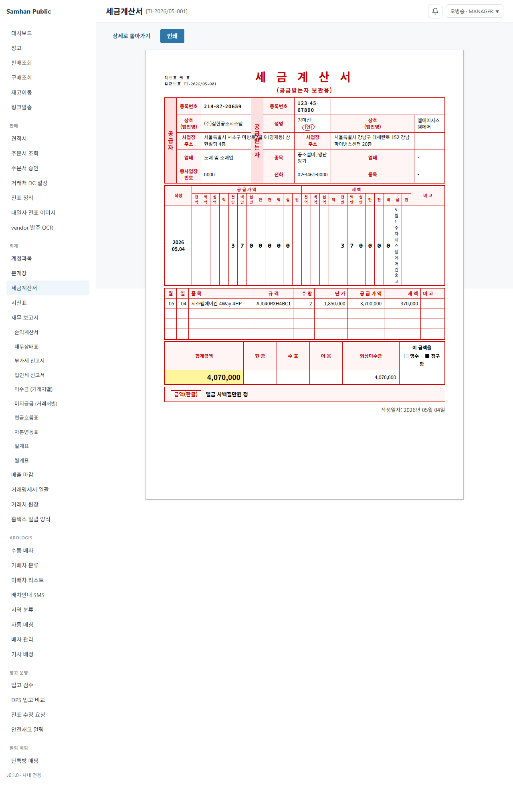
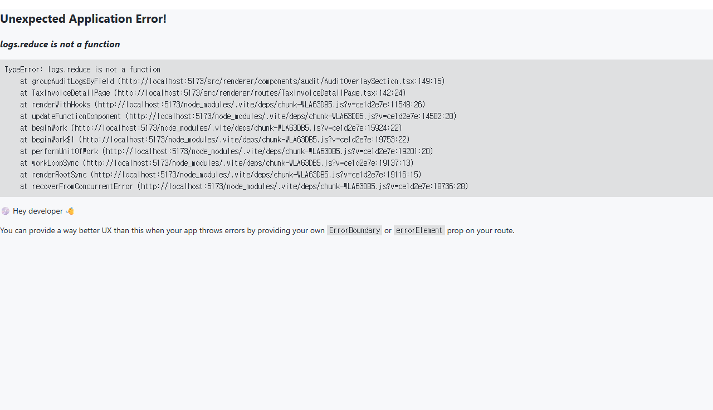

# 03. 세금계산서 발행

> **Stage 안내**: Stage 1 ✅ (정식 본문) — P0-4 세금계산서 발행/인쇄/취소 정식 운영 (PR #139).
> GAS 이식 — 일괄발행 (홈택스 양식) 5탭 페이지 (`/accounting/hometax-export`) 로 통합됨.
> **사이드바 변경**: "세금계산서 일괄발행" 항목 제거 → "홈택스 일괄 양식" 단일 항목으로 접근.

일괄발행 (홈택스 양식) 기능은 [5. 일괄 발행 (홈택스 양식)](#5-일괄-발행-홈택스-양식) 섹션을 참고하세요.

---

## 1. 구현 상태

| 항목 | 상태 | 비고 |
| --- | --- | --- |
| 세금계산서 발행 (Frontend) | ✅ 구현 | P0-4 — `/accounting/tax-invoices/*` 4개 라우트 |
| 세금계산서 인쇄 양식 | ✅ 구현 | P0-4 — NTS 표준 A4 portrait 양식 |
| 세금계산서 취소 (사유 dialog) | ✅ 구현 | P0-4 — 역분개 자동 생성 |
| 세금계산서 DRAFT 저장/편집 | ✅ 구현 | P0-4 — 거래처 자동완성 + 라인 다중 |
| 발행 history 조회 | ✅ 구현 | P0-4 — 필터 (상태/기간/거래처) + 페이지네이션 |
| 일괄발행 (홈택스 양식) | ✅ 구현 | GAS 이식 — `/accounting/hometax-export` 5탭 (HometaxExportPage 통합, PR #161 흡수) |
| 전자세금계산서 NTS 연계 | ⛔ 미구현 | Phase 11+1개월 |

---

## 2. 대상 독자

- 거래처에 세금계산서를 발행해야 하는 회계 직원 (ACCOUNTANT)
- 발행 history 를 검토하는 영업 부장 (MANAGER)
- 시스템 전체 접근 권한을 가진 MASTER

---

## 3. 학습 내용

- 세금계산서 DRAFT 작성 → 발행 (ISSUED) 전이 흐름
- 거래처 자동완성 + 사업자번호 자동 입력
- 라인별 품목 / 수량 / 단가 입력 + 공급가액 / 부가세 자동 계산
- 발행 후 자동 분개 생성 (110 외상매출금 / 255 부가세예수금 / 400 매출)
- 취소 시 역분개 자동 생성 + 사유 필수 입력
- NTS 표준 A4 세금계산서 인쇄

---

## 4. 본문

### 4-1. 세금계산서 목록 (`/accounting/tax-invoices`)

좌측 사이드바 **[회계]** > **[세금계산서]** 를 클릭하면 발행 history 목록이 표시됩니다.

**필터**:
- **상태**: 전체 / 임시저장(DRAFT) / 발행(ISSUED) / 취소(CANCELLED)
- **기간 (시작 ~ 종료)**: 공급일자 기준 날짜 범위 지정
- **거래처명**: 부분 문자열 검색 (클라이언트 필터)

**표 컬럼**: 세금계산서번호 / 거래처 (사업자번호) / 작성일 / 공급가액 / 세액 / 합계 / 상태 badge

> UUID 비공개 가드: 세금계산서번호(taxInvoiceNo) + 거래처명만 화면에 표시됩니다.

---

### 4-2. 세금계산서 작성 (`/accounting/tax-invoices/new`)

목록 화면 우측 상단 **[신규 작성]** 버튼을 클릭합니다.

#### 단계 1 — 거래처 검색

1. **거래처 검색** 입력란에 거래처명 또는 사업자번호 입력 (1자 이상)
2. 자동완성 목록에서 거래처 클릭
3. 거래처명 / 사업자번호 / 주소가 자동 입력됩니다

#### 단계 2 — 헤더 정보 입력

| 필드 | 설명 |
| --- | --- |
| 거래처명 | 자동완성 또는 직접 입력 |
| 사업자번호 | 자동완성 또는 수정 가능 |
| 공급일자 | 세금계산서 작성일 (YYYY-MM-DD) |
| 주소 | 거래처 사업장 주소 |
| 비고 | 적요 / 설명 (선택) |

#### 단계 3 — 라인 입력

| 컬럼 | 설명 |
| --- | --- |
| 품명 | 공급 품목명 (필수) |
| 규격 | 모델명 / 규격 (선택) |
| 수량 | 공급 수량 (양수) |
| 단가 | 원 단위 단가 |
| 공급가액 | 수량 × 단가 (자동 계산) |
| 부가세 | 공급가액 × 10% (자동 계산) |

라인은 **[+ 라인 추가]** 버튼으로 행 추가, 우측 × 버튼으로 행 삭제.

#### 단계 4 — 저장 또는 발행

- **[저장 (DRAFT)]**: 임시저장 후 상세 화면으로 이동
- **[발행 (ISSUED)]**: 편집 모드에서 바로 발행 (저장 후 ISSUED 전이)

> 주의: 신규 작성 화면에서는 먼저 DRAFT 로 저장 후 상세 화면에서 발행하세요.

---

### 4-3. 세금계산서 상세 / 발행 (`/accounting/tax-invoices/:id`)

목록에서 행 클릭 또는 저장 후 자동 이동합니다.

#### 상태별 가능한 액션

| 상태 | 가능한 액션 |
| --- | --- |
| DRAFT (임시저장) | 편집 / 발행 |
| ISSUED (발행) | 취소 / 인쇄 |
| CANCELLED (취소) | 인쇄 (read-only) |

#### 발행 처리

1. DRAFT 세금계산서 상세 화면 진입
2. **[발행]** 버튼 클릭
3. 확인 dialog 확인 → ISSUED 전이
4. 자동 분개 생성 안내 (110 외상매출금 / 255 부가세예수금 / 400 매출)
5. 분개장 link 를 클릭해 자동 분개 확인 가능

#### 취소 처리

1. ISSUED 세금계산서 상세 화면 진입
2. **[취소]** 버튼 클릭
3. 취소 사유 입력 Modal 표시 (필수 — 최대 200자)
4. **[취소 확인]** 클릭 → CANCELLED 전이
5. 자동 역분개 생성 (원본 분개 보존)

---

### 4-4. 인쇄 양식 (`/accounting/tax-invoices/:id/print`)

상세 화면에서 **[인쇄]** 버튼을 클릭하면 새 창이 열립니다.

**NTS 표준 전자세금계산서 양식**:
- A4 portrait / 12mm 여백
- 좌상단: 책번호 / 일련번호 (taxInvoiceNo)
- 타이틀: "세 금 계 산 서 (공급받는자 보관용)"
- 공급자 박스 (좌): 등록번호 / 상호 / 성명 / 사업장주소 / 업태 / 종목
- 공급받는자 박스 (우): 등록번호 / 상호 / 사업장주소 / 업태 / 종목
- 작성일자 (연/월/일 셀 분리)
- 공급가액 / 세액 (11자리 셀 분리 — 천억-백억-...-원)
- 라인 표: 월 / 일 / 품목 / 규격 / 수량 / 단가 / 공급가액 / 세액 / 비고
- 합계금액 + 현금 / 수표 / 어음 / 외상미수금 + 영수/청구 체크박스
- 금액(한글) — 일금 ◯◯◯원 정

**인쇄 버튼** (새 창 상단): 상세로 돌아가기 / 인쇄

> DRAFT 상태에서도 인쇄 미리보기는 가능하나, 일련번호는 "미발행 (DRAFT)" 로 표시됩니다.

---

### 4-5. 전자세금계산서 NTS 연계 (예정)

NTS 홈택스 전자세금계산서 API 자동 연계는 Phase 11+1개월 후 출시 예정입니다.
현재는 시스템 내 발행 후 별도 홈택스 신고가 필요합니다.

---

## 5. 일괄 발행 (홈택스 양식)

> **라우트**: `/accounting/hometax-export` — 좌측 사이드바 **[회계]** > **[홈택스 일괄 양식]** 또는 세금계산서 목록 화면 우측 상단 **[일괄 발행 (홈택스 양식)]** 버튼.
>
> **이전 경로** (`/accounting/tax-invoices/batch`) 접근 시 자동 redirect 됩니다 (북마크 호환).

> **권한**: ACCOUNTANT / MANAGER / MASTER

기존 GAS(Google Apps Script) 도구 `계산서일괄등록양식 생성/Index.html` 의 4탭 UI 를 SamhanLogis 플랫폼으로 이식하여 HometaxExportPage 에 통합한 기능입니다. (PR #161 TaxInvoiceBatchPage 이중 구현 정리 — PR cleanup)
SlipQueryService 조회 결과를 홈택스 일괄등록 CSV 양식으로 변환하여 Excel 다운로드까지 완성합니다.

**5탭 구성** (Tab 0 단순 다운로드 포함):

| 탭 | 명칭 | 설명 |
|---|---|---|
| Tab 0 | 단순 다운로드 | 기존 legacy GET 방식 단일 .xlsx 다운로드 (회귀 보존) |
| Tab 1 | 미리보기 생성 | POST /hometax-export/preview (59컬럼 변환 + 분할) |
| Tab 2 | 결과 페이지 | DataGrid + 파일 navigation + Excel 다운로드 |
| Tab 3 | 거래처 필터링 | 제외 거래처 코드 CRUD |
| Tab 4 | 저장 내역 | 과거 이력 + 행 클릭 → Tab 2 복원 |

---

### 5-1. Tab 1 — 미리보기 생성

**접근**: 탭 헤더 **[미리보기 생성]** 클릭.

| 필드 | 기본값 | 설명 |
| --- | --- | --- |
| 기간 (시작) | 이번달 1일 (Asia/Seoul) | 처리 기준 기간 시작일 |
| 기간 (종료) | 이번달 말일 (Asia/Seoul) | 처리 기준 기간 종료일 |
| 모든 전표 포함 | 체크 해제 | 체크 해제 = 회계반영일자 확정 전표만 포함 |

**처리 실행** 버튼 클릭 시:
- `POST /api/v1/accounting/hometax-export/preview` 호출
- 완료 후 batchNo / 총 건수 / 분할 파일 수 표시
- 자동으로 **Tab 2 (결과 페이지)** 로 이동

---

### 5-2. Tab 2 — 결과 페이지

미리보기 생성 후 이동하거나 Tab 4 (저장 내역) 에서 이력 행 클릭 시 복원됩니다.

**표 컬럼** (가로 스크롤 — 홈택스 양식 기준):

| 컬럼 | 설명 |
| --- | --- |
| 전표번호 | slipNo — 사용자 노출 식별자 |
| 작성일자 | 공급일자 |
| 공급자 상호 / 사업자번호 | (주)삼한로지스 |
| 공급받는자 상호 / 사업자번호 | 거래처 정보 |
| 공급받는자 이메일 | 전자세금계산서 수신 이메일 |
| 공급가액 / 세액 / 합계 | KRW 천단위 콤마 |
| 품목명 / 규격 / 수량 / 단가 | 라인 정보 |
| 거래처 코드 | partnerCode — 비즈니스 식별자 |
| 비고 | remark |

**100건 단위 분할**:
- 전체 rows 가 100건 초과 시 파일 단위로 분할 표시
- 좌측 `<` / `>` 버튼으로 파일 이동 (1번 파일 = 1~100건, 2번 = 101~200건, ...)
- 우측 **[Excel 다운로드 (N번)]** 버튼 → `GET /hometax-export/{batchId}/split?fileIndex=N-1` → `.xlsx` 자동 다운로드

---

### 5-3. Tab 3 — 거래처 필터링

미리보기 생성 시 자동 제외할 거래처 코드 마스터를 관리합니다.

**목록**: `GET /hometax-export/exclusions` — 거래처 코드 / 거래처명 / 제외 사유 / 등록일시 / 등록자

**신규 추가**:
1. 상단 추가 폼에 거래처 코드 / 거래처명 / 제외 사유 입력
2. **[추가]** 버튼 클릭 → `POST /hometax-export/exclusions`
3. 목록 자동 갱신

**삭제**: 행 우측 **[삭제]** 버튼 → `DELETE /hometax-export/exclusions/{partnerCode}` → 목록 갱신

> UUID 비공개 가드: partnerCode (비즈니스 식별자) 만 화면에 표시됩니다.

---

### 5-4. Tab 4 — 저장 내역

`GET /hometax-export/history` — 과거 일괄발행 이력 목록 (20건/페이지).

| 컬럼 | 설명 |
| --- | --- |
| 배치번호 | batchNo — 사용자 노출 식별자 |
| 처리 기간 | fromDate ~ toDate |
| 처리일시 | processedAt |
| 작업자 | processedBy |
| 총 행 수 | totalRowCount |
| 파일 수 | splitFileCount |

**행 클릭** → `GET /hometax-export/history/{batchId}` — dataSnapshotJson 복원 후 Tab 2 로 자동 이동.

---

### 5-5. 주의 사항

- 100건 분할: splitFileCount > 1 이면 각 파일을 순서대로 홈택스에 업로드하세요.
- 제외 거래처 마스터에 등록된 코드는 미리보기 생성 시 자동 제외됩니다. 포함이 필요한 경우 Tab 3 에서 해당 코드를 삭제하세요.
- 저장 내역의 dataSnapshotJson 은 생성 시점의 데이터 기반이므로 실시간 재조회와 다를 수 있습니다.

---

### 5-6. QA 시나리오 인용 (QA agent 검증 기준)

본 섹션 기능은 다음 QA 산출물로 검증됩니다.

**Playwright 시나리오 (TC-TIB 7건)**:
`docs/qa/tax-invoice-batch-gas-port/scenarios/tax-invoice-batch-scenarios.md`

| TC | 검증 항목 |
|---|---|
| TC-TIB-1 | `/accounting/tax-invoices/batch` 진입 시 4탭 모두 visible |
| TC-TIB-2 | Tab 1 날짜 입력 + 처리 실행 → totalRowCount 표시 + Tab 2 자동 이동 |
| TC-TIB-3 | 250건 기준 splitFileCount=3 파일 navigation + Excel 다운로드 blob |
| TC-TIB-4 | Tab 3 제외 거래처 add / list / delete 인터랙션 |
| TC-TIB-5 | Tab 4 이력 목록 + 행 클릭 시 Tab 2 데이터 복원 |
| TC-TIB-6 | 사이드바 "홈택스 일괄 양식" NavLink visible (ACCOUNTANT 이상), "세금계산서 일괄발행" 항목 미노출 확인 |
| TC-TIB-7 | TaxInvoiceListPage "일괄 발행" 버튼 클릭 시 `/accounting/hometax-export` 이동 확인 |

**JUnit IT E2E 시나리오 (E2E-IT 4건)**:
`docs/qa/tax-invoice-batch-gas-port/scenarios/tax-invoice-batch-e2e-scenarios.md`

| E2E-IT | 검증 항목 |
|---|---|
| E2E-IT-1 | 5건 ISSUED → preview → Excel POI 파싱 → row count=5 검증 |
| E2E-IT-2 | 250건 → splitFileCount=3 → fileIndex 0/1/2 Excel 행 수 100/100/50 |
| E2E-IT-3 | preview 저장 → history 단건 조회 → dataSnapshotJson gzip 복원 정확성 |
| E2E-IT-4 | 제외 거래처 등록 후 preview → 해당 거래처 row 0건 |

**스크린샷 가이드**:
- QA 실행 후 스크린샷 7장이 `docs/qa/tax-invoice-batch-gas-port/` 에 자동 저장됩니다.
- PR 본문 인라인 첨부 의무 (메모리 가드 `feedback_pr_qa_screenshots.md`).
- 파일명 패턴: `TC-TIB-{N}-*.png` (예: `TC-TIB-1-batch-4tabs-visible.png`)

---

## 6. 화면 미리보기

### 6-1. 세금계산서 목록 (일괄 발행 버튼 추가)

### 6-2. 세금계산서 작성 폼

### 6-3. 세금계산서 상세 (ISSUED)

### 6-4. 세금계산서 인쇄 양식 (NTS 표준)

### 6-5. 취소 사유 입력 Modal

---

## 7. FAQ

**Q1. DRAFT 저장 후 발행 버튼이 보이지 않습니다.**
A. 권한 확인 — ACCOUNTANT 또는 MASTER 만 발행 가능합니다. 권한이 맞다면 DRAFT 상태인지 확인하세요.

**Q2. 발행 후 수정이 필요합니다.**
A. ISSUED/CANCELLED 상태는 수정 불가입니다. 취소 후 신규 작성하세요.

**Q3. 취소 사유 입력을 생략할 수 있나요?**
A. 불가합니다. 취소 사유는 1자 이상 필수 입력입니다 (감사 추적 의무).

**Q4. 인쇄 시 거래처 업태/종목이 "-" 로 표시됩니다.**
A. 거래처 정보에 업태/종목 미등록 상태입니다. 관리자 > 거래처 관리에서 보완 후 재발행하세요.

**Q5. 자동 분개 계정과목이 맞지 않습니다.**
A. 자동 분개는 110(외상매출금)/255(부가세예수금)/400(매출) 고정입니다. 변경이 필요하면 분개장에서 직접 수정하세요.

**Q6. 일괄발행 결과 페이지 탭이 비활성화되어 있습니다.**
A. Tab 1 (미리보기 생성) 에서 [처리 실행] 을 완료하거나 Tab 4 (저장 내역) 에서 이전 이력을 클릭하면 활성화됩니다.

**Q7. 일괄발행 Excel 다운로드가 실패합니다.**
A. 백엔드 연결을 확인하세요. Mock 모드에서는 CSV 텍스트가 반환됩니다 (실제 `.xlsx` 는 정식 BE 연결 시 동작).

---

## 8. 관련 매뉴얼

- [01. 분개 입력](01-분개-입력.md)
- [02. 보고서](02-보고서.md)
- [04. 월말 마감](04-월말-마감.md)
- [01-영업 / 03. 전표 발행](../01-영업/03-전표-발행.md)
- [02-창고 / 04. 매출 마감](../02-창고/04-매출-마감.md)
