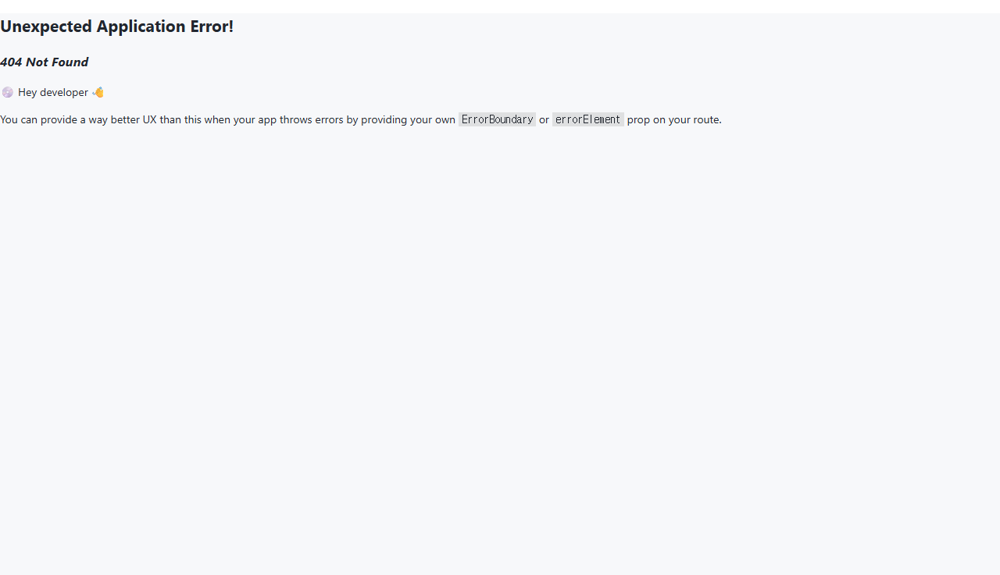
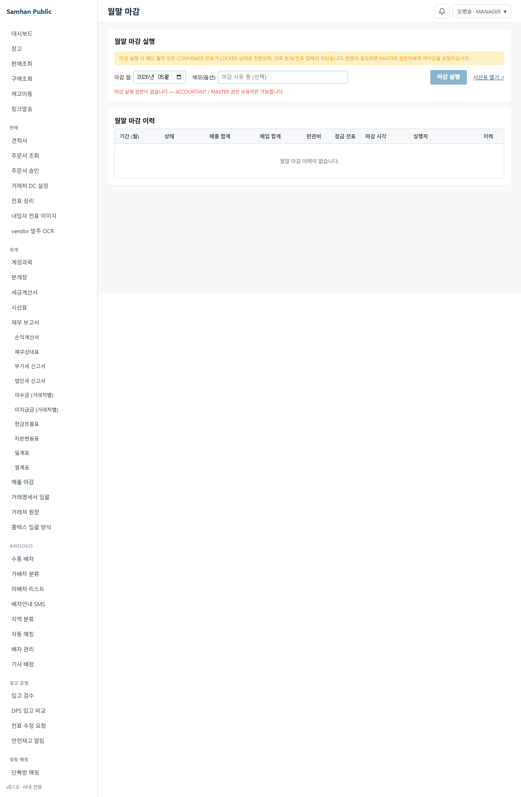

# 04. 월말 마감

> **Stage**: Stage 1 ✅ — P2-3 구현 완료. 정식 월말 마감 화면 `/accounting/period-close` 운영 중.

---

## 1. 구현 상태

| 항목 | 상태 | 비고 |
| --- | --- | --- |
| 월말 마감 화면 (`/accounting/period-close`) | ✅ 운영 | PeriodCloseListPage (P2-3) |
| 월말 마감 실행 | ✅ 운영 | ACCOUNTANT / MASTER |
| 역마감 | ✅ 운영 | MASTER 전용 |
| 마감 이력 표 | ✅ 운영 | 기간 / 상태 / 매출 / 실행자 |
| 감사 이력 패널 | ✅ 운영 | PR-H4c |
| 시산표 link | ✅ 운영 | `/accounting/balances` 새 탭 |

---

## 2. 대상 독자

- 월말 마감을 진행하는 회계 직원 (ACCOUNTANT)
- 마감 후 데이터를 확정하는 외주 회계
- 역마감 처리를 담당하는 시스템 관리자 (MASTER)

---

## 3. 학습 내용

- 월말 마감 체크리스트
- 마감 실행 절차 (ACCOUNTANT / MASTER)
- 마감 후 분개/전표 변경 차단 정책
- 역마감 요청 및 처리 (MASTER 전용)
- 감사 이력 패널 확인

---

## 4. 본문

### 4-1. 월말 마감 체크리스트

매월 말일 또는 익월 5영업일 내 처리.

| # | 항목 | 책임자 | 화면 |
| --- | --- | --- | --- |
| 1 | DELIVERED 전표 모두 INVOICED 전환 | 회계 | 세금계산서 목록 ([03. 세금계산서](03-세금계산서.md)) |
| 2 | 거래처별 매출 합계 확정 | 영업+회계 | 매출 마감 ([02-창고/04. 매출 마감](../02-창고/04-매출-마감.md)) |
| 3 | 미수금 / 미지급금 잔액 확인 | 회계 | 거래처원장 ([02. 보고서](02-보고서.md)) |
| 4 | 재고 평가 | 재고+회계 | 재고 잔액 시산표 + 실사 ([02-창고/05. 재고 실사](../02-창고/05-재고-실사.md)) |
| 5 | 시산표 검증 (차변=대변) | 회계 | 시산표 ([02. 보고서](02-보고서.md)) |
| 6 | 분개 POSTED 처리 (DRAFT 0건) | 회계 | 분개 목록 필터 ([01. 분개 입력](01-분개-입력.md)) |
| 7 | 월말 마감 실행 | ACCOUNTANT | `/accounting/period-close` |

### 4-2. 월말 마감 화면 진입

좌측 사이드바 **[회계]** > **[월말 마감]** 진입 (`/accounting/period-close`).

- 진입 권한: **ACCOUNTANT** / **MASTER**

### 4-3. 마감 실행

#### 단계 1 — 마감 월 선택

**마감 월** picker 에서 마감할 월 선택 (YYYY-MM).

#### 단계 2 — 메모 입력 (선택)

마감 사유, 특이사항 등을 500자 이내로 입력.

#### 단계 3 — 마감 실행

**[마감 실행]** 버튼 클릭.

BE 동작:
1. slip-service 를 통해 해당 월 CONFIRMED 전표 일괄 LOCKED 처리
2. accounting-service 에 매출/매입/판관비 합계 stamp + status=CLOSED 기록
3. 이후 해당 월 분개/전표 변경은 자동 차단 (AccountingPeriodGuard)

#### 사전 검증 권장 사항

마감 실행 전 다음을 반드시 확인하세요.

1. **시산표 검증**: 상단 **[시산표 열기]** 링크 → 차변 = 대변 확인
2. **DRAFT 분개 0건**: 분개 목록에서 DRAFT 상태 0건 확인
3. **미발행 세금계산서 0건**: 세금계산서 목록에서 DRAFT 상태 0건 확인

### 4-4. 마감 이력 조회

하단 마감 이력 표에서 과거 마감 내역을 확인합니다.

| 컬럼 | 설명 |
| --- | --- |
| 기간 (월) | 마감 대상 월 (YYYY-MM) |
| 상태 | 열림(OPEN) / 마감(CLOSED) |
| 매출 합계 | 마감 당시 매출 집계 |
| 매입 합계 | 마감 당시 매입 집계 |
| 판관비 | 마감 당시 판관비 집계 |
| 잠금 전표 | LOCKED 처리된 전표 건수 |
| 마감 시각 | 마감 실행 시각 |
| 실행자 | 마감을 실행한 사용자 |

각 행 우측 **[이력 보기]** 버튼 → 감사 이력 패널 표시.

### 4-5. 역마감 (MASTER 전용)

마감 이력 행의 **[역마감]** 버튼은 **MASTER** 권한자에게만 표시됩니다.

1. **[역마감]** 버튼 클릭 → 확인 팝업
2. 확인 시 해당 월 마감 해제 (CLOSED → OPEN)
3. 전표/분개 변경이 다시 허용됨
4. 수정 완료 후 재마감 필요

원칙: 마감 후 변경 금지. 외부 감사 / 외주 회계 협의 후 처리.

- 변경 사유를 마감 메모에 기록
- 역마감 → 변경 분개 등록 → 즉시 재마감

### 4-6. 감사 이력 패널

마감 이력 표의 **[이력 보기]** 버튼 클릭 시 하단에 패널이 표시됩니다.

- 수정 횟수 badge (수정 N회)
- 메모 필드의 변경 이력 (변경 전/후, 변경자, 변경 시각)
- CLOSED 상태에서는 잠금 banner 표시

---

## 5. 화면 미리보기

### 5-1. 월말 마감 실행

### 5-2. 마감 이력 표

### 5-3. 시산표 검증 (마감 전 필수)

---

## 6. FAQ

**Q1. 마감 후 분개 변경이 가능한가요?**
A. 정책상 금지입니다. MASTER 에게 역마감을 요청하고, 변경 완료 후 재마감하세요. 감사 이력에 자동 기록됩니다.

**Q2. ACCOUNTANT 인데 역마감 버튼이 보이지 않습니다.**
A. 역마감은 MASTER 권한 전용입니다. 시스템 관리자(MASTER)에게 요청하세요.

**Q3. 마감 시한은 언제인가요?**
A. 익월 5영업일 내 권고. 외부 감사 일정에 따라 조정합니다.

**Q4. 마감 실행 후 신규 분개를 등록하면 어떻게 되나요?**
A. 해당 월 분개 등록 시 backend 에서 자동 거부됩니다. 다음 달 분개로 등록하거나, 역마감 후 처리하세요.

**Q5. 시산표 검증을 먼저 해야 하나요?**
A. 권장 순서입니다. 시산표에서 차변 = 대변이 맞지 않으면 마감 전 분개 오류를 먼저 수정하세요.

**Q6. 결산일(12/31)은 어떻게 처리하나요?**
A. 12월을 월별 마감하면 됩니다. 한국 일반기업회계기준 상 회계연도 = 1/1 ~ 12/31.

---

## 7. 관련 매뉴얼

- [01. 분개 입력](01-분개-입력.md)
- [02. 보고서](02-보고서.md)
- [03. 세금계산서](03-세금계산서.md)
- [02-창고 / 04. 매출 마감](../02-창고/04-매출-마감.md)
- [02-창고 / 05. 재고 실사](../02-창고/05-재고-실사.md)
- [07-부록 / 02. 용어집](../07-부록/02-용어집.md)
