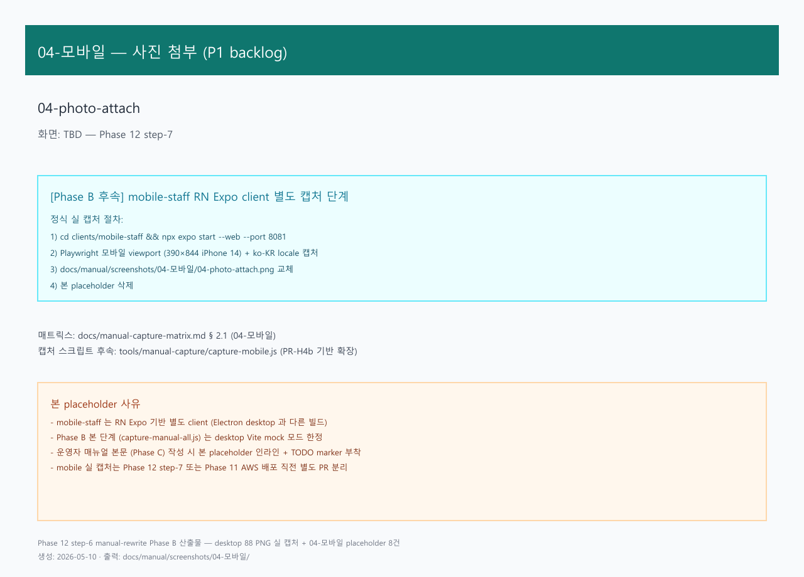

# 04. 현장 사진 첨부

> **Stage 안내**: Stage 5 — P1 사진 첨부 3건 구현 완료 (2026-05-11). inventory-service 검수 사진 / slip-service 배송 완료 사진 / partner-service 영업 방문 사진.

---

## 1. 구현 상태

| 항목 | 상태 | 비고 |
| --- | --- | --- |
| 검수 사진 첨부 (입고) | ✅ 구현 (P1) | 기사/창고 앱 [검수사진] 탭 |
| 배송 완료 사진 첨부 | ✅ 구현 (P1) | 서명 흐름 + 사진 toggle |
| 영업 방문 사진 첨부 | ✅ 구현 (P1) | 영업 앱 [방문사진] 탭 + 메모 |
| Desktop 검수 사진 viewer | ✅ 구현 (P1) | 입고 검수 dialog 썸네일 + lightbox |
| 이메일 / 카톡 별도 전송 | ✅ 우회 가능 | 앱 업로드가 어려운 경우 |

현장 사진 첨부는 입고 검수 / 배송 완료 / 영업 방문 시 증빙 사진을 슬립에 첨부하는 기능입니다.
P1 에서 3가지 흐름 모두 구현되었으며, desktop 에서는 업로드된 사진을 viewer 로 확인할 수 있습니다.

---

## 2. 대상 독자

- 입고 검수 시 불량 사진 첨부 필요 창고 직원 / 배송 기사 (WAREHOUSE / DRIVER)
- 배송 완료 사진 증빙 필요 배송 기사 (DRIVER)
- 영업 방문 사진 보관 필요 영업 직원 (SALES)
- 검수 사진 확인 필요 창고 관리자 / 영업 (MANAGER / MASTER)

---

## 3. 학습 내용

- 모바일 앱에서 카메라 / 갤러리 사진 촬영 및 첨부
- 사진 자동 압축 (1920×1080, JPEG 80%) 및 용량 가드 (5MB)
- EXIF GPS 자동 추출 (촬영 위치 증빙)
- desktop 입고 검수 화면에서 사진 viewer 확인

---

## 4. 본문

### 4-1. 검수 사진 첨부 (배송 기사 / 창고 직원)

입고 슬립 검수 시 화물 상태 / 불량 / 수량 차이 사진을 첨부합니다.

#### 사용 방법

1. 모바일 앱 하단 [배송기사] 모드 진입 → [검수사진] 탭 선택
2. 슬립 정보 확인 (전표번호 / 창고 / 거래처)
3. [촬영] 버튼으로 현장 사진 촬영 또는 [갤러리]에서 선택 (최대 5장)
4. 썸네일 미리보기 확인 후 [검수 사진 N장 업로드] 버튼 클릭
5. 업로드 완료 확인 → desktop 검수 화면에서 사진 viewer 확인 가능

#### 주의사항

- 불량 발생 시 불량 부위 + 전체 사진 각 1장 이상 첨부 권장
- 사진 압축 후에도 5MB 초과 시 다른 사진으로 대체
- 업로드 실패 시 Wi-Fi / LTE 연결 확인 후 재시도 (자동 3회)

---

### 4-2. 배송 완료 사진 첨부 (배송 기사)

배송 완료 시 인수 증빙 사진을 서명과 함께 첨부합니다.

#### 사용 방법

1. [배송기사] 모드 → [서명] 탭 진입
2. 정차 정보 확인 후 [사진 첨부 활성] toggle ON
3. 첨부 유형 선택: [배송사진] (인수 증빙) 또는 [검수사진] (화물 상태)
4. [촬영] 또는 [갤러리]에서 사진 선택 (최대 5장)
5. [사진 N장 업로드] → 완료 확인 → 서명 캡처 진행

#### 배송 토큰 안내

- 배송 사진 업로드는 배차 담당이 발급한 DeliveryBatch 토큰 기반
- 토큰 만료 시 "배송 토큰이 만료되었습니다" 메시지 → 영업/배차 담당에게 새 링크 요청

---

### 4-3. 영업 방문 사진 첨부 (영업 직원)

거래처 방문 시 설치 위치 / 현장 / 상담 내용 사진 및 메모를 기록합니다.

#### 사용 방법

1. 모바일 앱 [영업견적] 모드 → [방문사진] 탭 선택
2. 거래처 정보 확인 (코드 / 거래처명 / 방문일 자동 오늘)
3. 방문 메모 입력 (선택 — 상담 내용, 특이사항, 최대 500자)
4. [촬영] 또는 [갤러리]에서 사진 선택 (최대 5장)
5. [방문 사진 N장 업로드] → 완료 확인

#### 방문 사진 조회

- 업로드된 방문 사진은 desktop 거래처 상세 화면에서 조회 예정 (P2 — Phase 12)
- 현재는 업로드 후 BE 스토리지 저장 확인

---

### 4-4. Desktop 검수 사진 viewer

desktop 입고 검수 화면에서 mobile-staff 에서 업로드된 사진을 확인합니다.

#### 사용 방법

1. desktop [창고] → [입고 검수] 메뉴 진입
2. 목록에서 해당 슬립 행 클릭 → 검수 dialog 열림
3. dialog 하단 [검수 사진] 섹션에서 썸네일 목록 확인
4. 썸네일 클릭 → lightbox 확대 (파일명 / 크기 / 촬영 시각 / 업로드자 / GPS 확인)

#### 업로드 안내

- desktop 에서는 사진 업로드 불가 — 업로드는 mobile-staff 에서만 진행
- S3 연동 전 환경에서는 썸네일이 빈 상태로 표시됨 (메타 정보만 확인 가능)

---

## 5. 화면 미리보기

### 5-1. 검수 사진 첨부 (mobile)

### 5-2. 배송 완료 사진 첨부 (mobile)

### 5-3. 영업 방문 사진 첨부 (mobile)

### 5-4. Desktop 검수 사진 viewer

---

## 6. FAQ

**Q1. 사진을 영구 보관해야 하나요?**
A. 한국 회계 표준상 거래 증빙은 5년 이상 보관 의무. 업로드된 사진은 서버(S3)에 자동 저장됩니다.

**Q2. 사진 용량은?**
A. 자동 압축 (1920×1080, JPEG 80%) 적용. 압축 후에도 5MB 초과 시 다른 사진을 선택해주세요.

**Q3. 사진 업로드가 실패하면?**
A. Wi-Fi/LTE 연결 확인 후 [업로드] 버튼을 다시 누르면 실패한 사진만 재시도합니다 (최대 3회 자동).

**Q4. EXIF GPS 는 무엇인가요?**
A. 사진 촬영 위치 정보 (위도/경도). 현장 방문 증빙에 활용됩니다. 카메라 위치 정보 허용 시 자동 추출.

**Q5. Desktop 에서 사진 업로드가 안 되나요?**
A. P1 단계에서는 desktop 은 사진 viewer 전용입니다. 업로드는 mobile 앱에서 진행해주세요.

**Q6. 방문 사진을 카톡으로 별도 전송해야 하나요?**
A. 앱 업로드 완료 시 별도 카톡 전송 불필요합니다. 서버에 자동 저장됩니다.

---

## 7. 관련 매뉴얼

- [01. 기사 앱](01-기사-앱.md)
- [02. 전자 서명](02-전자-서명.md)
- [02-창고 / 01. 입고 처리](../02-창고/01-입고-처리.md)
