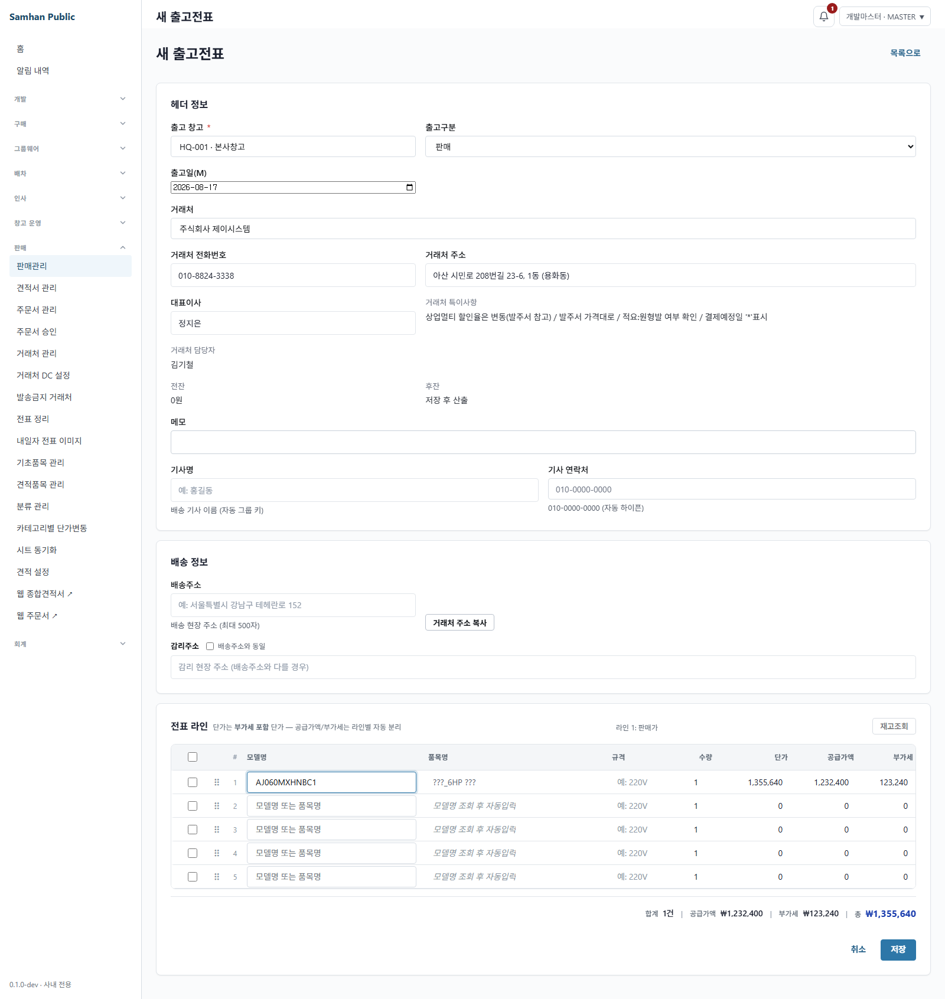
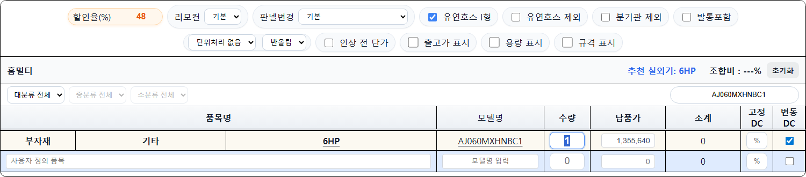
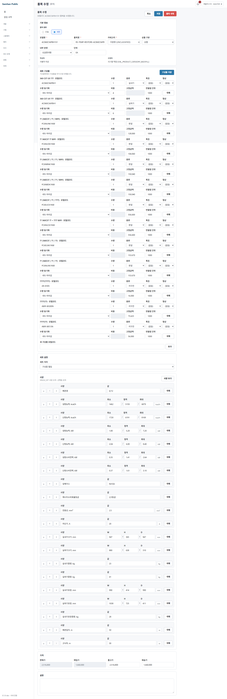

# PR #1241 CODEX SOL 머지 판정 R2

- 판정 시각: 2026-08-17 16:13 KST
- 대상: `feat/gas-parity-order-web` / `e0e538a465e58c0e9477033b53ac1cc6d6f10f59`
- 결론: **머지 불가 — 실사용자 화면 도달 결함 1건**

## ① desktop · estimate-app 동일 조건 금액 대조

공유 인증(로그인 HTTP 200), 이 브랜치에서 빌드한 product-service JAR, 격리 PostgreSQL을 사용했다. 거래처 할인율 48%, `AJ060MXHNBC1`, 수량 1로 두 화면을 직접 조작했다. 행 수도 함께 셌다.

| desktop 새 출고전표 | estimate-app 홈멀티 |
|---|---|
|  |  |
| 화면 5행, 입력 1행, **1,355,640원** | 필터 결과 1행, 입력 1행, **1,355,640원** |

- desktop: 납품가 2,607,000원에 48% DC를 적용해 1,355,640원.
- estimate-app에서 **`인상 전 단가`를 끈 경우**: API `outboundPrice=2,607,000`, 화면 기준가 2,607,000원, 결과 1,355,640원.
- 캡처 SHA-256: desktop `c846207f0b4b9bbf0b561420bab314346ef6bc208aa99219a6a236e9eaff5be3`, estimate-app `cc454261b5c0e3294c4a51f9ebddb722c7000bf358953d4ac96339ccd07a90fe`.

그러나 실제 기본 진입 상태를 별도로 재현하면 `인상 전 단가`가 켜져 있었다. 이때 격리 브랜치 런타임의 관측값은 아래와 같다.

```text
chkHomeInc=true
HOMEMULTI.list=2,607,000
PRICE_INC.home[AJ060MXHNBC1]=2,929,300
화면 기준가=2,929,300
48% DC 결과=1,523,236
행 수=1, 입력 행=1
```

즉 `db-catalog.js`의 일반 카탈로그 축은 `outboundPrice`로 바뀌었지만, 기본 활성인 가격변경 baseline이 `releasePrice` 2,929,300원으로 다시 덮는다. 사용자가 옵션을 일부러 끄기 전에는 수정 전 금액이 그대로 보인다.

**도달 결함 1:** estimate-app 기본 화면에서 동일 거래처·품목·수량인데 desktop 1,355,640원과 estimate-app 1,523,236원이 다시 갈린다. 목표 금액은 옵션 해제 후에만 도달한다.

## ② 싱글중대형 구성품 금액

격리 product-service를 데스크톱 품목 편집 화면에 연결해 `AC060CS6PBH1SY`를 열었다.

- 화면 구성품: **13행**
- 판넬 `PC6NUNK1NW`: **128,000원**
- 리모컨 `AR-EH05`: **16,000원**
- 판정: 직전 결함 재발 없음



캡처 SHA-256: `6dcb3a8e33277e1273607791229b933a4838c7cf0106fb28e75773b6103c9000`.

## ③ 271세트 직접 재현

격리 DB의 활성 `SINGLE_SET`/`EXPAND` 부모 271건을 직접 열거한 뒤, 이 브랜치 product-service의 `POST /products/internal/expand`를 각 세트에 수량 1로 호출했다.

```text
sets=271
expanded component lines=855
HTTP/errors=0
전환 전 부모 세트 합=518,775,000원
전환 후 구성품 합=518,775,000원
순증감=0원
세트-구성품 합 불일치=0건
```

따라서 271건 총액과 세트별 합 계약은 통과한다.

## ④ outboundPrice 전역 변경 부작용

실제 estimate-app 런타임과 격리 API를 함께 대조했다.

| 범위 | 직접 관측 |
|---|---|
| 홈멀티 일반축 | `AJ060MXHNBC1`: API/메모리/화면 기준가 모두 2,607,000원, 48% 결과 1,355,640원 — 단, `인상 전 단가` 해제 시 |
| 상업멀티 일반축 | `AM080AXVHHH1`: API/메모리/화면 기준가 모두 7,351,300원, 필터 결과 1행 |
| 구제품 | 런타임 39행이 기준가 전환 전후 동일 |
| 운임·절삭 catalog 특수행 | 현재 격리 스냅샷의 활성 제품 0행. 런타임 특수행 metadata 변형 0건 |

홈멀티·상업멀티의 일반 카탈로그는 `outboundPrice`로 수렴했고 구제품 데이터도 변하지 않았다. 다만 가격변경 baseline이 전역 변경 밖에 남아 기본 홈멀티 화면을 다시 `releasePrice`로 덮는 것이 위 도달 결함의 원인이다.

개발책임자 확정 원칙도 확인했다. 주문서웹이 `setAllocation=true`, `categoryKey=singleSets`로 보낸 구성품 단가는 미리보기와 확정 양쪽에서 DC 서버 응답으로 재계산하지 않고 그대로 최종 단가가 된다. 해당 경로 직접 실행은 `PartnerOrderPriceCalculationServiceTest` 7건, `PartnerOrderConfirmServiceIT` 15건 모두 성공했고, 저장 시 공급가·부가세 분리만 수행한다. 웹 구성품 가격 정본 원칙 위반은 발견하지 않았다.

## ⑤ V44 · V45 fresh PostgreSQL 적용

공유 DB에는 쓰지 않았다. 공유 product DB를 읽기 전용으로 덤프한 격리 PostgreSQL에서 V44/V45 상태를 제거하고 Flyway 이력을 V43으로 되돌린 뒤, 이 브랜치 JAR를 기동했다.

```text
현재 버전 43
V44 적용 성공
V45 적용 성공
최종 버전 45
Flyway 성공 이력=44,45
V44 조건 충족·고정금액 적재 행=308
V45 context_delivery_price 적재 행=308
```

**증거 무결성 정정:** V44 SQL 주석의 “적용 건수 246행”은 현재 활성 DB 스냅샷에서 재현되지 않았다. 같은 WHERE 조건으로 fresh 적용한 실측은 **308행**이다. 마이그레이션 실패나 화면 도달 결함은 아니며, 이 라운드의 정본 수치를 308행으로 정정한다.

## ⑥ CI 판정

HEAD `e0e538a465e58c0e9477033b53ac1cc6d6f10f59`의 `gh pr checks 1241` 직접 집계는 **47 pass · 1 fail**, 총 48개다.

- 실패 1개: `GitGuardian Security Checks`.
- 마스킹 전 식별자를 추출해 값 자체는 출력하지 않고 `origin/main`을 대조한 결과, 동일 식별자는 main의 **55파일**에 이미 존재했다.
- 별도 일괄 마스킹 PR #1262 `[CHORE] 시트 식별자 평문 일괄 마스킹 — 문서·fixture 50파일 (#1259)`는 OPEN 상태다.
- 따라서 GitGuardian 1건은 이 PR의 신규 책임으로 보지 않는다. 나머지 실패는 없다.

CI 귀속과 별개로, ①의 실사용 기본 화면 결함이 머지를 막는다.

## ⑦ 머지 판정

**머지 불가 — 도달 결함 1건.**

estimate-app의 일반 카탈로그는 `outboundPrice`로 수정됐지만 기본 활성 `인상 전 단가` baseline이 여전히 `releasePrice`를 사용한다. 그 결과 실사용자가 기본 화면에서 48% 거래처와 `AJ060MXHNBC1`을 선택하면 **1,523,236원**을 보며, desktop의 **1,355,640원**과 일치하지 않는다.

V44/V45는 fresh 적용되고, 싱글 구성품 128,000원·16,000원, 271세트 총액 순증감 0원, 세트-구성품 불일치 0건은 통과했다.

## ⑧ 프로세스·격리 자원 회수

- 이번 라운드 기동 로컬 웹: desktop Vite, estimate-app 및 재캡처 estimate-app — 전부 종료, 대상 포트 `15183/15198/18084` LISTEN **0개**.
- 이번 라운드 생성 컨테이너: `qa1241solr2-product`, `qa1241solr2-pg` — **2개 제거, 잔여 0개**.
- 전용 network `qa1241solr2-net`, 이미지 `qa1241solr2-product-img` — 제거, 잔여 0개.
- 이번 라운드 생성 product-service JAR — 제거, 잔여 0개.
- 공유 `samhan-*`: 시작 24개, 종료 24개, unhealthy 0개. 공유 컨테이너와 공유 DB는 변경하지 않았다.
- 시작 시 다른 작업이 보유하던 비공유 `sol1261-*` 3개는 검증 중 외부에서 사라져 전체 실행 수가 종료 시 24개가 됐다. 이 라운드의 제거 명령 대상은 `qa1241solr2-*` 두 컨테이너뿐이었다.
- 금지된 `git add/commit/push` 및 코드 수정은 수행하지 않았다.
