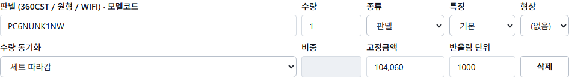
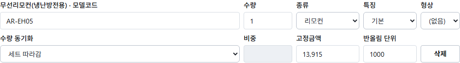

# PR #1241 CODEX SOL 머지 판정

- 판정 시각: 2026-08-17 13:22 KST
- 검증 대상: `feat/gas-parity-order-web` / `ddab2626f2734c918add606467eff1fbe6d5313b`
- 환경: 재생성 완료된 공유 스택, Playwright `headless: true`, 공유 DB 읽기 전용
- 결론: **머지 불가 — 실사용자 화면 도달 결함 2건**

## ① 271건 전수 대조 재현 결과

공유 `product_db`의 활성 `SINGLE_SET` 271건과 기본 구성품 855행을 읽기 전용 트랜잭션으로 조회한 뒤, 직전 구현(`c61cde5c4`의 천원 단위 배분)과 현재 HEAD 구현 및 V44 정본 값을 같은 입력에 적용해 직접 전수 계산했다.

| 항목 | 직접 재현값 |
|---|---:|
| 대상 세트 | 271건 |
| 전환 전 세트 총액 합 | 518,775,000원 |
| 전환 후 세트 총액 합 | 518,775,000원 |
| 합계 순증감 | **0원** |
| 전환 전 세트별 총액 불일치 | 0건 |
| 전환 후 세트별 총액 불일치 | 0건 |
| 구성품 금액이 달라지는 세트 | **65건** |

따라서 개발책임자가 확정한 “세트 총액은 한 건도 바뀌지 않는다” 게이트는 통과한다.

증거 무결성 정정: 기존 보고서의 “166세트 변경”은 재현되지 않았다. 그 수치는 직전 커밋이 이미 사용하던 천원 반올림이 아니라 1원 단위 반올림을 전환 전 기준으로 삼은 결과다. 실제 직전 구현과 현재 HEAD+V44를 대조한 재현값은 **65세트**다. 총액 순증감 0원 판정에는 영향이 없다.

## ② 세트-구성품 합 불일치

- 전환 전: **0건**
- 전환 후: **0건**
- 판정: 게이트 통과

각 세트에서 선택된 기본 구성품의 `배분단가 × 수량` 합을 부모 세트 청구액과 비교했다. 271건 모두 일치했다.

## ③ 싱글중대형 화면 캡처와 행 수

공유 스택의 데스크톱 품목 편집 화면에서 싱글중대형 세트를 열었다. 구성품 표는 **13행**으로, 빈 표나 stub이 아니었다.

- 판넬 `PC6NUNK1NW`: 화면값 **104,060원** — 확정값 **128,000원**과 불일치
- 리모컨 `AR-EH05`: 화면값 **13,915원** — 확정값 **16,000원**과 불일치
- 공유 DB Flyway 적용 버전: V43까지
- 실행 중 product-service JAR 내부: V44 마이그레이션 리소스 없음

전체 13행 증거: `screenshots/03-single-set-components-full.png`

**도달 결함 1:** 사용자가 싱글중대형 세트를 열면 멀티 계열 금액인 104,060원·13,915원이 그대로 보인다. 이 PR 핵심인 싱글 정본 128,000원·16,000원이 공유 스택 화면에 도달하지 않았다.

## ④ estimate-app vs desktop 금액 대조

직원용 estimate-app은 직원 인증 경로로, 데스크톱은 사내 인증 경로로 각각 접속했다. 지정 거래처(식별번호 마스킹), `AJ060MXHNBC1`, 수량 1의 동일 조건이며 저장은 하지 않았다.

| 화면 | 표 행 수 | 선택/입력 행 | 금액 |
|---|---:|---:|---:|
| 데스크톱 새 출고전표 | 5행 | 1행 | **1,355,640원** |
| 직원용 estimate-app | 카탈로그 107행 | 1행 | **1,523,236원** |

- 차이: estimate-app이 **167,596원 높음(+12.36%)**
- 데스크톱 증거: `screenshots/04-desktop-sales-same-condition-price.png`
- estimate-app 증거: `screenshots/05-estimate-app-same-condition-price.png`

**도달 결함 2:** P1-02가 보장해야 하는 동일 조건 동일 금액이 현재 공유 스택의 실제 두 화면에서 성립하지 않는다.

## ⑤ CI 판정

HEAD `ddab2626f`의 현재 체크는 **성공 44, 실패 4**다.

- `빌드 + 테스트 (user+product+inventory+logging)`: 실패. product-service의 `EstimateCatalogInternalControllerIT.components_singleSet_returns_relation_delivery_price_before_global_product_price` 1건 실패(806건 중 1건). 동일 실패를 JUnit 결과 체크도 반영한다.
- `Desktop Playwright (mock 회귀 hard gate)`: 실패. 668건 통과, 1건 실패. `products.sync` 허용 사용자의 `/admin/sheet-sync` 화면에서 `admin-sheetsync-trigger-btn`이 렌더되지 않는다. 관련 C5 spec은 `origin/main`과 같지만, 현재 브랜치가 `3c76f0eec`에서 `SheetSyncPage`를 안내 전용 폐기 화면으로 바꿨다. 따라서 main 병합으로 유입된 실패가 아니라 **현재 브랜치 diff가 만든 실패**다.
- `GitGuardian Security Checks`: 실패. 최종 트리의 자격 평문 가드 2종은 모두 성공하고 현재 최종 diff에는 비마스킹 자격 리터럴이 남아 있지 않다. 다만 PR 이력의 `19f62dddf`에서 실제 시트 식별자 형태의 리터럴이 보고서에 들어갔다가 `92275c39d`에서 마스킹됐다. 정책상 민감한 실 식별자가 커밋 이력에 존재하므로 **오탐으로 판정하지 않는다**. 식별자 원문은 이 보고서에 재기재하지 않았다.

CI가 green이 아니므로 CI 게이트도 불통과다.

## ⑥ 머지 가능/불가 판정

**머지 불가 — 도달 결함 2건.**

1. 싱글중대형 화면에서 판넬·리모컨이 싱글 정본값이 아닌 104,060원·13,915원으로 노출된다.
2. 동일 조건에서 데스크톱 1,355,640원과 estimate-app 1,523,236원이 달라 P1-02 금액 일치가 깨진다.

추가로 증거 무결성 수치 1건(166세트 → 직접 재현 65세트)을 정정했으며, CI 실패 4개가 남아 있다.

## ⑦ 프로세스 회수

- 이번 라운드에서 기동한 로컬 프로세스: 2개(Vite 1, estimate-app 1) → **2개 종료, 잔여 0개**
- 이번 라운드에서 기동한 컨테이너: **0개, 잔여 0개**
- 공유 `samhan-*` 실행 컨테이너: 시작 24개 → 종료 시 24개, **변경 없음**
- 로컬 QA 포트 `5198`, `5183`: LISTEN 잔여 **0개**
- 워크트리 내 신규 JAR·바이너리: **0개**
- 공유 DB 쓰기: **0건**

참고: 시작 시 존재하던 비공유 보조 컨테이너 `d02qa-postgres` 1개가 검증 중 외부에서 제거되어 전체 `docker ps` 수는 25→24로 보였으나, 이 라운드에서는 어떤 컨테이너에도 start/stop/remove/recreate 명령을 실행하지 않았다.
