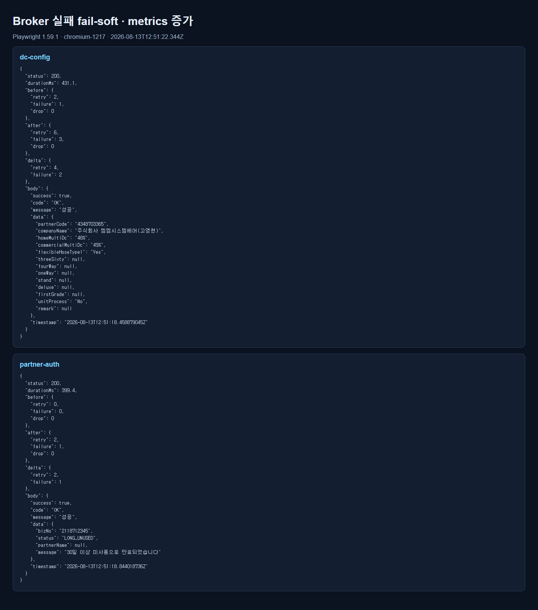
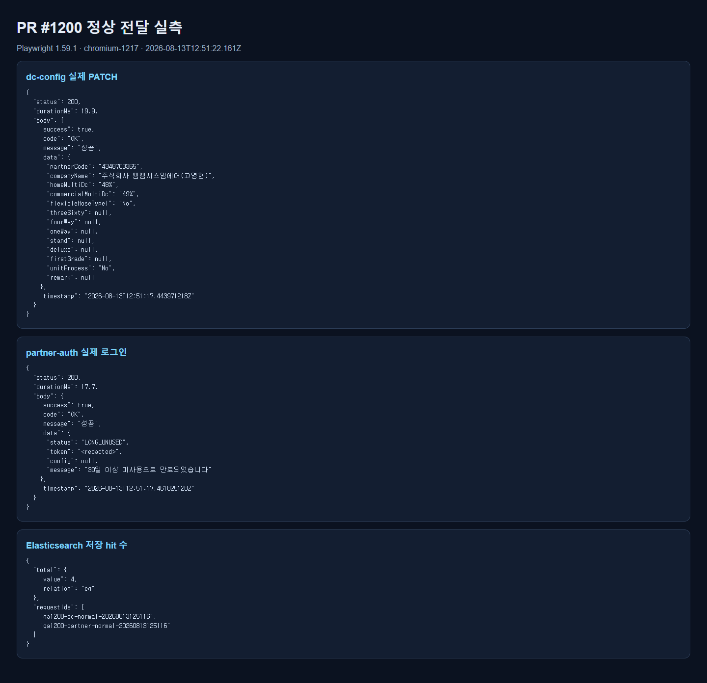
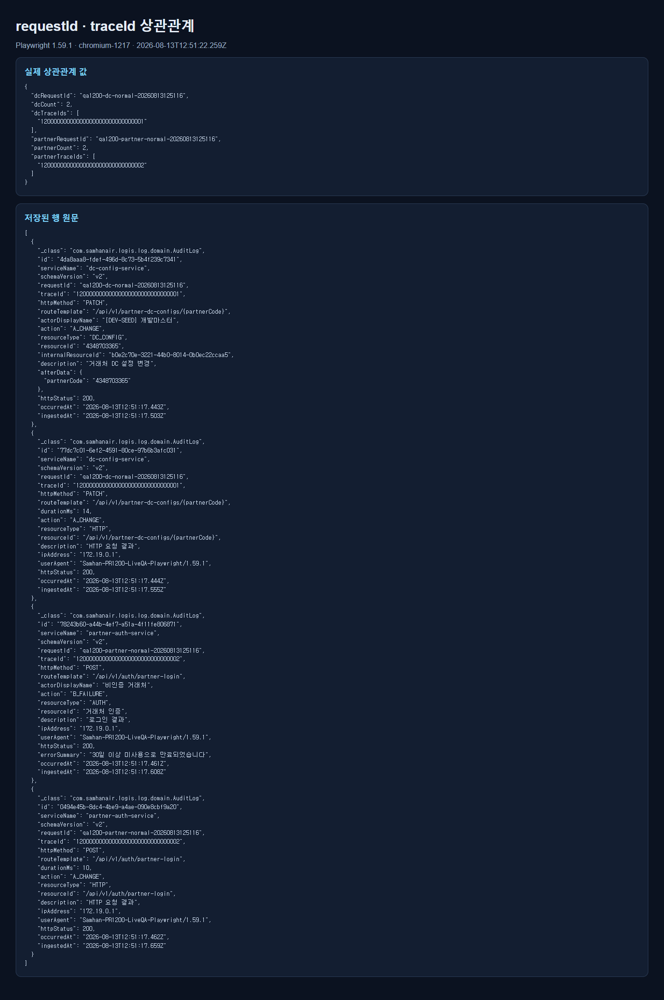
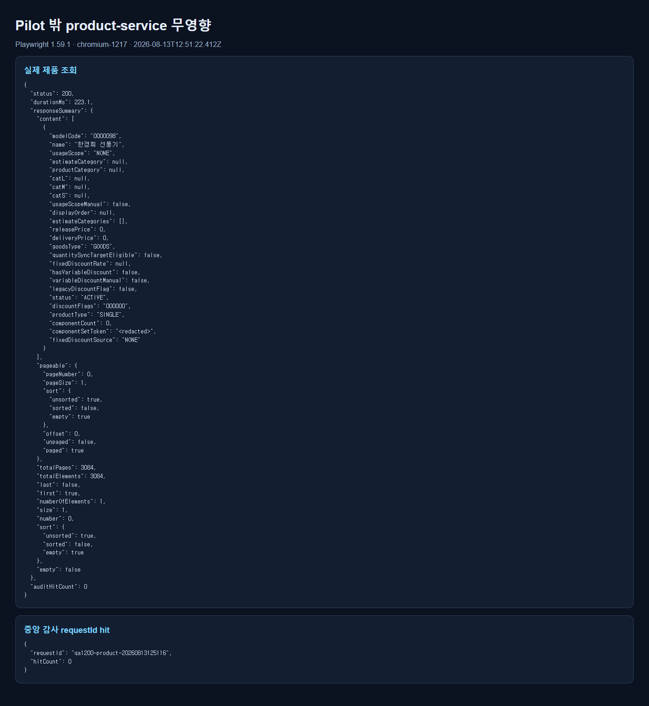

# PR #1200 적대적 라이브 QA 보고서

> 검증일: 2026-08-13 KST  
> 대상: PR #1200 `feat/1161-s2a-contract-close`, HEAD `7b1434c77792302a2fe0286df9544ca6873d1c69`  
> 최종 판정: **도달 가능한 결함 0건 · 머지 권고**

## 1. 환경 원문

### 1.1 이미 확인한 전제

재개 지시에 따라 최초 세션에서 확인한 아래 항목은 다시 수행하지 않았다.

- PR HEAD: `7b1434c77792302a2fe0286df9544ca6873d1c69`.
- PR 변경 파일 14개 중 Flyway/DB migration 0개.
- 공유 pilot 이미지는 `2026-08-11T17:59:58Z` 생성본으로 HEAD 빌드가 아님.
- HEAD 소스 JAR 3개를 격리 빌드함.

```text
dc-config-service.jar
sha256=62C283008E2B0B03BC89F61C0E38EAD46B806E98955FD83DEC0ABD3335DC6816

partner-auth-service.jar
sha256=B6498B9ACA2C0183B4486A2D415BEACCFE7AC3D0B1B107D5A82862AB40411F35

logging-service.jar
sha256=CA0CAD17708B703CBE87BD62C4913FC702F0A8244842F8186F74C8C8A659A813
```

- compose 정의 24개 중 실행 중 `samhan-*` 22개. 없는 2개는 PM이 제거한 `samhan-prometheus`, `samhan-nginx`뿐.
- 공유 스택을 내리거나 공유 pilot 이미지를 교체하지 않음.

### 1.2 RAM

```text
최초 세션 시작 전 FreeRAM_GB=18.134
재개 격리 기동 전 FreeRAM_GB=21.252
재개 정리 후 FreeRAM_GB=18.002
```

전 구간에서 1.0GB 중단 기준을 넘었다.

### 1.3 HEAD 격리 실행

공유 RabbitMQ/DB/ES는 유지하고 HEAD JAR만 별도 컨테이너로 실행했다.

```text
qa1200-logging        127.0.0.1:18082 → 8082
qa1200-dc-normal      127.0.0.1:18089 → 8089
qa1200-partner-normal 127.0.0.1:18091 → 8091
qa1200-dc-fail        127.0.0.1:18189 → 8089, management 19189 → 9089
qa1200-partner-fail   127.0.0.1:18191 → 8091, management 19191 → 9091
```

실패 인스턴스만 `SPRING_RABBITMQ_PORT=1`로 지정했다. 공유 `samhan-rabbitmq`를 중단하지 않고 실제 `Connection refused`를 발생시켰다.

```text
Attempting to connect to: [samhan-rabbitmq:1]
org.springframework.amqp.AmqpConnectException: java.net.ConnectException: Connection refused
```

### 1.4 Playwright 원문과 중단 경위 정정

최초 시도에서 다음 원문을 Playwright 부재로 잘못 해석해 중단했다.

```text
agent.browsers.getForUrl(...)
No browser is available

agent.browsers.list()
[]
```

이는 **인앱 Browser 런타임**만 비었다는 뜻이다. 로컬 Playwright Chromium과 별개다. 재개 시 다음을 직접 확인했다.

```text
npx --yes --package playwright@1.59.1 playwright --version
Version 1.59.1

CHROMIUM_1217_COUNT=1
C:\Users\user\AppData\Local\ms-playwright\chromium-1217\chrome-win64\chrome.exe
```

따라서 위 chromium을 Playwright `executablePath`로 지정해 전 시나리오를 완주했다. **`agent.browsers.list()=[]`은 standalone Playwright 관측 불가 근거가 아니다.**

첫 재개 명령은 잘못된 로컬 bin 경로를 사용해 실패했다.

```text
.\node_modules\.bin\playwright.cmd --version
The term '.\node_modules\.bin\playwright.cmd' is not recognized
```

기본 `npx playwright --version`은 `1.62.1`을 선택했으므로 그대로 쓰지 않고, cache에 있던 `playwright@1.59.1`을 명시해 사용자 전제와 맞췄다.

## 2. 시나리오 1 — broker 실패 시 fail-soft와 지연

### 절차

1. Playwright APIRequestContext로 클라이언트와 같은 실제 업무 endpoint를 호출했다.
2. dc-config: `PATCH /api/v1/partner-dc-configs/4348703365`, `flexibleHoseTypeI`를 `Yes → No → Yes`로 원상복구 가능하게 변경했다.
3. partner-auth: `GET /api/v1/auth/partner-status?bizNo=2118712345`를 호출했다.
4. 두 실패 인스턴스의 Rabbit 포트는 닫힌 `1`; management 포트는 별도라 metrics 조회가 업무 capture에 섞이지 않았다.
5. 업무 응답 시각과 worker retry 로그 시각을 대조했다.

### 스크린샷



### 결과

| 서비스 | broker 실패 중 실제 업무 응답 | Playwright 측정 | 업무 결과 |
|---|---:|---:|---|
| dc-config-service | HTTP 200 | 431.1ms | `flexibleHoseTypeI=Yes` DB 반영 확인 |
| partner-auth-service | HTTP 200 | 399.4ms | `status=LONG_UNUSED` 정상 업무 응답 |

dc-config 응답 본문 시각과 retry 로그:

```text
response timestamp=2026-08-13T12:51:18.458879045Z
12:51:18.465 WARN audit publisher retry ... attempt=1
12:51:18.466 WARN audit publisher retry ... attempt=2
12:51:18.466 ERROR audit publisher exhausted retries ... attempts=3
```

partner-auth 응답 본문 시각과 retry 로그:

```text
response timestamp=2026-08-13T12:51:18.844018736Z
12:51:18.879 WARN audit publisher retry ... attempt=1
12:51:18.880 WARN audit publisher retry ... attempt=2
12:51:18.880 ERROR audit publisher exhausted retries ... attempts=3
```

업무 응답이 먼저 완성됐고 retry는 `audit-publisher` worker에서 뒤따랐다. 3회 broker 시도를 기다려 업무 요청이 막힌 증거는 없다. 두 업무 트랜잭션 모두 성공했으므로 **fail-soft 통과**다.

## 3. 시나리오 2 — logging-service 실제 도착

### 절차

1. 정상 broker를 가리키는 HEAD pilot 두 개에서 실제 요청을 발화했다.
2. HEAD logging-service가 공유 RabbitMQ에서 소비하고 공유 ES `samhan-audit-logs`에 저장하게 했다.
3. 고정 requestId의 `.keyword` exact field로 저장 행을 직접 조회했다.

### 스크린샷





### 저장된 행 원문

전체 원문은 [stored-rows.json](stored-rows.json)에 보존했다. 핵심 4행은 다음과 같다.

```json
[
  {
    "id": "4da8aaa8-fdef-496d-8c73-5b4f239c7341",
    "serviceName": "dc-config-service",
    "schemaVersion": "v2",
    "requestId": "qa1200-dc-normal-20260813125116",
    "traceId": "12000000000000000000000000000001",
    "httpMethod": "PATCH",
    "routeTemplate": "/api/v1/partner-dc-configs/{partnerCode}",
    "action": "A_CHANGE",
    "resourceType": "DC_CONFIG",
    "resourceId": "4348703365",
    "description": "거래처 DC 설정 변경",
    "httpStatus": 200,
    "occurredAt": "2026-08-13T12:51:17.443Z",
    "ingestedAt": "2026-08-13T12:51:17.503Z"
  },
  {
    "id": "77dc7c01-6ef2-4591-80ce-97b6b3afc031",
    "serviceName": "dc-config-service",
    "requestId": "qa1200-dc-normal-20260813125116",
    "traceId": "12000000000000000000000000000001",
    "durationMs": 14,
    "resourceType": "HTTP",
    "description": "HTTP 요청 결과",
    "httpStatus": 200,
    "occurredAt": "2026-08-13T12:51:17.444Z",
    "ingestedAt": "2026-08-13T12:51:17.555Z"
  },
  {
    "id": "78243b60-a44b-4ef7-a51a-4f11fe806871",
    "serviceName": "partner-auth-service",
    "requestId": "qa1200-partner-normal-20260813125116",
    "traceId": "12000000000000000000000000000002",
    "httpMethod": "POST",
    "routeTemplate": "/api/v1/auth/partner-login",
    "action": "B_FAILURE",
    "resourceType": "AUTH",
    "description": "로그인 결과",
    "httpStatus": 200,
    "errorSummary": "30일 이상 미사용으로 만료되었습니다",
    "occurredAt": "2026-08-13T12:51:17.461Z",
    "ingestedAt": "2026-08-13T12:51:17.608Z"
  },
  {
    "id": "0494e45b-8dc4-4be9-a4ae-090e8cbf9a20",
    "serviceName": "partner-auth-service",
    "requestId": "qa1200-partner-normal-20260813125116",
    "traceId": "12000000000000000000000000000002",
    "durationMs": 10,
    "resourceType": "HTTP",
    "description": "HTTP 요청 결과",
    "httpStatus": 200,
    "occurredAt": "2026-08-13T12:51:17.462Z",
    "ingestedAt": "2026-08-13T12:51:17.659Z"
  }
]
```

### 결과

dc-config 명시 이벤트 + capture 2행, partner-auth 명시 이벤트 + capture 2행, 합계 4행이 저장됐다. **logging-service 도착 통과**다.

## 4. 시나리오 3 — requestId 상관관계

### 절차

Playwright 실제 요청에 `X-Request-Id`와 W3C `traceparent`를 넣었다. ES에서 requestId exact match로 조회한 뒤 같은 requestId의 명시 이벤트와 HTTP capture가 동일 traceId인지 확인했다.

### 스크린샷


### 실제 값

```text
dc-config
requestId=qa1200-dc-normal-20260813125116
traceId=12000000000000000000000000000001
저장 행=2

partner-auth
requestId=qa1200-partner-normal-20260813125116
traceId=12000000000000000000000000000002
저장 행=2
```

두 서비스 모두 한 실제 요청의 명시 이벤트와 capture 이벤트를 requestId로 연결할 수 있었다. **상관관계 통과**다.

## 5. 시나리오 4 — 실패/재시도 metrics 실제 증가

### 절차

업무 포트와 별도인 management 포트의 `/actuator/prometheus`에서 counter 전후값을 직접 읽었다. metric 이름만 노출되는지 보지 않고 닫힌 broker에 실제 이벤트를 보낸 뒤 증가량을 계산했다.

### 스크린샷


### metrics 증가 실측

```text
dc-config-service
before retry=2 failure=1 drop=0
after  retry=6 failure=3 drop=0
delta  retry=+4 failure=+2

partner-auth-service
before retry=0 failure=0 drop=0
after  retry=2 failure=1 drop=0
delta  retry=+2 failure=+1
```

dc-config 한 PATCH는 명시 mutation과 공통 HTTP capture 두 이벤트를 발행하므로 각각 `retry 2 + failure 1`, 합계 `retry +4 / failure +2`가 맞다. partner-auth status GET은 capture 한 이벤트라 `retry +2 / failure +1`이다. **counter 실제 증가 통과**다.

첫 실행의 metrics parser는 label이 붙은 원문을 고려하지 않아 실패했다.

```text
Error: metric missing: audit_publisher_retry_total
```

실제 Prometheus 원문은 다음처럼 label을 포함했다.

```text
audit_publisher_retry_total{application="dc-config-service"} 0.0
audit_publisher_failure_total{application="dc-config-service"} 0.0
```

parser를 label-aware로 고친 뒤 실제 증가를 확인했다. 제품 metric 미노출로 오판하지 않았다.

## 6. 시나리오 5 — pilot 밖 서비스 무영향

### 절차

공유 gateway를 통해 비pilot `product-service`의 실제 사용자 조회 `GET /api/v1/products?page=0&size=1`을 Playwright로 호출했다. 동일 requestId로 중앙 ES를 조회했다.

### 스크린샷



### 결과

```text
requestId=qa1200-product-20260813125116
HTTP 200
duration=223.1ms
실제 응답 content 1건, totalElements=3084
product-service 중앙 감사 hit=0
```

비pilot 업무 조회는 정상 성공했고 request capture가 확장되지 않았다. **pilot 밖 무영향 통과**다.

## 7. 도달 결함

**0건.** 시나리오 1~5에서 실제 사용자 경로로 재현 가능한 제품 결함을 찾지 못했다.

## 8. 증거 무결성 정정

1. 최초 보고서의 “Playwright unavailable” 판정은 잘못됐다. `agent.browsers.list()=[]`은 인앱 Browser 런타임 상태일 뿐 로컬 Playwright 부재를 의미하지 않는다. 본 보고서로 정정한다.
2. 구현 보고서의 fail-soft, requestId 축, logging-service correlation 저장, retry/failure metrics를 이번에 HEAD JAR와 실제 broker/ES/DB로 재현했다.
3. 첫 정상 ES 조회가 0건이었던 이유는 저장 실패가 아니라 기존 mapping이 `requestId: text + keyword`인데 `terms requestId`를 사용한 하네스 오류였다. `terms requestId.keyword`로 바꾸자 당시 행 4건도 재현됐다.
4. 최종 실측 원문은 [run-results.json](run-results.json), [stored-rows.json](stored-rows.json), screenshots 4장에 남겼다.
5. 구현 보고서가 “못 한 것”에 적은 broker/ES 장애 주입은 구현 당시 보고의 한계였다. 이번 라이브 QA가 그 뒤 broker 실패 주입과 실제 ES 저장을 추가 증명했다.

## 9. 관측 불가와 실패 명령 원문

최종 관측 불가 항목은 없다. 재개 과정의 실패 명령은 재현 경계를 위해 남긴다.

```text
# 인앱 Browser — standalone Playwright 부재 근거가 아님
getForUrl(...) => No browser is available
agent.browsers.list() => []

# 잘못된 bin 위치
.\node_modules\.bin\playwright.cmd --version
The term '.\node_modules\.bin\playwright.cmd' is not recognized

# 첫 Playwright 하네스 parser
Error: metric missing: audit_publisher_retry_total

# 첫 ES 하네스 조회
terms requestId => 0건
terms requestId.keyword => 4건
```

## 10. 만든 데이터와 정리

### 업무 데이터

- dc-config 대상: `partnerCode=4348703365`.
- 최종 상태: `note=NULL`, `show_i_hose=true`로 원상복구 확인.
- 정상/실패/복구 PATCH 때문에 `dc_config_audit_logs` 3행이 생성됐다. 도메인 감사 정본이므로 삭제하지 않았다.
- partner-auth 실제 로그인 2회 때문에 `partner_login_attempt` 2행이 생성됐다. 실패 주입 최종 라운드는 read-only status GET으로 추가 로그인 행을 만들지 않았다.

### 중앙 ES 데이터

- 첫 하네스 실행과 최종 실행, 복구 요청으로 `requestId=qa1200-*` 중앙 감사 문서 12건이 생성됐다.
- 최종 증거 대상 4행은 `stored-rows.json`에 보존했다.
- 증거 보존을 위해 ES 문서는 삭제하지 않았다.

### 프로세스

```text
qa1200-logging
qa1200-dc-normal
qa1200-partner-normal
qa1200-dc-fail
qa1200-partner-fail
```

5개 모두 정확한 container ID를 확인한 뒤 `docker rm -f`했다.

```text
QA1200_REMAINING=0
SAMHAN_RUNNING_COUNT=22
FREE_RAM_GB=18.002
```

임시 실행 스크립트는 `scripts/qa1200-liveqa.cjs`에만 두었다가 실행 후 삭제했다. `docs/qa` 안 캡처 스크립트는 0개다.

## 11. 머지 권고

**머지 권고.** 동일 HEAD에서 Playwright standalone Chromium-1217로 실제 사용자 경로, broker 실패, 실제 counter 증가, Rabbit→logging-service→ES 저장, requestId 상관관계, 비pilot 무영향을 모두 확인했다. 도달 가능한 결함은 0건이다.
