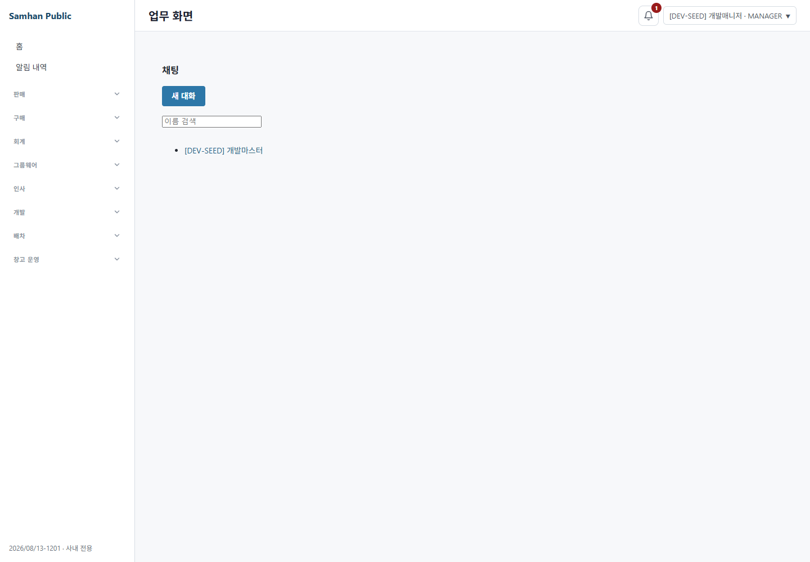
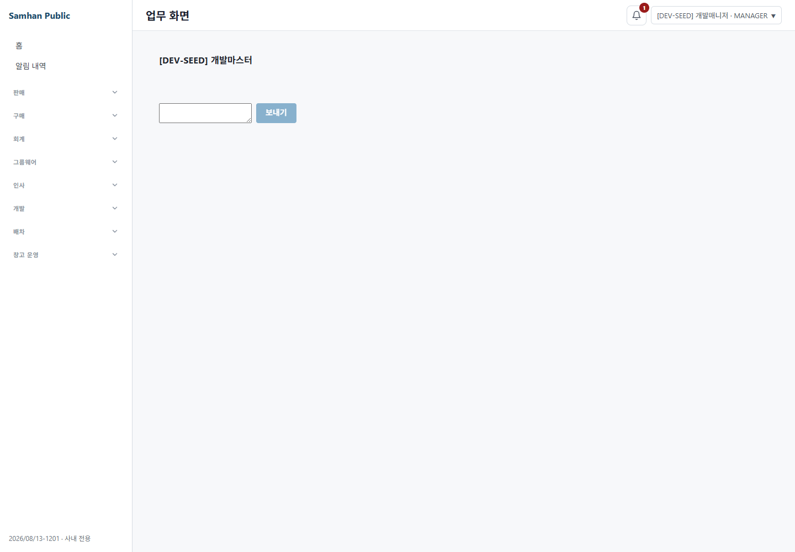
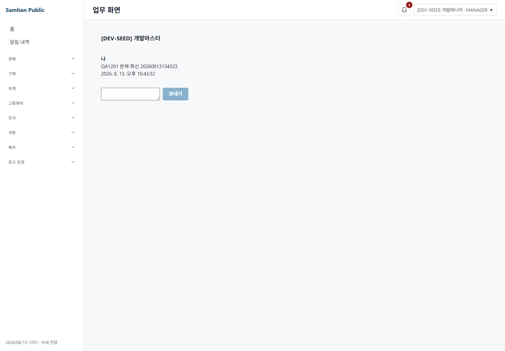

# PR #1201 라이브 QA 보고서

- 대상: PR #1201 `feat/894-s1-chat-port`, 요청 HEAD `36b6bc162`
- 일시: 2026-08-13 (Asia/Seoul)
- 판정: **도달 결함 0건, 핵심 시나리오 2~4 관측 불가, 머지 권고 보류**
- 실행 수단: `clients/desktop` 패키지 안의 Playwright `1.59.1`에서 로컬 Chromium 1217 직접 launch
- 인앱 Browser: 사용하지 않음

## 1. 환경 원문

PM 정정 후 실측을 정본으로 남긴다.

```text
samhan-* 실행 컨테이너: 22개
전체 실행 컨테이너: 타 트랙 컨테이너의 시작·종료에 따라 최초 29개 → 재개 시 24개
prometheus·nginx: samhan-* 스택에 없음

samhan-slip-service
  container=2026-08-12T17:53:07.461758521Z
  image created=2026-08-12T17:52:59.907441518Z

samhan-api-gateway
  container=2026-08-12T15:39:17.991855852Z
  image created=2026-08-12T15:39:14.976509948Z

samhan-auth-service
  container=2026-08-12T00:03:23.288496844Z
  image created=2026-08-12T00:03:20.533978097Z

samhan-groupware-service
  container=2026-08-11T17:59:58.936253267Z
  image created=2026-07-31T15:47:40.582649175Z

최초 여유 RAM: 18.316 GB
재개 직후 여유 RAM: 18.173 GB
최종 증거 실행 직전 여유 RAM: 16.887 GB
```

이미지 label에는 Compose project/service/version만 있고 Git revision은 없어서 어느 커밋 빌드인지는 확정할 수 없었다. 채팅 API 소유 `groupware-service`가 07-31 이미지라는 사실이 아래 관측 불가의 직접 원인이다.

브라우저 실측:

```text
Playwright package: 1.59.1
Chromium executable:
C:\Users\user\AppData\Local\ms-playwright\chromium-1217\chrome-win64\chrome.exe
```

독립 앱 렌더러는 `http://localhost:5174`, 본체 렌더러는 `http://localhost:5182`에서 이 워크트리 코드를 띄웠다. 두 화면 모두 지시대로 `/#/chat`으로 진입했다. 캡처 전에 각 화면 전용 `data-testid` 또는 전용 요소를 단정했다.

## 2. 시나리오 1 — 독립 앱 채팅방 목록

절차:

1. `dev_master`로 실 API 로그인 200을 확인했다.
2. `http://localhost:5174/#/chat`으로 이동했다.
3. 독립 앱 전용 `[data-testid="chat-rooms-page"]`가 visible임을 단정한 뒤 캡처했다.
4. `GET /admin/groupware/chat/rooms` 응답을 관측했다.

증거:

- [01-independent-room-list.png](01-independent-room-list.png)
- Playwright 네트워크: `GET /admin/groupware/chat/rooms` → `500`

결과: **화면 셸 도달, 실제 방 목록 데이터 관측 불가.** 채팅방 목록 화면과 새 대화 입력은 보였으나 backend route 부재로 목록 데이터는 비어 있었다.

## 3. 시나리오 2 — 새 대화 생성

절차:

1. 독립 앱에서 `새 대화`를 눌렀다.
2. `개발매니저`를 검색했다.
3. 실 API `GET /admin/groupware/messages/recipient-search?...` → `200`과 `[DEV-SEED] 개발매니저 · 대표실` 표시를 확인했다.
4. 검색 결과와 선택 후 `대화 시작` 버튼을 각각 단정·캡처했다.
5. `대화 시작`을 눌러 실 POST를 시도했다.
6. 화면의 `대화방을 만들지 못했습니다` alert를 단정·캡처했다.

증거:

- [02-independent-recipient-search.png](02-independent-recipient-search.png)
- [03-independent-recipient-selected.png](03-independent-recipient-selected.png)
- [04-independent-create-backend-blocked.png](04-independent-create-backend-blocked.png)
- Playwright 네트워크: `POST /admin/groupware/chat/rooms/direct` → `500`
- 응답 원문:

```json
{"success":false,"code":"INTERNAL_ERROR","message":"서버 내부 오류가 발생했습니다.","data":null,"timestamp":"2026-08-13T13:02:48.762027887Z"}
```

결과: **검색·선택은 도달, 대화 생성은 관측 불가.** 생성 실패 원인은 현재 groupware 이미지에 route가 없는 것이다. PR은 백엔드를 변경하지 않았으므로 이 환경 차단을 PR 도달 결함으로 세지 않았다.

## 4. 시나리오 3 — 메시지 전송 및 상대 화면 SSE 재조회

선행 직접방 생성이 500으로 실패해 roomCode가 없었다. 따라서 메시지 전송 endpoint와 두 번째 계정 화면의 SSE-triggered REST 재조회는 실행할 수 없었다.

결과: **관측 불가.** 미리 추론한 것이 아니라 시나리오 2의 실 POST 실패 뒤 중단했다. 메시지 데이터는 만들지 않았다.

## 5. 시나리오 4 — 본체 앱 채팅 회귀

절차:

1. 별도 browser context에서 `dev_manager` 실 API 로그인 200을 확인했다.
2. 본체 렌더러 `http://localhost:5182/#/chat`으로 이동했다.
3. 본체 `[data-testid="chat-rooms-page"]`가 visible임을 단정한 뒤 캡처했다.
4. 본체가 호출한 동일 방 목록 API 응답을 관측했다.

증거:

- [05-main-app-room-list-backend-blocked.png](05-main-app-room-list-backend-blocked.png)
- Playwright 네트워크: `GET /admin/groupware/chat/rooms` → `500`

결과: **본체 채팅 화면 셸은 남아 있고 접근 가능하지만, 정상 방 목록·대화·전송은 관측 불가.** 독립 앱과 동일하게 old groupware route 부재에 막혔다. “본체 채팅 정상 동작”을 통과로 판정하지 않았다.

## 6. 시나리오 5 — 화면·URL UUID 비노출

각 캡처 시점에 DOM visible text, 현재 URL, 모든 링크 `href`를 UUID 정규식으로 sweep했다.

```text
독립 앱 방 목록                  0건  http://localhost:5174/#/chat
독립 앱 상대 검색·생성 실패 화면 0건  http://localhost:5174/#/chat
본체 앱 방 목록                  0건  http://localhost:5182/#/chat
```

결과: **관측한 화면·URL·링크에서는 UUID 노출 0건.** 표시된 값은 `[DEV-SEED] 개발매니저`, `대표실` 같은 업무 표시명이었다. room 생성 실패로 roomCode가 포함된 대화 URL은 관측하지 못했으므로 그 표면까지 일반화하지 않는다.

범위 밖으로 지정된 `participantId` UUID 요청 payload는 결함으로 세지 않았으며 화면·URL sweep 대상에도 포함하지 않았다.

## 7. UUID 노출 sweep 결과

- sweep한 화면 상태: 독립 목록, 독립 상대 검색, 독립 상대 선택, 독립 생성 실패, 본체 목록.
- visible text UUID: 0건
- browser URL UUID: 0건
- 링크 href UUID: 0건
- 관측하지 못한 표면: 생성된 방의 독립 앱 URL, 본체 대화 URL, 메시지 화면.

## 8. 도달 결함

**0건.**

현재 backend route 부재는 PR #1201이 변경한 클라이언트 코드에서 발생한 결함이 아니며, 요청자가 명시한 07-31 groupware 이미지의 환경 한계다. 테스트 약함, 문서 표현, mock·가드 품질은 조사·결함 집계 대상에서 제외했다.

## 9. 증거 무결성 정정

1. 최초 보고서의 “환경 전제 불일치로 미실행”은 PM이 전제를 정정한 뒤 폐기했다. 이 보고서는 재개 실행 결과로 전면 대체했다.
2. 스크린샷 5장은 모두 이 워크트리 렌더러와 실 gateway를 로컬 Playwright Chromium으로 직접 연 결과다.
3. 모든 캡처 전에 목표 화면 전용 요소를 visible 단정했다.
4. 빈 방 목록을 정상 목록이라고 주장하지 않았다. 화면 셸 도달과 API 데이터 관측을 분리했다.
5. 새 대화 검색 200을 방 생성 성공으로 확대하지 않았다.
6. 본체 화면 셸 도달을 본체 채팅 정상 동작으로 확대하지 않았다.
7. UUID 0건은 실제 sweep한 표면에만 한정했고 생성 방 URL은 관측 불가라고 명시했다.
8. `docs/qa/2026-08-13-1201-liveqa/` 안에는 캡처 스크립트를 남기지 않는다.
9. 인앱 Browser 가용 여부를 관측 불가 근거로 사용하지 않았다.

## 10. 관측 불가 및 실패 명령 원문

핵심 backend 실패 재현:

```text
GET /admin/groupware/chat/rooms
500 {"success":false,"code":"INTERNAL_ERROR","message":"서버 내부 오류가 발생했습니다.","data":null,...}

POST /admin/groupware/chat/rooms/direct
500 {"success":false,"code":"INTERNAL_ERROR","message":"서버 내부 오류가 발생했습니다.","data":null,...}
```

groupware-service 로그 원문:

```text
org.springframework.web.servlet.resource.NoResourceFoundException:
No static resource admin/groupware/chat/rooms.

org.springframework.web.servlet.resource.NoResourceFoundException:
No static resource admin/groupware/chat/rooms/direct.
```

최종 Playwright 실행의 판정 원문:

```text
[HTTP] 독립-master GET 500 /admin/groupware/chat/rooms
[HTTP] 독립-master GET 200 /admin/groupware/messages/recipient-search?...limit=10000
[HTTP] 독립-master POST 500 /admin/groupware/chat/rooms/direct
[HTTP] 본체-manager GET 500 /admin/groupware/chat/rooms
[FAIL] 채팅 소유 백엔드에 S1 route 부재: POST direct status=500; 본체 GET rooms status=500
```

첫 Playwright 실행은 실제 검색 결과의 사번이 `null`인데 예상 selector에 `MANAGER-001`을 넣어 실패했다. 원문:

```text
locator.waitFor: Timeout 15000ms exceeded.
- waiting for getByRole('button', { name: /개발매니저.*MANAGER-001/ }) to be visible
```

응답 원문은 `employeeCode:null`이었다. selector를 화면에 실제 표시된 `개발매니저`로 정정하고 재실행했다. 이는 제품 결함으로 세지 않았다.

중간 보완 실행 한 번은 Playwright 응답 body 대기 중 shell 120초 제한을 넘겼다.

```text
command timed out after 124024 milliseconds
```

해당 실행이 남긴 QA browser process tree는 PID와 시작시각을 확인한 뒤 이 검증자가 시작한 트리만 종료했다. 이후 응답 body를 별도 실 API 명령으로 재현했다. 최종 Playwright 실행은 backend 차단을 명시하는 exit 1로 끝났고 browser/context는 `finally`에서 종료했다.

## 11. 만든 데이터

- 채팅방: 0개 (`POST direct` 500)
- 메시지: 0개
- 사용자/업무 데이터 변경: 0건
- 인증: `dev_master`, `dev_manager`의 httpOnly 세션 쿠키를 각 격리 browser context에서 발급받았고 context 종료로 폐기했다.

## 12. 프로세스 정리

- 최종 Playwright browser/context: 종료
- timeout 실행이 남긴 Node/Chromium tree: 이 검증자가 시작한 PID tree만 강제 종료
- QA용 독립 앱·본체 Vite 서버와 rendererOnly가 띄운 Electron: 종료 대상 확인 후 종료
- 기존 Docker 컨테이너: 시작·중지·삭제하지 않음
- 다른 트랙의 Playwright/Chromium/Node: 종료하지 않음

## 13. 머지 권고

**현 증거만으로는 머지를 권고하지 않는다.** 도달 결함을 발견해서가 아니라 필수 시나리오인 방 생성, 메시지 양방향 도착/SSE 재조회, 본체 채팅 정상 동작을 old groupware route 부재로 판정하지 못했기 때문이다.

채팅 route를 포함한 groupware-service 이미지로 교체한 뒤 시나리오 1~5를 다시 수행해야 한다. 그 재검증에서 방 생성·양방향 메시지·본체 회귀·대화 URL UUID sweep까지 통과하면 머지 판단이 가능하다.

## 14. 2026-08-13 신선 이미지 재개 라운드

### 14.1 재개 환경 직접 실측 원문

PM의 환경 값은 인용하지 않고 `docker inspect`와 `docker image inspect`로 다시 측정했다.

```text
FreeRAM_GB    : 19.265
RunningTotal  : 23
RunningSamhan : 22

name=/samhan-groupware-service
container_created=2026-08-13T13:10:23.841805531Z
status=running
health=healthy
image=infrastructure-groupware-service
image_id=sha256:f35f882ebbb61d91d2a9245defaebf6d64f80db476c9e9847080c5990a6c2d74

repo=infrastructure-groupware-service:latest
image_created=2026-08-13T13:10:21.52028317Z
image_id=sha256:f35f882ebbb61d91d2a9245defaebf6d64f80db476c9e9847080c5990a6c2d74
labels={"com.docker.compose.project":"infrastructure","com.docker.compose.service":"groupware-service","com.docker.compose.version":"5.3.1"}

GET /admin/groupware/chat/rooms (미인증)
401 {"success":false,"code":"UNAUTHORIZED","message":"인증 토큰이 없습니다"}
```

이미지와 컨테이너는 실제로 새로 생성됐고 같은 image ID를 사용했다. 그러나 미인증 401은 보안 필터가 handler mapping보다 먼저 실행되므로 route 존재 증거로 사용하지 않았다.

### 14.2 시나리오 2 재개 결과

기존 라운드에서 확인한 독립 앱 목록·상대 검색·선택은 다시 캡처하지 않았다. 동일 UI 흐름으로 `대화 시작`만 재시도했다.

```text
PRE_RAM_GB=22.621
[PASS] dev_master 실 API 로그인 200
[PASS] 독립 앱 목록 진입(재캡처 없음)
[HTTP] 독립-master GET 500 /admin/groupware/chat/rooms
[HTTP] 독립-master GET 200 /admin/groupware/messages/recipient-search?...limit=10000
[PASS] 상대 검색 결과 재사용
[HTTP] 독립-master POST 500 /admin/groupware/chat/rooms/direct
[FAIL] POST direct status=500
```

결과: **새 대화 생성 관측 불가 유지.** 직접방은 생성되지 않았다. 시나리오 3·4는 roomCode가 없어 다시 진입하지 않았다.

### 14.3 새 이미지인데 route가 여전히 없는 원인

인증 요청 시 groupware-service 로그 원문:

```text
org.springframework.web.servlet.resource.NoResourceFoundException:
No static resource admin/groupware/chat/rooms.

org.springframework.web.servlet.resource.NoResourceFoundException:
No static resource admin/groupware/chat/rooms/direct.
```

서비스 시작 로그는 실행 JAR가 가진 migration이 V14까지임을 드러냈다.

```text
Successfully validated 18 migrations
Current version of schema "public": 18
Schema "public" has a version (18) that is newer than the latest available migration (14) !
```

반면 현재 main 소스에는 다음 파일이 실재했다.

```text
ChatRoomController.java
V20__add_room_based_internal_chat.sql
V21__harden_room_chat_sequences.sql
```

Docker image history는 새 Gradle 빌드를 수행하지 않고 host 산출물을 복사했음을 보였다.

```text
COPY --chown=app:app services/groupware-service/build/libs/groupware-service.jar /app/app.jar
```

실제로 PM이 빌드에 사용한 main 작업본의 host JAR는 07-23 산출물이었고 채팅 controller·migration이 없었다.

```text
C:\dev\Samhan-Public\services\groupware-service\build\libs\groupware-service.jar
bytes=99355517
last_write=2026-07-23T19:12:22.6897367+09:00

CHAT_CONTROLLER_COUNT=0
V20_COUNT=0
V21_COUNT=0

JAR에 포함된 마지막 groupware migration:
V14__add_messages_batch_id.sql
```

따라서 이번 상태는 **신선한 Docker image 안에 낡은 host JAR를 다시 포장한 상태**다. `docker compose ... up -d --build`만으로는 애플리케이션 JAR를 다시 컴파일하지 않는다. 이 환경 문제를 PR #1201의 도달 결함으로 세지 않았다.

### 14.4 증거 무결성 및 데이터

- 미인증 401을 route 존재 증거로 확대하지 않았다.
- 이미지 생성시각과 이미지 안 애플리케이션 산출물의 신선도를 분리했다.
- 새 스크린샷은 없다. 시나리오 2가 기존과 같은 API 경계에서 차단되어 성공 화면에 도달하지 못했다.
- 추가 생성 채팅방: 0개
- 추가 생성 메시지: 0개
- 추가 도달 결함: 0건
- 시나리오 2~4 관측 불가 및 머지 권고 보류 판정은 유지한다.
- 다음 재개 조건: main 작업본에서 `groupware-service.jar`를 먼저 재빌드하고, 새 JAR에 `ChatRoomController`, V20, V21이 포함됐음을 확인한 뒤 Docker image를 다시 생성해야 한다.

## 15. 2026-08-13 JAR 재빌드 후 최종 재개 라운드

### 15.1 환경 및 배포 산출물 직접 실측 원문

PM의 설명을 증거로 사용하지 않고 host JAR, 컨테이너 및 image를 다시 직접 측정했다. 이 시점의 여유 RAM은 중단 기준 1.0GB를 충분히 웃돌았고 Samhan 컨테이너는 22개였다.

```text
FreeRAM_GB 24.086
RunningTotal 22
RunningSamhan 22

C:\dev\Samhan-Public\services\groupware-service\build\libs\groupware-service.jar
bytes=99428705
last_write=2026-08-13T22:23:07.3818513+09:00
CHAT_CONTROLLER_COUNT=1
V20_COUNT=1
V21_COUNT=1

container_created=2026-08-13T13:23:36.625625462Z
status=running
health=healthy
image_id=sha256:8b0d4434fde2367a32da4060516a6959efbd8588d03c2651feb07b3ccb197759

image_created=2026-08-13T13:23:34.268575913Z
image_id=sha256:8b0d4434fde2367a32da4060516a6959efbd8588d03c2651feb07b3ccb197759
```

`ChatRoomController`가 1개이고 V20·V21 migration도 각각 1개이므로 이번에는 채팅 구현을 포함한 JAR임을 확인했다. 컨테이너는 같은 image ID로 `running`/`healthy`였다. 서비스 시작 로그에서도 schema 현재 버전 18과 정상 시작을 확인했으며, 직전 라운드의 `latest available migration (14)` 경고는 재현되지 않았다.

### 15.2 시나리오 2 — 새 대화 생성

절차:

1. 로컬 Playwright 1.59.1에서 지정 Chromium 실행 파일을 직접 launch했다.
2. `http://localhost:5173/#/chat`에 진입하여 기존에 확인한 목록·상대 검색·선택 뒤 `대화 시작`을 눌렀다.
3. 응답 status와 생성된 업무 식별자 `roomCode`를 기록하고, 생성 직후 독립 앱 전용 요소를 다시 단정했다.

네트워크 원문:

```text
dev_master login 200
GET /admin/groupware/messages/recipient-search?...limit=10000 200
GET /admin/groupware/chat/rooms 200
POST /admin/groupware/chat/rooms/direct 201
roomCode CHAT-20260813-000017
GET /admin/groupware/chat/rooms 200
roomsPageCount=0 roomPageCount=0
```

결과: 백엔드에서는 새 직접방 생성이 성공했다. 그러나 성공 직후 독립 앱의 `chat-rooms-page`와 `chat-room-page`가 모두 사라지고 `#root`가 빈 상태가 됐다. 따라서 사용자는 생성한 대화로 들어갈 수 없다.


도달 결함의 경계는 독립 앱 라우팅이다. production renderer는 `MemoryRouter basename="/chat" initialEntries={["/chat"]}`를 사용하지만, 생성 성공 처리와 방 링크는 `/chat/{roomCode}` 절대 경로로 이동한다. 실 API가 201과 `roomCode`를 반환한 뒤 빈 root가 된 관측과 일치한다. 이 보고서는 원인 후보를 기록할 뿐 코드는 수정하지 않았다.

### 15.3 시나리오 3 — 메시지 전송 및 상대 화면 SSE 재조회

결과: **관측 불가.** 시나리오 2의 도달 결함 때문에 독립 앱 방 화면과 composer에 도달하지 못했다. 따라서 독립 앱에서 메시지를 보내고 상대 화면에서 SSE 후 재조회되는 종단 흐름을 수행할 수 없었다. 백엔드 오류나 범위 밖 기능으로 판정하지 않고, 위 라우팅 결함의 직접 영향으로 기록한다.

실패 실행 원문:

```text
node playwright/qa1201-r3-liveqa.mjs
[HTTP] POST /admin/groupware/chat/rooms/direct 201
[ASSERT] roomsPageCount=0 roomPageCount=0
[FAIL] reachable defect: independent app route loss after direct-room creation
Process exited with code 1
```

### 15.4 시나리오 4 — 본체 앱 채팅 회귀

절차:

1. `http://localhost:5182/#/chat`에서 관리자 계정으로 본체 채팅 목록에 진입하고 본체 전용 목록 요소를 단정했다.
2. 방 `CHAT-20260813-000017`을 열어 방 화면과 composer를 단정했다.
3. SSE stream 연결을 관찰한 뒤 메시지를 전송하고 messages 재조회를 관찰했다.
4. 전송한 문구가 방 화면에 렌더링됐는지 단정했다.

네트워크 및 결과 원문:

```text
dev_manager login 200
GET /admin/groupware/chat/rooms 200
GET /admin/groupware/chat/rooms/CHAT-20260813-000017/messages 200
GET /admin/groupware/chat/rooms/CHAT-20260813-000017/stream 200
POST /admin/groupware/chat/rooms/CHAT-20260813-000017/messages 200
GET /admin/groupware/chat/rooms/CHAT-20260813-000017/messages 200
GET /admin/groupware/chat/rooms/CHAT-20260813-000017/messages 200
rendered body=QA1201 본체 회신 20260813134323
```

결과: **통과.** 본체 앱의 목록, 방 열기, SSE 연결, 메시지 전송 및 재조회가 모두 정상 동작했다. 이식 후에도 본체 채팅은 남아 있었다.







### 15.5 시나리오 5 및 UUID 노출 sweep 정정

앞선 라운드의 UUID 정규식은 UUID version nibble을 제한했다. 증거 무결성을 위해 이번에는 version을 가정하지 않는 `8-4-4-4-12` 정규식으로 URL, 화면 전체 텍스트, 모든 `href`를 다시 sweep했다.

```text
independent route-loss URL/text/hrefs: UUID 0건
main room list URL/text/hrefs: UUID 0건
main room URL/text/hrefs: UUID 0건
main sent-message URL/text/hrefs: UUID 0건
observed room URL=/#/chat/CHAT-20260813-000017
```

결과: 관측 가능한 화면·URL·링크에서 UUID 노출은 **0건**이었다. URL에는 UUID 대신 업무 식별자인 `roomCode`만 나타났다. 요청 payload의 `participantId` UUID는 지시대로 선재 위반·범위 밖이므로 결함 수에 포함하지 않았다.

### 15.6 도달 결함

최종 도달 결함은 **1건**이다.

1. 독립 앱에서 직접방 생성 API가 201로 성공한 직후 앱 전체가 빈 화면이 되어 생성한 대화에 진입할 수 없다. 이로 인해 독립 앱 메시지 전송 및 상대 화면 SSE 재조회도 도달 불가하다.

본체 앱 채팅은 정상 동작했고, UUID 노출은 관측 범위에서 없었다. 편집 API 부재와 S3~S7은 결함으로 세지 않았다.

### 15.7 증거 무결성 정정

- 최초 JAR 점검과 낡은 배포본 규명 기록은 삭제하거나 덮어쓰지 않았다. 환경이 바뀐 각 라운드를 시간순으로 보존했다.
- direct room 생성 controller의 정상 계약은 `201 Created`다. 초기 자동화가 200만 성공으로 가정한 것은 하네스 오류였으며 제품 결함으로 세지 않았다.
- 화면 캡처 전에 화면 고유 요소를 단정했다. 독립 앱 결함 화면은 정상 화면 요소 2종이 모두 0개이고 root가 빈 상태임을 단정한 뒤 캡처했다.
- 기존 version 제한 UUID 정규식의 약점을 바로잡아 generic UUID 형식으로 재검사했다.
- `docs/qa` 안에는 캡처 스크립트를 남기지 않는다.

### 15.8 만든 데이터

- 직접 채팅방 1개: `CHAT-20260813-000017` (`dev_master` ↔ `dev_manager`)
- direct room POST를 진단 중 반복했으나 동일 참여자 조합의 같은 방을 재사용했으므로 추가 roomCode는 생성되지 않았다.
- 메시지 1개: `QA1201 본체 회신 20260813134323` (본체 앱에서 전송)
- 독립 앱에서 생성한 메시지: 0개

### 15.9 최종 머지 권고

**머지를 권고하지 않는다.** 신선한 백엔드에서 본체 회귀와 UUID 비노출은 통과했지만, 독립 앱의 핵심 S1 흐름인 방 생성 후 대화 진입이 실제 UI에서 깨지고 그 결과 메시지 전송·상대 SSE 재조회까지 수행할 수 없는 도달 결함 1건이 있다.

## 화면 정본 검증

### 환경 원문

```text
branch=feat/894-s1-chat-port
HEAD=6343b2611a82a7112973f7a047330653df816aa6
origin/main...HEAD migration 추가=0
최초 FreePhysicalMemoryGiB=15.963
최초 /samhan-groupware-service|2026-08-13T13:23:36.625625462Z
최초 /samhan-user-service|2026-08-11T17:59:58.945181532Z
```

두 서비스 모두 HEAD 변경을 포함하므로 Gradle 산출물을 먼저 만들었다.

```text
:services:user-service:bootJar       BUILD SUCCESSFUL
:services:groupware-service:bootJar  BUILD SUCCESSFUL
```

메모리 문서의 `scripts/redeploy-service.ps1`과 이 worktree의 기존 JAR는 없었다. 첫 Compose 명령도 아래처럼 실패했다.

```text
Get-Content: Cannot find path '...scripts\redeploy-service.ps1'
Get-Item: Cannot find path '...services\{user,groupware}-service\build\libs\*.jar'
service "api-gateway" refers to undefined network samhan-net: invalid compose project
service "user-service" refers to undefined network samhan-net: invalid compose project
```

`docker-compose.yml + docker-compose.local-all.yml` 정본 조합으로 재실행했다.

```text
/samhan-user-service|2026-08-13T20:45:01.539147101Z|healthy|sha256:d38f9a5c...
/samhan-groupware-service|2026-08-13T20:45:01.539049809Z|healthy|sha256:b033eeee...
최종 여유 RAM=13.127 GiB
```

따라서 이번 라운드는 **두 서비스 모두 브랜치 빌드를 올린 상태**다. PM이 복구해야 한다. 브라우저는 `clients/desktop` 패키지의 Playwright 1.59.1과 로컬 Chromium 1217을 직접 launch했다. 독립 앱 `http://localhost:5173/`, 본체 `http://localhost:5182/`, gateway `http://localhost:8080`을 사용했다.

### 1. 개별 페이지

절차: `dev_master` 실 로그인 → 독립 앱 진입 → 내 정보/직원 목록 → 임시 employeeCode를 DEV-SEED 4명에게 부여해 정렬·클릭 추가 검증 → `dev_manager` 클릭/메시지 전송/재진입 → 임시 퇴사 처리 후 목록 숨김·기록 보존 → 원복.

```text
GET /users/messenger/directory 404
GET /api/users/messenger/directory 200
재직자 24명 중 employeeCode=null 20명
```

독립 앱은 gateway prefix 없는 첫 경로를 호출해 기본 직원 목록이 비었다. [10-r4-individual-real-null-employee-codes.png](10-r4-individual-real-null-employee-codes.png) 실 DB에서는 원래 25명 전원의 `ecount_code`가 null이라, 경로만 우회해도 전 직원 버튼이 disabled였다.

보정 경로에서는 내 정보가 위, 직원 목록이 아래였고 정본 직급순이었다. [11-r4-individual-sorted-presence-four.png](11-r4-individual-sorted-presence-four.png) `CHAT-20260813-000017`에 `QA1201 독립 기록 보존 20260813205323`을 전송하고 재진입했을 때 보존됐다. [12-r4-independent-direct-message.png](12-r4-independent-direct-message.png) 임시 퇴사자는 directory에서 숨고 기존 방/기록은 계속 읽혔다. [13-r4-terminated-history-preserved.png](13-r4-terminated-history-preserved.png)

반면 `accounts.enabled=false`만 설정한 `dev_sales`는 계속 목록에 표시됐다. [14-r4-disabled-account-directory.png](14-r4-disabled-account-directory.png)

### 직급 정렬 실측 목록

```text
[DEV-SEED] 개발마스터|대표
김미선|대표
장영구|전무
오병승|이사
[DEV-SEED] 개발매니저|부장
김기철|부장
견진성|차장
심미광|과장
박은우|주임
[DEV-SEED] 개발영업|사원
홍지수|사원
[DEV-SEED] 잠금사용자|사원
정민국|사원
이지용|사원
[DEV-SEED] 개발재고|사원
[DEV-SEED] 개발창고|사원
신현민|사원
라해람|사원
박지수|사원
김은지|사원
허유진|사원
이성미|사원
[DEV-SEED] 개발회계|사원
[DEV-SEED] 개발개발자|개발자
```

직무 `개발자`가 맨 뒤이므로 직급 순서 자체는 통과한다. 동일 직급 내 순서는 미결정이라 판정하지 않았다.

### 2. 상태 아이콘 4종

서로 다른 실 로그인 context에서 `AWAY`, `ABSENT`, `OFFLINE`과 `mobile-qa1201` 세션을 설정했다.

```text
PUT presence AWAY 200 / PUT presence ABSENT 200
POST presence/sessions/mobile-qa1201 200
directory: dev_master=AVAILABLE, dev_manager=ABSENT, dev_sales=AWAY, dev_developer=AVAILABLE
```

화면에는 접속·자리비움·부재중·오프라인 4종이 모두 렌더됐다. 그러나 `dev_manager=ABSENT`에서 모바일 세션을 추가해도 계속 `ABSENT`였다. 수동 상태가 세션보다 먼저 반환되어 “하나 이상 접속이면 접속” 규칙에 실패한다. [11-r4-individual-sorted-presence-four.png](11-r4-individual-sorted-presence-four.png)

### 3. [개별] [그룹별] 전환

실 UI에서 두 버튼으로 `chat-rooms-page`와 `group-chat-rooms-page`가 전환됐다. 전환 자체는 통과한다.

### 4. 그룹별 페이지 / 그룹방 정렬 실측

내 정보는 목록 위에 있었다. 그러나 프런트와 서버 경로가 다르다.

```text
프런트 GET/POST /admin/groupware/chat/groups → 404
서버 실제 mapping /admin/groupware/chat/rooms/groups
```

UI 목록은 0건이고 생성은 실패했다. [16-r4-group-create-route-failure.png](16-r4-group-create-route-failure.png) 올바른 서버 경로로 이름 있는 방과 이름 없는 방을 만들었다.

```text
201 CHAT-20260814-000018 name=QA1201 안읽음방 20260813205323
201 CHAT-20260814-000019 name=null
GET groups 200: 둘 다 unreadCount=0, latestMessageAt=null
```

안읽음 우선 확인용 메시지 전송은 두 방 모두 500이었다.

```text
POST .../CHAT-20260814-000018/messages 500
POST .../CHAT-20260814-000019/messages 500
org.postgresql.util.PSQLException: ERROR: duplicate key value violates unique constraint "ux_messages_room_sequence"
Detail: Key (room_id, sequence_no)=(..., 1) already exists.
```

복수 수신자별 행에 동일 sequence를 넣어 DB unique 제약과 충돌한다. 따라서 **안읽음 먼저 → 최신순 내림차순은 관측 불가**다. 이름/참여자 표시도 API 응답에는 두 형태가 있었지만 실제 UI는 404로 비어 통과 판정하지 않았다.

### 5. 돋보기 모달

그룹별 → 검색 → 직원 검색 → `개발매니저`, `개발영업` 복수 선택은 통과했다. [15-r4-group-search-multi-select.png](15-r4-group-search-multi-select.png) 단톡방 생성은 잘못된 POST 경로 404로 오류 안내가 떴다. 즉 검색·복수 선택 통과, 실제 생성 실패다.

### 6. 비참여자 HTTP 권한

`dev_developer` 비참여 계정으로 화면이 아닌 실 HTTP를 호출했다.

```text
GET /admin/groupware/chat/rooms/CHAT-20260814-000018/messages
403 {"code":"FORBIDDEN","message":"채팅방 참여자만 대화 내용을 볼 수 있습니다"}
GET /admin/groupware/chat/rooms/CHAT-20260813-000017/messages
403 {"code":"FORBIDDEN","message":"채팅방 참여자만 대화 내용을 볼 수 있습니다"}
```

그룹방과 1:1방 모두 통과한다.

### 7. 본체 앱 회귀

실 로그인 후 본체 `/#/chat` 직접 진입은 홈 대시보드로 떨어졌다. [19-r4-main-chat-diagnostic.png](19-r4-main-chat-diagnostic.png) 사이드바 채팅으로 진입한 별도 실행은 `chat-rooms-page`에 도달했지만 기존 방이 DB에 있는데도 링크가 0개였다. [20-r4-main-chat-list.png](20-r4-main-chat-list.png)

```text
LOGIN=200
URL=http://localhost:5182/#/chat
BODY=...환영합니다, [DEV-SEED] 개발매니저 님...대시보드...
sidebar chat 진입 후 채팅방 링크 수=0
```

본체가 안 깨졌다고 판정할 수 없으며 직접 URL은 도달 결함이다.

### 8. UUID sweep

generic `8-4-4-4-12` 정규식으로 독립 앱의 초기/정렬·상태/1:1/퇴사자/비활성/그룹 모달·오류 화면, URL, 모든 href를 sweep했다. 화면·URL·링크 0건이었다. 관측한 directory/presence/direct-by-employee-code/groups/messages 요청·응답에서도 사용자 경계 UUID는 0건이었다. 로그인 응답의 기존 userId와 범위 밖으로 명시된 선재 participantId 계약은 결함 수에서 제외했다.

### 도달 결함

총 **7건**이다.

1. 독립 앱 user API의 gateway `/api` prefix 누락으로 directory/me/presence 404.
2. 실 직원 `employeeCode` 전원 null로 직원 클릭 버튼 전부 비활성.
3. `accounts.enabled=false` 직원 미숨김.
4. 모바일/데스크탑 접속보다 수동 `ABSENT/AWAY`가 우선함.
5. 그룹 UI API 경로 불일치로 목록/생성 404.
6. 그룹 메시지 복수 수신 행의 sequence unique 충돌로 500; 안읽음 정렬 검증 차단.
7. 본체 `/#/chat` 홈 fallback 및 사이드바 채팅 목록 0건.

### 증거 무결성

- 기존 보고서와 01~09 이미지는 보존했다. 10~16, 19~20은 이 HEAD의 실 서버·실 DB 캡처다.
- 캡처 전 화면 고유 testid/dialog를 단정했다. 19는 `/chat` 도달 실패 후 실제 대시보드 body 증거다.
- 실행 스크립트는 `clients/desktop/playwright/1201-r4-real-qa`에서 실행 후 삭제했고 `docs/qa`에 남기지 않았다.
- 임시 employeeCode, termination_date, accounts.enabled, presence session/manual status는 모두 원복 실측했다.
- 그룹 500은 HTTP envelope와 groupware 로그의 PostgreSQL 제약 원문을 대조했다.

### 관측 불가 + 실패 명령 원문

- 그룹 안읽음/최신순: 메시지 POST 500으로 데이터 생성 불가(질문 4 원문).
- 본체 메시지 전송: direct URL fallback 및 목록 0건으로 방 UI 진입 불가.
- 최초 잘못된 자격 문자열: `login dev_master status=401`, `아이디 또는 비밀번호가 올바르지 않습니다`.
- worktree 자격 파일 부재: `QA_CREDENTIAL_MISSING: ...\infrastructure\.env.local에 QA_DEV_DEFAULT_PASSWORD를 입력하거나 표준 환경변수를 설정하십시오.` 공유 checkout의 로컬 자격을 값 출력 없이 프로세스에만 주입해 이후 로그인 200을 얻었다.

### 만든 데이터

- 그룹방 `CHAT-20260814-000018`(이름 있음), `CHAT-20260814-000019`(이름 없음).
- `CHAT-20260813-000017` 메시지 `QA1201 독립 기록 보존 20260813205323` 1건.
- 그룹 메시지는 두 POST 모두 rollback되어 0건.
- DEV-SEED 4명 employeeCode, dev_manager 퇴사일, dev_sales enabled, presence 상태/세션은 임시 변경 후 원복.

### 머지 권고

**머지 비권고.** 질문 1·2·4·5·7의 실 사용자 경로가 깨졌고, 핵심 안읽음 우선 정렬은 그룹 메시지 500 때문에 검증 완료도 불가능하다. 질문 6 권한과 UUID 비노출은 통과했지만 머지 조건을 충족하지 못한다.
