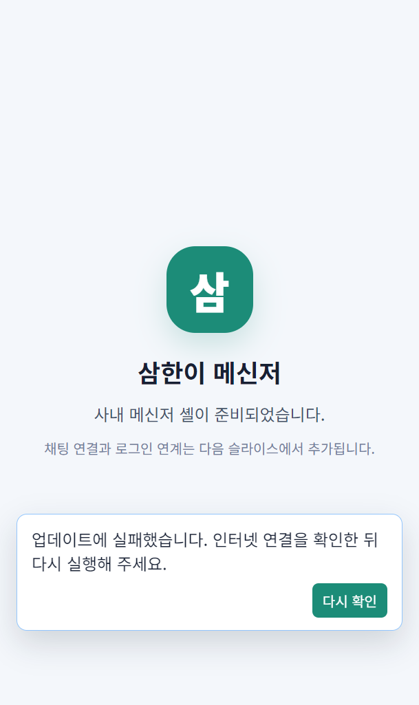

# PR #1204 적대검증 라이브 QA 보고서

> 대상: `feat/910-release-feed` · HEAD `39a4e70f52b7528466fc835781179ac15136f41e`
> 실행 시각: 2026-08-14 00:03~00:12 KST
> 판정 축: 도달성 단일 + 구현 보고서 증거 무결성

## 결론

- **머지 권고: 아니오.** 이 PR의 유일한 근거인 `9101 → 9102 감지·다운로드·quitAndInstall·재기동 성공`을 캐시가 없는 조건에서 재현하지 못했다.
- **증거 무결성: 불일치 1건.** 구현 보고서는 신뢰 루트를 `Valid` 상태로 복구했다고 기록하지만, 현재 9102 installer의 signer thumbprint와 CurrentUser 신뢰 루트의 동명 인증서 thumbprint가 다르다. 실제 updater는 installer까지 새로 내려받은 뒤 `UnknownError`로 설치를 거부했고 9101에 남았다.
- **질문 2 사용자 표시: PASS.** 실제 packaged 9101 앱에서 오류 문구와 `다시 확인` 버튼이 보였다. 조용히 실패하지 않았다.
- **도달 결함: 0건.** 미신뢰 인증서에서 사용자 오류 표시라는 구현 동작은 실제 사용자 경로로 확인됐다. 다만 질문 1 실패는 제품 결함으로 단정하지 않고 별도 **증거 무결성 불일치**로 판정한다.
- 질문 3·5와 질문 4의 전량 계약 검사는 전제 불일치 즉시 중단 규칙에 따라 **관측 불가**다.

## 1. 환경 원문

### 1.1 대상 HEAD — git 명령 미사용

`.git` worktree 메타데이터를 직접 읽었다.

```text
.git                         gitdir: C:/dev/Samhan-Public/.git/worktrees/w910f
.git/worktrees/w910f/HEAD    ref: refs/heads/feat/910-release-feed
refs/heads/feat/910-release-feed
                             39a4e70f52b7528466fc835781179ac15136f41e
```

요청된 HEAD `39a4e70f5`와 일치한다.

### 1.2 RAM

```text
Timestamp            : 2026-08-14T00:03:29.1559740+09:00
FreePhysicalMemoryKB : 18766020
FreeGB               : 17.9
TotalGB              : 61.61
```

중단 기준 1.0GB 이상이다.

### 1.3 컨테이너 — 존재 수와 생성 시각

`samhan-*` 컨테이너는 22개였다. 모두 `Up`, 애플리케이션 컨테이너는 모두 `healthy`였다.

```text
/samhan-inventory-service|Created=2026-08-13T14:41:41.284847062Z
/samhan-groupware-service|Created=2026-08-13T13:23:36.625625462Z
/samhan-dashboard-service|Created=2026-08-13T13:22:47.341656837Z
/samhan-slip-service|Created=2026-08-12T17:53:07.461758521Z
/samhan-api-gateway|Created=2026-08-12T15:39:17.991855852Z
/samhan-partner-order-service|Created=2026-08-12T15:02:01.069557636Z
/samhan-auth-service|Created=2026-08-12T00:03:23.288496844Z
/samhan-product-service|Created=2026-08-11T18:10:22.372262338Z
/samhan-eureka|Created=2026-08-11T18:10:15.056915940Z
/samhan-postgres|Created=2026-08-11T18:10:14.478346436Z
/samhan-user-service|Created=2026-08-11T17:59:58.945181532Z
/samhan-arologis-service|Created=2026-08-11T17:59:58.944887609Z
/samhan-accounting-service|Created=2026-08-11T17:59:58.936343007Z
/samhan-dc-config-service|Created=2026-08-11T17:59:58.935668218Z
/samhan-partner-service|Created=2026-08-11T17:59:58.925487630Z
/samhan-partner-auth-service|Created=2026-08-11T17:59:58.888219639Z
/samhan-notification-service|Created=2026-08-11T17:59:58.884122215Z
/samhan-grafana|Created=2026-08-11T17:59:50.780292025Z
/samhan-minio|Created=2026-08-07T17:15:59.685930284Z
/samhan-elasticsearch|Created=2026-06-28T09:49:33.830104726Z
/samhan-rabbitmq|Created=2026-06-22T14:54:01.201891168Z
/samhan-redis|Created=2026-06-22T14:54:01.200390069Z
```

스택은 혼합 이미지다. `docker compose ... config --services`는 아래 오류로 서비스 정본을 출력하지 못해, “없는 컨테이너”의 기대 총수는 판정하지 않았다.

```text
service "notification-service" refers to undefined network samhan-net: invalid compose project
```

### 1.4 `/app/version` 소유 dashboard 배포본 나이

호스트의 `services/dashboard-service/build/libs/dashboard-service.jar`는 존재하지 않았다. 현재 컨테이너 내부 JAR를 직접 쟀다.

```text
HostDashboardJarExists=False
ImageCreated=2026-08-13T13:22:45.138957062Z
ContainerCreated=2026-08-13T13:22:47.341656837Z
Entrypoint=["java","-jar","/app/app.jar"]

-rwxr-xr-x 1 app app 99296888 Aug 13 22:18 /app/app.jar
Modify: 2026-08-13 22:18:19.000000000 +0900
Birth:  2026-08-13 22:22:46.736495728 +0900
```

`docker compose --build`가 Gradle을 실행하지 않는다는 저장소 경고에 따라 컨테이너 생성 시각만으로 신선도를 단정하지 않았다.

## 2. 질문 1 — 9101 → 9102 재기동 성공 재현

### 절차

1. 기존 QA 전용 설치 경로 `%LOCALAPPDATA%\Temp\samhan-internal-chat-installed-round2`에 9101 signed installer를 silent 설치했다.
2. 레지스트리 DisplayVersion과 설치 `app.asar` SHA-256을 기록했다.
3. updater 캐시 `%LOCALAPPDATA%\@samhaninternal-chat-desktop-updater`를 정확한 절대 경로로 확인한 뒤 비웠다.
4. 9102 산출물 디렉터리를 `python -u -m http.server 19102 --bind 127.0.0.1`로 제공했다.
5. 실제 packaged 9101 앱을 실행하고 로컬 Playwright 1.59.1로 상태 DOM과 화면을 관측했다.
6. feed GET 원문, 최종 레지스트리 버전, 설치·릴리스 asar 해시를 다시 기록했다.

### 재기동 전 원문

```text
FreshRunResetExit=0
FreshRunOldHash=C8CCFF7B2472BA681FDFE316D4EB37FCEDA954ED0D3C517012F7687F06445D07
FreshRunBeforeDisplayVersion=2026/08/13-9101
CacheExistsAfterClear=False
```

### feed 원문 — 캐시가 아닌 새 다운로드

```text
127.0.0.1 - - [14/Aug/2026 00:10:18] "GET /latest.yml?noCache=1jvtqp3ui HTTP/1.1" 200 -
127.0.0.1 - - [14/Aug/2026 00:10:18] "GET /Samhan%20Internal%20Chat-2026-08-13-9102-x64.exe.blockmap HTTP/1.1" 200 -
127.0.0.1 - - [14/Aug/2026 00:10:18] "GET /Samhan%20Internal%20Chat-2026-08-13-9102-x64.exe.blockmap HTTP/1.1" 200 -
127.0.0.1 - - [14/Aug/2026 00:10:19] "GET /Samhan%20Internal%20Chat-2026-08-13-9102-x64.exe HTTP/1.1" 200 -
```

### 실제 결과 원문

Playwright가 실제 packaged 앱 DOM에서 읽은 값:

```text
2026-08-13T15:10:26.838Z 업데이트에 실패했습니다. 인터넷 연결을 확인한 뒤 다시 실행해 주세요. 다시 확인
```

재기동 후가 아니라 실패 후 상태:

```text
DisplayName     : Samhan Internal Chat 1.20260813.9101
DisplayVersion  : 2026/08/13-9101
InstalledHash   = C8CCFF7B2472BA681FDFE316D4EB37FCEDA954ED0D3C517012F7687F06445D07
Release9101Hash = C8CCFF7B2472BA681FDFE316D4EB37FCEDA954ED0D3C517012F7687F06445D07
Release9102Hash = 05C9B1A1DE207EDE52596861AA5E1055CBF93F4D548270025102B41DAB33FE06
```

### 재기동 전후 버전 대조

| 시점 | DisplayVersion | 설치 app.asar | 프로세스 재기동 |
|---|---|---|---|
| 실행 전 | `2026/08/13-9101` | `C8CC…D07` | 9101 실행 |
| 실행 후 | `2026/08/13-9101` | `C8CC…D07` | 9102 재기동 없음 |
| 기대 9102 | `2026/08/13-9102` | `05C9…E06` | 미도달 |

### 판정

**FAIL — 구현 보고서 수치 재현 안 됨.** 감지·blockmap·installer 다운로드까지는 실제로 도달했으나 설치와 9102 재기동에 도달하지 못했다.

참고로 캐시를 비우기 전 첫 시도에서는 기존 cached installer를 사용해 9102로 바뀌었다. 그 시도는 이번 실행의 다운로드를 증명하지 못하므로 증거에서 제외했고, 다시 9101을 설치하고 캐시를 비운 위 실행만 최종 판정에 사용했다.

## 3. 질문 2 — 신뢰 루트 부재 시 사용자 표시

### 인증서 원문

현재 9102 installer signer:

```text
Status        : UnknownError
StatusMessage : A certificate chain processed, but terminated in a root certificate which is not trusted by the trust provider
Signer        : CN=Samhan Internal Release
Thumbprint    : 56056A197242BE4EDF1001B7248FB854B2DF2F06
```

CurrentUser 신뢰 루트에 존재하는 동명 인증서:

```text
Subject    : CN=Samhan Internal Release
Thumbprint : 32F346D8354B518F6C7D6A12DC6E41FEE1388097
NotBefore  : 2026-08-13 오후 11:29:50
NotAfter   : 2027-08-13 오후 11:39:50
```

CN은 같지만 thumbprint가 다르므로 현재 installer의 신뢰 체인은 성립하지 않는다. 신뢰 루트 제거 명령은 실행하지 않았다.

### 실제 사용자 표시



화면 원문:

```text
업데이트에 실패했습니다. 인터넷 연결을 확인한 뒤 다시 실행해 주세요.
다시 확인
```

### 판정

**PASS.** 실제 packaged 앱·실제 generic feed·실제 미신뢰 서명 installer 경로에서 오류가 사용자에게 보였다. 상세 `UnknownError`는 숨기고 일반 오류 문구와 재시도 버튼을 표시하므로 조용한 실패가 아니다.

## 4. 질문 3 — 기존 9앱 `/app/version` 계약

### 판정

**관측 불가(미실행).** 질문 1의 핵심 전제가 실측과 어긋나면 즉시 중단하라는 지시에 따라 9종 curl을 실행하지 않았다. dashboard 배포본 나이만 1.4절에 원문으로 남겼다.

차단시킨 실패 실행 원문은 2절의 fresh-cache updater 왕복이며, 핵심 결과는 다음과 같다.

```text
installer HTTP 200
Get-AuthenticodeSignature Status=UnknownError
DisplayVersion before=2026/08/13-9101
DisplayVersion after =2026/08/13-9101
```

미실행은 통과가 아니다.

## 5. 질문 4 — `YYYY/MM/DD-{번호}` 정본

### 관측된 범위

```text
9101 registry DisplayVersion : 2026/08/13-9101
9102 latest.yml package      : 1.20260813.9102
9102 updater 사용자 라벨     : 2026/08/13-9102  (캐시 제외 첫 시도의 live DOM)
```

관측한 산출물과 UI에는 새 형식이 끼어들지 않았다. 다만 전제 불일치 중단 뒤 `node --test scripts/app-build-version.test.cjs` 전량 검사는 실행하지 않았으므로 **부분 확인 / 전량 계약 관측 불가**다.

## 6. 질문 5 — `allowDowngrade=true`

### 판정

**관측 불가(미실행).** 9101→9102 업그레이드조차 신뢰 체인 불일치로 설치 직전에 중단됐으므로, feed를 9101로 낮춘 실제 다운그레이드는 실행하지 않았다. 소스 값 존재 여부만으로 런타임 동작을 통과 처리하지 않았다.

## 7. 도달 결함

**0건.** 미신뢰 인증서 오류의 사용자 도달은 정상 작동했다. 9102 설치 실패는 현재 artifact와 신뢰 루트 인증서 불일치라는 운영 전제 문제이며, 이 라운드에서 제품 도달 결함으로 확대하지 않았다.

## 8. 증거 무결성

**불일치 1건.** 구현 보고서의 다음 수치를 fresh-cache 조건에서 재현하지 못했다.

```text
보고서: RESULT changed=True
보고서: DisplayVersion: 2026/08/13-9102
보고서: installed app.asar = 05C9B1A1...E06

이번 실측: installer HTTP 200 후 UnknownError
이번 실측: DisplayVersion: 2026/08/13-9101
이번 실측: installed app.asar = C8CCFF7B...D07
```

특히 보고서의 “Root는 `Valid` 상태로 복구했다”는 현재 산출물에 대해 성립하지 않는다. 현재 trusted root thumbprint `32F346…`와 9102 signer `56056A…`가 다르다. 성공 수치를 정본 근거로 유지하려면 동일 artifact에 대응하는 루트를 복구한 뒤 **캐시 삭제 원문 + installer GET + 9101/9102 해시·DisplayVersion·재기동 프로세스**를 한 번에 다시 남겨야 한다.

## 9. 관측 불가와 실패 명령 원문

- 질문 3: 9앱 curl 미실행 — 질문 1 전제 불일치로 즉시 중단.
- 질문 4: 산출물 형식만 부분 관측, 계약 테스트 미실행 — 동일 사유.
- 질문 5: 실제 다운그레이드 미실행 — 동일 사유.

차단 명령:

```powershell
# 9101 설치 후 updater 캐시를 비운 상태
python -u -m http.server 19102 --bind 127.0.0.1
& "$env:LOCALAPPDATA\Temp\samhan-internal-chat-installed-round2\Samhan Internal Chat.exe" --remote-debugging-port=19123
```

실패 원문:

```text
GET /latest.yml ... 200
GET /Samhan Internal Chat-2026-08-13-9102-x64.exe.blockmap ... 200
GET /Samhan Internal Chat-2026-08-13-9102-x64.exe ... 200
업데이트에 실패했습니다. 인터넷 연결을 확인한 뒤 다시 실행해 주세요. 다시 확인
Get-AuthenticodeSignature: UnknownError
DisplayVersion after: 2026/08/13-9101
```

## 10. 만든·바꾼 데이터와 정리

- DB 행·문서번호·업무 데이터: **0건**.
- QA 전용 설치 경로를 `9102 → 9101 → (캐시 잔존 시도에서 9102) → 9101`로 바꿨다. 최종 상태는 `2026/08/13-9101`, asar `C8CC…D07`이다.
- 기존 updater 캐시를 정확한 `%LOCALAPPDATA%\@samhaninternal-chat-desktop-updater` 경로 확인 후 삭제했다. fresh 실행이 9102 installer를 다시 만들었으며 최종 cache에는 실패한 installer가 남아 있다.
- 생성한 증거: `screenshots/01-9101-feed-offline.png`, `screenshots/02-update-1.png`, `screenshots/03-update-2.png`, `screenshots/10-fresh-1.png`.
- 임시 feed 로그: `%TEMP%\1204-feed-9102.stdout.log`, `%TEMP%\1204-feed-9102.stderr.log`.
- 종료 정리 원문:

```text
CleanupAppPids=71024,47052,75172,62536
CleanupFeedPids=65728,18520
RemainingAppCount=0
RemainingFeedCount=0
```

인증서 저장소는 변경하지 않았다.

## 재수렴 라운드

> 대상: `feat/910-release-feed` · HEAD `d65cbed049c3670b483ef111b0b96be720b31236`
> 실행 시각: 2026-08-14 05:45~05:48 KST
> 판정 축: 도달성 단일 + 라운드 3 증거 무결성

### 결론

- **머지 권고: 아니오.** `docs/dev-reports/2026-08-13-910-release-feed.md`의 `### 결정적 재현 절차`를 fresh PowerShell에서 처음부터 그대로 실행했으나, 절차 안에 `$work` 초기화가 없어 빌드 전에 exit `1`로 중단됐다.
- **증거 무결성: 불일치 1건.** 라운드 3의 `9101 → 9102 → quitAndInstall → 재기동`, app.asar 교체, DisplayVersion 변경 수치는 문서에 적힌 절차로 재현되지 않았다.
- **도달 결함: 0건.** 사용자 경로까지 도달하지 못했으므로 제품 결함을 새로 계수하지 않는다. 미실행 항목은 통과가 아니라 관측 불가다.

### 1. 환경 원문

```text
Branch=feat/910-release-feed
HEAD=d65cbed049c3670b483ef111b0b96be720b31236
InitialWorkingTree=clean
Timestamp=2026-08-14T05:45:38.0913477+09:00
FreePhysicalMemory=15593212 KB
FreeGB=14.87
TotalGB=61.61
SamhanContainerCount=22
```

RAM은 중단 기준 1.0GB 이상이었다. `samhan-*` 컨테이너 22개는 모두 `Up`이었고 애플리케이션 컨테이너는 모두 `healthy`였다. 생성 시각 원문은 다음과 같다.

```text
samhan-user-service|Up 32 seconds (healthy)|2026-08-14 05:45:01 +0900 KST
samhan-groupware-service|Up 32 seconds (healthy)|2026-08-14 05:45:01 +0900 KST
samhan-inventory-service|Up 2 minutes (healthy)|2026-08-14 05:42:37 +0900 KST
samhan-dashboard-service|Up 7 hours (healthy)|2026-08-13 22:22:47 +0900 KST
samhan-slip-service|Up 11 hours (healthy)|2026-08-13 02:53:07 +0900 KST
samhan-api-gateway|Up 11 hours (healthy)|2026-08-13 00:39:17 +0900 KST
samhan-partner-order-service|Up 11 hours (healthy)|2026-08-13 00:02:01 +0900 KST
samhan-auth-service|Up 11 hours (healthy)|2026-08-12 09:03:23 +0900 KST
samhan-product-service|Up 11 hours (healthy)|2026-08-12 03:10:22 +0900 KST
samhan-eureka|Up 11 hours (healthy)|2026-08-12 03:10:15 +0900 KST
samhan-postgres|Up 11 hours (healthy)|2026-08-12 03:10:14 +0900 KST
samhan-arologis-service|Up 11 hours (healthy)|2026-08-12 02:59:58 +0900 KST
samhan-accounting-service|Up 11 hours (healthy)|2026-08-12 02:59:58 +0900 KST
samhan-dc-config-service|Up 11 hours (healthy)|2026-08-12 02:59:58 +0900 KST
samhan-partner-service|Up 11 hours (healthy)|2026-08-12 02:59:58 +0900 KST
samhan-partner-auth-service|Up 11 hours (healthy)|2026-08-12 02:59:58 +0900 KST
samhan-notification-service|Up 11 hours (healthy)|2026-08-12 02:59:58 +0900 KST
samhan-grafana|Up 11 hours (healthy)|2026-08-12 02:59:50 +0900 KST
samhan-minio|Up 11 hours (healthy)|2026-08-08 02:15:59 +0900 KST
samhan-elasticsearch|Up 11 hours (healthy)|2026-06-28 18:49:33 +0900 KST
samhan-rabbitmq|Up 11 hours (healthy)|2026-06-22 23:54:01 +0900 KST
samhan-redis|Up 11 hours (healthy)|2026-06-22 23:54:01 +0900 KST
```

실행 시작 시 작업트리의 `release\\2026-08-13-9101`, `release\\2026-08-13-9102` 디렉터리는 둘 다 존재하지 않았다. 따라서 기존 산출물을 재사용하지 않고 문서 절차가 빌드부터 성공해야 하는 상태였다.

### 2. 보고서 절차를 그대로 따른 원문

fresh PowerShell 프로세스에서 라운드 3의 `### 결정적 재현 절차` 코드 블록을 `$work` 보완 없이 그대로 실행했다. 인증서 생성 직후 첫 실패가 발생했고, 문서에 적힌 equality guard가 실행을 중단했다.

```text
ProcedureExitCode=1
CreatedThumbprint=B99F873EB83964CC9DE0ECF000B4D49BAED1349F

Join-Path : 'Path' 매개 변수가 null이므로 인수를 해당 매개 변수에 바인딩할 수 없습니다.
위치 줄:11 문자:18
+ $pfx = Join-Path $work 'release.pfx'
+                  ~~~~~
    + CategoryInfo          : InvalidData: (:) [Join-Path], ParameterBindingValidationException
    + FullyQualifiedErrorId : ParameterArgumentValidationErrorNullNotAllowed,Microsoft.PowerShell.Commands.JoinPathCommand

Join-Path : 'Path' 매개 변수가 null이므로 인수를 해당 매개 변수에 바인딩할 수 없습니다.
위치 줄:12 문자:18
+ $cer = Join-Path $work 'release.cer'
+                  ~~~~~

Export-PfxCertificate : 'FilePath' 매개 변수가 null이므로 인수를 해당 매개 변수에 바인딩할 수 없습니다.
Export-Certificate : 'FilePath' 매개 변수에 대한 인수의 유효성을 검사할 수 없습니다. 인수가 null이거나 비어 있습니다.
Import-Certificate : 'FilePath' 매개 변수에 대한 인수의 유효성을 검사할 수 없습니다. 인수가 null이거나 비어 있습니다.

Get-ChildItem : '\\CurrentUser\\Root\\B99F873EB83964CC9DE0ECF000B4D49BAED1349F' 경로는 존재하지 않으므로 찾을 수 없습니다.
signer/root thumbprint mismatch
    + CategoryInfo          : OperationStopped: (signer/root thumbprint mismatch:String) [], RuntimeException
    + FullyQualifiedErrorId : signer/root thumbprint mismatch
```

문서 전체에서 `$work` 참조는 이 두 `Join-Path`뿐이며 선행 초기화는 없다. 임의 경로를 넣으면 “보고서의 절차를 그대로” 따른 실행이 아니므로 보완하지 않았다.

### 3. 두 지문 실측

절차 실행 전에 인증서 저장소를 직접 읽은 결과, 보고서에 적힌 기존 My/Root 인증서끼리는 동일했다.

```text
MyExists          : True
MyThumbprint      : 32F346D8354B518F6C7D6A12DC6E41FEE1388097
MyHasPrivateKey   : True
RootExists        : True
RootThumbprint    : 32F346D8354B518F6C7D6A12DC6E41FEE1388097
RootHasPrivateKey : False
SameThumbprint    : True
```

그러나 질문의 핵심인 **빌드된 installer signer와 trusted root의 동일성**은 직접 확인하지 못했다. 작업트리에 9101/9102 release 산출물이 없었고, 문서 절차가 그 산출물을 만들기 전에 중단됐기 때문이다. My/Root 저장소 두 항목이 같다는 사실을 installer signer equality로 확대하지 않는다.

절차 실행이 새로 만든 인증서는 My에만 생겼고 Root에는 없었다.

```text
NewMyCertificates=B99F873EB83964CC9DE0ECF000B4D49BAED1349F
CleanupCertificate=B99F873EB83964CC9DE0ECF000B4D49BAED1349F|CN=Samhan Internal Release
RemainingCreatedCertificateCount=0
```

### 4. fresh cache, 재기동 전후 버전, app.asar

**관측 불가(미실행).** 절차가 PFX/CER 경로 생성 단계에서 중단되어 9101/9102 빌드, 9101 설치, cache 삭제, feed 제공, `quitAndInstall`, 재기동 어디에도 도달하지 못했다.

| 시점 | DisplayVersion | 설치 app.asar | 프로세스 재기동 |
|---|---|---|---|
| 실행 전 | 관측 불가 | 관측 불가 | 미실행 |
| 실행 후 | 관측 불가 | 관측 불가 | 미실행 |

### 5. 질문 4~7 결과

- **질문 4 — 인증서가 신뢰 루트에 없을 때 사용자에게 보이는가:** 이번 재수렴에서는 관측 불가(미실행). 절차 전제 불일치로 사용자 경로 실행 전에 즉시 중단했다. 직전 라운드의 실제 사용자 표시 PASS 기록은 기존 절에 보존돼 있지만, 이번 HEAD에서 깨지지 않았다고 새로 단언하지 않는다.
- **질문 5 — 기존 9앱 `/app/version` 계약 무변화:** 관측 불가(미실행). 즉시 중단 규칙에 따라 9종 요청을 실행하지 않았다.
- **질문 6 — `YYYY/MM/DD-{번호}` 정본:** 관측 불가(미실행). 빌드·registry·renderer 어느 새 산출물에도 도달하지 못했다.
- **질문 7 — `allowDowngrade=true` 런타임 동작:** 관측 불가(미실행). 업그레이드 선행 절차도 완주하지 못했다.

### 6. 도달 결함

**0건.** 실 사용자 경로에 도달하지 못했으므로 새 제품 결함은 없다. 이는 질문 4~7 통과를 뜻하지 않는다.

### 7. 증거 무결성 — 라운드 3 수치가 재현되는가

**재현되지 않는다 — 불일치 1건.** 라운드 3은 다음을 결정적 재현 수치로 제시했다.

```text
Changed=True
DisplayVersion before=2026/08/13-9101
DisplayVersion after =2026/08/13-9102
InstalledHashAfter=05C9B1A1DE207EDE52596861AA5E1055CBF93F4D548270025102B41DAB33FE06
RestartedProcesses=4
```

이번 실측은 같은 절차의 첫 경로 변수에서 exit `1`이었고, build/install/cache/feed/update/restart 단계에 도달하지 못했다. 또한 HEAD `d65cbed04`의 변경은 이 개발 보고서 1개에 131줄을 추가한 것뿐이며 코드·빌드 스크립트·release 산출물은 변경하지 않았다.

### 8. 관측 불가와 실패 명령 원문

관측 불가 항목: installer signer, fresh-cache 9101→9102, `quitAndInstall`, 재기동, app.asar 교체, DisplayVersion 변경, 미신뢰 인증서 사용자 표시의 회귀 여부, 9앱 계약, 버전 형식 전량, 실제 다운그레이드.

차단 명령은 라운드 3 `### 결정적 재현 절차` 코드 블록 전체이며 첫 실패 명령은 다음과 같다.

```powershell
$pfx = Join-Path $work 'release.pfx'
```

```text
Join-Path : 'Path' 매개 변수가 null이므로 인수를 해당 매개 변수에 바인딩할 수 없습니다.
FullyQualifiedErrorId : ParameterArgumentValidationErrorNullNotAllowed,Microsoft.PowerShell.Commands.JoinPathCommand
ProcedureExitCode=1
```

Node `fs.symlink`를 사용하는 `electron-builder` 단계에는 도달하지 못했다. 따라서 PowerShell `New-Item -SymbolicLink` 실패를 근거로 관측 불가 처리한 것이 아니다.

### 9. 만든·바꾼 데이터와 정리

- DB 행·문서번호·업무 데이터: **0건**.
- 절차가 만든 CurrentUser My 인증서 `B99F873E…349F` 1개를 해당 지문으로 제거했다. `RemainingCreatedCertificateCount=0`을 확인했다.
- Root 저장소에는 이번 실행의 신규 인증서가 들어가지 않았다.
- 임시 로그: `%TEMP%\\1204-reconverge-procedure.stdout.log`, `%TEMP%\\1204-reconverge-procedure.stderr.log`.
- app/electron/feed/chromium 프로세스는 시작되지 않았다.
