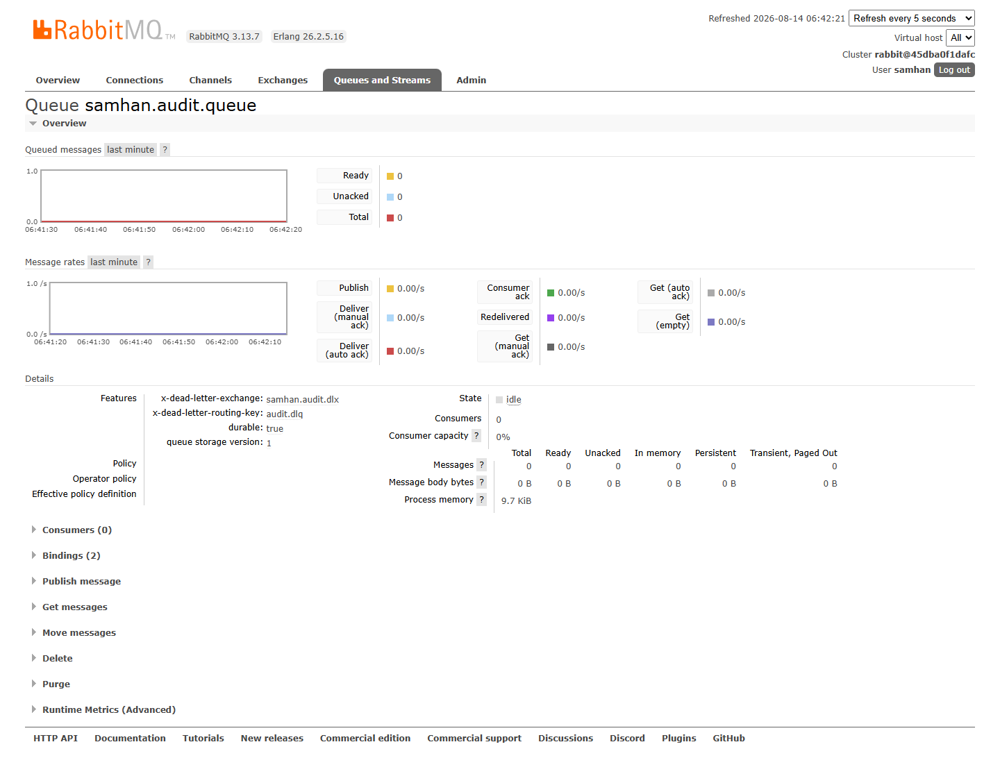

# PR #1206 적대검증 · 라이브 QA 보고서

- 대상: PR #1206 `feat/1161-s15-retention`
- 검증 HEAD: `924cc229a22bc8521dfa4b7a093040f3043fff51`
- 기준 main: `e5b1df8bd412f17c5662105dc60cbd36c48fa00b`
- 일시: 2026-08-14 (Asia/Seoul)
- 결론: **도달 결함 1건. 머지 비권고.** 실제 기존 Rabbit queue가 있는 업그레이드 경로에서 logging-service가 기동하지 못한다.
- 중단 사유: 브리핑의 “전제가 실측과 어긋나면 고치지 말고 즉시 중단·보고” 지시에 따라 기존 queue를 삭제·재생성하거나 정책으로 우회하지 않았다.

## 1. 환경 원문

### 1.1 checkout · PR · 마이그레이션

```text
## feat/1161-s15-retention...origin/feat/1161-s15-retention
924cc229a22bc8521dfa4b7a093040f3043fff51
e5b1df8bd412f17c5662105dc60cbd36c48fa00b
feat/1161-s15-retention
{"baseRefName":"main","headRefName":"feat/1161-s15-retention","headRefOid":"924cc229a22bc8521dfa4b7a093040f3043fff51","mergeable":"MERGEABLE","number":1206,"state":"OPEN"}
```

`git diff --name-only origin/main...924cc229a -- '*/src/main/resources/db/migration/*' '**/db/migration/*'` 출력은 비어 있었다. **새 DB/Flyway migration은 0개**다.

### 1.2 RAM · 컨테이너 존재/부재

검증 시작 원문:

```text
FreePhysicalMemoryKB : 18502504
FreeRAM_GiB          : 17.645
TotalRAM_GiB         : 61.613
Client=29.6.2 Server=29.6.2
```

중단·정리 후 가용 RAM은 `16.55 GiB`였다. 전 구간에서 1.0 GiB 중단선 위였다.

base+local-all 기본 선언 서비스는 24개였고 시작 시 실행 중인 대응 컨테이너는 22개였다.

```text
DEFAULT_DECLARED=24
WITH_LOGGING_DECLARED=25
DEFAULT_ABSENT=samhan-nginx,samhan-prometheus
LOGGING_INITIAL_STATE=absent (profile opt-in)
```

logging-service는 `logging` profile의 opt-in 서비스이므로 시작 시 없는 것이 정상이다.

### 1.3 배포본 나이와 PR HEAD 빌드

시작 시 대상 컨테이너/호스트 산출물:

```text
/samhan-user-service|2026-08-13T21:04:34.684579342Z|infrastructure-user-service
/samhan-dashboard-service|2026-08-13T13:22:47.341656837Z|infrastructure-dashboard-service
services/logging-service/build/libs/logging-service.jar       없음
services/user-service/build/libs/user-service.jar             없음
services/dashboard-service/build/libs/dashboard-service.jar   없음
```

`docker compose --build`가 Gradle을 실행하지 않으므로 먼저 아래를 실행했다.

```text
.\gradlew.bat :services:logging-service:bootJar :services:user-service:bootJar :services:dashboard-service:bootJar :shared:audit-publisher:jar --no-daemon

> Task :services:logging-service:bootJar
> Task :services:user-service:bootJar
> Task :services:dashboard-service:bootJar
BUILD SUCCESSFUL in 13s
```

그 뒤 `--no-deps`로 대상 세 서비스만 빌드·교체했다. 컨테이너 안 JAR 원문:

```text
/samhan-logging-service|Created=2026-08-13T21:37:32.327894075Z|Image=sha256:e2964f4d...
/samhan-user-service|Created=2026-08-13T21:37:32.381689177Z|Image=sha256:e2ad3afb...
/samhan-dashboard-service|Created=2026-08-13T21:37:32.381632687Z|Image=sha256:39c86b8f...
-rwxr-xr-x 1 app app 100997307 2026-08-14 06:36:12 +0900 /app/app.jar
-rwxr-xr-x 1 app app  93513389 2026-08-14 06:36:12 +0900 /app/app.jar
-rwxr-xr-x 1 app app 101572636 2026-08-14 06:36:12 +0900 /app/app.jar
```

**현재 user-service와 dashboard-service는 PR HEAD 브랜치 빌드다. PM이 main으로 복구해야 한다.** 새로 올린 logging-service는 반복 재시작을 멈추기 위해 증거 수집 후 정지했다.

## 2. 공통 기동 차단 — 도달 결함 1건

### 절차

1. 기존 공유 RabbitMQ와 Elasticsearch는 그대로 둔다.
2. PR HEAD JAR를 Gradle로 만든다.
3. `docker compose ... --profile logging up -d --build --no-deps logging-service user-service dashboard-service`로 대상만 교체한다.
4. 3분 동안 세 컨테이너의 health가 `healthy`가 되는지 조건 대기한다.
5. Rabbit queue 인자와 양쪽 로그를 원문으로 조회한다.

### 실제 결과 원문

3분 후:

```text
/samhan-logging-service|Health=starting
/samhan-user-service|Health=starting
/samhan-dashboard-service|Health=starting
FREE_RAM_GIB=16.528
```

logging-service/Rabbit 양쪽에서 동일하게 재현된 원문:

```text
PRECONDITION_FAILED - inequivalent arg 'x-message-ttl' for queue
'samhan.audit.queue' in vhost '/': received the value '86400000'
of type 'long' but current is none

Application run failed
```

기존 queue 실측:

```text
name                durable arguments                                                                                  messages
samhan.audit.queue  true    [{"x-dead-letter-exchange","samhan.audit.dlx"},{"x-dead-letter-routing-key","audit.dlq"}] 0
samhan.audit.dlq    true    []                                                                                         0
```

Rabbit 관리 화면 증거:



화면의 Features에는 `x-dead-letter-exchange`, `x-dead-letter-routing-key`만 있고 `x-message-ttl`, `x-max-length`는 없다. consumer는 0이다.

중단 직전/정리 후 상태:

```text
/samhan-logging-service|RestartCount=9|Health=starting
...
/samhan-logging-service|Status=exited|RestartCount=13|Health=unhealthy
/samhan-user-service|Status=running|RestartCount=0|Health=starting
/samhan-dashboard-service|Status=running|RestartCount=0|Health=starting
```

### 판정

**도달 결함 1건.** 기존 durable queue의 선언 인자는 제자리 변경할 수 없다. 실제 업그레이드 환경에는 TTL 없는 `samhan.audit.queue`가 존재하므로, PR이 같은 이름에 TTL을 추가해 재선언하면 Rabbit 406으로 logging-service가 기동 실패한다. 새 lane queue와 consumer도 완성되지 않아 정상 감사 저장·DLQ 운영 경로에 도달할 수 없다.

## 3. 질문 1 — fail-soft

### 대상

- user-service 역할 변경
- dashboard-service 릴리스 publish/unpublish

### 결과

**관측 불가.** PR HEAD 세 서비스가 healthy가 되기 전에 공통 Rabbit topology 충돌이 발생했고, 전제 불일치 즉시 중단 지시에 따라 업무 mutation을 만들지 않았다. 따라서 Rabbit 실패 상태에서 업무 DB commit과 HTTP 성공 응답이 유지되는지 라이브로 판정하지 않았다.

- 절차: PR HEAD 배포 → health 조건 대기 → Rabbit topology 충돌 확인 → 즉시 중단
- 스크린샷: [공통 차단 증거](screenshots/rabbit-existing-queue.png)
- 저장된 행 원문: **없음(업무 호출 미실행)**

## 4. 질문 2 — 실제 이벤트 도착과 저장 행 원문

**관측 불가.** logging consumer가 기동하지 못했고 기존 queue consumer가 0이었다. 이벤트를 발행하거나 ES 저장 행을 만들지 않았다.

```text
samhan.audit.queue messages=0 messages_ready=0 messages_unacknowledged=0
Rabbit Management: Consumers 0
```

- 스크린샷: [consumer 0 및 queue Features](screenshots/rabbit-existing-queue.png)
- 저장된 행 원문: **없음**

## 5. 질문 3 — DLQ inspect / retry / discard · 재처리 한도

**관측 불가.** DLQ 운영 API를 제공할 logging-service가 Rabbit queue 선언 충돌로 재시작했고 최종 정지했다. inspect/retry/discard를 호출하지 않았으며 테스트 메시지도 만들지 않았다.

요구된 **“DLQ 재처리 한도 초과 시 동작 원문”은 없음**이다. 한도를 넘긴 것이 아니라, 한도를 검증할 실행 경로까지 도달하지 못했다.

추가 Rabbit 원문:

```text
operation queue.declare caused a channel exception not_found:
no queue 'samhan.audit.failure.queue' in vhost '/'
```

- 스크린샷: [기존 queue와 consumer 0](screenshots/rabbit-existing-queue.png)
- 저장된 행 원문: **없음**

## 6. 질문 4 — 등급별 ES 인덱스 · ILM

**관측 불가.** 공통 기동 전제가 먼저 깨져 A/B/C 이벤트 저장 및 각 index/template/policy 연결을 라이브로 밟지 않았다. A/B 1년·C 30일 기본값 자체는 결함으로 세지 않았다.

- 스크린샷: [기동 차단 원인](screenshots/rabbit-existing-queue.png)
- 저장된 행 원문: **없음**

## 7. 질문 5 — #1200 회귀

검증 항목인 재시도, requestId/traceId, request capture, correlation 저장은 **관측 불가**다. consumer 기동 실패로 요청부터 ES 저장까지의 round trip을 만들지 않았다. 미실행을 회귀 없음으로 판정하지 않는다.

- 스크린샷: [기동 차단 원인](screenshots/rabbit-existing-queue.png)
- 저장된 행 원문: **없음**

## 8. 질문 6 — user/dashboard 기존 동작·응답 불변

교체 전 기준선으로 다음 두 응답만 기록했다.

```text
GET http://localhost:8083/api/v1/admin/users/roles (임의 헤더) -> 403
GET http://localhost:8094/app/version?clientType=GROUPWARE_DESKTOP&currentVersion=0.0.0 -> 400
```

PR HEAD 교체 후 세 서비스가 3분 안에 healthy가 되지 않았고 user/dashboard actuator는 각각 503이었다. 그러나 업무 endpoint의 동일 입력 비교는 전제 불일치 즉시 중단 때문에 수행하지 않았다. 따라서 기존 업무 응답 불변은 **관측 불가**이며, 503 health는 2절의 동일 Rabbit 기동/연결 문제 증상으로만 기록하고 별도 결함으로 중복 집계하지 않는다.

- 스크린샷: [공통 Rabbit 실측](screenshots/rabbit-existing-queue.png)
- 저장된 행 원문: **없음**

## 9. 도달 결함

| 번호 | 결함 | 재현성 | 영향 |
|---|---|---|---|
| 1 | 기존 `samhan.audit.queue`에 TTL/max-length가 없는 실제 업그레이드 환경에서 동일 queue를 새 인자로 재선언해 Rabbit 406 발생 | PR HEAD 배포 후 반복 재현, logging-service 13회 재시작 | logging-service 기동 불가, consumer 0, 신규 lane/DLQ/ES 저장 라이브 경로 차단 |

총 **1건**이다.

## 10. 증거 무결성

- checkout HEAD와 GitHub PR head OID가 정확히 일치했다.
- Docker 이미지 전에 Gradle bootJar를 실행했고, 컨테이너 안 JAR 시각까지 대조했다.
- 스크린샷은 로컬 Playwright `1.59.1` 패키지와 지정 Chromium `chromium-1217`을 headless로 직접 launch해 실제 Rabbit Management `http://127.0.0.1:15672/#/queues/%2F/samhan.audit.queue`에서 캡처했다.
- 캡처 전 `samhan.audit.queue` 고유 텍스트가 visible임을 단정했다: `QUEUE_VISIBLE=true`.
- mock/fake 데이터와 합성 스크린샷은 사용하지 않았다.
- `docs/qa` 안에 캡처 스크립트를 남기지 않았다.
- 개발 보고서의 단위/컨테이너 테스트 성공 원문은 이번 라이브 환경 성공으로 재사용하지 않았다.

## 11. 관측 불가와 실패 명령 원문

### 11.1 잘못된 compose 단독 조회

```text
docker compose -f infrastructure/docker-compose.local-all.yml config --services
service "user-service" refers to undefined network samhan-net: invalid compose project
```

원인: 이 파일은 base compose와 함께 쓰는 overlay다. base+overlay 조회는 성공했다.

### 11.2 최초 대상 재배포

```text
docker compose -f infrastructure/docker-compose.yml -f infrastructure/docker-compose.local-all.yml --profile logging up -d --build logging-service user-service dashboard-service

target api-gateway: failed to solve:
"/services/api-gateway/build/libs/api-gateway.jar": not found
target eureka-server: failed to solve:
"/services/eureka-server/build/libs/eureka-server.jar": not found
```

원인: compose가 `depends_on` 이미지까지 빌드했다. 대상 이미지 build는 취소됐다. `--no-deps`로 대상 세 개만 다시 실행했으며 성공했다.

### 11.3 health 대기 실패

```text
3분 조건 대기 종료
/samhan-logging-service|starting
/samhan-user-service|starting
/samhan-dashboard-service|starting
```

뒤이어 Rabbit 406과 `Application run failed` 원문을 확인했다.

### 11.4 최초 Playwright import 실패

```text
node:internal/modules/package_json_reader:301
throw new ERR_MODULE_NOT_FOUND(packageName, fileURLToPath(base), null);
Error [ERR_MODULE_NOT_FOUND]: Cannot find package 'playwright' imported from
C:\dev\Samhan-Public\.claude\worktrees\w1161b\clients\desktop\[eval1]
```

worktree 밖 main checkout의 설치된 `clients/desktop/node_modules`에서 같은 저장소 패키지를 사용해 재실행했다.

```text
URL=http://127.0.0.1:15672/#/queues/%2F/samhan.audit.queue
TITLE=RabbitMQ Management
QUEUE_VISIBLE=true
```

## 12. 만든 데이터와 환경 변경

업무/감사/ES/Rabbit 메시지 데이터는 **0건 생성**했다.

환경 변경:

- PR HEAD JAR 3개와 shared jar를 로컬 build 디렉터리에 생성
- PR HEAD Docker image 3개 생성
- user-service와 dashboard-service를 PR HEAD 이미지로 교체 — **PM main 복구 필요**
- opt-in logging-service를 새로 생성했으나 결함 증거 수집 후 정지 (`exited`, restart count 13)
- queue 삭제, purge, 재선언, policy 적용, ES 문서 삭제는 하지 않음

## 13. 머지 권고

**머지 비권고.** 이 PR이 머지되면 #1161이 종료되지만, 실제 기존 durable queue를 보유한 배포 경로에서 logging-service가 기동하지 못한다. 기존 queue를 보존하면서 새 topology로 전환하는 업그레이드 절차/호환 구현이 마련되고, 그 수정본에서 질문 1~6 전체와 DLQ retry 한도 초과 원문을 다시 라이브 검증하기 전에는 종료 근거가 부족하다.
