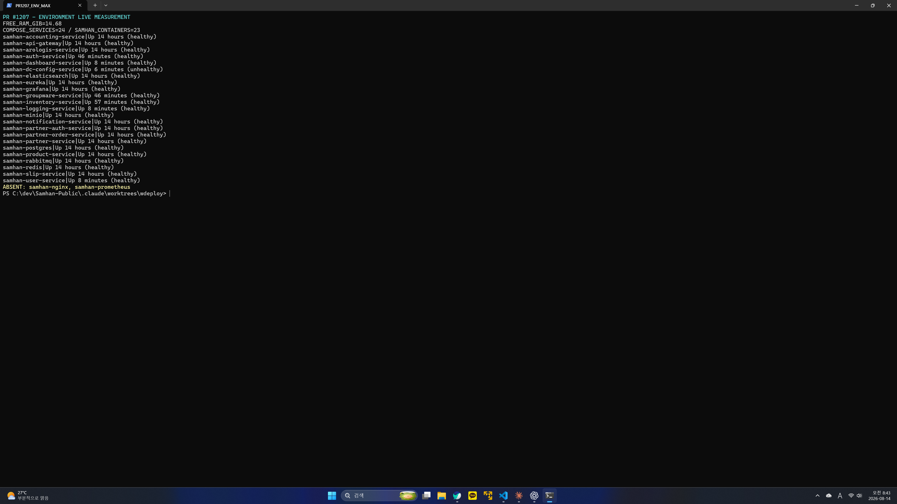
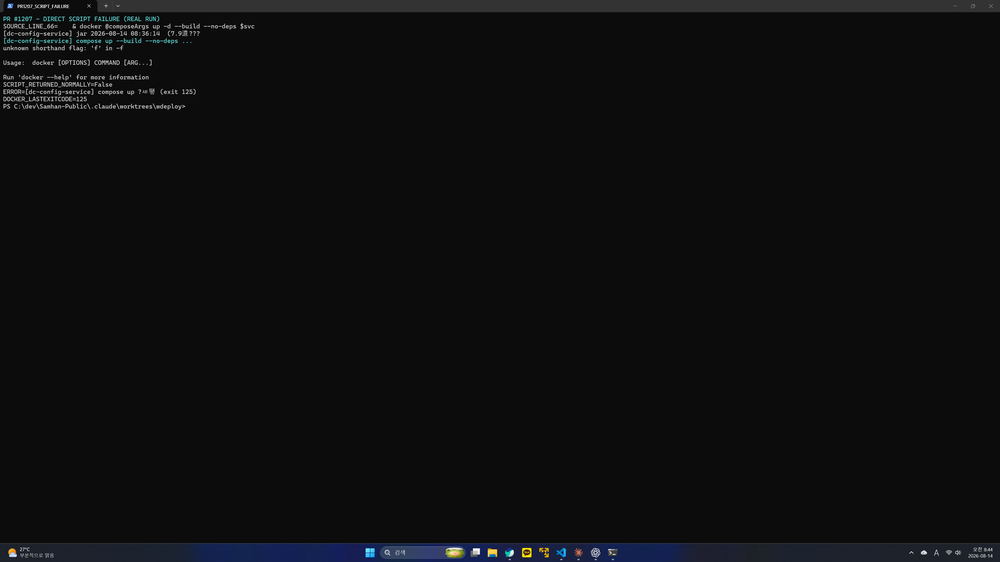
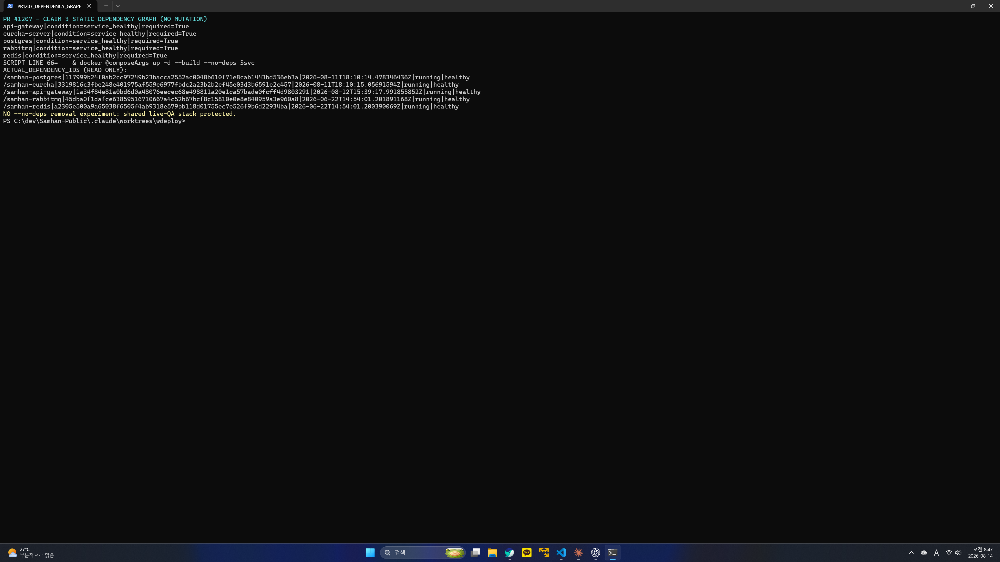
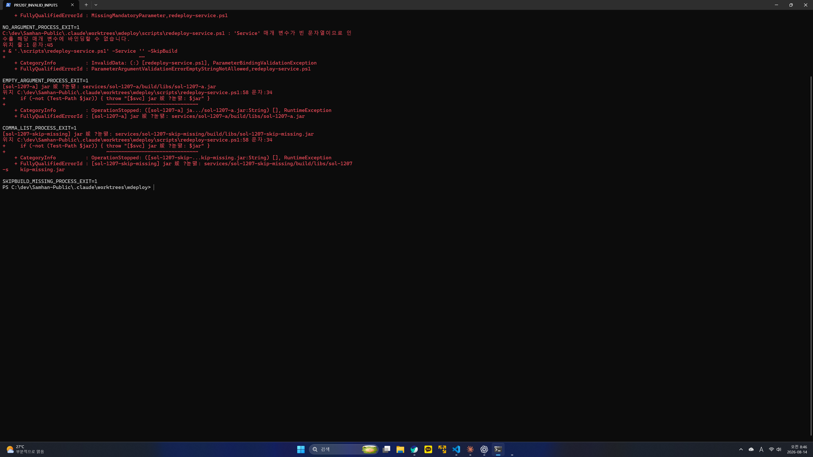
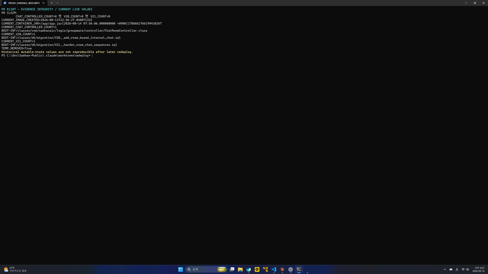
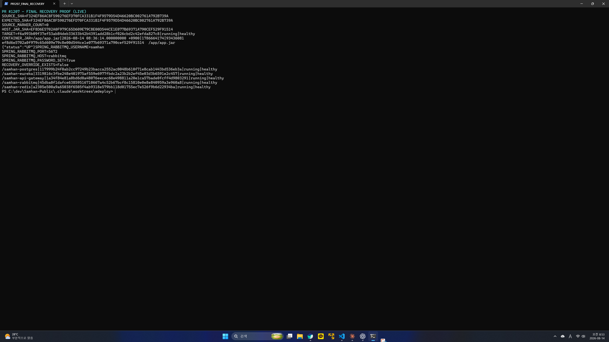

# PR #1207 1차 적대검증 보고서 (SOL)

- 검증 일시: 2026-08-14 08:24~08:53 KST
- 대상: `chore/redeploy-service-script`
- worktree HEAD: `69df1b9778b8c89780db41c55c0d477eff9341a7`
- PR head: `69df1b9778b8c89780db41c55c0d477eff9341a7`
- 판정: **도달 가능한 결함 2건. 머지 차단.**
- 안전 대상: 금지 서비스와 채팅 계열을 피한 `dc-config-service` 1개
- 공유 의존성: `postgres`, `eureka`, `api-gateway`, `rabbitmq`, `redis`는 재생성하지 않음
- git 명령: 사용하지 않음

## 1. 환경 실측 원문

### 1.1 브랜치/HEAD와 RAM

`.git` 메타 파일을 직접 읽어 확인했다.

```text
HEAD_FILE=ref: refs/heads/chore/redeploy-service-script
HEAD_SHA=69df1b9778b8c89780db41c55c0d477eff9341a7

최초 중단선 확인:
FREE_RAM_BYTES=18745380864
FREE_RAM_GIB=17.458
TOTAL_RAM_GIB=61.613

최종 실측(2026-08-14 08:52:03.064 +09:00):
FREE_RAM_BYTES=16062328832
FREE_RAM_GIB=14.959
TOTAL_RAM_GIB=61.613
```

1GB 중단선 아래로 내려간 적은 없다.

### 1.2 컨테이너 존재/부재

compose의 실제 `container_name` 기준이다.

```text
EXPECTED_COUNT=24|ACTUAL_SAMHAN_COUNT=23
MISSING_COUNT=2
MISSING|nginx|samhan-nginx
MISSING|prometheus|samhan-prometheus
EXTRA_COUNT=1
EXTRA|samhan-logging-service
```

### 1.3 각 컨테이너 image 생성 시각과 내부 jar 나이

측정 기준 시각은 `2026-08-14 08:52:03.064 +09:00`이다. jar는 `docker inspect .Created`가 아니라 각 컨테이너에서 `stat /app/app.jar`를 직접 실행했다. 비-Java 컨테이너는 `NO_APP_JAR`이다.

```text
samhan-accounting-service|status=Up 14 hours (healthy)|image_created=2026-08-11T04:31:45.373083397Z|jar_age_hours=67.341|jar=/app/app.jar|2026-08-11 13:31:37.000000000 +0900|1786422697|109581888
samhan-api-gateway|status=Up 14 hours (healthy)|image_created=2026-08-12T15:39:14.976509948Z|jar_age_hours=32.218|jar=/app/app.jar|2026-08-13 00:38:59.000000000 +0900|1786549139|58577908
samhan-arologis-service|status=Up 14 hours (healthy)|image_created=2026-08-10T23:44:31.892398811Z|jar_age_hours=72.131|jar=/app/app.jar|2026-08-11 08:44:12.000000000 +0900|1786405452|281241355
samhan-auth-service|status=Up 55 minutes (healthy)|image_created=2026-08-13T22:56:26.623644421Z|jar_age_hours=0.932|jar=/app/app.jar|2026-08-14 07:56:06.000000000 +0900|1786661766|88069798
samhan-dashboard-service|status=Up 17 minutes (healthy)|image_created=2026-08-13T23:34:31.794542289Z|jar_age_hours=0.299|jar=/app/app.jar|2026-08-14 08:34:06.000000000 +0900|1786664046|101572683
samhan-dc-config-service|status=Up About a minute (healthy)|image_created=2026-08-13T23:36:20.635616431Z|jar_age_hours=0.264|jar=/app/app.jar|2026-08-14 08:36:14.000000000 +0900|1786664174|93436081
samhan-elasticsearch|status=Up 14 hours (healthy)|image_created=2024-10-09T22:15:19.235594114Z|jar_age_hours=N/A|jar=NO_APP_JAR
samhan-eureka|status=Up 14 hours (healthy)|image_created=2026-06-22T23:34:32.90865495Z|jar_age_hours=1287.919|jar=/app/app.jar|2026-06-21 16:56:55.000000000 +0900|1782028615|59212156
samhan-grafana|status=Up 14 hours (healthy)|image_created=2024-11-19T20:56:17.713285553Z|jar_age_hours=N/A|jar=NO_APP_JAR
samhan-groupware-service|status=Up 55 minutes (healthy)|image_created=2026-08-13T22:56:27.84807132Z|jar_age_hours=0.932|jar=/app/app.jar|2026-08-14 07:56:06.000000000 +0900|1786661766|99438267
samhan-inventory-service|status=Up 2 minutes (healthy)|image_created=2026-08-13T23:43:23.795877297Z|jar_age_hours=0.149|jar=/app/app.jar|2026-08-14 08:43:08.000000000 +0900|1786664588|114277560
samhan-logging-service|status=Up 17 minutes (healthy)|image_created=2026-08-13T23:34:31.603129969Z|jar_age_hours=0.299|jar=/app/app.jar|2026-08-14 08:34:06.000000000 +0900|1786664046|100999530
samhan-minio|status=Up 14 hours (healthy)|image_created=2025-09-07T18:42:37.017942402Z|jar_age_hours=N/A|jar=NO_APP_JAR
samhan-notification-service|status=Up 14 hours (healthy)|image_created=2026-08-06T13:48:41.956307651Z|jar_age_hours=178.058|jar=/app/app.jar|2026-08-06 22:48:33.000000000 +0900|1786024113|139121441
samhan-partner-auth-service|status=Up 14 hours (healthy)|image_created=2026-07-29T10:47:14.944619172Z|jar_age_hours=373.086|jar=/app/app.jar|2026-07-29 19:46:54.000000000 +0900|1785322014|91055590
samhan-partner-order-service|status=Up 14 hours (healthy)|image_created=2026-08-12T15:01:56.997298731Z|jar_age_hours=32.848|jar=/app/app.jar|2026-08-13 00:01:12.000000000 +0900|1786546872|104602813
samhan-partner-service|status=Up 14 hours (healthy)|image_created=2026-08-10T14:51:10.753125379Z|jar_age_hours=81.026|jar=/app/app.jar|2026-08-10 23:50:31.000000000 +0900|1786373431|114038499
samhan-postgres|status=Up 14 hours (healthy)|image_created=2026-05-14T19:03:47.733148088Z|jar_age_hours=N/A|jar=NO_APP_JAR
samhan-product-service|status=Up 14 hours (healthy)|image_created=2026-08-11T03:51:32.104371682Z|jar_age_hours=68.022|jar=/app/app.jar|2026-08-11 12:50:45.000000000 +0900|1786420245|111282837
samhan-rabbitmq|status=Up 14 hours (healthy)|image_created=2025-12-02T03:08:25.905390672Z|jar_age_hours=N/A|jar=NO_APP_JAR
samhan-redis|status=Up 14 hours (healthy)|image_created=2026-05-07T17:34:49.043581139Z|jar_age_hours=N/A|jar=NO_APP_JAR
samhan-slip-service|status=Up 14 hours (healthy)|image_created=2026-08-12T17:52:59.907441518Z|jar_age_hours=29.992|jar=/app/app.jar|2026-08-13 02:52:33.000000000 +0900|1786557153|124826330
samhan-user-service|status=Up 17 minutes (healthy)|image_created=2026-08-13T23:34:30.807127045Z|jar_age_hours=0.299|jar=/app/app.jar|2026-08-14 08:34:06.000000000 +0900|1786664046|93513430
```



## 2. 주장 ①~④ 검증

### 2.1 주장 ① — bootJar → compose up → 검증

#### compose-only 대조

1. 변경 전 스크립트의 `bootJar` 단계로 baseline jar를 생성했다.
2. `DcConfigServiceApplication.main()`에 다음 한 줄만 임시 삽입했다.

   ```java
   System.out.println("SOL_1207_REDEPLOY_MARKER_20260814");
   ```

3. jar는 다시 만들지 않고 올바른 수동 명령 `docker compose ... up -d --build --no-deps dc-config-service`만 실행했다.
4. 결과:

   ```text
   SOURCE_MARKER_COUNT=1
   COMPOSE_ONLY_EXIT=0
   CONTAINER_LOG_MARKER_COUNT=0
   HOST_JAR_SHA256=6AF6C067B105C93F37FD3C21877C567ED739FEE67BAFECDB42D62DF0C9AFE634
   CONTAINER_JAR_SHA256=6af6c067b105c93f37fd3c21877c567ed739fee67bafecdb42d62df0c9afe634
   CONTAINER_JAR_MTIME=2026-08-14 08:30:38 +0900
   ```

따라서 `docker compose --build`가 Gradle을 돌리지 않고 기존 jar를 복사한다는 핵심 전제는 **재현 성공**했다.

#### 스크립트 직접 실행

임시 코드가 있는 상태에서 스크립트를 외부 비대화식 PowerShell 프로세스로 직접 실행했다.

```text
[dc-config-service] Gradle bootJar ...
[dc-config-service] jar 2026-08-14 08:33:05
[dc-config-service] compose up --build --no-deps ...
unknown shorthand flag: 'f' in -f
DOCKER_LASTEXITCODE=125
CHANGED_SCRIPT_PROCESS_EXIT=1
```

스크립트가 만든 host jar는 새 SHA였지만 컨테이너는 이전 SHA에 머물렀다.

```text
HOST_JAR_MTIME=2026-08-14 08:33:05.210 +09:00
HOST_JAR_AGE_MIN=0.3
HOST_JAR_SIZE=93436199
HOST_JAR_SHA256=2D87039077C3369F724E9B75FE20139BD64188DC9285F4963B75566D98404373

CONTAINER_JAR_MTIME=2026-08-14 08:30:38 +0900
CONTAINER_JAR_SIZE=93436081
CONTAINER_JAR_SHA256=6af6c067b105c93f37fd3c21877c567ed739fee67bafecdb42d62df0c9afe634
CONTAINER_LOG_MARKER_COUNT=0
```

원인 행은 다음과 같다.

```powershell
& docker @composeArgs up -d --build --no-deps $svc
```

`docker compose @composeArgs ...`가 아니라 `docker @composeArgs ...`여서 모든 `-f`가 최상위 Docker CLI에 전달된다.

대조 통제로 올바른 수동 compose 명령을 실행하자 내부 jar SHA가 `2d8703...`으로 바뀌고 컨테이너 로그에 마커가 정확히 1회 나타났다. 따라서 Gradle 산출물과 Dockerfile은 정상이며 스크립트 호출만 실패한다.



**결과: 주장 ① 실패. 도달 가능한 결함 D1.**

### 2.2 주장 ② — 출력 jar 나이와 실제 jar/컨테이너 내부 jar 대조

- 스크립트가 출력한 host jar 시각 `08:33:05`는 실제 host jar `08:33:05.210`, 측정 나이 `0.3분`과 일치했다.
- 그러나 compose 호출 실패 때문에 마지막 배포 확인 블록은 도달하지 못했다.
- 실패 직후 컨테이너 내부 jar는 `08:30:38`, host jar는 `08:33:05`로 서로 달랐다. 이는 `.Created`가 아니라 내부 `stat`과 SHA로 확인했다.
- 수동 보정 명령 후에는 host/컨테이너 jar 시각·크기·SHA가 일치했다.

**결과: host jar 나이 계산은 일치. 스크립트의 배포 후 검증은 D1 때문에 관측 불가.**

### 2.3 주장 ③ — `--no-deps` 제거 시 공유 스택 재생성/정지

실제 `--no-deps` 제거 실행은 공유 라이브QA 보호 규율에 따라 하지 않았다. 정적 compose 그래프는 다음과 같다.

```text
api-gateway|condition=service_healthy|required=True
eureka-server|condition=service_healthy|required=True
postgres|condition=service_healthy|required=True
rabbitmq|condition=service_healthy|required=True
redis|condition=service_healthy|required=True
```

스크립트 인자에는 `--no-deps`가 존재한다. 그러나 이를 빼면 실제로 재생성되어 스택이 `Created`에서 멈춘다는 동적 결과는 의도적으로 실행하지 않았다.



**결과: 의존 그래프와 인자는 확인. “실제 정지”는 관측 불가.**

### 2.4 주장 ④ — portfix 오버레이 부재 조건

검증 PC에는 처음부터 해당 파일이 없었다. 파일을 지우거나 이름을 바꾸지 않았다.

```text
PORTFIX_ACTUAL_EXISTS=False
DOCKER_ARGS=-f|infrastructure/docker-compose.yml|-f|infrastructure/docker-compose.local-all.yml|up|-d|--build|--no-deps|dc-config-service
DOCKER_LASTEXITCODE=125
```

조건부 파일 선택은 올바르게 두 기본 compose 파일만 골랐다. 그러나 D1 때문에 회사PC 조건에서도 스크립트 전체는 실패한다.

**결과: 오버레이 조건 분기는 확인. “파일이 없어도 스크립트가 동작” 주장은 실패.**

## 3. 잘못된 입력과 종료 코드

각 케이스는 별도 `powershell.exe -NonInteractive` 프로세스로 실행하고, 프로세스 직후 `$LASTEXITCODE`를 저장했다. 파이프 뒤 상태는 사용하지 않았다.

```text
빈 인자: MissingMandatoryParameter / process exit 1
빈 문자열: ParameterArgumentValidationErrorEmptyStringNotAllowed / process exit 1
없는 서비스: Gradle project not found / process exit 1
쉼표 목록 sol-1207-a,sol-1207-b -SkipBuild: 첫 서비스 jar 없음 / process exit 1
-SkipBuild + 없는 jar: jar 없음 / process exit 1
배포 실패: Docker exit 125 / script process exit 1
```

조용히 성공한 케이스는 없다.



## 4. 증거 무결성 — PR 본문 실측값 정정

PR 본문의 과거 값:

```text
groupware image created 2026-08-13T13:10Z
jar 2026-07-23T19:12
CHAT_CONTROLLER_COUNT=0 · V20_COUNT=0 · V21_COUNT=0
```

현재 라이브 실측값:

```text
CURRENT_IMAGE_CREATED=2026-08-13T22:56:27.84807132Z
CURRENT_CONTAINER_JAR=/app/app.jar|2026-08-14 07:56:06.000000000 +0900|1786661766|99438267
CURRENT_CHAT_CONTROLLER_COUNT=1
BOOT-INF/classes/com/samhanair/logis/groupware/controller/ChatRoomController.class
CURRENT_V20_COUNT=1
BOOT-INF/classes/db/migration/V20__add_room_based_internal_chat.sql
CURRENT_V21_COUNT=1
BOOT-INF/classes/db/migration/V21__harden_room_chat_sequences.sql
```

현재값은 PR 본문과 다르다. 후속 재배포로 mutable stack이 바뀌었으므로 과거 값 자체의 진위는 현재 스택에서 재현할 수 없다. PR의 “현재 실측” 증거로 사용하려면 위 현재값으로 정정해야 한다.



## 5. 도달 가능한 결함 목록

### D1 — 재배포 스크립트가 모든 정상 서비스에서 Docker 단계에 실패 (머지 차단)

- 재현 명령: `.\scripts\redeploy-service.ps1 dc-config-service` 및 `-SkipBuild`
- 실제 원문: `unknown shorthand flag: 'f' in -f`
- Docker 종료 코드: `125`
- PowerShell 프로세스 종료 코드: `1`
- 사용자 영향: bootJar까지는 성공하지만 컨테이너가 재배포되지 않는다. 이 PR의 유일한 목적을 수행하지 못한다.
- 원인: `docker compose` 중 `compose` 누락.

### D2 — Windows PowerShell 5.1에서 스크립트 자체 한국어가 깨짐

```text
PS_VERSION=5.1.26100.9168
FIRST_BYTES=3C-23-0A-2E-53-59-4E-4F
UTF8_BOM=False
STRICT_UTF8_DECODE=True
DEFAULT_GET_CONTENT_LINE55=... bootJar ?ㅽ뙣 ...
UTF8_DECODED_LINE55=... bootJar 실패 ...
```

PowerShell 자체가 내는 한국어 바인딩 오류는 정상 표시되지만, UTF-8 BOM 없는 스크립트 리터럴은 `?ㅽ뙣`, `jar 炭 ...`처럼 깨졌다. 이 저장소의 실제 기본 Windows PowerShell 5.1 사용자 경로에서 재현되는 표시 결함이다.

## 6. 관측 불가 항목과 실패 원문

1. `--no-deps` 제거 시 공유 스택이 실제 재생성/정지하는지: 공유 라이브QA 보호 때문에 실행하지 않음. 정적 그래프만 확인.
2. 스크립트의 배포 후 검증 블록: D1로 루프 안에서 종료되어 도달 불가.
3. PR 본문의 2026-08-13 groupware 과거 실측값: 후속 재배포로 현재 상태가 달라져 현재 스택에서는 역사값 재현 불가.
4. 최초 `dc-config-service` image의 byte-for-byte 원복: 최초 image SHA `827739d049ae...`가 Docker image store에서는 이미 사라지고 BuildKit cache record만 남아 정확한 image 복원 불가.

핵심 실패 원문:

```text
[dc-config-service] compose up --build --no-deps ...
unknown shorthand flag: 'f' in -f

Usage:  docker [OPTIONS] COMMAND [ARG...]

[dc-config-service] compose up 실패 (exit 125)
CHANGED_SCRIPT_PROCESS_EXIT=1
```

## 7. 스크린샷 SHA-256

모두 Windows Snipping Tool이 최대화된 실제 PowerShell 터미널을 직접 캡처한 PNG다. `System.Drawing` 또는 합성 PNG를 사용하지 않았다.

```text
01-environment-real-terminal.png|3B8D8B418A9472491CC92F939768A932E7AF10B20ECD69BDAC11BA6566ABF1BD
02-script-failure-real-terminal.png|3D0B339E6D77C6CD3434A247351F2D2081F2A4A928EB375E1F86781CC98276ED
03-restore-proof-real-terminal.png|A02C1CAB730B8AD6206410509F3D139328956D012AAA4C801D0F71C1FAB01937
04-invalid-inputs-real-terminal.png|A6569E8718CA204488946AFBFA574568F4847351D9C2113A3986F5D028DFB3C7
05-evidence-integrity-real-terminal.png|F4E2278F6423243BCFE6B711F35EC90D8B765BF5E253976C03447E463B465584
06-dependency-graph-real-terminal.png|4B009F8DBCDA3B4A0CC7BD5A8B31B1250E7B58C6E95A20E3E93D5879FC9689E2
SCREENSHOT_COUNT=6
DUPLICATE_HASH_GROUPS=0
```



## 8. 스택에 만든·바꾼 것과 원복 증명

### 실험 중 만든 변경

- `dc-config-service` source에 마커 출력 한 줄 삽입 후 제거.
- `dc-config-service`만 여러 차례 `--no-deps`로 재생성.
- Gradle jar 및 Docker image/layer 생성.
- groupware jar는 읽기 전용 `docker cp` 후 임시 파일 삭제.
- portfix 파일은 처음부터 없었고 만들거나 지우지 않음.
- 공유 의존성은 재생성하지 않음.

### source 원복

```text
실험 전 SOURCE_SHA=F324EF86AC8F590276EFD70FCA331B1F4F9579D54D46620BC002761A792B739A
최종 SOURCE_SHA=F324EF86AC8F590276EFD70FCA331B1F4F9579D54D46620BC002761A792B739A
SOURCE_MARKER_COUNT=0
RECOVERY_OVERRIDE_EXISTS=False
```

### 공유 의존성 불변

최초와 최종 ID가 동일하다.

```text
samhan-postgres|117999b24f0ab2cc97249b23bacca2552ac0048b610f71e8cab1443bd536eb3a
samhan-eureka|3319816c3fbe248e401975af559e6977fbdc2a23b2b2ef45e03d3b6591e2c457
samhan-api-gateway|1a34f84e81a0bd6d0a48076eecec68e498811a20e1ca57bade0fcff4d9803291
samhan-rabbitmq|45dba0f1dafce63859516710667a4c52b67bcf8c15810e0e8e840959a3e960a8
samhan-redis|a2305e500a9a65038f6505f4ab9318e579bb118d01755ec7e526f9b6d22934ba
```

### 대상 서비스 최종 상태와 정확 원복 한계

새 원본 jar는 최초 낡은 image와 달라 Rabbit health가 `localhost:5672`로 연결하면서 일시적으로 unhealthy가 됐다. 최초 image SHA는 image store에서 이미 사라져 byte-for-byte 복원이 불가능했다. 대상 컨테이너 하나에만 `SPRING_RABBITMQ_*` 매핑을 적용해 기능 상태를 회복했고 임시 override 파일은 제거했다. 비밀번호 값은 보고서와 캡처에서 마스킹했다.

```text
TARGET=f6a993b09f37ef53ab84deb33633b42b4391add28b1cf026cbd2c42efda827c8
TARGET_STATE=running|healthy
ACTUATOR={"status":"UP"}
SPRING_RABBITMQ_HOST=rabbitmq
SPRING_RABBITMQ_PORT=5672
SPRING_RABBITMQ_USERNAME=samhan
SPRING_RABBITMQ_PASSWORD_SET=True
RECOVERY_OVERRIDE_EXISTS=False
```

따라서 **source와 공유 의존성은 원복됐고 대상은 healthy로 기능 복구됐지만, 최초 낡은 image와 byte-for-byte 동일한 컨테이너 상태는 아니다.** 이 차이를 숨기지 않는다.

## 9. 최종 판정

- 도달 가능한 결함: **2건**
- 조용한 성공: **0건**
- 핵심 재배포 성공 경로: **0회 — D1로 도달 불가**
- compose-only가 낡은 jar를 재사용한다는 전제: **실측 재현 성공**
- 머지 판정: **차단**

