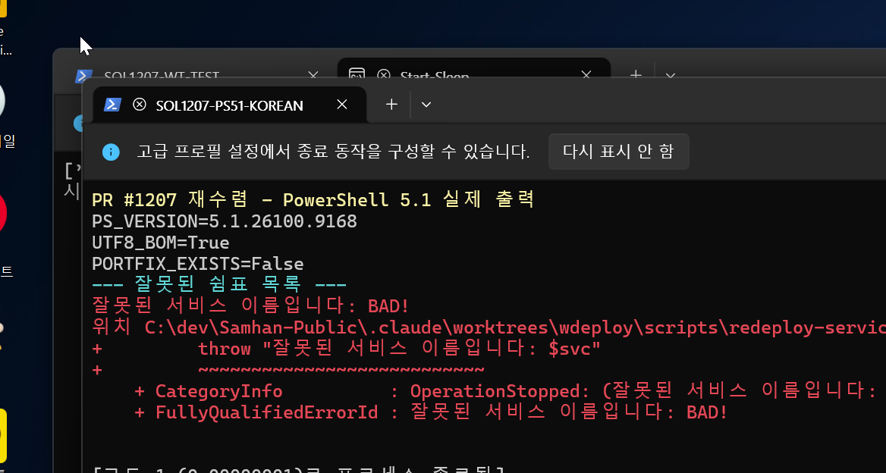
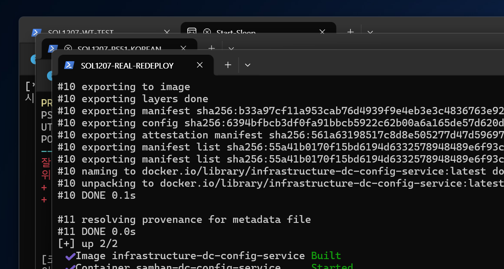
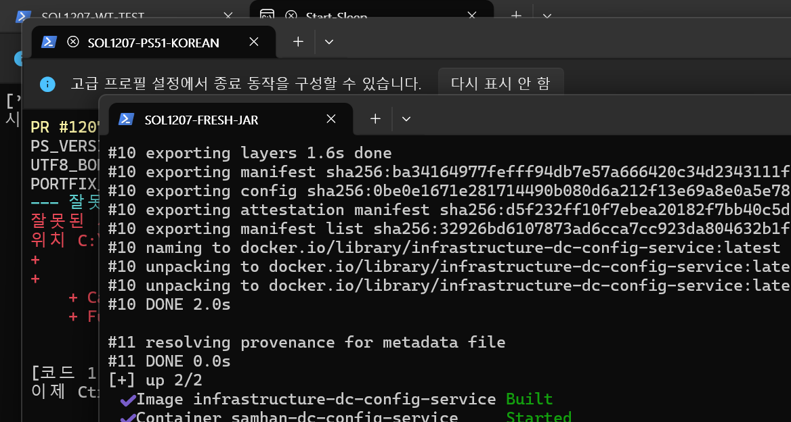
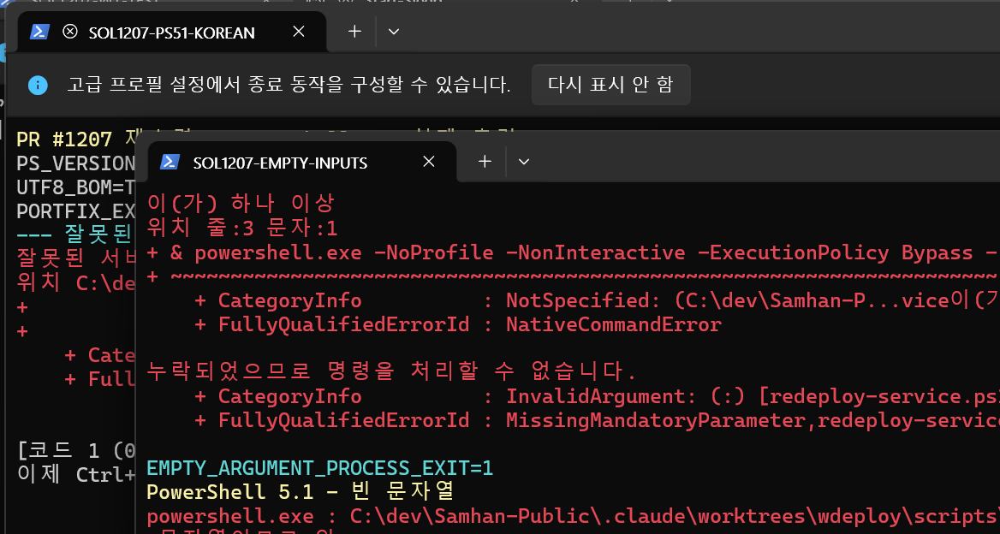
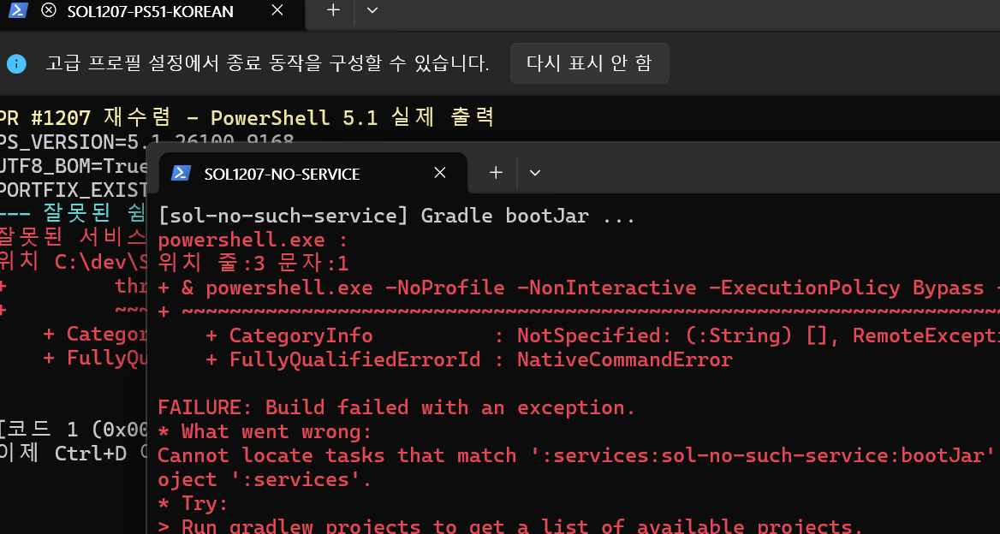
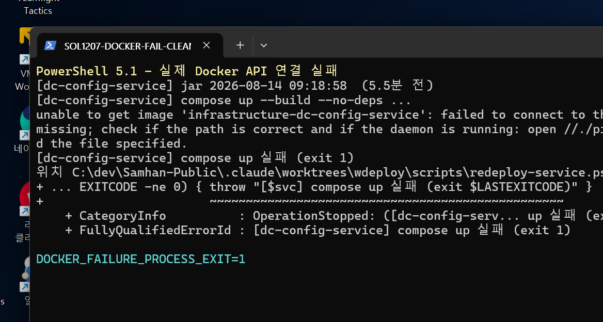
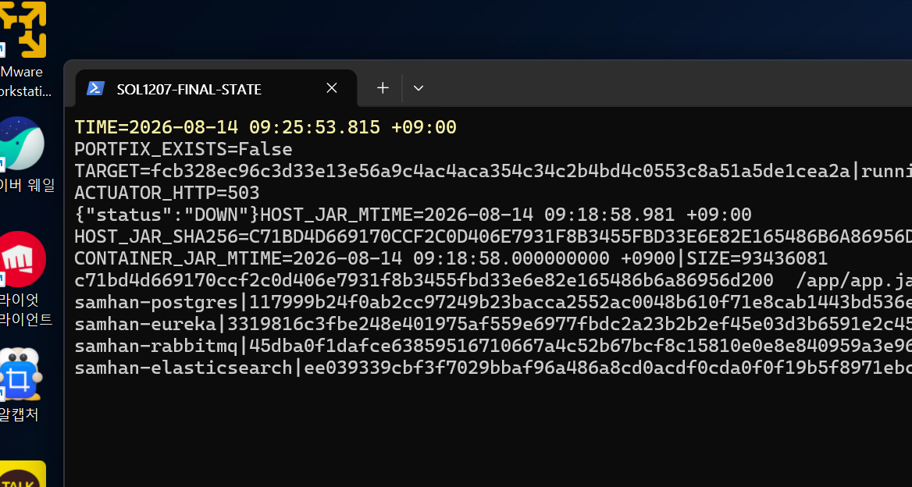
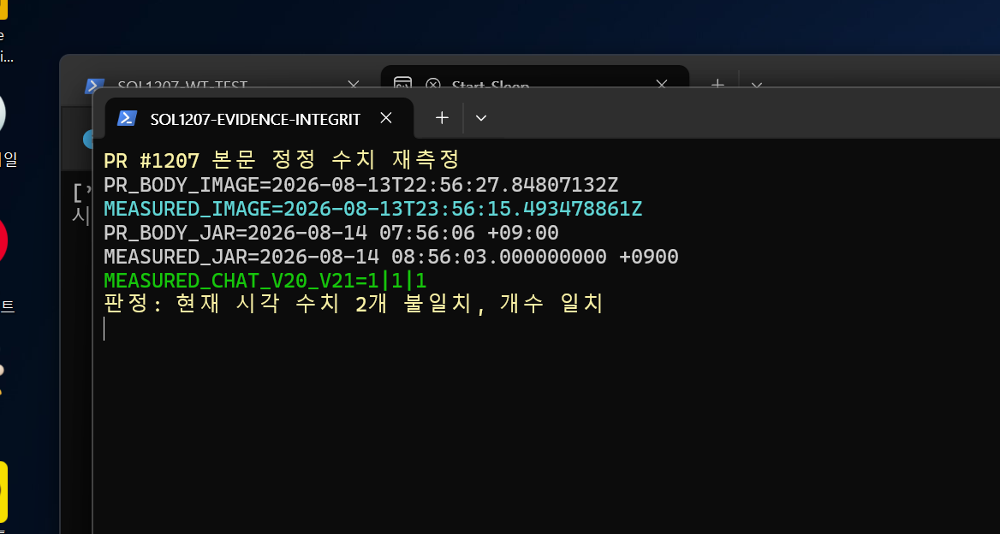
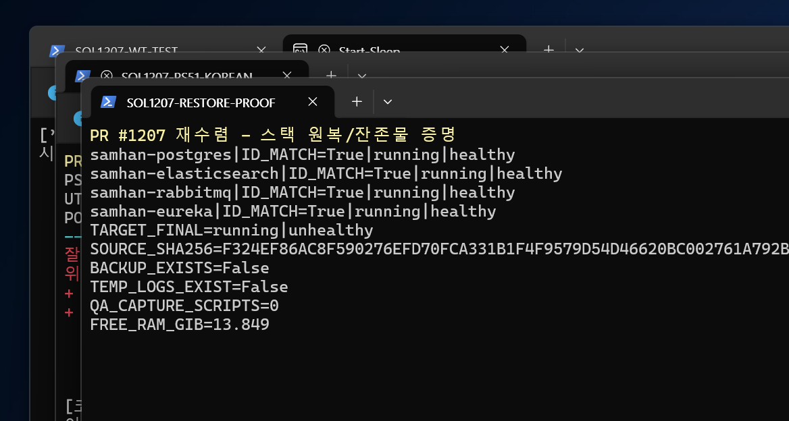

# PR #1207 재수렴 적대검증 보고서 (SOL)

- 검증 시각: 2026-08-14 09:12~09:27 KST
- 대상 브랜치: `chore/redeploy-service-script`
- worktree HEAD: `11c32af57f9b983c114a3b4c5f9f2169e87df77c`
- PR head: `11c32af57f9b983c114a3b4c5f9f2169e87df77c`
- git 명령: 사용하지 않음
- 최종 판정: **도달 가능한 결함 1건. D1(docker compose 호출)과 D2(PowerShell 5.1 한글)는 고쳐졌지만, 정상 사용자 경로가 프로세스 exit 0을 반환한 뒤 대상 서비스가 `unhealthy`로 수렴한다.**
- 증거 무결성: PR 본문의 “현재 재측정값” 중 groupware image 시각과 jar 시각은 현재 실측과 다르다. 개수 3종은 일치한다.

실캡처는 실행 중인 Windows Terminal 창의 실제 화면 픽셀을 캡처했다. 텍스트를 그림으로 다시 그리거나 mock/synthetic PNG를 만들지 않았고, 캡처용 스크립트 파일도 남기지 않았다.

## 1. 환경 실측 원문

PR 본문, 일반 코멘트, review, inline review를 `gh pr view`와 GitHub API로 먼저 전부 읽었다. review와 inline review는 0건, 일반 코멘트는 1건이었다.

```text
TIME=2026-08-14 09:12:47.130 +09:00
PS_VERSION=5.1.26100.9168
HEAD_FILE=ref: refs/heads/chore/redeploy-service-script
HEAD_SHA=11c32af57f9b983c114a3b4c5f9f2169e87df77c

FREE_RAM_BYTES=14282502144
FREE_RAM_GIB=13.302
TOTAL_RAM_GIB=61.613

FIRST_BYTES=EF-BB-BF-3C-23-0A-2E-53
UTF8_BOM=True
PORTFIX_EXISTS=False
```

RAM은 중단선 1.0 GiB보다 충분했다. 실제 재배포 직전에도 11.999 GiB였다.

공유 인프라와 대상 기준선:

```text
samhan-postgres|117999b24f0ab2cc97249b23bacca2552ac0048b610f71e8cab1443bd536eb3a|running|healthy
samhan-eureka|3319816c3fbe248e401975af559e6977fbdc2a23b2b2ef45e03d3b6591e2c457|running|healthy
samhan-rabbitmq|45dba0f1dafce63859516710667a4c52b67bcf8c15810e0e8e840959a3e960a8|running|healthy
samhan-elasticsearch|ee039339cbf3f7029bbaf96a486a8cd0acdf0cda0f0f19b5f8971ebc7da07af4|running|healthy

TARGET_ID=18f0531c5fd4008542233ebbf7412a28a259c08c222950f55d240c607c44a876
TARGET_CREATED=2026-08-14T00:07:31.9013968Z
TARGET_STATE=running|starting
TARGET_JAR=/app/app.jar|2026-08-14 08:36:14.000000000 +0900|93436081
```



## 2. 필수 검증 1 — PowerShell 5.1 한글 출력

`powershell.exe` 5.1에서 스크립트를 직접 실행했다. BOM만 읽지 않고 화면의 실제 문자를 확인했다.

```text
PS_VERSION=5.1.26100.9168
UTF8_BOM=True
잘못된 서비스 이름입니다: BAD!
[sol-missing-jar] jar 가 없다: services/sol-missing-jar/build/libs/sol-missing-jar.jar
```

`서비스`, `잘못된 서비스 이름입니다`, `jar 가 없다`, `배포본 확인`이 깨지지 않고 보였다. **D2 재현 안 됨, fix 확인.**

## 3. 필수 검증 2 — 실제 재배포와 컨테이너 내부 jar

다른 트랙 금지 서비스가 아닌 `dc-config-service`만 선택했다.

### 3.1 정상 사용자 경로

```powershell
powershell.exe -NoProfile -NonInteractive -ExecutionPolicy Bypass -File .\scripts\redeploy-service.ps1 dc-config-service
```

첫 실행 원문:

```text
[dc-config-service] Gradle bootJar ...
[dc-config-service] jar 2026-08-14 08:36:14  (40.2분 전)
[dc-config-service] compose up --build --no-deps ...
Container samhan-dc-config-service Recreated
Container samhan-dc-config-service Started
REDEPLOY_PROCESS_EXIT=0
```

따라서 D1의 `unknown shorthand flag: 'f' in -f`는 재현되지 않았고 `docker compose`가 실제로 끝까지 호출됐다.



### 3.2 신선한 jar 반영

첫 실행은 Gradle up-to-date로 jar 시각이 그대로였다. 코드 내용은 바꾸지 않고 기존 생성물 jar를 명시적 임시 경로로 이동해 출력 부재를 만든 뒤 같은 사용자 경로를 다시 실행했다. 실패 시 원 jar를 복구하도록 했으며, 성공 후 백업은 제거했다.

```text
PRE_JAR_EXISTS=False
HOST_JAR=2026-08-14 09:18:58.981 +09:00
HOST_JAR_SIZE=93436081
HOST_JAR_SHA256=C71BD4D669170CCF2C0D406E7931F8B3455FBD33E6E82E165486B6A86956D200

CONTAINER_JAR=/app/app.jar
CONTAINER_JAR_MTIME=2026-08-14 09:18:58.000000000 +0900
CONTAINER_JAR_SIZE=93436081
CONTAINER_JAR_SHA256=c71bd4d669170ccf2c0d406e7931f8b3455fbd33e6e82e165486b6a86956d200
BACKUP_REMOVED=True
```

host/container jar의 시각, 크기, SHA-256이 일치한다. 컨테이너 `.Created`가 아니라 내부 `/app/app.jar`를 직접 `stat`하고 해시했다.



## 4. 필수 검증 3 — 잘못된 입력 6종

각 케이스를 별도 PowerShell 5.1 프로세스로 실행하고, 파이프나 후속 명령 전에 프로세스 종료 코드를 저장했다.

| 케이스 | 사용자가 본 핵심 원문 | 프로세스 exit |
|---|---|---:|
| 빈 인자 | `Cannot process command ... missing mandatory parameters: Service` / `MissingMandatoryParameter` | 1 |
| 빈 문자열 | `Cannot bind argument ... because it is an empty string` / `ParameterArgumentValidationErrorEmptyStringNotAllowed` | 1 |
| 없는 서비스 | `Cannot locate tasks ... project 'sol-no-such-service' not found` + `[sol-no-such-service] bootJar 실패 (exit 1)` | 1 |
| 쉼표 목록 중 오류 | `잘못된 서비스 이름입니다: BAD!` | 1 |
| `-SkipBuild`인데 jar 없음 | `[sol-missing-jar] jar 가 없다: ...` | 1 |
| Docker 실패 | 존재하지 않는 named pipe로 실제 Docker API 연결 실패 + `[dc-config-service] compose up 실패 (exit 1)` | 1 |

Docker 실패 실험은 `DOCKER_HOST=npipe:////./pipe/sol1207-missing`을 해당 자식 프로세스에만 주어 만들었다. 실제 스택에는 요청이 도달하지 않았다.







**잘못된 입력 6종은 전부 오류를 보여 주고 exit 1이었다. 조용한 성공 0건.**

## 5. 필수 검증 4 — 의존 서비스 비재생성

실제 재배포 전후 공유 컨테이너 ID:

```text
postgres       117999b24f0ab2cc97249b23bacca2552ac0048b610f71e8cab1443bd536eb3a -> 동일
eureka         3319816c3fbe248e401975af559e6977fbdc2a23b2b2ef45e03d3b6591e2c457 -> 동일
rabbitmq       45dba0f1dafce63859516710667a4c52b67bcf8c15810e0e8e840959a3e960a8 -> 동일
elasticsearch  ee039339cbf3f7029bbaf96a486a8cd0acdf0cda0f0f19b5f8971ebc7da07af4 -> 동일
```

최종 상태도 네 컨테이너 모두 `running|healthy`다. 중지·재시작·재생성 실험은 하지 않았다. **`--no-deps` 실제 동작 확인.**

## 6. 필수 검증 5 — 오버레이 파일 부재 조건

검증 PC는 처음부터 회사PC 조건과 같은 실제 부재 상태였다.

```text
PORTFIX_EXISTS=False
```

파일을 만들거나 삭제하거나 이름을 바꾸지 않았다. 이 상태에서 정상 사용자 경로가 compose 단계까지 진행해 프로세스 exit 0으로 대상만 재생성했다. **조건부 오버레이 동작 확인.**

## 7. 필수 검증 6 — 직전 fix가 남긴 `dc-config-service` 상태

### 7.1 시간순 실측

```text
09:12:47  fix가 남긴 컨테이너 18f053...  running|starting
09:14경    같은 컨테이너가 running|unhealthy로 자연 수렴
09:16:28  본 라운드 첫 재배포 직후       running|starting, process exit 0
09:20:09  actuator HTTP 503 {"status":"DOWN"}
09:26:17  최종                         running|unhealthy, failing streak 25
```

최종 원문:

```text
ID=fcb328ec96c3d33e13e56a9c4ac4aca354c34c2b4bd4c0553c8a51a5de1cea2a
STATE=running
HEALTH=unhealthy
FAILING_STREAK=25
ACTUATOR_HTTP=503
{"status":"DOWN"}
```

로그와 환경의 경계 증거:

```text
Attempting to connect to: [localhost:5672]
Rabbit health check failed
Caused by: java.net.ConnectException: Connection refused

RABBIT_HOST=rabbitmq
RABBIT_PORT=5672
samhan-rabbitmq=running|healthy
```

직전 적대검증 보고서의 최종 healthy 컨테이너는 임시 복구 override로 `SPRING_RABBITMQ_HOST=rabbitmq`를 직접 넣은 상태였다. 그 뒤 override를 제거하고 이 PR의 fix 스크립트를 실행하자 현재 compose 정의의 `RABBIT_HOST`만 가진 컨테이너로 재생성되어 `localhost:5672`를 사용했다.

따라서 **기저 Rabbit 설정 불일치는 이 PR이 새로 만든 것이 아니지만, 이 PR의 정상 사용자 경로가 healthy였던 대상도 해당 불일치 상태로 재생성하고, 실제 서비스가 DOWN인데도 프로세스 exit 0을 반환한다.** 단순한 `starting` 지연이 아니라 재현 가능한 도달 결함이다.



## 8. 필수 검증 7 — PR 본문 수치 대조와 증거 무결성 정정

PR 본문의 정정된 “현재 재측정값”과 09:20 KST 실측:

| 항목 | PR 본문 | 이번 실측 | 판정 |
|---|---|---|---|
| groupware image created | `2026-08-13T22:56:27.84807132Z` | `2026-08-13T23:56:15.493478861Z` | 불일치 |
| container jar | `2026-08-14 07:56:06 +09:00` | `2026-08-14 08:56:03 +09:00` | 불일치 |
| Chat controller count | 1 | 1 | 일치 |
| V20 count | 1 | 1 | 일치 |
| V21 count | 1 | 1 | 일치 |

실측 원문:

```text
CURRENT_IMAGE_CREATED=2026-08-13T23:56:15.493478861Z
CURRENT_CONTAINER_JAR=/app/app.jar|2026-08-14 08:56:03.000000000 +0900|1786665363|99438783
CURRENT_CHAT_CONTROLLER_COUNT=1
CURRENT_V20_COUNT=1
CURRENT_V21_COUNT=1
```

정정: 본문의 두 시각은 더 이상 “현재” 값이 아니다. `2026-08-14 08:56 KST 당시 재측정값`으로 시점을 명시하거나 위 실측으로 갱신해야 원문과 맞는다. 과거 최초값 자체는 mutable image가 교체되어 이번 라운드에서 재현할 수 없다.



## 9. 도달 가능한 결함 목록

### R1 — 재배포 프로세스 exit 0 후 대상 서비스가 `unhealthy`/DOWN으로 수렴

- 사용자 경로: `.\scripts\redeploy-service.ps1 dc-config-service`
- 스크립트 프로세스: exit 0
- 대상: `running|starting` 뒤 `running|unhealthy`, actuator HTTP 503/DOWN
- 직접 원문: `Attempting to connect to: [localhost:5672]`, `Connection refused`
- 공유 RabbitMQ: `running|healthy`
- 재현성: 직전 fix 실행이 남긴 컨테이너와 본 라운드의 두 정상 실행에서 동일
- 사용자 영향: 콘솔상 compose 성공과 프로세스 exit 0을 받은 뒤 실제 서비스는 사용 불가 상태다.
- 귀속: Rabbit 설정 불일치는 기존 compose/application 경계의 선행 결함이다. 다만 이 PR의 스크립트가 그 설정으로 컨테이너를 재생성하고 최종 실패를 성공 exit로 반환하므로 실사용자 경로에서 도달한다.

그 외 도달 결함은 재현되지 않았다. D1과 D2는 재수렴 통과했다.

## 10. 관측 불가와 실패 원문

- 필수 항목 1~7: **관측 불가 0건. 전부 직접 실행했다.**
- 과거 최초 groupware image/jar 수치: 현재 mutable image가 교체되어 과거 원문 자체의 재현은 관측 불가다. 대신 현재값을 직접 재측정해 위와 같이 정정했다.
- source mtime만 갱신한 예비 실험은 Gradle 내용 해시가 같아 bootJar를 재실행시키지 않았다. source mtime과 SHA는 즉시 원래대로 복구했고, 이 결과를 신선한 jar 증거로 쓰지 않았다.
- 잘못된 입력과 Docker 실패의 원문은 §4에 전부 기록했다.

회귀 테스트 주장도 직접 실행했다.

```text
PASS: redeploy service contract
CONTRACT_PROCESS_EXIT=0
```

## 11. 스택 원복 증명

실험 중 만든 임시 상태:

- source 내용 변경 없음. mtime 예비 변경은 원래 시각으로 복구.
- 생성물 jar 임시 백업 1개 생성 후 새 jar와 컨테이너 해시 일치를 확인하고 제거.
- Docker 실패용 환경 변수는 자식 프로세스에만 적용.
- Docker 실패 캡처용 임시 stdout/stderr 파일 제거.
- groupware 검사용 임시 jar 제거.
- 공유 인프라는 조작하지 않음.

최종 원문:

```text
samhan-postgres|ID_MATCH=True|running|healthy
samhan-eureka|ID_MATCH=True|running|healthy
samhan-rabbitmq|ID_MATCH=True|running|healthy
samhan-elasticsearch|ID_MATCH=True|running|healthy
TARGET_FINAL=running|unhealthy
SOURCE_SHA256=F324EF86AC8F590276EFD70FCA331B1F4F9579D54D46620BC002761A792B739A
SOURCE_MTIME=2026-08-14 08:35:48.653 +09:00
BACKUP_EXISTS=False
TEMP_LOGS_EXIST=False
QA_CAPTURE_SCRIPTS=0
```

대상 컨테이너 ID와 jar 시각은 필수 재배포 실험 자체 때문에 바뀌었다. source 내용은 최초 SHA와 일치하고, 새 jar는 같은 source로 재생성됐다. 최종 기능 상태는 이 라운드 시작 시 `starting`이 자연 수렴한 `unhealthy`와 동일하여 본 라운드가 추가로 악화시키지는 않았다.



## 12. 캡처 SHA-256

```text
01-ps51-korean-invalid-real-terminal.png|1A38E90329A832773C24F76BD3ABA1670D7EEE087F2ACE86DF9DB302FC4959E0
02-redeploy-success-real-terminal.png|5CC514AB19BDACDED2030F50AC824D6DFACE91FC82D71C9538A76F7874616464
03-fresh-jar-redeploy-real-terminal.png|E52B7D4823F10EE67AB161AEE87AD564C07BE9D177B373F5F5BEA988E3509EDA
04-empty-inputs-real-terminal.png|7E6955E06790930EF4AFE44EEDDEDEDDF82022BD4E8185166CFA446401A37E6D
05-nonexistent-service-real-terminal.png|36CBFC2B9E53373AB2C49A155D19E4F8B56DB1CEE7445A90593A2E33460ACB8A
06-docker-failure-real-terminal.png|4B944A406A44AA0739F921AF7509AED79416B3F5B746226A6AF97907668BD605
07-final-health-and-ids-real-terminal.png|5836473EE2F2F4ADE15F77F4081B6DEDD84284C8735B79B2E8547C7449DF86D1
08-evidence-integrity-real-terminal.png|6A0ECB7CC9151943C243A55D6A7F66ED7406907C48750A5AF6B1B41D768D3E41
09-stack-restore-proof-real-terminal.png|18C74F68718B4F3DAC058378618E76EAE0AF019E6A8887CCD8200C6F02283FB0
SCREENSHOT_COUNT=9
DUPLICATE_HASH_GROUPS=0
CAPTURE_SCRIPT_COUNT=0
```

## 13. 최종 결론

- D1 docker compose 호출: **수정 확인**
- D2 PowerShell 5.1 한글: **수정 확인**
- 잘못된 입력 6종: **모두 오류 표시 + exit 1**
- 신선한 jar의 컨테이너 반영: **mtime·크기·SHA 일치**
- `--no-deps`: **공유 컨테이너 4개 ID 불변**
- 오버레이 부재: **실제 부재 상태에서 실행 성공**
- 도달 가능한 결함: **1건 — 프로세스 exit 0 뒤 대상 서비스 unhealthy/DOWN**
- 증거 무결성 정정: **현재 시각 2개 불일치, 개수 3개 일치**

**재수렴 판정: 결함 1건으로 머지 차단.**
