# PR #1207 재수렴 적대검증 2차 보고서 (SOL)

- 검증 시각: 2026-08-14 10:15~10:41 KST
- 대상 브랜치: `chore/redeploy-service-script`
- 로컬/PR head: `3f98486b45806518d8204d255eda10be99d8c009`
- git 명령: 사용하지 않음
- 코드 수정: 없음
- 최종 판정: **직접 실행한 실사용자 경로에서 도달 가능한 결함 0건**
- 증거 무결성 정정: **1건** — `75 + 20 × 15 = 375초`는 probe `timeout: 5s`를 제외한 단순값이며 Docker health 실패 시간의 보장 상한이 아니다.
- 관측 불가: 실제 애플리케이션이 자연적으로 420초를 넘겨 기동하는 경우. 대상 서비스를 고의로 지연/파손하지 말라는 규율 때문에 만들지 않았다.

PR 본문, 일반 코멘트 3건, review 목록, inline review 목록을 실행 전에 모두 읽었다. review와 inline review는 0건이었다.

모든 PNG는 실행 중인 Windows Terminal 화면을 OS 화면 복사로 직접 캡처했다. 텍스트를 다시 그린 합성 PNG는 없다. 캡처용 `.ps1` 파일도 만들지 않았다.

## 1. 환경 실측 원문

```text
TIME=2026-08-14 10:16:38.318 +09:00
PS_VERSION=5.1.26100.9168
FREE_RAM_BYTES=10882195456
FREE_RAM_GIB=10.135
TOTAL_RAM_GIB=61.613
HEAD_SHA=3f98486b45806518d8204d255eda10be99d8c009
FIRST_BYTES=EF-BB-BF-3C-23-0A-2E-53
UTF8_BOM=True
PORTFIX_EXISTS=False
```

RAM은 중단선 1.0 GiB보다 충분했다. 이 PC에는 외부 influxd가 있으나 저장소 portfix 오버레이 파일은 현재 없었다. 이를 결함으로 세지 않았다.

공유 인프라 PRE:

```text
/samhan-postgres|117999b24f0ab2cc97249b23bacca2552ac0048b610f71e8cab1443bd536eb3a|running|healthy
/samhan-eureka|3319816c3fbe248e401975af559e6977fbdc2a23b2b2ef45e03d3b6591e2c457|running|healthy
/samhan-rabbitmq|45dba0f1dafce63859516710667a4c52b67bcf8c15810e0e8e840959a3e960a8|running|healthy
/samhan-elasticsearch|ee039339cbf3f7029bbaf96a486a8cd0acdf0cda0f0f19b5f8971ebc7da07af4|running|healthy
```

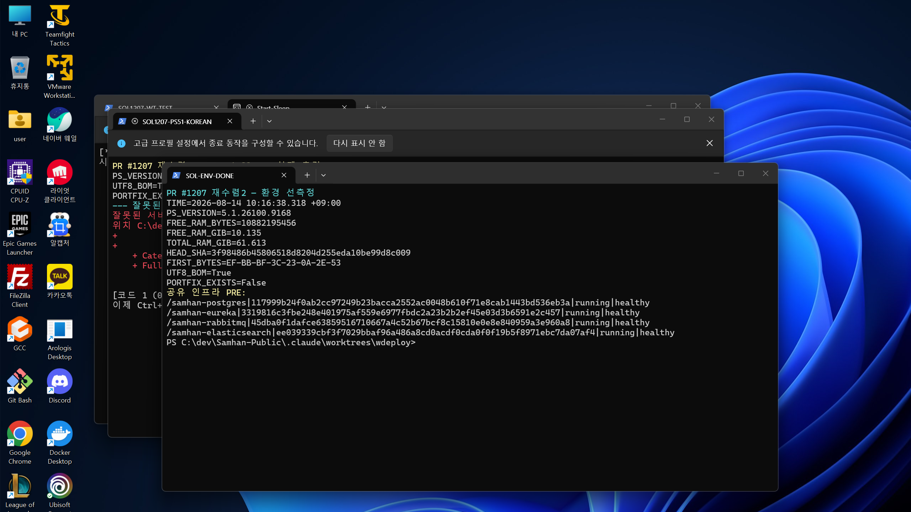

## 2. 항목 1 — 정상 케이스

PowerShell 5.1 별도 프로세스에서 다음 실사용자 경로를 실행했다.

```powershell
powershell.exe -NoProfile -NonInteractive -ExecutionPolicy Bypass -File .\scripts\redeploy-service.ps1 accounting-service
```

원문:

```text
START=2026-08-14 10:17:35.096 +09:00
[accounting-service] Gradle bootJar ...
[accounting-service] jar 2026-08-14 09:43:43  (34.1분 전)
[accounting-service] compose up --build --no-deps ...
Container samhan-accounting-service Recreated
Container samhan-accounting-service Started
[accounting-service] health 대기 시작 (상한 420초)
[accounting-service] readiness health=starting actuator=unavailable
[accounting-service] readiness health=starting actuator=unavailable
[accounting-service] readiness health=healthy actuator=200/UP
배포본 readiness 확인 완료: 모든 대상 서비스가 healthy 및 actuator 200/UP 입니다.
REDEPLOY_PROCESS_EXIT=0
END=2026-08-14 10:18:04.104 +09:00
FINAL_DOCKER=ec000e7f889d77e39f4e91ec78a69add4d78934be34156014ad53a18480d82f1|running|healthy|2026-08-14T01:17:47.6846501Z
ACTUATOR_HTTP=200
ACTUATOR_BODY={"status":"UP"}
```

스크립트는 compose `Started` 직후 끝나지 않고 `healthy + 200/UP`까지 약 15초간 readiness를 반복한 뒤 exit 0을 냈다.

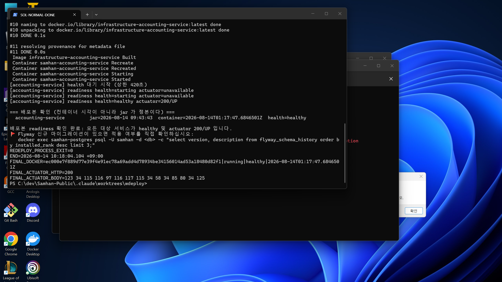

## 3. 항목 2 — 짧은 상한 실패

대상 서비스를 인위적으로 망가뜨리지 않고 상한만 12초로 바꿨다. 동시에 다중 서비스의 앞 실패 동작도 보기 위해 다음을 실행했다.

```powershell
$env:REDEPLOY_HEALTH_TIMEOUT_SECONDS='12'
powershell.exe -NoProfile -NonInteractive -ExecutionPolicy Bypass -File .\scripts\redeploy-service.ps1 'dc-config-service,accounting-service'
```

대기 중 원문:

```text
[dc-config-service] health 대기 시작 (상한 12초)
[dc-config-service] readiness health=starting actuator=unavailable
[dc-config-service] readiness health=starting actuator=503/DOWN
[dc-config-service] readiness health=starting actuator=503/DOWN
```

종료 원문:

```text
[dc-config-service] health 대기 시간 초과 (12초): health=starting, actuator=503/DOWN
REDEPLOY_PROCESS_EXIT=1
POST_DC=29f7070e2efbc6b4863e6c53be1140c06e4dbde677bfb94e1e47f8876d6f709c|running|starting|2026-08-14T01:19:41.672246172Z
POST_ACCOUNTING=ec000e7f889d77e39f4e91ec78a69add4d78934be34156014ad53a18480d82f1|running|healthy|2026-08-14T01:17:47.6846501Z
ACCOUNTING_ID_UNCHANGED=True
```

exit 1과 사용자가 보는 한국어 시간 초과 메시지, 마지막 Docker health와 actuator 값이 모두 나왔다.

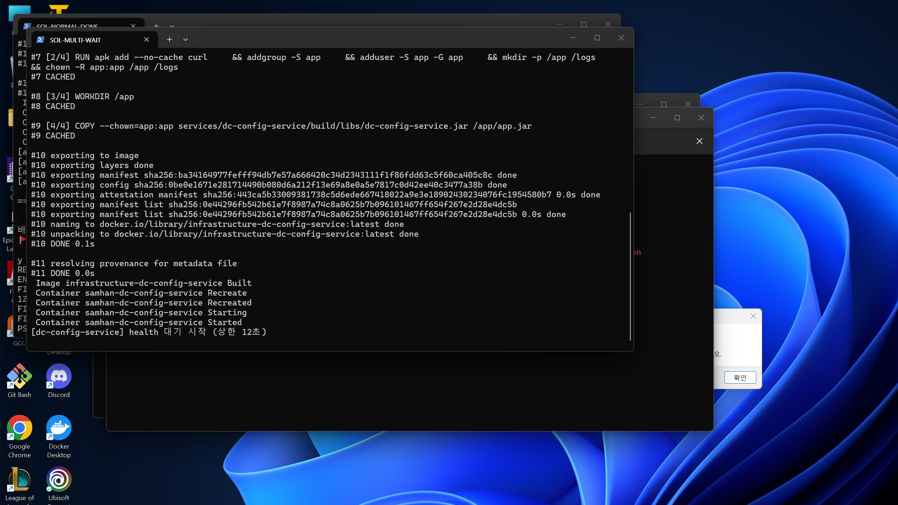

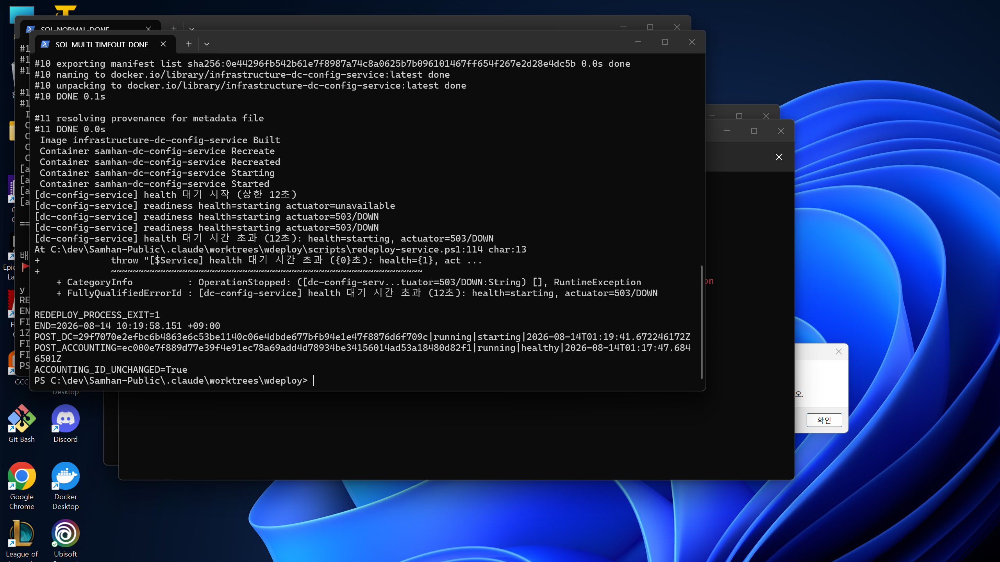

## 4. 항목 3 — 상한 값의 타당성

실제 병합 compose를 `docker compose ... config --format json`으로 읽었다.

### 4.1 compose 값

```text
accounting-service  start_period=75  interval=15  timeout=5  retries=20
arologis-service   start_period=75  interval=15  timeout=5  retries=20
기타 *-service     start_period=60  interval=15  timeout=5  retries=20
api-gateway        start_period=45  interval=15  timeout=5  retries=20
eureka-server      start_period=30  interval=15  timeout=5  retries=20
```

단순 계산은 다음과 같이 맞다.

```text
75 + 20 × 15 = 375
375 + 45 = 420
MAX_SIMPLE=375
SIMPLE_OVER_420_COUNT=0
```

그러나 이를 Docker health 실패 시간의 상한이라고 제시하면 수치가 불완전하다. 각 probe에는 `timeout: 5s`가 있고, timeout으로 끝난 probe 뒤 다음 interval이 진행될 수 있다. 보수적으로 timeout을 포함하면:

```text
accounting/arologis: 75 + 20 × (15 + 5) = 475
기타 *-service:      60 + 20 × (15 + 5) = 460
api-gateway:         45 + 20 × (15 + 5) = 445
eureka-server:       30 + 20 × (15 + 5) = 430
MAX_TIMEOUT_AWARE=475
TIMEOUT_AWARE_OVER_420_COUNT=16
```

Docker 스케줄 의미를 공유 스택과 무관한 임시 Alpine 컨테이너로 축소 재현했다. `start_period=3s, interval=1s, timeout=1s, retries=2`에서 단순 주장은 5초지만 실제 unhealthy 관측은 컨테이너 기동 후 8.433초였다. 임시 컨테이너는 즉시 삭제했다.

```text
TEMP_CONFIG=start_period=3s interval=1s timeout=1s retries=2
CLAIMED_SIMPLE=5s
OBSERVED_UNHEALTHY_FROM_START_SECONDS=8.433
TEMP_EXISTS_AFTER=False
```

따라서 **420초는 현재 정상 기동 실측에는 충분했지만 compose가 허용하는 timeout 소비까지 포함한 실패 스케줄 전체를 덮는다고 보장할 수 없다.** 이 라운드에서 실제 서비스가 자연적으로 420초를 넘기는 경우는 관측되지 않았다. 고의 지연은 대상 서비스를 망가뜨리지 말라는 규율 때문에 만들지 않았다. 이 항목은 도달 결함이 아니라 제시 수치의 증거 무결성 정정으로 분류한다.

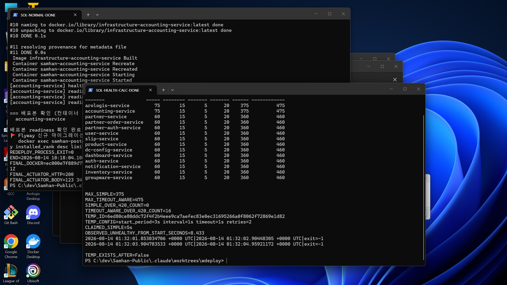

## 5. 항목 4 — 다중 서비스 순서와 실패 전파

스크립트의 실제 동작은 순차 처리다.

### 5.1 앞 서비스가 실패

항목 2에서 `dc-config-service,accounting-service`를 넘겼다. dc가 readiness를 기다리는 동안 accounting은 재생성되지 않았고, dc timeout 뒤 전체 프로세스가 exit 1로 끝나 accounting ID가 그대로였다.

```text
PRE_ACCOUNTING=ec000e7f889d77e39f4e91ec78a69add4d78934be34156014ad53a18480d82f1
POST_ACCOUNTING=ec000e7f889d77e39f4e91ec78a69add4d78934be34156014ad53a18480d82f1|running|healthy|...
ACCOUNTING_ID_UNCHANGED=True
```

### 5.2 앞 서비스가 성공하고 뒤 서비스가 실패

반대 방향도 직접 실행했다.

```powershell
$env:REDEPLOY_HEALTH_TIMEOUT_SECONDS='60'
.\scripts\redeploy-service.ps1 'accounting-service,sol-missing-jar' -SkipBuild
```

원문:

```text
[accounting-service] readiness health=starting actuator=unavailable
[accounting-service] readiness health=starting actuator=200/UP
[accounting-service] readiness health=healthy actuator=200/UP
[sol-missing-jar] jar 가 없다: services/sol-missing-jar/build/libs/sol-missing-jar.jar
REDEPLOY_PROCESS_EXIT=1
POST_ACCOUNTING=b3d45c58db5415479a61ded2c77040288da2327f0722ce033fe10fe5f44c1833|running|healthy|2026-08-14T01:40:36.473457321Z
ACCOUNTING_ID_CHANGED=True
ACCOUNTING_ACTUATOR=200|{"status":"UP"}
```

결론: 앞 서비스 readiness가 끝나야 뒤 서비스를 시작한다. 하나가 실패하면 뒤의 미처리 서비스는 건드리지 않지만, 이미 성공한 앞 서비스는 롤백하지 않는다.

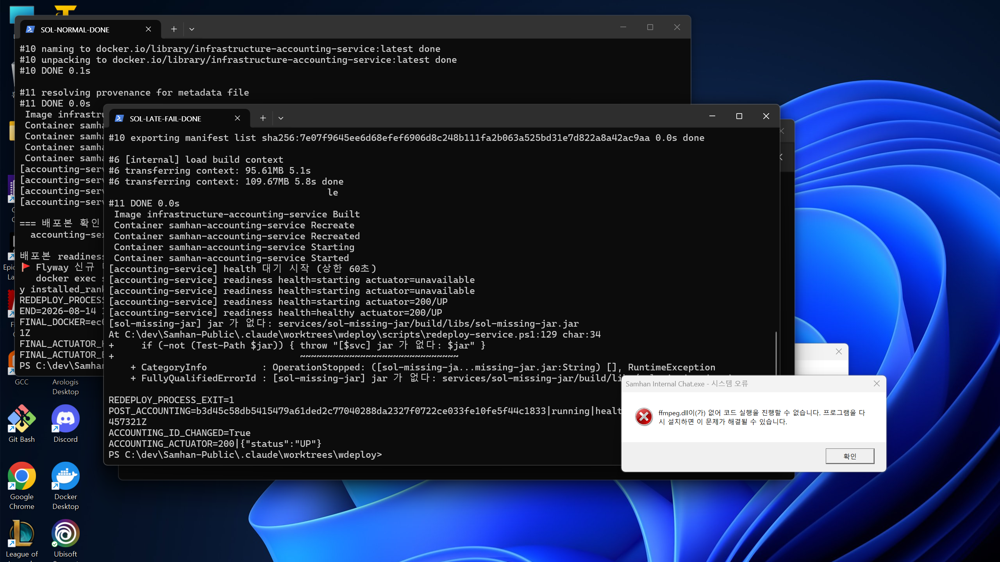

## 6. 항목 5 — 직전 계약 회귀

### 6.1 계약 테스트와 정적 계약

```text
PASS: redeploy service contract
CONTRACT_EXIT=0
FIRST_BYTES=EF-BB-BF-3C-23-0A-2E-53
UTF8_BOM=True
PORTFIX_EXISTS=False
DOCKER_COMPOSE_CALL=True
TOPLEVEL_DOCKER_CALL=False
JAR_TIME_OUTPUT=True
```

- 실제 정상/실패 배포 모두 `Image ... Building`, `Container ... Recreated/Started`까지 갔으므로 `docker -f` D1은 재발하지 않았다.
- 호출 계약은 `docker compose @composeArgs up -d --build --no-deps $svc`와 일치했다.
- portfix 오버레이 파일이 없는 조건에서도 정상 배포했다. 분기 자체는 `if (Test-Path $portfix)`로 유지됐다.
- 정상/다중 실행 모두 jar 시각을 출력했다.
- host/container accounting jar가 시각과 크기에서 일치했다.

```text
HOST_JAR=2026-08-14 09:43:43.204 +09:00|109642674
CONTAINER_JAR=/app/app.jar|2026-08-14 09:43:43.000000000 +0900|109642674
```

### 6.2 잘못된 입력 6종

각 케이스를 stdin이 닫힌 별도 PowerShell 5.1 프로세스로 실행했다.

```text
1_NO_ARGUMENT
필수 매개 변수 Service이(가) 하나 이상 누락되었으므로 명령을 처리할 수 없습니다.
PROCESS_EXIT=1

2_EMPTY_STRING
'Service' 매개 변수가 빈 문자열이므로 인수를 해당 매개 변수에 바인딩할 수 없습니다.
PROCESS_EXIT=1

3_NO_SUCH_SERVICE
Cannot locate tasks that match ':services:sol-no-such-service:bootJar' as project 'sol-no-such-service' not found in project ':services'.
[sol-no-such-service] bootJar 실패 (exit 1)
PROCESS_EXIT=1

4_MALFORMED_LIST
잘못된 서비스 이름입니다: BAD!
PROCESS_EXIT=1

5_SKIPBUILD_MISSING_JAR
[sol-missing-jar] jar 가 없다: services/sol-missing-jar/build/libs/sol-missing-jar.jar
PROCESS_EXIT=1

6_DOCKER_FAILURE
unable to get image 'infrastructure-dc-config-service': failed to connect to the docker API at npipe:////./pipe/sol1207-reconv2-missing; ...
[dc-config-service] compose up 실패 (exit 1)
PROCESS_EXIT=1
```

Docker 실패는 해당 자식 프로세스의 존재하지 않는 named pipe만 사용해 공유 daemon에 배포 요청을 전달하지 않았다.

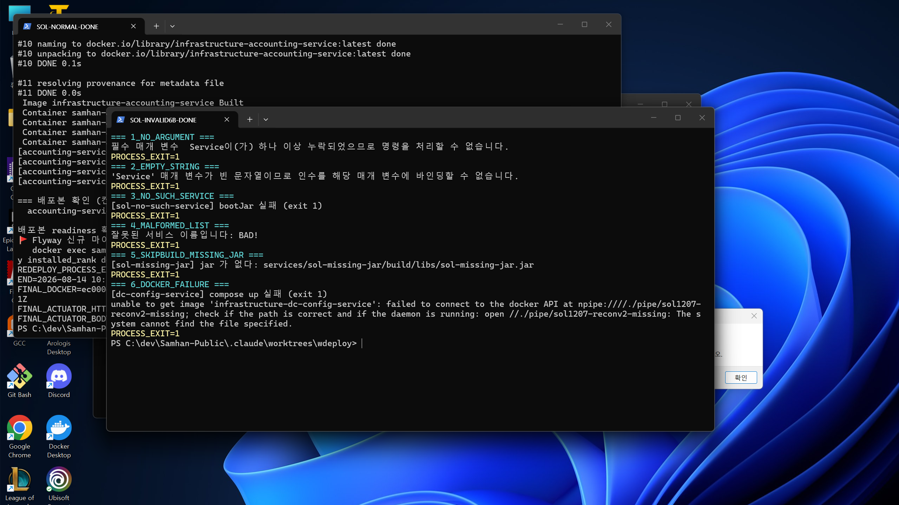

### 6.3 `--no-deps`

실제 재배포 전후 공유 인프라 4개 ID가 모두 동일했다. 최종 원문은 §10에 있다.

### 6.4 포트 리터럴 가드

공식 `scripts/check-local-stack-port-literals.ps1`는 내부에서 다음 git 명령을 호출하므로, “git 명령 일절 금지”와 충돌해 실행하지 않았다.

```powershell
$paths = @(git -C $RepositoryRoot ls-files -- '*.ps1')
```

대신 같은 예외 목록과 같은 정규식으로 `rg --files -g '*.ps1'`가 찾은 모든 PowerShell 파일을 검사했다. tracked 파일보다 넓은 로컬 집합이다.

```text
SCANNED_PS1_COUNT=76
FINDING_COUNT=0
```

공식 가드 자체의 exit는 관측 불가이며, 금지 규율 때문에 실패 명령을 일부러 실행하지 않았다.

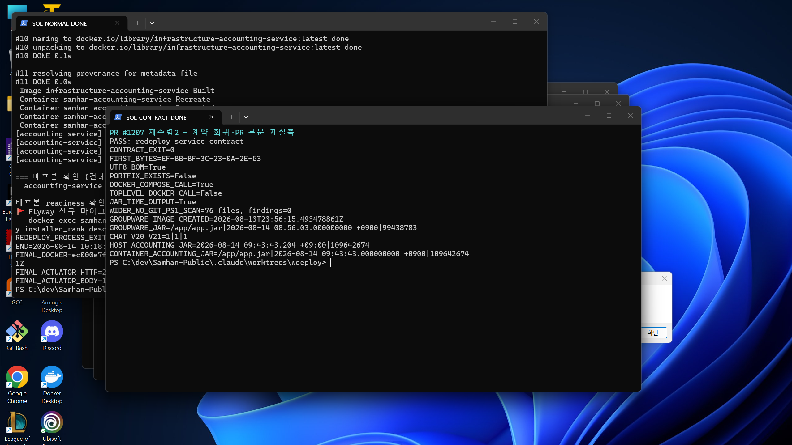

## 7. 항목 6 — PowerShell 5.1 한국어

실제 실행 환경은 `5.1.26100.9168`이었다. 기존 메시지뿐 아니라 새 메시지가 실터미널에서 깨지지 않았다.

```text
[accounting-service] health 대기 시작 (상한 420초)
배포본 readiness 확인 완료: 모든 대상 서비스가 healthy 및 actuator 200/UP 입니다.
[dc-config-service] health 대기 시간 초과 (12초): health=starting, actuator=503/DOWN
필수 매개 변수 Service이(가) 하나 이상 누락되었으므로 명령을 처리할 수 없습니다.
잘못된 서비스 이름입니다: BAD!
[sol-missing-jar] jar 가 없다: ...
```

정상, timeout, 입력 오류 캡처에서 직접 확인했다. D2 재발 없음.

## 8. 항목 7 — PR 본문 재실측

PR 본문의 mutable groupware 정정값을 다시 측정했다.

| 항목 | PR 본문 | 이번 실측 | 판정 |
|---|---|---|---|
| image created | `2026-08-13T23:56:15.493478861Z` | 동일 | 일치 |
| container jar | `2026-08-14 08:56:03.000000000 +0900` | 동일 | 일치 |
| Chat controller | 1 | 1 | 일치 |
| V20 | 1 | 1 | 일치 |
| V21 | 1 | 1 | 일치 |
| 정상 accounting | readiness 후 exit 0, healthy, 200/UP | 그대로 재현 | 일치 |
| 실패 dc | 상한 초과 exit 1과 메시지 | 12초 상한으로 재현 | 일치 |

원문:

```text
CURRENT_IMAGE_CREATED=2026-08-13T23:56:15.493478861Z
CURRENT_CONTAINER_JAR=/app/app.jar|2026-08-14 08:56:03.000000000 +0900|99438783
CURRENT_CHAT_CONTROLLER_COUNT=1
CURRENT_V20_COUNT=1
CURRENT_V21_COUNT=1
```

PR 본문의 재실측값은 이번 실측과 모두 맞았다. 다만 420초 근거로 제시된 375초는 §4처럼 timeout을 제외한 단순값으로만 맞는다.

## 9. 도달 가능한 결함 목록

**0건.**

직접 실행한 정상, timeout 실패, 앞 실패/뒤 미실행, 앞 성공/뒤 실패, 잘못된 입력 6종에서 사용자 계약을 깨는 새 결함은 재현되지 않았다.

증거 무결성 정정은 별도다.

- `375초`는 `start_period + retries × interval` 값으로는 맞다.
- Docker probe가 `timeout`을 소비하는 실패 스케줄 상한으로는 틀리다.
- timeout을 포함한 보수값은 최대 475초이고, application 16개 모두 420초를 넘을 수 있는 정의다.
- 실제 서비스의 자연 기동이 420초를 넘는 사례는 이 라운드에서 관측하지 못했다.

## 10. 관측 불가와 실행 실패 원문

### 10.1 실제 서비스 420초 초과 기동

대상 서비스의 health endpoint를 고의로 지연하거나 파손하지 말라는 규율 때문에 만들지 않았다. 따라서 “정상 서비스가 421~475초 사이에 회복할 때 스크립트가 먼저 exit 1”인 end-to-end 경로는 관측 불가다. compose 정의와 격리 Docker 축소 실험만 확인했다.

### 10.2 공식 포트 리터럴 가드

내부 `git ls-files` 때문에 git 금지와 충돌하여 관측 불가다. 같은 정규식의 더 넓은 no-git 스캔은 76개/0건이었다.

### 10.3 첫 정상 캡처 래퍼

첫 캡처 대기 래퍼의 외부 timeout을 10초로 잘못 주어 다음 실패가 났다. 재배포 자식은 계속 실행됐고 로그와 실터미널을 회수해 정상 결과는 관측했다.

```text
command timed out after 10028 milliseconds
```

### 10.4 첫 무인자 묶음

첫 시도는 콘솔 stdin을 상속해 mandatory parameter prompt에서 멈췄다. 검증 전용 자식 PID만 종료했고, stdin을 닫은 별도 프로세스로 재실행해 exit 1을 관측했다.

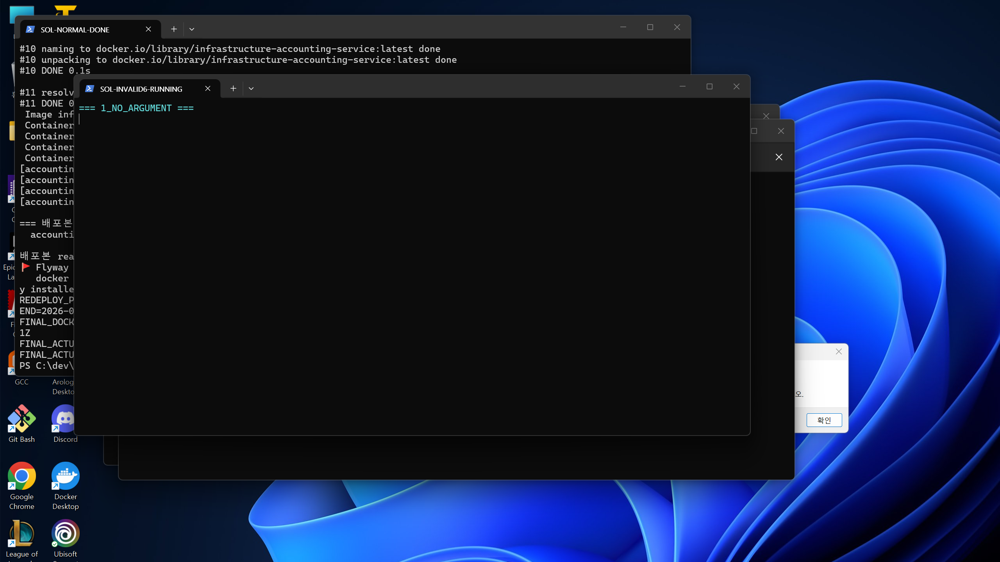

### 10.5 후행 실패 캡처 래퍼

재배포 자식은 완료됐지만 외부 캡처 래퍼에 PowerShell 인자 공백 오류가 있었다. 대표 원문:

```text
Start-Sleep : A parameter cannot be found that matches parameter name 'Milliseconds500'.
Where-Object : An operator is required to compare the two specified values.
```

자식 로그와 완료된 실터미널을 회수했으며, 재배포 결과는 §5.2와 캡처 10으로 관측했다.

## 11. 스택 원복 증명

짧은 상한 실험의 dc는 기존 compose 경계 때문에 처음에는 `localhost:5672` connection refused, 호스트 보정 뒤에는 회전 전 Rabbit 자격증명 때문에 authentication refused였다. 직전 보고서에 이미 나온 환경 경계이며 이번 PR의 신규 결함으로 세지 않았다.

공유 Rabbit 컨테이너에 이미 설정된 자격증명의 유효성을 값 노출 없이 확인했다.

```text
RABBIT_ENV_USER_SET=True
RABBIT_ENV_PASS_SET=True
Authenticating user "samhan" ...
Success
AUTH_ENV_EXIT=0
```

그 값을 현재 프로세스 메모리에서만 dc의 표준 Spring 변수에 주입한 임시 오버레이로 dc만 `--no-deps` 재생성했다. 최종:

```text
RESTORE2_WAIT=0|health=starting|actuator=unavailable
RESTORE2_WAIT=3|health=starting|actuator=200/UP
RESTORE2_WAIT=4|health=healthy|actuator=200/UP
RESTORE2_FINAL=ffa5a6c926f96e54f8073b77989bd4b81e6d5ca095860dc2838bd6ae7df25667|running|healthy|2026-08-14T01:38:50.268575537Z
RESTORE2_ACTUATOR=200/UP
```

임시 오버레이는 삭제했고 자격증명 환경 변수도 해제했다. 모든 실험 후 최종 원문:

```text
/samhan-postgres|117999b24f0ab2cc97249b23bacca2552ac0048b610f71e8cab1443bd536eb3a|running|healthy
/samhan-eureka|3319816c3fbe248e401975af559e6977fbdc2a23b2b2ef45e03d3b6591e2c457|running|healthy
/samhan-rabbitmq|45dba0f1dafce63859516710667a4c52b67bcf8c15810e0e8e840959a3e960a8|running|healthy
/samhan-elasticsearch|ee039339cbf3f7029bbaf96a486a8cd0acdf0cda0f0f19b5f8971ebc7da07af4|running|healthy
/samhan-accounting-service|b3d45c58db5415479a61ded2c77040288da2327f0722ce033fe10fe5f44c1833|running|healthy
/samhan-dc-config-service|ffa5a6c926f96e54f8073b77989bd4b81e6d5ca095860dc2838bd6ae7df25667|running|healthy
ACTUATOR_8087=200|{"status":"UP"}
ACTUATOR_8089=200|{"status":"UP"}
RESTORE_OVERLAY_EXISTS=False
TEMP_HEALTH_CONTAINER_EXISTS=False
QA_CAPTURE_SCRIPTS=0
TEMP_LOGS_AFTER=0
```

공유 인프라 4개 ID는 PRE/POST 모두 동일하다.

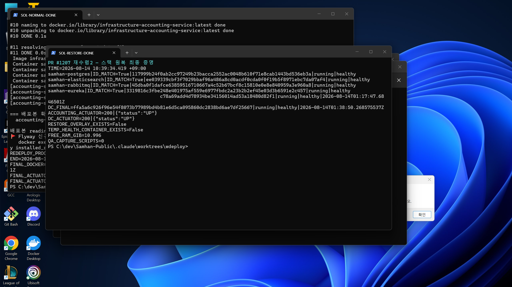

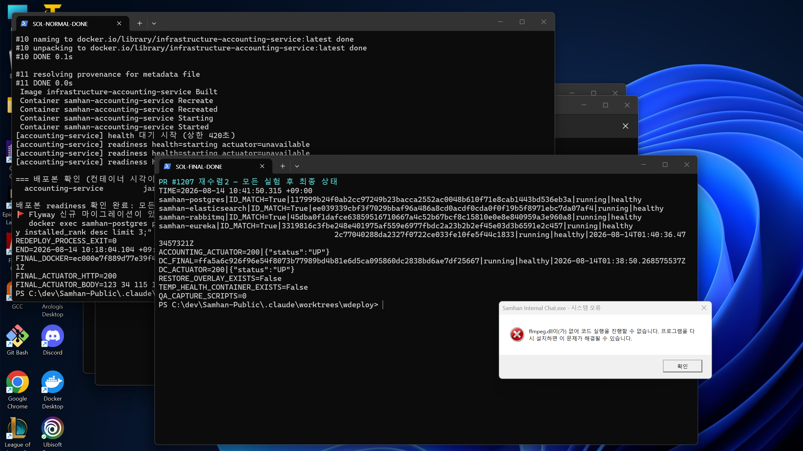

## 12. 캡처 SHA-256

```text
01-environment-real-terminal.png|97A47453017C7E5D6020308C9A11C7B7208661AC7357AC179CBADC288DB74C8C
02-normal-redeploy-real-terminal.png|F46A549E728E704B98EF8D62C3DD19C307011B430261C234598649F3F24229C6
03-multi-front-wait-real-terminal.png|C9361C67034F66DF4DF48FB19D990FB0D449D71FF744A059826DB40EE13970F3
04-multi-timeout-real-terminal.png|AEC9DFCE8B9861D87634BD2B0092C06263D1B78737E28E35B0920775B59DCAC6
05-invalid-inputs-progress-real-terminal.png|A6BBB70D7E561CC30D72906D61716E2EB70CD09C2EC888027B7EA16A4C52739A
06-invalid-inputs-real-terminal.png|B574F711283AB90D6E1B917254C45EB3550AD665A6A57CF1D6C52446CA7B5B68
07-contract-evidence-real-terminal.png|02FB8425082B7FFF2419421E8C81B8C5FD276B42FC79FEB77D74419363B7D00C
08-health-budget-real-terminal.png|F4700437263CAC28677D1FC877463B476C95E13BAF7F3337A61C6DBB24B187E6
09-stack-restore-real-terminal.png|F723CC903E20F583CD4E6712EF40CC0C67E4AACA6783DA05FB6E0F4967DBA622
10-multi-late-failure-real-terminal.png|8B0F66911E658607B2C0FF0F9554BC0E69AAA03401E2DC2F54CC19B95D272B21
11-final-state-real-terminal.png|493B5123D688DF4BCEC913C2417F10C380ECBBCE8FBEF395B537AF5020480979
SCREENSHOT_COUNT=11
DUPLICATE_HASH_GROUPS=0
QA_CAPTURE_SCRIPTS=0
```

## 13. 최종 결론

- 정상 케이스: readiness 완료까지 기다린 뒤 exit 0, `healthy`, actuator `200/UP`.
- 실패 케이스: 12초 상한 뒤 마지막 상태를 포함한 한국어 오류와 exit 1.
- 다중 서비스: 완전 순차. 앞 실패 시 뒤 미실행, 뒤 실패 시 앞 성공은 유지되고 전체 exit 1.
- 직전 계약: D1/D2, 입력 6종, `--no-deps`, 조건부 overlay, jar 시각, no-git 포트 리터럴 동등 스캔 모두 회귀 없음.
- PR 본문 재실측: 현재 mutable 값과 정상/실패 서술 모두 일치.
- 도달 가능한 결함: **0건**.
- 증거 무결성 정정: **375초는 Docker timeout을 제외한 단순값이다. 420초는 timeout 소비까지 포함한 compose failure horizon을 보장하지 않는다.**
- 최종 스택: 공유 ID 4개 불변, accounting/dc `healthy + 200/UP`, 임시 파일·컨테이너·로그·캡처 스크립트 0.
