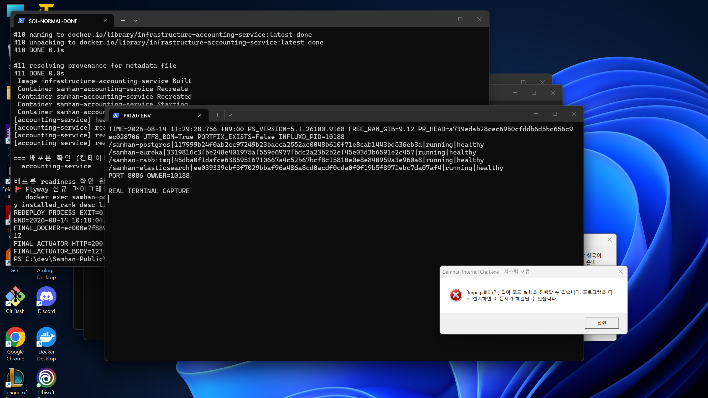
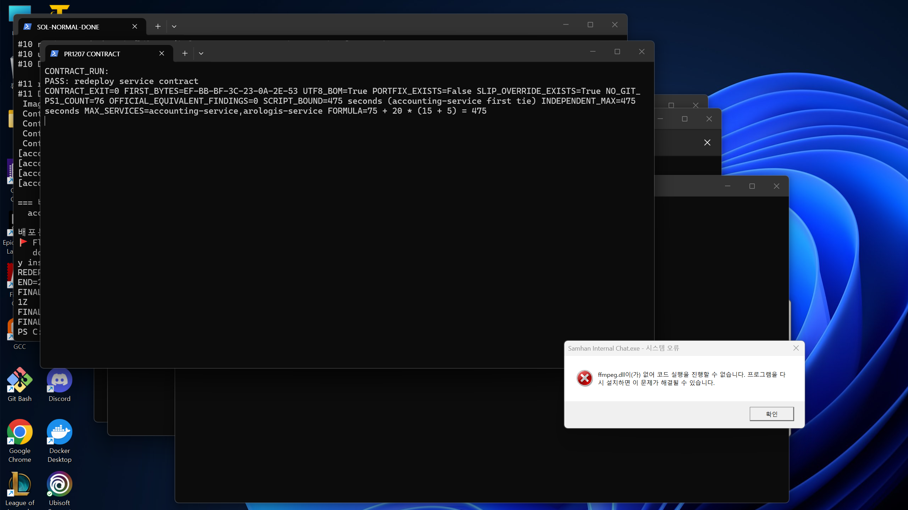
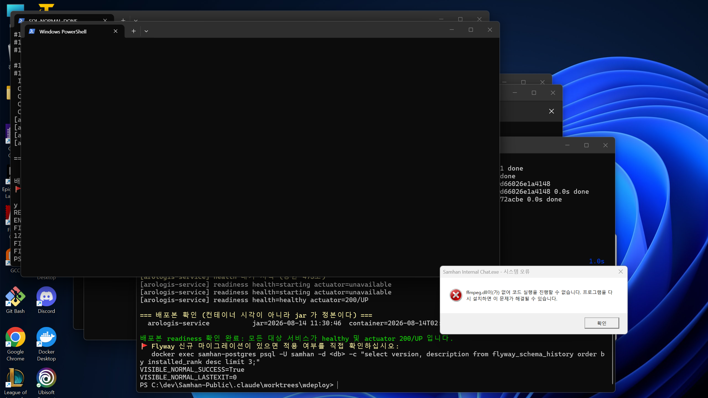
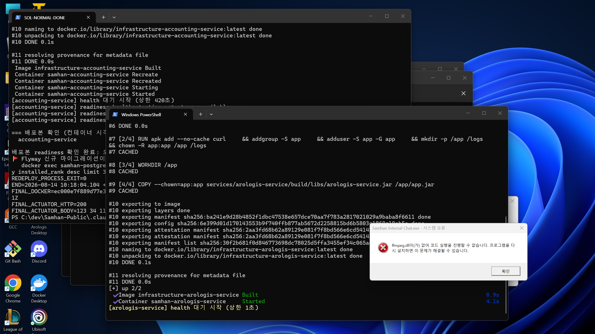
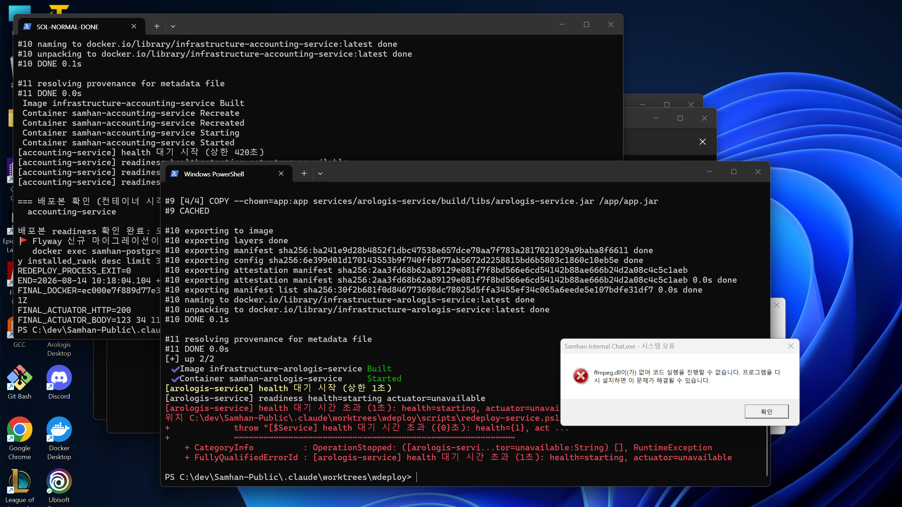
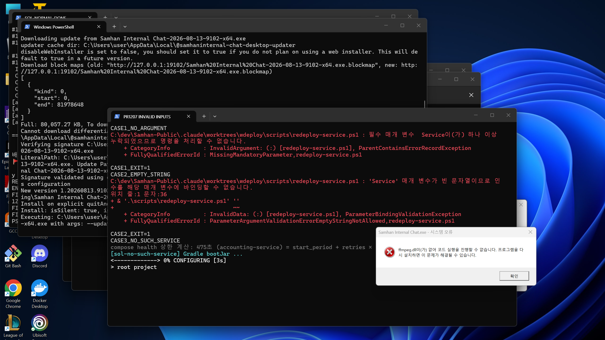
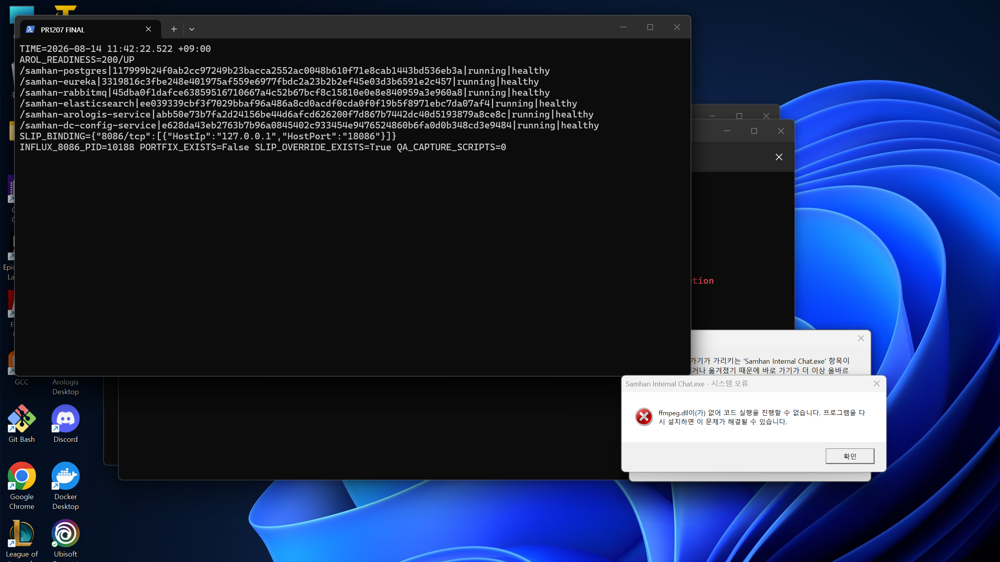

# PR #1207 재수렴 적대검증 3차 보고서 (SOL)

- 검증 시각: 2026-08-14 11:29~11:44 KST
- 대상 워크트리: `C:\dev\Samhan-Public\.claude\worktrees\wdeploy`
- 대상 브랜치: `chore/redeploy-service-script`
- GitHub API PR head: `a739edab28cec69b0cfddb6d5bc656c9ec028706`
- git 명령: 사용하지 않음
- 코드 수정: 없음
- 실험용 임시 파일: `infrastructure/docker-compose.local-portfix.yml` 1회 생성 후 즉시 삭제
- 최종 판정: **직접 실행한 실사용자 경로의 도달 가능한 결함 0건**
- 증거 무결성 정정: **PR 본문의 `기본 420초`는 현재 HEAD와 불일치. 현재 기본값은 compose에서 동적으로 계산된 475초이다.**

검증 전에 `gh pr view 1207` 본문, 일반 코멘트 3건, review 0건, inline review 코멘트 0건을 모두 읽었다. 직전 보고서 `docs/qa/2026-08-14-1207-reconv2/REPORT.md`도 먼저 읽었다.

모든 PNG는 실행 중인 Windows Terminal/PowerShell 화면을 OS 화면 복사로 직접 캡처했다. 텍스트를 다시 그린 합성 PNG는 없고, `docs/qa` 아래 캡처 스크립트도 만들지 않았다.

## 1. 환경 실측 원문

최초 측정:

```text
TIME=2026-08-14 11:29:28.756 +09:00
PS_VERSION=5.1.26100.9168
FREE_RAM_GIB=9.12
PR_HEAD=a739edab28cec69b0cfddb6d5bc656c9ec028706
UTF8_BOM=True
PORTFIX_EXISTS=False
INFLUXD_PID=10188
/samhan-postgres|117999b24f0ab2cc97249b23bacca2552ac0048b610f71e8cab1443bd536eb3a|running|healthy
/samhan-eureka|3319816c3fbe248e401975af559e6977fbdc2a23b2b2ef45e03d3b6591e2c457|running|healthy
/samhan-rabbitmq|45dba0f1dafce63859516710667a4c52b67bcf8c15810e0e8e840959a3e960a8|running|healthy
/samhan-elasticsearch|ee039339cbf3f7029bbaf96a486a8cd0acdf0cda0f0f19b5f8971ebc7da07af4|running|healthy
PORT_8086_OWNER=10188
```

각 실배포 직전 RAM은 9.093, 8.237, 8.187, 8.132, 7.907, 6.816GiB였다. 모두 중단선 1.0GiB 이상이었다.



## 2. 항목 1 — compose 계산과 스크립트 출력 대조

실제 병합 입력은 다음 두 파일이며, 현재 `docker-compose.local-portfix.yml`은 없다.

```text
infrastructure/docker-compose.yml
infrastructure/docker-compose.local-all.yml
PORTFIX_EXISTS=False
```

원본 YAML에서 애플리케이션 최대 후보를 직접 읽었다.

```text
accounting-service  lines 365~370  start_period=75s retries=20 interval=15s timeout=5s
arologis-service    lines 637~642  start_period=75s retries=20 interval=15s timeout=5s
```

그 뒤 `docker compose ... config --format json` 결과의 healthcheck 24개를 독립 파싱했다.

```text
Service                 start_period retries interval timeout horizon
accounting-service                 75      20       15       5     475
api-gateway                        45      20       15       5     445
arologis-service                   75      20       15       5     475
auth-service                       60      20       15       5     460
dashboard-service                  60      20       15       5     460
dc-config-service                  60      20       15       5     460
elasticsearch                       0      15       15      10     375
eureka-server                      30      20       15       5     430
grafana                             0      10       15       5     200
groupware-service                  60      20       15       5     460
inventory-service                  60      20       15       5     460
minio                               0      10       15       5     200
nginx                               0      10       15       5     200
notification-service              60      20       15       5     460
partner-auth-service              60      20       15       5     460
partner-order-service             60      20       15       5     460
partner-service                   60      20       15       5     460
postgres                            0      10       10       5     150
product-service                   60      20       15       5     460
prometheus                          0      10       15       5     200
rabbitmq                            0      10       15      10     250
redis                               0      10       10       5     150
slip-service                      60      20       15       5     460
user-service                      60      20       15       5     460

SERVICE_HEALTHCHECK_COUNT=24
MAX_HORIZON=475
MAX_SERVICES=accounting-service,arologis-service
EXPECTED=75+20*(15+5)=475
```

스크립트 자체의 출력:

```text
compose health 상한 계산: 475초 (accounting-service) = start_period + retries × (interval + timeout)
```

수치는 일치한다. 최대 서비스는 **accounting-service와 arologis-service 두 개**다. 스크립트는 동률에서 compose 순서상 처음 만난 `accounting-service`만 표시한다.

조건부 오버레이의 존재 분기도 실제로 밟았다. 배포를 일으키지 않도록 임시 오버레이가 accounting의 `start_period`만 76초로 바꾸게 하고 missing jar를 요청했다.

```text
compose health 상한 계산: 476초 (accounting-service) = start_period + retries × (interval + timeout)
TEMP_OVERLAY_PROCESS_EXIT=1
[sol-missing-jar] jar 가 없다: services/sol-missing-jar/build/libs/sol-missing-jar.jar
```

계산값이 475→476으로 바뀌므로 파일이 있을 때 compose 인자에 실제 포함된다. 파일은 즉시 삭제했고 최종 `PORTFIX_EXISTS=False`를 다시 확인했다.



## 3. 항목 2 — 정상 재배포

공유 트랙 금지 목록 밖의 `arologis-service` 하나만 사용했다. PowerShell 5.1 별도 프로세스에서 실사용자 경로 전체를 실행했다.

```powershell
powershell.exe -NoProfile -NonInteractive -ExecutionPolicy Bypass -File .\scripts\redeploy-service.ps1 arologis-service
```

원문 핵심:

```text
PRE_DEPLOY_FREE_RAM_GIB=9.093
compose health 상한 계산: 475초 (accounting-service) = start_period + retries × (interval + timeout)
[arologis-service] Gradle bootJar ...
[arologis-service] jar 2026-08-14 11:30:46  (0분 전)
[arologis-service] compose up --build --no-deps ...
Container samhan-arologis-service Recreated
Container samhan-arologis-service Started
[arologis-service] health 대기 시작 (상한 475초)
[arologis-service] readiness health=starting actuator=unavailable
[arologis-service] readiness health=starting actuator=unavailable
[arologis-service] readiness health=healthy actuator=200/UP
배포본 readiness 확인 완료: 모든 대상 서비스가 healthy 및 actuator 200/UP 입니다.
REDEPLOY_PROCESS_EXIT=0
FINAL_TARGET=42cf2c27aa906bb5e1508d6f01daa32b2e42087c870bd16f1818e26bdf4aa136|running|healthy|2026-08-14T02:31:11.184324899Z
ACTUATOR_HTTP=200
ACTUATOR_BODY={"status":"UP"}
```

`bootJar → docker compose --build --no-deps → healthy + actuator 200/UP → exit 0`을 끝까지 직접 확인했다. 추가 실캡처용 `-SkipBuild` 재실행도 `VISIBLE_NORMAL_SUCCESS=True`, `VISIBLE_NORMAL_LASTEXIT=0`이었다.



## 4. 항목 3 — 짧은 상한 실패

먼저 12초를 적용했다. 캐시된 이미지와 빠른 기동 때문에 대상이 12초 안에 healthy가 되어 exit 0으로 끝났다. 실패 경계 재현이 아니므로 상한을 허용 최소값 1초로만 바꿔 다시 실행했다.

```powershell
$env:REDEPLOY_HEALTH_TIMEOUT_SECONDS='1'
powershell.exe -NoProfile -NonInteractive -ExecutionPolicy Bypass -File .\scripts\redeploy-service.ps1 arologis-service
```

원문:

```text
PRE_TIMEOUT1_FREE_RAM_GIB=8.187
compose health 상한 계산: 475초 (accounting-service) = start_period + retries × (interval + timeout)
[arologis-service] Gradle bootJar ...
[arologis-service] jar 2026-08-14 11:30:46  (2.3분 전)
[arologis-service] compose up --build --no-deps ...
[arologis-service] health 대기 시작 (상한 1초)
[arologis-service] readiness health=starting actuator=unavailable
[arologis-service] health 대기 시간 초과 (1초): health=starting, actuator=unavailable
REDEPLOY_PROCESS_EXIT=1
POST_TIMEOUT1=dfcb4c1ac21e45b97344db6cac29d89a3ed9d0281a07de23944f0cea2b83a471|running|starting|2026-08-14T02:33:08.160145166Z
```

사용자에게 마지막 health/actuator 값과 한국어 시간 초과 메시지가 보이고 프로세스는 exit 1이었다.





## 5. 항목 4 — 대기 진행 상황

정상 재배포에서 readiness가 5초 간격으로 세 번 출력됐다.

```text
[arologis-service] readiness health=starting actuator=unavailable
[arologis-service] readiness health=starting actuator=unavailable
[arologis-service] readiness health=healthy actuator=200/UP
```

1초 실패에서도 대기 시작, 현재 상태, 시간 초과가 순서대로 보였다. 수 분 동안 무출력으로 멈춰 있는 경로는 재현되지 않았다.

## 6. 항목 5 — 직전 계약 전체

### 6.1 `docker compose`, BOM, `--no-deps`, jar 시각

```text
PASS: redeploy service contract
CONTRACT_EXIT=0
FIRST_BYTES=EF-BB-BF-3C-23-0A-2E-53
UTF8_BOM=True
DOCKER_COMPOSE_CALL=True
```

실제 정상/timeout/다중 실행 모두 `Image ... Built`, `Container ... Recreated/Started`까지 갔다. `docker -f` 오류는 재발하지 않았다. 명령은 실제로 `docker compose ... up -d --build --no-deps`였고, 모든 실행에서 jar 시각이 출력됐다.

### 6.2 잘못된 입력 6종

모두 stdin 대기 없이 PowerShell 5.1 별도 프로세스로 실행했다.

```text
CASE1_NO_ARGUMENT
필수 매개 변수 Service이(가) 하나 이상 누락되었으므로 명령을 처리할 수 없습니다.
CASE1_EXIT=1

CASE2_EMPTY_STRING
'Service' 매개 변수가 빈 문자열이므로 인수를 해당 매개 변수에 바인딩할 수 없습니다.
CASE2_EXIT=1

CASE3_NO_SUCH_SERVICE
Cannot locate tasks that match ':services:sol-no-such-service:bootJar' as project 'sol-no-such-service' not found in project ':services'.
[sol-no-such-service] bootJar 실패 (exit 1)
CASE3_EXIT=1

CASE4_MALFORMED_LIST
잘못된 서비스 이름입니다: BAD!
CASE4_EXIT=1

CASE5_SKIPBUILD_MISSING_JAR
[sol-missing-jar] jar 가 없다: services/sol-missing-jar/build/libs/sol-missing-jar.jar
CASE5_EXIT=1

CASE6_DOCKER_UNREACHABLE
unable to get image 'infrastructure-arologis-service': failed to connect to the docker API at npipe:////./pipe/sol1207-reconv3-missing
[arologis-service] compose up 실패 (exit 1)
CASE6_EXIT=1
```

Docker 불가 케이스는 해당 자식 프로세스에 존재하지 않는 named pipe만 주입해 공유 daemon에는 배포 요청을 보내지 않았다.



### 6.3 조건부 오버레이

- 부재 조건: 정상 실배포가 475초 계산으로 완료됐다.
- 존재 조건: 임시 오버레이에서 계산이 476초로 바뀌었다.
- 원복: 최종 `PORTFIX_EXISTS=False`.

### 6.4 포트 리터럴 가드

공식 스크립트는 내부에서 `git ls-files`를 호출하므로 git 명령 금지와 충돌해 그대로 실행하지 않았다. 파일의 예외 목록, 포트 목록, 정규식을 그대로 사용하고 파일 발견만 `rg --files -g '*.ps1'`로 대체했다.

```text
NO_GIT_SCANNED_PS1_COUNT=76
OFFICIAL_EQUIVALENT_FINDING_COUNT=0
```

### 6.5 다중 서비스 순차 처리

동일한 허용 서비스 하나만 재생성하고 후행 missing jar를 붙였다.

```powershell
.\scripts\redeploy-service.ps1 'arologis-service,sol-missing-jar' -SkipBuild
```

원문:

```text
PRE_AROLOGIS=dfcb4c1ac21e45b97344db6cac29d89a3ed9d0281a07de23944f0cea2b83a471
[arologis-service] health 대기 시작 (상한 475초)
[arologis-service] readiness health=starting actuator=unavailable
[arologis-service] readiness health=starting actuator=unavailable
[arologis-service] readiness health=healthy actuator=200/UP
[sol-missing-jar] jar 가 없다: services/sol-missing-jar/build/libs/sol-missing-jar.jar
MULTI_PROCESS_EXIT=1
POST_AROLOGIS=5fbd32721e8db0ed8578e04112591448fe2bb4831b65437011af229025d947cc|running|healthy|2026-08-14T02:35:19.39728178Z
AROL_ACTUATOR=200/UP
```

앞 서비스가 readiness 완료된 뒤에만 뒤 서비스로 넘어갔고, 뒤 실패로 전체 exit 1이었다.

### 6.6 PowerShell 5.1 한국어

실제 버전은 `5.1.26100.9168`이었다. 정상, timeout, 잘못된 입력, 다중 처리의 한국어가 실제 Windows Terminal에서 깨지지 않았다. D2 재발 없음.

## 7. 항목 6 — 환경 사실

### 7.1 외부 influxd와 저장소 기존 override

```text
LocalAddress LocalPort OwningProcess
::                8086         10188
127.0.0.1         8088         10188

infrastructure/docker-compose.slip-port-override.yml exists=True
/samhan-slip-service|...|{"8086/tcp":[{"HostIp":"127.0.0.1","HostPort":"18086"}]}|running|healthy
```

외부 `influxd`가 8086/8088을 점유하고, 저장소 기존 `docker-compose.slip-port-override.yml`이 slip의 호스트 포트를 18086으로 우회한다. 이 환경/타 트랙 사실은 결함으로 세지 않았다.

### 7.2 dc-config-service와 Rabbit

검증 시작 시 dc는 healthy였고 당시 로그는 Rabbit 연결 성공이었다.

```text
/samhan-dc-config-service|c40c446bfde67230404ba3ae3c7926690b11397bf7dffc87f4a78c89976065ef|running|healthy
Attempting to connect to: [rabbitmq:5672]
Created new connection: ... amqp://samhan@172.19.0.10:5672/
```

직전 보고서에 기록된 Rabbit 연결 실패로 `starting`에 머무는 환경 경계는 이번 시점에는 재현되지 않았다. dc는 금지 대상이므로 재배포하지 않았다. 동시 타 트랙이 검증 중 dc를 재생성해 최종 ID는 바뀌었지만 최종 상태는 healthy였다. 이를 이 PR 결함으로 세지 않았다.

## 8. 도달 가능한 결함 목록

**0건.**

동적 계산, 정상 전체 재배포, 짧은 상한 실패, 반복 진행 출력, 직전 계약, 다중 순차 처리에서 실사용자 경로를 깨는 결함은 재현되지 않았다.

## 9. 증거 무결성 정정

PR 본문에는 현재도 다음 문장이 있다.

```text
readiness 대기 상한은 기본 420초이며 REDEPLOY_HEALTH_TIMEOUT_SECONDS로 조정할 수 있다
```

HEAD `a739edab2`의 직접 실행값은 475초이며, compose 독립 계산도 475초다. 따라서 정정값은 다음과 같다.

```text
현재 기본 상한 = max(start_period + retries × (interval + timeout))
                 = 75 + 20 × (15 + 5)
                 = 475초
최대 서비스     = accounting-service, arologis-service
```

수치 475초는 재현된다. PR 본문의 420초만 stale하다. 코드 결함 수에는 넣지 않았다.

## 10. 관측 불가와 실행 실패 원문

### 10.1 공식 포트 가드

공식 가드는 내부 `git ls-files` 때문에 git 금지와 충돌해 원본 그대로의 exit는 관측 불가다. 동일 규칙의 no-git 스캔은 76개/0건이었다.

### 10.2 첫 정상 시도 서비스명 오타

검증 명령에서 `arlogis-service`로 한 글자를 누락했다. 스크립트는 올바르게 exit 1했고 스택은 바뀌지 않았다.

```text
Cannot locate tasks that match ':services:arlogis-service:bootJar' as project 'arlogis-service' not found in project ':services'. Some candidates are: 'arologis-service'.
[arlogis-service] bootJar 실패 (exit 1)
REDEPLOY_PROCESS_EXIT=1
FINAL_TARGET=631fa5541f05...|running|healthy
ACTUATOR_HTTP=200
```

compose 서비스 목록과 디렉터리에서 정확한 이름 `arologis-service`를 확인한 뒤 한 변수만 바로잡아 §3을 성공 재현했다.

### 10.3 12초 상한 시도

12초 안에 healthy가 되어 exit 0이었다. 실패 재현이 아니어서 1초로 재실행했고 §4에서 exit 1을 관측했다.

### 10.4 최종 캡처 래퍼 첫 시도

서비스 자연 회복 중 최종 캡처 래퍼 외부 제한을 20초로 잘못 두어 다음 원문으로 끝났다.

```text
command timed out after 21754 milliseconds
exit 124
```

직후 경계 확인은 다음과 같았다.

```text
TARGET=abb50e73b7fa2d24156be44d6afcd626200f7d867b7442dc40d5193879a8ce8c|running|healthy
ACT=200/UP
```

따라서 재배포 스크립트 실패가 아니라 캡처 래퍼 제한 실패다. 회복된 상태에서 최종 캡처를 다시 성공했다.

### 10.5 완료 전 compose 재계산 명령 첫 시도

완료 전 읽기 전용 검증 묶음에서 PowerShell `foreach ($m in ...)`의 `in` 앞 공백을 빠뜨려 파서가 exit 1 했다.

```text
Missing 'in' after variable in foreach loop.
FullyQualifiedErrorId : MissingInInForeach
exit 1
```

제품/재배포 스크립트가 아니라 검증 명령 구문 실패다. 공백만 바로잡아 개별 재실행했고 `FRESH_MAX=475`, `FRESH_MAX_SERVICES=accounting-service,arologis-service`를 확인했다.

## 11. 스택 원복 증명

최종 실측:

```text
TIME=2026-08-14 11:42:22.522 +09:00
AROL_READINESS=200/UP
/samhan-postgres|117999b24f0ab2cc97249b23bacca2552ac0048b610f71e8cab1443bd536eb3a|running|healthy
/samhan-eureka|3319816c3fbe248e401975af559e6977fbdc2a23b2b2ef45e03d3b6591e2c457|running|healthy
/samhan-rabbitmq|45dba0f1dafce63859516710667a4c52b67bcf8c15810e0e8e840959a3e960a8|running|healthy
/samhan-elasticsearch|ee039339cbf3f7029bbaf96a486a8cd0acdf0cda0f0f19b5f8971ebc7da07af4|running|healthy
/samhan-arologis-service|abb50e73b7fa2d24156be44d6afcd626200f7d867b7442dc40d5193879a8ce8c|running|healthy
/samhan-dc-config-service|e628da43eb2763b7b96a0845402c933454e9476524860b6fa0d0b348cd3e9484|running|healthy
SLIP_BINDING={"8086/tcp":[{"HostIp":"127.0.0.1","HostPort":"18086"}]}
INFLUX_8086_PID=10188
PORTFIX_EXISTS=False
SLIP_OVERRIDE_EXISTS=True
QA_CAPTURE_SCRIPTS=0
```

공유 인프라 4개 ID는 PRE/POST가 정확히 동일하다. postgres, eureka, rabbitmq, elasticsearch는 재생성하지 않았다. 실험 대상 arologis는 최종 healthy + 200/UP로 회복했다. 임시 portfix 파일, 캡처 스크립트, 임시 QA 로그는 남지 않았다.



## 12. 캡처 SHA-256

```text
01-environment-real-terminal.png      7D46479B95DF7855AD5A9317C0D6C6719DE85C2A2D1C832F7FC193D262A20178
02-normal-redeploy-real-terminal.png  F046076F8345EFCCC661457BCD456DAEB264F6F704B188C883986B215786CEF5
03-timeout-progress-real-terminal.png 052F76FAA4D267047AB63DF7ADBDAF1D0F354C2E30778E86199DDB92BF02C2AA
04-timeout-exit1-real-terminal.png    933E460B14FEBCFB8EBA0ADD3D6CC033D53CD6BBF0A1938A22210085B70396AA
05-invalid-first-real-terminal.png    EB5E7FAD981D5DB2BC2A63773B288FC2A8C8D42D668FB758B916EF24EE4E9F6B
06-contract-bound-real-terminal.png   8FC25A1C1070C83A7957290369B8A3236F010B432755ABC1CD765FBAA49AD2F8
07-final-state-real-terminal.png      A52E67032FA30D96BEC3EF801121BA5284A2C734895B964C9198804E8B3ABB4A

SCREENSHOT_COUNT=7
DUPLICATE_HASH_GROUPS=0
QA_CAPTURE_SCRIPTS=0
TEMP_QA_FILES_AFTER=0
```

## 13. 결론

- compose 24개 healthcheck의 현재 보수 상한은 475초이며 accounting과 arologis가 공동 최대다.
- 정상 전체 재배포는 healthy + actuator 200/UP 후 exit 0이었다.
- 1초 상한은 마지막 상태가 보이는 한국어 오류 후 exit 1이었다.
- 대기 중 readiness가 반복 출력됐다.
- D1/D2, 입력 6종, `--no-deps`, 조건부 오버레이, jar 시각, 포트 가드 동등 스캔, 다중 순차 처리는 회귀가 없었다.
- 도달 가능한 결함은 0건이다.
- 증거 무결성 정정은 1건이다: PR 본문의 `기본 420초`를 동적 현재값 `475초`로 고쳐야 한다.
- 공유 인프라 4개 ID는 불변이고 실험 대상은 healthy + 200/UP로 원복됐다.
