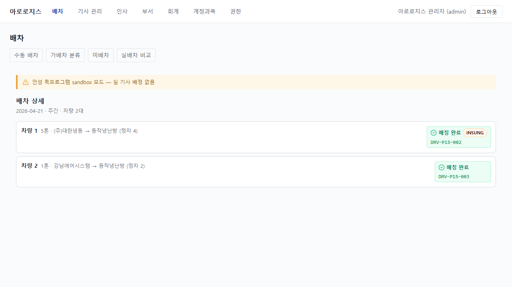
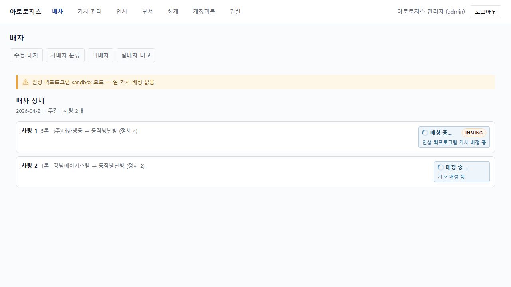

# #804 배차 상세 FE-BE 계약 정합 — 라이브 QA (Opus R1)

**일시**: 2026-07-14 · **환경**: Docker 실서버(mock OFF)·arologis-service **:8097**(#804 jar 재배포)·arologis-desktop standalone 하네스(`vite.renderer.dev.config.ts` :5291·`/admin/arologis` proxy passthrough)·로그인 **admin**(AROLOGIS_MASTER).

## 검증 결과 — 이전 placeholder("대기 중" 고정) → 실데이터 정상 렌더

무매핑 캐스팅으로 대부분 필드가 `undefined`였던 배차 상세가, 계약 정합(BE additive + FE 어댑터) 후 실 arologis-service 응답(`GET /admin/arologis/dispatches/{id}` → **200**)으로 정상 렌더됨을 실 GUI로 확증.

### 01 — ASSIGNED 배차 (`500dc0d7…`, 2026-04-21, 주간, 2차량)
- **sandbox 배너** "인성 퀵프로그램 sandbox 모드 — 실 기사 배정 없음" (sandboxMode=true) ✅
- dispatchTypeLabel **"주간"**(DAY) · 차량 2대
- 차량1 **5톤**(TONNAGE_5) · **(주)대한냉동 → 동작냉난방**(routeLabel 거래처명) · **(정차 4)** · **"매칭 완료"** 실배지(ASSIGNED·초록·INSUNG pill) · driverCode **DRV-P15-002** · **vendorOrderId 툴팁**(title="인성 주문 ID: QA-INSUNG-804")
- 차량2 **1톤**(TONNAGE_1) · 강남에어시스템 → 동작냉난방 · (정차 2) · 매칭 완료 · DRV-P15-003 (vendorOrderId 미보유 → 툴팁 없음)

### 02 — DELIVERED 배차 (`361b4e62…`, 2026-05-09, 특송, 3차량)
- sandbox 배너 · dispatchTypeLabel **"특송"**(EXPRESS) · 차량 3대
- 차량1 5톤 · 에스엠하나공조 → (주)대한냉동 · (정차 4) · **"배송 완료"**(DELIVERED) · DRV-2026-009 · 전자서명 수신
- 차량3 **2.5톤**(TONNAGE_2_5) · 송파공조 → 동작냉난방 · (정차 3) · 배송 완료
- **GPS 패널 0개·알림 행 0개**(gpsSources/notifyResults 미구현 → **비표시 확증**·FE-2/FE-3 이연)

## 검증 항목 매핑
| 항목 | 실증 |
|---|---|
| matchStatus 배지(핵심 버그) | ASSIGNED→"매칭 완료"·DELIVERED→"배송 완료" 실렌더(placeholder 해소) |
| tonnageLabel | 5톤·1톤·2.5톤(enum→라벨) |
| dispatchTypeLabel | 주간·특송 |
| routeLabel(F1 fix) | "거래처 → 거래처" 정상 화살표(고아 없음) |
| stopCount | (정차 4)·(정차 2)·(정차 3) |
| vendorOrderId 툴팁(FE-4) | title "인성 주문 ID: QA-INSUNG-804"(보유 차량만) |
| sandboxMode 배너 | 표시(true) |
| GPS/알림 비표시 | 패널 0·행 0 |
| QA 하네스 proxy(/admin/arologis) | GET 200(false-RED 해소 실증) |

## R2 (Codex 적대검증 fix) — matchSource INSUNG pill 오표시 해소
Codex 적대검증이 발굴한 HIGH: 어댑터가 `matchSource` 를 버려 `VehicleMatchStatusBadge` 가 source 무관하게 MATCHING/ASSIGNED 면 "INSUNG" pill 표시 → 비-인성 배정 오표시. fix 후 라이브 재캡처(500dc0d7):
- 차량1 **EXTERNAL_INSUNG_QUICK** → INSUNG pill **유지**(정상)
- 차량2 **EXTERNAL_KAKAO** → INSUNG pill **제거**(수정)
- DOM: insung-vendor-badge **2→1**(before 01 = 둘 다 pill / after 03 = 1개)

**before(01)**: 차량2(EXTERNAL_KAKAO)도 INSUNG pill 오표시 / **after(03)**: 차량1(인성)만 pill. 실 match_source(EXTERNAL_INSUNG_QUICK 14·INTERNAL_APP 14·EXTERNAL_KAKAO 13·null 15)로 확증.

## R3 (Opus 재수렴) — MATCHING 서브텍스트 인성문구 gate (디펙트-패밀리 완주)
R3 Design/QA가 R2 fix 미완주 발굴: `STATUS_SUBTEXT['MATCHING']='인성 퀵프로그램 기사 배정 중'`가 matchSource 무관 하드코딩(pill/aria/tooltip 은 R2가 gate했으나 눈에 보이는 서브텍스트 미gate) → 비-인성 MATCHING 오표시. fix(`resolveSubText` gate) 후 라이브(500dc0d7 두 차량 MATCHING 투명시드):
- 차량1 **EXTERNAL_INSUNG_QUICK** → "매칭 중..." + INSUNG pill + **"인성 퀵프로그램 기사 배정 중"**(정상)
- 차량2 **EXTERNAL_KAKAO** → "매칭 중..." + pill 없음 + **"기사 배정 중"**(중립·인성 누출 없음)
- DOM: insung-sub·neutral-sub 동시 present·insung-vendor-badge 1(차량1만)

기타 R3 fix: F1-QA(matchSource 계약 e2e 단언·DTO+IT)·F2(deprecated 톤수 '기타' 정렬·BE "UI 노출 금지" 사전결정 존중)·F-new-2(DELIVERED 기사코드 AA neutral-400→600). 이연(제품/정책): 전자서명 matchSource-독립·sandbox 배너 문구.

## 투명 QA 시드 (실데이터 규율)
- dev 배차엔 vendor_order_id 전무(Insung 매칭 sandbox) → FE-4 툴팁 실증 위해 1차량에 `QA-INSUNG-804` 일시 UPDATE → 캡처 → **즉시 NULL 롤백**(잔재 0 확인). 합성/fixture 아님(실 서버·실 DB·실 렌더).
