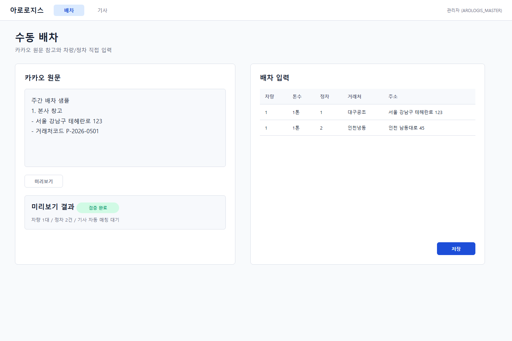
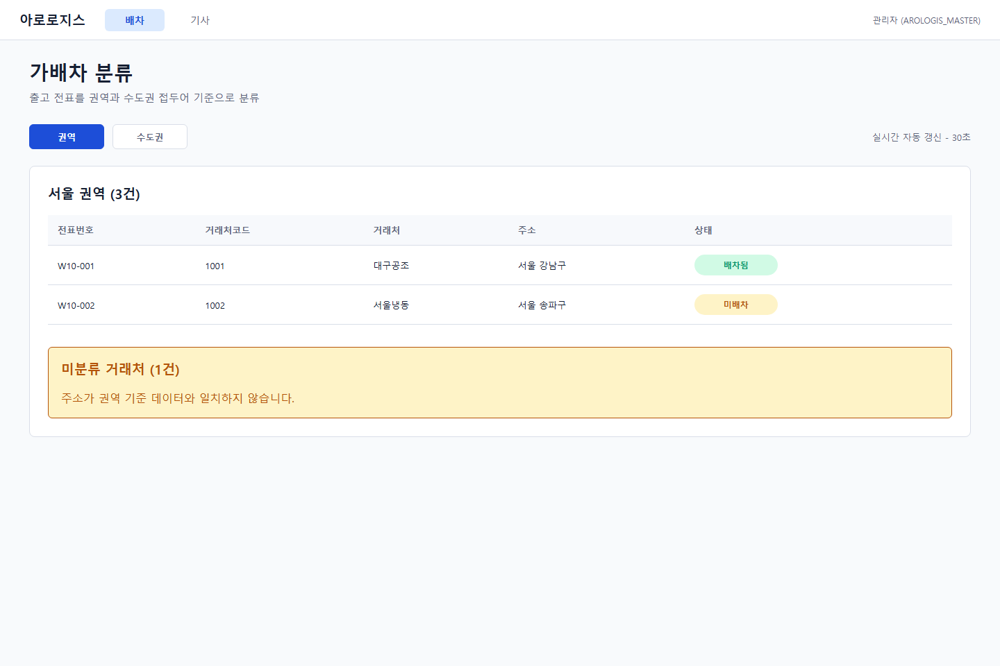
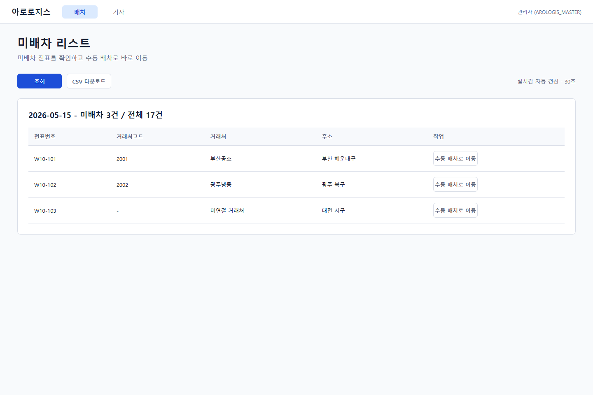
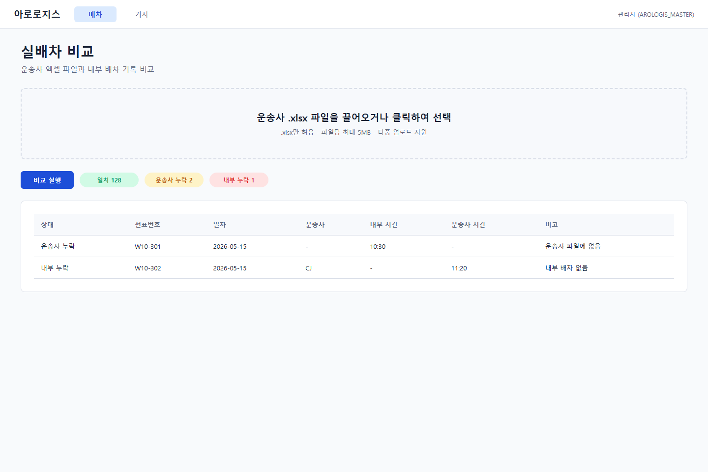

# D-AX-11 Operational Validation

Date: 2026-05-15

## Scope

Validate the Arologis desktop dispatch extraction before PR review/merge:

- `/dispatches/manual`
- `/dispatches/pre-classify`
- `/dispatches/unassigned`
- `/dispatches/reconcile`

## Evidence

## Commands

| Command | Result |
|---|---|
| `./gradlew :services:arologis-service:compileJava :services:arologis-service:compileTestJava` | PASS |
| `./gradlew :services:arologis-service:test --tests com.samhanair.logis.arologis.service.DispatchManualServiceTest` | PASS |
| `cd clients/arologis-desktop; npm run typecheck` | PASS |
| `cd clients/arologis-desktop; npm run build` | PASS |
| `powershell -ExecutionPolicy Bypass -File .\scripts\generate-arologis-dispatch-pages-screenshots.ps1` | PASS - Playwright Chromium mock render |

## PM Gate

PM approval is not final until GitHub CI is green on the pushed PR head. Current local validation is green; CI must be rechecked after the review-fix commit is pushed.
