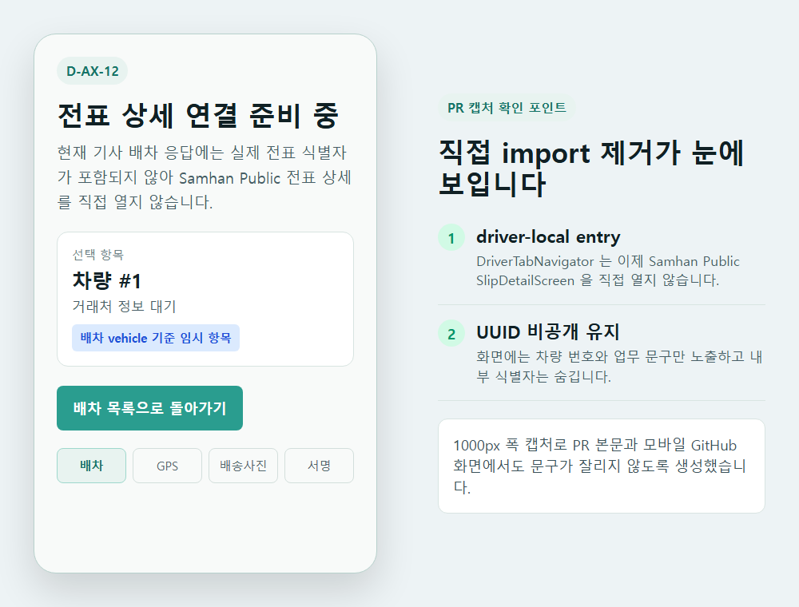
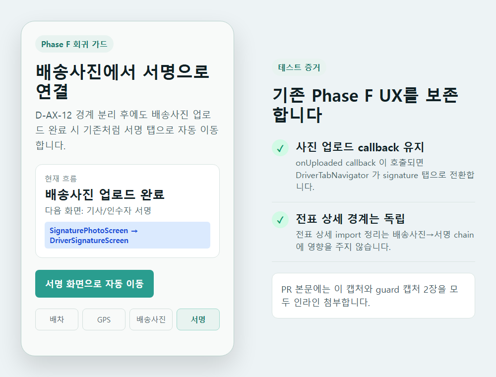
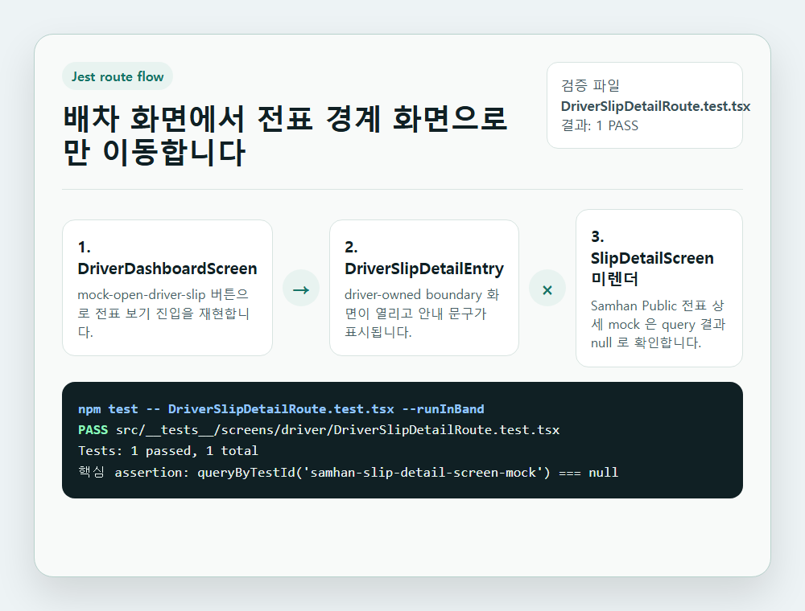
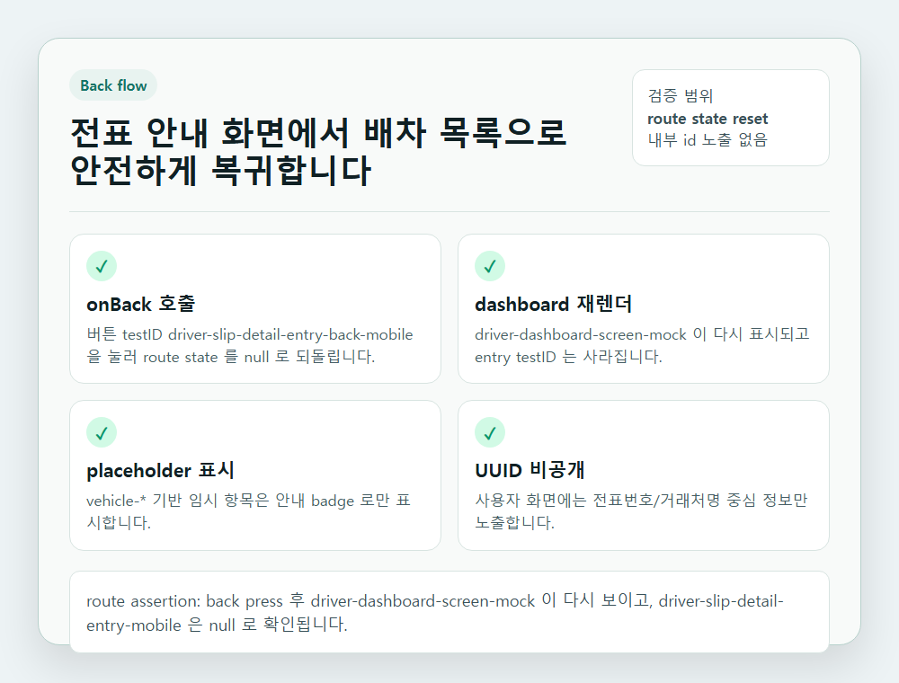
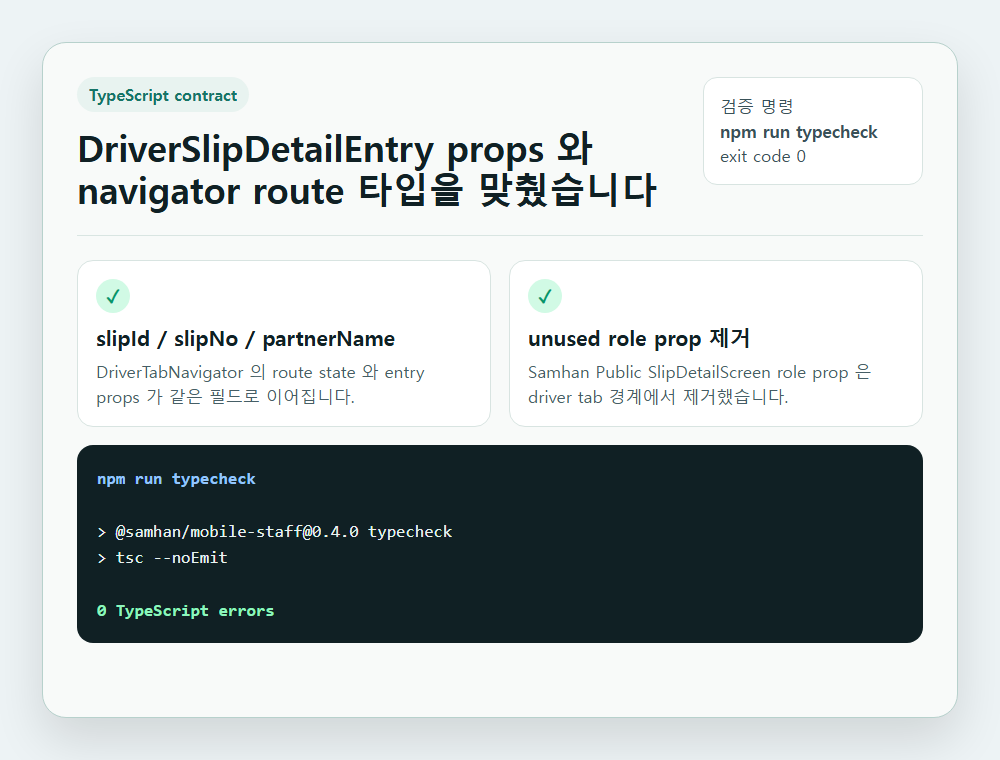
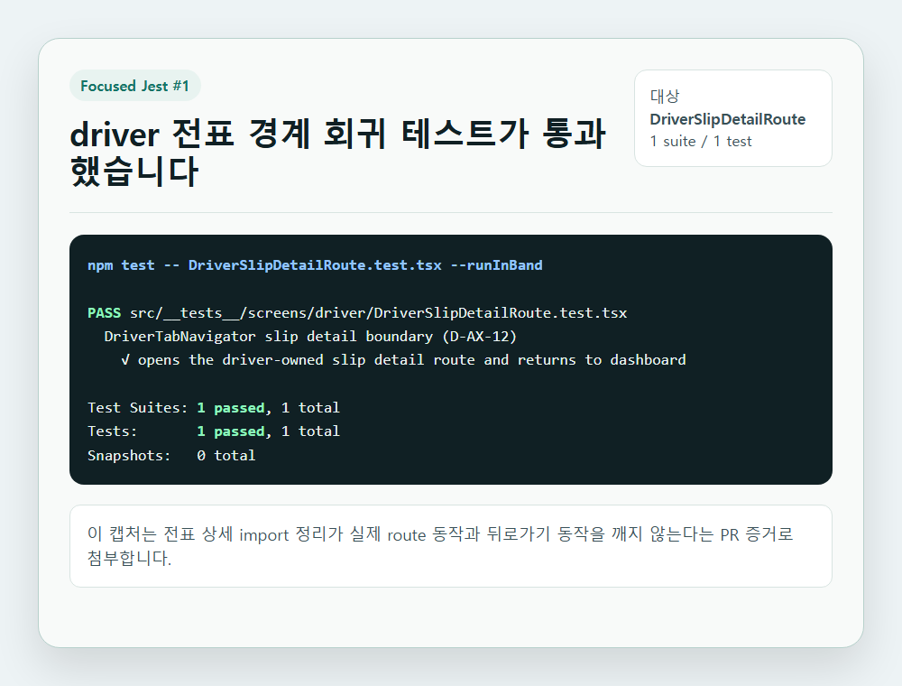
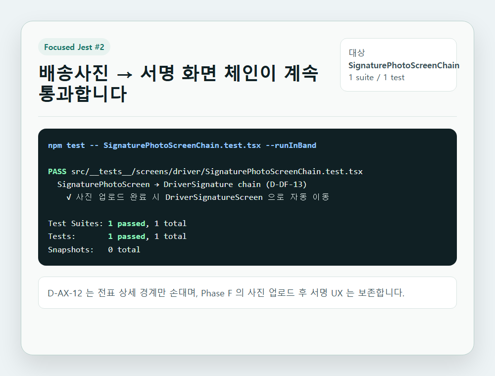
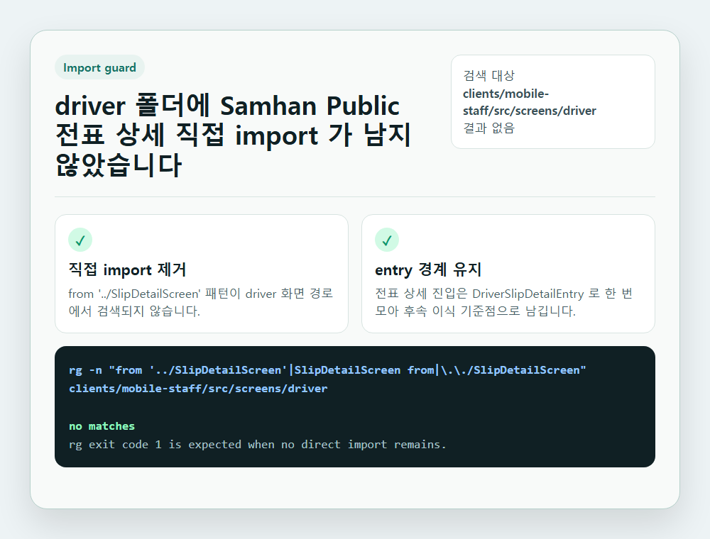

# D-AX-12 mobile cross-import QA scenarios

> 작성일: 2026-05-15  
> 대상: `clients/mobile-staff` driver tab slip detail boundary

## 범위

이번 QA는 실제 Samhan Public `SlipDetailScreen` 기능 검증이 아니라, driver tab 이 해당 화면을 직접 import 하지 않고 `DriverSlipDetailEntry` 경계를 통과하는지 확인한다.

## 시나리오

| ID | 시나리오 | 기대 결과 | 증거 |
|---|---|---|---|
| D-AX-12-01 | Driver dashboard 에서 전표 상세 진입 | `DriverSlipDetailEntry` 가 열리고 Samhan Public `SlipDetailScreen` 직접 render 는 발생하지 않는다. | `DriverSlipDetailRoute.test.tsx` |
| D-AX-12-02 | Driver slip entry 에서 뒤로가기 | dashboard mock 으로 복귀하고 entry 화면은 사라진다. | `DriverSlipDetailRoute.test.tsx` |
| D-AX-12-03 | 배송사진 업로드 후 서명 화면 chain | D-DF-13 기존 흐름이 깨지지 않는다. | `SignaturePhotoScreenChain.test.tsx` |
| D-AX-12-04 | TypeScript contract | `DriverSlipDetailEntry` props 와 `DriverTabNavigator` route props 가 일치한다. | `npm run typecheck` |
| D-AX-12-05 | driver 폴더 direct import 검색 | `../SlipDetailScreen` 직접 import 잔존 없음. | `rg -n "from '../SlipDetailScreen'..." clients/mobile-staff/src/screens/driver` |
| D-AX-12-06 | PR 캡처 가독성 | UI 상태 + 테스트 결과 + import guard 를 1000px 폭 PNG 8장으로 확인한다. | `scripts/generate-d-ax-12-mobile-cross-import-screenshots.ps1` |

## 실행 로그

```powershell
cd clients/mobile-staff
npm test -- DriverSlipDetailRoute.test.tsx --runInBand
npm test -- SignaturePhotoScreenChain.test.tsx --runInBand
npm run typecheck
cd ..\..
rg -n "from '../SlipDetailScreen'|SlipDetailScreen from|\\.\\./SlipDetailScreen" clients/mobile-staff/src/screens/driver
.\scripts\generate-d-ax-12-mobile-cross-import-screenshots.ps1
```

결과:

- Jest targeted: 2 files PASS / 2 tests PASS
- TypeScript: 0 errors
- Direct import search: no matches
- QA screenshots: 8 PNG generated

## PR 캡처

개발책임자 요청에 따라 PR 본문에는 아래 8장을 모두 인라인으로 첨부한다. 모든 캡처는 여러 테스트를 진행한 뒤 GitHub PR 화면에서 잘 보이도록 1000px 폭 mock render PNG 로 생성했다.

| 파일 | 목적 |
|---|---|
| `screenshots/01-driver-slip-guard.png` | driver tab 이 Samhan Public 전표 상세를 직접 열지 않고 `DriverSlipDetailEntry` 안내 경계로 진입하는지 확인 |
| `screenshots/02-signature-chain-regression.png` | D-DF-13 배송사진 업로드 후 서명 화면 이동 흐름이 D-AX-12 변경 후에도 유지되는지 확인 |
| `screenshots/03-driver-route-test-flow.png` | dashboard → driver entry → Samhan slip 미렌더 route assertion 확인 |
| `screenshots/04-driver-back-navigation.png` | entry 뒤로가기 후 dashboard 복귀와 UUID 비공개 확인 |
| `screenshots/05-typecheck-contract.png` | `npm run typecheck` 결과와 props contract 확인 |
| `screenshots/06-jest-driver-route-pass.png` | `DriverSlipDetailRoute.test.tsx` focused Jest PASS 확인 |
| `screenshots/07-jest-signature-chain-pass.png` | `SignaturePhotoScreenChain.test.tsx` focused Jest PASS 확인 |
| `screenshots/08-direct-import-search-guard.png` | driver 폴더 내 `SlipDetailScreen` 직접 import 잔존 없음 확인 |
















